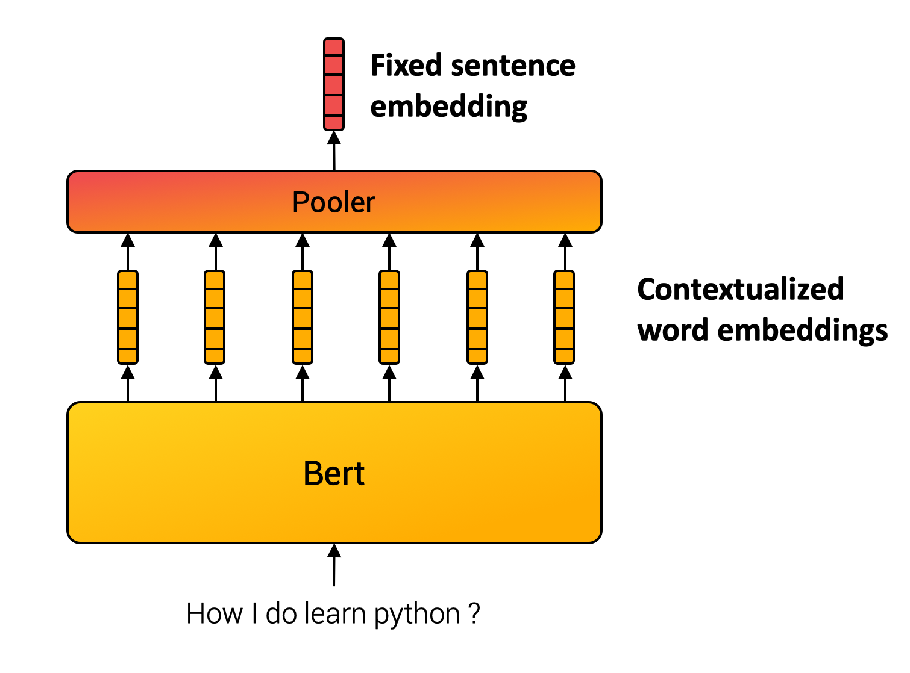
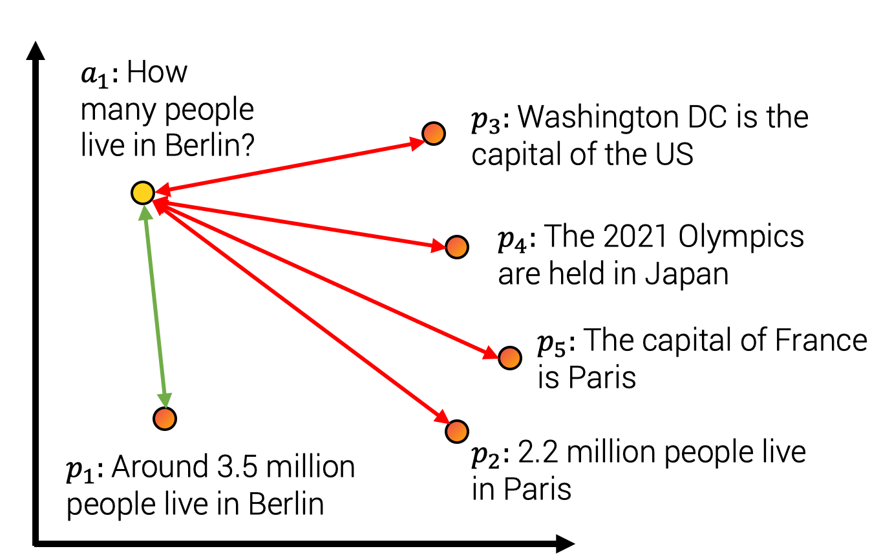
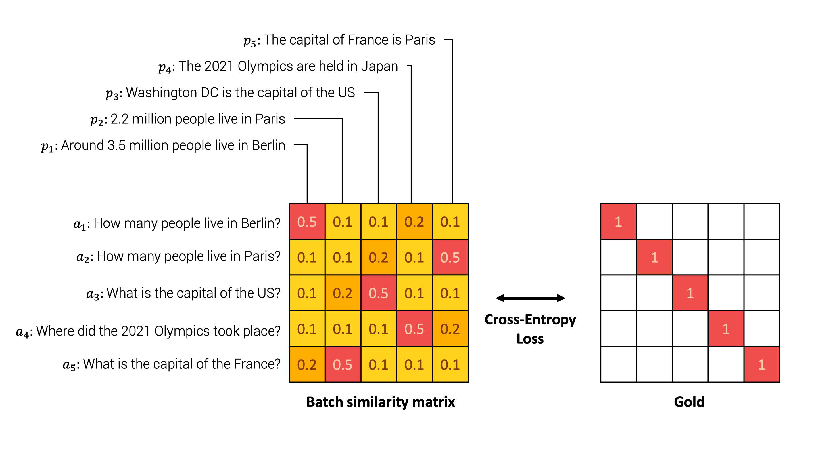
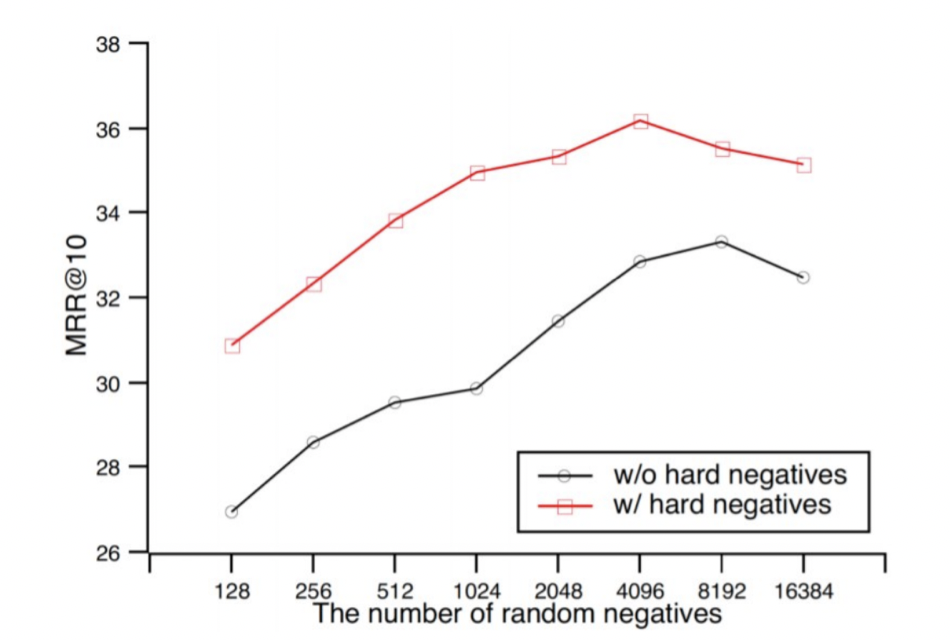

<h1>
    Train a Sentence Embedding Model with 1 Billion Training Pairs
</h1>

    <small>Published September 1, 2021.</small>
    <a target="_blank" class="btn no-underline text-sm mb-5 font-sans" href="https://github.com/huggingface/blog/blob/main/1b-sentence-embeddings.md">
        Update on GitHub
    </a>

    <a href="/asi">
        
        

            <code>asi</code>
            Antoine Simoulin
            guest
        

    </a>

**Sentence embedding** is a method that maps sentences to vectors of real numbers. Ideally, these vectors would capture the semantic of a sentence and be highly generic. Such representations could then be used for many downstream applications such as clustering, text mining, or question answering.

We developed state-of-the-art sentence embedding models as part of the project ["Train the Best Sentence Embedding Model Ever with 1B Training Pairs"](https://discuss.huggingface.co/t/train-the-best-sentence-embedding-model-ever-with-1b-training-pairs/7354). This project took place during the [Community week using JAX/Flax for NLP & CV](https://discuss.huggingface.co/t/open-to-the-community-community-week-using-jax-flax-for-nlp-cv/7104), organized by Hugging Face.  We benefited from efficient hardware infrastructure to run the project: 7 TPUs v3-8, as well as guidance from Google’s Flax, JAX, and Cloud team members about efficient deep learning frameworks!

## Training methodology

### Model

Unlike words, we can not define a finite set of sentences. Sentence embedding methods, therefore, compose inner words to compute the final representation. For example, SentenceBert model ([Reimers and Gurevych, 2019](https://aclanthology.org/D19-1410.pdf)) uses Transformer, the cornerstone of many NLP applications, followed by a pooling operation over the contextualized word vectors. (c.f. Figure below.)

### Multiple Negative Ranking Loss

The parameters from the composition module are usually learned using a self-supervised objective. For the project, we used a contrastive training method illustrated in the figure below. We constitute a dataset with sentence pairs \\( (a_i, p_i) \\) such that sentences from the pair have a close meaning. For example, we consider pairs such as (query, answer-passage), (question, duplicate_question),(paper title, cited paper title). Our model is then trained to map pairs \\( (a_i , p_i) \\) to close vectors while assigning unmatched pairs \\( (a_i , p_j), i \neq j \\) to distant vectors in the embedding space. This training method is also called training with in-batch negatives, InfoNCE or NTXentLoss.

Formally, given a batch of training samples, the model optimises the following [loss function](https://github.com/UKPLab/sentence-transformers/blob/master/sentence_transformers/losses/MultipleNegativesRankingLoss.py):

$$-\frac{1}{n}\sum_{i=1}^n\frac{exp(sim(a_i, p_i))}{\sum_j exp(sim(a_i, p_j))}$$

An illustrative example can be seen below. The model first embeds each sentence from every pair in the batch. Then, we compute a similarity matrix between every possible pair \\( (a_i, p_j) \\). We then compare the similarity matrix with the ground truth, which indicates the original pairs. Finally, we perform the comparison using the cross entropy loss.

Intuitively, the model should assign high similarity to the sentences « How many people live in Berlin? » and « Around 3.5 million people live in Berlin » and low similarity to other negative answers such as « The capital of France is Paris » as detailed in the Figure below.

In the loss equation, `sim` indicates a similarity function between \\( (a, p) \\). The similarity function could be either the Cosine-Similarity or the Dot-Product operator. Both methods have their pros and cons summarized below ([Thakur et al., 2021](https://arxiv.org/abs/2104.08663), [Bachrach et al., 2014](https://dl.acm.org/doi/10.1145/2645710.2645741)):

| Cosine-similarity   | Dot-product |
|---------------------|-------------|
| Vector has highest similarity to itself since \\( cos(a, a)=1 \\).  |  Other vectors can have higher dot-products \\( dot(a, a) < dot (a, b) \\). |
| With normalised vectors it is equal to the dot product. The max vector length is equals 1.  | It might be slower with certain approximate nearest neighbour methods since the max vector not known. |
| With normalised vectors, it is proportional to euclidian distance. It works with k-means clustering.  | It does not work with k-means clustering.  |

In practice, we used a scaled similarity because score differences tends to be too small and apply a scaling factor \\( C \\) such that \\( sim_{scaled}(a, b) = C * sim(a, b) \\) with typically \\( C = 20 \\) ([Henderson and al., 2020]([https://doi.org/10.18653/v1/2020.findings-emnlp.196), [Radford and al., 2021](http://proceedings.mlr.press/v139/radford21a.html)).

### Improving Quality with Better Batches

In our method, we build batches of sample pairs \\( (a_i , p_i) \\). We consider all other samples from the batch, \\( (a_i , p_j), i \neq j \\), as negatives sample pairs. The batch composition is therefore a key training aspect. Given the literature in the domain, we mainly focused on three main aspects of the batch.

#### 1. Size matters

In contrastive learning, a larger batch size is synonymous with better performance. As shown in the Figure extracted from Qu and al., ([2021](https://doi.org/10.18653/v1/2021.naacl-main.466)), a larger batch size increases the results.

#### 2. Hard Negatives

In the same figure, we observe that including hard negatives also improves performance. Hard negatives are sample \\( p_j \\) which are hard to distinguish from \\( p_i \\). In our example, it could be the pairs « What is the capital of France? » and « What is the capital of the US? » which have a close semantic content and requires precisely understanding the full sentence to be answered correctly. On the contrary, the samples  « What is the capital of France? » and «How many Star Wars movies is there?» are less difficult to distinguish since they do not refer to the same topic.

#### 3. Cross dataset batches

We concatenated multiple datasets to train our models. We built a large batch and gathered samples from the same batch dataset to limit the topic distribution and favor hard negatives. However, we also mix at least two datasets in the batch to learn a global structure between topics and not only a local structure within a topic.

## Training infrastructure and data

As mentioned earlier, the quantity of data and the batch size directly impact the model performances. As part of the project, we benefited from efficient hardware infrastructure. We trained our models on [TPUs](https://cloud.google.com/tpu) which are compute units developed by Google and super efficient for matrix multiplications. TPUs have some [hardware specificities](https://huggingface.co/docs/accelerate/quicktour.html#training-on-tpu) which might require some specific code implementation.

Additionally, we trained models on a large corpus as we concatenated multiple datasets up to 1 billion sentence pairs! All datasets used are detailed for each model in the [model card](https://huggingface.co/flax-sentence-embeddings/all_datasets_v3_MiniLM-L12).

## Conclusion

You can find all models and datasets we created during the challenge in our [HuggingFace repository](https://huggingface.co/flax-sentence-embeddings). We trained 20 general-purpose Sentence Transformers models such as Mini-LM ([Wang and al., 2020](https://proceedings.neurips.cc/paper/2020/hash/3f5ee243547dee91fbd053c1c4a845aa-Abstract.html)), RoBERTa ([liu and al., 2019](https://arxiv.org/abs/1907.11692 )), DistilBERT ([Sanh and al., 2020](http://arxiv.org/abs/1910.01108)) and MPNet ([Song and al., 2020](https://proceedings.neurips.cc/paper/2020/hash/c3a690be93aa602ee2dc0ccab5b7b67e-Abstract.html)). Our models achieve SOTA on multiple general-purpose Sentence Similarity evaluation tasks. We also shared [8 datasets](https://huggingface.co/flax-sentence-embeddings) specialized for Question Answering, Sentence-Similarity, and Gender Evaluation. 

General sentence embeddings might be used for many applications. We built a [Spaces demo](https://huggingface.co/spaces/flax-sentence-embeddings/sentence-embeddings) to showcase several applications:
* The **sentence similarity** module compares the similarity of the main text with other texts of your choice. In the background, the demo extracts the embedding for each text and computes the similarity between the source sentence and the other using cosine similarity.
* **Asymmetric QA** compares the answer likeliness of a given query with answer candidates of your choice.
* **Search / Cluster** returns nearby answers from a query. For example, if you input « python », it will retrieve closest sentences using dot-product distance.
* **Gender Bias Evaluation** report *inherent gender bias* in training set via random sampling of the sentences. Given an anchor text without mentioning gender for target occupation and 2 propositions with gendered pronouns, we compare if models assign a higher similarity to a given proposition and therefore evaluate their proportion to favor a specific gender.

The [Community week using JAX/Flax for NLP & CV](https://discuss.huggingface.co/t/open-to-the-community-community-week-using-jax-flax-for-nlp-cv/7104) has been an intense and highly rewarding experience! The quality of Google’s Flax, JAX, and Cloud and Hugging Face team members' guidance and their presence helped us all learn a lot. We hope all projects had as much fun as we did in ours. Whenever you have questions or suggestions, don’t hesitate to contact us!
