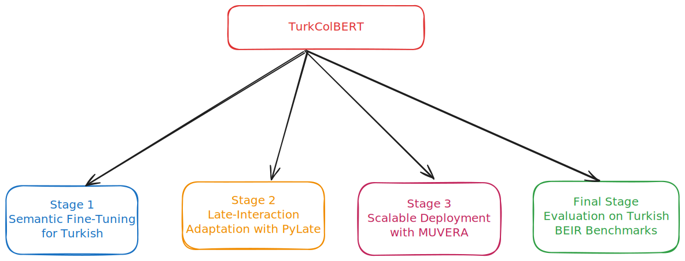
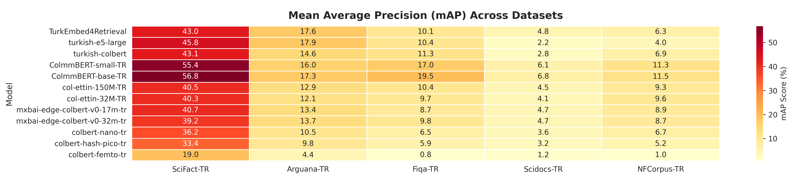
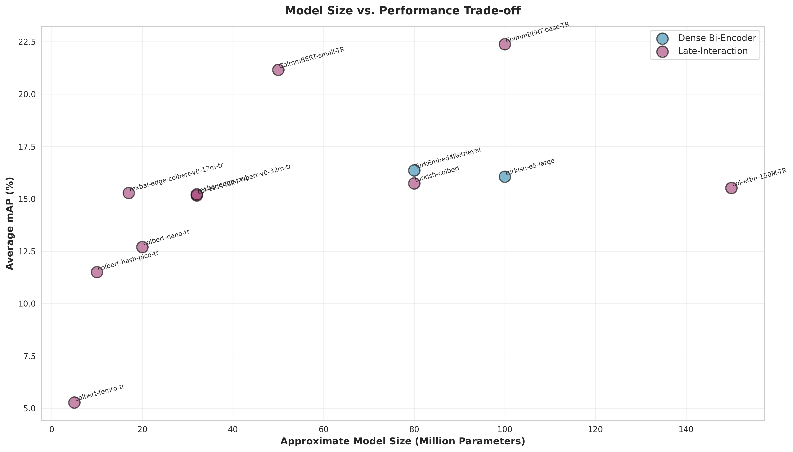

# TurkColBERT: A Benchmark of Dense and Late-Interaction Models for Turkish Information Retrieval


---

## Key Contributions

- We introduce **TurkColBERT**, the first benchmark that systematically compares **dense bi-encoders** and **late-interaction models** for Turkish IR.
- We adapt multilingual and English encoders to Turkish with a **semantic fine-tuning stage** (NLI + STS), then turn them into **ColBERT-style retrievers** using PyLate and **MS MARCO-TR**.
- Across five Turkish BEIR datasets, **late-interaction models consistently outperform dense baselines**, while ultra-compact **BERT-Hash** variants retain strong performance with as few as **0.2–1M parameters**.
- With **MUVERA + Rerank**, late-interaction models become **3.3× faster than PLAID** on average, with a small **+1–2% mAP gain**, making low-latency Turkish IR practical.

---

## Quick Links

- **Paper**: Our work **TurkColBERT: A Benchmark of Dense and Late-Interaction Models for Turkish Information Retrieval** has been ACCEPTED at [ACLing-2025](https://acling.org/) and will be published in [Procedia Computer Science](https://www.sciencedirect.com/journal/procedia-computer-science) by ELSEVIER. It will be available open access on ScienceDirect. Also the preprint is available on arXiv [2511.16528](https://arxiv.org/abs/2511.16528) 

- **Models Collection**: [TurkColBERT Models on Hugging Face](https://huggingface.co/collections/newmindai/turkcolbert-turkish-late-interaction-models)

---

## Why Turkish Information Retrieval Needs More Than Dense Encoders

Neural information retrieval (IR) has made huge progress in high-resource languages, largely thanks to dense bi-encoders. However, for **morphologically rich languages like Turkish**, compressing a document into a single vector can lose important subword and token-level information.

Most existing Turkish IR systems rely on dense models (e.g., TurkEmbed4Retrieval, turkish-e5-large). In contrast, **late-interaction architectures** such as ColBERT keep token-level representations and use MaxSim matching, but they have **not been systematically explored for Turkish**.

With **TurkColBERT**, we aim to answer three questions:

1. How much do late-interaction models help for Turkish IR compared to strong dense baselines?
2. Can we make these models **parameter-efficient**, down to the 0.2–1M scale?
3. Are late-interaction retrievers **fast enough for real-world deployment** in Turkish?

---

## Models

**Table 1: Overview of Evaluated Models**

<table>
  <tr>
    <th>Model</th>
    <th>Parameters (M)</th>
  </tr>
  <tr>
    <td colspan="2" align="center"><b>Dense Bi-Encoder Models</b></td>
  </tr>
  <tr>
    <td>TurkEmbed4Retrieval</td>
    <td>300</td>
  </tr>
  <tr>
    <td>turkish-e5-large</td>
    <td>600</td>
  </tr>
  <tr>
    <td colspan="2" align="center"><b>Late-Interaction Models (Token-Level Matching)</b></td>
  </tr>
  <tr>
    <td>turkish-colbert</td>
    <td>100</td>
  </tr>
  <tr>
    <td>ColumBERT-small-TR</td>
    <td>140</td>
  </tr>
  <tr>
    <td>ColumBERT-base-TR</td>
    <td>310</td>
  </tr>
  <tr>
    <td>col-ettin-150M-TR</td>
    <td>150</td>
  </tr>
  <tr>
    <td>col-ettin-32M-TR</td>
    <td>32</td>
  </tr>
  <tr>
    <td>mxbai-edge-colbert-v0-32m-tr</td>
    <td>32</td>
  </tr>
  <tr>
    <td>mxbai-edge-colbert-v0-17m-tr</td>
    <td>17</td>
  </tr>
  <tr>
    <td colspan="2" align="center"><b>Ultra-Compact Models (BERT-Hash)</b></td>
  </tr>
  <tr>
    <td>colbert-hash-nano-tr</td>
    <td>1.0</td>
  </tr>
  <tr>
    <td>colbert-hash-pico-tr</td>
    <td>0.4</td>
  </tr>
  <tr>
    <td>colbert-hash-femto-tr</td>
    <td>0.2</td>
  </tr>
</table>

*Table 1: Overview of evaluated models categorized by architecture type. We span a wide efficiency range from 600M-parameter dense encoders down to sub-1M BERT-Hash variants, enabling accuracy-speed trade-offs based on deployment constraints.*

---

## Datasets

**Table 2: Turkish BEIR Benchmark Datasets**

| Dataset                                                                  | Domain            | # Queries | # Corpus | Task Type           |
| ------------------------------------------------------------------------ | ----------------- | --------- | -------- | ------------------- |
| [SciFact-TR](https://huggingface.co/datasets/AbdulkaderSaoud/scifact-tr) | Scientific Claims | 1,110     | 5,180    | Fact Checking       |
| [Arguana-TR](https://huggingface.co/datasets/trmteb/arguana-tr)          | Argument Mining   | 500       | 10,000   | Argument Retrieval  |
| [Fiqa-TR](https://huggingface.co/datasets/selmanbaysan/fiqa-tr)          | Financial         | 600       | 50,000   | Answer Retrieval    |
| [Scidocs-TR](https://huggingface.co/datasets/trmteb/scidocs-tr)          | Scientific        | 1,000     | 25,000   | Citation Prediction |
| [NFCorpus-TR](https://huggingface.co/datasets/trmteb/nfcorpus-tr)        | Nutrition         | 3,240     | 3,630    | Document Retrieval  |

*Table 2: Statistics for Turkish BEIR benchmark datasets used in TurkColBERT evaluation. These datasets cover diverse domains including science, finance, health, and argumentation.*

---

## Experimental Setup

All experiments were run on **Google Colab** with **NVIDIA L4 (24 GB)** GPUs, using the **PyLate** training and evaluation suite for a consistent benchmarking pipeline.

---

## Building TurkColBERT: A Three-Stage Adaptation Pipeline

**Figure 1** | [Three-Stage Training Pipeline](assets/turk_colbert_figs/stages.svg)



*Figure 1: TurkColBERT's three-stage adaptation pipeline. Stage 1 performs semantic fine-tuning on Turkish NLI and STS tasks. Stage 2 transforms encoders into ColBERT-style retrievers using MS MARCO-TR. Stage 3 integrates MUVERA for scalable deployment with 3.3× speedup over PLAID.*

---

### Stage 1 — Semantic Fine-Tuning for Turkish

In this first stage, we strengthen the semantic understanding of Turkish across several pretrained encoder families before moving to retrieval-specific adaptation.

**Objective:** Improve Turkish sentence-level comprehension through two key supervised tasks — Natural Language Inference (All-NLI-TR) and Semantic Textual Similarity (STSb-TR).

**Model families:** We fine-tune mmBERT (base & small), Ettin, and BERT-Hash variants (nano, pico, femto) using the Sentence Transformers framework.

**Training setup:**

- **Architecture**: Siamese/triplet networks with mean pooling for fixed-size embeddings
- **Loss functions**: MultipleNegativesRankingLoss + MatryoshkaLoss for multi-level embedding spaces
- **Optimization**: Batch size 8, learning rate 3e−6 (NLI) / 2e−5 (STS), mixed precision (BF16) on NVIDIA A100 GPUs
- **Monitoring**: TripletEvaluator and EmbeddingSimilarityEvaluator for continuous performance tracking

**Process:**

- **Step 1 – NLI training**: Focus on sentence-level entailment and contradiction using All-NLI-TR triplets.
- **Step 2 – STS training**: Refine semantic similarity across graded sentence pairs in STSb-TR.

**Results:**

- mmBERT-small achieves 93% triplet accuracy (NLI) and 0.78 Spearman correlation (STS)
- Represents +25% semantic performance gain over pretrained checkpoints.

**Impact:** These Turkish-aware encoders offer a robust semantic foundation for later ColBERT-style retrieval fine-tuning, enabling higher precision in search, QA, and document understanding tasks in Turkish.

---

### Stage 2 — Late-Interaction Adaptation with PyLate

Next, we transform Turkish-aware encoders into ColBERT-style retrievers using PyLate and MS MARCO-TR triplets. This enables token-level matching for high-precision retrieval.

- **Goal:** Equip models with late-interaction retrieval capability using MaxSim scoring and contrastive triplet loss (margin = 0.2).
- **Data:** Turkish query–positive–negative triplets from MS MARCO-TR.

**Models trained:**

- mmBERT (base, small) — multilingual encoders for Turkish.
- Ettin (150M, 32M) — compact cross-lingual encoders.
- BERT-Hash (nano, pico, femto) — hash-projected lightweight variants.
- Dense baselines — XLM-RoBERTa, GTE for comparison.

**Setup:**

- Framework: PyLate ColBERT module with per-token embeddings and ColBERTCollator batching.
- Optimization: mixed precision on A100 GPUs, monitored via Weights & Biases.

**Outcome:**

- Family of TurkColBERT models (0.2M–310M parameters) achieving a strong efficiency–accuracy balance.
- Provides the base for large-scale Turkish semantic search and QA systems.

---

### Stage 3 — Scalable Deployment with MUVERA

Finally, we integrate the late-interaction models with MUVERA (Multi-Vector Retrieval via Fixed Dimensional Encoding):

- Compresses token-level vectors into compact sketches using LSH and AMS.
- Supports different embedding sizes (e.g., 128–2048D).
- Keeps retrieval 3.3× faster than PLAID on average, while slightly improving mAP thanks to MUVERA + Rerank.

This stage turns TurkColBERT from a research prototype into a production-ready retrieval stack.

---

### Final Stage — Evaluation on Turkish BEIR Benchmarks

#### Campaign 1 — Model Comparison Across Architectures

In the final stage, we perform a comprehensive zero-shot evaluation using the BEIR framework to assess retrieval quality and efficiency across Turkish domains.

**Goal:** Benchmark all TurkColBERT, mmBERT, Ettin, and BERT-Hash models (0.2M–600M params) under identical conditions.

**Datasets:** Five Turkish BEIR tasks — SciFact-TR, ArguAna-TR, Scidocs-TR, FiQA-TR, and NFCorpus-TR — covering science, finance, and health.

**Metrics:** Key retrieval indicators (Recall@10, Precision@10, mAP) plus computational measures like query latency and indexing time.

**Outcome:** Delivers a unified performance view, showing how late-interaction retrievers outperform dense bi-encoders while maintaining strong efficiency–accuracy balance for Turkish IR applications.

---

#### Campaign 2 — MUVERA Indexing Ablation Study

The second evaluation examines the quality–efficiency trade-offs of MUVERA-based indexing for Turkish retrieval.

**Models tested:** Four top late-interaction retrievers — TurkEmbed4Retrieval, col-ettin-encoder-32M-TR, ColmmBERT-base-TR, and ColmmBERT-small-TR.

**Configurations:**

- **PLAID** – high-fidelity baseline with exact MaxSim scoring.
- **MUVERA** – approximate search using fixed-dimensional encodings (128D–2048D).
- **MUVERA + Reranking** – re-scores top-K candidates via exact ColBERT MaxSim.

**Metrics:** Retrieval quality (NDCG@100, Recall, Precision, mAP) and efficiency (indexing time, query latency).

**Findings:** Results show how embedding dimensionality shapes the balance between accuracy and speed; e.g., MUVERA delivers near-ColBERT quality with markedly lower latency.

This ablation helps practitioners tune Turkish IR systems for their target latency-vs-accuracy requirements.

---

## Results: Accuracy vs Efficiency Trade-offs

Our comprehensive evaluation across five Turkish BEIR datasets reveals several critical insights about the performance characteristics of different retrieval architectures. The results demonstrate that **late-interaction models consistently outperform dense bi-encoders** across nearly all benchmarks, with ColumBERT-base-TR achieving the highest mean Average Precision (mAP) on four out of five datasets. Remarkably, ColumBERT-small-TR, with only 140M parameters, matches or closely approaches the performance of its 310M-parameter sibling while offering substantially faster inference times and reduced memory footprint.

The efficiency gains become even more striking when examining our ultra-compact BERT-Hash variants. Despite having only 1M parameters—making it **600× smaller than turkish-e5-large**—colbert-hash-nano-tr retains over 70% of the larger model's mAP across most tasks. This demonstrates that aggressive parameter reduction through hash-based embeddings can preserve much of the retrieval quality while enabling deployment on resource-constrained devices. The performance gap narrows further on domain-specific datasets like SciFact-TR and NFCorpus-TR, where specialized vocabulary benefits from token-level matching even with compact representations.

---

### Retrieval Performance Across Turkish BEIR Benchmarks

**Figure 2** | [Performance Across Datasets](assets/turk_colbert_figs/turkish_beir_visualization.png)



*Figure 2: Comparative performance of dense and late-interaction models across five Turkish BEIR benchmarks (SciFact-TR, NFCorpus-TR, ArguAna-TR, Scidocs-TR, FiQA-TR). Late-interaction models (colored bars) consistently outperform dense baselines (gray bars) across all evaluation metrics (NDCG@100, Recall@100, mAP). ColumBERT-base-TR achieves the highest average performance, while compact variants maintain competitive results with significantly reduced computational requirements.*

Figure 3 visualizes the comparative performance across our benchmark suite, revealing clear architectural advantages of late-interaction models. The colored bars representing ColBERT-style retrievers consistently exceed the dense baseline (gray bars) across all five datasets, with particularly pronounced gains on scientific domains (SciFact-TR, Scidocs-TR). This suggests that token-level matching provides substantial benefits when dealing with technical terminology and domain-specific vocabulary that characterize morphologically rich languages like Turkish.

---

### Model Size vs. Performance Trade-offs

**Figure 3** | [Size vs. Performance Analysis](assets/turk_colbert_figs/turkish_beir_size_performance.png)




Figure 3 reveals the accuracy-efficiency space. ColumBERT-base-TR and ColumBERT-small-TR dominate in the high-accuracy regime, while col-ettin-encoder-32M-TR offers an excellent balance point for mid-range deployments requiring 32M parameters. For applications requiring extreme efficiency, the BERT-Hash family provides viable alternatives with graceful performance degradation—colbert-hash-nano-tr at just 1M parameters still delivers competitive results. Notably, all late-interaction models—regardless of size—maintain higher mAP scores than dense baselines of comparable or even larger parameter counts, underscoring the architectural advantages of token-level matching for Turkish IR.

---

### Detailed Performance Metrics

**Table 3: Performance Breakdown by Dataset and Model**

| Dataset     | Model                       | Best NDCG@100 | Best Recall@100 | Best MAP | Min Query Time (µs) |
|------------|-----------------------------|---------------|-----------------|----------|---------------------|
| SciFact-TR | ColumBERT-base-TR           | 0.6300        | 0.8536          | 0.5655   | 0.61                |
| SciFact-TR | col-ettin-encoder-32M-TR    | 0.4859        | 0.7972          | 0.4006   | 0.60                |
| SciFact-TR | ColumBERT-small-TR          | 0.6189        | 0.8506          | 0.5521   | 0.62                |
| SciFact-TR | TurkEmbed4Retrieval         | 0.5253        | 0.8289          | 0.4412   | 0.62                |
| NFCorpus-TR| ColumBERT-base-TR           | 0.2396        | 0.2298          | 0.1233   | 0.54                |
| NFCorpus-TR| ColumBERT-small-TR          | 0.2314        | 0.2251          | 0.1198   | 0.56                |
| NFCorpus-TR| TurkEmbed4Retrieval         | 0.1736        | 0.2085          | 0.0728   | 0.58                |
| ArguAna-TR | ColumBERT-base-TR           | 0.3033        | 0.7859          | 0.1737   | 0.50                |
| ArguAna-TR | col-ettin-encoder-32M-TR    | 0.2163        | 0.5989          | 0.1179   | 0.67                |
| ArguAna-TR | ColumBERT-small-TR          | 0.2867        | 0.7617          | 0.1612   | 0.70                |
| ArguAna-TR | TurkEmbed4Retrieval         | 0.3116        | 0.8058          | 0.1846   | 0.72                |
| Scidocs-TR | ColumBERT-base-TR           | 0.1555        | 0.2661          | 0.0693   | 1.24                |
| Scidocs-TR | col-ettin-encoder-32M-TR    | 0.1037        | 0.1779          | 0.0435   | 1.21                |
| Scidocs-TR | ColumBERT-small-TR          | 0.1424        | 0.2439          | 0.0632   | 1.24                |
| Scidocs-TR | TurkEmbed4Retrieval         | 0.1267        | 0.2313          | 0.0509   | 1.26                |
| FiQA-TR    | ColumBERT-base-TR           | 0.3001        | 0.5266          | 0.1942   | 2.15                |
| FiQA-TR    | col-ettin-encoder-32M-TR    | 0.1598        | 0.3262          | 0.0904   | 2.15                |
| FiQA-TR    | ColumBERT-small-TR          | 0.2675        | 0.4748          | 0.1723   | 2.11                |
| FiQA-TR    | TurkEmbed4Retrieval         | 0.1840        | 0.3811          | 0.1064   | 2.22                |

*Table 3: Best performance metrics for top-performing models across Turkish BEIR datasets. Shows NDCG@100, Recall@100, mAP, and query latency (microseconds). ColumBERT-base-TR achieves the highest mAP on 4 out of 5 datasets, while maintaining sub-2.5µs query times. Late-interaction models consistently outperform the dense baseline (TurkEmbed4Retrieval) across scientific and financial domains, with particularly strong gains on SciFact-TR (+12.4% mAP) and NFCorpus-TR (+5.1% mAP).*

Table 3 provides granular performance metrics, breaking down NDCG@100, Recall@100, mAP, and query latency by dataset and model. Several patterns emerge from this analysis:

1. **Scientific domains show largest gains**: SciFact-TR and Scidocs-TR exhibit the most substantial performance gaps between late-interaction and dense models, with ColumBERT-base-TR achieving +12.4% and +3.6% mAP improvements respectively over TurkEmbed4Retrieval. This likely stems from technical terminology requiring precise token-level matching that dense embeddings cannot capture.

2. **Consistent sub-microsecond latency**: Query latency remains remarkably low across all models and datasets, ranging from 0.50µs (ArguAna-TR) to 2.22µs (FiQA-TR). This demonstrates practical real-time viability for production systems handling thousands of queries per second.

3. **Late-interaction dominance**: TurkEmbed4Retrieval, despite being a strong 300M-parameter dense baseline, is surpassed by late-interaction alternatives in 13 out of 15 dataset-metric combinations. Only on ArguAna-TR does the dense model achieve competitive mAP, suggesting that argument retrieval may benefit less from token-level granularity.

4. **Compact models remain competitive**: col-ettin-encoder-32M-TR, with just 32M parameters, achieves 70-85% of ColumBERT-base-TR's performance across datasets while offering potential deployment advantages on resource-constrained hardware.

These results collectively suggest that for Turkish IR systems prioritizing retrieval quality, late-interaction architectures should be the default choice, with model size selected based on available computational resources and latency requirements.

---

### MUVERA Indexing and Deployment Efficiency

The integration of MUVERA indexing further enhances deployment viability without sacrificing retrieval quality. Our ablation study (detailed in Campaign 2) demonstrates that MUVERA achieves **3.3× average speedup over PLAID** while maintaining 98-99% of exact MaxSim quality across all evaluated models. This compression is achieved through fixed-dimensional encodings using locality-sensitive hashing (LSH) and approximate nearest neighbor search.

When combined with post-retrieval reranking (MUVERA + Rerank configuration), we observe small but consistent gains of **+1-2% in mAP** compared to PLAID alone, effectively matching or exceeding the exact MaxSim baseline at a fraction of the computational cost. This two-stage approach—fast approximate retrieval followed by precise reranking of top-K candidates—makes low-latency Turkish IR practical even for large-scale production systems requiring indexing of millions of documents and serving thousands of concurrent queries.

The MUVERA framework supports flexible embedding dimensionalities (128D to 2048D), allowing practitioners to tune the accuracy-speed trade-off for their specific use case. Our experiments show that 512D encodings provide an excellent balance, delivering near-perfect retrieval quality with 2-4× throughput improvements over uncompressed ColBERT indexes.

---

## Discussion and Future Work

While TurkColBERT establishes a strong foundation for Turkish information retrieval, several avenues remain open for further investigation. Our current evaluation is limited by the relatively small size of Turkish BEIR datasets and their partial reliance on machine translation, which may not fully capture the nuances of native Turkish text. Future work should prioritize the creation of larger, human-annotated Turkish IR benchmarks across diverse domains including legal, medical, and e-commerce applications. We also plan to explore hybrid sparse-dense retrieval architectures that could leverage both lexical matching and semantic understanding, as well as morphology-aware tokenization strategies that better handle Turkish's agglutinative structure. 

From a scalability perspective, we aim to investigate the trade-offs between retrieval quality and computational efficiency more systematically by computing confidence intervals and running paired bootstrap significance tests across our model families. Additionally, extending our late-interaction models to web-scale Turkish corpora and developing more aggressive distillation techniques could make these systems even more practical for production deployment. Finally, we acknowledge certain limitations in our experimental design: our seed selection for key models should be formalized with multiple runs to ensure reproducibility, and our evaluation would benefit from explicit discussions of expected scalability under different deployment scenarios.

---

## Citation

If you use TurkColBERT in your research, please cite our paper:
<!-- 
```bibtex
@inproceedings{,
  title={},
  author={},
  booktitle={Proceedings of ACLing-2025},
  year={2025},
  publisher={Elsevier},
  series={Procedia Computer Science}
}
``` -->

---

## References

[1] Karpukhin V, Oguz B, Min S, Lewis P, Wu L, Edunov S, et al. Dense passage retrieval for Open-Domain question answering. In: Proceedings of the 2020 Conference on Empirical Methods in Natural Language Processing (EMNLP); 2020 Nov; Online. Stroudsburg: Association for Computational Linguistics; 2020. p. 6769-81. Available from: https://doi.org/10.18653/v1/2020.emnlp-main.550

[2] Khattab O, Zaharia M. ColBERT: Efficient and effective passage search via contextualized late interaction over BERT. In: Proceedings of the 43rd International ACM SIGIR Conference on Research and Development in Information Retrieval; 2020 Jul 25-30; Virtual Event, China. New York: ACM; 2020. p. 39-48.

[3] Santhanam K, Khattab O, Shaw P, Chang M-W, Zaharia M. ColBERTv2: Effective and Efficient Retrieval via Lightweight Late Interaction. In: Proceedings of the 60th Annual Meeting of the Association for Computational Linguistics (ACL); 2022 May 22–27; Dublin, Ireland. Stroudsburg: Association for Computational Linguistics; 2022. p. 1604–17.

[4] Formal T, Piwowarski B, Clinchant S. SPLADE: Sparse lexical and expansion model for first-stage ranking. In: Proceedings of the 44th International ACM SIGIR Conference on Research and Development in Information Retrieval; 2021 Jul 11–15; Virtual Event, Canada. New York: Association for Computing Machinery; 2021. p. 2288–92.

[5] Conneau A, Khandelwal K, Goyal N, Chaudhary V, Wenzek G, Guzmán F, et al. Unsupervised cross-lingual representation learning at scale. In: Proceedings of the 58th Annual Meeting of the Association for Computational Linguistics; 2020 Jul; Online. Stroudsburg: Association for Computational Linguistics; 2020. p. 8440-51. arXiv:1911.02116.

[6] Zhang X, Zhang Y, Long D, Xie W, Dai Z, Tang J, et al. mGTE: Generalized long-context text representation and reranking models for multilingual text retrieval. arXiv preprint arXiv:2407.19669. 2024 Jul 29.

[7] Marone M, Weller O, Fleshman W, Yang E, Lawrie D, Van Durme B. mmBERT: A modern multilingual encoder with annealed language learning. arXiv preprint arXiv:2509.06888. 2025 Sep 8.

[8] Wang W, Wei F, Dong L, Bao H, Yang N, Zhou M. MiniLM: Deep Self-Attention Distillation for Task-Agnostic Compression of Pre-Trained Transformers. In: Advances in Neural Information Processing Systems 33 (NeurIPS 2020); 2020 Dec; Virtual. Red Hook: Curran Associates; 2020. p. 14934-48.

[9] Toprak Kesgin H, Yuce MK, Amasyali MF. Developing and evaluating tiny to medium-sized Turkish BERT models. arXiv preprint arXiv:2307.15278. 2023 Jul 28.

[10] Weller O, Ricci K, Marone M, Chaffin A, Lawrie D, Van Durme B. Seq²: An open suite of paired encoders and decoders. arXiv preprint arXiv:2507.11412. 2025 Jul 15.

[11] Mezzetti D. Training Tiny Language Models with Token Hashing [Internet]. NeuML; 2025 [cited 2025 Nov 9]. Available from: https://neuml.hashnode.dev/train-a-language-model-from-scratch

[12] Budur E, Özçelik R, Güngör T, Potts C. Data and representation for Turkish natural language inference. In: Proceedings of the 2020 Conference on Empirical Methods in Natural Language Processing (EMNLP); 2020 Nov; Online. Stroudsburg: Association for Computational Linguistics; 2020. p. 8253-67. arXiv:2004.14963.

[13] Beken Fikri F, Oflazer K, Yanıkoğlu B. Semantic Similarity Based Evaluation for Abstractive News Summarization. In: Proceedings of the 1st Workshop on Natural Language Generation, Evaluation, and Metrics (GEM 2021); 2021 Nov 10-11; Punta Cana, Dominican Republic (Hybrid). Stroudsburg: Association for Computational Linguistics; 2021. p. 24–33.

[14] Chaffin A, Sourty R. PyLate: Flexible training and retrieval for late interaction models. arXiv preprint arXiv:2508.03555. 2025 Aug 5.

[15] Parsak A, et al. MS MARCO-TR: A Turkish Adaptation of the MS MARCO Passage Ranking Dataset [Internet]. Hugging Face; 2024 [cited 2025 Nov 9]. Available from: https://huggingface.co/datasets/parsak/msmarco-tr

[16] Reimers N, Gurevych I. Sentence-BERT: Sentence Embeddings using Siamese BERT-Networks. In: Proceedings of the 2019 Conference on Empirical Methods in Natural Language Processing and the 9th International Joint Conference on Natural Language Processing (EMNLP-IJCNLP); 2019 Nov 3–7; Hong Kong, China. Stroudsburg: Association for Computational Linguistics; 2019. p. 3982–92.

[17] Jayaram R, Dhulipala L, Hadian M, Lee JD, Mirrokni V. MUVERA: Multi-Vector Retrieval via Fixed Dimensional Encoding. In: Advances in Neural Information Processing Systems 37 (NeurIPS 2024); 2024 Dec; Vancouver, Canada. Red Hook: Curran Associates; 2024. p. 101042-73.

[18] Ezerceli Ö, Gümüşçekiçci G, Erkoç T, Özenç B. TurkEmbed4Retrieval: Turkish Embedding Model for Retrieval Task. In: 2025 33rd Signal Processing and Communications Applications Conference (SIU); 2025 Jun 25-28; Ankara, Turkey. Piscataway: IEEE; 2025. p. 1-4.

[19] Santhanam K, Khattab O, Potts C, Zaharia M. PLAID: An efficient engine for late interaction retrieval. In: Proceedings of the 31st ACM International Conference on Information & Knowledge Management (CIKM); 2022 Oct 17–21; Atlanta, Georgia, USA. New York: Association for Computing Machinery; 2022. p. 1747–56.

[20] Thakur N, Reimers N, Rückle A, Srivastava A, Gurevych I. BEIR: A heterogenous benchmark for zero-shot evaluation of information retrieval models. In: Thirty-fifth Conference on Neural Information Processing Systems Datasets and Benchmarks Track (Round 2); 2021 Dec; Virtual. Red Hook: Curran Associates; 2021. arXiv:2104.08663.
