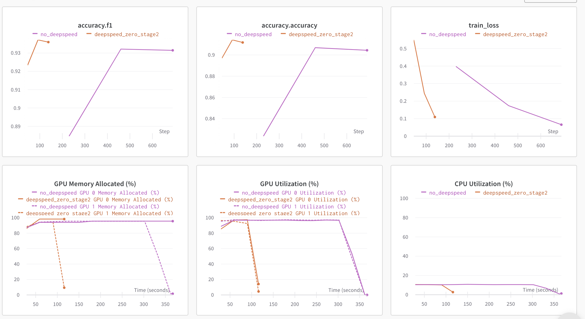
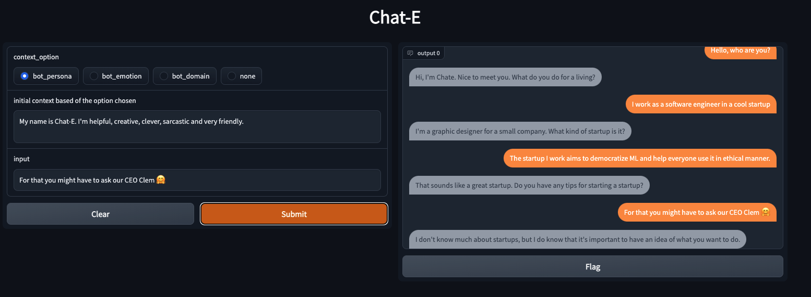

# Accelerate Large Model Training using DeepSpeed


In this post we will look at how we can leverage the **[Accelerate](https://github.com/huggingface/accelerate)** library for training large models which enables users to leverage the ZeRO features of **[DeeSpeed](https://www.deepspeed.ai)**.

# Motivation 🤗
**Tired of Out of Memory (OOM) errors while trying to train large models? We've got you covered. Large models are very performant [1] but difficult to train with the available hardware. To get the most of the available hardware for training large models one can leverage Data Parallelism using ZeRO - Zero Redundancy Optimizer [2]**. 

Below is a short description of Data Parallelism using ZeRO with diagram from this [blog post](https://www.microsoft.com/en-us/research/blog/zero-deepspeed-new-system-optimizations-enable-training-models-with-over-100-billion-parameters/)


(Source: [link](https://www.microsoft.com/en-us/research/blog/zero-deepspeed-new-system-optimizations-enable-training-models-with-over-100-billion-parameters/))

 a. **Stage 1** : Shards optimizer states across data parallel workers/GPUs

 b. **Stage 2** : Shards optimizer states + gradients across data parallel workers/GPUs

 c. **Stage 3**: Shards optimizer states + gradients + model parameters across data parallel workers/GPUs

 d. **Optimizer Offload**: Offloads the gradients + optimizer states to CPU/Disk building on top of ZERO Stage 2

 e. **Param Offload**: Offloads the model parameters to CPU/Disk building on top of ZERO Stage 3

In this blogpost we will look at how to leverage Data Parallelism using ZeRO using Accelerate. **[DeepSpeed](https://github.com/microsoft/deepspeed)**, **[FairScale](https://github.com/facebookresearch/fairscale/)** and **[PyTorch FullyShardedDataParallel (FSDP)](https://pytorch.org/blog/introducing-pytorch-fully-sharded-data-parallel-api/)** have implemented the core ideas of the ZERO paper. These have already been integrated in 🤗 `transformers` Trainer and 🤗 `accelerate` accompanied by great blogs [Fit More and Train Faster With ZeRO via DeepSpeed and FairScale](https://huggingface.co/blog/zero-deepspeed-fairscale) [4] and [Accelerate Large Model Training using PyTorch Fully Sharded Data Parallel](https://huggingface.co/blog/pytorch-fsdp) [5]. We defer the explanation of what goes behind the scenes to those blogs and mainly focus on leveraging DeepSpeed ZeRO using Accelerate.

# Accelerate 🚀:  Leverage DeepSpeed ZeRO without any code changes

**Hardware setup**: 2X24GB NVIDIA Titan RTX GPUs. 60GB RAM.

We will look at the task of finetuning encoder-only model for text-classification. We will use pretrained `microsoft/deberta-v2-xlarge-mnli` (900M params) for finetuning on MRPC GLUE dataset.

The code is available here [run_cls_no_trainer.py](https://github.com/pacman100/accelerate-deepspeed-test/blob/main/src/modeling/run_cls_no_trainer.py). It is similar to the official text-classification example [here](https://github.com/huggingface/transformers/blob/main/examples/pytorch/text-classification/run_glue_no_trainer.py) with the addition of logic to measure train and eval time. Let's compare performance between Distributed Data Parallel (DDP) and DeepSpeed ZeRO Stage-2 in a Multi-GPU Setup.

To enable DeepSpeed ZeRO Stage-2 without any code changes, please run `accelerate config` and leverage the [Accelerate DeepSpeed Plugin](https://huggingface.co/docs/accelerate/deepspeed#accelerate-deepspeed-plugin). 

**ZeRO Stage-2 DeepSpeed Plugin Example**
```bash
compute_environment: LOCAL_MACHINE
deepspeed_config:
 gradient_accumulation_steps: 1
 gradient_clipping: 1.0
 offload_optimizer_device: none
 offload_param_device: none
 zero3_init_flag: false
 zero_stage: 2
distributed_type: DEEPSPEED
fsdp_config: {}
machine_rank: 0
main_process_ip: null
main_process_port: null
main_training_function: main
mixed_precision: fp16
num_machines: 1
num_processes: 2
use_cpu: false
```

Now, run below command for training:
```bash
accelerate launch run_cls_no_trainer.py \
  --model_name_or_path "microsoft/deberta-v2-xlarge-mnli" \
  --task_name "mrpc" \
  --ignore_mismatched_sizes \
  --max_length 128 \
  --per_device_train_batch_size 40 \
  --learning_rate 2e-5 \
  --num_train_epochs 3 \
  --output_dir "/tmp/mrpc/deepspeed_stage2/" \
  --with_tracking \
  --report_to "wandb" \
```

In our Single-Node Multi-GPU setup, the maximum batch size that DDP supports without OOM error is 8. In contrast, DeepSpeed Zero-Stage 2 enables batch size of 40 without running into OOM errors. Therefore, DeepSpeed enables to fit **5X** more data per GPU when compared to DDP. Below is the snapshot of the plots from wandb [run](https://wandb.ai/smangrul/DDP_vs_DeepSpeed_cls_task?workspace=user-smangrul) along with benchmarking table comparing DDP vs DeepSpeed. 



---
| Method | Batch Size Max | Train time per epoch (seconds) | Eval time  per epoch (seconds) | F1 score | Accuracy |
| --- | --- | --- | --- | --- | --- |
| DDP (Distributed Data Parallel) | 8 | 103.57 | 2.04 | 0.931 | 0.904 |
| DeepSpeed ZeRO Stage 2 | **40** | **28.98** | **1.79** | **0.936** | **0.912** |

Table 1: Benchmarking DeepSpeed ZeRO Stage-2 on DeBERTa-XL (900M) model

---
With this bigger batch size, we observe ~**3.5X** speed up in total training time without any drop in perforamnce metrics, all this without changing any code. Yay! 🤗. 

To be able to tweak more options, you will need to use a DeepSpeed config file and minimal code changes. Let's see how to do this.

# Accelerate 🚀:  Leverage a DeepSpeed Config file to tweak more options

First, We will look at the task of finetuning a sequence-to-sequence model for training our own Chatbot. Specifically, we will finetune `facebook/blenderbot-400M-distill` on the [smangrul/MuDoConv](https://huggingface.co/datasets/smangrul/MuDoConv) (Multi-Domain Conversation) dataset. The dataset contains conversations from 10 different data sources covering personas, grounding in specific emotional contexts, goal-oriented (e.g., restaurant reservation) and general wikipedia topics (e.g, Cricket).


The code is available here [run_seq2seq_no_trainer.py](https://github.com/pacman100/accelerate-deepspeed-test/blob/main/src/modeling/run_seq2seq_no_trainer.py). Current pratice to effectively measure the `Engagingness` and `Humanness` of Chatbots is via Human evlauations which are expensive [6]. As such for this example, the metric being tracked is BLEU score (which isn't ideal but is the conventional metric for such tasks). One can adapt the code to train larger T5 models if you have access to GPUs that support `bfloat16` precision else you will run into `NaN` loss values. We will run a quick benchmark on `10000` train samples and `1000` eval samples as we are interested in DeepSpeed vs DDP.

We will leverage the DeepSpeed Zero Stage-2 config [zero2_config_accelerate.json](https://github.com/pacman100/accelerate-deepspeed-test/blob/main/src/modeling/configs/zero2_config_accelerate.json) (given below) For training. for detailed information on the various config features, please refer [DeeSpeed](https://www.deepspeed.ai) documentation.
```json
{
    "fp16": {
        "enabled": "true",
        "loss_scale": 0,
        "loss_scale_window": 1000,
        "initial_scale_power": 15,
        "hysteresis": 2,
        "min_loss_scale": 1
    },
    "optimizer": {
        "type": "AdamW",
        "params": {
            "lr": "auto",
            "weight_decay": "auto",
            "torch_adam": true,
            "adam_w_mode": true
        }
    },
    "scheduler": {
        "type": "WarmupDecayLR",
        "params": {
            "warmup_min_lr": "auto",
            "warmup_max_lr": "auto",
            "warmup_num_steps": "auto",
            "total_num_steps": "auto"
        }
    },
    "zero_optimization": {
        "stage": 2,
        "allgather_partitions": true,
        "allgather_bucket_size": 2e8,
        "overlap_comm": true,
        "reduce_scatter": true,
        "reduce_bucket_size": 2e8,
        "contiguous_gradients": true
    },
    "gradient_accumulation_steps": 1,
    "gradient_clipping": "auto",
    "steps_per_print": 2000,
    "train_batch_size": "auto",
    "train_micro_batch_size_per_gpu": "auto",
    "wall_clock_breakdown": false
}
```

To enable DeepSpeed ZeRO Stage-2 with above config, please run `accelerate config` and provide the config file path when asked. For more details, refer the 🤗 `accelerate` official documentation for [DeepSpeed Config File](https://huggingface.co/docs/accelerate/deepspeed#deepspeed-config-file).

**ZeRO Stage-2 DeepSpeed Config File Example**
```bash
compute_environment: LOCAL_MACHINE
deepspeed_config:
 deepspeed_config_file: /path/to/zero2_config_accelerate.json
 zero3_init_flag: false
distributed_type: DEEPSPEED
fsdp_config: {}
machine_rank: 0
main_process_ip: null
main_process_port: null
main_training_function: main
mixed_precision: fp16
num_machines: 1
num_processes: 2
use_cpu: false
``` 

Now, run below command for training:
```bash
accelerate launch run_seq2seq_no_trainer.py \
    --dataset_name "smangrul/MuDoConv" \
    --max_source_length 128 \
    --source_prefix "chatbot: " \
    --max_target_length 64 \
    --val_max_target_length 64 \
    --val_min_target_length 20 \
    --n_val_batch_generations 5 \
    --n_train 10000 \
    --n_val 1000 \
    --pad_to_max_length \
    --num_beams 10 \
    --model_name_or_path "facebook/blenderbot-400M-distill" \
    --per_device_train_batch_size 200 \
    --per_device_eval_batch_size 100 \
    --learning_rate 1e-6 \
    --weight_decay 0.0 \
    --num_train_epochs 1 \
    --gradient_accumulation_steps 1 \
    --num_warmup_steps 100 \
    --output_dir "/tmp/deepspeed_zero_stage2_accelerate_test" \
    --seed 25 \
    --logging_steps 100 \
    --with_tracking \
    --report_to "wandb" \
    --report_name "blenderbot_400M_finetuning"
```

When using DeepSpeed config, if user has specified `optimizer` and `scheduler` in config, the user will have to use `accelerate.utils.DummyOptim` and `accelerate.utils.DummyScheduler`. Those are the only minor changes that the user has to do. Below we show an example of the minimal changes required when using DeepSpeed config:
```diff
- optimizer = torch.optim.Adam(optimizer_grouped_parameters, lr=args.learning_rate)
+ optimizer = accelerate.utils.DummyOptim(optimizer_grouped_parameters, lr=args.learning_rate)

- lr_scheduler = get_scheduler(
-     name=args.lr_scheduler_type,
-     optimizer=optimizer,
-     num_warmup_steps=args.num_warmup_steps,
-     num_training_steps=args.max_train_steps,
- )

+ lr_scheduler = accelerate.utils.DummyScheduler(
+     optimizer, total_num_steps=args.max_train_steps, warmup_num_steps=args.num_warmup_steps
+ )
```

---
| Method | Batch Size Max | Eval Size Max | Train time per epoch (seconds) | Eval time  per epoch (seconds) |
| --- | --- | --- | --- | --- | 
| DDP (Distributed Data Parallel) | 100 | 50 | 27.36 | 48.41 | 
| DeepSpeed ZeRO Stage 2 | **200** | **100** | **19.06** | **39.27** | 

Table 2: Benchmarking DeepSpeed ZeRO Stage-2 on BlenderBot (400M) model

In our Single-Node Multi-GPU setup, the maximum batch size that DDP supports without OOM error is 100. In contrast, DeepSpeed Zero-Stage 2 enables batch size of 200 without running into OOM errors. Therefore, DeepSpeed enables to fit **2X** more data per GPU when compared to DDP. We observe ~**1.44X** speedup in training and ~**1.23X** speedup in evaluation as we are able to fit more data on the same available hardware. As this model is of medium size, the speedup isn't that exciting but this will improve with bigger models. You can chat with the Chatbot trained using the entire data at 🤗 Space [smangrul/Chat-E](https://huggingface.co/spaces/smangrul/Chat-E). You can give bot a persona, ground conversation to a particular emotion, use to in goal-oriented tasks or in a free flow manner. Below is a fun conversation with the chatbot 💬. You can find snapshots of more conversations using different contexts [here](https://github.com/pacman100/accelerate-deepspeed-test/tree/main/src/chatbot_snapshots).



---
## CPU/Disk Offloading to enable training humongous models that won’t fit the GPU memory

On a single 24GB NVIDIA Titan RTX GPU, one cannot train GPT-XL Model (1.5B parameters) even with a batch size of 1. We will look at how we can use DeepSpeed ZeRO Stage-3 with CPU offloading of optimizer states, gradients and parameters to train GPT-XL Model. 

We will leverage the DeepSpeed Zero Stage-3 CPU offload config [zero3_offload_config_accelerate.json](https://github.com/pacman100/accelerate-deepspeed-test/blob/main/src/modeling/configs/zero3_offload_config_accelerate.json) (given below) for training. The rest of the process of using the config with 🤗 `accelerate` is similar to the above experiment.
```json
{
    "fp16": {
        "enabled": true,
        "loss_scale": 0,
        "loss_scale_window": 1000,
        "initial_scale_power": 16,
        "hysteresis": 2,
        "min_loss_scale": 1
    },
    "optimizer": {
        "type": "AdamW",
        "params": {
            "lr": "auto",
            "weight_decay": "auto"
        }
    },
    "scheduler": {
        "type": "WarmupDecayLR",
        "params": {
            "warmup_min_lr": "auto",
            "warmup_max_lr": "auto",
            "warmup_num_steps": "auto",
            "total_num_steps": "auto"
        }
    },
    "zero_optimization": {
        "stage": 3,
        "offload_optimizer": {
            "device": "cpu",
            "pin_memory": true
        },
        "offload_param": {
            "device": "cpu",
            "pin_memory": true
        },
        "overlap_comm": true,
        "contiguous_gradients": true,
        "reduce_bucket_size": "auto",
        "stage3_prefetch_bucket_size": "auto",
        "stage3_param_persistence_threshold": "auto",
        "sub_group_size": 1e9,
        "stage3_max_live_parameters": 1e9,
        "stage3_max_reuse_distance": 1e9,
        "stage3_gather_16bit_weights_on_model_save": true
    },
    "gradient_accumulation_steps": 1,
    "gradient_clipping": "auto",
    "steps_per_print": 2000,
    "train_batch_size": "auto",
    "train_micro_batch_size_per_gpu": "auto",
    "wall_clock_breakdown": false
}
```

**ZeRO Stage-3 CPU Offload DeepSpeed Config File Example**
```bash
compute_environment: LOCAL_MACHINE
deepspeed_config:
 deepspeed_config_file: /path/to/zero3_offload_config_accelerate.json
 zero3_init_flag: true
distributed_type: DEEPSPEED
fsdp_config: {}
machine_rank: 0
main_process_ip: null
main_process_port: null
main_training_function: main
mixed_precision: fp16
num_machines: 1
num_processes: 2
use_cpu: false
``` 

Now, run below command for training:
```bash
accelerate launch run_clm_no_trainer.py \
--config_name "gpt2-xl" \
--tokenizer_name "gpt2-xl" \
--dataset_name "wikitext" \
--dataset_config_name "wikitext-2-raw-v1" \
--block_size 128 \
--output_dir "/tmp/clm_deepspeed_stage3_offload__accelerate" \
--learning_rate 5e-4 \
--per_device_train_batch_size 16 \
--per_device_eval_batch_size 1 \
--num_train_epochs 1 \
--with_tracking \
--report_to "wandb"\
```

---
| Method | Batch Size Max | Train time per epoch (seconds) | Notes |
| --- | --- | --- | --- |
| DDP (Distributed Data Parallel) | - | - | OOM Error
| DeepSpeed ZeRO Stage 3 | **16** | 6608.35 | |


Table 3: Benchmarking DeepSpeed ZeRO Stage-3 CPU Offload on GPT-XL (1.5B) model

---
DDP will result in OOM error even with batch size 1. On the other hand, with DeepSpeed ZeRO Stage-3 CPU offload, we can train with a batch size of 16.

Finally, please, remember that, 🤗  `Accelerate` only integrates DeepSpeed, therefore if you
have any problems or questions with regards to DeepSpeed usage, please, file an issue with [DeepSpeed GitHub](https://github.com/microsoft/DeepSpeed/issues).

# References

[1] [Train Large, Then Compress: Rethinking Model Size for Efficient Training and Inference of Transformers](http://nlp.cs.berkeley.edu/pubs/Li-Wallace-Shen-Lin-Keutzer-Klein-Gonzalez_2020_Transformers_paper.pdf)

[2] [ZeRO: Memory Optimizations Toward Training Trillion Parameter Models](https://arxiv.org/pdf/1910.02054v3.pdf)

[3] [DeepSpeed: Extreme-scale model training for everyone - Microsoft Research](https://www.microsoft.com/en-us/research/blog/deepspeed-extreme-scale-model-training-for-everyone/)

[4] [Fit More and Train Faster With ZeRO via DeepSpeed and FairScale](https://huggingface.co/blog/zero-deepspeed-fairscale)

[5] [Accelerate Large Model Training using PyTorch Fully Sharded Data Parallel](https://huggingface.co/blog/pytorch-fsdp)

[6] [Recipes for building an open-domain chatbot](https://arxiv.org/pdf/2004.13637.pdf)
