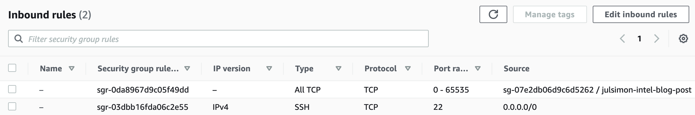
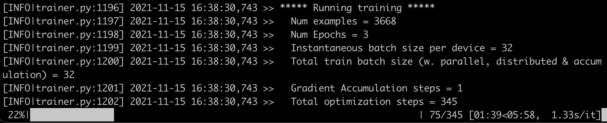
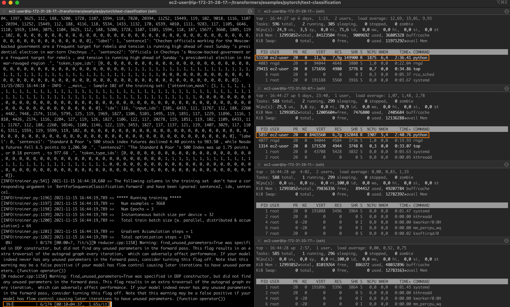
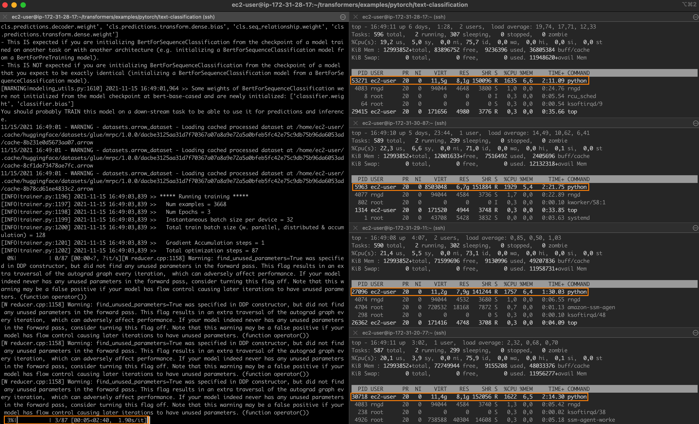

<h1>
Accelerating PyTorch distributed fine-tuning with Intel technologies
</h1>


{blog_metadata}

{authors}

For all their amazing performance, state of the art deep learning models often take a long time to train. In order to speed up training jobs, engineering teams rely on distributed training, a divide-and-conquer technique where clustered servers each keep a copy of the model, train it on a subset of the training set, and exchange results to converge to a final model.

Graphical Processing Units (GPUs) have long been the _de facto_ choice to train deep learning models. However, the rise of transfer learning is changing the game. Models are now rarely trained from scratch on humungous datasets. Instead, they are frequently fine-tuned on specific (and smaller) datasets, in order to build specialized models that are more accurate than the base model for particular tasks. As these training jobs are much shorter, using a CPU-based cluster can prove to be an interesting option that keeps both training time and cost under control.

### What this post is about

In this post, you will learn how to accelerate [PyTorch](https://pytorch.org) training jobs by distributing them on a cluster of Intel Xeon Scalable CPU servers, powered by the Ice Lake architecture and running performance-optimized software libraries. We will build the cluster from scratch using virtual machines, and you should be able to easily replicate the demo on your own infrastructure, either in the cloud or on premise.

Running a text classification job, we will fine-tune a [BERT](https://huggingface.co/bert-base-cased) model on the [MRPC](https://www.microsoft.com/en-us/download/details.aspx?id=52398) dataset (one of the tasks included in the [GLUE](https://gluebenchmark.com/) benchmark). The MRPC dataset contains 5,800 sentence pairs extracted from news sources, with a label telling us whether the two sentences in each pair are semantically equivalent. We picked this dataset for its reasonable training time, and trying other GLUE tasks is just a parameter away.

Once the cluster is up and running, we will run a baseline job on a single server. Then, we will scale it to 2 servers and 4 servers and measure the speed-up.

Along the way, we will cover the following topics:

* Listing the required infrastructure and software building blocks,
* Setting up our cluster,
* Installing dependencies,
* Running a single-node job,
* Running a distributed job.

Let's get to work!

### Using Intel servers

For best performance, we will use Intel servers based on the Ice Lake architecture, which supports hardware features such as Intel AVX-512 and Intel Vector Neural Network Instructions (VNNI). These features accelerate operations typically found in deep learning training and inference. You can learn more about them in this [presentation](https://www.intel.com/content/dam/www/public/us/en/documents/product-overviews/dl-boost-product-overview.pdf) (PDF).

All three major cloud providers offer virtual machines powered by Intel Ice Lake CPUs:

- Amazon Web Services: Amazon EC2 [M6i](https://aws.amazon.com/blogs/aws/new-amazon-ec2-m6i-instances-powered-by-the-latest-generation-intel-xeon-scalable-processors/)
and [C6i](https://aws.amazon.com/blogs/aws/new-amazon-ec2-c6i-instances-powered-by-the-latest-generation-intel-xeon-scalable-processors/) instances.
- Azure: [Dv5/Dsv5-series](https://docs.microsoft.com/en-us/azure/virtual-machines/dv5-dsv5-series), [Ddv5/Ddsv5-series](https://docs.microsoft.com/en-us/azure/virtual-machines/ddv5-ddsv5-series) and [Edv5/Edsv5-series](https://docs.microsoft.com/en-us/azure/virtual-machines/edv5-edsv5-series) virtual machines.
- Google Cloud Platform: [N2](https://cloud.google.com/blog/products/compute/compute-engine-n2-vms-now-available-with-intel-ice-lake) Compute Engine virtual machines.

Of course, you can also use your own servers. If they are based on the Cascade Lake architecture (Ice Lake's predecessor), they're good to go as Cascade Lake also includes AVX-512 and VNNI.

### Using Intel performance libraries

To leverage AVX-512 and VNNI in PyTorch, Intel has designed the [Intel extension for PyTorch](https://github.com/intel/intel-extension-for-pytorch). This software library provides out of the box speedup for training and inference, so we should definitely install it.

When it comes to distributed training, the main performance bottleneck is often networking. Indeed, the different nodes in the cluster need to periodically exchange model state information to stay in sync. As transformers are large models with billions of parameters (sometimes much more), the volume of information is significant, and things only get worse as the number of nodes increase. Thus, it's important to use a communication library optimized for deep learning.

In fact, PyTorch includes the [```torch.distributed```](https://pytorch.org/tutorials/intermediate/dist_tuto.html) package, which supports different communication backends. Here, we'll use the Intel oneAPI Collective Communications Library [(oneCCL)](https://github.com/oneapi-src/oneCCL), an efficient implementation of communication patterns used in deep learning ([all-reduce](https://en.wikipedia.org/wiki/Collective_operation), etc.). You can learn about the performance of oneCCL versus other backends in this PyTorch [blog post](https://pytorch.medium.com/optimizing-dlrm-by-using-pytorch-with-oneccl-backend-9f85b8ef6929).

Now that we're clear on building blocks, let's talk about the overall setup of our training cluster.

### Setting up our cluster

In this demo, I'm using Amazon EC2 instances running Amazon Linux 2 (c6i.16xlarge, 64 vCPUs, 128GB RAM, 25Gbit/s networking). Setup will be different in other environments, but steps should be very similar.

Please keep in mind that you will need 4 identical instances, so you may want to plan for some sort of automation to avoid running the same setup 4 times. Here, I will set up one instance manually, create a new Amazon Machine Image [(AMI)](https://docs.aws.amazon.com/AWSEC2/latest/UserGuide/AMIs.html) from this instance, and use this AMI to launch three identical instances.

From a networking perspective, we will need the following setup: 

* Open port 22 for ```ssh``` access on all instances for setup and debugging.
* Configure [password-less](https://www.redhat.com/sysadmin/passwordless-ssh) ```ssh``` between the master instance (the one you'll launch training from) and all other instances (__master included__).
* Open all TCP ports on all instances for oneCCL communication inside the cluster. __Please make sure NOT to open these ports to the external world__. AWS provides a convenient way to do this by only allowing connections from instances running a particular [security group](https://docs.aws.amazon.com/vpc/latest/userguide/VPC_SecurityGroups.html). Here's how my setup looks.

<kbd>

</kbd>
 
Now, let's provision the first instance manually. I first create the instance itself, attach the security group above, and add 128GB of storage. To optimize costs, I have launched it as a [spot instance](https://docs.aws.amazon.com/AWSEC2/latest/UserGuide/using-spot-instances.html). 

Once the instance is up, I connect to it with ```ssh``` in order to install dependencies.

### Installing dependencies

Here are the steps we will follow:

* Install Intel toolkits,
* Install the Anaconda distribution,
* Create a new ```conda``` environment,
* Install PyTorch and the Intel extension for PyTorch,
* Compile and install oneCCL,
* Install the ```transformers``` library.

It looks like a lot, but there's nothing complicated. Here we go!

__Installing Intel toolkits__

First, we download and install the Intel [OneAPI base toolkit](https://www.intel.com/content/www/us/en/developer/tools/oneapi/base-toolkit-download.html?operatingsystem=linux&distributions=webdownload&options=offline) as well as the [AI toolkit](https://www.intel.com/content/www/us/en/developer/tools/oneapi/ai-analytics-toolkit-download.html?operatingsystem=linux&distributions=webdownload&options=offline). You can learn about them on the Intel [website](https://www.intel.com/content/www/us/en/developer/tools/oneapi/toolkits.html#gs.gmojrp).

```
wget https://registrationcenter-download.intel.com/akdlm/irc_nas/18236/l_BaseKit_p_2021.4.0.3422_offline.sh
sudo bash l_BaseKit_p_2021.4.0.3422_offline.sh

wget https://registrationcenter-download.intel.com/akdlm/irc_nas/18235/l_AIKit_p_2021.4.0.1460_offline.sh
sudo bash l_AIKit_p_2021.4.0.1460_offline.sh 
```

__Installing Anaconda__

Then, we [download](https://www.anaconda.com/products/individual) and install the Anaconda distribution.
 
```
wget https://repo.anaconda.com/archive/Anaconda3-2021.05-Linux-x86_64.sh
sh Anaconda3-2021.05-Linux-x86_64.sh
```

__Creating a new conda environment__

We log out and log in again to refresh paths. Then, we create a new ```conda``` environment to keep things neat and tidy.

```
yes | conda create -n transformer python=3.7.9 -c anaconda
eval "$(conda shell.bash hook)"
conda activate transformer
yes | conda install pip cmake
```

__Installing PyTorch and the Intel extension for PyTorch__

Next, we install PyTorch 1.9 and the Intel extension toolkit. __Versions must match__.

```
yes | conda install pytorch==1.9.0 cpuonly -c pytorch
pip install torch_ipex==1.9.0 -f https://software.intel.com/ipex-whl-stable
```

__Compiling and installing oneCCL__

Then, we install some native dependencies required to compile oneCCL.

```
sudo yum -y update
sudo yum install -y git cmake3 gcc gcc-c++
```

Next, we clone the oneCCL repository, build the library and install it. __Again, versions must match__.


```
source /opt/intel/oneapi/mkl/latest/env/vars.sh
git clone https://github.com/intel/torch-ccl.git
cd torch-ccl
git checkout ccl_torch1.9
git submodule sync
git submodule update --init --recursive
python setup.py install
cd ..
```
__Installing the transformers library__

Next, we install the ```transformers``` library and dependencies required to run GLUE tasks.

```
pip install transformers datasets
yes | conda install scipy scikit-learn
```

Finally, we clone a fork of the ```transformers```repository containing the example we're going to run.

```
git clone https://github.com/kding1/transformers.git
cd transformers
git checkout dist-sigopt
```

We're done! Let's run a single-node job.

### Launching a single-node job

To get a baseline, let's launch a single-node job running the ```run_glue.py``` script in ```transformers/examples/pytorch/text-classification```. This should work on any of the instances, and it's a good sanity check before proceeding to distributed training.

```
python run_glue.py \
--model_name_or_path bert-base-cased --task_name mrpc \
--do_train --do_eval --max_seq_length 128 \
--per_device_train_batch_size 32 --learning_rate 2e-5 --num_train_epochs 3 \
--output_dir /tmp/mrpc/ --overwrite_output_dir True
```

<kbd>

</kbd>

This job takes __7 minutes and 46 seconds__. Now, let's set up distributed jobs with oneCCL and speed things up!

### Setting up a distributed job with oneCCL

Three steps are required to run a distributed training job:

* List the nodes of the training cluster,
* Define environment variables,
* Modify the training script.

__Listing the nodes of the training cluster__

On the master instance, in ```transformers/examples/pytorch/text-classification```, we create a text file named ```hostfile```. This file stores the names of the nodes in the cluster (IP addresses would work too). The first line should point to the master instance. 

Here's my file:

```
ip-172-31-28-17.ec2.internal
ip-172-31-30-87.ec2.internal
ip-172-31-29-11.ec2.internal
ip-172-31-20-77.ec2.internal
```

__Defining environment variables__

Next, we need to set some environment variables on the master node, most notably its IP address. You can find more information on oneCCL variables in the [documentation](https://oneapi-src.github.io/oneCCL/env-variables.html).

```
for nic in eth0 eib0 hib0 enp94s0f0; do
  master_addr=$(ifconfig $nic 2>/dev/null | grep netmask | awk '{print $2}'| cut -f2 -d:)
  if [ "$master_addr" ]; then
    break
  fi
done
export MASTER_ADDR=$master_addr

source /home/ec2-user/anaconda3/envs/transformer/lib/python3.7/site-packages/torch_ccl-1.3.0+43f48a1-py3.7-linux-x86_64.egg/torch_ccl/env/setvars.sh

export LD_LIBRARY_PATH=/home/ec2-user/anaconda3/envs/transformer/lib/python3.7/site-packages/torch_ccl-1.3.0+43f48a1-py3.7-linux-x86_64.egg/:$LD_LIBRARY_PATH
export LD_PRELOAD="${CONDA_PREFIX}/lib/libtcmalloc.so:${CONDA_PREFIX}/lib/libiomp5.so"

export CCL_WORKER_COUNT=4
export CCL_WORKER_AFFINITY="0,1,2,3,32,33,34,35"
export CCL_ATL_TRANSPORT=ofi
export ATL_PROGRESS_MODE=0
```

__Modifying the training script__

The following changes have already been applied to our training script (```run_glue.py```) in order to enable distributed training. You would need to apply similar changes when using your own training code.

* Import the ```torch_ccl```package.
* Receive the address of the master node and the local rank of the node in the cluster.

```
+import torch_ccl
+
 import datasets
 import numpy as np
 from datasets import load_dataset, load_metric
@@ -47,7 +49,7 @@ from transformers.utils.versions import require_version


 # Will error if the minimal version of Transformers is not installed. Remove at your own risks.
-check_min_version("4.13.0.dev0")
+# check_min_version("4.13.0.dev0")

 require_version("datasets>=1.8.0", "To fix: pip install -r examples/pytorch/text-classification/requirements.txt")

@@ -191,6 +193,17 @@ def main():
     # or by passing the --help flag to this script.
     # We now keep distinct sets of args, for a cleaner separation of concerns.

+    # add local rank for cpu-dist
+    sys.argv.append("--local_rank")
+    sys.argv.append(str(os.environ.get("PMI_RANK", -1)))
+
+    # ccl specific environment variables
+    if "ccl" in sys.argv:
+        os.environ["MASTER_ADDR"] = os.environ.get("MASTER_ADDR", "127.0.0.1")
+        os.environ["MASTER_PORT"] = "29500"
+        os.environ["RANK"] = str(os.environ.get("PMI_RANK", -1))
+        os.environ["WORLD_SIZE"] = str(os.environ.get("PMI_SIZE", -1))
+
     parser = HfArgumentParser((ModelArguments, DataTrainingArguments, TrainingArguments))
     if len(sys.argv) == 2 and sys.argv[1].endswith(".json"):
```

Setup is now complete. Let's scale our training job to 2 nodes and 4 nodes.

### Running a distributed job with oneCCL

On the __master node__, I use ```mpirun```to launch a 2-node job: ```-np``` (number of processes) is set to 2 and ```-ppn``` (process per node) is set to 1. Hence, the first two nodes in ```hostfile``` will be selected.

```
mpirun -f hostfile -np 2 -ppn 1 -genv I_MPI_PIN_DOMAIN=[0xfffffff0] \
-genv OMP_NUM_THREADS=28 python run_glue.py \
--model_name_or_path distilbert-base-uncased --task_name mrpc \
--do_train --do_eval --max_seq_length 128 --per_device_train_batch_size 32 \
--learning_rate 2e-5 --num_train_epochs 3 --output_dir /tmp/mrpc/ \
--overwrite_output_dir True --xpu_backend ccl --no_cuda True
```

Within seconds, a job starts on the first two nodes. The job completes in __4 minutes and 39 seconds__, a __1.7x__ speedup.

<kbd>

</kbd>

Setting ```-np``` to 4 and launching a new job, I now see one process running on each node of the cluster.

<kbd>

</kbd>

Training completes in __2 minutes and 36 seconds__, a __3x__ speedup.
 
One last thing. Changing ```--task_name``` to ```qqp```, I also ran the Quora Question Pairs GLUE task, which is based on a much larger [dataset](https://quoradata.quora.com/First-Quora-Dataset-Release-Question-Pairs) (over 400,000 training samples). The fine-tuning times were:

* Single-node: 11 hours 22 minutes,
* 2 nodes: 6 hours and 38 minutes (1.71x),
* 4 nodes: 3 hours and 51 minutes (2.95x).

It looks like the speedup is pretty consistent. Feel free to keep experimenting with different learning rates, batch sizes and oneCCL settings. I'm sure you can go even faster!

### Conclusion

In this post, you've learned how to build a distributed training cluster based on Intel CPUs and performance libraries, and how to use this cluster to speed up fine-tuning jobs. Indeed, transfer learning is putting CPU training back into the game, and you should definitely consider it when designing and building your next deep learning workflows.

Thanks for reading this long post. I hope you found it informative. Feedback and questions are welcome at _julsimon@huggingface.co_. Until next time, keep learning!

Julien
 


