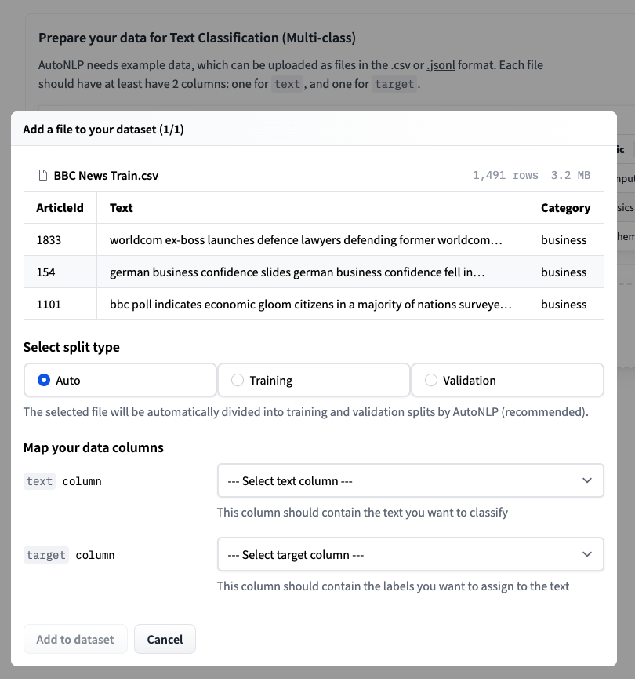

<h1>Active Learning with AutoNLP and Prodigy</h1>

<div class="blog-metadata">
    <small>Published Dec 17, 2021.</small>
    <a target="_blank" class="btn no-underline text-sm mb-5 font-sans" href="https://github.com/huggingface/blog/blob/master/active-learning-with-autonlp-and-prodigy.md">
        Update on GitHub
    </a>
</div>

<div class="author-card">
    <a href="/abhishek">
        
        <div class="bfc">
            <code>abhishek</code>
            <span class="fullname">Abhishek Thakur</span>
        </div>
    </a>
</div>

Active learning in the context of Machine Learning is a process in which you iteratively add labeled data, retrain a model and serve it to the end user. It is an endless process and requires human interaction for labeling/creating the data. In this article, we will discuss how to use [AutoNLP](https://huggingface.co/autonlp) and [Prodigy](https://prodi.gy/) to build an active learning pipeline.

## AutoNLP

[AutoNLP](https://huggingface.co/autonlp) is a framework created by Hugging Face that helps you to build your own state-of-the-art deep learning models on your own dataset with almost no coding at all. AutoNLP is built on the giant shoulders of Hugging Face's [transformers](https://github.com/huggingface/transformers), [datasets](https://github.com/huggingface/datasets), [inference-api](https://huggingface.co/inference-api) and many other tools.

With AutoNLP, you can train SOTA transformer models on your own custom dataset, fine-tune them (automatically) and serve them to the end-user. All models trained with AutoNLP are state-of-the-art and production-ready.

At the time of writing this article, AutoNLP supports tasks like binary classification, regression, multi class classification, token classification (such as named entity recognition or part of speech), question answering, summarization and more. You can find a list of all the supported tasks [here](https://huggingface.co/autonlp/). AutoNLP supports languages like English, French, German, Spanish, Hindi, Dutch, Swedish and many more. There is also support for custom models with custom tokenizers (in case your language is not supported by AutoNLP).

## Prodigy

[Prodigy](https://prodi.gy/) is an annotation tool developed by Explosion (the makers of [spaCy](https://spacy.io/)). It is a web-based tool that allows you to annotate your data in real time and not just for Natural Language Processing tasks! Prodigy supports NLP tasks such as named entity recognition (NER) and text classification, but it's not limited to NLP! It  supports Computer Vision tasks and even creating your own tasks! You can try the Prodigy demo: [here](https://prodi.gy/demo).

Please note that Prodigy is not free or open-source. It is a paid tool. You can find out more about it [here](https://prodi.gy/buy).

We chose Prodigy as it is one of the most popular tools for labeling data and is inifitely customizable. It is also very easy to setup and use.

## Dataset

Now begins the most interesting part of this article. After looking at a lot of datasets and different types of problems, we stumbled upon BBC News Classification dataset on Kaggle. This dataset was used in an inclass competition and can be accessed [here](https://www.kaggle.com/c/learn-ai-bbc).

Let's take a look at this dataset:


As we can see this is a classification dataset. There is a `Text` column which is the text of the news article and a `Category` column which is the class of the article. Overall, there are 5 different classes: `business`, `entertainment`, `politics`, `sport` & `tech`. 

Training a multi-class classification model on this dataset using AutoNLP is a piece of cake. 

Step 1: Download the dataset.

Step 2: Open [AutoNLP](https://ui.autonlp.huggingface.co/) and create a new project.


Step 3: Upload the training dataset and choose auto-splitting.



Step 4: Accept the pricing and train your models.


Please note that in the above example, we are training 15 different multi-class classification models. AutoNLP pricing can be as low as $10 per model. AutoNLP will select the best models and do hyperparameter tuning for you on its own. So, now, all we need to do is sit back, relax and wait for the results.

After around 15mins, all models finished training and the results were ready. It seems like the best model scored 98.67% accuracy! 


So, we are now able to classify the articles in the dataset with an accuracy of 98.67%! But wait, we were talking about active learning and prodigy. What happened to those? We did use prodigy as we will see soon. We used prodigy to label this dataset for named entity recognition task. Before starting the labelling part, we thought it would be cool to have a project in which we are not only able to detect the entities in news articles but also categorize them. That's why we built this classification model on existing labels.

## Active Learning

The dataset we used did have categories but it didn't have labels for entity recognition. So, we decided to use Prodigy to label the dataset for antother task: named entity recognition or token classification.

Once you have prodigy installed, you can simply run:

    $ prodigy ner.manual bbc blank:en BBC_News_Train.csv --label PERSON,ORG,PRODUCT,LOCATION

Here `bbc` is the dataset that will be created by Prodigy. `blank:en` is the spacy tokenizer being used. `BBC_News_Train.csv` is the dataset that will be used for labelling. `PERSON,ORG,PRODUCT,LOCATION` is the list of labels that will be used for labelling.

Once you run the above command, you can got to the prodigy web interface (usually at localhost:12000) and start labelling the dataset. Prodigy interface is very simple, intuitive and easy to use. The interface looks like the following:


All you have to do is select which entity you want to label (PERSON, ORG, PRODUCT, LOCATION) and then select the text that belongs to the entity. Once you are done with one document, you can click on the green button and Prodigy will automatically provide you with next unlabelled document.

Using Prodigy, we started labelling the dataset. When we had around 20 samples, we trained a model using AutoNLP. Prodigy doesn't export the data in AutoNLP format, so we wrote a quick and dirty script to convert the data into AutoNLP format:

```python
import json
import spacy

from prodigy.components.db import connect

db = connect()
prodigy_annotations = db.get_dataset("bbc")
examples = ((eg["text"], eg) for eg in prodigy_annotations)
nlp = spacy.blank("en")

dataset = []

for doc, eg in nlp.pipe(examples, as_tuples=True):
    try:
        doc.ents = [doc.char_span(s["start"], s["end"], s["label"]) for s in eg["spans"]]
        iob_tags = [f"{t.ent_iob_}-{t.ent_type_}" if t.ent_iob_ else "O" for t in doc]
        iob_tags = [t.strip("-") for t in iob_tags]
        tokens = [str(t) for t in doc]
        temp_data = {
            "tokens": tokens,
            "tags": iob_tags
        }
        dataset.append(temp_data)
    except:
        pass

with open('data.jsonl', 'w') as outfile:
    for entry in dataset:
        json.dump(entry, outfile)
        outfile.write('\n')
```

This will provide us with a `JSONL` file which can be used for training a model using AutoNLP. The steps will be same as before except we will select `Token Classification` task when creating the AutoNLP project. Using the initial data we had, we trained a model using AutoNLP. The best model had an accuracy of around 86% with 0 precision and recall. We knew the model didn't learn anything. It's pretty obvious, we had only around 20 samples. 

After labelling around 70 samples, we started getting some results. The accuracy went up to 92%, precision was 0.52 and recall around 0.42. We were getting some results, but still not satisfactory. In the following image, we can see how this model performs on an unseen sample.


As you can see, the model is struggling. But it's much better than before. Previously, the model was not even able to predict anything in the same text. Atleast now, it's able to figure out that `Bruce` and `David` are names.

Thus, we continued. We labelled a few more samples. 

Please note that, in each iteration, our dataset is getting bigger. All we are doing is uploading the new dataset to AutoNLP and let it do the rest.

After labelling around ~150 samples, we started getting some good results. The accuracy went up to 95.7%, precision was 0.64 and recall around 0.76. 


Let's take a look at how this model performs on the same unseen sample.


WOW! This is amazing! As you can see, the model is now performing extremely well! Its able to detect many entities in the same text. At this point, we decided to stop labelling and end the experimentation process. The following graph shows how the accuracy of best model improved as we added more samples to the dataset:


Well, its a well known fact that more relevant data will lead to better models and thus better results. With this experimentation, we successfully created a model that can not only classify the entities in the news articles but also categorize them. Using tools like Prodigy and AutoNLP, we invested our time and effort only to label the dataset (even that was made simpler by the interface prodigy offers). AutoNLP saved us a lot of time and effort: we didn't have to figure out which models to use, how to train them, how to evaluate them, how to tune the parameters, which optimizer and scheduler to use, pre-processing, post-processing etc. We just needed to label the dataset and let AutoNLP do everything else.

We believe with tools like AutoNLP and Prodigy it's very easy to create data and state-of-the-art models. And since the whole process requires almost no coding at all, even someone without a coding background can create datasets which are generally not available to the public, train their own models using AutoNLP and share the model with everyone else in the community (or just use them for their own research / business).

We have open-sourced the best model created using this process. You can try it [here](https://huggingface.co/abhishek/autonlp-prodigy-8-3342521).

Models are only state-of-the-art because of the data they are trained on.