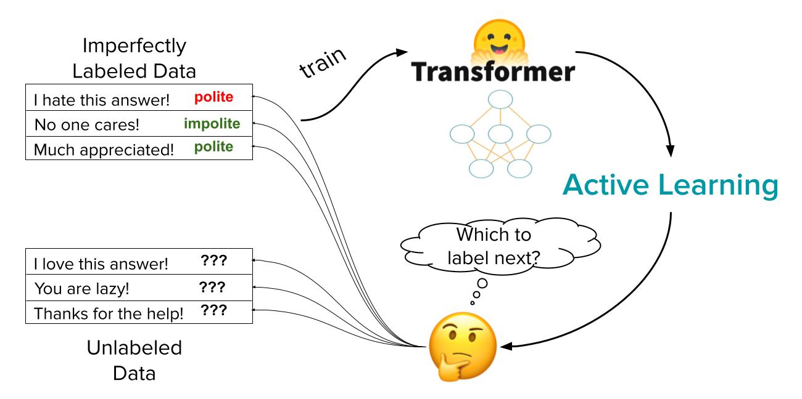
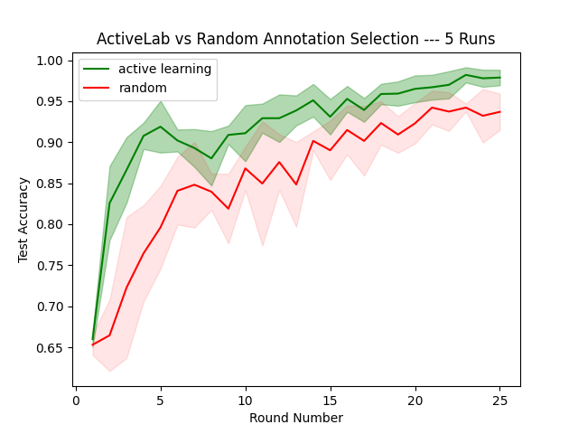

# Effectively Annotate Text Data for Transformers via Active Learning + Re-labeling

<!-- {blog_metadata} -->
<!-- {authors} -->

In this article, I highlight the use of active learning to improve a fine-tuned Hugging Face Transformer for text classification, while keeping the total number of collected labels from human annotators low. When resource constraints prevent you from acquiring labels for the entirety of your data, active learning aims to save both time and money by selecting which examples data annotators should spend their effort labeling.

## What is Active Learning?

Active Learning helps prioritize what data to label in order to maximize the performance of a supervised machine learning model trained on the labeled data. This process usually happens iteratively — at each round, active learning tells us which examples we should collect additional annotations for to improve our current model the most under a limited labeling budget. [ActiveLab](https://arxiv.org/abs/2301.11856) is an active learning algorithm that is particularly useful when the annotators are noisy because it helps decide when we should collect one more annotation for a previously annotated example (whose label seems suspect) vs. for a not-yet-annotated example.  After collecting these new annotations for a batch of data to increase our training dataset, we re-train our model and evaluate its test accuracy.



Here I consider a binary text classification task: predicting whether a specific phrase is polite or impolite. Compared to random selection of which examples to collect an additional annotation for, active learning with ActiveLab consistently produces much better Transformer models at each round (around **50%** of the error-rate), no matter the total labeling budget! 

The rest of this article walks through the open-source code you can use to achieve these results. You can run all of the code to reproduce my active learning experiments here:
[Colab Notebook](https://colab.research.google.com/github/cmauck10/active-learning/blob/master/active-learning.ipynb)
## Classifying the Politeness of Text

The dataset I consider here is a variant of the [Stanford Politeness Corpus](https://convokit.cornell.edu/documentation/wiki_politeness.html). It is structured as a binary text classification task, to classify whether each phrase is polite or impolite. Human annotators are given a selected text phrase and they provide an (imperfect) annotation regarding its politeness: 0 for impolite and 1 for polite. 

Training a Transformer classifier on the annotated data, we measure model accuracy over a set of held-out test examples, where I feel confident about their ground truth labels because they are derived from a consensus amongst 5 annotators who labeled each of these examples. 

As for the training data, we have:

- `X_labeled_full`: our initial training set with just a small set of 100 text examples labeled with 2 annotations per example.
- `X_unlabeled`: large set of 1900 unlabeled text examples we can consider having annotators annotate.

Here are a few examples from `X_labeled_full`:

1. **Hi, nice article. What is meant by "speculative townhouses?" Ones that were built for prospective renters rather than for committed buyers?**
    - Annotation (by annotator #61): polite 
    - Annotation (by annotator #99): polite
    
2. **Congrats, or should I say good luck?**
    - Annotation (by annotator #16): polite
    - Annotation (by annotator #22): impolite
    
3. **4.5 million hits on Google turning up the non-Columbia campuses. What are you talking about?**
   -  Annotation (by annotator #22): impolite
    - Annotation (by annotator #61): impolite

## Methodology

For each **active learning** round we:

1. Compute ActiveLab consensus labels for each training example derived from all annotations collected thus far.
2. Train our Transformer classification model on the current training set using these consensus labels.
3. Evaluate test accuracy on the test set (which has high-quality ground truth labels).
4. Run cross-validation to get out-of-sample predicted class probabilities from our model for the entire training set and unlabeled set.
5. Get ActiveLab active learning scores for each example in the training set and unlabeled set. These scores estimate how informative it would be to collect another annotation for each example.
6. Select a subset (*n = batch_size*) of examples with the lowest active learning scores.
7. Collect one additional annotation for each of the *n* selected examples.
8. Add the new annotations (and new previously non-annotated examples if selected) to our training set for the next iteration. 

I subsequently compare models trained on data labeled via active learning vs. data labeled via **random selection**.  For each random selection round, I use majority vote consensus instead of ActiveLab consensus (in Step 1) and then just randomly select the **n** examples to collect an additional label for instead of using ActiveLab scores (in Step 6). 

## Model Training and Evaluation

Here is the code we use for model training and evaluation.

```python
# Helper method to get accuracy and pred_probs from Trainer.
def compute_metrics(p):   
    logits, labels = p
    pred = np.argmax(logits, axis=1)
    pred_probs = softmax(logits, axis=1)
    accuracy = accuracy_score(y_true=labels, y_pred=pred)
    return {"logits":logits, "pred_probs":pred_probs, "accuracy": accuracy}

# Helper method to initiate a new Trainer with given train and test sets.
def get_trainer(train_set, test_set):
    
    # Model params.
    model_name = "distilbert-base-uncased"
    model_folder = "model_training"
    max_training_steps = 300
    num_classes = 2
    
    # Set training args.
    # We time-seed to ensure randomness between different benchmarking runs.
    training_args = TrainingArguments(
        max_steps=max_training_steps, 
        output_dir=model_folder,
        seed = int(datetime.now().timestamp())
    )
    
    # Tokenize train/test set.
    dataset_train = tokenize_data(train_set)
    dataset_test = tokenize_data(test_set)
    
    # Initiate a pre-trained model.
    model = AutoModelForSequenceClassification.from_pretrained(model_name, num_labels=num_classes)
    trainer = Trainer(
        model=model,
        args=training_args,
        compute_metrics = compute_metrics,
        train_dataset = train_tokenized_dataset,
        eval_dataset = test_tokenized_dataset,
    )
    return trainer
```

I first tokenize my test and train sets, and then initialize a pre-trained DistilBert Transformer model. Fine-tuning DistilBert with 300 training steps produced a good balance between accuracy and training time for my data. This classifier outputs predicted class probabilities which I convert to class predictions before evaluating their accuracy.

## Use Active Learning Scores to Decide what to Label Next

Here is the code we use to score each example via an active learning estimate of how informative collecting one more label for this example will be. 

```python
from cleanlab.multiannotator import get_active_learning_scores

pred_probs, pred_probs_unlabeled = get_pred_probs(train_set, X_unlabeled)

# Compute active learning scores.
active_learning_scores, active_learning_scores_unlabeled = get_active_learning_scores(
    multiannotator_labels, pred_probs, pred_probs_unlabeled
)

# Get the indices of examples to collect more labels for.
chosen_examples_labeled, chosen_examples_unlabeled = get_idx_to_label(
    X_labeled_full,
    X_unlabeled,
    extra_annotations,
    batch_size_to_label,
    active_learning_scores,
    active_learning_scores_unlabeled,
)
```

During each round of Active Learning, we fit our Transformer model via 3-fold cross-validation on the current training set. This allows us to get out-of-sample predicted class probabilities for each example in the training set and we can also use the trained Transformer to get out-of-sample predicted class probabilities for each example in the unlabeled pool. All of this is internally implemented in the `get_pred_probs` helper method. The use of out-of-sample predictions helps us avoid bias due to potential overfitting. 

Once I have these probabilistic predictions, I pass them into the `get_active_learning_scores` method from the open-source [cleanlab](https://github.com/cleanlab/cleanlab) package, which implements the [ActiveLab algorithm](https://arxiv.org/abs/2301.11856).  This method provides us with scores for all of our labeled and unlabeled data. Lower scores indicate data points for which collecting one additional label should be most informative for our current model (scores are directly comparable between labeled and unlabeled data).

I form a batch of examples with the lowest scores as the examples to collect an annotation for (via the `get_idx_to_label` method). Here I always collect the exact same number of annotations in each round (under both the active learning and random selection approaches). For this application, I limit the maximum number of annotations per example to 5 (don’t want to spend effort labeling the same example over and over again). 

## Adding new Annotations

Here is the code used to add new annotations for the chosen examples to the current training dataset.

```python
# Combine ids of labeled and unlabeled chosen examples.
chosen_example_ids = np.concatenate([X_labeled_full.iloc[chosen_examples_labeled].index.values, X_unlabeled.iloc[chosen_examples_unlabeled].index.values])

# Collect annotations for the selected examples.
for example_id in chosen_example_ids:

    # Collect new annotation and who it's coming from.
    new_annotation = get_annotation(example_id, chosen_annotator)
    
    # New annotator has been selected.
    if chosen_annotator not in X_labeled_full.columns.values:
        empty_col = np.full((len(X_labeled_full),), np.nan)
        X_labeled_full[chosen_annotator] = empty_col
    
    # Add selected annotation to the training set.
    X_labeled_full.at[example_id, chosen_annotator] = new_annotation
```

The `combined_example_ids` are the ids of the text examples we want to collect an annotation for. For each of these, we use the `get_annotation` helper method to collect a new annotation from an annotator. Here, we prioritize selecting annotations from annotators who have already annotated another example. If none of the annotators for the given example exist in the training set, we randomly select one. In this case, we add a new column to our training set which represents the new annotator. Finally, we add the newly collected annotation to the training set. If the corresponding example was previously non-annotated, we also add it to the training set and remove it from the unlabeled collection.

We’ve now completed one round of collecting new annotations and retrain the Transformer model on the updated training set.  We repeat this process in multiple rounds to keep growing the training dataset and improving our model.

## Results

I ran 25 rounds of active learning (labeling batches of data and retraining the Transformer model), collecting 25 annotations in each round. I repeated all of this, the next time using random selection to choose which examples to annotate in each round — as a baseline comparison. Before additional data are annotated, both approaches start with the same initial training set of 100 examples (hence achieving roughly the same Transformer accuracy in the first round).  Because of inherent stochasticity in training Transformers, I ran this entire process five times (for each data labeling strategy) and report the standard deviation (shaded region) and mean (solid line) of test accuracies across the five replicate runs.



We see that choosing what data to annotate next has drastic effects on model performance. Active learning using ActiveLab consistently outperforms random selection by a significant margin at each round. For example, in round 4 with 275 total annotations in the training set, we obtain 91% accuracy via active learning vs. only 76% accuracy without a clever selection strategy of what to annotate. Overall, the resulting Transformer models fit on the dataset constructed via active learning have around **50%** of the error-rate, no matter the total labeling budget!

**When labeling data for text classification, you should consider active learning with the re-labeling option to better account for imperfect annotators.**