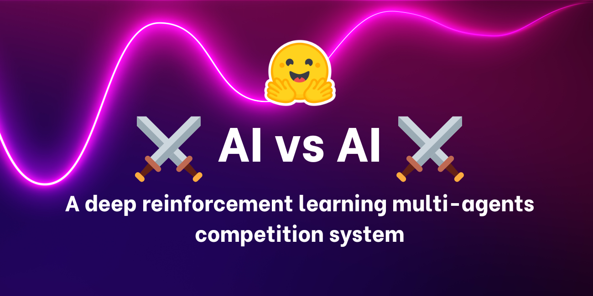

<!-- {blog_metadata} -->
<!-- {authors} -->



We’re excited to introduce a new tool we created: **⚔️ AI vs. AI ⚔️, a deep reinforcement learning multi-agents competition system**.

This tool hosted on a Space allows us **to create multi-agent competitions**. It is composed of three elements:

- A *Space* with a matchmaking algorithm that **runs the model fights using a background task**.
- A *Dataset* **containing the results**.
- A *Leaderboard* that gets the **match history results and displays the models’ ELO**.

Then, when a user pushes a trained model to the Hub, **it gets evaluated and ranked against others**. Thanks to that, we can evaluate your agents against other’s agents in a multi-agent setting.

In addition to being a useful tool for hosting multi-agent competitions, we think this tool can also be a **robust evaluation technique in multi-agent settings.** Since by playing against a lot of policies, your agents are evaluated against a wide range of behaviors, and you’ll get a good idea of the quality of your policy.

Let’s see how it works with our first competition host: SoccerTwos Challenge.


## How does AI vs. AI works?

AI vs. AI is an open-source tool developed at Hugging Face **to rank the strength of reinforcement learning models in a multi-agent setting**.

The idea is to get a **relative measure of skill rather than an objective one** by making the models play against each other continuously and use the matches results to assess their performance compared to all the other models and consequently get a view of the quality of their policy without requiring specific metrics.

The more agents are submitted for a given task or environment, **the more representative the rating becomes**.

To generate a rating based on match results in a competitive environment, we decided to base the rankings on the [ELO rating system](https://en.wikipedia.org/wiki/Elo_rating_system).

The core concept is that after a match ends, the rating of both players are updated based on the result and the ratings they had before the game. A powerful opponent beating a weaker opponent will mean the winner does not gain a many points, and the loser does not lose much either.

Conversely, an upset win of a low-rated player against a high-rated player will cause more significant rating modifications.

In our context, we **kept the system as simple as possible by not adding any alteration to the quantities gained or lost based on the starting ratings of the player**. As such, gain and loss will always be the perfect opposite (+10 / -10, for instance), and the average ELO rating will stay constant at the starting rating. The choice of a 1200 ELO rating start is entirely arbitrary.

If you want to learn more about ELO and see some calculation example, we wrote an explanation in our Deep Reinforcement Learning Course [here](https://huggingface.co/deep-rl-course/unit7/self-play?fw=pt#the-elo-score-to-evaluate-our-agent)

Using this rating, it is possible **to generate matches between models with comparable strengths automatically**. There are several ways you can go about creating a matchmaking system, but here we decided to keep it fairly simple while guaranteeing a minimum amount of diversity in the matchups and also keeping most matches with fairly close opposing ratings.


Here's how works the algorithm:
1. Gather all the available models on the Hub. New models get a starting rating of 1200, while others keep the rating they have gained/lost through their previous matches.
2. Create a queue from all these models.
3. Pop the first element (model) from the queue, and then pop another random model in this queue among the n models with the closest ratings to the first model.
4. Simulate this match by loading both models in the environment (a Unity executable, for instance) and gathering the results. For this implementation, we sent the results to a Hugging Face Dataset on the Hub.
5. Compute the new rating of both models based on the received result and the ELO formula.
6. Continue popping models two by two and simulating the matches until only one or zero models are in the queue.
7. Save the resulting ratings and go back to step 1

To run this matchmaking process continuously, we use **free Hugging Face Spaces hardware with a Scheduler** to keep running the matchmaking process as a background task.

The Spaces is also used to fetch the ELO ratings of each models that have already been played and, from it display [a leaderboard](https://huggingface.co/spaces/huggingface-projects/AIvsAI-SoccerTwos) **from which everyone can check the progress of the models**.


The process generally uses several Hugging Face Datasets to provide data persistence (here, matches history and model ratings).

Since the process also saves the matches' history, it is possible to see precisely the results of any given model. This can, for instance, allow you to check why your model struggles with another one, most notably using another demo Space to visualize matches such as https://huggingface.co/spaces/unity/ML-Agents-SoccerTwos.

For now, **this experiment is running with the MLAgent environment SoccerTwos for the Hugging Face Deep RL Course**, however, the process and implementation, in general, are very much **environment agnostic and could be used to evaluate for free a wide range of adversarial multi-agent settings**.

Of course, it is important to remind again that this evaluation is a relative rating between the strengths of the submitted agents, and the ratings by themselves **have no objective meaning contrary to other metrics**. It only represents how good or bad a model performs compared to the other models in the pool. Still, given a large and varied enough pool of models (and enough matches played), this evaluation becomes a very solid way to represent the general performance of a model.


## Our first AI vs. AI challenge experimentation: SoccerTwos Challenge ⚽

This challenge is Unit 7 of our [free Deep Reinforcement Learning Course](https://huggingface.co/deep-rl-course/unit0/introduction). It started on February 1st and will end on April 30th.

If you’re interested, **you don’t need to participate in the course to be able to participate in the competition. You can start here** 👉 https://huggingface.co/deep-rl-course/unit7/introduction

In this Unit, readers learned the basics of multi-agent reinforcement learning (MARL), and they need to train a **2vs2 soccer team.**

The environment used was made by the [Unity ML-Agents team](https://github.com/Unity-Technologies/ml-agents). The goal is simple: your team needs to score a goal: to do that, they need to beat the opponent team and collaborate with their teammate.


In addition to the leaderboard, we created a Space demo where people can choose two teams and visualize them playing 👉[https://huggingface.co/spaces/unity/SoccerTwos](https://huggingface.co/spaces/unity/SoccerTwos)

This experimentation is going well since we already have 48 models on the [leaderboard](https://huggingface.co/spaces/huggingface-projects/AIvsAI-SoccerTwos)


We also [created a discord channel called ai-vs-ai-competition](http://hf.co/discord/join) so that people can exchange with others and share advice.

### Conclusion and what’s next?

Since the tool we developed **is environment agnostic**, we want to host more challenges in the future with [PettingZoo](https://pettingzoo.farama.org/) and other multi-agents environments. If you have some environments or challenges you want to do, <a href="mailto:thomas.simonini@huggingface.co">don’t hesitate to reach us</a>.

In addition to being a useful tool for hosting multi-agent competitions, we think that this tool can also be **a robust evaluation technique in multi-agent settings: by playing against a lot of policies, your agents are evaluated against a wide range of behaviors, and you’ll get a good idea of the quality of your policy.**

The best way to keep in touch is to [join our discord server](http://hf.co/discord/join) to exchange with us and with the community.

****************Citation****************

Citation: If you found this useful for your academic work, please consider citing our work, in text:

`Cochet, Simonini, "Introducing AI vs. AI a deep reinforcement learning multi-agents competition system", Hugging Face Blog, 2023.`

BibTeX citation:

```
@article{cochet-simonini2023ift,
  author = {Cochet, Carl and Simonini, Thomas},
  title = {Introducing AI vs. AI a deep reinforcement learning multi-agents competition system},
  journal = {Hugging Face Blog},
  year = {2023},
  note = {https://huggingface.co/blog/aivsai},
}
```
