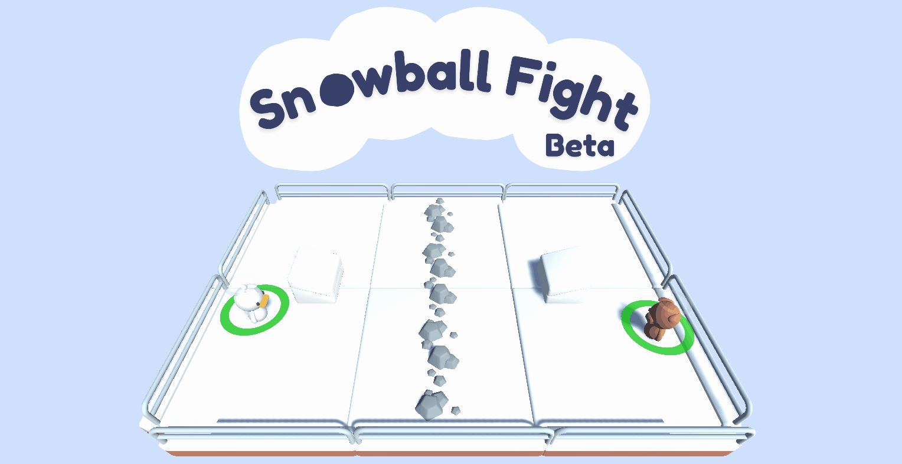
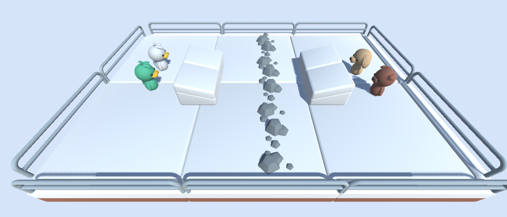

<h1>
    Introducing Snowball Fight ☃️, our First ML-Agents Environment
</h1>

    <small>Published November 30, 2021.</small>
    <a target="_blank" class="btn no-underline text-sm mb-5 font-sans" href="https://github.com/huggingface/blog/blob/master/announcing-snowballfight.md">
        Update on GitHub
    </a>

    <a href="/simoninithomas"> 
        
        

            <code>simoninithomas</code>
            Thomas Simonini
        

    </a>

We're excited to share our **first custom Deep Reinforcement Learning environment**: Snowball Fight 1vs1.

Snowball Fight is a game made with Unity ML-Agents, where you shoot snowballs against a Deep Reinforcement Learning agent.

The game is **hosted on Hugging Face Spaces**. 

👉 [You can play it online here](https://huggingface.co/spaces/ThomasSimonini/SnowballFight)

And in this post, we'll cover **the ecosystem we work on for Deep Reinforcement Learning researchers and enthusiasts that uses Unity ML-Agents**.

## Unity ML-Agents and Hugging Face

With this first step, our goal is to build an ecosystem on Hugging Face for Deep Reinforcement Learning researchers and enthusiasts that uses ML-Agents, with three features.

First, **building and sharing custom environments.** We develop and share exciting environments to experiment with new problems: snowball fights, racing, puzzles... All of them will be open source and hosted on the Hugging Face's Hub.

Second, **by allows you to easily host your environments and save models** on Hugging Face Hub.

We have already published the Snowball Fight training environment [here](https://huggingface.co/ThomasSimonini/ML-Agents-SnowballFight-1vs1).

And finally, **you can now easily host your demos on Spaces** and showcase your results quickly.

## Be part of the conversation: join our discord server!

If you're using ML-Agents or interested in Deep Reinforcement Learning and want to be part of the conversion, **[you can join our discord server](hf.co/join/discord)**. We just added two channels (and we'll add more in the future):

- Deep Reinforcement Learning
- ML-Agents

[Our discord](hf.co/join/discord) is the place where you can exchange about Hugging Face, NLP and Deep RL, plus it's in this discord that we'll announce all our new environments and features.

## What's next?

In the coming weeks and months, we will be extending the ecosystem by:

- Writing some **technical tutorials on ML-Agents**.
- Working on a **Snowball Fight 2vs2 version**, where the agents will collaborate in teams using MA-POCA, a new Deep Reinforcement Learning algorithm that trains cooperative behaviors in a team.  [Link MA-POCA]

- And we're building **new custom environments that will be hosted in Hugging Face**.

## Conclusion

We're excited to see what you're working on with ML-Agents and how we can build features and tools **that help you to empower your work**.

Don't forget to [join our discord server](hf.co/join/discord) to be alerted of the new features.
