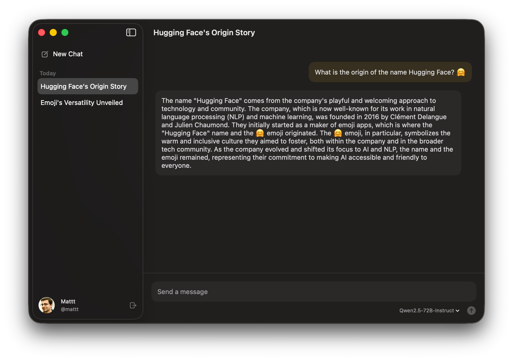

LLMs have become essential tools for building software.
But for Apple developers, integrating them remains unnecessarily painful.

Developers building AI-powered apps typically take a hybrid approach,
adopting some combination of:
- Local models using Core ML or MLX for privacy and offline capability
- Cloud providers like OpenAI or Anthropic for frontier capabilities
- Apple's Foundation Models as a system-level fallback
Each comes with different APIs, different requirements, different integration patterns.
It's a lot, and it adds up quickly.
When I interviewed developers about building AI-powered apps,
friction with model integration came up immediately.
One developer put it bluntly:

> I thought I'd quickly use the demo for a test and maybe a quick and dirty build
> but instead wasted so much time.
> Drove me nuts.

The cost to experiment is high,
which discourages developers from discovering that
local, open-source models might actually work great for their use case.

Today we're announcing [AnyLanguageModel](https://github.com/mattt/AnyLanguageModel),
a Swift package that provides a drop-in replacement for Apple's Foundation Models framework
with support for multiple model providers.
Our goal is to reduce the friction of working with LLMs on Apple platforms
and make it easier to adopt open-source models that run locally.

## The Solution

The core idea is simple:
Swap your `import` statement, keep the same API.

```diff
- import FoundationModels
+ import AnyLanguageModel
```

Here's what that looks like in practice.
Start with Apple's built-in model:

```swift
let model = SystemLanguageModel.default
let session = LanguageModelSession(model: model)

let response = try await session.respond(to: "Explain quantum computing in one sentence")
print(response.content)
```

Now try an open-source model running locally via [MLX](https://huggingface.co/docs/hub/en/mlx):

```swift
let model = MLXLanguageModel(modelId: "mlx-community/Qwen3-4B-4bit")
let session = LanguageModelSession(model: model)

let response = try await session.respond(to: "Explain quantum computing in one sentence")
print(response.content)
```

AnyLanguageModel supports a range of providers:

- **Apple Foundation Models**: Native integration with Apple's system model (macOS 26+ / iOS 26+)
- **Core ML**: Run converted models with Neural Engine acceleration
- **MLX**: Run quantized models efficiently on Apple Silicon
- **llama.cpp**: Load GGUF models via the llama.cpp backend
- **Ollama**: Connect to locally-served models via Ollama's HTTP API
- **OpenAI, Anthropic, Google Gemini**: Cloud providers for comparison and fallback
- **Hugging Face Inference Providers**: Hundreds of cloud models powered by world-class [inference providers](https://huggingface.co/docs/inference-providers/en/index).

The focus is on local models that you can download from the [Hugging Face Hub](https://huggingface.co/docs/hub/).
Cloud providers are included to lower the barrier to getting started and to provide a migration path.
Make it work, then make it right.

## Why Foundation Models as the Base API

When designing AnyLanguageModel, we faced a choice:
create a new abstraction that tries to capture everything,
or build on an existing API.
We chose the latter,
using [Apple's Foundation Models framework](https://developer.apple.com/documentation/FoundationModels)
as the template.

This might seem counterintuitive.
Why tie ourselves to Apple's choices?
A few reasons:

1. Foundation Models is genuinely well-designed.
It leverages Swift features like macros for an ergonomic developer experience,
and its abstractions around sessions, tools, and generation map well to how LLMs actually work.

2. It's intentionally limited.
Foundation Models represents something like a lowest common denominator for language model capabilities.
Rather than seeing this as a weakness,
we treat it as a stable foundation (_hyuk hyuk_).
Every Swift developer targeting Apple platforms will encounter this API,
so building on it directly means less conceptual overhead.

3. It keeps us grounded.
Each additional layer of abstraction takes you further from the problem you're actually solving.
Abstractions are powerful,
but stack too many and they become a problem in themselves.

The result is that switching between providers requires minimal code changes,
and the core abstractions remain clean and predictable.

## Package Traits: Include Only What You Need

One challenge with multi-backend libraries is dependency bloat.
If you only want to run MLX models,
you shouldn't have to pull in llama.cpp and all _its_ dependencies.

AnyLanguageModel uses Swift 6.1 package traits to solve this.
You opt in to only the backends you need:

```swift
dependencies: [
    .package(
        url: "https://github.com/mattt/AnyLanguageModel.git",
        from: "0.4.0",
        traits: ["MLX"]  // Pull in MLX dependencies only
    )
]
```

Available traits include `CoreML`, `MLX`, and `Llama` (for llama.cpp / [llama.swift](https://github.com/mattt/llama.swift)).
By default, no heavy dependencies are included.
You get the base API plus cloud providers,
which only require standard `URLSession` networking.

For Xcode projects (which don't yet support trait declarations directly),
you can create a small internal Swift package that depends on AnyLanguageModel with the traits you need,
then add that package as a local dependency.
The [README](https://github.com/mattt/AnyLanguageModel#using-traits-in-xcode-projects) has detailed instructions.

## Image Support (and API Design Trade-offs)

[Vision-language models](https://huggingface.co/blog/vlms-2025) are incredibly capable and widely used.
They can describe images,
extract text from screenshots,
analyze charts,
and answer questions about visual content.
Unfortunately,
Apple's Foundation Models framework doesn't currently support sending images with prompts.

Building on an existing API means accepting its constraints.
Apple will likely add image support in a future release (iOS 27, perhaps?),
but vision-language models are too useful to wait for.
So we've extended beyond what Foundation Models offers today.

Here's an example sending an image to Claude:

```swift
let model = AnthropicLanguageModel(
    apiKey: ProcessInfo.processInfo.environment["ANTHROPIC_API_KEY"]!,
    model: "claude-sonnet-4-5-20250929"
)

let session = LanguageModelSession(model: model)
let response = try await session.respond(
    to: "What's in this image?",
    image: .init(url: URL(fileURLWithPath: "/path/to/image.png"))
)
```

We're taking a calculated risk here;
we might design something that conflicts with Apple's eventual implementation.
But that's what deprecation warnings are for.
Sometimes you have to write the API for the framework that doesn't exist yet.

## Try It Out: chat-ui-swift



To see AnyLanguageModel in action,
check out [chat-ui-swift](https://github.com/mattt/chat-ui-swift),
a SwiftUI chat application that demonstrates the library's capabilities.

The app includes:

- Apple Intelligence integration via Foundation Models (macOS 26+)
- Hugging Face OAuth authentication for accessing gated models
- Streaming responses
- Chat persistence

It's meant as a starting point:
Fork it, extend it, swap in different models.
See how the pieces fit together and adapt it to your needs.

## What's Next

AnyLanguageModel is currently pre-1.0.
The core API is stable,
but we're actively working on bringing the full feature set of Foundation Models to all adapters, namely:

- **Tool calling** across all providers
- **MCP integration** for tools and elicitations
- **Guided generation** for structured outputs
- Performance optimizations for local inference

This library is the first step toward something larger.
A unified inference API provides the scaffolding needed to build seamless agentic workflows on Apple platforms —
applications where models can use tools, access system resources, and accomplish complex tasks.
More on that soon. 🤫

## Get Involved

We'd love your help making this better:

- **Try it out** — Build something, kick the tires
- **Share your experiences** — What works? What's frustrating? We want to hear about the challenges you face integrating AI into your apps
- **Open issues** — Feature requests, bug reports, questions
- **Contribute** — PRs are welcome

## Links

- [AnyLanguageModel on GitHub](https://github.com/mattt/AnyLanguageModel)
- [chat-ui-swift on GitHub](https://github.com/mattt/chat-ui-swift)

We're excited to see what you build 🦾