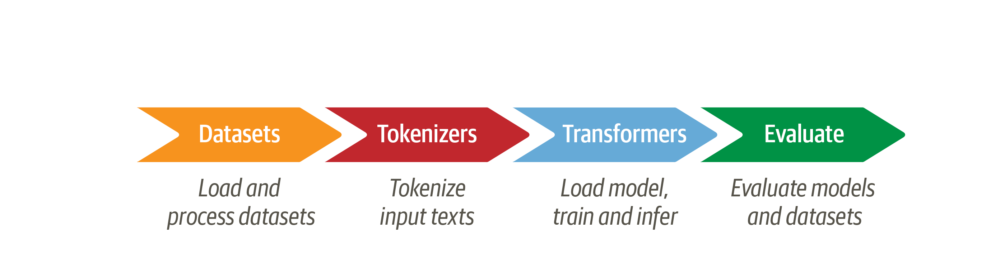

# Data Analytics with Apache Arrow and Hugging Face Datasets

<!-- {blog_metadata} -->
<!-- {authors} -->

Hugging Face Datasets is a library that was designed to complement machine learning training workflows. It enables users to share, download, process, and format datasets to get them ready for training with any of the major machine learning frameworks, across all data modalities: audio, video, text, and tabular. The 🤗 `datasets` library is typically the first entrypoint of any machine learning project, and 

|  |
|:--:|
| <b>Hugging Face libraries mapped to the steps of a typical machine learning workflow. Source: <a href="https://github.com/nlp-with-transformers" rel="noopener" target="_blank" >Natural Language Processing with Transformers</a></b>|

One of the remarkable features of 🤗 `datasets` is its ability to [quickly and efficiently](https://huggingface.co/docs/datasets/about_arrow) handle data that does not fit into system memory. This is made possible by using Apache Arrow as an underlying memory model. This post will demonstrate the synergies between the two projects, and how using the Arrow ecosystem can supercharge your library, giving you access to more features than you bargained for. We will show you how you can use 🤗 `datasets` for out-of-core data analytics to better understand your data, ahead of using it to train a model.


## Apache Arrow and Arrow Tables

## Hugging Face Dataset Formats

```python
from datasets import load_dataset
dset = load_dataset("bigcode/the-stack-dedup", data_dir="data/python", split="train")
print(dset.num_rows, " rows")
print(dset.dataset_size / 1024**3, " GB")
>>> 12962249 rows
>>> 66.9516989979893 GB
```
## The Arrow Compute API

## Mapping Compute Primitives

Scratchpad: synergy between the two libraries. success story of arrow. Come for the memory model / mmapping, stay for the data analytics.