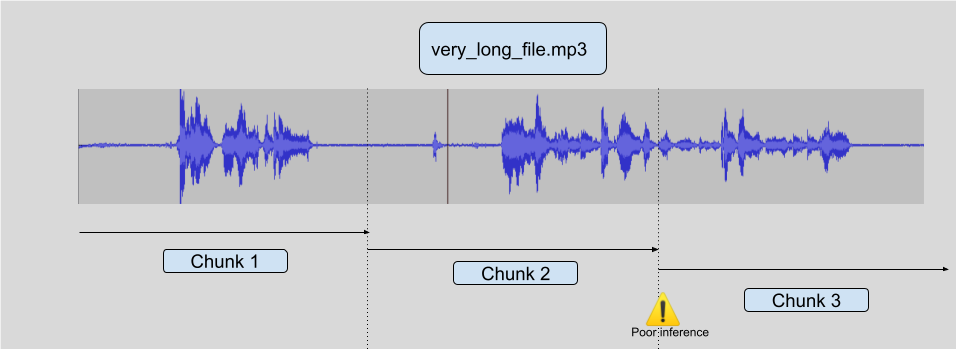
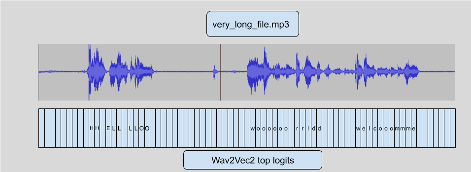
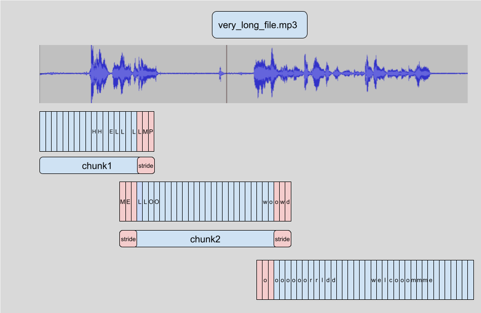

<h1>
    Making automatic speech recognition work on large files with Wav2Vec2 in 🤗 Transformers
</h1>

<div class="blog-metadata">
    <small>Published January 28, 2022.</small>
    <a target="_blank" class="btn no-underline text-sm mb-5 font-sans" href="https://github.com/huggingface/blog/blob/master/asr-chunking.md">
        Update on GitHub
    </a>
</div>

<div class="author-card">
    <a href="/Narsil">
        
        <div class="bfc">
            <code>narsil</code>
            <span class="fullname">Nicolas Patry</span>
        </div>
    </a>
</div>

```
Tl;dr: This post explains how to use the specificities of the Connectionist
Temporal Classification (CTC) architecture in order to achieve very good
quality automatic speech recognition even on arbitrarily long files or 
during live inference.
```


**Wav2Vec2** is a popular pre-trained model for speech recognition.
Released in [September 2020](https://ai.facebook.com/blog/wav2vec-20-learning-the-structure-of-speech-from-raw-audio/)
by Meta AI Research, the novel architecture catalyzed progress in
self-supervised pretraining for speech recognition, *e.g.* [*G. Ng et
al.*, 2021](https://arxiv.org/pdf/2104.03416.pdf), [*Chen et al*,
2021](https://arxiv.org/abs/2110.13900), [*Hsu et al.*,
2021](https://arxiv.org/abs/2106.07447) and [*Babu et al.*,
2021](https://arxiv.org/abs/2111.09296). On the Hugging Face Hub,
Wav2Vec2's most popular pre-trained checkpoint currently amounts to
over [**250,000** monthly
downloads](https://huggingface.co/facebook/wav2vec2-base-960h).

**Wav2Vec2** is at its core a **transformers** models and one caveat
of **transformers** is that it usually has a finite amount of sequence
length it can handle. Either because it uses **position encodings** (not
the case here) or simply because the cost of attention in transformers
is actually O(n²) in sequence_length, meaning that using very large
sequence_length explodes in complexity/memory. So you cannot with finite hardware
(even a very large GPU like A100), simply run Wav2Vec2 on an hour long
file. Your program will crash. Let's try it !

```bash
pip install transformers
```

```python
from transformers import pipeline

# This will work on any of the thousands of models at
# https://huggingface.co/models?pipeline_tag=automatic-speech-recognition&sort=downloads
pipe = pipeline(model="facebook/wav2vec2-base-960h")


# The Public Domain LibriVox file used for the test
#!wget https://ia902600.us.archive.org/8/items/thecantervilleghostversion_2_1501_librivox/thecantervilleghostversion2_01_wilde_128kb.mp3 -o very_long_file.mp3

pipe("very_long_file.mp3")
# Crash out of memory !

pipe("very_long_file.mp3", chunk_length_s=10)
# This works and prints a very long string ! 
# This whole blogpost will explain how to make things work
``` 


Simple Chunking
---------------

The simplest way to achieve inference on very long files would be to simply chunk
the initial audio into let's say 10s samples, run inference on those, and end up
with a final reconstruction. This is efficient computationally but usually leads
to subpar results, the reason being that in order to do good inference, the model
needs some context, so around the chunking border, inference tends to be of poor
quality.

Look at the following diagram:



There are ways to try and work around the problem in a general fashion, but
they are never entirely robust. You can try to chunk only when you encounter
silence but you may have a non silent audio for a long time (a song, or noisy
café audio ?). You can also try to cut only when there's no voice but it requires
another model and this is not an entirely solved problem. And you could have
a continous voice for a very long time.

As it turns out, CTC structure, which is used by Wav2Vec2,  can be exploited
in order to achieve very robust speech recognition even on very long files
without falling into those pitfalls.


Chunking with stride
--------------------

So Wav2Vec2 uses [CTC algorithm](https://distill.pub/2017/ctc/), which means that every audio sample is "affected"
to a single letter prediction (logit).




That's the main feature we're going to use in order to add a `stride`.
This [link](https://www.quora.com/What-does-stride-mean-in-the-context-of-convolutional-neural-networks) explains it 
in the image context, but it's the same concept for audio.
Because of this property, we can start doing inference on **overlapping** chunks
so that the model actually has proper context in the center, and simply **drop**
the inferenced logits on the side. We can then just chain the **logits** without
their dropped sides to recover something extremely close to what the model would have
predicted on the full length audio.



This is not **technically** 100% the same thing as running the model on the whole
file so it is not enabled by default, but as you saw in the earlier example you
need only to add `chunk_length_s` to your `pipeline` for it to work.

In practice we observed that most of the bad inference is kept within
the strides, which get dropped before inference, leading to a proper
inference of the full text.

Let's note that you can choose every argument of this technique:

```python
from transformers import pipeline

pipe = pipeline(model="facebook/wav2vec2-base-960h")
# stride_length_s is a tuple of the left and right stride length.
# With only 1 number, both sides get the same stride, by default
# the stride_length on one side is 1/6th of the chunk_length_s
output = pipe("very_long_file.mp3", chunk_length_s=10, stride_length_s=(4, 2))
```


Chunking with stride on LM augmented models
-------------------------------------------

In [transformers](https://github.com/huggingface/transformers), we also
added support for adding LM to Wav2Vec2 in order to boost the WER performance
of the models without even finetuning. [See this excellent blogpost explaining
how it works](https://huggingface.co/blog/wav2vec2-with-ngram).


It turns out, that the LM works directly on the logits themselves, so we
can actually apply the exact same technique as before without any modification !
So chunking large files on these LM boosted models still works out of the box.

Live inference
--------------

A very nice perk of using a CTC model like Wav2vec2, is that it is a single
pass model, so it is **very** fast. Especially on GPU. We can exploit that in order
to do live inference.

The principle is exactly the same as regular striding, but this time we can
feed the pipeline data **as it is coming in** and simply use striding on
full chunks of length 10s for instance with 1s striding to get proper context.

That requires running much more inference steps than simple file chunking, but it can make the 
live experience much better because the model can print things as you are 
speaking, without having to wait for X seconds before seeing something displayed.
