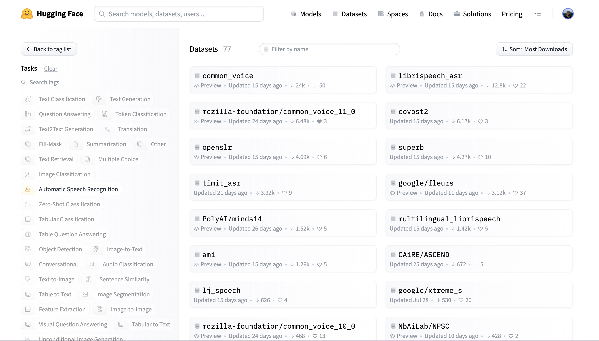

# A Complete Guide to Audio Datasets

<div class="blog-metadata">
    <small>Published 21 November, 2022.</small>
    <a target="_blank" class="btn no-underline text-sm mb-5 font-sans" href="https://github.com/huggingface/blog/blob/main/audio-datasets.md">
        Update on GitHub
    </a>
</div>

<div class="author-card">
    <a href="/sanchit-gandhi"> 
        
        <div class="bfc">
            <code>sanchit-gandhi</code>
            <span class="fullname">Sanchit Gandhi</span>
        </div>
    </a>
</div>

It's well known that 🤗 Datasets provides the easiest access to numerous NLP datasets. What's less known is that the 
same is true for audio datasets: all of the most popular audio datasets can be downloaded and prepared with the 
same ease as their NLP counterparts.

🤗 Datasets is open-source library for downloading and preparing datasets of all domains. Its minimalistic API 
allows users to download and prepare datasets in just one line of Python code, with a suite of functions that 
enable for efficient pre-processing. The number of datasets available is unparalleled: all of the most popular 
audio datasets are available through 🤗 Datasets.

Not only this, but 🤗 Datasets comes prepared with multiple audio-specific features that make working 
with audio datasets easy for both researchers and practitioners alike. In this blog, we'll demonstrate how 🤗 Datasets 
is the number one place for downloading and preparing audio datasets. Carry on reading to find out how to load and 
prepare the most popular audio datasets in just one line of Python code!

## Load an Audio Dataset

One of the key defining features of 🤗 Datasets is the ability to download and prepare a dataset in just one line of 
Python code. This is made possible through the [`load_dataset`](https://huggingface.co/docs/datasets/loading#load) 
function. Conventionally, we'd have to download the raw data, extract it from its compressed format, and prepare individal 
samples and splits. Using `load_dataset`, all of the heavy lifting of loading a dataset is done under the hood.

including 
downloading the raw data, extracting it from compressed files, and finally preparing samples and splits.

Let's take the example of loading the [GigaSpeech](https://huggingface.co/datasets/speechcolab/gigaspeech) dataset from 
Speech Colab. GigaSpeech is a relatively recent speech recognition dataset for benchmarking academic speech systems. It is one 
of many speech recognition datasets available through the Hugging Face Hub. To load the GigaSpeech dataset, we simply have to 
specify the dataset's identifier to the `load_dataset` function. GigaSpeech comes in an array of different split sizes, 
ranging from `xs` (10 hours) to `xl` (10,000 hours). For the purpose of this tutorial, we'll load the smallest of these 
splits:

```python
from datasets import load_dataset

gigaspeech = load_dataset("speechcolab/gigaspeech", "xs")

print(gigaspeech)
```

**Print Output:**
```python
DatasetDict({
    train: Dataset({
        features: ['segment_id', 'speaker', 'text', 'audio', 'begin_time', 'end_time', 'audio_id', 'title', 'url', 'source', 'category', 'original_full_path'],
        num_rows: 9389
    })
    validation: Dataset({
        features: ['segment_id', 'speaker', 'text', 'audio', 'begin_time', 'end_time', 'audio_id', 'title', 'url', 'source', 'category', 'original_full_path'],
        num_rows: 6750
    })
    test: Dataset({
        features: ['segment_id', 'speaker', 'text', 'audio', 'begin_time', 'end_time', 'audio_id', 'title', 'url', 'source', 'category', 'original_full_path'],
        num_rows: 25619
    })
})
```

And just like that we have the GigaSpeech dataset ready! There simply is no easier way of loading an audio dataset! We 
can see that we have the training, validation and test splits pre-partitioned, with the corresponding information for 
each.

The object `gigaspeech` returned by `load_dataset` is a [`DatasetDict`](https://huggingface.co/docs/datasets/package_reference/main_classes#datasets.DatasetDict). 
We can treat it in much the same way as an ordinary Python dictionary. To get the train split, we simply have to pass 
the corresponding key to the `DatasetDict` object:

```python
print(gigaspeech["train"])
```

**Print Output:**
```python
Dataset({
    features: ['segment_id', 'speaker', 'text', 'audio', 'begin_time', 'end_time', 'audio_id', 'title', 'url', 'source', 'category', 'original_full_path'],
    num_rows: 9389
})
```

We can go one level deeper and get the first item of the training split. Again, this is possible through simple Python 
indexing:
```python
print(gigaspeech["train"][0])
```

**Print Output:**
```python
{'segment_id': 'YOU0000000315_S0000660',
 'speaker': 'N/A', 
 'text': "AS THEY'RE LEAVING <COMMA> CAN KASH PULL ZAHRA ASIDE REALLY QUICKLY <QUESTIONMARK>", 
 'audio': {'path': '/home/sanchit_huggingface_co/.cache/huggingface/datasets/downloads/extracted/7f8541f130925e9b2af7d37256f2f61f9d6ff21bf4a94f7c1a3803ec648d7d79/xs_chunks_0000/YOU0000000315_S0000660.wav', 
           'array': array([0.0005188 , 0.00085449, 0.00012207, ..., 0.00125122, 0.00076294,
       0.00036621], dtype=float32), 
           'sampling_rate': 16000
           }, 
 'begin_time': 2941.889892578125, 
 'end_time': 2945.070068359375, 
 'audio_id': 'YOU0000000315', 
 'title': 'Return to Vasselheim | Critical Role: VOX MACHINA | Episode 43', 
 'url': 'https://www.youtube.com/watch?v=zr2n1fLVasU', 
 'source': 2, 
 'category': 24, 
 'original_full_path': 'audio/youtube/P0004/YOU0000000315.opus'
 }
```

We can see that there are a number of features returned by the `DatasetDict`, including `segment_id`, `speaker`, `text`, 
`audio` and more. For speech recognition, we'll be concerned with the `text` and `audio` columns. 

<!--- TODO: audio folder --->

## Easy to Load, Easy to Process

Loading a dataset with 🤗 Datasets is just half of the fun. We can now use the suite of tools available to efficiently 
pre-process our data ready for model inference or training. In this Section, we'll perform three stages of data 
pre-processing:
1. [Resampling the Audio Data](#resampling-the-audio-data)
2. [Pre-Processing Function](#pre-processing-function)
3. [Filtering Function](#filtering-function)

### 1. Resampling the Audio Data
The `load_dataset` function prepares audio samples with the sampling rate that they were published with. This is not 
always the sampling rate expected by our model. In this case, we need to _resample_ the audio to the correct sampling 
rate.

We can set the audio inputs to the correct sampling rate using 🤗 Dataset's [`cast_column`](https://huggingface.co/docs/datasets/package_reference/main_classes.html?highlight=cast_column#datasets.DatasetDict.cast_column) 
method. This operation does not change the audio in-place, but rather signals to `datasets` to resample audio samples 
_on the fly_ the first time that they are loaded:

```python
from datasets import Audio

gigaspeech = gigaspeech.cast_column("audio", Audio(sampling_rate=8000))
```

Re-loading the first audio sample in the gigaspeech dataset will resample it to the desired sampling rate:

```python
print(gigaspeech["train"][0])
```
**Print Output:**
```python
{'segment_id': 'YOU0000000315_S0000660',
 'speaker': 'N/A', 
 'text': "AS THEY'RE LEAVING <COMMA> CAN KASH PULL ZAHRA ASIDE REALLY QUICKLY <QUESTIONMARK>", 
 'audio': {'path': '/home/sanchit_huggingface_co/.cache/huggingface/datasets/downloads/extracted/7f8541f130925e9b2af7d37256f2f61f9d6ff21bf4a94f7c1a3803ec648d7d79/xs_chunks_0000/YOU0000000315_S0000660.wav', 
           'array': array([ 0.00046338,  0.00034808, -0.00086153, ...,  0.00099299,
        0.00083484,  0.00080221], dtype=float32), 
           'sampling_rate': 8000
           }, 
 'begin_time': 2941.889892578125, 
 'end_time': 2945.070068359375, 
 'audio_id': 'YOU0000000315', 
 'title': 'Return to Vasselheim | Critical Role: VOX MACHINA | Episode 43', 
 'url': 'https://www.youtube.com/watch?v=zr2n1fLVasU', 
 'source': 2, 
 'category': 24, 
 'original_full_path': 'audio/youtube/P0004/YOU0000000315.opus'
 }
```
We can see that the sampling rate has been downsampled to 8kHz. The array values are also different, as we've now only 
got approximately one amplitude value for every two that we had before.

<!--- TODO: resample back to 16kHz --->

### 2. Pre-Processing Function
One of the hardest aspects of working with audio datasets is preparing the data into the right format for the model. 
Using 🤗 Dataset's [`map`](https://huggingface.co/docs/datasets/v2.6.1/en/process#map) method, we can write a function 
to pre-process a single sample of the dataset, and then handily apply it to every sample without any code changes!

Let's first load a processor object from 🤗 Transformers. This processor will take care of pre-processing the audio 
inputs and tokenising the text. The `AutoProcessor` class is used to load a pre-trained processor 
from a given model checkpoint. In the example, we load the processor from OpenAI's [Whisper small.en](https://huggingface.co/openai/whisper-small.en) 
checkpoint, but you can change this to any model identifier on the Hugging Face Hub:

```python
from transformers import AutoProcessor

processor = AutoProcessor.from_pretrained("openai/whisper-small.en")
```

Great! Now we write a function that takes a single training sample and passes it through the `processor` to pre-process 
ready for our model. We'll also compute the input length of each audio sample, information that we'll need for our next 
data preparation step:

```python
def prepare_dataset(batch):
    audio = batch["audio"]
    batch = processor(audio["array"], sampling_rate=audio["sampling_rate"], text=batch["text"])
    batch["input_length"] = len(audio["array"]) / audio["sampling_rate"]
    return batch
```

We can apply the data preparation function to all of our training examples using dataset's `map` method:

```python
gigaspeech = gigaspeech.map(prepare_dataset, remove_columns=next(iter(gigaspeech.values())).column_names)
```

Here, we remove the columns were defined when we loaded the dataset that we do not require for the speech recognition task 
(e.g. `segment_id`, `speaker`, etc.).

### 3. Filtering Function

Prior to training, we might have a heuristic by which we want to filter our training data. For instance, we might want 
to filter any audio samples longer than 30s. We can do this in much the same way that we prepared our dataset 
for our model in the previous step. We start by writing a function that returns a boolean, indicating which samples are 
shorter than 30s (True) and which are longer (False):

```python
MAX_DURATION_IN_SECONDS = 30

def is_audio_length_in_range(input_length):
    return 0 < input_length < MAX_DURATION_IN_SECONDS
```

We can apply this filtering function to all of our training examples using 🤗 Dataset's [`filter`](https://huggingface.co/docs/datasets/process#select-and-filter) 
method, keeping all samples that are shorter than 30s (True) and discarding those that are longer (False):

```python
gigaspeech["train"] = gigaspeech["train"].filter(is_audio_length_in_range, input_columns=["input_length"])
```

And with that, we have the GigaSpeech dataset fully prepared for our model! This required just 13 lines of Python 
code in total, right from loading the dataset to the final filtering step. 

Keeping the notebook as general as possible, 
we only performed the fundamental data preparation steps. However, there is no restriction to the functions you can 
apply to your audio dataset. You can extend the function `prepare_dataset` to perform much more involved operations, 
such as data augmentation or noise reduction. With 🤗 Datasets, if you can write it in a Python function, 
you can apply it to your dataset!

## Streaming Mode: The Silver Bullet


## The Hub

So far, we've taken a step-by-step guide to loading and pre-processing the GigaSpeech dataset. However, the GigaSpeech 
dataset is just one of over 100 audio datasets available to us through the Hugging Face Hub. Everything that we've covered for 
GigaSpeech can be applied to any one of these other datasets. All we have to do is switch the dataset identifier in the 
`load_dataset` function for the dataset that we desire. It's that easy!

Let's head to the Hub and filter datasets by task:
* [Speech Recognition Datasets on the Hub](https://huggingface.co/datasets?task_categories=task_categories:automatic-speech-recognition&sort=downloads)
* [Audio Classification Datasets on the Hub](https://huggingface.co/datasets?task_categories=task_categories:audio-classification&sort=downloads)

<figure>

</figure>

At the time of writing, there are 77 speech recognition dataset and 28 audio classification datasets on the Hub, 
with these numbers ever-growing. You can select any one of these datasets to suit your needs. Let's check out the first 
result, `common_voice`. Clicking on `common_voice` brings up the dataset card:

<figure>

</figure>

Here, we can find out additional information about the dataset, see what models are trained on the dataset and, most 
excitingly, get to listen to actual audio samples! The Dataset Preview is loaded up in the middle of the dataset card. 
It shows us the first 100 samples for each subset and split. What's more, it's loaded up the audio samples ready for us 
to listen to in real-time! If we hit the play button on the first sample, we can listen to the audio and see the 
corresponding text. The Dataset Preview is a brilliant way of experiencing audio datasets before you download them. 
You can simply through the samples for the different subsets and splits to get a better feel for the 
audio data that we're dealing with. 

## A Tour of Audio Datasets on The Hub
This Section serves as a reference guide for the most popular speech recognition, speech 
translation and audio classification datasets on the Hub. Check out the Google Colab for a guide on how to evaluate a 
system on all nine English speech recognition datasets in one script: TODO

### Speech Recognition

Summary of English speech recognition datasets.

|                                                                                         | Train Hours | Domain                                | Speaking Style         | Casing | Punctuation | Recommended Usage                                 |
|-----------------------------------------------------------------------------------------|-------------|---------------------------------------|------------------------|--------|-------------|---------------------------------------------------|
| [LibriSpeech](https://huggingface.co/datasets/librispeech_asr)                          | 960         | Audiobooks                            | Narrated               | ❌      | ❌           | Academic benchmarks                               |
| [Common Voice 11](https://huggingface.co/datasets/mozilla-foundation/common_voice_11_0) | 2300        | Wikipedia text & crowd-sourced speech | Narrated               | ✅      | ✅           | Non-native English speakers                       |
| [VoxPopuli](https://huggingface.co/datasets/facebook/voxpopuli)                         | 540         | European Parliament recordings        | Oratory                | ❌      | ❌           | Non-native English speakers                       |
| [TED-LIUM](https://huggingface.co/datasets/LIUM/tedlium)                                | 450         | TED talks                             | Oratory                | ❌      | ❌           | Technical scientific, political and social topics |
| [GigaSpeech](https://huggingface.co/datasets/speechcolab/gigaspeech)                    | 10000       | Audiobook, podcast, youtube           | Narrated & spontaneous | ❌      | ✅           | Robustness over multiple domains                  |
| [SPGISpeech](https://huggingface.co/datasets/kensho/spgispeech)                         | 5000        | Financial meetings                    | Narrated & spontaneous | ✅      | ✅           | Fully formatted transcriptions                    |
| [Earnings-22](https://huggingface.co/datasets/revdotcom/earnings22)                     | 119         | Company earnings calls                | Narrated & spontaneous | ✅      | ✅           | Diversity of accents                              |
| [AMI](https://huggingface.co/datasets/edinburghcstr/ami)                                | 100         | Meetings                              | Spontaneous            | ✅      | ✅           | Noisy speech conditions                           |

The following dataset descriptions are largely taken from the [ESB Benchmark](https://arxiv.org/abs/2210.13352) paper.

#### [LibriSpeech ASR](https://huggingface.co/datasets/librispeech_asr)
LibriSpeech is a standard large-scale dataset for evaluating ASR systems. It consists of approximately 1,000 
hours of narrated audiobooks collected from the [LibriVox](https://librivox.org/) project. LibriSpeech has been 
instrumental in facilitating researchers to leverage a large body of pre-existing transcribed speech data. As such, it 
has become the one of the most popular dataset for benchmarking academic speech systems.

```python
librispeech = load_dataset("librispeech_asr", "all")
```

#### [Common Voice](https://huggingface.co/datasets/mozilla-foundation/common_voice_11_0)
Common Voice is a series of crowd-sourced open-licensed speech datasets where speakers record text from Wikipedia in 
various languages. Since anyone can contribute recordings, there is significant variation in both audio quality and 
speakers. The audio conditions are challenging, with recording artefacts, accented speech, hesitations, and the presence 
of foreign words. The transcriptions are both cased and punctuated. The English subset of version 11.0 contains 
approximately 2,300 hours of validated data.

```python
common_voice = load_dataset("mozilla-foundation/common_voice_11", "en", use_auth_token=True)
```

#### [VoxPopuli](https://huggingface.co/datasets/facebook/voxpopuli)
VoxPopuli is a large-scale multilingual speech corpus consisting of data sourced from 2009-2020 European Parliament 
event recordings. Consequently, it occupies the unique domain of oratory, political speech, largely sourced from 
non-native speakers. The English subset contains approximately 550 hours labelled speech.

```python
voxpopuli = load_dataset("facebook/voxpopuli", "en")
```

#### [TED-LIUM](https://huggingface.co/datasets/LIUM/tedlium)
TED-LIUM is a dataset is based on English-language TED Talk conference videos. The speaking style is oratory educational 
talks. The transcribed talks cover a range of different cultural, political, and academic topics, resulting in a 
technical vocabulary. The Release 3 (latest) edition of the dataset contains approximately 450 hours of training data. 
The validation and test data is from the legacy set, consistent with earlier releases.

```python
tedlium = load_dataset("LIUM/tedlium", "release3")
```

#### [GigaSpeech](https://huggingface.co/datasets/speechcolab/gigaspeech)
GigaSpeech is a multi-domain English speech recognition corpus curated from audiobooks, podcasts and YouTube. It covers 
both narrated and spontaneous speech over a variety of topics, such as arts, science and sports. It contains training 
splits varying from 10 hours - 10,000 hours and standardised validation and test splits.

```python
gigaspeech = load_dataset("speechcolab/gigaspeech", "xs", use_auth_token=True)
```

#### [SPGISpeech](https://huggingface.co/datasets/kensho/spgispeech)
SPGISpeech is an English speech recognition corpus composed of company earnings calls that have been manually 
transcribed by S&P Global, Inc. The transcriptions are fully-formatted according to a professional style guide for 
oratory and spontaneous speech. It contains training splits ranging from 200 hours - 5,000 hours, with canonical 
validation and test splits.

```python
spgispeech = load_dataset("kensho/spgispeech", "s", use_auth_token=True)
```

#### [Earnings-22](https://huggingface.co/datasets/revdotcom/earnings22)
Earnings-22 is a 119-hour corpus of English-language earnings calls collected from global companies. The dataset was 
developed with the goal of aggregating a broad range of speakers and accents covering a range of real-world financial 
topics. There is large diversity in the speakers and accents, with speakers taken from seven different language regions.
Earnings-22 was published primarily as a test-only dataset. The Hub contains a version of the dataset that has been 
partitioned into train-validation-test splits.

```python
earnings22 = load_dataset("revdotcom/earnings22")
```

#### [AMI](https://huggingface.co/datasets/edinburghcstr/ami)
AMI comprises 100 hours of meeting recordings captured using different recording streams. The corpus contains manually 
annotated orthographic transcriptions of the meetings aligned at the word level. Individual samples of the AMI dataset 
contain very large audio files (between 10 and 60 minutes), which are segmented to lengths feasible for training most 
speech recognition systems. AMI contains two splits: IHM and SDM. IHM (individual headset microphone) contains easier 
near-field speech, and SDM (single distant microphone) harder far-field speech.

```python
ami = load_dataset("edinburghcstr/ami", "ihm")
```
