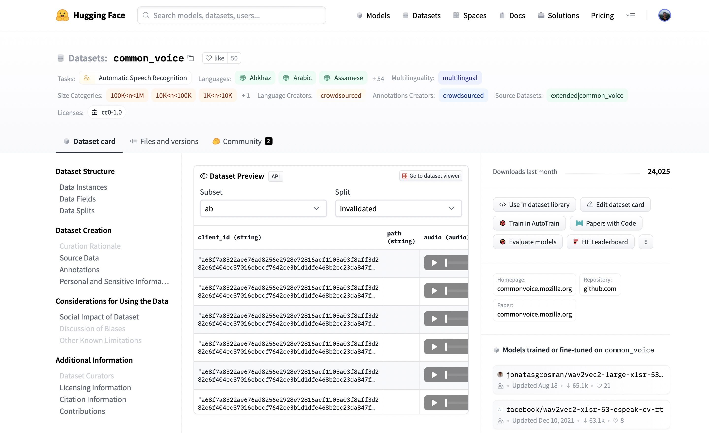

# A Complete Guide to Audio Datasets

{blog_metadata}
{authors}

<!--- Note to reviewer: comments and TODOs are included in this format. --->

<a target="_blank" href="https://colab.research.google.com/github/sanchit-gandhi/notebooks/blob/main/audio_datasets_colab.ipynb">
    
</a>

## Introduction

🤗 Datasets is an open-source library for downloading and preparing datasets from all domains. Its minimalistic API 
allows users to download and prepare datasets in just one line of Python code, with a suite of functions that 
enable efficient pre-processing. The number of datasets available is unparalleled, with all the most popular 
machine learning datasets available to download. 

Not only this, but 🤗 Datasets comes prepared with multiple audio-specific features that make working 
with audio datasets easy for researchers and practitioners alike. In this blog, we'll demonstrate these features, showcasing
why 🤗 Datasets is the go-to place for downloading and preparing audio datasets.

## Contents
1. [The Hub](#the-hub)
2. [Load an Audio Dataset](#load-an-audio-dataset)
3. [Easy to Load, Easy to Process](#easy-to-load-easy-to-process)
4. [Streaming Mode: The Silver Bullet](#streaming-mode-the-silver-bullet)
5. [A Tour of Audio Datasets on the Hub](#a-tour-of-audio-datasets-on-the-hub)
6. [Closing Remarks](#closing-remarks)

## The Hub

The Hugging Face Hub is a platform for hosting models, datasets and demos, all open source and publicly available. 
It is home to a growing collection of audio datasets that span a variety of domains, tasks and languages. Through 
tight integrations with 🤗 Datasets, all the datasets on the Hub can be downloaded in one line of code.

Let's head to the Hub and filter the datasets by task:
* [Speech Recognition Datasets on the Hub](https://huggingface.co/datasets?task_categories=task_categories:automatic-speech-recognition&sort=downloads)
* [Audio Classification Datasets on the Hub](https://huggingface.co/datasets?task_categories=task_categories:audio-classification&sort=downloads)

<figure>

</figure>

At the time of writing, there are 77 speech recognition datasets and 28 audio classification datasets on the Hub, 
with these numbers ever-increasing. You can select any one of these datasets to suit your needs. Let's check out the first 
speech recognition result. Clicking on [`common_voice`](https://huggingface.co/datasets/common_voice) 
brings up the dataset card:

<figure>

</figure>

Here, we can find additional information about the dataset, see what models are trained on the dataset and, most 
excitingly, listen to actual audio samples. The Dataset Preview is presented in the middle of the dataset card. 
It shows us the first 100 samples for each subset and split. What's more, it's loaded up the audio samples ready for us 
to listen to in real-time. If we hit the play button on the first sample, we can listen to the audio and see the 
corresponding text.

The Dataset Preview is a brilliant way of experiencing audio datasets before committing to using them. You can pick any 
dataset on the Hub, scroll through the samples and listen to the audio for the different subsets and splits, gauging whether 
it's the right dataset for your needs. Once you've selected a dataset, it's trivial to load the data so that you can 
start using it.

## Load an Audio Dataset

One of the key defining features of 🤗 Datasets is the ability to download and prepare a dataset in just one line of 
Python code. This is made possible through the [`load_dataset`](https://huggingface.co/docs/datasets/loading#load) 
function. Conventionally, loading a dataset involves: i) downloading the raw data, ii) extracting it from its 
compressed format, and iii) preparing individual samples and splits. Using `load_dataset`, all of the heavy lifting is done 
under the hood.

Let's take the example of loading the [GigaSpeech](https://huggingface.co/datasets/speechcolab/gigaspeech) dataset from 
Speech Colab. GigaSpeech is a relatively recent speech recognition dataset for benchmarking academic speech systems and is 
one of many audio datasets available on the Hugging Face Hub.

To load the GigaSpeech dataset, we simply take the dataset's identifier on the Hub (`speechcolab/gigaspeech`) and specify it
to the [`load_dataset`](https://huggingface.co/docs/datasets/loading#load) function. GigaSpeech comes in five configurations 
of increasing size, ranging from `xs` (10 hours) to `xl`(10,000 hours). For the purpose of this tutorial, we'll load the smallest 
of these configurations. The dataset's identifier and the desired configuration are all that we require to download the dataset:

```python
from datasets import load_dataset

gigaspeech = load_dataset("speechcolab/gigaspeech", "xs")

print(gigaspeech)
```

**Print Output:**
```python
DatasetDict({
    train: Dataset({
        features: ['segment_id', 'speaker', 'text', 'audio', 'begin_time', 'end_time', 'audio_id', 'title', 'url', 'source', 'category', 'original_full_path'],
        num_rows: 9389
    })
    validation: Dataset({
        features: ['segment_id', 'speaker', 'text', 'audio', 'begin_time', 'end_time', 'audio_id', 'title', 'url', 'source', 'category', 'original_full_path'],
        num_rows: 6750
    })
    test: Dataset({
        features: ['segment_id', 'speaker', 'text', 'audio', 'begin_time', 'end_time', 'audio_id', 'title', 'url', 'source', 'category', 'original_full_path'],
        num_rows: 25619
    })
})
```

And just like that, we have the GigaSpeech dataset ready! There simply is no easier way of loading an audio dataset. We 
can see that we have the training, validation and test splits pre-partitioned, with the corresponding information for 
each.

The object `gigaspeech` returned by the `load_dataset` function is a [`DatasetDict`](https://huggingface.co/docs/datasets/package_reference/main_classes#datasets.DatasetDict). 
We can treat it in much the same way as an ordinary Python dictionary. To get the train split, we pass the corresponding 
key to the `gigaspeech` dictionary:

```python
print(gigaspeech["train"])
```

**Print Output:**
```python
Dataset({
    features: ['segment_id', 'speaker', 'text', 'audio', 'begin_time', 'end_time', 'audio_id', 'title', 'url', 'source', 'category', 'original_full_path'],
    num_rows: 9389
})
```

This returns a [`Dataset`](https://huggingface.co/docs/datasets/v2.7.1/en/package_reference/main_classes#datasets.Dataset) 
object, which contains the data for the training split. We can go one level deeper and get the first item of the split. 
Again, this is possible through standard Python indexing:

```python
print(gigaspeech["train"][0])
```

**Print Output:**
```python
{'segment_id': 'YOU0000000315_S0000660',
 'speaker': 'N/A', 
 'text': "AS THEY'RE LEAVING <COMMA> CAN KASH PULL ZAHRA ASIDE REALLY QUICKLY <QUESTIONMARK>", 
 'audio': {'path': '/home/sanchit_huggingface_co/.cache/huggingface/datasets/downloads/extracted/7f8541f130925e9b2af7d37256f2f61f9d6ff21bf4a94f7c1a3803ec648d7d79/xs_chunks_0000/YOU0000000315_S0000660.wav', 
           'array': array([0.0005188 , 0.00085449, 0.00012207, ..., 0.00125122, 0.00076294,
       0.00036621], dtype=float32), 
           'sampling_rate': 16000
           }, 
 'begin_time': 2941.889892578125, 
 'end_time': 2945.070068359375, 
 'audio_id': 'YOU0000000315', 
 'title': 'Return to Vasselheim | Critical Role: VOX MACHINA | Episode 43', 
 'url': 'https://www.youtube.com/watch?v=zr2n1fLVasU', 
 'source': 2, 
 'category': 24, 
 'original_full_path': 'audio/youtube/P0004/YOU0000000315.opus',
 }
```

We can see that there are a number of features returned by the training split, including `segment_id`, `speaker`, `text`, 
`audio` and more. For speech recognition, we'll be concerned with the `text` and `audio` columns.

Using 🤗 Datasets' [`remove_columns`](https://huggingface.co/docs/datasets/process#remove) method, we can remove the 
dataset features not required for speech recognition:

```python
COLUMNS_TO_KEEP = ["text", "audio"]
all_columns = gigaspeech["train"].column_names
columns_to_remove = set(all_columns) - set(COLUMNS_TO_KEEP)

gigaspeech = gigaspeech.remove_columns(columns_to_remove)
```

Let's check that we've successfully retained the `text` and `audio` columns:

```python
print(gigaspeech["train"][0])
```

**Print Output:**

```python
{'text': "AS THEY'RE LEAVING <COMMA> CAN KASH PULL ZAHRA ASIDE REALLY QUICKLY <QUESTIONMARK>", 
 'audio': {'path': '/home/sanchit_huggingface_co/.cache/huggingface/datasets/downloads/extracted/7f8541f130925e9b2af7d37256f2f61f9d6ff21bf4a94f7c1a3803ec648d7d79/xs_chunks_0000/YOU0000000315_S0000660.wav', 
           'array': array([0.0005188 , 0.00085449, 0.00012207, ..., 0.00125122, 0.00076294,
       0.00036621], dtype=float32), 
           'sampling_rate': 16000}}
```

Great! We can see that we've got the two required columns `text` and `audio`. The `text` is a string with the sample
transcription and the `audio` a 1-dimensional array of amplitude values at a sampling rate of 16KHz. That's our 
dataset loaded!

## Easy to Load, Easy to Process

Loading a dataset with 🤗 Datasets is just half of the fun. We can now use the suite of tools available to efficiently 
pre-process our data ready for model training or inference. In this Section, we'll perform three stages of data 
pre-processing:

1. [Resampling the Audio Data](#1-resampling-the-audio-data)
2. [Pre-Processing Function](#2-pre-processing-function)
3. [Filtering Function](#3-filtering-function)

### 1. Resampling the Audio Data

The `load_dataset` function prepares audio samples with the sampling rate that they were published with. This is not 
always the sampling rate expected by our model. In this case, we need to _resample_ the audio to the correct sampling 
rate.

We can set the audio inputs to our desired sampling rate using 🤗 Datasets' 
[`cast_column`](https://huggingface.co/docs/datasets/package_reference/main_classes.html?highlight=cast_column#datasets.DatasetDict.cast_column) 
method. This operation does not change the audio in-place, but rather signals to `datasets` to resample the audio samples 
_on the fly_ when they are loaded. The following code cell will set the sampling rate to 8kHz:

```python
from datasets import Audio

gigaspeech = gigaspeech.cast_column("audio", Audio(sampling_rate=8000))
```

Re-loading the first audio sample in the GigaSpeech dataset will resample it to the desired sampling rate:

```python
print(gigaspeech["train"][0])
```

**Print Output:**

```python
{'text': "AS THEY'RE LEAVING <COMMA> CAN KASH PULL ZAHRA ASIDE REALLY QUICKLY <QUESTIONMARK>", 
 'audio': {'path': '/home/sanchit_huggingface_co/.cache/huggingface/datasets/downloads/extracted/7f8541f130925e9b2af7d37256f2f61f9d6ff21bf4a94f7c1a3803ec648d7d79/xs_chunks_0000/YOU0000000315_S0000660.wav', 
           'array': array([ 0.00046338,  0.00034808, -0.00086153, ...,  0.00099299,
        0.00083484,  0.00080221], dtype=float32), 
           'sampling_rate': 8000}
 }
```

We can see that the sampling rate has been downsampled to 8kHz. The array values are also different, as we've now only 
got approximately one amplitude value for every two that we had before. Let's set the dataset sampling rate back to 
16kHz, the sampling rate expected by most speech recognition models:

```python
gigaspeech = gigaspeech.cast_column("audio", Audio(sampling_rate=16000))

print(gigaspeech["train"][0])
```

**Print Output:**

```python
{'text': "AS THEY'RE LEAVING <COMMA> CAN KASH PULL ZAHRA ASIDE REALLY QUICKLY <QUESTIONMARK>", 
 'audio': {'path': '/home/sanchit_huggingface_co/.cache/huggingface/datasets/downloads/extracted/7f8541f130925e9b2af7d37256f2f61f9d6ff21bf4a94f7c1a3803ec648d7d79/xs_chunks_0000/YOU0000000315_S0000660.wav', 
           'array': array([0.0005188 , 0.00085449, 0.00012207, ..., 0.00125122, 0.00076294,
       0.00036621], dtype=float32), 
           'sampling_rate': 16000}
 }
```

Easy! `cast_column` provides a straightforward mechanism for resampling audio datasets as and when required.

### 2. Pre-Processing Function

One of the most challenging aspects of working with audio datasets is preparing the data in the right format for our 
model. Using 🤗 Datasets' [`map`](https://huggingface.co/docs/datasets/v2.6.1/en/process#map) method, we can write a 
function to pre-process a single sample of the dataset, and then apply it to every sample without any code changes.

First, let's load a processor object from 🤗 Transformers. This processor pre-processes the audio to input features and 
tokenises the target text to labels. The `AutoProcessor` class is used to load a processor from a given model checkpoint. 
In the example, we load the processor from OpenAI's [Whisper medium.en](https://huggingface.co/openai/whisper-medium.en) 
checkpoint, but you can change this to any model identifier on the Hugging Face Hub:

```python
from transformers import AutoProcessor

processor = AutoProcessor.from_pretrained("openai/whisper-medium.en")
```

Great! Now we can write a function that takes a single training sample and passes it through the `processor` to prepare 
it for our model. We'll also compute the input length of each audio sample, information that we'll need for the next 
data preparation step:

```python
def prepare_dataset(batch):
    audio = batch["audio"]
    batch = processor(audio["array"], sampling_rate=audio["sampling_rate"], text=batch["text"])
    
    batch["input_length"] = len(audio["array"]) / audio["sampling_rate"]
    return batch
```

We can apply the data preparation function to all of our training examples using 🤗 Datasets' `map` method. Here, we also 
remove the `text` and `audio` columns, since we have pre-processed the audio to input features and tokenised the text to
labels:

```python
gigaspeech = gigaspeech.map(prepare_dataset, remove_columns=gigaspeech["train"].column_names)
```

### 3. Filtering Function

Prior to training, we might have a heuristic for filtering our training data. For instance, we might want to filter any 
audio samples longer than 30s to prevent truncating the audio samples or risking out-of-memory errors. We can do this in 
much the same way that we prepared the data for our model in the previous step. 

We start by writing a function that indicates which samples to keep and which to discard. This 
function, `is_audio_length_in_range`, returns a boolean: samples that are shorter than 30s return True, and those 
that are longer False.

```python
MAX_DURATION_IN_SECONDS = 30.0

def is_audio_length_in_range(input_length):
    return input_length < MAX_DURATION_IN_SECONDS
```

We can apply this filtering function to all of our training examples using 🤗 Datasets' [`filter`](https://huggingface.co/docs/datasets/process#select-and-filter) 
method, keeping all samples that are shorter than 30s (True) and discarding those that are longer (False):

```python
gigaspeech["train"] = gigaspeech["train"].filter(is_audio_length_in_range, input_columns=["input_length"])
```

And with that, we have the GigaSpeech dataset fully prepared for our model! In total, this process required 13 lines of 
Python code, right from loading the dataset to the final filtering step.

Keeping the notebook as general as possible, we only performed the fundamental data preparation steps. However, there 
is no restriction to the functions you can apply to your audio dataset. You can extend the function `prepare_dataset` 
to perform much more involved operations, such as data augmentation, voice activity detection or noise reduction. With 
🤗 Datasets, if you can write it in a Python function, you can apply it to your dataset!

## Streaming Mode: The Silver Bullet

One of the biggest challenges faced with audio datasets is their sheer size. The `xs` configuration of GigaSpeech contained just 10 
hours of training data, but amassed over 13GB of storage space for download and preparation. So what happens when we 
want to train on a larger split? The full `xl` configuration contains 10,000 hours of training data, requiring over 1TB of 
storage space. For most speech researchers, this well exceeds the specifications of a typical hard drive disk. 
Do we need to fork out and buy additional storage? Or is there a way we can train on these datasets with **no disk space 
constraints**?

🤗 Datasets allow us to do just this. It is made possible through the use of [_streaming_](https://huggingface.co/docs/datasets/stream) 
mode, depicted graphically in Figure 1. Streaming allows us to load the data progressively as we iterate over the dataset. 
Rather than downloading the whole dataset at once, we load the dataset sample by sample. We iterate over the dataset, 
loading and preparing samples _on the fly_ when they are needed. This way, we only ever load the samples that we're using, 
and not the ones that we're not! Once we're done with a sample, we continue iterating over the dataset and load the next one.

This is analogous to _downloading_ a TV show versus _streaming_ it. When we download a TV show, we download the entire video 
offline and save it to our disk. We have to wait for the entire video to download before we can watch it and require as 
much disk space as size of the video file. Compare this to streaming a TV show. Here, we don’t download any part of the 
video to disk, but rather iterate over the remote video file and load each part in real-time as required. We don't have 
to wait for the full video to buffer before we can start watching, we can start as soon as the first portion of the video 
is ready! This is the same _streaming_ principle that we apply to loading datasets.

<figure>

<figcaption align = "center"><b>Figure 1:</b> Streaming mode. The dataset is loaded progressively as we iterate over the dataset.</figcaption>
</figure>

Streaming mode has three primary advantages over downloading the entire dataset at once:
1. **Disk space:** samples are loaded to memory one-by-one as we iterate over the dataset. Since the data is not downloaded locally, there are no disk space requirements, so you can use datasets of arbitrary size.
2. **Download and processing time:** audio datasets are large and need a significant amount of time to download and process. With streaming, loading and processing is done on the fly, meaning you can start using the dataset as soon as the first sample is ready.
3. **Easy experimentation:** you can experiment on a handful samples to check that your script works without having to download the entire dataset.

There is one caveat to streaming mode. When downloading a dataset, both the raw data and processed data are saved locally 
to disk. If we want to re-use this dataset, we can directly load the processed data from disk, skipping the download and 
processing steps. Consequently, we only have to perform the downloading and processing operations once, after which we 
can re-use the prepared data. With streaming mode, the data is not downloaded to disk. Thus, neither the downloaded nor 
pre-processed data are cached. If we want to re-use the dataset, the streaming steps must be repeated, with the audio 
files loaded and processed on the fly again. For this reason, it is advised to download datasets that you are likely to use
multiple times.

How can you enable streaming mode? Easy! Just set `streaming=True` when you load your dataset. The rest will be taken 
care for you:

```python
gigaspeech = load_dataset("speechcolab/gigaspeech", "xs", streaming=True)
```

All the steps covered so far in this tutorial can be applied to the streaming dataset without any code changes.
The only change is that you can no longer access individual samples using Python indexing (i.e. `gigaspeech["train"][sample_idx]`). 
Instead, you have to iterate over the dataset, using a `for` loop for example.

Streaming mode can take your research to the next level: not only are the biggest datasets accessible to you, but you 
can easily evaluate systems over multiple datasets in one go without worrying about your disk space. Compared 
to evaluating on a single dataset, multi-dataset evaluation gives a better metric for the generalisation 
abilities of a speech recognition system (_c.f._ [End-to-end Speech Benchmark (ESB)](https://arxiv.org/abs/2210.13352)). 
The accompanying [Google Colab](https://colab.research.google.com/github/sanchit-gandhi/notebooks/blob/main/audio_datasets_colab.ipynb) 
provides an example for evaluating the Whisper model on eight English speech recognition datasets in one script using 
streaming mode.

## A Tour of Audio Datasets on The Hub
This Section serves as a reference guide for the most popular speech recognition, speech translation and audio 
classification datasets on the Hugging Face Hub. We can apply everything that we've covered for the GigaSpeech dataset 
to any of the datasets on the Hub. All we have to do is switch the dataset identifier in the `load_dataset` function.
It's that easy!

1. [English Speech Recognition](#english-speech-recognition)
2. [Multilingual Speech Recognition](#multilingual-speech-recognition)
3. [Speech Translation](#speech-translation)
4. [Audio Classification](#audio-classification)

### English Speech Recognition

Speech recognition, or speech-to-text, is the task of mapping from spoken speech to written text, where both the speech 
and text are in the same language. We provide a summary of the most popular English speech recognition datasets on the Hub:

| Dataset                                                                                 | Domain                      | Speaking Style        | Train Hours | Casing | Punctuation | License         | Recommended Use                  |
|-----------------------------------------------------------------------------------------|-----------------------------|-----------------------|-------------|--------|-------------|-----------------|----------------------------------|
| [LibriSpeech](https://huggingface.co/datasets/librispeech_asr)                          | Audiobook                   | Narrated              | 960         | ❌      | ❌           | CC-BY-4.0       | Academic benchmarks              |
| [Common Voice 11](https://huggingface.co/datasets/mozilla-foundation/common_voice_11_0) | Wikipedia                   | Narrated              | 2300        | ✅      | ✅           | CC0-1.0         | Non-native speakers              |
| [VoxPopuli](https://huggingface.co/datasets/facebook/voxpopuli)                         | European Parliament         | Oratory               | 540         | ❌      | ✅           | CC0             | Non-native speakers              |
| [TED-LIUM](https://huggingface.co/datasets/LIUM/tedlium)                                | TED talks                   | Oratory               | 450         | ❌      | ❌           | CC-BY-NC-ND 3.0 | Technical topics                 |
| [GigaSpeech](https://huggingface.co/datasets/speechcolab/gigaspeech)                    | Audiobook, podcast, YouTube | Narrated, spontaneous | 10000       | ❌      | ✅           | apache-2.0      | Robustness over multiple domains |
| [SPGISpeech](https://huggingface.co/datasets/kensho/spgispeech)                         | Fincancial meetings         | Oratory, spontaneous  | 5000        | ✅      | ✅           | User Agreement  | Fully formatted transcriptions   |
| [Earnings-22](https://huggingface.co/datasets/revdotcom/earnings22)                     | Fincancial meetings         | Oratory, spontaneous  | 119         | ✅      | ✅           | CC-BY-SA-4.0    | Diversity of accents             |
| [AMI](https://huggingface.co/datasets/edinburghcstr/ami)                                | Meetings                    | Spontaneous           | 100         | ✅      | ✅           | CC-BY-4.0       | Noisy speech conditions          |

Refer to the [Google Colab](https://colab.research.google.com/github/sanchit-gandhi/notebooks/blob/main/audio_datasets_colab.ipynb) 
for a guide on evaluating a system on all eight English speech recognition datasets in one script.

The following dataset descriptions are largely taken from the [ESB Benchmark](https://arxiv.org/abs/2210.13352) paper.

#### [LibriSpeech ASR](https://huggingface.co/datasets/librispeech_asr)
LibriSpeech is a standard large-scale dataset for evaluating ASR systems. It consists of approximately 1,000 
hours of narrated audiobooks collected from the [LibriVox](https://librivox.org/) project. LibriSpeech has been 
instrumental in facilitating researchers to leverage a large body of pre-existing transcribed speech data. As such, it 
has become one of the most popular datasets for benchmarking academic speech systems.

```python
librispeech = load_dataset("librispeech_asr", "all")
```

#### [Common Voice](https://huggingface.co/datasets/mozilla-foundation/common_voice_11_0)
Common Voice is a series of crowd-sourced open-licensed speech datasets where speakers record text from Wikipedia in 
various languages. Since anyone can contribute recordings, there is significant variation in both audio quality and 
speakers. The audio conditions are challenging, with recording artefacts, accented speech, hesitations, and the presence 
of foreign words. The transcriptions are both cased and punctuated. The English subset of version 11.0 contains 
approximately 2,300 hours of validated data. Use of the dataset requires you to agree to the Common Voice terms of use, 
which can be found on the Hugging Face Hub: [mozilla-foundation/common_voice_11_0](https://huggingface.co/datasets/mozilla-foundation/common_voice_11_0). 
Once you have agreed to the terms of use, you will be granted access to the dataset. You will then need to provide an 
[authentication token](https://huggingface.co/settings/tokens) from the Hub when you load the dataset.

```python
common_voice = load_dataset("mozilla-foundation/common_voice_11", "en", use_auth_token=True)
```

#### [VoxPopuli](https://huggingface.co/datasets/facebook/voxpopuli)
VoxPopuli is a large-scale multilingual speech corpus consisting of data sourced from 2009-2020 European Parliament 
event recordings. Consequently, it occupies the unique domain of oratory, political speech, largely sourced from 
non-native speakers. The English subset contains approximately 550 hours labelled speech.

```python
voxpopuli = load_dataset("facebook/voxpopuli", "en")
```

#### [TED-LIUM](https://huggingface.co/datasets/LIUM/tedlium)
TED-LIUM is a dataset based on English-language TED Talk conference videos. The speaking style is oratory educational 
talks. The transcribed talks cover a range of different cultural, political, and academic topics, resulting in a 
technical vocabulary. The Release 3 (latest) edition of the dataset contains approximately 450 hours of training data. 
The validation and test data are from the legacy set, consistent with earlier releases.

```python
tedlium = load_dataset("LIUM/tedlium", "release3")
```

#### [GigaSpeech](https://huggingface.co/datasets/speechcolab/gigaspeech)
GigaSpeech is a multi-domain English speech recognition corpus curated from audiobooks, podcasts and YouTube. It covers 
both narrated and spontaneous speech over a variety of topics, such as arts, science and sports. It contains training 
splits varying from 10 hours - 10,000 hours and standardised validation and test splits.

```python
gigaspeech = load_dataset("speechcolab/gigaspeech", "xs", use_auth_token=True)
```

#### [SPGISpeech](https://huggingface.co/datasets/kensho/spgispeech)
SPGISpeech is an English speech recognition corpus composed of company earnings calls that have been manually 
transcribed by S&P Global, Inc. The transcriptions are fully-formatted according to a professional style guide for 
oratory and spontaneous speech. It contains training splits ranging from 200 hours - 5,000 hours, with canonical 
validation and test splits.

```python
spgispeech = load_dataset("kensho/spgispeech", "s", use_auth_token=True)
```

#### [Earnings-22](https://huggingface.co/datasets/revdotcom/earnings22)
Earnings-22 is a 119-hour corpus of English-language earnings calls collected from global companies. The dataset was 
developed with the goal of aggregating a broad range of speakers and accents covering a range of real-world financial 
topics. There is large diversity in the speakers and accents, with speakers taken from seven different language regions.
Earnings-22 was published primarily as a test-only dataset. The Hub contains a version of the dataset that has been 
partitioned into train-validation-test splits.

```python
earnings22 = load_dataset("revdotcom/earnings22")
```

#### [AMI](https://huggingface.co/datasets/edinburghcstr/ami)
AMI comprises 100 hours of meeting recordings captured using different recording streams. The corpus contains manually 
annotated orthographic transcriptions of the meetings aligned at the word level. Individual samples of the AMI dataset 
contain very large audio files (between 10 and 60 minutes), which are segmented to lengths feasible for training most 
speech recognition systems. AMI contains two splits: IHM and SDM. IHM (individual headset microphone) contains easier 
near-field speech, and SDM (single distant microphone) harder far-field speech.

```python
ami = load_dataset("edinburghcstr/ami", "ihm")
```

### Multilingual Speech Recognition

Multilingual speech recognition refers to speech recognition (speech-to-text) for all languages except English.

#### [Multilingual LibriSpeech](https://huggingface.co/datasets/facebook/multilingual_librispeech)
Multilingual LibriSpeech is the multilingual equivalent of the [LibriSpeech ASR](https://huggingface.co/datasets/librispeech_asr) corpus. 
It comprises a large corpus of read audiobooks taken from the [LibriVox](https://librivox.org/) project, making 
it a suitable dataset for academic research. It contains data split into eight high-resource languages - English, 
German, Dutch, Spanish, French, Italian, Portuguese and Polish.

#### [Common Voice](https://huggingface.co/datasets/mozilla-foundation/common_voice_11_0)
Common Voice is a series of crowd-sourced open-licensed speech datasets where speakers record text from Wikipedia in 
various languages. Since anyone can contribute recordings, there is significant variation in both audio quality and 
speakers. The audio conditions are challenging, with recording artefacts, accented speech, hesitations, and the presence 
of foreign words. The transcriptions are both cased and punctuated. As of version 11, there are over 100 languages 
available, both low and high-resource.

#### [VoxPopuli](https://huggingface.co/datasets/facebook/voxpopuli)
VoxPopuli is a large-scale multilingual speech corpus consisting of data sourced from 2009-2020 European Parliament 
event recordings. Consequently, it occupies the unique domain of oratory, political speech, largely sourced from 
non-native speakers. It contains labelled audio-transcription data for 15 European languages.

#### [FLEURS](https://huggingface.co/datasets/google/fleurs)
FLEURS (Few-shot Learning Evaluation of Universal Representations of Speech) is a dataset for evaluating speech recognition 
systems in 102 languages, including many that are classified as 'low-resource'. The data is derived from the [FLoRes-101](https://arxiv.org/abs/2106.03193) 
dataset, a machine translation corpus with 3001 sentence translations from English to 101 other languages. Native speakers 
are recorded narrating the sentence transcriptions in their native language. The recorded audio data is paired with the 
sentence transcriptions to yield multilingual speech recognition over all 101 languages. The training sets contain 
approximately 10 hours of supervised audio-transcription data per language.

### Speech Translation

Speech translation is the task of mapping from spoken speech to written text, where the speech and text are in different 
languages (e.g. English speech to French text).

#### [CoVoST 2](https://huggingface.co/datasets/covost2)
CoVoST 2 is a large-scale multilingual speech translation corpus covering translations from 21 languages into English 
and from English into 15 languages. The dataset is created using Mozilla's open-source Common Voice database of 
crowd-sourced voice recordings. There are 2,900 hours of speech represented in the corpus.

#### [FLEURS](https://huggingface.co/datasets/google/fleurs)
FLEURS (Few-shot Learning Evaluation of Universal Representations of Speech) is a dataset for evaluating speech recognition 
systems in 102 languages, including many that are classified as 'low-resource'. The data is derived from the [FLoRes-101](https://arxiv.org/abs/2106.03193) 
dataset, a machine translation corpus with 3001 sentence translations from English to 101 other languages. Native 
speakers are recorded narrating the sentence transcriptions in their native languages. An \\(n\\)-way parallel corpus of 
speech translation data is constructed by pairing the recorded audio data with the sentence transcriptions for each of the 
101 languages. The training sets contain approximately 10 hours of supervised audio-transcription data per source-target 
language combination.

### Audio Classification

Audio classification is the task of mapping a raw audio input to a class label output. Practical applications of audio 
classification include keyword spotting, speaker intent and language identification.

#### [SpeechCommands](https://huggingface.co/datasets/speech_commands)
SpeechCommands is a dataset comprised of one-second audio files, each containing either a single spoken word in English 
or background noise. The words are taken from a small set of commands and are spoken by a number of different speakers. 
The dataset is designed to help train and evaluate small on-device keyword spotting systems.

#### [Multilingual Spoken Words](https://huggingface.co/datasets/MLCommons/ml_spoken_words)
Multilingual Spoken Words is a large-scale corpus of one-second audio samples, each containing a single spoken word. The 
dataset consists of 50 languages and more than 340,000 keywords, totalling 23.4 million one-second spoken examples or 
over 6,000 hours of audio. The audio-transcription data is sourced from the Mozilla Common Voice project. Time stamps 
are generated for every utterance on the word-level and used to extract individual spoken words and their corresponding 
transcriptions, thus forming a new corpus of single spoken words. The dataset's intended use is academic research and 
commercial applications in multilingual keyword spotting and spoken term search.

#### [FLEURS](https://huggingface.co/datasets/google/fleurs)
FLEURS (Few-shot Learning Evaluation of Universal Representations of Speech) is a dataset for evaluating speech recognition 
systems in 102 languages, including many that are classified as 'low-resource'. The data is derived from the [FLoRes-101](https://arxiv.org/abs/2106.03193) 
dataset, a machine translation corpus with 3001 sentence translations from English to 101 other languages. Native 
speakers are recorded narrating the sentence transcriptions in their native languages. The recorded audio data is paired 
with a label for the language in which it is spoken. The dataset can be used as an audio classification dataset for 
_language identification_: systems are trained to predict the language of each utterance in the corpus.

## Closing Remarks

In this blog post, we explored the Hugging Face Hub and experienced the Dataset Preview, an effective means of 
listening to audio datasets before downloading them. We loaded an audio dataset with one line of Python 
code and performed a series of generic pre-processing steps to prepare it for a machine learning model. In 
total, this required just 13 lines of code, relying on simple Python functions to perform the necessary 
operations. We introduced streaming mode, a method for loading and preparing samples of audio data on the fly. We 
concluded by summarising the most popular speech recognition, speech translation and audio classification datasets on 
the Hub.

Having read this blog, we hope you agree that 🤗 Datasets is the number one place for downloading and preparing audio 
datasets. 🤗 Datasets is made possible through the work of the community. If you would like to contribute a dataset, 
refer to the [Guide for Adding a New Dataset](https://huggingface.co/docs/datasets/share#share).

*Thank you to the following individuals who help contribute to the blog post: Vaibhav Srivastav, Polina Kazakova, Patrick von Platen, Omar Sanseviero and Quentin Lhoest.*
