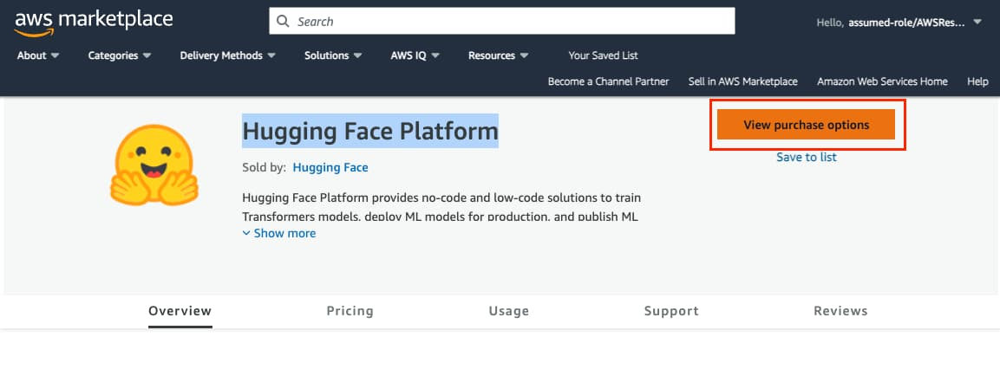
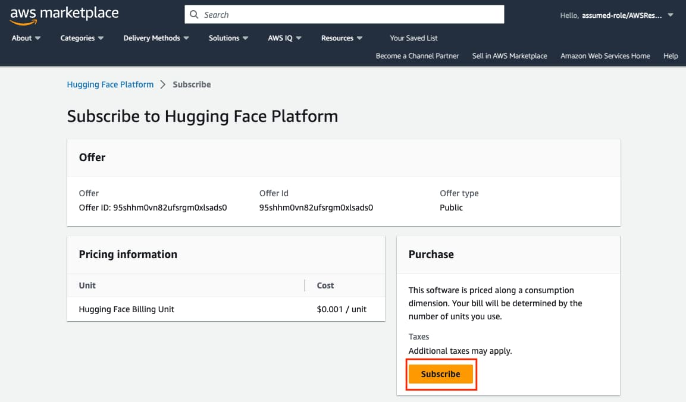
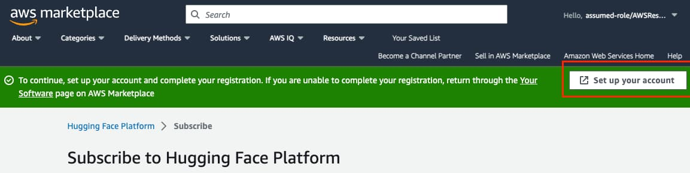
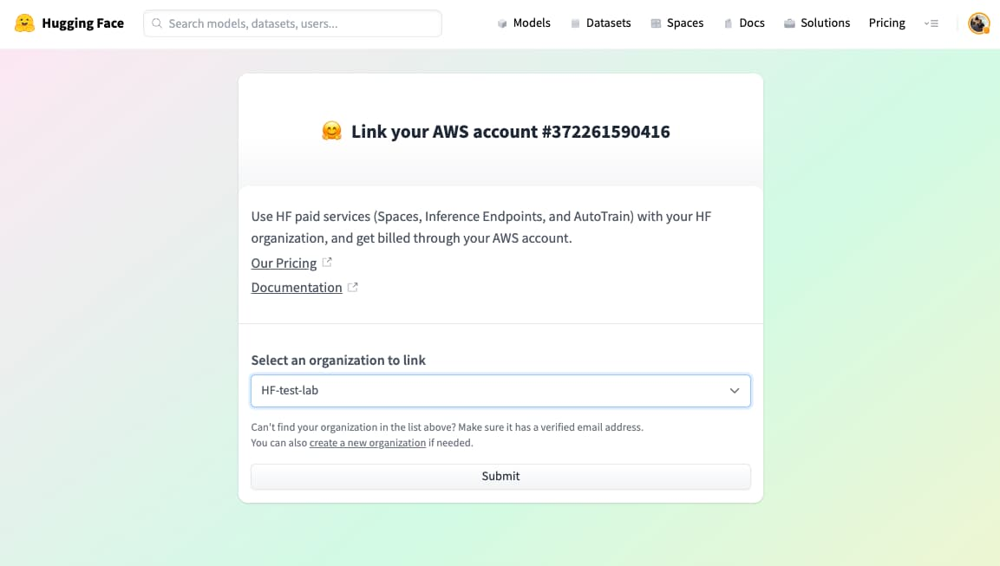
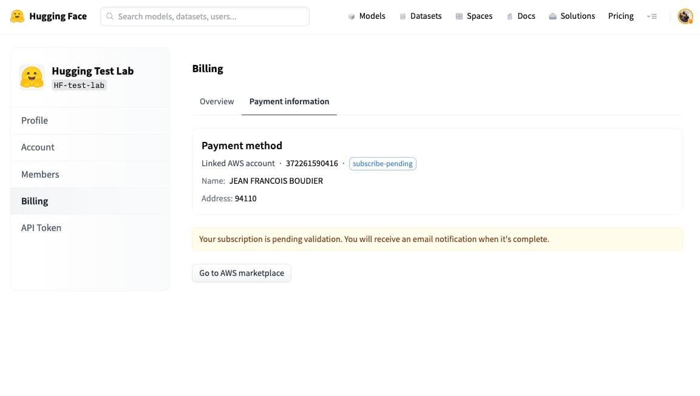
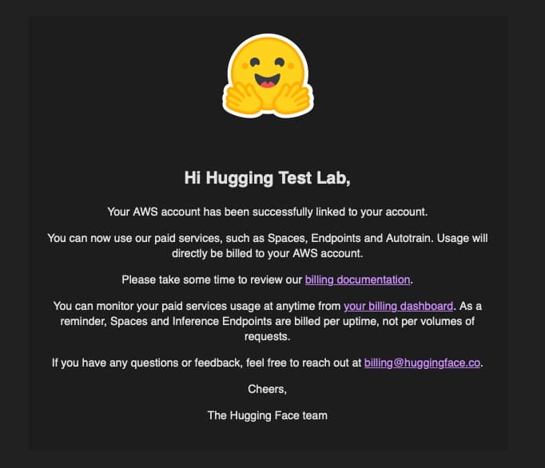
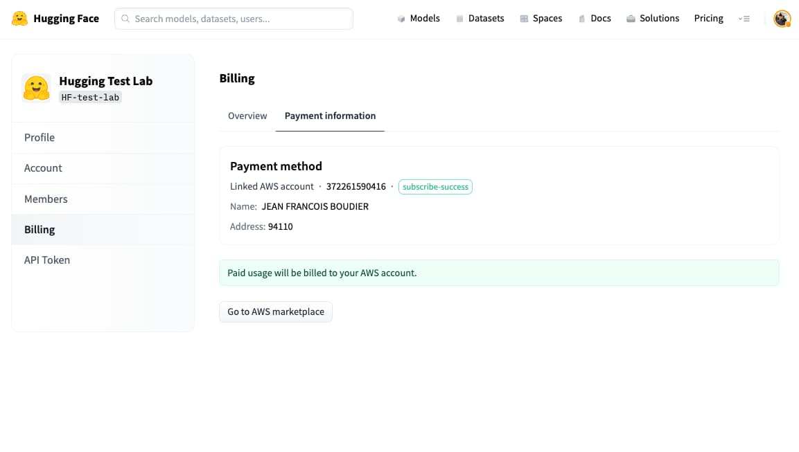

# Hugging Face Platform on the AWS Marketplace: Pay with your AWS Account

The [Hugging Face Platform](https://aws.amazon.com/marketplace/pp/prodview-n6vsyhdjkfng2) has landed on the AWS Marketplace. Starting today, you can subscribe to the Hugging Face Platform through AWS Marketplace to pay for your Hugging Face usage directly with your AWS account. This new integrated billing method makes it easy to manage payment for usage of all our managed services by all members of your organization, including Inference Endpoints, Spaces Hardware Upgrades, and AutoTrain to easily train, test and deploy the most popular machine learning models like Llama 2, StarCoder, or BERT.

By making [Hugging Face available on AWS Marketplace](https://aws.amazon.com/marketplace/pp/prodview-n6vsyhdjkfng2), we are removing barriers to adopting AI and making it easier for companies to leverage large language models. Now with just a few clicks, AWS customers can subscribe and connect their Hugging Face Account with their AWS account. 

By subscribing through AWS Marketplace, Hugging Face organization usage charges for services like Inference Endpoints will automatically appear on your AWS bill, instead of being charged by Hugging Face to the credit card on file for your organization.

We are excited about this launch as it will bring our technology to more developers who rely on AWS, and make it easier for businesses to consume Hugging Face services.

## Getting Started

Before you can connect your AWS Account with your Hugging Face account, you need to fulfill the following prerequisites: 

- Have access to an active AWS account with access to subscribe to products on the AWS Marketplace.
- Create a [Hugging Face organization account](https://huggingface.co/organizations/new) with a registered and confirmed email. (You cannot connect user accounts)
- Be a member of the Hugging Face organization you want to connect with the [“admin” role](https://huggingface.co/docs/hub/organizations-security).
- Logged into the Hugging Face Platform.

Once you meet these requirements, you can proceed with connecting your AWS and Hugging Face accounts.

### 1. Subscribe to the Hugging Face Platform

The first step is to go to the [AWS Marketplace offering](https://aws.amazon.com/marketplace/pp/prodview-n6vsyhdjkfng2) and subscribe to the Hugging Face Platform. There you open the [offer](https://aws.amazon.com/marketplace/pp/prodview-n6vsyhdjkfng2) and then click on “View purchase options” at the top right screen. 

You are now on the “subscribe” page, where you can see the summary of pricing and where you can subscribe. To subscribe to the offer, click “Subscribe”. 

After you successfully subscribe, you should see a green banner at the top with a button “Set up your account”. You need to click on “Set up your account” to connect your Hugging Face Account with your AWS account.  

After clicking the button, you will be redirected to the Hugging Face Platform, where you can select the Hugging Face organization account you want to link to your AWS account. After selecting your account, click “Submit” 

After clicking "Submit", you will be redirected to the Billings settings of the Hugging Face organization, where you can see the current state of your subscription, which should be `subscribe-pending`.

After a few minutes you should receive 2 emails: 1 from AWS confirming your subscription, and 1 from Hugging Face, which should look like the image below:

If you have received this, your AWS Account and Hugging Face organization account are now successfully connected! 
To confirm it, you can open the Billing settings for [your organization account](https://huggingface.co/settings/organizations), where you should now see a `subscribe-success` status.

Congratulations! 🥳 All members of your organization can now start using Hugging Face premium services with billing directly managed by your AWS account: 

- [Inference Endpoints Deploy models in minutes](https://ui.endpoints.huggingface.co/)
- [AutoTrain creates ML models without code](https://huggingface.co/autotrain)
- [Enterprise Hub accelerates your AI roadmap](https://huggingface.co/enterprise)
- [Spaces Hardware upgrades](https://huggingface.co/docs/hub/spaces-gpus)

Pricing for Hugging Face Platform through the AWS marketplace offer is identical to the [public Hugging Face pricing](https://huggingface.co/pricing), but will be billed through your AWS Account. You can monitor the usage and billing of your organization at any time within the Billing section of your [organization settings](https://huggingface.co/settings/organizations).

---

Thanks for reading! If you have any questions, feel free to contact us at [api-enterprise@huggingface.co](mailto:api-enterprise@huggingface.co).
