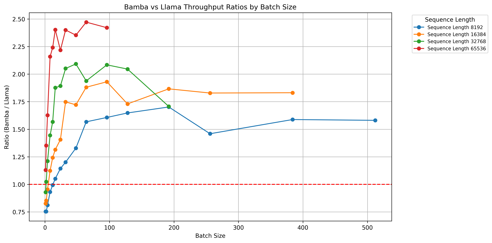
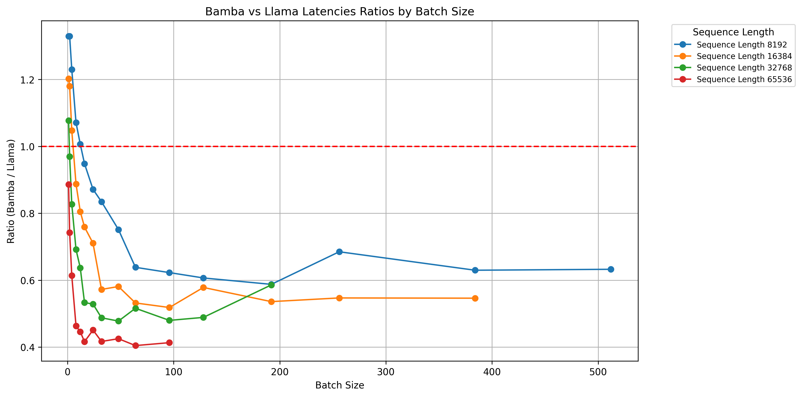
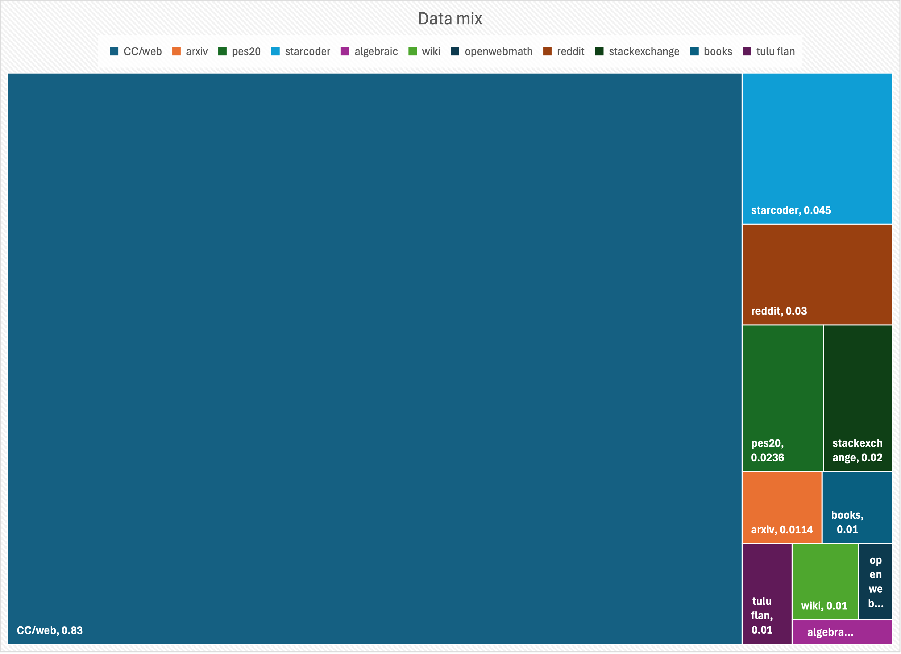
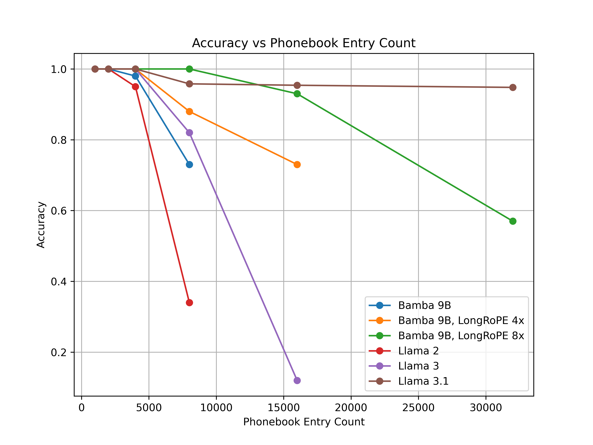
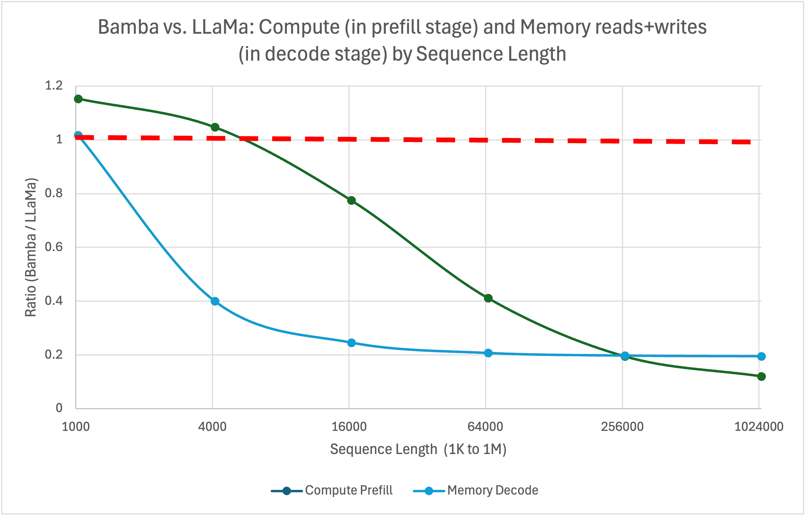

# Bamba: Inference Efficient Hybrid Mamba2 Model :snake:

<p align="center">
  
</p>

## TL;DR

We introduce **Bamba-9B**, an inference-efficient Hybrid Mamba2 model trained by IBM, Princeton, CMU, and UIUC on **completely open data**. At inference time, the model demonstrates 2.5x throughput improvement and 2x latency compared to standard transformers in vLLM. To foster community experimentation, we enabled the model in `transformers`, `vLLM`, `TRL`, and `llama.cpp`. We also release tuning, training, and extended pretraining recipes with a stateful data loader and invite the community to further improve this model and tackle the KV-cache bottleneck!

## Artifacts :package:

1. [Hugging Face Bamba collection](https://huggingface.co/collections/ibm-fms/bamba-674f1388b9bbc98b413c7bab) 
2. [GitHub repo with inference, training, and tuning scripts](https://github.com/foundation-model-stack/bamba)   
3. [Dataloader](https://github.com/foundation-model-stack/fms-fsdp/blob/main/fms_fsdp/utils/dataset_utils.py)  
4. [Quantization](https://github.com/foundation-model-stack/fms-model-optimizer)  
5. [Auto-pilot for cluster monitoring](https://github.com/IBM/autopilot)

## What motivated us :star2:

Transformer models are increasingly used in real-world applications but face GPU memory bandwidth bottlenecks during inference, particularly in per-token decoding, which worsens with longer context length models. Techniques like lower precision, layer pruning, and compression can alleviate the problem, but do not address the root cause.

Emerging architectures such as [Mamba](https://huggingface.co/papers/2312.00752), [Griffin](https://huggingface.co/papers/2402.19427), and [DeltaNet](https://huggingface.co/papers/2406.06484) eliminate this bottleneck by making KV-cache constant. Mamba architecture has gained significant traction in the recent past. For example, [Jamba](https://huggingface.co/papers/2403.19887) and [Samba](https://huggingface.co/papers/2406.07522) interleave Mamba layers with transformer layers. Pure Mamba2 models like [Codestral Mamba](https://mistral.ai/news/codestral-mamba/) demonstrate state-of-the-art (SOTA) results on coding tasks, while NVIDIA’s Mamba2 hybrid achieves competitive performance across long-context and traditional LLM benchmarks. Recent innovations, like [Falcon Mamba](https://huggingface.co/collections/tiiuae/falconmamba-7b-66b9a580324dd1598b0f6d4a), achieve SOTA rankings on [Hugging Face leaderboards](https://huggingface.co/spaces/open-llm-leaderboard/open_llm_leaderboard).

We introduce Bamba-9B, a Mamba2 hybrid model, further validating these emerging architectures. This collaboration between IBM, Princeton, CMU, and UIUC provides full training lineage, model checkpoints, and pretraining code to support reproducibility and experimentation. The released checkpoints exclude benchmark-aligned instruction data (except FLAN) to preserve fine-tuning flexibility. Our aim is to showcase the Mamba2 hybrid architecture’s potential.

To foster community experimentation, we are also releasing a distributed stateless shuffle dataloader and enabling Mamba2 hybrid architecture in open-source libraries like `transformers`, `TRL`, `vLLM`, and `llama.cpp`. We hope these efforts advance the adoption of Mamba architectures, alleviate KV-cache bottlenecks, and close the gap with SOTA open-source models.


### Use in transformers 🤗

Follow instructions outlined in [Bamba GitHub](https://github.com/foundation-model-stack/bamba/).

```python
from transformers import AutoModelForCausalLM, AutoTokenizer

model = AutoModelForCausalLM.from_pretrained("ibm-fms/Bamba-9B")
tokenizer = AutoTokenizer.from_pretrained("ibm-fms/Bamba-9B")

message = ["Mamba is a snake with following properties  "]
inputs = tokenizer(message, return_tensors='pt', return_token_type_ids=False)
response = model.generate(**inputs, max_new_tokens=64)
print(tokenizer.batch_decode(response, skip_special_tokens=True)[0])
```

## Evaluations :bar_chart:

We divide our evaluations into three parts: 
1. Comparison with SoTA transformer models
2. Comparison with transformer models with similar token budget
3. Comparison with other Mamba variants.

> **Evaluation setup :gear: :desktop_computer::**
We rerun all the benchmarks following the setup and scripts [here](https://github.com/foundation-model-stack/bamba/blob/main/evaluation/README.md) for all models except the NVIDIA Mamba2 Hybrid model. We could not run benchmarking for the NVIDIA Mamba2 Hybrid model as the model weights are not in Hugging Face transformers compatible format. Therefore, we report the numbers from the original paper. For the v2 leaderboard results, we perform [normalization](https://huggingface.co/docs/leaderboards/open_llm_leaderboard/normalization) and report the normalized results.

### TL;DR Evals
Bamba-9B demonstrates the competitive performance of hybrid Mamba models compared to transformer models. While it has gaps in math benchmarks and MMLU scores, excluding these benchmarks places its average performance nearly on par with Meta Llama 3.1 8B (48.01 vs. 48.22). These gaps can be addressed by (a) extending pretraining with more tokens (MMLU scores steadily improved during training), and (b) incorporating high-quality math data in the pretraining/annealing phases. Future plans include using updated datasets like Olmo2 mix and annealing with benchmark-aligned mixes such as Dolmino mix.

Bamba-9B’s results also alleviate concerns raised by the relatively low scores of NVIDIA’s Mamba2 Hybrid model in leaderboard benchmarks. Notably, NVIDIA’s study used an older data mix to compare architectures under identical conditions. Consistent with those findings, Bamba-9B reaffirms that the Mamba2 hybrid architecture offers competitive performance along with up to 5x inference efficiency.

### Comparison with SoTA transformer models

We compare Bamba and Falcon Mamba with SoTA transformer models of similar size ([Meta Llama 3.1 8B](https://huggingface.co/meta-llama/Llama-3.1-8B), [IBM Granite v3 8B](https://huggingface.co/ibm-granite/granite-3.0-8b-base), [Olmo2 7B](https://huggingface.co/allenai/OLMo-2-1124-7B), and [Gemma 2 9B](https://huggingface.co/google/gemma-2-9b)). We observe that while there are obvious benchmark gaps, it is not clear that these gaps point to deficiencies in the mamba/mamba2 based models. In fact, a careful analysis shows that gaps are largely due to the amount of data used for training models and the inclusion of benchmark-aligned instruction datasets during the annealing phase. For example, we had one small scale run that added `metamath` and improved our `GSM8k` score from `36.77` to `60.0`. We will publish detailed analysis and our findings in an upcoming paper.


<details>
<summary>HF OpenLLM v1 leaderboard</summary>

[HF LLM- V1](https://huggingface.co/docs/leaderboards/en/open_llm_leaderboard/archive) \+ OpenbookQA and PIQA :

| Model | Average | MMLU | ARC-C | GSM8K | Hellaswag | OpenbookQA | Piqa | TruthfulQA | Winogrande |
| :---- | :---- | :---- | :---- | :---- | :---- | :---- | :---- | :---- | :---- |
| [Bamba 9B](https://huggingface.co/ibm-fms/Bamba-9B) | 62.31 | 60.77 | 63.23 | 36.77 | 81.8 | 47.6 | 82.26 | 49.21 | 76.87 |
| [Falcon Mamba 7B](https://huggingface.co/tiiuae/falcon-mamba-7b) | 65.31 | 63.19 | 63.4 | 52.08 | 80.82 | 47.8 | 83.62 | 53.46 | 78.14 |
| [Meta Llama 3.1 8B](https://huggingface.co/meta-llama/Llama-3.1-8B) | 63.51 | 66.26 | 57.85 | 49.96 | 81.98 | 46.8 | 82.54 | 45.16 | 77.51 |
| [IBM Granite v3 8B](https://huggingface.co/ibm-granite/granite-3.0-8b-base) | 67.47 | 65.45 | 63.74 | 62.55 | 83.29 | 47.6 | 83.41 | 52.89 | 80.82 |
| [Olmo2 7B](https://huggingface.co/allenai/OLMo-2-1124-7B) | 66.17 | 63.96 | 64.51 | 68.01 | 81.93 | 49.2 | 81.39 | 43.32 | 77.03 |
| [Gemma2 9B](https://huggingface.co/google/gemma-2-9b) | 68.38 | 72.29 | 68.26 | 67.4 | 82.56 | 47.8 | 83.24 | 45.39 | 80.11 |
| [Qwen2.5 7B](https://huggingface.co/Qwen/Qwen2.5-7B) | 70.58 | 75.41 | 63.82 | 83.24 | 80.23 | 48.40 | 81.28 | 56.34 | 75.93 |
</details>

[HF LLM- V2](https://huggingface.co/docs/leaderboards/open_llm_leaderboard/about)\*\* :

| Model | Average | MMLU-PRO | BBH | GPQA | IFEval | MATH Lvl 5 | MuSR |
| :---- | :---- | :---- | :---- | :---- | :---- | :---- | :---- |
| [Bamba 9B](https://huggingface.co/ibm-fms/Bamba-9B) | 10.91 | 17.53 | 17.4 | 4.14 | 15.16 | 1.66 | 9.59 |
| [Falcon Mamba 7B](https://huggingface.co/tiiuae/falcon-mamba-7b) | 14.70 | 14.33 | 19.88 | 8.17 | 31.93 | 4.0 | 9.88 |
| [Meta Llama 3.1 8B](https://huggingface.co/meta-llama/Llama-3.1-8B) | 14.27 | 25.46 | 25.16 | 8.61 | 12.55 | 5.14 | 8.72 |
| [IBM Granite v3 8B](https://huggingface.co/ibm-granite/granite-3.0-8b-base) | 21.14 | 25.83 | 28.02 | 9.06 | 44.79 | 9.82 | 9.32 |
| [Olmo2 7B](https://huggingface.co/allenai/OLMo-2-1124-7B) | 13.36 | 22.79 | 21.69 | 4.92 | 16.35 | 4.38 | 10.02 |
| [Gemma2 9B](https://huggingface.co/google/gemma-2-9b) | 21.79 | 34.84 | 34.81 | 11.07 | 21.28 | 13.44 | 15.3 |
| [Qwen2.5 7B](https://huggingface.co/Qwen/Qwen2.5-7B) | 20.6 | 37.62 | 35.62 | 9.96 | 34.77 | 18.35 | 14.6 |

### Safety tasks

Safety benchmarks are crucial for ensuring AI models generate content that is ethical, inclusive, and non-harmful. We evaluate our model on well known safety benchmarks such as Toxigen (5-shot, logits) (focused on detecting toxic language), BBQ (5-shot, generation), PopQA (5-shot, generation), and Ethos (which measures bias and fairness). These benchmarks help us identify and mitigate harmful outputs, ensuring the model avoids generating offensive or discriminatory content. We intend to fix the gaps in safety through comprehensive SFT and DPO approaches.

| Model | PopQA | Toxigen | BBQ  |
| :---- | :---- | :---- | :---- |
| [Bamba 9B](https://huggingface.co/ibm-fms/Bamba-9B) | 20.5 | 57.4 | 44.2 |
| [Olmo2 7B](https://huggingface.co/allenai/OLMo-2-1124-7B) | 25.7 | 63.1 | 58.4 |
| [Gemma2 9B](https://huggingface.co/google/gemma-2-9b) | 27.3 | 69.6 | 59.9 |
| [IBM Granite v3 8B](https://huggingface.co/ibm-granite/granite-3.0-8b-base) | 27.5 | 79.9 | 82.1 |
| [Meta Llama 3.1 8B](https://huggingface.co/meta-llama/Llama-3.1-8B) | 28.8 | 67 | 60 |
| [Falcon Mamba 7B](https://huggingface.co/tiiuae/falcon-mamba-7b) | 19.3 | 62.1 | 60.2 |

## Comparison with transformers with similar token budget

We pick a few prominent models: [Olmo 7B](https://huggingface.co/allenai/OLMo-7B) trained on identical data (2024), [Meta Llama 2 7B](https://huggingface.co/meta-llama/Llama-2-7b) (2023), and [IBM Granite 7B](https://huggingface.co/ibm-granite/granite-7b-base) (2023), which have been trained to \~2T tokens. While Olmo 7B outperforms Meta Llama 2 and IBM Granite models across these 8 benchmarks, we note that with the same dataset, Bamba outperforms Olmo 7B. Since the Bamba model has 9B parameters, a direct comparison is again difficult, but the main takeaway is that mamba2-based hybrid models are competitive with the transformer models trained on the same dataset with similar token budget.

| Model | Average | MMLU | ARC-C | GSM8K | Hellaswag | OpenbookQA | Piqa | TruthfulQA | Winogrande |
| :---- | :---- | :---- | :---- | :---- | :---- | :---- | :---- | :---- | :---- |
| [Bamba 9B (2.2T)](https://huggingface.co/ibm-fms/Bamba-9B) | 62.31 | 60.77 | 63.23 | 36.77 | 81.8 | 47.6 | 82.26 | 49.21 | 76.87 |
| [Olmo1.5 7B](https://huggingface.co/allenai/OLMo-7B-0424-hf) | 55.8 | 53.38 | 50.51 | 27.67 | 79.13 | 45.2 | 81.56 | 35.92 | 73.09 |
| [Bamba 9B (2T)](https://huggingface.co/ibm-fms/Bamba-9B-2T) | 59.11 | 59.05 | 57.25 | 24.03 | 83.66 | 47.6 | 83.62 | 38.26 | 79.4 |
| [Meta Llama2 7B](https://huggingface.co/meta-llama/Llama-2-7b-hf) | 53.78 | 46.64 | 52.65 | 13.57 | 78.95 | 45.2 | 80.03 | 38.96 | 74.27 |
| [IBM Granite 7B](https://huggingface.co/ibm-granite/granite-7b-base) | 52.07 | 49.02 | 49.91 | 10.84 | 77.0 | 40.8 | 80.14 | 38.7 | 70.17 |

<details>
<summary>Mamba/Mamba2 comparisons</summary>

### Comparison with mamba/mamba2 architecture based language models

Several mamba/mamba2 architecture based models have started coming up in the last 6 months (e.g., NVIDIA Mamba2 Hybrid, Codestral Mamba, Falcon Mamba, [Zamba 7B v1](https://huggingface.co/Zyphra/Zamba-7B-v1)) furthering the performance of these architectures and demonstrating their superior inference performance as well as closing the gap with quality. We compare 8 key benchmarks across Bamba, NVIDIA Mamba2 Hybrid, Zamba, and Falcon Mamba. Falcon Mamba is a pure mamba model, Zamba has shared attention layer for every 6 mamba layers, and Bamba and NVIDIA are both hybrid models with full attention layers interspersed with mamba2 layer. Falcon Mamba was trained to 5.5T tokens and it performs the best overall but there are open questions on how well it will perform on long-context tasks where mamba-based architectures truly shine in their inference performance. Zamba was trained on fewer tokens (1T), but with a different Hybrid architecture and datasets that had benchmark-aligned instruction datasets including those generated from more powerful language models. Bamba and NVIDIA Mamba2 Hybrid are quite similar to each other (details on differences are summarized in the model architecture section), but Bamba is trained to 2.2T tokens while NVIDIA Hybrid Mamba is trained to 3.5T tokens.

| Model | Average | MMLU | ARC-C | GSM8K | Hellaswag | OpenbookQA | Piqa | TruthfulQA | Winogrande |
| :---- | :---- | :---- | :---- | :---- | :---- | :---- | :---- | :---- | :---- |
| [Bamba 9B](https://huggingface.co/ibm-fms/Bamba-9B) | 62.31 | 60.77 | 63.23 | 36.77 | 81.8 | 47.6 | 82.26 | 49.21 | 76.87 |
| NVIDIA Mamba2 Hybrid 8B\* | 58.78 | 53.6 | 47.7 | 77.69 | \-- | 42.8 | 79.65 | 38.72 | 71.27 |
| [Zamba 7B](https://huggingface.co/Zyphra/Zamba-7B-v1) | 64.36 | 57.85 | 55.38 | 61.33 | 82.27 | 46.8 | 82.21 | 49.69 | 79.32 |
| [Falcon Mamba 7B](https://huggingface.co/tiiuae/falcon-mamba-7b) | 65.31 | 63.19 | 63.4 | 52.08 | 80.82 | 47.8 | 83.62 | 53.46 | 78.14 |


\* Results are taken from [NVIDIA paper](https://arxiv.org/pdf/2406.07887).

> **💡 Note:** The differences in training datasets and the number of tokens seen during training make a direct comparison of these models difficult. The key takeaway from this table is that mamba2 hybrid architecture can deliver competitive results while being nearly as efficient to train as transformer models. Furthermore, they can deliver significant improvement (theoretically up to 5x) in inference efficiency despite having full attention layers interspersed with mamba2 layers. We are continuing to pretrain the Bamba model with the latest datasets and plan to release future checkpoints as the model gets better.

</details>

## Inference efficiency :zap: :racing_car: 

The KV-cache bottleneck is a major challenge for large language models, prompting solutions like quantization, pruning, and novel architectures such as Mamba2, Linear Transformers, and RetNets. Realizing inference gains at scale, even with standard transformers, often requires custom kernels. Mamba2 builds on the community momentum of kernel availability, with further improvements made through integration with the vLLM model-serving framework.

Our progress in vLLM integration, tracked via [this PR](https://github.com/vllm-project/vllm/pull/10909), benchmarks Mamba2 against Meta Llama 3.1 8B on an NVIDIA H100 80GB GPU. Using input sizes of 1K tokens and output sizes ranging from 2K to 64K across various batch sizes, we measured throughput (tokens/second) and latency. Results show that as batch size and sequence length increase, Mamba2 achieves up to 2-2.5x better throughput and latency compared to transformers. These gains enhance real-time applications and GPU utilization, with higher throughput ratios (>1) and lower latency ratios (<1) being beneficial.


|  |  |
| :---: | :---: |
| **Figure 1:** Throughput improvements of Bamba | **Figure 2:** Latency improvements of Bamba |

Our analysis indicates that on a H100 NVIDIA GPU, we expect 5x speedup when inference shifts to a memory bottleneck (which typically happens in production settings) \- see the appendix on **Arithmetic Intensity**. However, we have not realized this speedup in vLLM yet because of three primary reasons: (i) chunked pre-fill is not supported for Bamba and any Mamba2 based architectures, (ii) memory allocation assumes standard transformer KV-cache, and (iii) kernels are not optimized for inference. These issues are being tracked [here](https://github.com/foundation-model-stack/bamba/issues/3).

## Model architecture

We base our model architecture on the NVIDIA Hybrid Mamba2 with the following changes. 

| Parameter | Bamba 9B | NVIDIA Mamba2 Hybrid 8B | 
|---------|-------|-------| 
| Num layers | 32 | 29 | 
| Num attention layers | 3 | 4 | 
| Num Mamba2 layers | 29 | 25 | 
| MLP expansion factor | 3.5 | 4 | 
| Vocab size | 128k | 256k | 
| Non-embedding parameters | 8.8B | 8.6B |
 | RoPE | yes | no | 
 | Gated linear units | yes | no |

We have a total of 8B parameters in the Mamba2 layers, 800M in full attention layers, and 1B in embeddings. The hidden state is 4K, GQA for full attention with 8 KV-heads and 32 heads, Mamba2 layer head dimension is 64, and convolution filter size is 4\. It can be argued that the most significant change between the two models is reducing the full attention layers from 4 in the NVIDIA Mamba2 Hybrid model to 3 in Bamba-9B and introduction of the RoPE embeddings.

## Data

Open-source data has come a long way since the inception of Pile. When we started training this model, the best open-source data was Dolma v1.7 which was shown to be quite performant through [Olmo models](https://allenai.org/olmo) and [ablations](https://huggingface.co/spaces/HuggingFaceFW/blogpost-fineweb-v1) by the Hugging Face data team. Since then, several other higher quality open source datasets have been released such as [DCLM](https://www.datacomp.ai/dclm/), [FineWeb-2](https://huggingface.co/collections/HuggingFaceFW/fineweb2-6755657a481dae41e8fbba4d), and [Olmo2 mix](https://huggingface.co/datasets/allenai/olmo-mix-1124).

We use Dolma v1.7 for the first phase of training and the data mixes chosen are illustrated below. For the second phase of training, we use [Fineweb-edu](https://huggingface.co/datasets/HuggingFaceFW/fineweb-edu) and [Cosmopedia](https://huggingface.co/datasets/HuggingFaceTB/cosmopedia) datasets. These datasets are downloaded in their raw form and we tokenize them using the [Ray framework](https://github.com/ray-project/ray) running on an internal large scale [Red Hat Open Shift](https://www.redhat.com/en/technologies/cloud-computing/openshift) cluster. We plan to release the tokenized and formatted parquet data soon for reproducibility.

<p align="center">

</p>
<p align="center"><strong>Data mix for pretraining phase one</strong></p>

**Data mix for pretraining phase one**

## Pre-Training

Pre-training Bamba was done in a phased manner, we performed ablation experiments at 1.8B model size and a few 100B tokens to determine the right learning rates and built on the previous community efforts. Based on the promising results from this study, we scaled the model to 3B and 2T tokens using Dolma mix. We also trained a 3B transformer model following Meta Llama architecture with the same data mix and observed similar or better performance from the Bamba model reaching a conclusion similar to the NVIDIA study performed concurrently. Finally, we scaled the model to 9B size and leveraged PyTorch FSDP to train the model.

We used a cosine learning rate schedule, with a peak learning rate of `3e−4`, a quadratic warmup over 2000 steps, decay factor of 0.033, and an ending learning rate of `1e−5` over 2T tokens. We use the AdamW optimizer with `β1` of 0.9 and `β2` of 0.95. We use a weight decay of 0.1, sequence length of 4096, and a global batch size of 1.5M tokens/batch. We used 192 A100 GPUs from the [IBM Cloud Vela](https://research.ibm.com/blog/AI-supercomputer-Vela-GPU-cluster) production cluster to train this model over a period of 2 months. This cluster runs on Red Hat Open Shift platform and is built on IBM's full stack (e.g., PyTorch, vLLM). We experienced 3 job interruptions, which were attributed to incorrect deployment of jobs and hardware failures. The hardware related job failures were detected automatically using [autopilot](https://github.com/IBM/autopilot).

We also performed a second phase training with high quality data from Hugging Face FineWeb-edu and Cosmopedia for an additional 200B tokens. We use a learning rate of 2e−5 and a cosine schedule to anneal the model, which helps improve our scores. We are currently experimenting with additional high quality data and will release any future checkpoints as part of our commitment to open source.

## Data loader

There are several aspects to train a high quality language model, one of them being a data loader. We have been working over the past 18 months on creating a dataloader that satisfies the demands of a large scale distributed training and trading that off with model quality. We open source this data loader to enable others to use it in conjunction with their framework of choice, we have used it in the Bamba model training as well as integrated with Torch Titan. To date, we believe this is the only open source dataloader that provides a rich set of features.

The data loader provides the following key features:

1. **Stateful and checkpointable** to ensure seamless resumption mid-epoch  
2. **Auto-rescales** to changing workload and GPU allocations  
3. Data **streaming** with **zero-overhead** for **shuffling**  
4. **Asynchronous distributed** operation with no peer-to-peer communication  
5. Allows for **dynamic data mixing** and on-the-fly tokenization  
6. PyTorch native, **modular**, and **extensible**

We have battle tested this data loader over hundreds of training jobs and optimized it over months of continuous operation. The primary code base is located in our repo [here](https://github.com/foundation-model-stack/fms-fsdp/blob/main/fms_fsdp/utils/dataset_utils.py) and we have also worked with the Torch Titan team to make it available [here](https://github.com/pytorch/torchtitan/pull/376). We are working with the Meta PyTorch team to contribute this data loader into core PyTorch.

## Quantization

We recently open sourced a [framework](https://github.com/foundation-model-stack/fms-model-optimizer/) for quantization of models. Through this framework, we leverage the [llm-compressor](https://github.com/vllm-project/llm-compressor) to quantize the Bamba checkpoints to `fp8`. We observed minimal loss in accuracy across all the benchmarks of the OpenLLM leaderboards. Specifically, for the Bamba 9B, a negligible difference of `0.1` between the average scores for V1 (from `62.31` to `61.5`), and for V2 drop of `0.9` in the average (`10.91` to `10.04`). These quantized checkpoints are also released along with the `bf16` counterparts. This also validates that Bamba models are amenable to quantization much like SoTA transformer models.

We are in the process of enabling `fp8` inference for this model in vLLM, which will require updating the kernels. Linear layers and full attention will be easy to tackle, but the Mamba layers will require updates to the Triton/CUDA kernels to handle `fp8`. Our initial analysis indicates that there is one specific layer, which is performing `matmul`, which should make this upgrade smooth.

## Context length extension

We are currently exploring various approaches to long context length extensions beginning with applying [LongRope](https://github.com/microsoft/LongRoPE/tree/main) to the full attention layers.

We use PhoneBook retrieval as the task to measure our performance. We extend the Bamba context length by 4x and 8x and compare the context-extended Bamba against three variations of Meta Llama \- LLama2, Llama3, LLama3.1, with training context lengths of 4K, 8K, and 128K. The results are plotted below.

<p align="center">

</p>

We observe that the context-extended Bamba model performs exceptionally well up to a 16K context length without any tuning, outperforming the original Bamba 9B model, Llama2-7B, and llama3-8B by a large margin and obtaining comparable performance as Llama3.1-8B. At sequence length 32K, LLama3.1 achieves the best performing result. However, note that LLama3.1-8B was trained with 128K context length, which incurs a much higher pre-training cost than Bamba. As a next step, we plan to pursue various other approaches to context length extensions and study the performance on more tasks. These long context length extended models will be released as well.

## Summary :dart: 
Bamba-9B is a 9-billion parameter hybrid Mamba2 model developed collaboratively by IBM, Princeton, CMU, and UIUC. Trained entirely on open datasets, it achieves significant inference efficiency, demonstrating a 2.5x increase in throughput and a 2x reduction in latency compared to standard transformers when benchmarked in the vLLM framework.

Key Takeaways:

* **Inference Efficiency**: Bamba-9B delivers substantial improvements in throughput and latency, enhancing real-time application performance, with up to 5x efficiency gains in long-sequence inference.

* **Competitive Benchmarks**: Bamba-9B performs competitively against state-of-the-art (SoTA) transformer models like Meta Llama 3.1 8B. It matches their average benchmark performance when excluding math and MMLU tasks, with opportunities to close these gaps through extended training and math-focused datasets.

* **Open Collaboration**: The model's development utilized open data, promoting transparency and reproducibility within the AI community.

* **Broad Integration**: Bamba-9B is fully integrated with popular frameworks like Hugging Face Transformers, vLLM, TRL, and llama.cpp, enabling easy adoption and experimentation.

For more details and access to the model and associated resources, visit the [Bamba GitHub repository](https://github.com/foundation-model-stack/bamba).

### Future work

There are several directions that we intend to explore and further inference-efficient mamab2 hybrid architectures:

1. Continue to improve the models through continued pretraining on additional data, we welcome any feedback from the community so we can collectively create a kick-ass mamba2 hybrid model.  
2. Perform SFT of base models using SFT datasets such as [Tuluv3](https://huggingface.co/datasets/allenai/tulu-3-sft-olmo-2-mixture), [agent instruct](https://huggingface.co/datasets/microsoft/orca-agentinstruct-1M-v1), and [Anteater](https://huggingface.co/datasets/nvidia/Daring-Anteater) and compare the resulting model to other state-of-the-art instruction-tuned models.  
3. vLLM enablement of the model working with the community. The issues on chunked prefill and managing the memory allocation for this architecture will be key.  
4. Enabling `fp8` kernels to make inference even faster.  
5. Training time improvements and applying `torch.compile` as well as `fp8` training, both of which our team has [demonstrated](https://pytorch.org/blog/training-using-float8-fsdp2/) on transformer architectures working with Meta.  
6. Long context length extensions and targeting 1M+.

## Contributors

* **Data collection and curation**: We acknowledge and thank AllenAI team for making a high quality open source dataset Dolma as well as Hugging Face data team for making FineWeb-edu and Cosmopedia available. These are tremendous contributions and enable us to create the model today.  
* **Data preprocessing**: We thank IBM's internal data preprocessing team, specifically Tuan Hoang Trong, Syed Zawad, Jay Gala, and Ryan Gordon for helping tokenize the data at scale. The code for tokenization is available [here](https://github.com/IBM/data-prep-kit).  
* **Model architecture**: The model architecture design was jointly done by Princeton, CMU, IBM, and UIUC and involved the following folks: Tri Dao (Princeton), Albert Gu (CMU), Linsong Chu (IBM), Davis Wertheimer (IBM), Minjia Zhang (UIUC), Mudhakar Srivatsa (IBM), and Raghu Ganti (IBM).  
* **Model training**: Model training was performed primarily by the IBM team using the Mamba2 kernels and layer implementation from Tri Dao and Albert Gu. The following folks from IBM were primarily involved: Linsong Chu, Divya Kumari, Davis Wertheimer, Raghu Ganti, and Dakshi Agrawal.  
* **Model tuning**: Tuning of the model was enabled and verified in [TRL](https://github.com/huggingface/trl) by the IBM team, involving Sukriti Sharma and Anh Uong.  
* **Model inference**: Model inference in `transformers`, `vLLM`, and `llama.cpp` builds on the kernels written by Princeton and CMU. The IBM team is working with the community to enable it in various ecosystems, the team includes Fabian Lim, Antoni viros i Martin, Adnan Hoque, Jamie Yang, Nelson Nimura Gomez, Joshua Rosenkranz, Nick Hill, and Gabe Goodhart.  
* **Quantization**: Quantization is led by the IBM team \- Naigang Wang and Charlie Liu.  
* **Evaluations**: Evaluations are led by a team in IBM with long context evaluations being performed by UIUC, involving the following folks: Yotam Perlitz, Ofir Arviv, Michal Shmueli-Scheuer (IBM), Haoechen Shen, and Minjia Zhang (UIUC).

Finally, we would like to thank our leadership for their support in this effort \- Priya Nagpurkar, David Cox, Sriram Raghavan, Aya Soffer, and Mukesh Khare.

We would also like to thank the community, in particular Pablo Montalvo-Leroux and Vaibhav Srivastav from Hugging Face who provided valuable feedback to this blog and the PRs into transformers. Further, we would like to thank Tyler Michael Smith from Neural Magic, who is shepherding the integration with vLLM.

A huge shoutout to Meta PyTorch, AllenAI, and Hugging Face teams for their contributions to the open initative, FSDP allowed us to smoothly train this model and the data from Dolma and Fineweb/Cosmopedia made this model today! 

## Appendix: Arithmetic Intensity
Using the following notation:\
$b$: batch size\
$s$: sequence length\
$h$: hidden state size (4096)\
$d$: head dimension (128)\
$l$: total number of layers (32)\
$l_{attn}$: number of attention layers (3)\
$l_{ssd}$: number of SSD layers (29)

Both the attention and bamba models are configured with GQA of 4:1 (in the attention layers), MLP expansion ratio of 3.5 and use GLU in MLP block. The SSD layer in bamba is configured with state dimension of $d$, head dimension of $d/2$ and number of heads = $4h/d$. Model size excluding the embedding layer is:
| Model Type | Model Size | 
|------------|------------|
| attention | $13h^2l$ |
| bamba | $15.5h^2l$ |

At prefill stage the compute and memory (read + write) requirements imposed by the model are:
| Model Type | Compute Prefill | Memory Prefill |
|------------|-----------------|----------------|
| attention | $26bsh^2l + 4bs^2hl$ | $13h^2l + 0.5bshl$ |
| bamba |  $31bsh^2l + 4bs^2hl_{attn} + 4bsdhl_{ssd}$ | $15.5h^2l + 0.5bshl_{attn} + 4bdhl_{ssd}$|

At decode stage the compute and memory (read + write) requirements imposed by the model are:
| Model Type | Compute Decode | Memory Decode |
|------------|-----------------|----------------|
| attention | $26bh^2l + 4bshl$ | $13h^2l + 0.5bshl$ |
| bamba |  $31bh^2l + 4bshl_{attn} + 4bdhl_{ssd}$ | $15.5h^2l + 0.5bshl_{attn} + 4bdhl_{ssd}$|

A comparison of compute flops during prefill stage and memory (read+write) sizes during decode stage between Bamba and LLaMa models is shown below. Note that ratios lesser than 1 are beneficial. With inference throughput primarily bottlenecked by decode stage, the potential speedup for Bamba (over LLaMa) is 5x for large sequence lengths (> 16K). Current measurements (on vLLM) hover at 2.5x, which we expect to improve in the near future. 
<p align="center">
  
</p>
