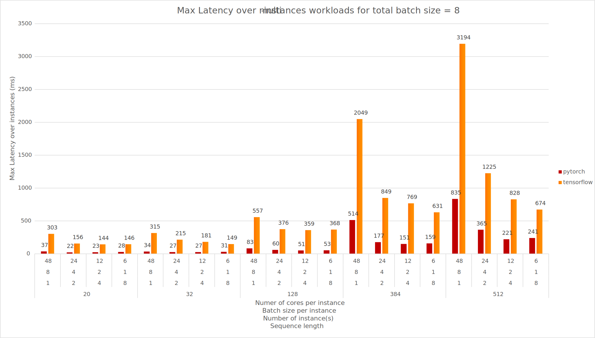
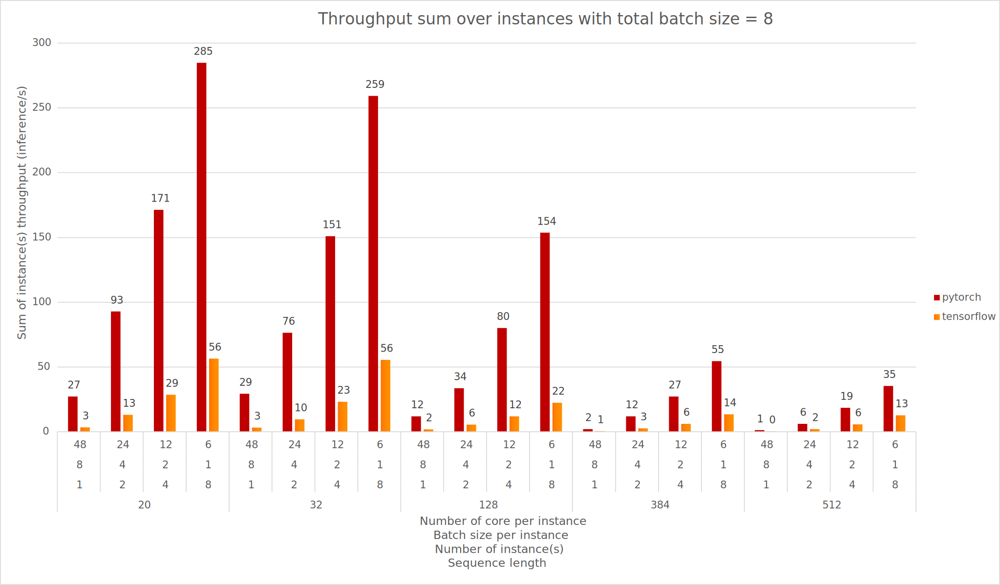

<style>
  .centered {
      display: block;
      margin: 0 auto;
  }

  .row {
    display: flex;
  }

  /* Side by Side two images */
  .column {
    flex: 50%;
    padding: 5px;
  }
</style>

<div class="blog-metadata">
    <small>Published April 13, 2021.</small>
</div>

<div class="author-card">
    <a href="/mfuntowicz">
        
        <div class="bfc">
            <code>mfuntowicz</code>
            <span class="fullname">Morgan Funtowicz</span>
        </div>
    </a>
</div>

# Scaling up BERT-like model Inference on modern CPU - Part 1

## Context and Motivations

Back in October 2019, my colleague Lysandre Debut published a comprehensive _(at the time)_ [inference performance 
benchmarking blog (1)](https://medium.com/huggingface/benchmarking-transformers-pytorch-and-tensorflow-e2917fb891c2).

Since then, [🤗 transformers (2)](https://github.com/huggingface/transformers) welcomed a tremendous number
of new architectures and thousands of new models were added to the [🤗 hub (3)](https://huggingface.co/models)
which now counts more than 9,000 of them as of first quarter of 2021.

As the NLP landscape keeps trending towards more and more BERT-like models being used in production, it 
remains challenging to efficiently deploy and run these architectures at scale.  
This is why we recently introduced our [🤗 Inference API](https://api-inference.huggingface.co/docs/python/html/index.html): 
to let you focus on building value for your users and customers, rather than digging into all the highly
technical aspects of running such models.

In this post, we will update the benchmarking results from our initial post, which will give us baselines to 
then highlight settings that can help you scale up inference on CPU. We will cover:
- Baseline - Out of the box results
- Practical & technical considerations when leveraging modern CPUs for CPU-bound tasks
- Core count scaling (**Strong scaling**) - Does increasing the number of cores actually give better performance?
- Batch size scaling (**Weak scaling**) - Increasing throughput with multiple parallel & independent model instances

We decided to focus on the most famous Transformer model architecture, 
[BERT (Delvin & al. 2018) (4)](https://arxiv.org/abs/1810.04805v1). While we focus this blog post on BERT-like 
models to keep the article concise, all the described techniques
can be applied to any architecture on the Hugging Face model hub. 
In this blog post we will not describe in detail the Transformer architecture - to learn about that I can't 
recommend enough the 
[Illustrated Transformer blogpost from Jay Alammar (5)](https://jalammar.github.io/illustrated-transformer/).

Today's goals are to give you an idea of where we are from an Open Source perspective using BERT-like
models for inference on PyTorch and TensorFlow, and also what you can easily leverage to speedup inference.

## Benchmarking methodology

When it comes to leveraging BERT-like models from Hugging Face's model hub there are many knobs which can
be tuned to make things faster. Also, in order to quantify what "faster" means, we will rely on widely adopted metrics:

- **Latency**: Time it takes for a single execution of the model (i.e. forward call) 
- **Throughput**: Number of executions performed in a fixed amount of time

These two metrics will help us understand the benefits and tradeoffs along this blog post.

The benchmark was reimplemented from scratch in order to integrate the latest features provided by transformers
and also to let the community run and share benchmarks in an __hopefully easier__ way.
The whole framework is now based on Facebook AI & Research's Hydra configuration library allowing us to easily report
all the items set up while running the benchmark, increasing the reproducibility of such benchmark. 

On the 2021 version, we kept the ability to run inference workloads through PyTorch and Tensorflow as in the 
previous blog [(1)](https://medium.com/huggingface/benchmarking-transformers-pytorch-and-tensorflow-e2917fb891c2) along with their traced counterpart
[TorchScript (6)](https://pytorch.org/docs/stable/jit.html), [Google Accelerated Linear Algebra (XLA) (7)](https://www.tensorflow.org/xla).

Also, we decided to include support for [ONNX Runtime (8)](https://www.onnxruntime.ai/) as it provides many optimizations 
specifically targeting transformers based models which makes it a strong candidate to consider when discussing 
performance.

Last but not least, this new unified benchmarking environment will allow us to easily run inference for different scenarii
such as [Quantized Models (Hubara & al. 2016) (9)](https://arxiv.org/abs/1609.07061) 
using less precise number representations (`float16`, `int8`, `int4`). This method known as **quantization** has seen an increased adoption among all major hardware providers. 
Finally, in the near future, we would like to integrate additional methods we are actively working on at Hugging Face, namely Distillation, Pruning & Sparsificaton. 

## Baselines

All the results below were run on [Amazon Web Services (AWS) c5.metal instance](https://aws.amazon.com/ec2/instance-types/c5) 
leveraging an Intel Xeon Platinum 8275 CPU (48 cores/96 threads).
The choice of this instance provides all the useful CPU features to speedup Deep Learning workloads such as: 

- AVX512 instructions set (_which might not be leveraged out-of-the-box by the various frameworks_)
- Intel Deep Learning Boost (also known as Vector Neural Network Instruction - VNNI) which provides specialized 
  CPU instructions for running quantized networks (_using int8 data type_)
  
The choice of using _metal_ instance is to avoid any virtualization issue which can arise when using cloud providers.
This gives us full control of the hardware, especially while targeting the NUMA (Non-Unified Memory Architecture) controller, which 
we will cover later in this post.

_The operating system was Ubuntu 20.04 (LTS) and all the experiments were conducted using Hugging Face transformers version 4.5.0_

## Out of the box results


The above results correctly corroborate the following assumptions:

- Sequence length has a quadratic impact on performance 
- Batch size has a linear impact on performance

Also, PyTorch shows better inference results over TensorFlow for all the configurations tested here.
In addition to PyTorch providing generally better out-of-the-box inference performance, it seems batch scalability is
better, with no real performance impact when the sequence length remains small.

One possible way to explain such difference between the two frameworks might be the underlying technology to
execute parallel sections within operators. PyTorch internally uses OpenMP along with Intel MKL (now oneDNN) for 
efficient linear algebra computations whereas TensorFlow relies on Eigen and its own threading implementation.

## Scaling BERT Inference to increase overall throughput on modern CPU

### Introduction

There are multiple ways to improve the latency and throughput for tasks such as BERT inference.
Improvements and tuning can be performed at various levels from enabling Operating System features, swapping dependent
libraries with more performant ones, carefully tuning framework properties and, last but not least,
using parallelization logic leveraging all the cores on the CPU(s).

For the remainder of this blog post we will focus on the latter, also known as **Multiple Inference Stream**.

The idea is simple: Allocate **multiple instances** of the same model and assign the execution of each instance to a
**dedicated, non-overlapping subset of the CPU cores** in order to have truly parallel instances.

### Cores and Threads on Modern CPUs

On our way towards optimizing CPU inference for better usage of the CPU cores you might have already seen -_at least for the
past 20 years_- modern CPUs specifications report "cores" and "threads" or "physical" and "logical" numbers. 
These notions refer to a mechanism called **Simultaneous Multi-Threading** (SMT) or **Hyper-Threading** on Intel's platforms.

To illustrate this, imagine two tasks **A** and **B**, executing in parallel, each on its own thread.  
At some point, there is a high probability these two tasks will have to wait for some resources to be fetched from main memory, SSD, HDD 
or even the network.  
During these periods the core executing the task is in an **Idle** state waiting for the resources to arrive, and effectively doing nothing...

Now, with **SMT**, the **two threads for task A and B** will be scheduled on the same **physical core**, 
but their execution will be interleaved:  
When task **A** receives a system interrupt, task **B** will resume 
its execution, then task **A**, etc. which increases overall core utilization.

<!-- The figure below explains the above visually ( [source](https://appuals.com/how-does-hyper-threading-work-in-intel-core-i7-processors/) ) -->


Back to our model inference workload... If you think about it, in a perfect world with a fully optimized setup, computations take the majority of time. 

In this context, using the logical cores shouldn't bring us any performance benefit because our computation work
(*task A in the example above*) is not allowing the second one (*task B*) to be scheduled on the CPU core.


The chart above reports the measured latencies when the model uses 24 physical cores (_phy on the chart_) against 12 physical + 12 logical cores (_phy + log on the chart_).  
As you can see, the performances using "physical cores only" are prividing better latencies than "physical + logical cores"  in 80% of the cases, from a variety of problem size.    

As a result, as proposed above, the tasks being a majority of general matrix multiplications (_gemms_), they are inherently CPU bounds and **does not benefits** from SMT. 

### Leveraging Multi-Sockets servers and CPU affinity

Nowadays servers bring many cores, some of them even support multi-sockets setups (_i.e. multiple CPUs on the motherboard_).  
On Linux, the command `lscpu` reports all the specifications and topology of the CPUs present on the system:

```shell
ubuntu@some-ec2-machine:~$ lscpu
Architecture:                    x86_64
CPU op-mode(s):                  32-bit, 64-bit
Byte Order:                      Little Endian
Address sizes:                   46 bits physical, 48 bits virtual
CPU(s):                          96
On-line CPU(s) list:             0-95
Thread(s) per core:              2
Core(s) per socket:              24
Socket(s):                       2
NUMA node(s):                    2
Vendor ID:                       GenuineIntel
CPU family:                      6
Model:                           85
Model name:                      Intel(R) Xeon(R) Platinum 8275CL CPU @ 3.00GHz
Stepping:                        7
CPU MHz:                         1200.577
CPU max MHz:                     3900.0000
CPU min MHz:                     1200.0000
BogoMIPS:                        6000.00
Virtualization:                  VT-x
L1d cache:                       1.5 MiB
L1i cache:                       1.5 MiB
L2 cache:                        48 MiB
L3 cache:                        71.5 MiB
NUMA node0 CPU(s):               0-23,48-71
NUMA node1 CPU(s):               24-47,72-95
```

In our case we have a machine with **2 sockets**, each socket providing **24 physical cores** with **2 threads per cores** (SMT).  
Another interesting characteristic is the notion of **NUMA** node (0, 1) which represents how cores and memory are being 
mapped on the system.

Non-Uniform Memory Access (**NUMA**) is the opposite of Uniform Memory Access (**UMA**) where the whole memory pool 
is accessible by all the cores through a single unified bus between sockets and the main memory. 
**NUMA** on the other hand splits the memory pool and each CPU socket is responsible to address a subset of the memory, 
reducing the congestion on the bus.


<!--  -->


In order to fully utilize the potential of such a beefy machine, we need to ensure our model instances are correctly 
dispatched across all the **physical** cores on all sockets along with enforcing memory allocation to be "NUMA-aware".

On Linux, NUMA's process configuration can be tuned through `numactl` which provides an interface to bind a process to a 
set of CPU cores (referred as **Processor Affinity**).  
Also, it allows tuning the memory allocation policy, making sure the memory allocated for the process 
is as close as possible to the cores' memory pool (referred as **Explicit Memory Allocation Directives**).

_Note: Setting both cores and memory affinities is important here. Having computations done on socket 0 and memory allocated
on socket 1 would ask the system to go over the sockets shared bus to exchange memory, thus leading to an undesired overhead._

### Tuning Process Affinity & Memory Allocation Policy

Now that we have all the knobs required to control the resources' allocation of our model instances we go further and see how to
effectively deploy those and see the impact on latency and throughput.  
Let's go gradually to get a sense of what is the impact of each command and parameter.

First, we start by launching our inference model without any tuning, and we observe how the computations are being dispatched on CPU cores (_Left_).

```shell
python3 src/main.py model=bert-base-cased backend.name=pytorch batch_size=1 sequence_length=128
```

Then we specify the core and memory affinity through `numactl` spawning all (_and only_) the **physical** cores (_Right_):
```shell
numactl -C 0-47 -m 0,1 python3 src/main.py model=bert-base-cased backend.name=pytorch batch_size=1 sequence_length=128
```

 

As you can see, without any specific tuning, PyTorch and TensorFlow dispatch the work on a single CPU, using both physical **and** logical cores.  
Also, as we highligted earlier, we do not want to leverage the **SMT** feature in our case, so we set the process' cores affinity to target only physical cores. 

Let's take sometime from here to highlight what we did with `numactl`:
- `-C 0-47` indicates to `numactl` what is the processor affinity (cores 0 to 47).
- `-m 0,1` indicates to `numactl` to allocate memory on both CPU sockets

If you wonder why we are binding the process to cores [0...47], you need to go back to look at the output of `lscpu`.  
From there you will find the section `NUMA node0` and `NUMA node1` which has the form `NUMA node<X> <physical ids>/<logicial ids>`

In our case, physical cores range from 0 to 23 on the first CPU and from 24 to 47 on the second one.  
Cores 48 to 71 and 72 to 95 correspond to the logical cores (SMT) respectively on the first and second CPU.

As we are targeting physical cores only to avoid Intel Hyper-Threading here, the above explains why we restrict processor affinity
to the range `[0...47]`.  
Moreover, the range `[0...47]` spawn cores across both sockets, so we need to bind the memory allocations accordingly (`0,1`).

_Please note **this setup is significantly slower than just launching without `numactl`** for small-sized problem.  
This slowness is expected as the computations span over the two CPUs it involves cross-socket communication overhead 
which in this case is higher than the overall computations time._


## Core count scaling - Does using more cores actually improve performance?

When thinking about possible ways to improve our model inference performances, the first rational solution might be to
throw some more resources to do the same amount of work.  
Through the rest of this blog series, we will refer to this setup as **Core Count Scaling** meaning, only the number
of cores used on the system to achieve the task will vary. This is also often referred as Strong Scaling in the HPC world.

At this stage, you may wonder what is the point of allocating only a subset of the cores rather than throwing
all the horses at the task to achieve minimum latency.

Indeed, throwing more resources to the task might give better results.
This statement really depends on the problem size.   
Indeed, it's possible that for small problems putting more threads at work
doesn't improve the latency measurements.

In order to illustrate this, the figure below takes different problem sizes (`sequence length = {32, 128, 512}`)
and reports the latencies with respect to the number of threads used for running
computations in either PyTorch or TensorFlow.

Limiting the number of resources involved in computation is done by limiting the number of threads involved in
**intra** operations (_**intra** here means inside an operator doing computation, also known as "kernel"_).

This is achieved through the following API:
- PyTorch: `torch.set_num_threads(x)`
- TensorFlow: `tf.config.threading.set_intra_op_parallelism_threads(x)`


As you can see, depending on the problem size, the number of threads involved in the computations has a positive impact
on the latency measurements.

For small-sized problems, using only 8 or 16 threads gives the best performance.
For medium-sized problems, the same applies where using a single CPU (24 threads) gives the best results.
For large-sized problems, the overhead of the cross-socket communication is covered by the computations cost, thus benefiting from
using all the cores available on the system.


## Batch size scaling (**Weak scaling**) - Increasing throughput with multiple parallel & independent model instances

If you're still reading this, you should now be in good shape to set up parallel inference workloads on CPU.  
Now, we are going to highlight some possibilities offered by the powerful hardware we have, and tuning the knobs described before, 
to scale our inference as linearly as possible.

In the following we are going to explore another possible scaling solution **Batch Size Scaling** (also referred as _weak scaling_ in HPC world).  
This method actually changes both the size of the problem (_batch size_), and the resources involved in the computation (_cores_).

Instead of throwing more cores to the task as you would do in the core count scaling setup, now we will be using more model instances.
Each instance will run independently on its own subset of the hardware resources in a truly parallel fashion. 

Imagine you have a server with `C` CPU cores, and you want to run a workload containing B samples with S tokens. 
You can represent this workload as a tensor of shape `[B, S]`, B being the size of the batch and S being the maximum sequence length within the B samples.  

For all the instances (`N`), each of them executes on `C / N` cores and would receive a subset of the task `[B / N, S]`.  

### How-to allocate multiple independent instances

Let's start simple, if we want to spawn 2 instances, one on each socket with 24 cores assigned:
```shell
numactl -C 0-23 -m 0 python3 src/main.py model=bert-base-cased batch_size=1 sequence_length=128 backend.name=pytorch backend.num_threads=24
numactl -C 24-47 -m 1 python3 src/main.py model=bert-base-cased batch_size=1 sequence_length=128 backend.name=pytorch backend.num_threads=24
```

Starting from here, each instance does not share any resource with the other, and everything is operating at maximum efficiency from a 
hardware perspective.  
The latency measurements are identical to what a single instance would achieve, but throughput is actually 2x higher
as the two instances operate in a truly parallel way.

We can further increase the number of instances, lowering the number of cores assigned for each instance.  
Let's run 4 independent instances, each of them effectively bound to 12 CPU cores.
```shell
numactl -C 0-11 -m 0 python3 src/main.py model=bert-base-cased batch_size=1 sequence_length=128 backend.name=pytorch backend.num_threads=12
numactl -C 12-23 -m 0 python3 src/main.py model=bert-base-cased batch_size=1 sequence_length=128 backend.name=pytorch backend.num_threads=12
numactl -C 24-35 -m 1 python3 src/main.py model=bert-base-cased batch_size=1 sequence_length=128 backend.name=pytorch backend.num_threads=12
numactl -C 36-47 -m 1 python3 src/main.py model=bert-base-cased batch_size=1 sequence_length=128 backend.name=pytorch backend.num_threads=12
```

The outcomes remain the same, our 4 instances are effectively running in a truly parallel manner.  
The latency will be roughly the same on each instance, but the throughput will be 4x higher.

### Smart dispatching - Allocating different model instances for different problem sizes 

Last but not least, it also brings the possibility to have multiple instances carefully tuned for various problem sizes.  
With a smart dispatching approach, one can redirect incoming requests to the right configuration giving the best latency depending on the requests workload.

```shell
# Small-sized problems (sequence length <= 32) use only 8 cores (on CPU 0 - 8/24 cores used)
numactl -C 0-7 -m 0 python3 src/main.py model=bert-base-cased batch_size=1 sequence_length=32 backend.name=pytorch backend.num_threads=8

# Medium-sized problems (32 > sequence >= 384) use remaining 16 cores (on CPU 0 - (8+16)/24 cores used)
numactl -C 8-23 -m 0 python3 src/main.py model=bert-base-cased batch_size=1 sequence_length=128 backend.name=pytorch backend.num_threads=16

# Large sized problems (sequence >= 512) use the entire CPU on the second socket (on CPU 1 - 24/24 cores used)
numactl -C 24-37 -m 1 python3 src/main.py model=bert-base-cased batch_size=1 sequence_length=128 backend.name=pytorch backend.num_threads=24
```

The following section summarizes the performances of Multi-Stream Inference, leveraging all the knobs explained above.

### Results

The first chart below reports the best latency setup depending on the problem size (_w.r.t the sequence length_).
This corresponds to taking the **maximum** latency (_inference time_) for all the instances for a same problem size.
The second one reports the actually scaling efficiency by **summing** the throughput for all instances for a same problem size.





As you can see, the latency measurements are pretty similar to [what we highlighted previously](#out-of-the-box-results) with respect to the batch size and number of cores involved.  
These results means all our instances are effectively operating in a truly parallel fashion, without negligeable overhead.

Then, the second chart reports the sum of each instance throughput (_batch elements per second_).  
It allows us to visualize the scalability of the system when adding more and more instances each of them with fewer resources but also proportional workload.
Here, the results show strong linear scalability and thus an optimal hardware usage.

## Conclusion

Through this blog post, we covered out-of-box BERT inference performance results one can expect for PyTorch and TensorFlow, 
from a simple PyPi install and without further tuning.   

We covered and discussed the impact and the importance of setting the processors affinity along with the trade-off betweeen 
the targeted problem size and the number of cores required for achieving the task.
On a more general note, small problem sizes (_short sequences and/or small batches_) may require much less cores to achieve 
the best possible latency than big problems (_very long sequences and/or big batches_).

It is worth considering all these aspects when thinking about the final deployment platform as it may cut the cost of the infrastructure drastically.  
To illustrate this, our 48 cores machine costs **4.848\$/h** whereas a smaller instance with only 8 cores lowers this cost to **0.808\$/h**: a **6x cost reduction**.    

In a follow-up blog post, we will detail more advanced settings and tuning techniques to decrease model latency even further, such as: 
- Tuning the memory allocation library
- Using Linux's Transparent Huge Pages mechanisms
- Using vendor-specific Math/Parallel libraries

 Stay tuned! 🤗

## Acknowledgments

- [Omry Yadan](https://github.com/omry) (Facebook FAIR) - Author of [OmegaConf](https://github.com/omry/omegaconf) & [Hydra](https://github.com/facebookresearch/hydra) for all the tips setting up Hydra correctly.
- Sangeeta Bhattacharya (Intel) - For all the help all the way long setting up the experiments and relevant pieces.
- Hugging Face colleagues - For all the comments and improvements in the reviewing process.

## References

1. [Benchmarking Transformers: PyTorch and TensorFlow](https://medium.com/huggingface/benchmarking-transformers-pytorch-and-tensorflow-e2917fb891c2)
2. [HuggingFace's Transformers: State-of-the-art Natural Language Processing](https://arxiv.org/abs/1910.03771v2)
3. [HuggingFace's Model Hub](https://huggingface.co/models)
4. [BERT - Pre-training of Deep Bidirectional Transformers for Language Understanding (Devlin & al. 2018)](https://arxiv.org/abs/1810.04805v1)
5. [Illustrated Transformer blogpost from Jay Alammar](https://jalammar.github.io/illustrated-transformer/)
6. [PyTorch - TorchScript](https://pytorch.org/docs/stable/jit.html)
7. [Google Accelerated Linear Algebra (XLA)](https://www.tensorflow.org/xla)
8. [ONNX Runtime - Optimize and Accelerate Machine Learning Inferencing and Training](https://www.onnxruntime.ai/)
9. [Quantized Neural Networks: Training Neural Networks with Low Precision Weights and Activations (Hubara & al. 2016)](https://arxiv.org/abs/1609.07061)
10. [Optimizing Applications for NUMA](https://software.intel.com/content/www/us/en/develop/articles/optimizing-applications-for-numa.html)
