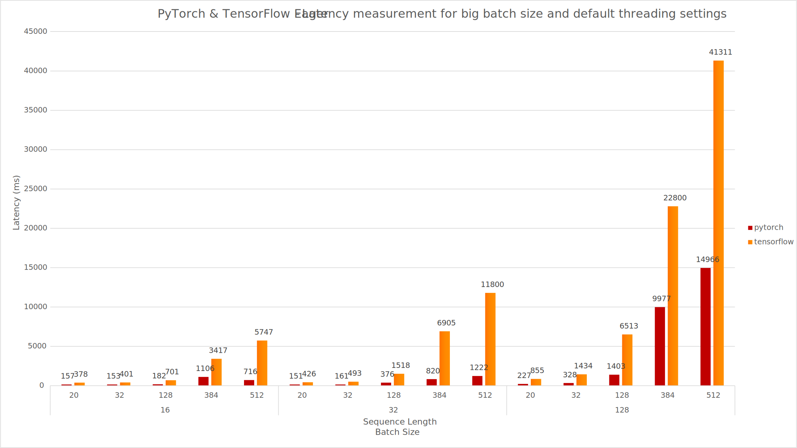
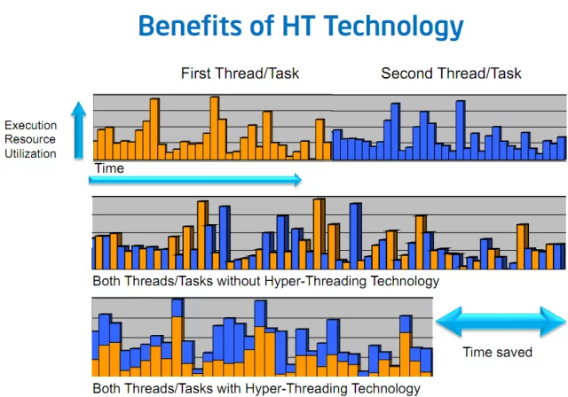
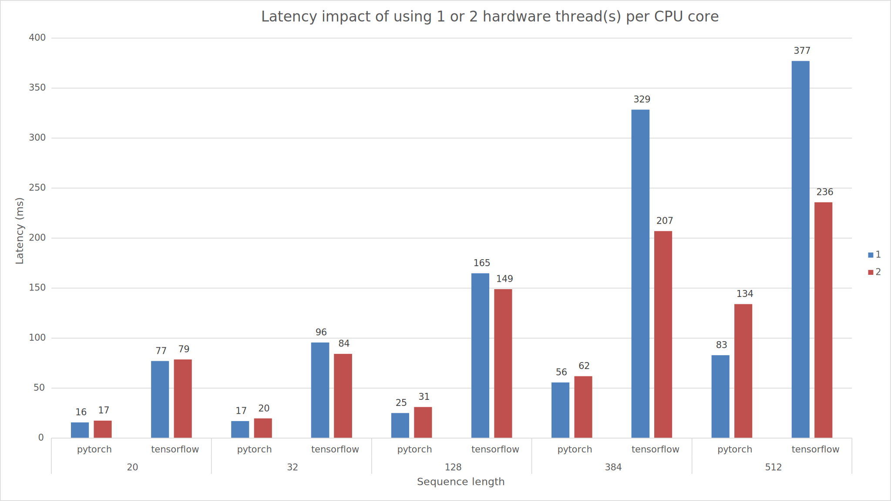
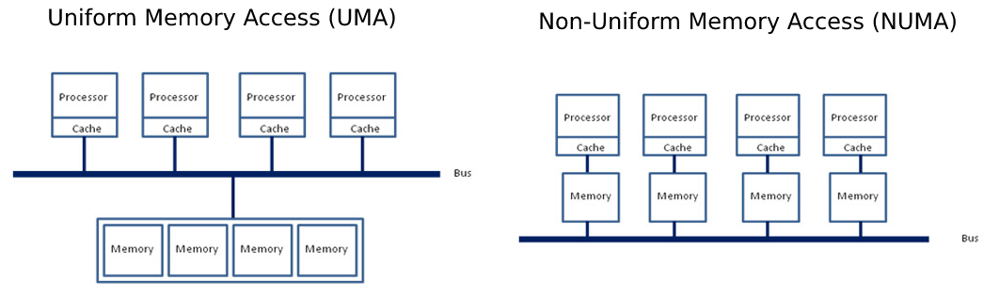
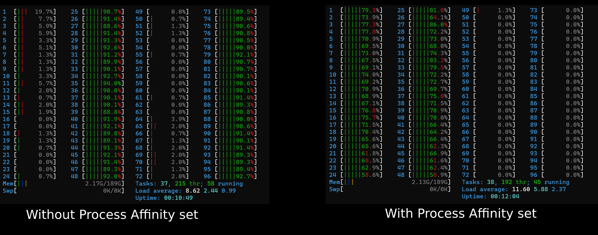
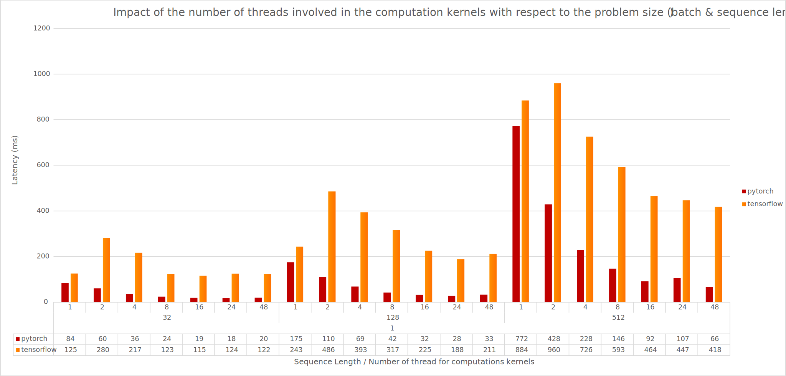

<style>
  .centered {
      display: block;
      margin: 0 auto;
  }

  figure {
      text-align: center;
      display: table;
      max-width: 85%; /* demo; set some amount (px or %) if you can */
      margin: 10px auto; /* not needed unless you want centered */
  }
</style>

<div class="blog-metadata">
    <small>Published April 19, 2021.</small>
</div>

<div class="author-card">
    <a href="/mfuntowicz">
        
        <div class="bfc">
            <code>mfuntowicz</code>
            <span class="fullname">Morgan Funtowicz</span>
        </div>
    </a>
</div>

# Scaling up BERT-like model Inference on modern CPU - Part 1

## 1. Context and Motivations

Back in October 2019, my colleague Lysandre Debut published a comprehensive _(at the time)_ [inference performance 
benchmarking blog (1)](https://medium.com/huggingface/benchmarking-transformers-pytorch-and-tensorflow-e2917fb891c2).

Since then, [🤗 transformers (2)](https://github.com/huggingface/transformers) welcomed a tremendous number
of new architectures and thousands of new models were added to the [🤗 hub (3)](https://huggingface.co/models)
which now counts more than 9,000 of them as of first quarter of 2021.

As the NLP landscape keeps trending towards more and more BERT-like models being used in production, it 
remains challenging to efficiently deploy and run these architectures at scale.  
This is why we recently introduced our [🤗 Inference API](https://api-inference.huggingface.co/docs/python/html/index.html): 
to let you focus on building value for your users and customers, rather than digging into all the highly
technical aspects of running such models.

In this post, we will update the benchmarking results from our initial post, which will give us baselines to 
then highlight settings that can help you scale up inference on CPU. We will cover:
- Baseline - Out of the box results
- Practical & technical considerations when leveraging modern CPUs for CPU-bound tasks
- Core count scaling - Does increasing the number of cores actually give better performance?
- Batch size scaling - Increasing throughput with multiple parallel & independent model instances

We decided to focus on the most famous Transformer model architecture, 
[BERT (Delvin & al. 2018) (4)](https://arxiv.org/abs/1810.04805v1). While we focus this blog post on BERT-like 
models to keep the article concise, all the described techniques
can be applied to any architecture on the Hugging Face model hub. 
In this blog post we will not describe in detail the Transformer architecture - to learn about that I can't 
recommend enough the 
[Illustrated Transformer blogpost from Jay Alammar (5)](https://jalammar.github.io/illustrated-transformer/).

Today's goals are to give you an idea of where we are from an Open Source perspective using BERT-like
models for inference on PyTorch and TensorFlow, and also what you can easily leverage to speedup inference.

## 2. Benchmarking methodology

When it comes to leveraging BERT-like models from Hugging Face's model hub there are many knobs which can
be tuned to make things faster. Also, in order to quantify what "faster" means, we will rely on widely adopted metrics:

- **Latency**: Time it takes for a single execution of the model (i.e. forward call) 
- **Throughput**: Number of executions performed in a fixed amount of time

These two metrics will help us understand the benefits and tradeoffs along this blog post.

The benchmark was reimplemented from scratch in order to integrate the latest features provided by transformers
and also to let the community run and share benchmarks in an __hopefully easier__ way.
The whole framework is now based on Facebook AI & Research's Hydra configuration library allowing us to easily report
all the items set up while running the benchmark, increasing the reproducibility of such benchmark. 
You can find the whole structure of the project [here](https://github.com/huggingface/hftuner)

On the 2021 version, we kept the ability to run inference workloads through PyTorch and Tensorflow as in the 
previous blog [(1)](https://medium.com/huggingface/benchmarking-transformers-pytorch-and-tensorflow-e2917fb891c2) along with their traced counterpart
[TorchScript (6)](https://pytorch.org/docs/stable/jit.html), [Google Accelerated Linear Algebra (XLA) (7)](https://www.tensorflow.org/xla).

Also, we decided to include support for [ONNX Runtime (8)](https://www.onnxruntime.ai/) as it provides many optimizations 
specifically targeting transformers based models which makes it a strong candidate to consider when discussing 
performance.

Last but not least, this new unified benchmarking environment will allow us to easily run inference for different scenarii
such as [Quantized Models (Zafrir & al.) (9)](https://arxiv.org/abs/1910.06188) 
using less precise number representations (`float16`, `int8`, `int4`). This method known as **quantization** has seen an increased adoption among all major hardware providers. 
Finally, in the near future, we would like to integrate additional methods we are actively working on at Hugging Face, namely Distillation, Pruning & Sparsificaton. 

## 3. Baselines

All the results below were run on [Amazon Web Services (AWS) c5.metal instance](https://aws.amazon.com/ec2/instance-types/c5) 
leveraging an Intel Xeon Platinum 8275 CPU (48 cores/96 threads).
The choice of this instance provides all the useful CPU features to speedup Deep Learning workloads such as: 

- AVX512 instructions set (_which might not be leveraged out-of-the-box by the various frameworks_)
- Intel Deep Learning Boost (also known as Vector Neural Network Instruction - VNNI) which provides specialized 
  CPU instructions for running quantized networks (_using int8 data type_)
  
The choice of using _metal_ instance is to avoid any virtualization issue which can arise when using cloud providers.
This gives us full control of the hardware, especially while targeting the NUMA (Non-Unified Memory Architecture) controller, which 
we will cover later in this post.

_The operating system was Ubuntu 20.04 (LTS) and all the experiments were conducted using Hugging Face transformers version 4.5.0, PyTorch 1.8.1 & Google TensorFlow 2.4.1_

## 4. Out of the box results

<br>
<figure class="image">
  
  <figcaption>Figure 1. PyTorch (1.8.1) vs Google TensorFlow (2.4.1) out of the box</figcaption>
</figure>
<br>


<br>
<figure class="image">
  
  <figcaption>Figure 2. PyTorch (1.8.1) vs Google TensorFlow (2.4.1) out of the box - (Bigger Batch Size)</figcaption>
</figure>
<br>

Also, PyTorch shows better inference results over TensorFlow for all the configurations tested here.  
It is important to note the results out-of-the-box might not reflect the "optimal" setup for both PyTorch and TensorFlow and thus it can look deceiving here.

One possible way to explain such difference between the two frameworks might be the underlying technology to
execute parallel sections within operators. PyTorch internally uses OpenMP along with Intel MKL (now oneDNN) for 
efficient linear algebra computations whereas TensorFlow relies on Eigen and its own threading implementation.

## 5. Scaling BERT Inference to increase overall throughput on modern CPU

### 5.1. Introduction

There are multiple ways to improve the latency and throughput for tasks such as BERT inference.
Improvements and tuning can be performed at various levels from enabling Operating System features, swapping dependent
libraries with more performant ones, carefully tuning framework properties and, last but not least,
using parallelization logic leveraging all the cores on the CPU(s).

For the remainder of this blog post we will focus on the latter, also known as **Multiple Inference Stream**.

The idea is simple: Allocate **multiple instances** of the same model and assign the execution of each instance to a
**dedicated, non-overlapping subset of the CPU cores** in order to have truly parallel instances.

### 5.2. Cores and Threads on Modern CPUs

On our way towards optimizing CPU inference for better usage of the CPU cores you might have already seen -_at least for the
past 20 years_- modern CPUs specifications report "cores" and "hardware threads" or "physical" and "logical" numbers. 
These notions refer to a mechanism called **Simultaneous Multi-Threading** (SMT) or **Hyper-Threading** on Intel's platforms.

To illustrate this, imagine two tasks **A** and **B**, executing in parallel, each on its own software thread.  
At some point, there is a high probability these two tasks will have to wait for some resources to be fetched from main memory, SSD, HDD 
or even the network.  
If the threads are scheduled on different physical cores, with no hyper-threading, 
during these periods the core executing the task is in an **Idle** state waiting for the resources to arrive, and effectively doing nothing... and hence not getting fully utilized

Now, with **SMT**, the **two software threads for task A and B** can be scheduled on the same **physical core**, 
such that their execution is interleaved on that physical core:  

Task A and Task B will execute simultaneously on the physical core and when one task is halted, the other task can still continue execution 
on the core thereby increasing the utilization of that core.

<br>
<figure class="image">
  
  <figcaption>Figure 3. Illustration of Intel Hyper Threading technology (SMT)</figcaption>
</figure>
<br>

The figure 3. above simplifies the situation by assuming single core setup. If you want some more details on how SMT works on multi-cores CPUs, please 
refer to these two articles with very deep technical explanations of the behavior:

- [Intel® Hyper-Threading Technology - Technical User Guide (10)](http://www.cslab.ece.ntua.gr/courses/advcomparch/2007/material/readings/Intel%20Hyper-Threading%20Technology.pdf)
- [Introduction to Hyper-Threading Technology (11)](https://software.intel.com/content/www/us/en/develop/articles/introduction-to-hyper-threading-technology.html)

Back to our model inference workload... If you think about it, in a perfect world with a fully optimized setup, computations take the majority of time. 

In this context, using the logical cores shouldn't bring us any performance benefit because both logical cores (hardware threads) compete for the core’s execution resources.

<br>
<figure class="image">
  
  <figcaption>Impact of Intel Hyper-Threading (SMT) on PyTorch and TensorFlow</figcaption>
</figure>
<br>

The chart above reports the measured latencies when the model uses 24 physical cores (_phy on the chart_) against 12 physical + 12 logical cores (_phy + log on the chart_).  
As you can see, the performances using "physical cores only" are prividing better latencies than "physical + logical cores"  in 80% of the cases, from a variety of problem size.    

As a result, as proposed above, the tasks being a majority of general matrix multiplications (_gemms_), they are inherently CPU bounds and **does not benefits** from SMT. 

### 5.3. Leveraging Multi-Sockets servers and CPU affinity

Nowadays servers bring many cores, some of them even support multi-sockets setups (_i.e. multiple CPUs on the motherboard_).  
On Linux, the command `lscpu` reports all the specifications and topology of the CPUs present on the system:

```shell
ubuntu@some-ec2-machine:~$ lscpu
Architecture:                    x86_64
CPU op-mode(s):                  32-bit, 64-bit
Byte Order:                      Little Endian
Address sizes:                   46 bits physical, 48 bits virtual
CPU(s):                          96
On-line CPU(s) list:             0-95
Thread(s) per core:              2
Core(s) per socket:              24
Socket(s):                       2
NUMA node(s):                    2
Vendor ID:                       GenuineIntel
CPU family:                      6
Model:                           85
Model name:                      Intel(R) Xeon(R) Platinum 8275CL CPU @ 3.00GHz
Stepping:                        7
CPU MHz:                         1200.577
CPU max MHz:                     3900.0000
CPU min MHz:                     1200.0000
BogoMIPS:                        6000.00
Virtualization:                  VT-x
L1d cache:                       1.5 MiB
L1i cache:                       1.5 MiB
L2 cache:                        48 MiB
L3 cache:                        71.5 MiB
NUMA node0 CPU(s):               0-23,48-71
NUMA node1 CPU(s):               24-47,72-95
```

In our case we have a machine with **2 sockets**, each socket providing **24 physical cores** with **2 threads per cores** (SMT).  
Another interesting characteristic is the notion of **NUMA** node (0, 1) which represents how cores and memory are being 
mapped on the system.

Non-Uniform Memory Access (**NUMA**) is the opposite of Uniform Memory Access (**UMA**) where the whole memory pool 
is accessible by all the cores through a single unified bus between sockets and the main memory. 
**NUMA** on the other hand splits the memory pool and each CPU socket is responsible to address a subset of the memory, 
reducing the congestion on the bus.

<br>
<figure class="image">
  
  <figcaption>Figure 4. Difference illustration of UMA and NUMA architectures <a href="https://software.intel.com/content/www/us/en/develop/articles/optimizing-applications-for-numa.html">(source (12))</a></figcaption>
</figure>
<br>

In order to fully utilize the potential of such a beefy machine, we need to ensure our model instances are correctly 
dispatched across all the **physical** cores on all sockets along with enforcing memory allocation to be "NUMA-aware".

On Linux, NUMA's process configuration can be tuned through `numactl` which provides an interface to bind a process to a 
set of CPU cores (referred as **Processor Affinity**).  
Also, it allows tuning the memory allocation policy, making sure the memory allocated for the process 
is as close as possible to the cores' memory pool (referred as **Explicit Memory Allocation Directives**).

_Note: Setting both cores and memory affinities is important here. Having computations done on socket 0 and memory allocated
on socket 1 would ask the system to go over the sockets shared bus to exchange memory, thus leading to an undesired overhead._

### 5.4. Tuning Process Affinity & Memory Allocation Policy

Now that we have all the knobs required to control the resources' allocation of our model instances we go further and see how to
effectively deploy those and see the impact on latency and throughput.  
Let's go gradually to get a sense of what is the impact of each command and parameter.

First, we start by launching our inference model without any tuning, and we observe how the computations are being dispatched on CPU cores (_Left_).

```shell
python3 src/main.py model=bert-base-cased backend.name=pytorch batch_size=1 sequence_length=128
```

Then we specify the core and memory affinity through `numactl` spawning all (_and only_) the **physical** cores (_Right_):
```shell
numactl -C 0-47 -m 0,1 python3 src/main.py model=bert-base-cased backend.name=pytorch batch_size=1 sequence_length=128
```

<br>
<figure class="image">
   
  <figcaption>Figure 5. Linux htop command side-by-side results without & with Processor Affinity set</figcaption>
</figure>
<br>

As you can see, without any specific tuning, PyTorch and TensorFlow dispatch the work on a single CPU, using both physical **and** logical cores.  
Also, as we highlighted earlier, we do not want to leverage the **SMT** feature in our case, so we set the process' cores affinity to target only physical cores. 

Let's take sometime from here to highlight what we did with `numactl`:
- `-C 0-47` indicates to `numactl` what is the processor affinity (cores 0 to 47).
- `-m 0,1` indicates to `numactl` to allocate memory on both CPU sockets

If you wonder why we are binding the process to cores [0...47], you need to go back to look at the output of `lscpu`.  
From there you will find the section `NUMA node0` and `NUMA node1` which has the form `NUMA node<X> <logicial ids>`

In our case, each socket is one NUMA node and there are 2 NUMA nodes. 
Each socket or each NUMA node has 24 physical cores and 2 hardware threads per core, so 48 logical cores. 
For NUMA node 0, 0-23 are hardware thread 0 and 24-47 are hardware thread 1 on the 24 physical cores in socket 0. 
Likewise, for NUMA node 1, 48-71 are hardware thread 0 and 72-95 are hardware thread 1 on the 24 physical cores in socket 1.

As we are targeting just 1 thread per physical core, as explained earlier, we pick only thread 0 on each core and hence logical processors 0-47. 
Since we are using both sockets, we need to also bind the memory allocations accordingly (0,1).

_Please note that using both sockets may not always give the best results, particularly for small problem sizes. 
The benefit of using compute resources across both sockets might be reduced or even negated by cross-socket communication overhead._


## 6. Core count scaling - Does using more cores actually improve performance?

When thinking about possible ways to improve our model inference performances, the first rational solution might be to
throw some more resources to do the same amount of work.  
Through the rest of this blog series, we will refer to this setup as **Core Count Scaling** meaning, only the number
of cores used on the system to achieve the task will vary. This is also often referred as Strong Scaling in the HPC world.

At this stage, you may wonder what is the point of allocating only a subset of the cores rather than throwing
all the horses at the task to achieve minimum latency.

Indeed, depending on the problem-size, throwing more resources to the task might give better results.
It is also possible that for small problems putting more CPU cores at work doesn't improve the final latency.

In order to illustrate this, the figure 6. below takes different problem sizes (`batch_size = 1, sequence length = {32, 128, 512}`)
and reports the latencies with respect to the number of CPU cores used for running
computations for both PyTorch and TensorFlow.

Limiting the number of resources involved in computation is done by limiting the CPU cores involved in
**intra** operations (_**intra** here means inside an operator doing computation, also known as "kernel"_).

This is achieved through the following APIs:
- PyTorch: `torch.set_num_threads(x)`
- TensorFlow: `tf.config.threading.set_intra_op_parallelism_threads(x)`

<br>
<figure class="image">
  
  <figcaption>Figure 6. Latency measurements</figcaption>
</figure>
<br>

As you can see, depending on the problem size, the number of threads involved in the computations has a positive impact
on the latency measurements.

For small-sized problems & medium-sized problems using only one socket would gives the best performance.
For large-sized problems, the overhead of the cross-socket communication is covered by the computations cost, thus benefiting from
using all the cores available on the both sockets.


## 7. Multi-Stream Inference - Using multiple instances in parallel

If you're still reading this, you should now be in good shape to set up parallel inference workloads on CPU.  
Now, we are going to highlight some possibilities offered by the powerful hardware we have, and tuning the knobs described before, 
to scale our inference as linearly as possible.

In the following section we will explore another possible scaling solution **Batch Size Scaling**, but before diving into this, let's 
take a look at how we can leverage Linux tools in order to assign Processor Affinity allowing effective model instance parallelism.

Instead of throwing more cores to the task as you would do in the core count scaling setup, now we will be using more model instances.
Each instance will run independently on its own subset of the hardware resources in a truly parallel fashion on a subset of the CPU cores. 

### 7.1. How-to allocate multiple independent instances

Let's start simple, if we want to spawn 2 instances, one on each socket with 24 cores assigned:
```shell
numactl -C 0-23 -m 0 python3 src/main.py model=bert-base-cased batch_size=1 sequence_length=128 backend.name=pytorch backend.num_threads=24
numactl -C 24-47 -m 1 python3 src/main.py model=bert-base-cased batch_size=1 sequence_length=128 backend.name=pytorch backend.num_threads=24
```

Starting from here, each instance does not share any resource with the other, and everything is operating at maximum efficiency from a 
hardware perspective.  
The latency measurements are identical to what a single instance would achieve, but throughput is actually 2x higher
as the two instances operate in a truly parallel way.

We can further increase the number of instances, lowering the number of cores assigned for each instance.  
Let's run 4 independent instances, each of them effectively bound to 12 CPU cores.
```shell
numactl -C 0-11 -m 0 python3 src/main.py model=bert-base-cased batch_size=1 sequence_length=128 backend.name=pytorch backend.num_threads=12
numactl -C 12-23 -m 0 python3 src/main.py model=bert-base-cased batch_size=1 sequence_length=128 backend.name=pytorch backend.num_threads=12
numactl -C 24-35 -m 1 python3 src/main.py model=bert-base-cased batch_size=1 sequence_length=128 backend.name=pytorch backend.num_threads=12
numactl -C 36-47 -m 1 python3 src/main.py model=bert-base-cased batch_size=1 sequence_length=128 backend.name=pytorch backend.num_threads=12
```

The outcomes remain the same, our 4 instances are effectively running in a truly parallel manner.  
The latency will be slightly higher than the example before (2x less cores being used), but the throughput will be again 2x higher.

### 7.2. Smart dispatching - Allocating different model instances for different problem sizes 

One another possibility offered by this setup is to have multiple instances carefully tuned for various problem sizes.  
With a smart dispatching approach, one can redirect incoming requests to the right configuration giving the best latency depending on the request workload.

```shell
# Small-sized problems (sequence length <= 32) use only 8 cores (on Socket 0 - 8/24 cores used)
numactl -C 0-7 -m 0 python3 src/main.py model=bert-base-cased batch_size=1 sequence_length=32 backend.name=pytorch backend.num_threads=8

# Medium-sized problems (32 > sequence <= 384) use remaining 16 cores (on Socket 0 - (8+16)/24 cores used)
numactl -C 8-23 -m 0 python3 src/main.py model=bert-base-cased batch_size=1 sequence_length=128 backend.name=pytorch backend.num_threads=16

# Large sized problems (sequence >= 384) use the entire CPU on the second socket (on Socket 1 - 24/24 cores used)
numactl -C 24-37 -m 1 python3 src/main.py model=bert-base-cased batch_size=1 sequence_length=384 backend.name=pytorch backend.num_threads=24
```


## 8. Batch size scaling - Increasing throughput with multiple parallel & independent model instances

One another very interesting direction for scaling up inference is to actually put some more model instances into the pool 
along with reducing the actual workload each instance receives proportionally.

This method actually changes both the size of the problem (_batch size_), and the resources involved in the computation (_cores_).

To illustrate, imagine you have a server with `C` CPU cores, and you want to run a workload containing B samples with S tokens. 
You can represent this workload as a tensor of shape `[B, S]`, B being the size of the batch and S being the maximum sequence length within the B samples.  

For all the instances (`N`), each of them executes on `C / N` cores and would receive a subset of the task `[B / N, S]`.  

Each instance doesn't receive the global batch but instead, they all receive a subset of it `[B / N, S]` thus the name **Batch Size Scaling**.
In order to highlight the benefits of such scaling method, the charts below reports both the latencies when scaling up model instances along with the effects on the throughput.

When looking at the results, let's focus on the latency and the throughput aspects:  

On one hand, we are taking the maximum latency over the pool of instances to reflect the time it takes to process all the samples in the batch.
Putting it differently, as instances operate in a truly parallel fashion, the time it takes to gather all the batch chunks from all the instances
is driven by the longest time it takes for individual instance in the pool to get their chunk done.

As you can see below on Figure 7., the actual latency gain when increasing the number of instances is really dependant of the problem size. 
In all cases, we can find an optimal resources allocation (batch size & number of instances) to minimize our latency but, there is no specific pattern on the number of cores to involve in the computation.

Also, it is important to notice the results might look totally different on another system _(i.e. Operating System, Kernel Version, Framework version, etc.)_

Figure 8. sums up the best multi-instance configuration when targeting minimum latency by taking the minimum over the number of instances involved.

_**Spoiler**: There are numerous other optimizations we will discuss in a follow-up blog post which will substantially impact this chart._

<br>
<figure class="image">
  
<figcaption>Figure 7. Max latency evolution with respect to number of instances for a total batch size of 8</figcaption>
</figure>
<br>

<br>
<figure class="image">
  
<figcaption>Figure 8. Optimal number of instance minimizing overall latency for a total batch size of 8</figcaption>
</figure>
<br>

On a second hand, we observe the throughput as the sum of all the model instance executing in parallel.
It allows us to visualize the scalability of the system when adding more and more instances each of them with fewer resources but also proportional workload.  
Here, the results show almost linear scalability and thus an optimal hardware usage.

<figure class="image">
  
<figcaption>Figure 9. Sum throughput with respect to number of instances for a total batch size of 8</figcaption>
</figure>
<br>

## 9. Conclusion

Through this blog post, we covered out-of-box BERT inference performance results one can expect for PyTorch and TensorFlow, 
from a simple PyPi install and without further tuning.  

We covered and discussed the impact, and the importance of setting the processor affinity along with the trade-off betweeen the targetted problem size, and the number of cores required for achieving the task. Also, it is important to define the criteria to be used when optimizing your deployment _(i.e. latency vs throughput)_ as the setups might be totally different.

On a more general note, small problem sizes (_short sequences and/or small batchs_) might require much less cores to achieve the best possible latency than big problems (_very long sequences and/or big batchs_).

It is interesting to cover all these aspects when thinking about the final deployment platform as it might cut the cost of the infrastructure drastically.  
For instance, our 48 cores machine charges **4.848\$/h** whereas a smaller instances with only 8 cores lowers the cost to **0.808\$/h**, leading to a **6x cost reduction**.    

In a follow-up blog post, we will detail more advanced settings and tuning techniques to decrease model latency even further, such as: 
- Tuning the memory allocation library
- Using Linux's Transparent Huge Pages mechanisms
- Using vendor-specific Math/Parallel libraries

 Stay tuned! 🤗

## Acknowledgments

- [Omry Yadan](https://github.com/omry) (Facebook FAIR) - Author of [OmegaConf](https://github.com/omry/omegaconf) & [Hydra](https://github.com/facebookresearch/hydra) for all the tips setting up Hydra correctly.
- Sangeeta Bhattacharya (Intel) - For all the help all the way long setting up the experiments and relevant pieces.
- Wei Wang & Ashok Emani (Intel) - For all the feedbacks and helps on the respective TensorFlow and PyTorch frameworks optimizations.
- All Intel Labs' NLP colleagues - For the ongoing research and optimizations they are putting into transformers.
- Hugging Face colleagues - For all the comments and improvements in the reviewing process.

## References

1. [Benchmarking Transformers: PyTorch and TensorFlow](https://medium.com/huggingface/benchmarking-transformers-pytorch-and-tensorflow-e2917fb891c2)
2. [HuggingFace's Transformers: State-of-the-art Natural Language Processing](https://arxiv.org/abs/1910.03771v2)
3. [HuggingFace's Model Hub](https://huggingface.co/models)
4. [BERT - Pre-training of Deep Bidirectional Transformers for Language Understanding (Devlin & al. 2018)](https://arxiv.org/abs/1810.04805v1)
5. [Illustrated Transformer blogpost from Jay Alammar](https://jalammar.github.io/illustrated-transformer/)
6. [PyTorch - TorchScript](https://pytorch.org/docs/stable/jit.html)
7. [Google Accelerated Linear Algebra (XLA)](https://www.tensorflow.org/xla)
8. [ONNX Runtime - Optimize and Accelerate Machine Learning Inferencing and Training](https://www.onnxruntime.ai/)
9. [Q8BERT - Quantized 8Bit BERT (Zafrir & al. 2019)](https://arxiv.org/abs/1910.06188)
10. [Intel® Hyper-Threading Technology - Technical User Guide](http://www.cslab.ece.ntua.gr/courses/advcomparch/2007/material/readings/Intel%20Hyper-Threading%20Technology.pdf)
11. [Introduction to Hyper-Threading Technology](https://software.intel.com/content/www/us/en/develop/articles/introduction-to-hyper-threading-technology.html)
12. [Optimizing Applications for NUMA](https://software.intel.com/content/www/us/en/develop/articles/optimizing-applications-for-numa.html)
