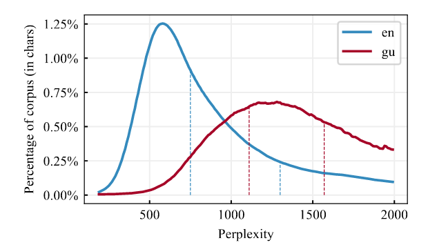
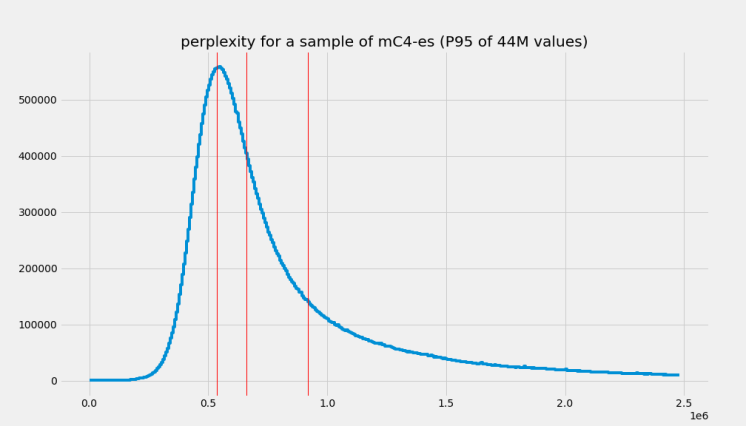
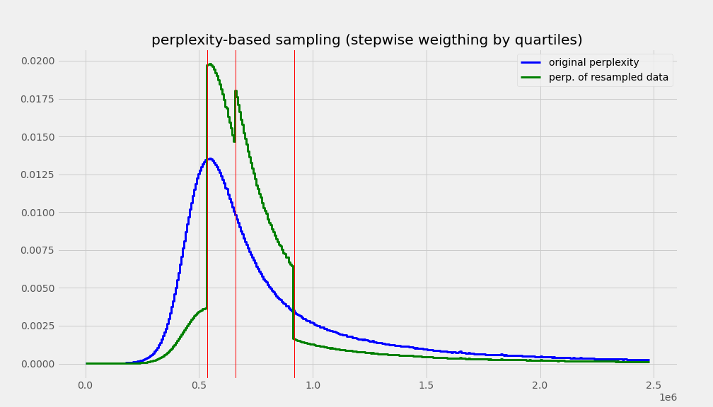
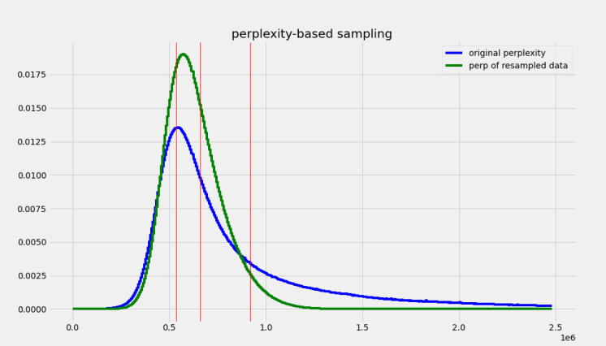
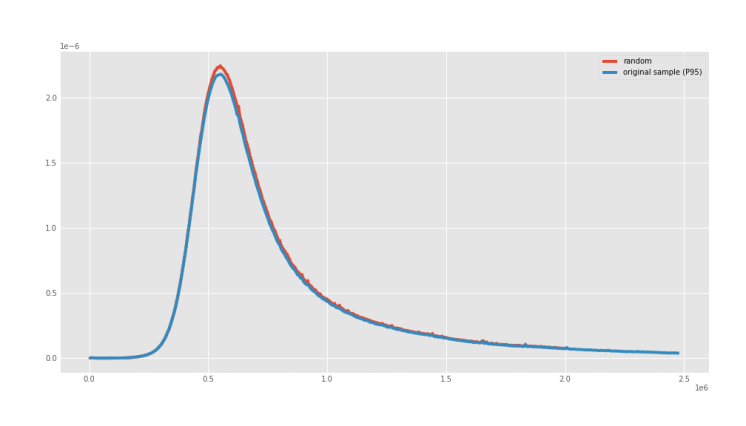

<h1>BERTIN - Training a state of the art Spanish Language Model efficiently using perplexity sampling</h1>

<div class="blog-metadata">
    <small>Published August 15, 2021.</small>
    <a target="_blank" class="btn no-underline text-sm mb-5 font-sans" href="https://github.com/huggingface/blog/blob/master/bertin.md">
        Update on GitHub
    </a>
</div>

<div class="author-card">
    <a href="/versae">
        
        <div class="bfc">
            <code>versae</code>
            <span class="fullname">Javier de la Rosa</span>
        </div>
    </a>
</div>

<div class="author-card">
    <a href="/edugp">
        
        <div class="bfc">
            <code>edugp</code>
            <span class="fullname">Eduardo González Ponferrada</span>
        </div>
    </a>
</div>

<div class="author-card">
    <a href="/paulo">
        
        <div class="bfc">
            <code>paulo</code>
            <span class="fullname">Paulo Villegas</span>
        </div>
    </a>
</div>

<div class="author-card">
    <a href="/Pablogps">
        
        <div class="bfc">
            <code>Pablogps</code>
            <span class="fullname">Pablo González de Prado</span>
        </div>
    </a>
</div>

<div class="author-card">
    <a href="/mrm8488">
        
        <div class="bfc">
            <code>mrm8488</code>
            <span class="fullname">Manuel Romero</span>
        </div>
    </a>
</div>

<div class="author-card">
    <a href="/mariagrandury">
        
        <div class="bfc">
            <code>mariagrandury</code>
            <span class="fullname">María Grandury</span>
        </div>
    </a>
</div>

## BERTIN
BERTIN is a series of Spanish RoBERTa models trained during the [Flax/JAX Community Event](https://discuss.huggingface.co/t/open-to-the-community-community-week-using-jax-flax-for-nlp-cv/7104), organized by [HuggigFace](https://huggingface.co) and sponsored by [Google Cloud](https://cloud.google.com/). Each BERTIN model was trained in under a week on a Google Cloud TPUv3-8. Our results show state-of-the-art performance in multiple downstream tasks, and overall results are comparable to models trained on supercomputers using large private datasets. During the course of the event, we explored several perplexity-based sampling strategies that allowed us to train models efficiently under limited compute and time resources. We are very excited to introduce our methodology and learnings with the hope to empower small teams to train competitive language models on a budget.

# Motivation

According to [Wikipedia](https://en.wikipedia.org/wiki/List_of_languages_by_total_number_of_speakers), Spanish is the second most-spoken language in the world by native speakers (>470 million speakers), only after Chinese, and the fourth including those who speak it as a second language. However, most NLP research is still mainly available in English. Relevant contributions like BERT, XLNet or GPT2 sometimes take years to be available in Spanish and, when they do, it is often via multilingual versions which are not as performant as the English alternative.

Models in monolingual Spanish are hard to come by and, when they do, they are often trained on proprietary datasets and using massive compute resources. In practice, this means that training competitive language models remain exclusive to a handful of large technology companies and organizations. In addition to the prohibitive financial cost, training large language models has a significant [environmental cost](https://arxiv.org/pdf/1906.02243.pdf). This motivated the second goal of our project: Bringing the training of large models like RoBERTa one step closer to smaller groups. To this end, we explored techniques that make training these architectures more data-efficient, easier and faster, thus contributing to the democratization of large language models.

At the time of the event there were no RoBERTa models available in Spanish. Therefore, releasing one such model was the primary goal of our project. During the Flax/JAX Community Event we released a beta version of our model, which was the first such monolingual model in Spanish. Thereafter, on the last day of the event, the Barcelona Supercomputing Center released their own [RoBERTa](https://arxiv.org/pdf/2107.07253.pdf) model. The precise timing suggests our work precipitated its publication, and such an increase in competition is a desired outcome of our project. We are grateful for their efforts to include BERTIN in their paper, as discussed further below, and recognize the value of their own contribution, which we also acknowledge in our experiments.

## The dataset: Spanish mC4

In order to train BERTIN, we used the Spanish subset of the open-sourced mC4 dataset. mC4 is a multilingual variant of the C4, the Colossal, Cleaned version of Common Crawl's web crawl corpus. While C4 was used to train the T5 text-to-text Transformer models, mC4 comprises natural text in 101 languages drawn from the public Common Crawl web-scrape and was used to train mT5, the multilingual version of T5.

The Spanish portion of mC4 (mC4-es) contains about 416 million samples and 235 billion words in approximately 1TB of uncompressed data.

Unfortunately, we did not have access to the private dataset from the Spanish National Library, which is, to the best of our knowledge, the largest language dataset of its kind and has been used to train other Spanish language models.

## Being efficient: Introducing perplexity sampling

The large amount of text in mC4-es makes training a language model within the time constraints of the Flax/JAX Community Event problematic. This motivated the exploration of sampling methods, with the goal of creating a subset of the dataset that would allow for the training of well-performing models with roughly one eighth of the data (~50M samples) and at approximately half the training steps.

In order to efficiently build this subset of data, we decided to leverage a technique we call *perplexity sampling*, and whose origin can be traced to the construction of CCNet (Wenzek et al., 2020) and their high quality monolingual datasets from web-crawl data. In their work, they suggest the possibility of applying fast language models trained on high-quality data such as Wikipedia to filter out texts that deviate too much from correct expressions of a language (see Figure 1). They also released Kneser-Ney models (Ney et al., 1994) for 100 languages (Spanish included) as implemented in the KenLM library (Heafield, 2011) and trained on their respective Wikipedias.

<figure>



<caption>Figure 1. Perplexity distributions by percentage CCNet corpus.</caption>
</figure>

In this work, we hypothesized that sampling a dataset based on document perplexity with the aim to increase the prevalence of high quality documents could improve the data efficiency - this is, we would be able to train competitive models by using less data, but of higher quality, and thus reducing compute time.

## Methodology

In order to test our hypothesis, we first calculated the perplexity of each document in a random subset (roughly a quarter of the data) of mC4-es and extracted their distribution and quartiles (see Figure 2).

<figure>



<caption>Figure 2. Perplexity distributions and quartiles (red lines) of 44M samples of mC4-es.</caption>
</figure>

With the extracted perplexity percentiles, we created two functions to oversample the central quartiles with the idea of biasing against samples which perplexity is either too low, which could indicate the sentences are to short, repetitive pieces of text, or too high, which could potentially indicate poor quality bogus text or incorrect language.

The first function is a `Stepwise` that simply oversamples the central quartiles using quartile boundaries and a `factor` for the desired sampling frequency for each quartile, obviously giving larger frequencies for middle quartiles, oversampling Q2 and Q3 and subsampling Q1 and Q4 (see Figure 3).
The second function weighted the perplexity distribution by a Gaussian-like function, to smooth out the sharp boundaries of the `Stepwise` function and give a better approximation to the desired underlying distribution (see Figure 4).

We adjusted the `factor` parameter of the `Stepwise` function, and the `factor` and `width` parameters of the `Gaussian` function to roughly be able to sample 50M samples from the 416M in mC4-es (see Figure 4). For comparison, we randomly sampled mC4-es up to 50M samples as well. In terms of sizes, we went down from 1TB of data to ~200GB. We released the code to sample from mC4 on the fly when streaming for any language as part of the dataset [`bertin-project/mc4-sampling`](https://huggingface.co/datasets/bertin-project/mc4-sampling).

<figure>



<caption>Figure 3. Expected perplexity distributions of the sample mC4-es after applying the Stepwise function.</caption>

</figure>

<figure>



<caption>Figure 4. Expected perplexity distributions of the sample mC4-es after applying Gaussian function.</caption>
</figure>

Figure 5 shows the actual perplexity distributions of the generated 50M subsets for each of the executed subsampling procedures. All subsets can be easily accessed for reproducibility purposes using the [`bertin-project/mc4-es-sampled`](https://huggingface.co/datasets/bertin-project/mc4-es-sampled) dataset. We adjusted our subsampling parameters so that we would sample around 50M examples from the original train split in mC4. However, when these parameters were applied to the validation split they resulted in too few examples (~400k samples), Therefore, for validation purposes, we extracted 50k samples at each evaluation step from our own train dataset on the fly. Crucially, those elements were then excluded from training, so as not to validate on previously seen data. In the [`mc4-es-sampled`](https://huggingface.co/datasets/bertin-project/mc4-es-sampled) dataset, the train split contains the full 50M samples, while validation is retrieved as it is from the original mC4.

```python
from datasets import load_dataset

for config in ("random", "stepwise", "gaussian"):
    mc4es = load_dataset(
        "bertin-project/mc4-es-sampled",
        config,
        split="train",
        streaming=True
    ).shuffle(buffer_size=1000)
    for sample in mc4es:
        print(config, sample)
        break
```

<figure>


<caption>Figure 5. Experimental perplexity distributions of the sampled mc4-es after applying Gaussian and Stepwise functions, and the Random control sample.</caption>
</figure>

`Random` sampling displayed the same perplexity distribution of the underlying true distribution, as can be seen in Figure 6.

<figure>



<caption>Figure 6. Experimental perplexity distribution of the sampled mc4-es after applying Random sampling.</caption>
</figure>

In order to rule out the possibility of perplexity sampling filtering out relevant subsets of the dataset, such as documents relating to certain topics or concepts, we visually explored potential correlations between semantics and perplexity.  The [interactive visualization](https://huggingface.co/bertin-project/bertin-roberta-base-spanish/raw/main/images/perplexity_colored_embeddings.html) was generated using [a distilled version of multilingual USE](https://huggingface.co/sentence-transformers/distiluse-base-multilingual-cased-v1) to embed a random subset of 20,000 mC4-es examples and t-SNE was used for dimensionality reduction to a 2D space. The visualization seems to show a uniform distribution of perplexity across the different semantic clusters (each example is colored based on its perplexity). This is important since, in principle, perplexity sampling could introduce undesired biases if perplexity happens to be correlated to some other quality of our data. The code required to replicate this visualization is available at [`tsne_plot.py`](https://huggingface.co/bertin-project/bertin-roberta-base-spanish/blob/main/tsne_plot.py) and you can play with the visualization tool [here](https://huggingface.co/bertin-project/bertin-roberta-base-spanish/raw/main/images/perplexity_colored_embeddings.html).