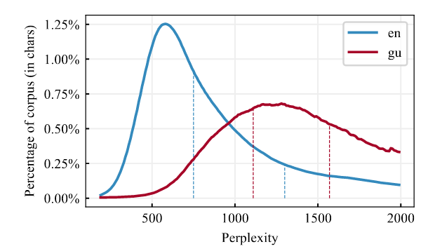
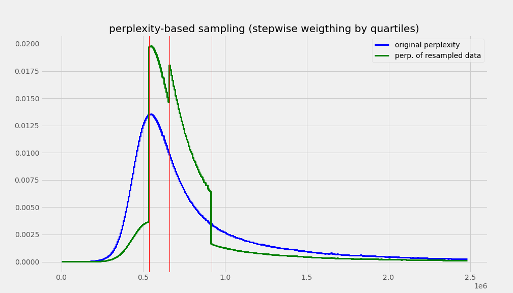
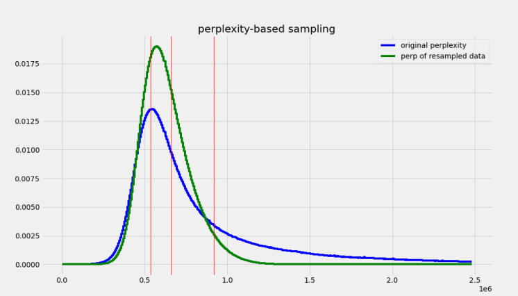
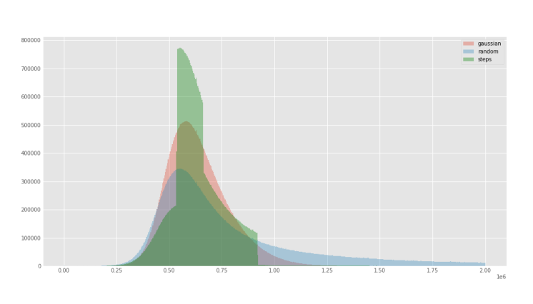
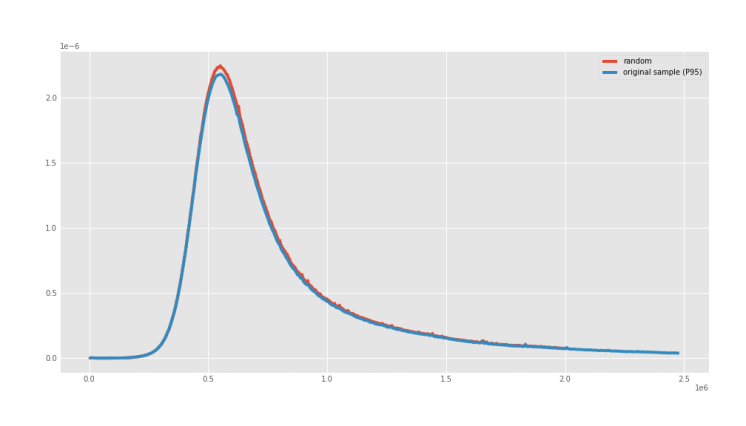
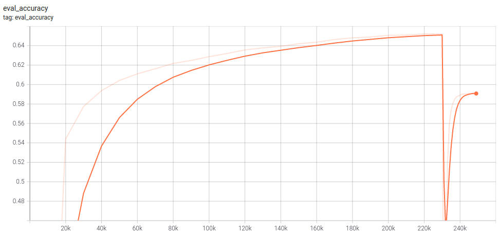

<h1>BERTIN - Efficiently training a state of the art Spanish Language-Model using perplexity sampling</h1>

<div class="blog-metadata">
    <small>Published August 15, 2021.</small>
    <a target="_blank" class="btn no-underline text-sm mb-5 font-sans" href="https://github.com/huggingface/blog/blob/master/bertin.md">
        Update on GitHub
    </a>
</div>

<div class="author-card">
    <a href="/versae">
        
        <div class="bfc">
            <code>versae</code>
            <span class="fullname">Javier de la Rosa</span>
        </div>
    </a>
</div>

<div class="author-card">
    <a href="/edugp">
        
        <div class="bfc">
            <code>edugp</code>
            <span class="fullname">Eduardo González Ponferrada</span>
        </div>
    </a>
</div>

<div class="author-card">
    <a href="/paulo">
        
        <div class="bfc">
            <code>paulo</code>
            <span class="fullname">Paulo Villegas</span>
        </div>
    </a>
</div>

<div class="author-card">
    <a href="/Pablogps">
        
        <div class="bfc">
            <code>Pablogps</code>
            <span class="fullname">Pablo González de Prado</span>
        </div>
    </a>
</div>

<div class="author-card">
    <a href="/mrm8488">
        
        <div class="bfc">
            <code>mrm8488</code>
            <span class="fullname">Manuel Romero</span>
        </div>
    </a>
</div>

<div class="author-card">
    <a href="/mariagrandury">
        
        <div class="bfc">
            <code>mariagrandury</code>
            <span class="fullname">María Grandury</span>
        </div>
    </a>
</div>

## BERTIN
BERTIN is a series of Spanish RoBERTa models trained during the [JAX/Flax Community Event](https://discuss.huggingface.co/t/open-to-the-community-community-week-using-jax-flax-for-nlp-cv/7104), organized by [HuggingFace](https://huggingface.co). [Google Cloud](https://cloud.google.com/) provided free Tensor Processing Units (TPUs) during the event, enabling participants to tackle interesting challenges in the areas of Natural Language Processing and Computer Vision.

The BERTIN project was born from a group of strangers with a shared interest in Spanish NLP, who decided to organize and participate in the JAX/Flax Community Event with the main goal of training a competitive monolingual RoBERTa language model in Spanish.

Our team members were based in Spain, Germany and the United States, and the majority of us were part of the [NLP en ES](https://nlp-en-es.org) community. NLP en ES stems from the initiative "Languages at Hugging Face" and consists of an international network of professionals, researchers and students with the common goal of accelerating the development of NLP in Spanish.

Through the initial phase of the project, through team discussions around the project strategy, it became clear that training a large language model within the time frame of the even was hardly feasible, which lead to the exploration of different ideas around data sampling to improve training efficiency.


Each BERTIN model was trained in under a week on a Google Cloud TPUv3-8 using publicly available data. Our results show state-of-the-art performance in multiple downstream tasks, and overall figures are comparable to models trained on supercomputers using large private datasets.

We explored several perplexity-based sampling strategies that allowed us to train models efficiently under limited compute and time resources. We are very excited to introduce our methodology and learnings with the hope to empower small teams to train competitive language models on a budget.

## Motivation

According to [Wikipedia](https://en.wikipedia.org/wiki/List_of_languages_by_total_number_of_speakers), Spanish is the second most-spoken language in the world by native speakers, with over 470 million speakers. However, most NLP research is mainly focused in English. Due to this, relevant contributions like BERT, XLNet and GPT-2 can take years to be available in Spanish and, when they do, it is often via multilingual versions which are not as performant as the English alternative.

Monolingual Spanish models are hard to come by and often trained on proprietary datasets and using massive compute resources. In practice, this means that training competitive language models remain exclusive to a handful of large technology companies and organizations. In addition to the prohibitive financial cost, training large language models has a significant [environmental cost](https://arxiv.org/pdf/1906.02243.pdf) (Strubell et al., 2019). One of our motivations consisted on bringing the training process of large models like RoBERTa one step closer to smaller groups. To this end, we explored techniques that make training these architectures more data-efficient, easier and faster, thus contributing to the democratization of large language models.

At the time of the event, there were no monolingual RoBERTa models available in Spanish. Therefore, releasing one such model was the primary goal of our project. During the JAX/Flax Community Event we released a beta version of our model, which was the first such monolingual model in Spanish. Shortly after, the Barcelona Supercomputing Center released their own [RoBERTa](https://arxiv.org/pdf/2107.07253.pdf) model. The precise timing suggests our work precipitated its publication, and such an increase in competition is a valuable outcome of our project. We are grateful for the Barcelona Supercomputing Center efforts to include BERTIN results in their paper.

## The dataset: Spanish mC4

In order to train BERTIN, we used the Spanish subset of the open-sourced [mC4 dataset](https://aclanthology.org/2021.naacl-main.41/). mC4 is a multilingual variant of [C4 aka Colossal Clean Crawled Corpus](https://arxiv.org/abs/1910.10683), a cleaned version of Common Crawl's web crawl corpus. While C4 was used to train the T5 text-to-text Transformer models, mC4 comprises natural text in 101 languages drawn from the public Common Crawl web-scrape and was used to train mT5, the multilingual version of T5.

The Spanish portion of mC4 (mC4-es) contains about 416 million samples and 235 billion words in approximately 1TB of uncompressed data.

## Being efficient: Introducing perplexity sampling

The large amount of text in mC4-es makes training a language model within the time and resource constraints of the JAX/Flax Community Event problematic. This motivated the exploration of sampling methods, with the goal of creating a subset of the dataset that would allow for the training of well-performing models with roughly one eighth of the data (~50M samples) and at approximately half the training steps.

In order to efficiently build this subset of data, we decided to leverage a technique we call *perplexity sampling*, and whose origin can be traced to the construction of [CCNet](https://arxiv.org/pdf/1911.00359.pdf) (Wenzek et al., 2020) and their high-quality monolingual datasets from web-crawl data. In their work, they suggest the possibility of applying fast language models trained on high-quality data such as Wikipedia to filter out texts that deviate too much from correct expressions of a language (see Figure 1). They also released Kneser-Ney models ([Ney et al., 1994](https://www.sciencedirect.com/science/article/abs/pii/S0885230884710011)) for 100 languages (Spanish included) as implemented in the [KenLM library](https://aclanthology.org/W11-2123.pdf) (Heafield, 2011) and trained on their respective Wikipedias.

<figure>



<caption>Figure 1. Perplexity distributions by percentage CCNet corpus. The blue 
line (en), with a narrower peak, corresponds to English language, while the red 
one (gu) corresponds to Gujarati. From (Wenzek et al., 2020)</caption>
</figure>

With this information in mind, we decided to use perplexity values to filter high-quality
documents while sampling a very large dataset. The goal is to be able to train 
competitive models using less—but higher quality—data, with reduced computational
 times.

## Methodology

In order to test our hypothesis, we first calculated the perplexity of each document in a random subset (roughly a quarter of the data) of mC4-es and extracted their distribution and quartiles (see Figure 2).

<figure>


<caption>Figure 2. Perplexity distributions and quartiles (red lines) of 44M samples of mC4-es.</caption>
</figure>

With the extracted perplexity percentiles, we created two functions to oversample the central quartiles with the idea of biasing against samples with perplexity either too low, which could indicate the sentences are short, repetitive pieces of very common text; or too high, which could potentially indicate poor quality text containing incorrect language forms.

The first function is a `Stepwise` that simply oversamples the central quartiles using quartile boundaries and a `factor` for the desired sampling frequency for each quartile, obviously giving larger frequencies for middle quartiles, oversampling Q2 and Q3 and subsampling Q1 and Q4 (see Figure 3).
The second function weighted the perplexity distribution by a Gaussian-like function, to smooth out the sharp boundaries of the `Stepwise` function and give a better approximation to the desired underlying distribution (see Figure 4).

We adjusted the `factor` parameter of the `Stepwise` function, and the `factor` and `width` parameters of the `Gaussian` function to roughly be able to sample 50M samples from the 416M in mC4-es (see Figure 4). For comparison, we randomly sampled mC4-es up to 50M samples as well. In terms of sizes, we went down from 1TB of data to ~200GB. We released the code to sample from mC4 on the fly when streaming for any language as part of the dataset [`bertin-project/mc4-sampling`](https://huggingface.co/datasets/bertin-project/mc4-sampling) (obviously the parameters for the sampling functions will need to be adapted to the statistics of the language used).

<figure>



<caption>Figure 3. Expected perplexity distributions of the sample mC4-es after applying the Stepwise function.</caption>

</figure>

<figure>



<caption>Figure 4. Expected perplexity distributions of the sample mC4-es after applying the Gaussian function.</caption>
</figure>


Figure 5 shows the actual perplexity distributions of the generated 50M sample subsets for each of the executed subsampling procedures. All subsets can be easily accessed for reproducibility purposes using the [`bertin-project/mc4-es-sampled`](https://huggingface.co/datasets/bertin-project/mc4-es-sampled) dataset. The train split contains the full 50M samples, while validation is retrieved as it is from the original mC4.

```python
from datasets import load_dataset

for config in ("random", "stepwise", "gaussian"):
    mc4es = load_dataset(
        "bertin-project/mc4-es-sampled",
        config,
        split="train",
        streaming=True
    ).shuffle(buffer_size=1000)
    for sample in mc4es:
        print(config, sample)
        break
```

<figure>



<caption>Figure 5. Experimental perplexity distributions of the sampled mc4-es after applying Gaussian and Stepwise functions, and the Random control sample.</caption>
</figure>

`Random` sampling displayed the same perplexity distribution of the underlying true distribution, as can be seen in Figure 6.

<figure>



<caption>Figure 6. Experimental perplexity distribution of the sampled mc4-es after applying Random sampling.</caption>
</figure>

In order to rule out the possibility of perplexity sampling filtering out relevant subsets of the dataset, such as documents relating to certain topics, we visually explored potential correlations between semantics and perplexity. The interactive visualization was generated using [a distilled version of multilingual USE](https://huggingface.co/sentence-transformers/distiluse-base-multilingual-cased-v1) to embed a random subset of 20,000 mC4-es examples, then t-SNE was used for dimensionality reduction to a 2D space. The visualization showed a seemingly uniform distribution of perplexity across the different semantic clusters (each example is colored based on its perplexity). This is important since, in principle, perplexity sampling could introduce undesired biases if perplexity happens to be correlated to some other quality of our data. The visualization can be found [here](https://huggingface.co/bertin-project/bertin-roberta-base-spanish/raw/main/images/perplexity_colored_embeddings.html).

### Training details

We used the same setup and hyperparameters as [Liu et al. (2019)](https://arxiv.org/abs/1907.11692) but trained only for half the steps (250k) with a sequence length of 128.

We then continued training the most promising models for 50k more steps changing the sequence length from 128 to 512. Since there there is no standard in the literature on how to do this, we tried two different strategies. It turns out this decision had a big impact in the final performance.

For the `Random` sampling model, we tried trained with sequence length 512 during the last 25k steps of the 250k training steps, keeping the optimizer state intact. Results for this approach were underwhelming, as seen in Figure 7.

<figure>



<caption>Figure 7. Training profile for Random sampling model. Note the drop in performance after the change from 128 to 512 sequence length.</caption>
</figure>

For the `Gaussian` perplexity sampling model we started a new optimizer after training with 128 sequence length, using a short warmup interval of 500 steps. Results were much better using this procedure, achieving a final MLM accuracy of 0.6873 compared to 0.5907 for the `Random` perplexity sampling model (with 512 sequence length), a difference much larger than that of their respective 128 sequence length models (0.6520 for `Random`, 0.6608 for `Gaussian`). Following the same procedure, the `Stepwise` perplexity sampling model continued training on sequence length 512, achieving a MLM accuracy of 0.6744.

We used a batch size of 2048 (8 TPU cores x 256 batch size per core) for training with 128 sequence length, and 384 (8 TPU cores x 48 batch size per core) for 512 sequence length, with no change in learning rate.

## Results

Please refer to the [repository](https://huggingface.co/bertin-project/bertin-roberta-base-spanish/tree/main/evaluation) for training scripts for downstream tasks.

Our first model, tagged [`beta`](https://huggingface.co/bertin-project/bertin-roberta-base-spanish/tree/beta), refers to an initial experimental model using `Stepwise` perplexity sampling on 128 sequence length and trained for 210k steps with a small `factor` set to 10. During the time frame of the community event, the Barcelona Supercomputing Center (BSC) in association with the National Library of Spain released RoBERTa base and large models trained on 200M documents (570GB) of high quality private data cleaned using 100 nodes with 48 CPU cores of the MareNostrum 4 supercomputer during 96 hours. This is an interesting contrast to our own resources (3 TPUv3-8 + CPU for 10 days to do cleaning, sampling, training, and evaluation) and makes for a valuable reference. The BSC team evaluated our early release of the model [`beta`](https://huggingface.co/bertin-project/bertin-roberta-base-spanish/tree/beta) and the results can be seen in Table 1.

Our final models were trained further and achieved better masked-token prediction accuracies. Some of the datasets used for evaluation by BSC are not freely available, therefore it was not possible for us to replicate their figures.

<figure>

<caption>Table 1. Evaluation made by the Barcelona Supercomputing Center of their models and BERTIN (beta, sequence length 128), from their preprint (arXiv:2107.07253).</caption>

| Dataset     | Metric   | RoBERTa-b | RoBERTa-l | BETO   | mBERT  | BERTIN (beta) |
|-------------|----------|-----------|-----------|--------|--------|--------|
| UD-POS      | F1       |**0.9907** |    0.9901 | 0.9900 | 0.9886 | **0.9904** |
| Conll-NER   | F1       |    0.8851 |    0.8772 | 0.8759 | 0.8691 | 0.8627 |
| Capitel-POS | F1       |    0.9846 |    0.9851 | 0.9836 | 0.9839 | 0.9826 |
| Capitel-NER | F1       |    0.8959 |    0.8998 | 0.8771 | 0.8810 | 0.8741 |
| STS         | Combined |    0.8423 |    0.8420 | 0.8216 | 0.8249 | 0.7822 |
| MLDoc       | Accuracy |    0.9595 |    0.9600 | 0.9650 | 0.9560 | **0.9673** |
| PAWS-X      | F1       |    0.9035 |    0.9000 | 0.8915 | 0.9020 | 0.8820 |
| XNLI        | Accuracy |    0.8016 |       WIP | 0.8130 | 0.7876 |    WIP |

</figure>

All of our models attained good accuracy values during training in the masked-language model task —in the range of 0.65— as can be seen in Table 2:

<figure>

<caption>Table 2. Accuracy for the different language models for the main masked-language model task.</caption>

| Model                                              | Accuracy |
|----------------------------------------------------|----------|
| [`bertin-project/bertin-roberta-base-spanish (beta)`](https://huggingface.co/bertin-project/bertin-roberta-base-spanish)         | 0.6547   |
| [`bertin-project/bertin-base-random`](https://huggingface.co/bertin-project/bertin-base-random)                  | 0.6520   |
| [`bertin-project/bertin-base-stepwise`](https://huggingface.co/bertin-project/bertin-base-stepwise)                | 0.6487   |
| [`bertin-project/bertin-base-gaussian`](https://huggingface.co/bertin-project/bertin-base-gaussian)                | 0.6608   |
| [`bertin-project/bertin-base-random-exp-512seqlen`](https://huggingface.co/bertin-project/bertin-base-random-exp-512seqlen)    | 0.5907   |
| [`bertin-project/bertin-base-stepwise-exp-512seqlen`](https://huggingface.co/bertin-project/bertin-base-stepwise-exp-512seqlen)  | 0.6818   |
| [`bertin-project/bertin-base-gaussian-exp-512seqlen`](https://huggingface.co/bertin-project/bertin-base-gaussian-exp-512seqlen)  | **0.6873**   |

</figure>


Our own results on downstream tasks are described below. For simplicity, we will abbreviate the different models as follows:

- **mBERT**: [`bert-base-multilingual-cased`](https://huggingface.co/bert-base-multilingual-cased)
- **BETO**: [`dccuchile/bert-base-spanish-wwm-cased`](https://huggingface.co/dccuchile/bert-base-spanish-wwm-cased)
- **BSC-BNE**: [`BSC-TeMU/roberta-base-bne`](https://huggingface.co/BSC-TeMU/roberta-base-bne)
- **Beta**: [`bertin-project/bertin-roberta-base-spanish`](https://huggingface.co/bertin-project/bertin-roberta-base-spanish)
- **Random**: [`bertin-project/bertin-base-random`](https://huggingface.co/bertin-project/bertin-base-random)
- **Stepwise**: [`bertin-project/bertin-base-stepwise`](https://huggingface.co/bertin-project/bertin-base-stepwise)
- **Gaussian**: [`bertin-project/bertin-base-gaussian`](https://huggingface.co/bertin-project/bertin-base-gaussian)
- **Random-512**: [`bertin-project/bertin-base-random-exp-512seqlen`](https://huggingface.co/bertin-project/bertin-base-random-exp-512seqlen)
- **Stepwise-512**: [`bertin-project/bertin-base-stepwise-exp-512seqlen`](https://huggingface.co/bertin-project/bertin-base-stepwise-exp-512seqlen)
- **Gaussian-512**: [`bertin-project/bertin-base-gaussian-exp-512seqlen`](https://huggingface.co/bertin-project/bertin-base-gaussian-exp-512seqlen)


All models were fine-tuned on a single Tesla K80 GPU.

<figure>

<caption>

Table 3. Metrics for different downstream tasks, comparing our different models as well as other relevant BERT variations from the literature. Dataset for POS and NER is CoNLL 2002. All models were fine-tuned with max length 512, batch size 16 for 5 epochs. Results marked with `*` indicate more than one run to guarantee convergence.
</caption>

|     Model    | POS (F1/Acc)         |     NER (F1/Acc)    | PAWS-X (Acc) | XNLI (Acc) |
|--------------|----------------------|---------------------|--------------|------------|
|   mBERT      |  0.9630 / 0.9689     | 0.8616 / 0.9790     |  0.8895*     |  0.7606    |
|  BETO        |  0.9639 / 0.9693     | 0.8596 / 0.9790     |  0.8720*     | **0.8012** |
|   BSC-BNE    |  **0.9655 / 0.9706** | 0.8764 / 0.9818     |  0.8815*     |  0.7771*   |
|    Beta      |  0.9616 / 0.9669     | 0.8640 / 0.9799     |  0.8670*     |  0.7751*   |
|    Random    |  0.9651 / 0.9700     | 0.8638 / 0.9802     |  0.8800*     |  0.7795    |
|  Stepwise    |  0.9647 / 0.9698     | 0.8749 / 0.9819     |  0.8685*     |  0.7763    |
|   Gaussian   |  0.9644 / 0.9692     | **0.8779 / 0.9820** |  0.8875*     |  0.7843    |
| Random-512   |  0.9636 /  0.9690    | 0.8664 / 0.9806     |  0.6735*     |  0.7799    |
| Stepwise-512 |  0.9633 / 0.9684     | 0.8662 / 0.9811     |  0.8690      |  0.7695    |
| Gaussian-512 |  0.9646 / 0.9697     | 0.8707 / 0.9810     | **0.8965**\* |  0.7843    |

</figure>

In addition to the tasks above, we also fine-tuned the [`beta`](https://huggingface.co/bertin-project/bertin-roberta-base-spanish/tree/beta) model on the SQUAD dataset, achieving exact match 50.96 and F1 68.74 (sequence length 128).

During fine-tuning we observed poor performance on certain tasks for some models, so we re-trained these several times (marked with * on the table) to account for variability across runs.
This suggests fine-tuning can be unstable for some datasets under the batch size limitations of the hardware used for fine-tuning. Increasing the batch size would likely help to solve the training instability, however, this was not feasible within the project schedule. For example, runtime for XNLI-512 was ~19h per model and increasing the batch size without reducing sequence length was not possible on a single K80 GPU.

We are releasing the fine-tuned models for `Gaussian`-512 and making our version [v1](https://huggingface.co/bertin-project/bertin-roberta-base-spanish/tree/v1) default to 128 sequence length since it experimentally showed better performance on the fill-mask task, while also releasing the 512 sequence length version ([v1-512](https://huggingface.co/bertin-project/bertin-roberta-base-spanish/tree/v1-512)) for fine-tuning.

- POS: [`bertin-project/bertin-base-pos-conll2002-es`](https://huggingface.co/bertin-project/bertin-base-pos-conll2002-es/)
- NER: [`bertin-project/bertin-base-ner-conll2002-es`](https://huggingface.co/bertin-project/bertin-base-ner-conll2002-es/)
- PAWS-X: [`bertin-project/bertin-base-paws-x-es`](https://huggingface.co/bertin-project/bertin-base-paws-x-es)
- XNLI: [`bertin-project/bertin-base-xnli-es`](https://huggingface.co/bertin-project/bertin-base-xnli-es)

## Discusion

The performance of our BERTIN models is, in general, very good. Even our beta model is able to achieve SOTA in MLDoc (and virtually tie in UD-POS) as evaluated by the Barcelona Supercomputing Center. In the pre-training masked-token prediction task our models achieve accuracies between 0.65 and 0.69, which foretells good results for downstream tasks.

Under standard training conditions and without hyperparameter tuning, our language models are remarkably performant in downstream tasks. In particular, `Gaussian` perplexity sampling seems to produce consistently solid models, taking the lead in four of the seven tasks analysed.

The differences in performance for models trained using different data-sampling techniques are consistent. `Gaussian`-sampling is always first (with the exception of POS-512), while `Stepwise` is better than `Random` when trained for a similar number of steps. This proves that the sampling technique is, indeed, relevant.

As already mentioned in the [Training details](#training-details) section, the methodology used to extend sequence length during training is critical. Re-starting the learning rate scheduler before increasing the sequence length proved to be a much better strategy than keeping the same learning rate scheduler, suggesting that increasing the learning rate is beneficial before modifying the sequence length, especially when close to the end of the training cycle, when the learning rate is very low.

# Lessons and next steps

The BERTIN Project has been a challenge for many reasons. Like many others in the JAX/Flax Community Event, ours is an impromptu team of people with little to no experience with JAX or Flax. Moreover, other than the main goal of producing a RoBERTa model, nothing was decided upon the start of the project, so we had to spend some time organizing how we would work and communicate, and debating and agreeing on the approaches we would like to take given the limitations in time and resources. Notwithstanding, the results we present in this project are very promising, and we believe they hold great value for the community as a whole.

The most obvious next step would be replicating training on a "large" version of the model. We decided against a RoBERTa large model at the beginning of the event due to our need for faster iterations.
We would also like to explore in greater detail the impact of different perplexity sampling methods and invite other teams to do so as well.
It would also be important to take a closer look into possible biases that perplexity sampling might be introducing. Our preliminary investigation suggests that documents are not filtered out based on semantics, but further investigation would be beneficial.  
Another intriguing possibility would consist on combining perplexity sampling with other large-scale dataset cleaning methods such as [deduplication](https://arxiv.org/pdf/2107.06499.pdf) (Lee et al., 2021), as they seem to share a complementary philosophy.

# Conclusions

With roughly 10 days worth of access to 3 TPUv3-8, we achieved remarkable results surpassing previous state of the art in multiple tasks, including models trained on massive supercomputers with very large, highly-curated, and in some cases private, datasets.

The challenge of training a competitive large language model under tight constraints lead us to explore the idea of efficient language model training and how to facilitate this task for small teams like ours in the future. The sampling techniques analysed in this report have shown great promise in this regard, and we hope to see other groups using and improving them in the future.

We would like to thank the HuggingFace and Google JAX teams, who played a critical role in the success of this project through constant support and communication, as well as resolving some critical infrastructure and software issues, through this journey to build one of the best Spanish language models out there.

Given our results, on par with those of large corporations and research groups, we hope this work will inspire other small teams to experiment with training language models to build exciting applications in the future.

## References

- Heafield, K. (2011). KenLM: faster and smaller language model queries. Proceedings of the EMNLP2011 Sixth Workshop on Statistical Machine Translation.

- Lee, K., Ippolito, D., Nystrom, A., Zhang, C., Eck, D., Callison-Burch, C., & Carlini, N. (2021). Deduplicating Training Data Makes Language Models Better. arXiv preprint arXiv:2107.06499.

- Liu, Y., Ott, M., Goyal, N., Du, J., Joshi, M., Chen, D., ... & Stoyanov, V. (2019). Roberta: A robustly optimized bert pretraining approach. arXiv preprint arXiv:1907.11692.

- Ney, H., Essen, U., & Kneser, R. (1994). On structuring probabilistic dependences in stochastic language modelling. Computer Speech & Language, 8(1), 1-38.

- Wenzek, G., Lachaux, M. A., Conneau, A., Chaudhary, V., Guzmán, F., Joulin, A., & Grave, E. (2019). Ccnet: Extracting high quality monolingual datasets from web crawl data. arXiv preprint arXiv:1911.00359.

- Strubell, E., Ganesh, A., & McCallum, A. (2019). Energy and policy considerations for deep learning in NLP. arXiv preprint arXiv:1906.02243.
