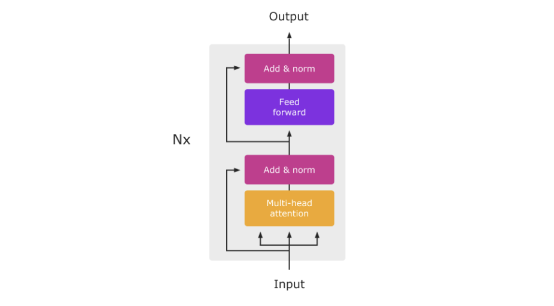
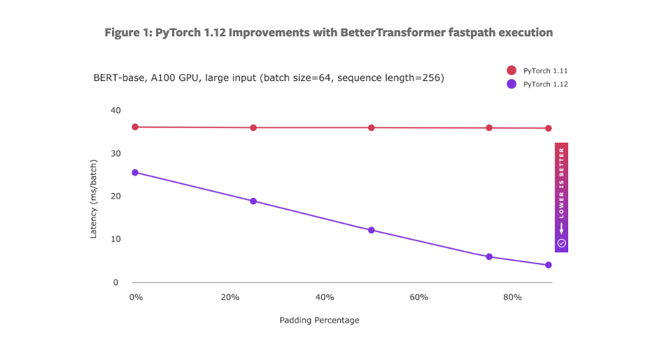
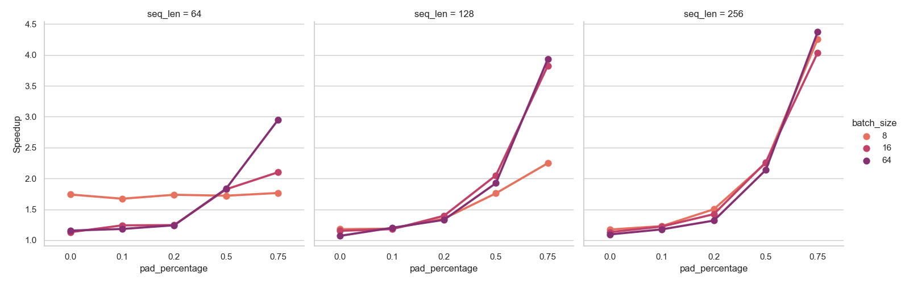

# Use BetterTransformer and make transformers great again

<div class="blog-metadata">
    <small>Published November 16, 2022.</small>
    <a target="_blank" class="btn no-underline text-sm mb-5 font-sans" href="https://github.com/huggingface/blog/blob/main/better-transformer.md">
        Update on GitHub
    </a>
</div>

<div class="author-card">
    <a href="/ybelkada">
        
        <div class="bfc">
            <code>ybelkada</code>
            <span class="fullname">Younes Belkada</span>
        </div>
    </a>
    <a href="/fxmarty">
        
        <div class="bfc">
            <code>fxmarty</code>
            <span class="fullname">Felix Marty</span>
        </div>
    </a>
        <a href="/michaelbenayoun">
        
        <div class="bfc">
            <code>michaelbenayoun</code>
            <span class="fullname">Michael Benayoun</span>
        </div>
    </a>
    <a href="/">
        
        <div class="bfc">
            <code>erichan</code>
            <span class="fullname">Eric Han</span>
            <span class="bg-gray-100 dark:bg-gray-700 rounded px-1 text-gray-600 text-sm font-mono">guest</span>
        </div>
    </a>
    <a href="/">
        
        <div class="bfc">
            <code>hamidnazeri</code>
            <span class="fullname">Hamid Nazeri</span>
            <span class="bg-gray-100 dark:bg-gray-700 rounded px-1 text-gray-600 text-sm font-mono">guest</span>
        </div>
    </a>
        <a href="/">
        
        <div class="bfc">
            <code>michaelgschwind</code>
            <span class="fullname">Michael Gschwind</span>
            <span class="bg-gray-100 dark:bg-gray-700 rounded px-1 text-gray-600 text-sm font-mono">guest</span>
        </div>
    </a>
    </a>
        <a href="/">
        
        <div class="bfc">
            <code>geetachauhan</code>
            <span class="fullname">Geeta Chauhan</span>
            <span class="bg-gray-100 dark:bg-gray-700 rounded px-1 text-gray-600 text-sm font-mono">guest</span>
        </div>
    </a>
    </a>
        <a href="/">
        
        <div class="bfc">
            <code>drissguessous</code>
            <span class="fullname">Driss Guessous</span>
            <span class="bg-gray-100 dark:bg-gray-700 rounded px-1 text-gray-600 text-sm font-mono">guest</span>
        </div>
    </a>
</div>


A few months ago, PyTorch launched [“BetterTransformer” (BT)](https://pytorch.org/blog/a-better-transformer-for-fast-transformer-encoder-inference/ ) that provides an important speedup on Encoder-based models using the so-called fastpath execution and fused kernels. We teamed up with them and made the feature available **as a one-liner** for the most important models on the Hugging Face ecosystem: `faster_model = BetterTransformer.transform(model)`.

## How to use BetterTransformer in the Hugging Face ecosystem

### Install dependencies

Make sure to use the latest stable version of PyTorch by following the installation guidelines in the [official website](https://pytorch.org/get-started/locally/). Make sure to have `optimum` and `transformers` installed and you are ready to go!

```bash
pip install transformers optimum
```

### Classic usage

Once you load your model using `transformers`, use the `BetterTransformer` API from `optimum` to convert the original model to its `BetterTransformer` version.

 ```python
from transformers import AutoModel
from optimum.bettertransformer import BetterTransformer

model_name = "roberta-base"
model = AutoModel.from_pretrained(model_name).to(“cuda:0”)

better_model = BetterTransformer.transform(model)
```

#### `pipeline` integration

The `BetterTransformer` API from `optimum` came also with `pipeline` integration. If you are familiar with `pipeline` from `transformers`, you can simply import `pipeline` from `optimum.pipelines` and run your preferred pipelines as follows:


```python
from optimum.pipelines import pipeline
unmasked = pipeline("fill-mask", "distilbert-base-uncased", accelerator="bettertransformer", device=0)

unmasked("I am a student at [MASK] University")
```

For a more detailed example, we put up a [Google Colab](https://colab.research.google.com/drive/1Lv2RCG_AT6bZNdlL1oDDNNiwBBuirwI-?usp=sharing) (TODO: check not editable) that shows how to benchmark BetterTransformer with the original model.

## BetterTransformer in a nutshell

BetterTransformer takes advantage of padded tokens to enable the fastpath execution of the model by leveraging two different types of optimization:

1. Fused kernels implementing multiple operations more efficiently in a single kernel
2. Exploit sparsity using padded tokens. 

Therefore the speedup of the fastpath execution comes from 2 different ways: a base speedup that is related to the fused kernel optimization, and the sparsity speedup related to the amount of padded tokens from the input sentence. 

Let us now quickly understand the concept of a fused  operator and how sparsity is leveraged to make execution of Transformer encoder faster!

### What is a fused operator ?

“Kernel fusion” means to write a set of sequential operations in a single compiled and optimized so called “kernel” that will be called at runtime for faster execution. In practice these kernels are useful to enhance the throughput of model execution at training and inference times. 

|  |
|:--:|
| <b> Diagram of the Transformer Encoder Architecture (from "Attention Is All You Need"): 
The fused TransformerEncoder operator includes multiple constituent inputs in a single optimized operator, combining operations and processes both dense torch.tensor and variable-length torch.nested_tensor.  TransformerEncoder calls the fused Multi-Head Attention operator which includes several fused kernels combining multiple kernels each. Link to the original image: https://www.google.com/url?q=https://pytorch.org/blog/a-better-transformer-for-fast-transformer-encoder-inference/&sa=D&source=docs&ust=1668420130240835&usg=AOvVaw0HVB0dX5Qhamr99nys4shg </b>|

In BetterTransformer, the entire encoder layer operation is implemented as a single operator, which makes its execution faster than running each operation of the Transformer encoder step by step.

To understand better how fused kernels help, it is necessary to do the distinction between a task that is *compute bound* and *memory bound*. For the former case, the throughput is limited by the *computational throughput*, which is commonly measured in floating-point operations per second. In a memory bound task, the global throughput is limited by the reading and writing throughput of the device. In the case of transformers models, the [bottleneck is most often memory I/O](https://arxiv.org/abs/2007.00072).

Therefore, on GPUs, one of the key ideas is to keep to the minimum the tensor read and writes between the on-chip SRAMs — closer to the processing units and with the highest bandwidth — and the GPU main memory, which has slower I/O. For example, Flash Attention proposes to fuse all the attention operations into a single kernel that avoids much of the read and writes with the main memory.

If you are keen about understanding more about `FlashAttention` please read the section [future work](#future-work) below.

### How sparsity is exploited?

For most of the NLP systems, padding tokens are exploited to perform batched processing and avoid computing attention scores on these tokens. Note that this concept is effective for NLP models and most audio models.  For other modalities it depends on the variation in size of sequences being processed:  for example, images are chunked into the same amount of tokens for vision-based transformers, such as Visual Transformers (ViT). 

BetterTransformer exploits sparsity by simply avoiding unnecessary computation of padding tokens using [nested tensors](https://pytorch.org/tutorials/prototype/nestedtensor.html). 
This is particularly effective for large input (large sequence length and large batch size) and models can benefit from very significant speedups when the percentage of padding tokens is high.

|  |
|:--:|
| <b> BetterTransformer takes advantage of variable-length sequence information:
speedup  and efficiency for BetterTransformer fastpath execution and sparsity optimization using torch.nested_tensor scale as padding amount improves in a batch. Link to the original image: https://pytorch.org/blog/PyTorch-1.13-release/ </b>|

## Expected Speedups

The base speedup is very sensitive to the hardware you are using, for newest hardwares (NVIDIA A100, V100) the speedup is much more significant than older GPUs (NVIDIA T4, etc.). Note also that a considerable speedup is also observed on CPU hardware, which makes the method in general faster than the native implementation on the most used hardwares. Please check the tables below for more detailed numbers:

### Running `bert-large` in `float16` on `NVIDIA T4` GPU:

Here we vary the batch size and sequence length to show the speedup of BetterTransformer compared to the native implementation. Note that the speedup is very significant for larger batch sizes and sequence lengths and padding percentage.

|   batch_size |   seq_len |   pad_percentage |   HF_time |   BT_time |   Speedup |
|-------------:|----------:|-----------------:|----------:|----------:|----------:|
|            8 |        64 |             0    |     25.16 |     13.5  |      1.86 |
|            8 |        64 |             0.1  |     24.83 |     13.8  |      1.8  |
|            8 |        64 |             0.2  |     24.82 |     13.48 |      1.84 |
|            8 |        64 |             0.5  |     24.6  |     13.33 |      1.85 |
|            8 |        64 |             0.75 |     24.64 |     13.04 |      1.89 |
|            8 |       128 |             0    |     25.47 |     13.46 |      1.89 |
|            8 |       128 |             0.1  |     25.54 |     13.84 |      1.85 |
|            8 |       128 |             0.2  |     25.62 |     13.65 |      1.88 |
|            8 |       128 |             0.5  |     25.72 |     13.18 |      1.95 |
|            8 |       128 |             0.75 |     25.33 |     13.15 |      1.93 |
|            8 |       256 |             0    |     25.87 |     14.24 |      1.82 |
|            8 |       256 |             0.1  |     25.87 |     14.19 |      1.82 |
|            8 |       256 |             0.2  |     25.39 |     13.47 |      1.89 |
|            8 |       256 |             0.5  |     26.09 |     13.73 |      1.9  |
|            8 |       256 |             0.75 |     26.04 |     13.76 |      1.89 |

|   batch_size |   seq_len |   pad_percentage |   HF_time |   BT_time |   Speedup |
|-------------:|----------:|-----------------:|----------:|----------:|----------:|
|           16 |        64 |             0    |     25.78 |     14.11 |      1.83 |
|           16 |        64 |             0.1  |     25.56 |     14.02 |      1.82 |
|           16 |        64 |             0.2  |     25.47 |     14.08 |      1.81 |
|           16 |        64 |             0.5  |     25.32 |     13.4  |      1.89 |
|           16 |        64 |             0.75 |     25.57 |     13.97 |      1.83 |
|           16 |       128 |             0    |     26.36 |     14.26 |      1.85 |
|           16 |       128 |             0.1  |     25.8  |     14.17 |      1.82 |
|           16 |       128 |             0.2  |     28.16 |     14.66 |      1.92 |
|           16 |       128 |             0.5  |     25.65 |     13.8  |      1.86 |
|           16 |       128 |             0.75 |     25.98 |     14.02 |      1.85 |
|           16 |       256 |             0    |     26.75 |     23.04 |      1.16 |
|           16 |       256 |             0.1  |     26.7  |     21.37 |      1.25 |
|           16 |       256 |             0.2  |     26.1  |     17.76 |      1.47 |
|           16 |       256 |             0.5  |     26.36 |     14.65 |      1.8  |
|           16 |       256 |             0.75 |     26.56 |     13.91 |      1.91 |

|   batch_size |   seq_len |   pad_percentage |   HF_time |   BT_time |   Speedup |
|-------------:|----------:|-----------------:|----------:|----------:|----------:|
|           64 |        64 |             0    |     26.3  |     19.65 |      1.34 |
|           64 |        64 |             0.1  |     26.34 |     18.74 |      1.41 |
|           64 |        64 |             0.2  |     26.62 |     16.15 |      1.65 |
|           64 |        64 |             0.5  |     26.38 |     15.35 |      1.72 |
|           64 |        64 |             0.75 |     26.01 |     15.11 |      1.72 |
|           64 |       128 |             0    |     43.08 |     37.51 |      1.15 |
|           64 |       128 |             0.1  |     43.01 |     34.77 |      1.24 |
|           64 |       128 |             0.2  |     43.39 |     31.94 |      1.36 |
|           64 |       128 |             0.5  |     43.37 |     22.89 |      1.89 |
|           64 |       128 |             0.75 |     43.25 |     14.98 |      2.89 |
|           64 |       256 |             0    |     93.38 |     78.62 |      1.19 |
|           64 |       256 |             0.1  |     93.79 |     74.23 |      1.26 |
|           64 |       256 |             0.2  |     93.54 |     65.03 |      1.44 |
|           64 |       256 |             0.5  |     93.98 |     41.53 |      2.26 |
|           64 |       256 |             0.75 |     94.66 |     23.01 |      4.11 |

### Running `bert-base` in `float16` on `NVIDIA T4` GPU:

|   batch_size |   seq_len |   pad_percentage |   HF_time |   BT_time |   Speedup |
|-------------:|----------:|-----------------:|----------:|----------:|----------:|
|            8 |        64 |             0    |     11.26 |      6.47 |      1.74 |
|            8 |        64 |             0.1  |     11.09 |      6.63 |      1.67 |
|            8 |        64 |             0.2  |     11.4  |      6.56 |      1.74 |
|            8 |        64 |             0.5  |     11.14 |      6.47 |      1.72 |
|            8 |        64 |             0.75 |     11.57 |      6.56 |      1.76 |
|            8 |       128 |             0    |     14.26 |     12.09 |      1.18 |
|            8 |       128 |             0.1  |     14.5  |     12.21 |      1.19 |
|            8 |       128 |             0.2  |     14.79 |     10.96 |      1.35 |
|            8 |       128 |             0.5  |     13.86 |      7.88 |      1.76 |
|            8 |       128 |             0.75 |     14.37 |      6.39 |      2.25 |
|            8 |       256 |             0    |     29.75 |     25.37 |      1.17 |
|            8 |       256 |             0.1  |     29.98 |     24.4  |      1.23 |
|            8 |       256 |             0.2  |     30.47 |     20.3  |      1.5  |
|            8 |       256 |             0.5  |     30.72 |     13.66 |      2.25 |
|            8 |       256 |             0.75 |     30.58 |      7.18 |      4.26 |

|   batch_size |   seq_len |   pad_percentage |   HF_time |   BT_time |   Speedup |
|-------------:|----------:|-----------------:|----------:|----------:|----------:|
|           16 |        64 |             0    |     13.83 |     12.24 |      1.13 |
|           16 |        64 |             0.1  |     14.23 |     11.47 |      1.24 |
|           16 |        64 |             0.2  |     14.38 |     11.56 |      1.24 |
|           16 |        64 |             0.5  |     13.76 |      7.54 |      1.82 |
|           16 |        64 |             0.75 |     13.86 |      6.6  |      2.1  |
|           16 |       128 |             0    |     27.93 |     24.24 |      1.15 |
|           16 |       128 |             0.1  |     28.12 |     23.85 |      1.18 |
|           16 |       128 |             0.2  |     27.93 |     20.01 |      1.4  |
|           16 |       128 |             0.5  |     27.52 |     13.42 |      2.05 |
|           16 |       128 |             0.75 |     28.19 |      7.37 |      3.82 |
|           16 |       256 |             0    |     60.29 |     53.3  |      1.13 |
|           16 |       256 |             0.1  |     60.11 |     49.22 |      1.22 |
|           16 |       256 |             0.2  |     59.96 |     42.17 |      1.42 |
|           16 |       256 |             0.5  |     59.94 |     26.51 |      2.26 |
|           16 |       256 |             0.75 |     59.33 |     14.7  |      4.04 |

|   batch_size |   seq_len |   pad_percentage |   HF_time |   BT_time |   Speedup |
|-------------:|----------:|-----------------:|----------:|----------:|----------:|
|           64 |        64 |             0    |     51.15 |     44.28 |      1.16 |
|           64 |        64 |             0.1  |     51.16 |     43.28 |      1.18 |
|           64 |        64 |             0.2  |     51.74 |     41.66 |      1.24 |
|           64 |        64 |             0.5  |     51.12 |     27.87 |      1.83 |
|           64 |        64 |             0.75 |     51.04 |     17.32 |      2.95 |
|           64 |       128 |             0    |    107.01 |     99.95 |      1.07 |
|           64 |       128 |             0.1  |    107.38 |     89.4  |      1.2  |
|           64 |       128 |             0.2  |    106.64 |     80.2  |      1.33 |
|           64 |       128 |             0.5  |    105.42 |     54.8  |      1.92 |
|           64 |       128 |             0.75 |    104.78 |     26.63 |      3.93 |
|           64 |       256 |             0    |    230.76 |    210.94 |      1.09 |
|           64 |       256 |             0.1  |    231.54 |    196.92 |      1.18 |
|           64 |       256 |             0.2  |    228.68 |    173.53 |      1.32 |
|           64 |       256 |             0.5  |    228.77 |    107.11 |      2.14 |
|           64 |       256 |             0.75 |    229.43 |     52.49 |      4.37 |


### Running `distilbert-base` in `float16` on `NVIDIA T4` GPU:

|  |
|:--:|
| <b> Experiment showing the speedup of BetterTransformer transformation using `distil-bert-base` on a NVIDIA T4 GPU.. </b>|


Note that few encoder-decoder models (Whisper & BART) are currently supported but the speedup of these models are not considerable when it comes to generation tasks because most of the operations are done on the decoder side. We hope the integration will be supported in the future for decoder based models to benefit from the speedup.

## Future work

For next PyTorch releases, users will benefit from exciting additional features, including support for decoder-based models as well as faster attention using Flash Attention and Xformer. These features would make these models even faster! You can already try your hands at these features by downloading the latest nightlies of PyTorch.
Since this will be probably integrated in a future release, you can expect more speedup in the future PyTorch version. The next release will also probably include the support for decoder-based models, which will make models such as BLOOM or OPT much faster!

TODO: add more details about Flash Attention?? EfficientAttention??? SDPBackend::math??

Idea: was thinking we could the figure below from Tri Dao presentation @ Stanford MedAI? To explain that all the intermediate tensors are written back to the main GPU memory and this is what takes time actually? What do you think? Maybe it’s overkill to explain this in so much detail dunno

## How to contribute and add more models

The integration of BetterTransformer currently supports some of the most used transformers models, but the support of all compatible models is in progress. You can find a table of supported models, and models that can potentially be supported in the Optimum documentation for BetterTransformer.

To extend the support to a wider range of models, we welcome your contributions! We put up [a tutorial](https://huggingface.co/docs/optimum/bettertransformer/tutorials/contribute) to guide you through the steps to add supported models, make sure to check it out!
