<h1>
		Understanding BigBird's Block Sparse Attention
</h1>

<div class="blog-metadata">
    <small>Published March 31, 2021.</small>
    <a target="_blank" class="btn no-underline text-sm mb-5 font-sans" href="https://github.com/huggingface/blog/blob/main/big-bird.md">
        Update on GitHub
    </a>
</div>

<div class="author-card">
    <a href="/vasudevgupta">
        
        <div class="bfc">
            <code>vasudevgupta</code>
            <span class="fullname">Vasudev Gupta</span>
        </div>
    </a>
</div>

## Introduction

Transformer-based models have shown to be very useful for many NLP tasks. However, a major limitation of transformers-based models is its \\(O(n^2)\\) time & memory complexity (where \\(n\\) is sequence length). Hence, it's computationally very expensive to apply transformer-based models on long sequences \\(n > 512\\). Several recent papers, *e.g.* `Longformer`, `Performer`, `Reformer`, `Clustered attention` try to remedy this problem by approximating the full attention matrix. You can checkout 🤗's recent blog [post](https://huggingface.co/blog/long-range-transformers) in case you are unfamiliar with these models.

`BigBird` (introduced in [paper](https://arxiv.org/abs/2007.14062)) is one of such recent models to address this issue. `BigBird` relies on **block sparse attention** instead of normal attention (*i.e.* BERT's attention) and can handle sequences up to a length of **4096** at a much lower computational cost compared to BERT. It has achieved SOTA on various tasks involving very long sequences such as long documents summarization, question-answering with long contexts.

**BigBird RoBERTa-like** model is now available in 🤗Transformers. The goal of this post is to give the reader an **in-depth** understanding of big bird implementation & ease one's life in using BigBird with 🤗Transformers. But, before going into more depth, it is important to remember that the `BigBird's` attention is an approximation of `BERT`'s full attention and therefore does not strive to be **better** than `BERT's` full attention, but rather to be more efficient. It simply allows to apply transformer-based models to much longer sequences since BERT's quadratic memory requirement quickly becomes unbearable. Simply put, if we would have \\(\infty\\) compute & \\(\infty\\) time, BERT's attention would be preferred over block sparse attention (which we are going to discuss in this post).

If you wonder why we need more compute when working with longer sequences, this blog post is just right for you!

---

Some of the main questions one might have when working with standard `BERT`-like attention include:

* Do all tokens really have to attend to all other tokens?
* Why not compute attention only over important tokens?
* How to decide what tokens are important?
* How to attend to just a few tokens in a very efficient way?

---

In this blog post, we will try to answer those questions.

### What tokens should be attended to?

We will give a practical example of how attention works by considering the sentence "BigBird is now available in HuggingFace for extractive question answering".
In `BERT`-like attention, every word would simply attend to all other tokens. Put mathematically, this would mean that each queried token \\( \text{query-token} \in \{\text{BigBird},\text{is},\text{now},\text{available},\text{in},\text{HuggingFace},\text{for},\text{extractive},\text{question},\text{answering}\} \\), 
would attend to the full list of \\( \text{key-tokens} = \left[\text{BigBird},\text{is},\text{now},\text{available},\text{in},\text{HuggingFace},\text{for},\text{extractive},\text{question},\text{answering} \right]\\). 

Let's think about a sensible choice of key tokens that a queried token actually only should attend to by writing some pseudo-code.
Will will assume that the token `available` is queried and build a sensible list of key tokens to attend to.

```python
>>> # let's consider following sentence as an example
>>> example = ['BigBird', 'is', 'now', 'available', 'in', 'HuggingFace', 'for', 'extractive', 'question', 'answering']

>>> # further let's assume, we're trying to understand the representation of 'available' i.e. 
>>> query_token = 'available'

>>> # We will initialize an empty `set` and fill up the tokens of our interest as we proceed in this section.
>>> key_tokens = [] # => currently 'available' token doesn't have anything to attend
```

Nearby tokens should be important because, in a sentence (sequence of words), the current word is highly dependent on neighboring past & future tokens. This intuition is the idea behind the concept of `sliding attention`.

```python
>>> # considering `window_size = 3`, we will consider 1 token to left & 1 to right of 'available'
>>> # left token: 'now' ; right token: 'in'
>>> sliding_tokens = ["now", "available", "in"]

>>> # let's update our collection with the above tokens
>>> key_tokens.append(sliding_tokens)
```

**Long-range dependencies:** For some tasks, it is crucial to capture long-range relationships between tokens. *E.g.*, in `question-answering the model needs to compare each token of the context to the whole question to be able to figure out which part of the context is useful for a correct answer. If most of the context tokens would just attend to other context tokens, but not to the question, it becomes much harder for the model to filter important context tokens from less important context tokens.

Now, `BigBird` proposes two ways of allowing long-term attention dependencies while staying computationally efficient.

* **Global tokens:** Introduce some tokens which will attend to every token and which are attended by every token. Eg: *"HuggingFace is building nice libraries for easy NLP"*. Now, let's say *'building'* is defined as a global token, and the model needs to know the relation among *'NLP'* & *'HuggingFace'* for some task (Note: these 2 tokens are at two extremes); Now having *'building'* attend globally to all other tokens will probably help the model to associate *'NLP'* with *'HuggingFace'*.

```python
>>> # let's assume 1st & last token to be `global`, then
>>> global_tokens = ["BigBird", "answering"]

>>> # fill up global tokens in our key tokens collection
>>> key_tokens.append(global_tokens)
```

* **Random tokens:** Select some tokens randomly which will transfer information by transferring to other tokens which in turn can transfer to other tokens. This may reduce the cost of information travel from one token to other.

```python
>>> # now we can choose `r` token randomly from our example sentence
>>> # let's choose 'is' assuming `r=1`
>>> random_tokens = ["is"] # Note: it is chosen compleletly randomly; so it can be anything else also.

>>> # fill random tokens to our collection
>>> key_tokens.append(random_tokens)

>>> # it's time to see what tokens are in our `key_tokens` list
>>> key_tokens
{'now', 'is', 'in', 'answering', 'available', 'BigBird'}

# Now, 'available' (query we choose in our 1st step) will attend only these tokens instead of attending the complete sequence
```

This way, the query token attends only to a subset of all possible tokens while yielding a good approximation of full attention. The same approach will is used for all other queried tokens. But remember, the whole point here is to approximate `BERT`'s full attention as efficiently as possible. Simply making each queried token attend all key tokens as it's done for BERT can be computed very effectively as a sequence of matrix multiplication on modern hardware, like GPUs. However, a combination of sliding, global & random attention appears to imply sparse matrix multiplication, which is harder to implement efficiently on modern hardware.
One of the major contributions of `BigBird` is the proposition of a `block sparse` attention mechanism that allows computing sliding, global & random attention effectively. Let's look into it!

### Understanding the need for global, sliding, random keys with Graphs

First, let's get a better understanding of `global`, `sliding` & `random` attention using graphs and try to understand how the combination of these three attention mechanisms yields a very good approximation of standard `Bert-like` attention.

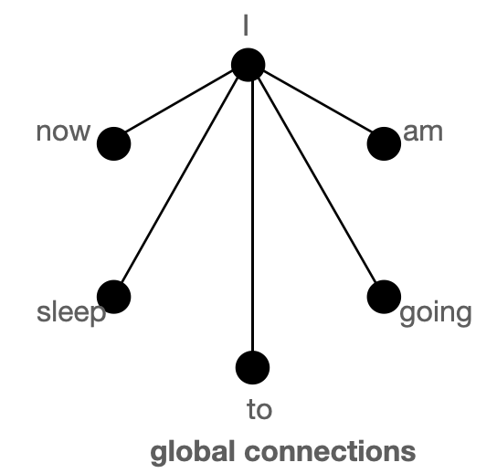
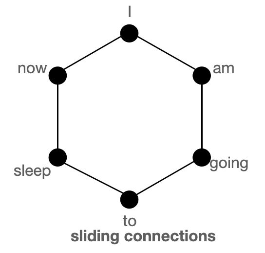
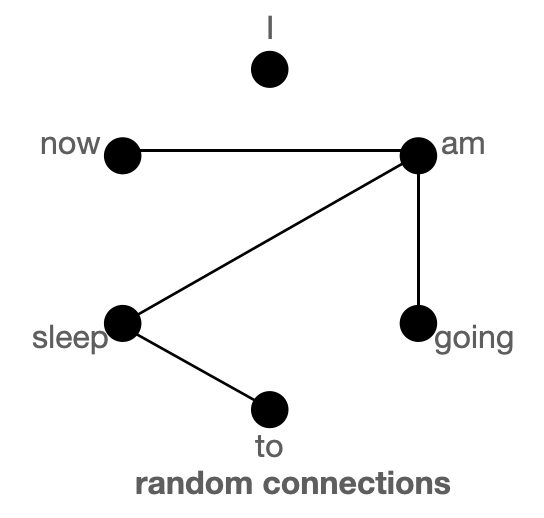 <br>

*The above figure shows `global` (left), `sliding` (middle) & `random` (right) connections respectively as a graph. Each node corresponds to a token and each line represents an attention score. If no connection is made between 2 tokens, then an attention score is assumed to 0.*

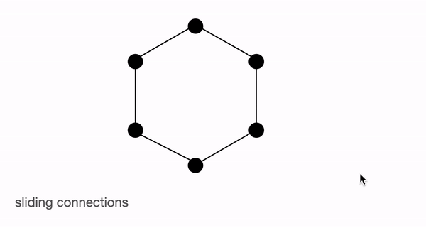
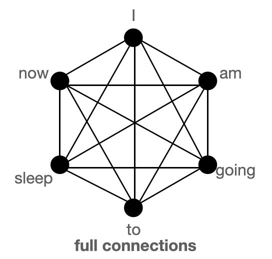

**BigBird block sparse attention** is a combination of sliding, global & random connections (total 10 connections) as shown in `gif` in left. While a graph of **normal attention** (right) will have all 15 connections (note: total 6 nodes are present). You can simply think of normal attention as all the tokens attending globally \\( {}^1 \\).

**Normal attention:** Model can transfer information from one token to another token directly in a single layer since each token is queried over every other token and is attended by every other token. Let's consider an example similar to what is shown in the above figures. If the model needs to associate *'going'* with *'now'*, it can simply do that in a single layer since there is a direct connection joining both the tokens.

**Block sparse attention:** If the model needs to share information between two nodes (or tokens), information will have to travel across various other nodes in the path for some of the tokens; since all the nodes are not directly connected in a single layer.
*Eg.*, assuming model needs to associate *'going'* with *'now'*, then if only sliding attention is present the flow of information among those 2 tokens, is defined by the path: `going -> am -> i -> now` (i.e. it will have to travel over 2 other tokens). Hence, we may need multiple layers to capture the entire information of the sequence. Normal attention can capture this in a single layer. In an extreme case, this could mean that as many layers as input tokens are needed. If, however, we introduce some global tokens information can travel via the path: `going -> i -> now` (which is shorter). If we in addition introduce random connections it can travel via: `going -> am -> now`. With the help of random connections & global connections, information can travel very rapidly (with just a few layers) from one token to the next.

In case, we have many global tokens, then we may not need random connections since there will be multiple short paths through which information can travel. This is the idea behind keeping `num_random_tokens = 0` when working with a variant of BigBird, called ETC (more on this in later sections).


\\( {}^1 \\) In these graphics, we are assuming that the attention matrix is symmetric **i.e.** \\(\mathbf{A}_{ij} = \mathbf{A}_{ji}\\) since in a graph if some token **A** attends **B**, then **B** will also attend **A**. You can see from the figure of the attention matrix shown in the next section that this assumption holds for most tokens in BigBird

| Attention Type  | `global_tokens`   | `sliding_tokens` | `random_tokens`                    |
|-----------------|-------------------|------------------|------------------------------------|
| `original_full` | `n`               | 0                | 0                                  |
| `block_sparse`  | 2 x `block_size`  | 3 x `block_size` | `num_random_blocks` x `block_size` |

*`original_full` represents `BERT`'s attention while `block_sparse` represents `BigBird`'s attention. Wondering what the `block_size` is? We will cover that in later sections. For now, consider it to be 1 for simplicity*

## BigBird block sparse attention

BigBird block sparse attention is just an efficient implementation of what we discussed above. Each token is attending some **global tokens**, **sliding tokens**, & **random tokens** instead of attending to **all** other tokens. The authors hardcoded the attention matrix for multiple query components separately; and used a cool trick to speed up training/inference on GPU and TPU.

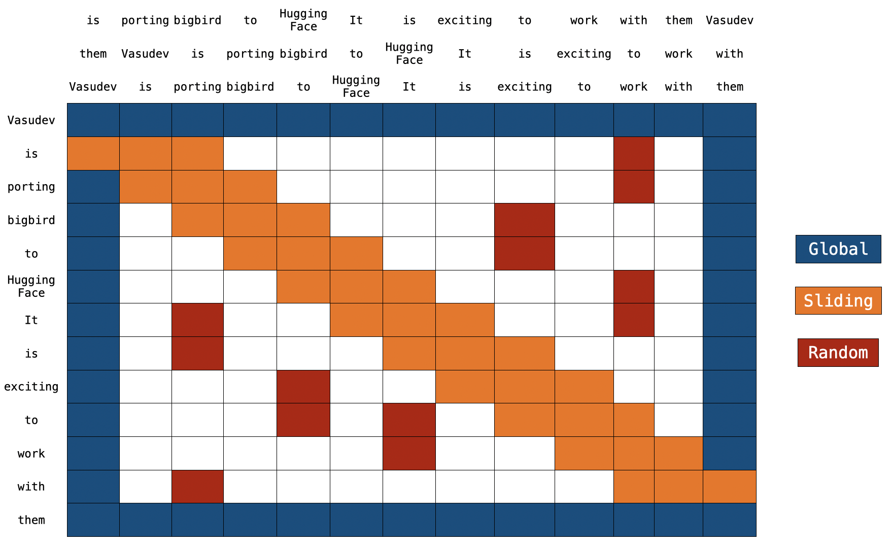
*Note: on the top, we have 2 extra sentences. As you can notice, every token is just switched by one place in both sentences. This is how sliding attention is implemented. When `q[i]` is multiplied with `k[i,0:3]`, we will get a sliding attention score for `q[i]` (where `i` is index of element in sequence).*

You can find the actual implementation of `block_sparse` attention [here](https://github.com/vasudevgupta7/transformers/blob/5f2d6a0c93ca2017961199aa04a344b9b779d454/src/transformers/models/big_bird/modeling_big_bird.py#L513). This may look very scary 😨😨 now. But this article will surely ease your life in understanding the code.

### Global Attention

For global attention, each query is simply attending to all the other tokens in the sequence & is attended by every other token. Let's assume `Vasudev` (1st token) & `them` (last token) to be global (in the above figure). You can see that these tokens are directly connected to all other tokens (blue boxes).

```python
# pseudo code

Q -> Query martix (seq_length, head_dim)
K -> Key matrix (seq_length, head_dim)

# 1st & last token attends all other tokens
Q[0] x [K[0], K[1], K[2], ......, K[n-1]]
Q[n-1] x [K[0], K[1], K[2], ......, K[n-1]]

# 1st & last token getting attended by all other tokens
K[0] x [Q[0], Q[1], Q[2], ......, Q[n-1]]
K[n-1] x [Q[0], Q[1], Q[2], ......, Q[n-1]]
```

### Sliding Attention

The sequence of key tokens is copied 2 times with each element shifted to the right in one of the copies and to the left in the other copy. Now if we multiply query sequence vectors by these 3 sequence vectors, we will cover all the sliding tokens. Computational complexity is simply `O(3xn) = O(n)`. Referring to the above picture, the orange boxes represent the sliding attention. You can see 3 sequences at the top of the figure with 2 of them shifted by one token (1 to the left, 1 to the right).

```python
# what we want to do
Q[i] x [K[i-1], K[i], K[i+1]] for i = 1:-1

# efficient implementation in code (assume dot product multiplication 👇)
[Q[0], Q[1], Q[2], ......, Q[n-2], Q[n-1]] x [K[1], K[2], K[3], ......, K[n-1], K[0]]
[Q[0], Q[1], Q[2], ......, Q[n-1]] x [K[n-1], K[0], K[1], ......, K[n-2]]
[Q[0], Q[1], Q[2], ......, Q[n-1]] x [K[0], K[1], K[2], ......, K[n-1]]

# Each sequence is getting multiplied by only 3 sequences to keep `window_size = 3`.
# Some computations might be missing; this is just a rough idea.
```

### Random Attention

Random attention is ensuring that each query token will attend a few random tokens as well. For the actual implementation, this means that the model gathers some tokens randomly and computes their attention score.

```python
# r1, r2, r are some random indices; Note: r1, r2, r3 are different for each row 👇
Q[1] x [Q[r1], Q[r2], ......, Q[r]]
.
.
.
Q[n-2] x [Q[r1], Q[r2], ......, Q[r]]

# leaving 0th & (n-1)th token since they are already global
```

**Note:** The current implementation further divides sequence into blocks & each notation is defined w.r.to block instead of tokens. Let's discuss this in more detail in the next section.

### Implementation

**Recap:** In regular BERT attention, a sequence of tokens i.e. \\( X = x_1, x_2, ...., x_n \\) is projected through a dense layer into \\( Q,K,V \\) and the attention score \\( Z \\) is calculated as \\( Z=Softmax(QK^T) \\). In the case of BigBird block sparse attention, the same algorithm is used but only with some selected query & key vectors.

Let's have a look at how bigbird block sparse attention is implemented. To begin with, let's assume \\(b, r, s, g\\) represent `block_size`, `num_random_blocks`, `num_sliding_blocks`, `num_global_blocks`, respectively. Visually, we can illustrate the components of big bird's block sparse attention with \\(b=4, r=1, g=2, s=3, d=5\\) as follows:

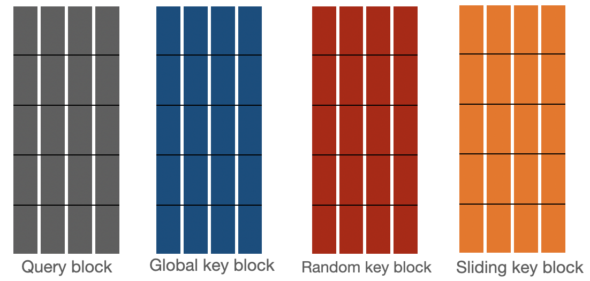

Attention scores for \\({q}_{1}, {q}_{2}, {q}_{3:n-2}, {q}_{n-1}, {q}_{n}\\) are calculated seperately as described below:

---

Attention score for \\(\mathbf{q}_{1}\\) represented by \\(a_1\\) where \\(a_1=Softmax(q_1 * K^T)\\), is nothing but attention score between all the tokens in 1st block with all the other tokens in the sequence.

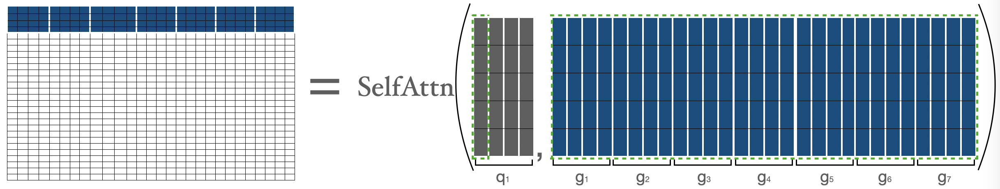
\\(q_1\\) represents 1st block, \\(g_i\\) represents \\(i\\) block. We are simply performing normal attention operation between \\(q_1\\) & \\(g\\) (i.e. all the keys).

---

For calculating attention score for tokens in second block, we are gathering the first three blocks, the last block, and the fifth block. Then we can compute \\(a_2 = Softmax(q_2 * concat(k_1, k_2, k_3, k_5, k_7)\\).

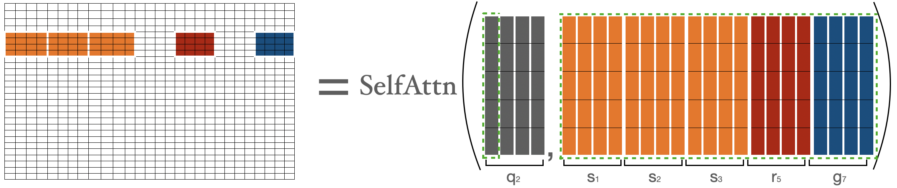

*I am representing tokens by \\(g, r, s\\) just to represent their nature explicitly (i.e. showing global, random, sliding tokens), else they are \\(k\\) only.*

---

For calculating attention score for \\({q}_{3:n-2}\\), we will gather global, sliding, random keys & will compute the normal attention operation over \\({q}_{3:n-2}\\) and the gathered keys. Note that sliding keys are gathered using the special shifting trick as discussed earlier in the sliding attention section.

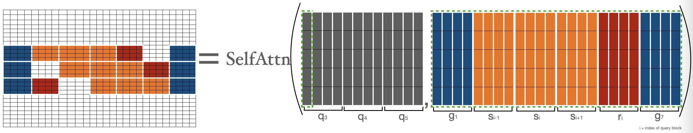

---

For calculating attention score for tokens in previous to last block (i.e. \\({q}_{n-1}\\)), we are gathering the first block, last three blocks, and the third block. Then we can apply the formula \\({a}_{n-1} = Softmax({q}_{n-1} * concat(k_1, k_3, k_5, k_6, k_7))\\). This is very similar to what we did for \\(q_2\\).

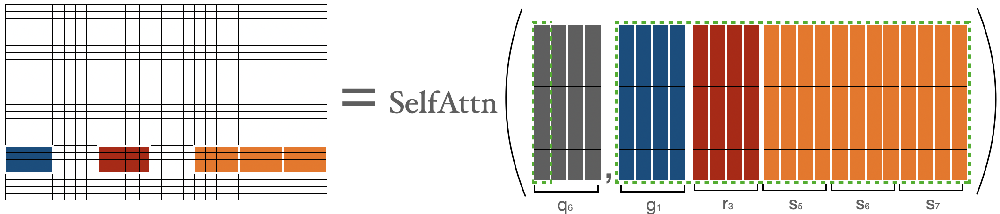

---

Attention score for \\(\mathbf{q}_{n}\\) is represented by \\(a_n\\) where \\(a_n=Softmax(q_n * K^T)\\), and is nothing but attention score between all the tokens in the last block with all the other tokens in sequence. This is very similar to what we did for \\( q_1 \\) .

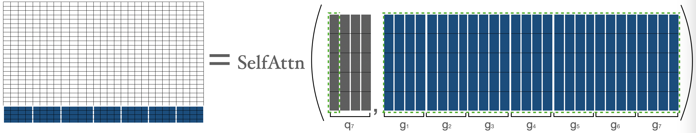

---

Let's combine the above matrices to get the final attention matrix. This attention matrix can be used to get a representation of all the tokens.

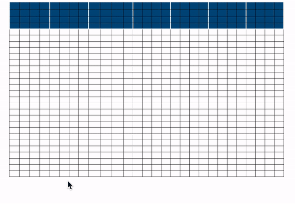

*`blue -> global blocks`, `red -> random blocks`, `orange -> sliding blocks` This attention matrix is just for illustration. During the forward pass, we aren't storing `white` blocks, but are computing a weighted value matrix (i.e. representation of each token) directly for each separated components as discussed above.*


Now, we have covered the hardest part of block sparse attention, i.e. its implementation. Hopefully, you now have a better background to understand the actual code. Feel free to dive into it and to connect each part of the code with one of the components above.

## Time & Memory complexity

| Attention Type  | Sequence length | Time & Memory Complexity |
|-----------------|-----------------|--------------------------|
| `original_full` | 512             | `T`                      |
|                 | 1024            | 4 x `T`                  |
|                 | 4096            | 64 x `T`                 |
| `block_sparse`  | 1024            | 2 x `T`                  |
|                 | 4096            | 8 x `T`                  |

*Comparison of time & space complexity of BERT attention and BigBird block sparse attention.*

<details>

<summary>Expand this snippet in case you wanna see the calculations</summary>

```md
BigBird time complexity = O(w x n + r x n + g x n)
BERT time complexity = O(n^2)

Assumptions:
    w = 3 x 64
    r = 3 x 64
    g = 2 x 64

When seqlen = 512
=> **time complexity in BERT = 512^2**

When seqlen = 1024
=> time complexity in BERT = (2 x 512)^2
=> **time complexity in BERT = 4 x 512^2**

=> time complexity in BigBird = (8 x 64) x (2 x 512)
=> **time complexity in BigBird = 2 x 512^2**

When seqlen = 4096
=> time complexity in BERT = (8 x 512)^2
=> **time complexity in BERT = 64 x 512^2**

=> compute in BigBird = (8 x 64) x (8 x 512)
=> compute in BigBird = 8 x (512 x 512)
=> **time complexity in BigBird = 8 x 512^2**
```

</details>

## ITC vs ETC

The BigBird model can be trained using 2 different strategies: **ITC** & **ETC**. ITC (internal transformer construction) is simply what we discussed above. In ETC (extended transformer construction), some additional tokens are made global such that they will attend to / will be attended by all tokens.

ITC requires less compute since very few tokens are global while at the same time the model can capture sufficient global information (also with the help of random attention). On the other hand, ETC can be very helpful for tasks in which we need a lot of global tokens such as `question-answering for which the entire question should be attended to globally by the context to be able to relate the context correctly to the question.

***Note:** It is shown in the Big Bird paper that in many ETC experiments, the number of random blocks is set to 0. This is reasonable given our discussions above in the graph section.*

The table below summarizes ITC & ETC:

|                                              | ITC                                   | ETC                                  |
|----------------------------------------------|---------------------------------------|--------------------------------------|
| Attention Matrix with global attention       | \\( A = \begin{bmatrix} 1 & 1 & 1 & 1 & 1 & 1 & 1 \\ 1 & & & & & & 1 \\ 1 & & & & & & 1 \\ 1 & & & & & & 1 \\ 1 & & & & & & 1 \\ 1 & & & & & & 1 \\ 1 & 1 & 1 & 1 & 1 & 1 & 1 \end{bmatrix} \\) | \\( B = \begin{bmatrix} 1 & 1 & 1 & 1 & 1 & 1 & 1 & 1 & 1 \\ 1 & 1 & 1 & 1 & 1 & 1 & 1 & 1 & 1 \\ 1 & 1 & 1 & 1 & 1 & 1 & 1 & 1 & 1 \\ 1 & 1 & 1 & & & & & & 1 \\ 1 & 1 & 1 & & & & & & 1 \\ 1 & 1 & 1 & & & & & & 1 \\ 1 & 1 & 1 & & & & & & 1 \\ 1 & 1 & 1 & & & & & & 1 \\ 1 & 1 & 1 & 1 & 1 & 1 & 1 & 1 & 1 \end{bmatrix} \\) |
| `global_tokens`   | 2 x `block_size`                      | `extra_tokens` + 2 x `block_size`     |
| `random_tokens`   | `num_random_blocks` x `block_size`    | `num_random_blocks` x `block_size`    |
| `sliding_tokens`  | 3 x `block_size`                      | 3 x `block_size`                      |

## Using BigBird with 🤗Transformers

You can use `BigBirdModel` just like any other 🤗 model. Let's see some code below:

```python
from transformers import BigBirdModel

# loading bigbird from its pretrained checkpoint
model = BigBirdModel.from_pretrained("google/bigbird-roberta-base")
# This will init the model with default configuration i.e. attention_type = "block_sparse" num_random_blocks = 3, block_size = 64.
# But You can freely change these arguments with any checkpoint. These 3 arguments will just change the number of tokens each query token is going to attend.
model = BigBirdModel.from_pretrained("google/bigbird-roberta-base", num_random_blocks=2, block_size=16)

# By setting attention_type to `original_full`, BigBird will be relying on the full attention of n^2 complexity. This way BigBird is 99.9 % similar to BERT.
model = BigBirdModel.from_pretrained("google/bigbird-roberta-base", attention_type="original_full")
```

There are total **3 checkpoints** available in **🤗Hub** (at the point of writing this article): [`bigbird-roberta-base`](https://huggingface.co/google/bigbird-roberta-base), [`bigbird-roberta-large`](https://huggingface.co/google/bigbird-roberta-large), [`bigbird-base-trivia-itc`](https://huggingface.co/google/bigbird-base-trivia-itc). The first two checkpoints come from pretraining `BigBirdForPretraining` with `masked_lm loss`; while the last one corresponds to the checkpoint after finetuning `BigBirdForQuestionAnswering` on `trivia-qa` dataset.

Let's have a look at minimal code you can write (in case you like to use your PyTorch trainer), to use 🤗's BigBird model for fine-tuning your tasks.

```python
# let's consider our task to be question-answering as an example

from transformers import BigBirdForQuestionAnswering, BigBirdTokenizer
import torch

device = torch.device("cpu")
if torch.cuda.is_available():
    device = torch.device("cuda")

# lets initialize bigbird model from pretrained weights with randomly initialized head on its top
model = BigBirdForQuestionAnswering.from_pretrained("google/bigbird-roberta-base", block_size=64, num_random_blocks=3)
tokenizer = BigBirdTokenizer.from_pretrained("google/bigbird-roberta-base")
model.to(device)

dataset = "torch.utils.data.DataLoader object"
optimizer = "torch.optim object"
epochs = ...

# very minimal training loop
for e in range(epochs):
    for batch in dataset:
        model.train()
        batch = {k: batch[k].to(device) for k in batch}

        # forward pass
        output = model(**batch)

        # back-propogation
        output["loss"].backward()
        optimizer.step()
        optimizer.zero_grad()

# let's save final weights in a local directory
model.save_pretrained("<YOUR-WEIGHTS-DIR>")

# let's push our weights to 🤗Hub
from huggingface_hub import ModelHubMixin
ModelHubMixin.push_to_hub("<YOUR-WEIGHTS-DIR>", model_id="<YOUR-FINETUNED-ID>")

# using finetuned model for inference
question = ["How are you doing?", "How is life going?"]
context = ["<some big context having ans-1>", "<some big context having ans-2>"]
batch = tokenizer(question, context, return_tensors="pt")
batch = {k: batch[k].to(device) for k in batch}

model = BigBirdForQuestionAnswering.from_pretrained("<YOUR-FINETUNED-ID>")
model.to(device)
with torch.no_grad():
    start_logits, end_logits = model(**batch).to_tuple()
    # now decode start_logits, end_logits with what ever strategy you want.

# Note:
# This was very minimal code (in case you want to use raw PyTorch) just for showing how BigBird can be used very easily
# I would suggest using 🤗Trainer to have access for a lot of features
```

It's important to keep the following points in mind while working with big bird:

* Sequence length must be a multiple of block size i.e. `seqlen % block_size = 0`. You need not worry since 🤗Transformers will automatically `<pad>` (to smallest multiple of block size which is greater than sequence length) if batch sequence length is not a multiple of `block_size`.
* Currently, HuggingFace version **doesn't support ETC** and hence only 1st & last block will be global.
* Current implementation doesn't support `num_random_blocks = 0`.
* It's recommended by authors to set `attention_type = "original_full"` when sequence length < 1024.
* This must hold: `seq_length > global_token + random_tokens + sliding_tokens + buffer_tokens` where `global_tokens = 2 x block_size`, `sliding_tokens = 3 x block_size`, `random_tokens = num_random_blocks x block_size` & `buffer_tokens = num_random_blocks x block_size`. In case you fail to do that, 🤗Transformers will automatically switch `attention_type` to `original_full` with a warning.
* When using big bird as decoder (or using `BigBirdForCasualLM`), `attention_type` should be `original_full`. But you need not worry, 🤗Transformers will automatically switch `attention_type` to `original_full` in case you forget to do that.

## What's next?

[@patrickvonplaten](https://github.com/patrickvonplaten) has made a really cool [notebook](https://colab.research.google.com/github/patrickvonplaten/notebooks/blob/master/Evaluating_Big_Bird_on_TriviaQA.ipynb) on how to evaluate `BigBirdForQuestionAnswering` on the `trivia-qa` dataset. Feel free to play with BigBird using that notebook.

You will soon find **BigBird Pegasus-like** model in the library for **long document summarization**💥.

## End Notes

The original implementation of **block sparse attention matrix** can be found [here](https://github.com/google-research/bigbird/blob/master/bigbird/core/attention.py). You can find 🤗's version [here](https://github.com/huggingface/transformers/tree/master/src/transformers/models/big_bird).
