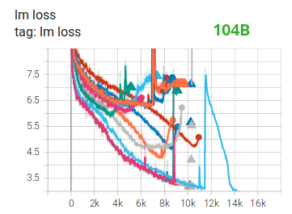

# The Technology Behind BLOOM Training

This article will start by thanking companies and key people and groups that made the amazing feat of training a 176 Billion parameter model by a small group of dedicated people possible.

Then the hardware setup and main technological components will be discussed.


## People

The project was conceived by Thomas Wolf, who dared to compete with the huge corporations not only to train one of the biggest multilingual models, but also to make the final result accessible to all people, thus making what was but a dream to most people a reality.

This article focuses specifically on the engineering side of the project.

The most important part of the technology behind BLOOM were the people and companies who helped us with the training.

There are 6 groups of people to thank:

1. The HuggingFace's BigScience team who dedicated more than half a dozen full time employees to figure out and run the training from inception to the finishing line and provided and paid for all the infrastructure beyond the JeanZay's compute.
2. The Microsoft Deepspeed team, who developed DeepSpeed and later integrated it with Megatron-LM, and whose developers spent many weeks working on the needs of the project and provided lots of awesome practical experiential advice before and during the training
3. The NVIDIA Megatron-LM team, who developed Megatron-LM and who were super-helpful answering our numerous questions and providing first class experiential advice.
4. The IDRIS / GENCI team managing the JeanZay supercomputer, who donating to the project an insane amount of compute and a great system administration support
5. The PyTorch team who created a super powerful framework, on which the rest of the software was based, and who were very supportive to us during the preparation for the training, fixing multiple bugs and improving the usability of the PyTorch components we relied on during the training.
6. All the BigScience volunteers in various groups.

It'd be very difficult to name all the amazing people who contributed to the engineering side of the project, so I will just name a few key people outside of HuggingFace who were the engineering foundation of this project for the last 14 months:

Olatunji Ruwase, Deepak Narayanan, Jeff Rasley, Jared Casper and Rémi Lacroix

Also we are grateful to all the companies who allowed their employees to contribute to this project.

## Overview

BLOOM's architecture is very similar to [GPT3](https://en.wikipedia.org/wiki/GPT-3) with a few improvements as will be discussed in this article.

The following hardware was used during the training:

- GPUs: 384 A100 80GB GPUs (48 nodes)
- 8 GPUs per node Using NVLink 4 inter-gpu connects, 4 OmniPath links
- CPU: AMD
- CPU memory: 512GB per node
- GPU memory: 640GB per node
- Inter-node connect: Omni-Path Architecture (OPA)
- NCCL-communications network: a fully dedicated subnet
- Disc IO network: shared network with other types of nodes

Important links:

- [tensorboard](https://huggingface.co/bigscience/tr11-176B-ml-logs/tensorboard)
- [training slurm script](https://github.com/bigscience-workshop/bigscience/blob/master/train/tr11-176B-ml/tr11-176B-ml.slurm)

Checkpoints:

- [main checkpoints](https://huggingface.co/bigscience/bloom)
- each checkpoint with fp32 optim states and bf16+fp32 weights is 2.3TB - just the bf16 weights are 329GB.

Datasets:

- 46 Languages in 1.5TB of deduplicated massively cleaned up text, converted into 350B unique tokens
- Vocabulary size is 250,680 tokens
- For full details please see [The BigScience Corpus A 1.6TB Composite Multilingual Dataset](https://openreview.net/forum?id=UoEw6KigkUn)

The training of the model took about 3.5 months.

## Megatron-Deepspeed

The 176B BLOOM model has been trained using [Megatron-Deepspeed](https://github.com/bigscience-workshop/Megatron-DeepSpeed), which is a combination of 2 main technologies:

* [Megatron-LM](https://github.com/NVIDIA/Megatron-LM)
* [DeepSpeed](https://github.com/microsoft/DeepSpeed)

The DeepSpeed team extended the Megatron-LM framework to support its ZeRO sharding protocol and their Pipeline Parallelism implementation. Thus Megatron-Deepspeed was born.

Megatron-Deepspeed implements 3D Parallelism to allow huge models to train in a very efficient way. Let’s briefly discuss the 3D components.

1. **DataParallel (DP)** - the same setup is replicated multiple times, and each being fed a slice of the data. The processing is done in parallel and all setups are synchronized at the end of each training step.
2. **TensorParallel (TP)** - each tensor is split up into multiple chunks, so instead of having the whole tensor reside on a single gpu, each shard of the tensor resides on its designated gpu. During processing each shard gets processed separately and in parallel on different GPUs and the results are synced at the end of the step. This is what one may call horizontal parallelism, as the splitting happens on horizontal level.
3. **PipelineParallel (PP)** - the model is split up vertically (layer-level) across multiple GPUs, so that only one or several layers of the model are places on a single gpu. Each gpu processes in parallel different stages of the pipeline and working on a small chunk of the batch.
4. **Zero Redundancy Optimizer (ZeRO)** - Also performs sharding of the tensors somewhat similar to TP, except the whole tensor gets reconstructed in time for a forward or backward computation, therefore the model doesn't need to be modified. It also supports various offloading techniques to compensate for limited GPU memory.

## Data Parallelism

Most users with just 2 GPUs are likely to be familiar with `DistributedDataParallel` (DDP)  [PyTorch documentation](https://pytorch.org/docs/master/generated/torch.nn.parallel.DistributedDataParallel.html#torch.nn.parallel.DistributedDataParallel)


## ZeRO Data Parallelism

ZeRO-powered data parallelism (ZeRO-DP) is described on the following diagram from this [blog post](https://www.microsoft.com/en-us/research/blog/zero-deepspeed-new-system-optimizations-enable-training-models-with-over-100-billion-parameters/)


It can be difficult to wrap one's head around it, but in reality the concept is quite simple. This is just the usual DDP, except, instead of replicating the full model params, gradients and optimizer states, each GPU stores only a slice of it.  And then at run-time when the full layer params are needed just for the given layer, all GPUs synchronize to give each other parts that they miss - this is it.

This component is implemented by DeepSpeed.

## Tensor Parallelism

In Tensor Parallelism (TP) each GPU processes only a slice of a tensor and only aggregates the full tensor for operations that require the whole thing.

In this section we use concepts and diagrams from the [Megatron-LM](https://github.com/NVIDIA/Megatron-LM) paper: [Efficient Large-Scale Language Model Training on GPU Clusters](https://arxiv.org/abs/2104.04473).

The main building block of any transformer is a fully connected `nn.Linear` followed by a nonlinear activation `GeLU`.

Following the Megatron's paper notation, we can write the dot-product part of it as `Y = GeLU(XA)`, where `X` and `Y` are the input and output vectors, and `A` is the weight matrix.

If we look at the computation in matrix form, it's easy to see how the matrix multiplication can be split between multiple GPUs:


If we split the weight matrix `A` column-wise across `N` GPUs and perform matrix multiplications `XA_1` through `XA_n` in parallel, then we will end up with `N` output vectors `Y_1, Y_2, ..., Y_n` which can be fed into `GeLU` independently:
. Notice with the Y matrix split along the columns, we can split the second GEMM along its rows so that it takes the output of the GeLU directly without any extra communication.

Using this principle, we can update an MLP of arbitrary depth, without the need for any synchronization between GPUs until the very end, where we need to reconstruct the output vector from shards using an all reduce. The Megatron-LM paper authors provide a helpful illustration for that:


Here `f` is an identity operator in the forward pass and all reduce in the backward pass while `g` is an all reduce in the forward pass and identity in the backward pass.

Parallelizing the multi-headed attention layers is even simpler, since they are already inherently parallel, due to having multiple independent heads!


Special considerations: Due to the two all reduces per layer in both the forward and backward passes, TP requires a very fast interconnect between devices. Therefore it's not advisable to do TP across more than one node. Practically, if a node has 4 GPUs, the highest TP degree is therefore 4. If you need a TP degree of 8, you need to use nodes that have at least 8 GPUs.

This component is implemented by Megatron-LM. Megatron-LM has recently expanded tensor parallelism to include sequence parallelism that splits the operations that cannot be split as above, such as LayerNorm, along the sequence dimension. The paper [Reducing Activation Recomputation in Large Transformer Models](https://arxiv.org/abs/2205.05198) provides details for this technique. Sequence parallelism was developed after BLOOM was trained so not used in the BLOOM training.


## Pipeline Parallelism

Naive Pipeline Parallelism (PP) is where one spreads groups of model layers across multiple GPUs and simply moves data along from gpu to gpu as if it were one large composite GPU. The mechanism is relatively simple - switch the desired layers `.to()` the desired devices and now whenever the data goes in and out those layers switch the data to the same device as the layer and leave the rest unmodified.

This performs a vertical model parallelism, because if you remember how most models are drawn, we slice the layers vertically. For example, if the following diagram shows an 8-layer model:

```
===================  ===================
|  0 | 1 | 2 | 3  |  |  4 | 5 | 6 | 7  |
===================  ===================
        gpu0                 gpu1
```
we just sliced it in 2 vertically, placing layers 0-3 onto GPU0 and 4-7 to GPU1.

Now while data travels from layer 0 to 1, 1 to 2 and 2 to 3 this is just the normal model. But when data needs to pass from layer 3 to layer 4 it needs to travel from GPU0 to GPU1 which introduces a communication overhead. If the participating GPUs are on the same compute node (e.g. same physical machine) this copying is pretty fast, but if the GPUs are located on different compute nodes (e.g. multiple machines) the communication overhead could be significantly larger.

Then layers 4 to 5 to 6 to 7 are as a normal model would have and when the 7th layer completes we often need to send the data back to layer 0 where the labels are (or alternatively send the labels to the last layer). Now the loss can be computed and the optimizer can do its work.

Problems:
- the main deficiency and why this one is called "naive" PP, is that all but one GPU is idle at any given moment. So if 4 GPUs are used, it's almost identical to quadrupling the amount of memory of a single GPU, and ignoring the rest of the hardware. Plus there is the overhead of copying the data between devices. So 4x 6GB cards will be able to accommodate the same size as 1x 24GB card using naive PP, except the latter will complete the training faster, since it doesn't have the data copying overhead. But, say, if you have 40GB cards and need to fit a 45GB model you can with 4x 40GB cards (but barely because of the gradient and optimizer states)
- shared embeddings may need to get copied back and forth between GPUs.

Pipeline Parallelism (PP) is almost identical to a naive PP, but it solves the GPU idling problem, by chunking the incoming batch into micro-batches and artificially creating a pipeline, which allows different GPUs to concurrently participate in the computation process.

The following illustration from the [GPipe paper](https://ai.googleblog.com/2019/03/introducing-gpipe-open-source-library.html) shows the naive PP on the top, and PP on the bottom:


It's easy to see from the bottom diagram how PP has less dead zones, where GPUs are idle. The idle parts are referred to as the "bubble".

Both parts of the diagram show a parallelism that is of degree 4. That is 4 GPUs are participating in the pipeline. So there is the forward path of 4 pipe stages F0, F1, F2 and F3 and then the return reverse order backward path of B3, B2, B1 and B0.

PP introduces a new hyper-parameter to tune and it's `chunks` which defines how many chunks of data are sent in a sequence through the same pipe stage. For example, in the bottom diagram you can see that `chunks=4`. GPU0 performs the same forward path on chunk 0, 1, 2 and 3 (F0,0, F0,1, F0,2, F0,3) and then it waits for other GPUs to do their work and only when their work is starting to be complete, GPU0 starts to work again doing the backward path for chunks 3, 2, 1 and 0 (B0,3, B0,2, B0,1, B0,0).

Note that conceptually this is the same concept as gradient accumulation steps (GAS). Pytorch uses `chunks`, whereas DeepSpeed refers to the same hyper-parameter as GAS.

Because of the chunks, PP introduces the concept of micro-batches (MBS). DP splits the global data batch size into mini-batches, so if you have a DP degree of 4, a global batch size of 1024 gets split up into 4 mini-batches of 256 each (1024/4). And if the number of `chunks` (or GAS) is 32 we end up with a micro-batch size of 8 (256/32). Each Pipeline stage works with a single micro-batch at a time.

To calculate the global batch size of the DP + PP setup we then do: `mbs*chunks*dp_degree` (`8*32*4=1024`).

Let's go back to the diagram.

With `chunks=1` you end up with the naive PP, which is very inefficient. With a very large `chunks` value you end up with tiny micro-batch sizes which could be not every efficient either. So one has to experiment to find the value that leads to the highest efficient utilization of the gpus.

While the diagram shows that there is a bubble of "dead" time that can't be parallelized because the last `forward` stage has to wait for `backward` to complete the pipeline, the purpose of finding the best value for `chunks` is to enable a high concurrent GPU utilization across all participating GPUs which translates to minimizing the size of the bubble.

This scheduling mechanism is known as `all forward all backward`. Some other alternatives are [one forward one backward](https://www.microsoft.com/en-us/research/publication/pipedream-generalized-pipeline-parallelism-for-dnn-training/) and [interleaved one forward one backward](https://arxiv.org/abs/2104.04473).

While both Megatron-LM and DeepSpeed have their own implementation of the PP protocol, Megatron-Deepspeed uses the Deepspeed implementation as it's integrated with other aspects of Deepspeed.


## DP+PP

The following diagram from the DeepSpeed [pipeline tutorial](https://www.deepspeed.ai/tutorials/pipeline/) demonstrates how one combines DP with PP.


Here it's important to see how DP rank 0 doesn't see GPU2 and DP rank 1 doesn't see GPU3. To DP there is just GPUs 0 and 1 where it feeds data as if there were just 2 GPUs. GPU0 "secretly" offloads some of its load to GPU2 using PP. And GPU1 does the same by enlisting GPU3 to its aid.

Since each dimension requires at least 2 GPUs, here you'd need at least 4 GPUs.

## DP+PP+TP

To get an even more efficient training a 3D parallelism is used where PP is combined with TP and DP. This can be seen in the following diagram.


This diagram is from a blog post [3D parallelism: Scaling to trillion-parameter models](https://www.microsoft.com/en-us/research/blog/deepspeed-extreme-scale-model-training-for-everyone/), which is a good read as well.

Since each dimension requires at least 2 GPUs, here you'd need at least 8 GPUs.

## ZeRO DP+PP+TP

One of the main features of DeepSpeed is ZeRO, which is a super-scalable extension of DP. It has already been discussed in [ZeRO Data Parallelism](#zero-data-parallelism). Normally it's a standalone feature that doesn't require PP or TP. But it can be combined with PP and TP.

When ZeRO-DP is combined with PP (and optionally TP) it typically enables only ZeRO stage 1 (optimizer sharding).

While it's theoretically possible to use ZeRO stage 2 (gradient sharding) with Pipeline Parallelism, it will have bad performance impacts. There would need to be an additional reduce-scatter collective for every micro-batch to aggregate the gradients before sharding, which adds a potentially significant communication overhead. By nature of Pipeline Parallelism, small micro-batches are used and instead the focus is on trying to balance arithmetic intensity (micro-batch size) with minimizing the Pipeline bubble (number of micro-batches). Therefore those communication costs are going to hurt.

In addition, there are already fewer layers than normal due to PP and so the memory savings won't be huge. PP already reduces gradient size by ``1/PP``, and so gradient sharding savings on top of that are less significant than pure DP.

ZeRO stage 3 is not a good choice either for the same reason - more inter-node communications required.


## BF16Optimizer

Training huge LLM models in fp16 is a no-no.

We have proved it to ourselves by spending several months [training a 104B model](https://github.com/bigscience-workshop/bigscience/tree/master/train/tr8-104B-wide) which as you can tell from the [tensorboard](https://huggingface.co/bigscience/tr8-104B-logs/tensorboard) was but a complete failure. We learned a lot of things while fighting the ever diverging lm-loss:



and we also got the same advice from the Megatron-LM and Deepspeed teams after they trained the [530B model](https://arxiv.org/abs/2201.11990).

So back in January as we knew we would be training on A100s which support the BF16 format Olatunji Ruwase developed a `BF16Optimizer` which we used to train BLOOM.

If you are not familiar with this data format, please have a look [at the bits layout]( https://en.wikipedia.org/wiki/Bfloat16_floating-point_format#bfloat16_floating-point_format). The key to BF16 format is that it has the same exponent as FP32 and thus doesn't suffer from overflow FP16 suffers from a lot! With FP16, which has a max numerical range of 64k, you can only multiply small numbers. e.g. you can do `250*250=62500`, but if you were to try `255*255=65025` you got yourself an overflow, which is what causes the main problems during training. This means your weights have to remain tiny. A technique called loss scaling can help with this problem, but the limited range of FP16 is still an issue when models become very large.

BF16 has no such problem, you can easily do `10_000*10_000=100_000_000` and it's no problem.

Of course, since BF16 and FP16 have the same size of 2 bytes, one doesn't get a free lunch and one pays with really bad precision when using BF16. However, if you remember the training using stochastic gradient descent and its variations is a sort of stumbling walk, so if you don't get the perfect direction immediately it's no problem, you will correct yourself in the next steps.

Regardless of whether one uses BF16 or FP16 there is also a copy of weights which is always in FP32 - this is what gets updated by the optimizer. So the 16-bit formats are only used for the computation, the optimizer updates the FP32 weights with full precision and then casts them into the 16-bit format for the next iteration.

All pytorch components have been updated to ensure that they perform any accumulation in FP32, so no loss happening there.

One crucial issue is gradient accumulation, and it's one of the main features of pipeline parallelism as the gradients from each microbatch processing get accumulated. It's crucial to implement gradient accumulation in FP32 to keep the training precise, and this is what `BF16Optimizer` does.

Besides other improvements we believe that using BF16 mixed precision training turned a potential nightmare into a relatively smooth process which can be observed from the following lm loss graph:


## Fused CUDA Kernels

To train BLOOM fast and efficiently it was necessary to use several custom fused CUDA kernels provided by Megatron-LM. In particular there is an optimized kernel to perform LayerNorm as well as kernels to fuse various combinations of the scaling, masking, and softmax operations. The addition of a bias term is also fused with the GeLU operation using PyTorch's JIT functionality. These operations are all memory bound, so it is important to fuse them to maximize the amount of computation done once a value has been retrieved from memory. So, for example, adding the bias term while already doing the memory bound GeLU operation adds no additional time. These kernels are all available in the [Megatron-LM repository](https://github.com/NVIDIA/Megatron-LM).


## Datasets

Another important feature from Megatron-LM is the efficient data loader. During start up of the initial training each data set is split into samples of the requested sequence length (2048 for BLOOM) and index is created to number each sample. Based on the training parameters the number of epochs for a dataset is calculated and an ordering for that many epochs is created and then shuffled. For example, if a dataset has 10 samples and should be gone through twice, the system first lays out the samples indices in order `[0, ..., 9, 0, ..., 9]` and then shuffles that order to create the final global order for the dataset. Notice that this means that training will not simply go through the entire dataset and then repeat, it is possible to see the same sample twice before seeing another sample at all, but at the end of training the model will have seen each sample twice. This helps ensure a smooth training curve through the entire training process. These indices, including the offsets into the base dataset of each sample, are saved to a file to avoid recomputing them each time a training process is started. Several of these datasets can then be blended with varying weights into the final data seen by the training process.

## Embedding LayerNorm

While we were fighting with trying to stop 104B from diverging we discovered that adding an additional LayerNorm right after the first word embedding made the training much more stable.

This insight came from experimenting with https://github.com/facebookresearch/bitsandbytes which contains a `StableEmbedding` which is a normal Embedding with layernorm and it uses a uniform xavier initialization.

## Positional Encoding

We also replaced the usual positional embedding with an AliBi - based on the paper: [Train Short, Test Long: Attention with Linear Biases Enables Input Length Extrapolation](https://arxiv.org/abs/2108.12409), which allows to extrapolate for longer input sequences than the ones the model was trained on.

## Papers

We couldn't have possibly explained everything in details in this article, so if the technology presented here piqued your curiosity and you'd like to know more here are the papers to read:

Megatron-LM:

- [Efficient Large-Scale Language Model Training on GPU Clusters](https://arxiv.org/abs/2104.04473).
- [Reducing Activation Recomputation in Large Transformer Models](https://arxiv.org/abs/2205.05198)

DeepSpeed:

- [ZeRO: Memory Optimizations Toward Training Trillion Parameter Models](https://arxiv.org/abs/1910.02054)
- [ZeRO-Offload: Democratizing Billion-Scale Model Training](https://arxiv.org/abs/2101.06840)
- [ZeRO-Infinity: Breaking the GPU Memory Wall for Extreme Scale Deep Learning](https://arxiv.org/abs/2104.07857)

Joint Megatron-LM and Deepspeeed:

- [Using DeepSpeed and Megatron to Train Megatron-Turing NLG 530B, A Large-Scale Generative Language Model](https://arxiv.org/abs/2201.11990).

ALIBI:

-  [Train Short, Test Long: Attention with Linear Biases Enables Input Length Extrapolation](https://arxiv.org/abs/2108.12409)

BitsNBytes:

- [8-bit Optimizers via Block-wise Quantization](https://arxiv.org/abs/2110.02861) (in the context of Embedding LayerNorm but the rest of the paper and the technology is amazing - the only reason were weren't using the 8-bit optimizer is because we were already saving the optimizer memory with Deepspeed-ZeRO).
