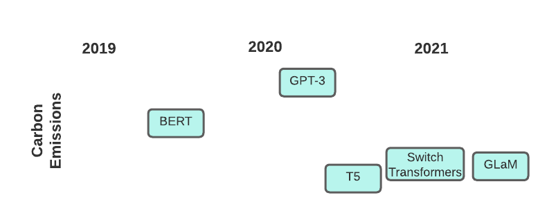
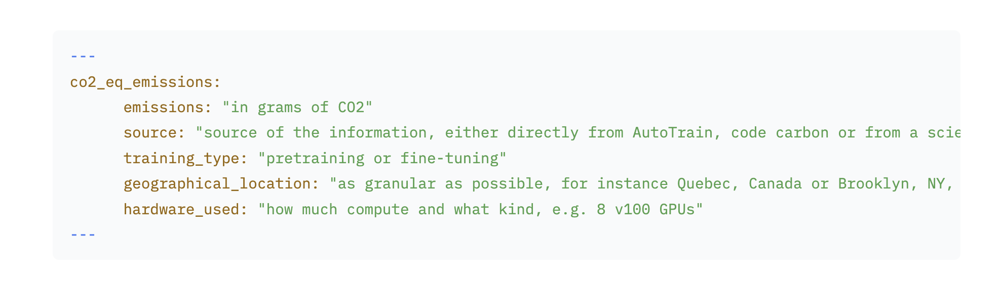

<h1> CO2 Emissions and the 🤗 Hub: Leading the Charge </h1> 

{blog_metadata}
{authors}

## What are CO2 Emissions and why are they important?

Climate change is one of the greatest challenges that we are facing and reducing emissions of greenhouse gases such as carbon dioxide (CO2) is an important part of tackling this problem. 

Training and deploying machine learning models will emit CO2 due to the energy usage of the computing infrastructures that are used: from GPUs to storage, it all needs energy to function and emits CO2 in the process.


> Pictured: Recent Transformer models and their carbon footprints

The amount of CO2 emitted depends on different factors such as runtime, hardware used, and carbon intensity of the energy source. 

Using the tools described below will help you both track and report your own emissions (which is important to improve the transparency of our field as a whole!) and choose models based on their carbon footprint. 

## How to calculate your own CO2 Emissions automatically with Transformers

Before we begin, if you do not have the latest version of the `huggingface_hub` library on your system, please run the following:


```
pip install huggingface_hub -U
```

## How to find low-emission models using the Hugging Face Hub

With the model now uploaded to the Hub, how can you search for models on the Hub while trying to be eco-friendly? Well, the `huggingface_hub` library has a new special parameter to perform this search: `emissions_threshold`. All you need to do is specify a minimum or maximum number of grams, and all models that fall within that range. 

For example, we can search for all models that took a maximum of 100 grams to make:


```python
from huggingface_hub import HfApi

api = HfApi()
models = api.list_models(emissions_thresholds=(None, 100), cardData=True)
len(models)
>>> 191
```

There were quite a few! This also helps to find smaller models, given they typically did not release as much carbon during training.

We can look at one up close to see it does fit our threshold:

```python
model = models[0]
print(f'Model Name: {model.modelId}\nCO2 Emitted during training: {model.cardData["co2_eq_emissions"]}')

>>> Model Name: esiebomajeremiah/autonlp-email-classification-657119381
    CO2 Emitted during training: 3.516233232503715
```

Similarly, we can search for a minimum value to find very large models that emitted a lot of CO2 during training:


```python
models = api.list_models(emissions_thresholds=(500, None), cardData=True)
len(models)
>>> 10
```

Now let's see exactly how much CO2 one of these emitted:

```python
model = models[0]
print(f'Model Name: {model.modelId}\nCO2 Emitted during training: {model.cardData["co2_eq_emissions"]}')

>>> Model Name: Maltehb/aelaectra-danish-electra-small-cased
    CO2 Emitted during training: 4009.5
```

That's a lot of CO2!

As you can see, in just a few lines of code we can quickly vet models we may want to use to make sure we're being environmentally cognizant! 

## How to Report Your Carbon Emissions with `transformers`

If you're using `transformers`, you can automatically track and report carbon emissions thanks to the `codecarbon` integration. If you've installed `codecarbon` on your machine, the `Trainer` object will automatically add the `CodeCarbonCallback` while training, which will store carbon emissions data for you as you train.

So, if you run something like this...


```python
from datasets import load_dataset
from transformers import AutoModelForSequenceClassification, AutoTokenizer, Trainer, TrainingArguments
​
ds = load_dataset("imdb")
model = AutoModelForSequenceClassification.from_pretrained("bert-base-cased", num_labels=2)
tokenizer = AutoTokenizer.from_pretrained("bert-base-cased")
​
def tokenize_function(examples):
    return tokenizer(examples["text"], padding="max_length", truncation=True)
​
​
small_train_dataset = ds["train"].shuffle(seed=42).select(range(1000)).map(tokenize_function, batched=True)
small_eval_dataset = ds["test"].shuffle(seed=42).select(range(1000)).map(tokenize_function, batched=True)
​
​
training_args = TrainingArguments(
    "codecarbon-text-classification",
    num_train_epochs=4,
    push_to_hub=True
)
​
trainer = Trainer(
    model=model,
    args=training_args,
    train_dataset=small_train_dataset,
    eval_dataset=small_eval_dataset,
)
​
trainer.train()
```

...you'll be left with a file within the `codecarbon-text-classification` directory called `emissions.csv`. This file will keep track of the carbon emissions across different training runs. Then, when you're ready, you can take the emissions from the run you used to train your final model and include that in its model card. 📝

An example of this data being included at the top of the model card is shown below:



For more references on the metadata format for `co2_eq_emissions ` see [the hub docs](https://huggingface.co/docs/hub/models-cards-co2).

### Further readings

- Rolnick et al. (2019) - [Tackling Climate Change with Machine Learning](https://arxiv.org/pdf/1906.05433.pdf) 
- Strubell et al. (2019) - [Energy and Policy Considerations for Deep Learning in NLP](https://arxiv.org/pdf/1906.02243.pdf)
- Schwartz et al. (2020) - [Green AI](https://dl.acm.org/doi/abs/10.1145/3381831)
