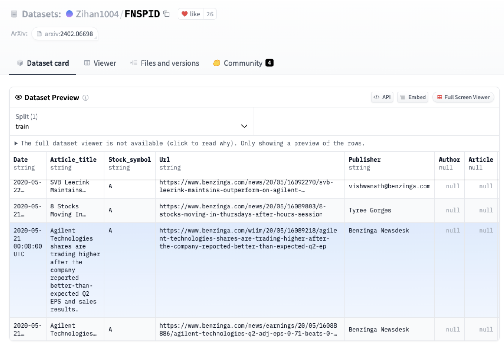
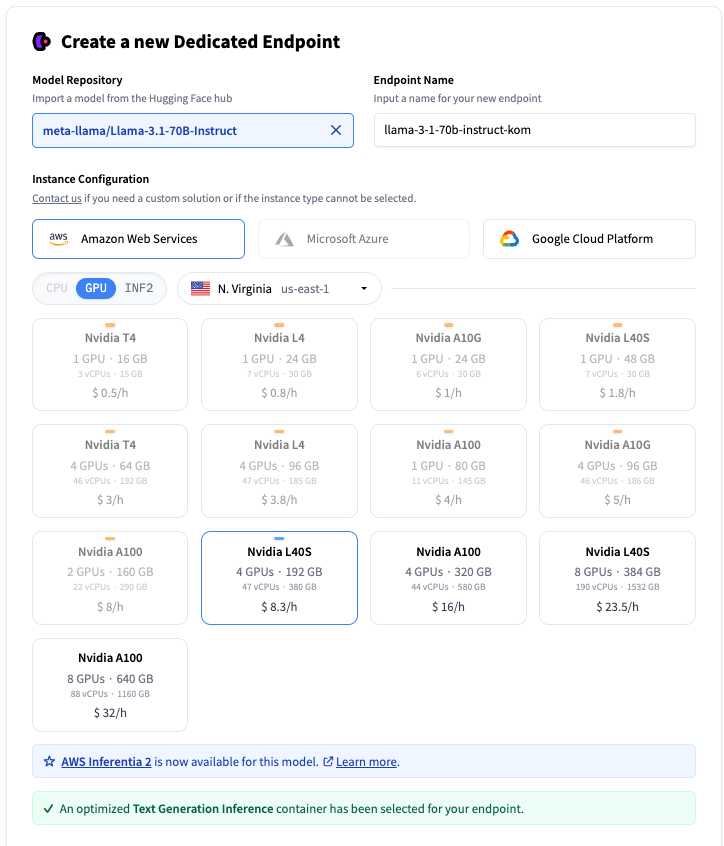
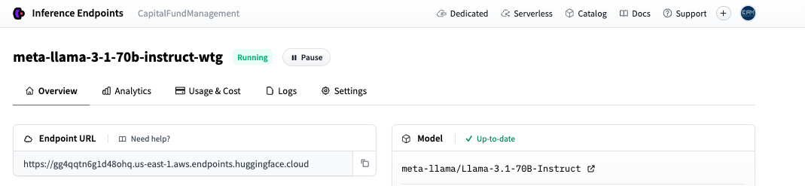
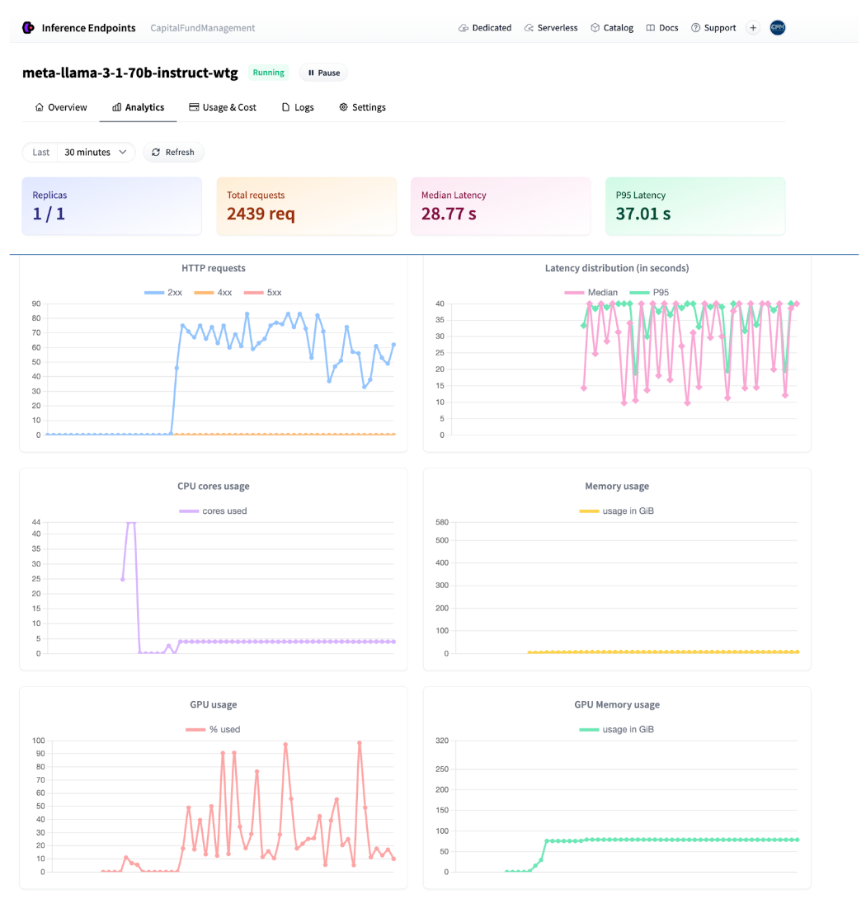
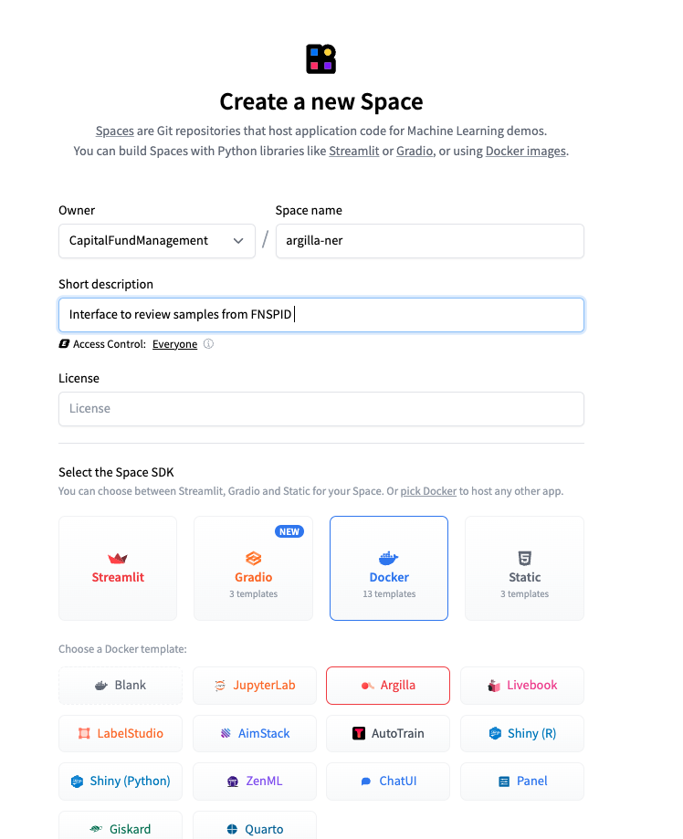
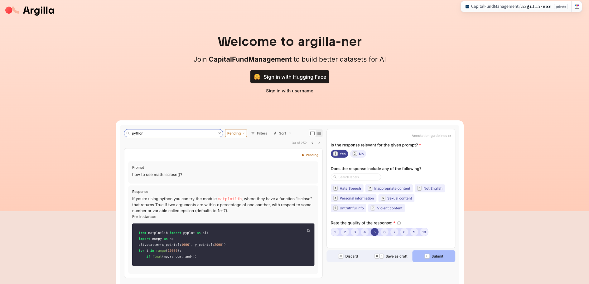
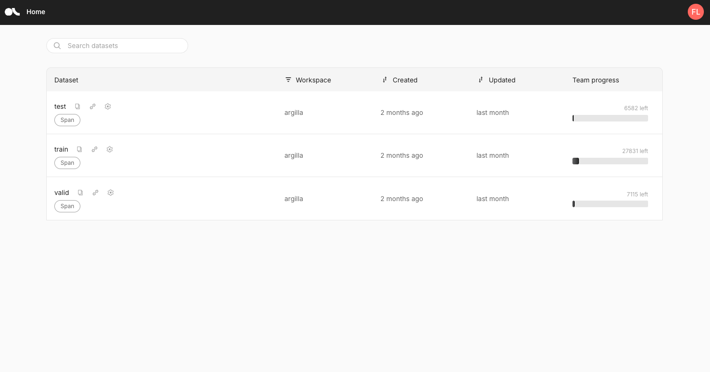
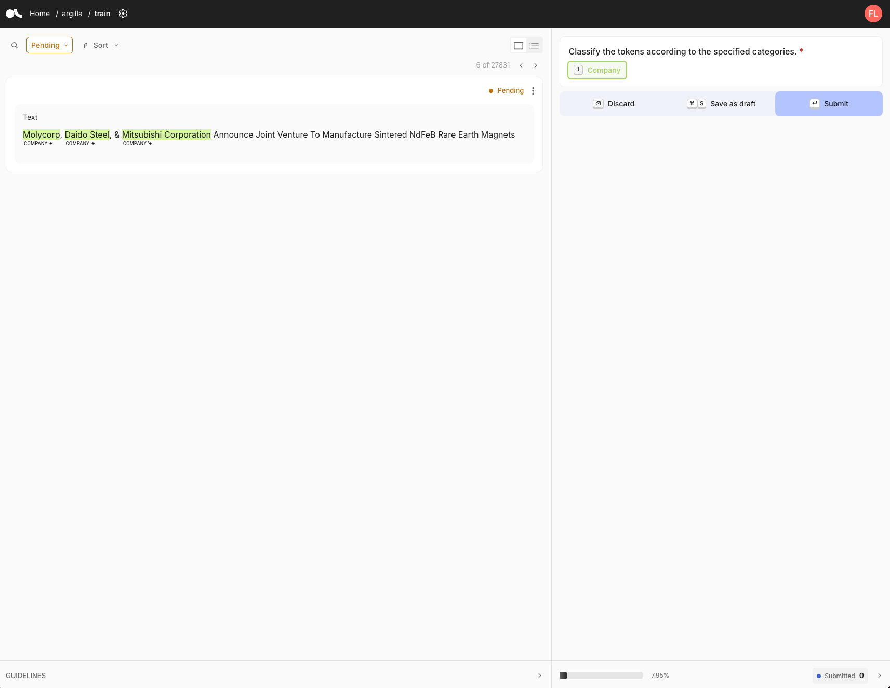
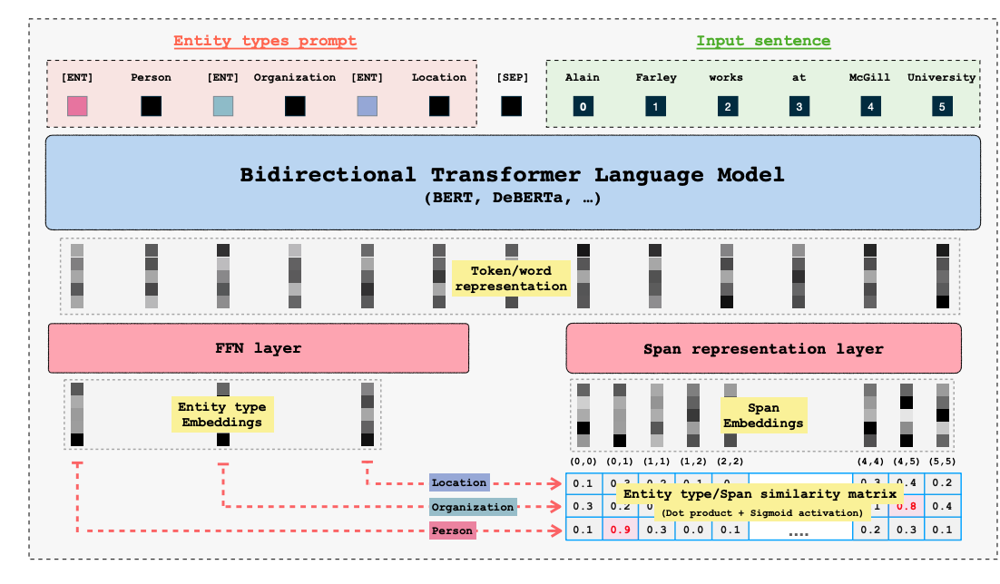
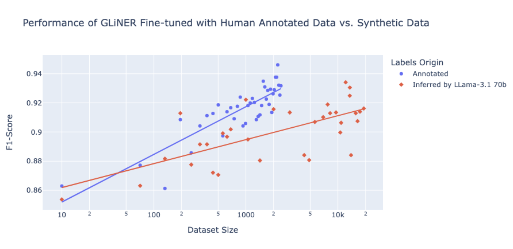

# Investing in Performance: Fine-tune small models with LLM insights  - a CFM case study 

**_Overview:_** _This article presents a deep dive into Capital Fund Management’s (CFM) use of open-source large language models (LLMs) and the Hugging Face (HF) ecosystem to optimize Named Entity Recognition (NER) for financial data. By leveraging_ **_LLM-assisted labeling_** _with_ **_HF Inference Endpoints_** _and refining data with_ **_Argilla_**_, the team improved accuracy by up to_ **_6.4%_** _and reduced operational costs, achieving solutions up to_ **_80x cheaper_** _than large LLMs alone._

_In this post, you will learn:_

- _How to use LLMs for efficient data labeling_
- _Steps for fine-tuning compact models with LLM insights_
- _Deployment of models on Hugging Face Inference Endpoints for scalable NER applications_

_This structured approach combines accuracy and cost-effectiveness, making it ideal for real-world financial applications._ 

|     **_Model_**     | **_F1-Score (Zero-Shot)_** | **_F1-Score (Fine-Tuned)_** | **_Inference Cost (per hour)_** | **_Cost Efficiency_** |
| :-----------------: | :------------------------: | :-------------------------: | :-----------------------------: | :-------------------: |
|     **_GLiNER_**    |           _87.0%_          |           _93.4%_           |   _$0.50 (GPU) / $0.10 (CPU)_   |  _Up to 80x cheaper_  |
|   **_SpanMarker_**  |           _47.0%_          |           _90.1%_           |   _$0.50 (GPU) / $0.10 (CPU)_   |  _Up to 80x cheaper_  |
|  **_Llama 3.1-8b_** |           _88.0%_          |            _N/A_            |             _$4.00_             |       _Moderate_      |
| **_Llama 3.1-70b_** |           _95.0%_          |            _N/A_            |             _$8.00_             |      _High Cost_      |

Capital Fund Management (CFM) is an alternative investment management firm headquartered in Paris, also has teams in New York City and London currently overseeing assets totaling 15.5 billion dollars.

Employing a scientific approach to finance, CFM leverages quantitative and systematic methods to devise superior investment strategies. 

CFM has been working with [Hugging Face's Expert Support](https://huggingface.co/support) to stay updated on the latest advancements in machine learning and harness the power of open-source technology for their wide range of financial applications. One of the collaboration's main goals has been to explore how CFM can benefit from efficiently using open-source Large Language Models (LLMs) to enhance their existing machine learning use cases. Quantitative hedge funds rely on massive amounts of data to inform decisions about whether to buy or sell specific financial products. In addition to standard data sources from financial markets (e.g., prices), hedge funds are increasingly extracting insights from alternative data, such as textual information from news articles. One major challenge in incorporating news into fully automated trading strategies is accurately identifying the products or entities (e.g., companies, stocks, currencies) mentioned in the articles. While CFM’s data providers supply these tags, they can be incomplete and require further validation.

CFM explored several approaches to improve financial entity recognition, including zero-shot NER using LLMs and smaller models, LLM-assisted data labeling with Hugging Face Inference Endpoints and Argilla, and fine-tuning smaller models on curated datasets. These approaches not only leverage the versatility of large models but also address the challenges of cost and scalability in real-world financial applications.

Among open-source models, the Llama 3.1 series by Meta stood out due to its strong performance across benchmarks, making it a top choice for generating synthetic annotations. These LLMs were pivotal in creating high-quality labeled datasets, combining automation and human expertise to streamline the labeling process and enhance model performance in financial NER tasks.

## Table of Content

1. [NER on the Financial News and Stock Price Integration Dataset](#fnspid)
2. [LLM-Assisted data labeling with Llama](#label-llama)
    - [Deploy Llama3.1-70b-Instruct with Hugging Face Inference Endpoints ](#deploy-ie)
    - [Prompting Llama for NER](#prompt)
    - [Get predictions from the endpoint](#infer-ie)
    - [Review predictions with Argilla](#argilla)
4. [Performance of zero-shot approaches for financial NER](#zero-shot)
5. [Improving performance of compact models with fine-tuning on LLM-assisted labeled dataset](#fine-tuning)
6. [Weak Supervision vs. LLM-assisted labeling](#comparison)

<a name="fnspid"></a>
## NER on the Financial News and Stock Price Integration Dataset 

Our focus on this use case was to extract company names from news headlines from the Financial News and Stock Price Integration Dataset [(FNSPID)](https://arxiv.org/abs/2402.06698). It is composed of news headlines and articles associated with corresponding stock symbols coming from several sources such as Bloomberg, Reuters, Benzinga and others. After analyzing the various news sources, we found that news from Benzinga had no missing stock symbol values. This subset of the dataset contains \~900k samples. As a result, we decided to reduce our dataset to Benzinga headlines for a more consistent and reliable analysis. 

<div style="text-align: center;">
  <figure>
    
    <figcaption>Dataset preview of FNSPID</figcaption>
  </figure>
</div>

```python
    {"example 1": "Black Diamond Stock Falling After Tweet"} -> Black Diamond
    {"example 2": "Dun & Bradstreet Acquires Avention For $150M"} ->  Dun & Bradstreet, Avention
    {"example 3": "Fast Money Picks For April 27"} -> No company
```

_Example samples and target predictions for the task_

<a name="label-llama"></a>
## LLM-Assisted data labeling with Llama 

To effectively compare different approaches, we first need to consolidate a reliable dataset that will serve as a foundation for evaluating the candidate methods. This dataset will be used for both testing the performance of models in zero-shot settings and as a base for fine-tuning. 

We used Llama-assisted data labeling to streamline and enhance the annotation process by having Llama 3.1 generate labels for dataset samples. These auto-generated labels were then manually reviewed using the open-source data annotation platform [Argilla](https://argilla.io/). This approach allowed us to speed up the labeling process while ensuring the quality of the annotations.

<a name="deploy-ie"></a>
### **_Deploy Llama3.1-70b-Instruct with_**[ **_Hugging Face Inference Endpoints_**](https://huggingface.co/inference-endpoints/dedicated) 

To securely and quickly get access to a [Llama3.1-70-Instruct](http://meta-llama/Llama-3.1-70B-Instruct) deployment we opted for Hugging Face Inference Endpoints. 

Hugging Face Inference Endpoints provide a straightforward and secure solution for deploying machine learning models in production environments. They enable developers and data scientists to build AI applications without the need to manage infrastructure, simplifying deployment to just a few clicks.

To access Inference Endpoints we logged in as a member of the [`CapitalFundManagement`](https://huggingface.co/CapitalFundManagement) organization on the Hugging Face Hub, then accessed the service at <https://ui.endpoints.huggingface.co> . To start a new deployment we create on `New` then select `meta-llama/Llama-3.1-70B-Instruct`

<div style="text-align: center;">
  <figure>
    
    <figcaption>Endpoint creation on the Inference Endpoints UI</figcaption>
  </figure>
</div>


You can select on which cloud provider the hardware will be hosted,  the region, and the type of instance. Inference Endpoints suggest an instance type based on the model size, which should be big enough to run the model. Here an instance with 4 Nvidia L40S is selected. When LLM is selected, an automated container is selected running [Text Generation Inference](https://github.com/huggingface/text-generation-inference) for optimized inference.


When clicking on the “Create Endpoint” the deployment is created and the endpoint will be ready in a few minutes. To get more information about Inference Endpoints setup, visit <https://huggingface.co/docs/inference-endpoints>.
<div style="text-align: center;">
  <figure>
    
    <figcaption>Endpoint running on the Inference Endpoints UI</figcaption>
  </figure>
</div>

Once our endpoint is running, we will use the endpoint URL provided to send requests to it.

<a name="prompt"></a>
### **_Prompting Llama for NER_** 

Before sending requests, we needed to design a prompt that would guide the model effectively to generate the desired output. After several rounds of testing, we structured the prompt into multiple sections to address the task accurately:

- **Role Definition**: The model is positioned as a financial expert with strong English skills.

- **Task Instructions**: The model is instructed to extract company names linked to stocks mentioned in headlines, while excluding stock indices often found in titles.

- **Expected Output**: The model must return a dictionary with:

  - `"result"`: Exact company names or stock symbols.
  - `"normalized_result"`: Standardized company names corresponding to those in `"result"`.

- **Few-shot Examples**: A series of input-output examples to demonstrate the expected behavior and ensure consistency in performance across varied inputs. These examples help the model understand how to distinguish relevant entities and format its output correctly. Each example illustrates different headline structures to prepare the model for a range of real-world cases.

```
SYSTEM_PROMPT = “””
###Instructions:### 
You are a financial expert with excellent English skills.  
Extract only the company names from the following headlines that are related to a stock discussed in the article linked to the headline.  
Do not include stock indices such as "CAC40" or "Dow Jones". 

##Expected Output:## 
Return a dictionary with: 
A key "result" containing a list of company names or stock symbols. Make sure to return them exactly as they are written in the text even if the original text has grammatical errors. If no companies or stocks are mentioned, return an empty list. 
A key "normalized_result" containing the normalized company names corresponding to the entries in the "result" list, in the same order. This list should have the same size as the "result" list. 

##Formatting:## 
Do not return companies not mentioned in the text. 

##Example Outputs##

Input: "There's A New Trading Tool That Allows Traders To Trade Cannabis With Leverage" 
Output: {"result": [], "normalized_result": []} 
Input: "We explain AAPL, TSLA, and MSFT report earnings" 
Output: {"result": ["AAPL", "TSLA", "MSFT"], "normalized_result": ["Apple", "Tesla", "Microsoft"]} 
Input: "10 Biggest Price Target Changes For Friday" 
Output: {"result": [], "normalized_result": []} 
Input: "'M' is For Microsoft, and Meh" 
Output: {"result": ["Microsoft"], "normalized_result": ["Microsoft"]} 
Input: "Black Diamond: The New North Face? (BDE, VFC, JAH, AGPDY.PK)" 
Output: {"result": ['Black Diamond', 'North Face', 'BDE', 'VFC','JAH','AGPDY.PK'], "normalized_result": ['Black Diamond','The North Face', 'BPER Banca', 'VF Corporation','Jarden Corporation','AGP Diagnostics']} 
“””
```

<a name="infer-ie"></a>
### **Get predictions from the endpoint** 

Now that we have our prompt and endpoint ready, the next step is to send requests using the titles from our dataset. To do this efficiently, we'll use the [`AsyncInferenceClient`](https://huggingface.co/docs/huggingface_hub/package_reference/inference_client#huggingface_hub.AsyncInferenceClient) from the `huggingface_hub` library. This is an asynchronous version of the `InferenceClient`, built on `asyncio` and `aiohttp`. It allows us to send multiple concurrent requests to the endpoint, making the processing of the dataset faster and more efficient.

```python
from huggingface_hub import AsyncInferenceClient

# Initialize the Hugging Face AsyncInferenceClient 
client = AsyncInferenceClient(base_url="https://your-endpoint-url.huggingface.cloud")
```

To make sure the model replies a structured output, we will use guidance with a specific Pydantic schema `Companies`

```python
from pydantic import BaseModel 
from typing import List, Dict, Any

# This class defines the expected structure for the output using Pydantic.
class Companies(BaseModel):
    """
    Pydantic model representing the expected LLM output.
    
    Attributes:
        result (List[str]): A list of company names or results from the LLM.
        normalized_result (List[str]): A list of 'normalized' company names, i.e., processed/cleaned names.
    """
    result: List[str]
    normalized_result: List[str]

grammar: Dict[str, Any] = {
    "type": "json_object",
    "value": Companies.schema()  
    # This instructs the LLM to return a JSON with "result" and "normalized_result" as keys
}
```

We also set generation parameters: 

```python
max_tokens: int = 512  # Maximum number of tokens to generate in the response
temperature: float = 0.1  # Controls randomness in the output (lower values are more deterministic)
```

Now we define our functions to send requests to the endpoint and parse output:

```python
async def llm_engine(messages: List[Dict[str, str]]) -> str:
    """
    Function to send a request to the LLM endpoint and get a response.

    Args:
        messages (List[Dict[str, str]]): A list of messages to pass to the LLM.

    Returns:
        str: The content of the response message or 'failed' in case of an error.
    """
    try:
        # Send the request to the LLM endpoint asynchronously
        response = await client.chat_completion(
            messages=messages,
            model="ENDPOINT",  # Replace with your model endpoint
            temperature=temperature,
            response_format=grammar,
            max_tokens=max_tokens
        )
        # Extract the content of the response message
        answer: str = response.choices[0].message.content
        return answer
    except Exception as e:
        # Handle any exceptions that occur during the request
        print(f"Error in LLM engine: {e}")
        return "failed"

def parse_llm_output(output_str: str) -> Dict[str, Any]:
    """
    Parse the JSON-like output string from an LLM into a dictionary.

    Args:
        output_str (str): The string output from an LLM, expected to be in JSON format.

    Returns:
        Dict[str, Any]: A dictionary parsed from the input JSON string with a 'valid' flag.
    """
    try:
        # Parse the JSON string into a dictionary
        result_dict: Dict[str, Any] = json.loads(output_str)
        result_dict["valid"] = True
        return result_dict
    except json.JSONDecodeError as e:
        # Handle JSON parsing errors and return a default structure
        print(f"Error decoding JSON: {e}")
        return {
            "result": [output_str],
            "normalized_result": [output_str],
            "valid": False
        }
```
We test the endpoint with a single example: 

```python
messages = [
           {"role": "system", "content": SYSTEM_PROMPT}, 
            {"role": "user", "content": "Some stocks i like buying are AAPL, GOOG, AMZN, META"}
            ]
response = await llm_engine(messages)
print(parse_llm_output(response))
```
```
{"normalized_result": ["Apple", "Alphabet", "Amazon", "Meta Platforms"], "result": ["AAPL", "GOOG", "AMZN", "META"]}
```

Now, we create a `process_batch` function to handle sending requests in manageable batches, preventing the API endpoint from becoming overwhelmed or hitting rate limits. This batching approach allows us to efficiently process multiple requests concurrently without saturating the server, reducing the risk of timeouts, rejected requests, or throttling. By controlling the flow of requests, we ensure stable performance, faster response times, and easier error handling while maximizing throughput.

```python
import asyncio

async def process_batch(batch):
    """ 
    Get the model output for a batch of samples.
    
    This function processes a batch of samples by sending them to the LLM and
    gathering the results concurrently.
    
    Args:
        batch (List[Dict[str, str]]): A list of dictionaries where each dictionary
                                      contains the data for a single sample, including
                                      an "Article_title".
    
    Returns:
        List[str]: A list of responses from the LLM for each sample in the batch.
    """
    
    list_messages = []
    
    # Loop through each sample in the batch
    for sample in batch:
        messages = [
           {"role": "system", "content": SYSTEM_PROMPT}, 
           {"role": "user", "content": sample["Article_title"]} 
        ]
        list_messages.append(messages) 

    # Use asyncio.gather to send requests to the LLM concurrently for all message sequences
    return await asyncio.gather(*[llm_engine(messages) for messages in list_messages])
```


We will run inference over the dataset: 

```python
from datasets import load_dataset, Dataset

#Streaming data from Huggingface Hub to avoid downloading the entire dataset
dataset = load_dataset("Zihan1004/FNSPID", streaming=True)

iterable_dataset = iter(dataset["train"])

# Create a batch of samples from remote dataset
def get_sample_batch(iterable_dataset, batch_size):
    batch = []
    try:
        for _ in range(batch_size):
            batch.append(next(iterable_dataset))
    except StopIteration:
        pass
    return batch
```

And we create the main inference loop: 

```python
#Main loop
batch_size = 128
i= 0
len_extracted = 0

while True:
    batch = get_sample_batch(iterable_dataset, batch_size)
    #batch = samples[i * batch_size : (i+1) * batch_size]
    predictions = await process_batch(batch)
    parsed_predictions = [parse_llm_output(_pred) for _pred in predictions]
    try :
        parsed_dataset = [
            {"Article_title": sample["Article_title"],
             "predicted_companies": pred["result"],
             "normalized_companies":pred.get("normalized_result", ""),
             "valid": pred["valid"]} for sample, pred in zip(batch, parsed_predictions)
            ]
    except Exception as e :
        print(i,e)
        continue

    # Write parsed_dataset to a JSON file
    with open(os.path.join(CHECKPOINT_DATA, f"parsed_dataset_{i}.json"), 'w') as json_file:
        json.dump(parsed_dataset, json_file, indent=4)  # Use json.dump to write data to a JSON file
    
    len_extracted += len(parsed_dataset)
    i+= 1
    print(f"Extracted: {len_extracted} samples")
    if len(batch) < batch_size:
        break
```

When the inference is running we can monitor the traffic directly from the UI

<div style="text-align: center;">
  <figure>
    
    <figcaption>Endpoint analytics </figcaption>
  </figure>
</div>

**It took about 8 hours to process the whole dataset with 900k samples which costs  ~$70.**

<a name="argilla"></a>
### Review predictions with Argilla 

With the labeled data generated from our LLM, the next step is to curate a high-quality subset to ensure reliable evaluation of different methods, including zero-shot and fine-tuning approaches. This carefully reviewed dataset will also serve as a foundational base for fine-tuning smaller models. The entire labeled dataset by the LLM can be also used for fine-tuning in a [weak supervision](https://en.wikipedia.org/wiki/Weak_supervision) framework.

**_Dataset sampling and splitting_**

To create a manageable sample size for review, we used LLM labels and clustered company names using [fuzzy matching](https://en.wikipedia.org/wiki/Approximate_string_matching) with the [rapidfuzz](https://rapidfuzz.github.io/RapidFuzz/) library. We applied the cdist function to compute Levenshtein distances between companies and clustered them with a threshold of 85. A representative company was selected for each cluster, and Llama predictions were mapped accordingly. Finally, we sampled 5% of news headlines from each company-related cluster and 5% from headlines without any companies resulting in a dataset of 2714 samples. \
\
Then using metadata, the sampled dataset is divided into three parts:

- **Train**: News from 2010 to 2016, used for training small ML models - **2405 samples**

- **Validation:** News from 2017 to 2018, for hyperparameters tuning - **204 samples**

- **Test:** News from 2019 to 2020, used to evaluate the model on unseen data. - **105 samples**

Once created, we set up an annotation tool, [Argilla](https://argilla.io/), to ease the annotation process. 

Argilla is an open-source tool, integrated into the Hugging Face ecosystem that excels at gathering human feedback for a wide range of AI projects. Whether you're working on traditional NLP tasks like text classification and NER, fine-tuning large language models (LLMs) for retrieval-augmented generation (RAG) or preference tuning, or developing multimodal models like text-to-image systems, Argilla provides the tools needed to collect and refine feedback efficiently. This ensures your models continuously improve based on high-quality, human-validated data.\
\
An Argilla interface can be set up directly through Hugging Face Spaces and this is what we opted for. Check out [the documentation](https://docs.argilla.io/latest/getting_started/quickstart/) to start your own interface and go to <https://huggingface.co/new-space> .

<div style="text-align: center;">
  <figure>
    
    <figcaption>Create Argilla Space on the Hub </a></figcaption>
  </figure>
</div>

<div style="text-align: center;">
  <figure>
    
    <figcaption> Argilla homepage on Spaces</figcaption>
  </figure>
</div>

<div style="text-align: center;">
  <figure>
    
    <figcaption> Argilla datasets view</figcaption>
  </figure>
</div>


Once the interface is created, we can connect programmatically to it using the Argilla python SDK. To get ready to annotate we followed the following steps:

1. We connect to our interface using credentials provided in the settings. 

```python
import argilla as rg 
client = rg.Argilla( 
	api_url="https://capitalfundmanagement-argilla-ner.hf.space", 
	api_key="xxx", 
	headers={"Authorization": f"Bearer {HF_TOKEN}"}, 
	verify = False)
```

2. We create the guidelines for the annotation, and generate the task specific dataset. Here, we specify the [**SpanQuestion**](https://docs.argilla.io/latest/reference/argilla/settings/questions/?h=spanquestion#src.argilla.settings._question.SpanQuestion) task. We then generate a train, a validation and test dataset objects with the defined settings. &#x20;

```python
import argilla as rg  # Import the Argilla library.


# Define the label for token classification (e.g., "Company").
labels = ["Company"]


# Define settings for the annotation task.
settings = rg.Settings(
    guidelines="Classify individual tokens according to the specified categories, ensuring that any overlapping or nested entities are accurately captured.",
    fields=[rg.TextField(name="text", title="Text", use_markdown=False)],
    questions=[rg.SpanQuestion(
        name="span_label",
        field="text",
        labels=labels,
        title="Classify the tokens according to the specified categories.",
        allow_overlapping=False,
    )],
)


# Create datasets with the same settings for training, validation, and testing.
train_dataset = rg.Dataset(name="train", settings=settings)
train_dataset.create()

valid_dataset = rg.Dataset(name="valid", settings=settings)
valid_dataset.create()

test_dataset = rg.Dataset(name="test", settings=settings)
test_dataset.create()
```

3. We populate the dataset with news headlines from the different datasets

```python
train_records = [rg.Record(fields={"text": title}) for title in train_df["Article_title"]] 
valid_records = [rg.Record(fields={"text": title}) for title in valid_df["Article_title"]] 
test_records = [rg.Record(fields={"text": title}) for title in test_df["Article_title"]] 

train_records_list = [{"id": record.id, "text": record.fields["text"]} for record in train_records] 
valid_records_list = [{"id": record.id, "text": record.fields["text"]} for record in valid_records] 
test_records_list = [{"id": record.id, "text": record.fields["text"]} for record in test_records] 

train_dataset.records.log(train_records) 
valid_dataset.records.log(valid_records) 
test_dataset.records.log(test_records)
``` 
4. In this step, we incorporate predictions from various models. Specifically, we add Llama 3.1 predictions into Argilla, where each entity is represented as a dictionary containing a start index, end index, and a label (in this case, 'Company')."

```python
train_data = [{"span_label": entity,"id": id,} for id, entity in zip(train_ids, train_entities_final)] 
valid_data = [{"span_label": entity,"id": id,} for id, entity in zip(valid_ids, valid_entities_final)] 
test_data = [{"span_label": entity,"id": id,} for id, entity in zip(test_ids, test_entities_final)] 

train_dataset.records.log(records=train_data, batch_size = 1024) 
valid_dataset.records.log(records=valid_data, batch_size = 1024) 
test_dataset.records.log(records=test_data, batch_size = 1024) 
``` 
<div style="text-align: center;">
  <figure>
    
    <figcaption> Argilla annotation view</figcaption>
  </figure>
</div>


The annotation interface displays the text to be annotated, along with its status (either pending or submitted). Annotation guidelines are presented on the right side of the screen. In this case, we have one label, _'Company._' To annotate, we first select the label, then highlight the relevant text in the sentence. Once all entities are selected, we click 'submit' to finalize the annotation.

**_Duration of annotation_** 

Using pre-computed Llama labels significantly accelerates the annotation process, reducing the time per sample to just **_5 to 10 seconds,_** compared to roughly **30 seconds** for raw, unprocessed samples. **This efficiency leads to a substantial time saving, allowing us to complete the annotation of 2,714 samples in around 8 hours.** The efficiency gains are even more pronounced for more complex tasks than NER, where the time saved with pre-computed labels or generation becomes significantly greater.

<a name="zero-shot"></a>
## Performance of zero-shot approaches for financial NER 

With a high-quality, reviewed dataset in place, we can now experiment with different approaches for zero-shot NER. We tested four models:

**Small Language Models:**
- GLINER
- SpanMarker
**Large Language Models (LLMs):**
- Llama-3.1-8b
- Llama-3.1-70b

1. **GLiNER**

\
[GLiNER](https://arxiv.org/abs/2311.08526) is a compact, versatile NER model that leverages bidirectional transformers like BERT to identify a wide range of entity types overcoming the limitations of traditional models that are restricted to predefined entities. Unlike large autoregressive models, GLiNER treats NER as a task of matching entity types with spans in text, using parallel processing for efficiency. It offers a practical and resource-efficient alternative to LLMs, delivering strong performance in zero-shot scenarios without the high computational costs associated with larger models.

<div style="text-align: center;">
  <figure>
    
    <figcaption> GLiNER architecture from the  <a href="https://arxiv.org/abs/2311.08526" target="_blank">original paper</a></figcaption>
  </figure>
</div>

GLiNER offers three model variants:

1. **GLiNER-Small-v2.1** (50M parameters) 
2. **GLiNER-Medium-v2.1** (90M parameters)
3. **GLiNER-Large-v2.1** (0.3B parameters)

Compared to LLMs like Llama-3.1-70b, GLiNER models are more compact, cost-effective, and efficient for NER tasks, while LLMs generally offer broader flexibility but are much larger and resource-intensive. GLiNER medium can be tried on the Hugging Face Space: <https://huggingface.co/spaces/tomaarsen/gliner_medium-v2.1> For our experiments, we focused our attention on a specific GLiNER variant [EmergentMethods/gliner\_medium\_news-v2.1 ](https://huggingface.co/EmergentMethods/gliner_medium_news-v2.1)which has been already fine-tuned on the [EmergentMethods/AskNews-NER-v0](https://huggingface.co/datasets/EmergentMethods/AskNews-NER-v0) and aims at improving the accuracy across a wide range of topic and especially for long-context news entity recognition extraction.To use GLiNER you can install the `gliner` package based out of the Hugging Face [transformers ](https://huggingface.co/docs/transformers/en/index)library.

```python
!pip install gliner
```

Then using GLiNER for NER is as easy as: 

```python
from gliner import GLiNER

model = GLiNER.from_pretrained("EmergentMethods/gliner_large_news-v2.1")

text = """
EMCOR Group Company Awarded Contract for Installation of Process Control Systems for Orange County Water District's Water Purification Facilities
"""

labels = ["company"] # Add other entities that you want to detect here

entities = model.predict_entities(text, labels, threshold=.5)
#threshold indicates the minimum probability the model should have for the returned entities.

for entity in entities:
    print(entity["text"], "=>", entity["label"])
``` 

**Output**

```bash
“EMCOR Group => company"
``` 
For a list of samples the `batch_text` method can be used: 

```python
from gliner import GLiNER

model = GLiNER.from_pretrained("EmergentMethods/gliner_large_news-v2.1")

batch_text = [
"EMCOR Group Company Awarded Contract for Installation of Process Control Systems for Orange County Water District's Water Purification Facilities",
"Integra Eyes Orthopedics Company - Analyst Blog" 
] 

labels = ["company"] # Add other entities that you want to detect here

batch_entities = model.batch_predict_entities(batch_text, labels, threshold=.5)
#threshold indicates the minimum probability the model should have for the returned entities.

for entities in batch_entities:
for entity in entities:
   	 print(entity["text"], "=>", entity["label"])
``` 
Output: 

```bash
“EMCOR Group => company" #correct predictions
"Integra Eyes Orthopedics Company => company" #incorrect predictions, ground truth Integra
```

The zero-shot results, in terms of F1-score on the annotated dataset of 2714 samples curated earlier is **87%**.

The GLiNER model performs well in extracting company names from text but struggles with certain cases, such as when companies are mentioned as stock symbols. It also misclassifies general references to stock industries, like "Healthcare stocks" or "Industrial stocks," as company names. While effective in many cases, these errors highlight areas where further refinement is needed to improve accuracy in distinguishing between companies and broader industry terms.

2. **SpanMarker** 
[SpanMarker](https://github.com/tomaarsen/SpanMarkerNER) is a framework for training powerful NER models using familiar encoders such as BERT, RoBERTa and DeBERTa. Tightly implemented on top of the 🤗 Transformers library, SpanMarker can take good advantage of it. As a result, SpanMarker will be intuitive to use for anyone familiar with Transformers. We chose this variant [tomaarsen/span-marker-bert-base-orgs](https://huggingface.co/tomaarsen/span-marker-bert-base-orgs) trained on trained on the [FewNERD, CoNLL2003, and OntoNotes v5](https://huggingface.co/datasets/tomaarsen/ner-orgs) dataset that can be used for NERn. This SpanMarker model uses [bert-base-cased](https://huggingface.co/bert-base-cased) as the underlying encoder. It’s trained specifically to recognize organizations. It can be used for inference to predict an `ORG`(organization) label as follows: 

```python
from span_marker import SpanMarkerModel

# Download from the 🤗 Hub
model = SpanMarkerModel.from_pretrained("tomaarsen/span-marker-bert-base-orgs")
# Run inference
entities = model.predict("Enernoc Acquires Energy Response; Anticipates Deal Will Add to 2013 EPS")

for entity in entities:
    print(entity["span"], "=>", entity["label"])
``` 
Output:

```bash
“EMCOR Group => ORG" #correct predictions
"Energy Response => ORG" #incorrect 
```

The zero-shot results, in terms of F1-score on the annotated dataset of 2714 samples curated earlier is **47%**. SpanMarker model performs well in extracting accurate company names but tends to identify too many incorrect entities. This is due to its training on the broader "organization" category, which includes entities such as non-profit organizations, government bodies, educational institutions, and sports teams. As a result, it sometimes confuses these with company names, leading to over-extraction and less precise results in certain contexts.

3. **Llama3.1-8b and Llama3.1-70b**

We tested 2 variants of the Llama3.1 model including the 70b that we used to curate ground truth examples. We used the prompt that is presented above. On our annotated subset we have the following results :


| *Model*     | *[Llama 3.1 8b](https://huggingface.co/meta-llama/Llama-3.1-8B-Instruct)*  | *[Llama 3.1 70b](https://huggingface.co/meta-llama/Llama-3.1-70B-Instruct)* |
| ----------- | -------------------------------------------------------------------------- | --------------------------------------------------------------------------- |
| *F1-Score*  |                                 88%                                        |                                      95%                                    | 

**Performance Recap**

| *Model*     | *GLiNER* | *SpanMarker* | *[Llama 3.1 8b](https://huggingface.co/meta-llama/Llama-3.1-8B-Instruct)* | *[Llama 3.1 70b](https://huggingface.co/meta-llama/Llama-3.1-70B-Instruct)* |
| ----------- | -------- | ----------- | -------------------------------------------------------------------------- | --------------------------------------------------------------------------- |
| *F1-Score*  |    87%   |     47%     |                                   88%                                      |                                   **95%**                                   |

 In this experiment, we compared the performance of small models like **GLiNER** and **SpanMarker** against LLMs such as **Llama 3.1-8b** and **Llama 3.1-70b**. Small models like GLiNER (87% F1) provide a good balance between accuracy and computational efficiency, making them ideal for resource-constrained scenarios. In contrast, LLMs, while more resource-intensive, deliver higher accuracy, with Llama 3.1-70b achieving a 95% F1-score. This highlights the trade-off between performance and efficiency when choosing between small models and LLMs for NER tasks. Let’s now see how the performance differs when we fine-tune compact models.

## Improving the performance of compact models with fine-tuning on LLM-assisted labeled dataset   

**Fine-tuning**

 Using our train/validation/test subsets created earlier, we fine-tuned GLiNER and SpanMarker on an AWS instance with a single Nvidia A10 GPU. A fine-tuning example for GLiNER is accessible [here](https://github.com/urchade/GLiNER/blob/main/examples/finetune.ipynb) and for SpanMarker [here](https://github.com/tomaarsen/SpanMarkerNER/blob/main/notebooks/model_training.ipynb). Fine-tuning those models is as easy as running this with `train_dataset`and `valid_dataset`created as [Hugging Face dataset](https://huggingface.co/docs/datasets/en/load_hub).


```python
import numpy as np 
from gliner import GLiNER, Trainer
# calculate number of epochs 
batch_size = 4 
learning_rate=5e-6
num_epochs = 20 
model=GLiNER.from_pretrained("EmergentMethods/gliner_medium_news-v2.1") 
	data_collator = DataCollator(model.config, data_processor=model.data_processor, prepare_labels=True) 
	log_dir = create_log_dir(model_path, model_name, learning_rate, batch_size, size, model_size, timestamp=False) 
	training_args = TrainingArguments( 
    	output_dir=log_dir,    # Optimizer, model, tokenizer states 
    	logging_dir = log_dir, 
    	overwrite_output_dir = 'True', 
    	learning_rate=learning_rate,              	# Learning rate 
    	weight_decay=0.01,                        	# Weight decay 
    	others_lr=1e-5, 					     # learning rate
    	others_weight_decay=0.01,                 	# weight decay
    	lr_scheduler_type="linear",        # learning rate scheduler 
    	warmup_ratio=0.1,                  # Warmup steps ratio 
    	per_device_train_batch_size=batch_size,   	# Training batch
    	per_device_eval_batch_size=batch_size,    # Evaluation batch
    	focal_loss_alpha=0.75,          # Focal loss alpha parameter 
    	focal_loss_gamma=2,             # Focal loss gamma parameter 
    	num_train_epochs=num_epochs,              # training epochs 
    	save_strategy="epoch",          # Save the model at the end of each epoch 
    	save_total_limit=2,             # Keep only the best model 
    	metric_for_best_model="valid_f1",        	    	     
    	use_cpu=False,                  # Use GPU
    	report_to="tensorboard",        # Report to TensorBoard 
    	logging_steps=100,              # Steps between logging 
    	evaluation_strategy="epoch",    # Evaluate every few steps
	) 

trainer = Trainer(
    model=model,
    args=training_args,
    train_dataset=train_dataset,
    eval_dataset=valid_dataset, 
    tokenizer=model.data_processor.transformer_tokenizer,
     data_collator=data_collator, 
     compute_metrics=custom_compute_metrics 
     ) 
	trainer.train()  
``` 

The training ran for 20 epochs, we save the checkpoint with the highest F1 score on the validation set. 

**Performance comparison**

| *Model*             | *[gliner-medium-news](https://huggingface.co/EmergentMethods/gliner_medium_news-v2.1)* | *[Gliner-medium-news](https://huggingface.co/EmergentMethods/gliner_medium_news-v2.1) finetuned* | *SpanMarker* | *SpanMarker fine-tuned* | *[Llama 3.1 8b](https://huggingface.co/meta-llama/Llama-3.1-8B-Instruct)* | *[Llama 3.1 70b](https://huggingface.co/meta-llama/Llama-3.1-70B-Instruct)*  |
| ------------------- | -------------------------------------------------------------------------------------- | ------------------------------------------------------------------------------------------------ | ------------ | ----------------------- | ------------------------------------------------------------------------- | -------------------------------------------------------------|
| *Test set F1-Score* | 87.0%                                                                                  | **93.4%**                                                                                         | 47.0%       | 90.1%                   | 80.0%                                                                     | 92.7%                                                           |

In this updated comparison, we evaluated models based on their F1-scores after fine-tuning. The **GLiNER-medium-news** model improved from 87.0% to 93.4% after fine-tuning, showing significant gains in accuracy. Similarly, **SpanMarker** went from 47.0% to 90.1% with fine-tuning, making it far more competitive. Meanwhile, **Llama 3.1-8b** and **Llama 3.1-70b** performed well out of the box, scoring 80.0% and 92.7%, respectively, without fine-tuning. This comparison emphasizes that fine-tuning smaller models like GLiNER and SpanMarker can dramatically enhance performance, rivaling larger LLMs at a lower computational cost.

_The_  **_llama 3.1-70b_** _model costs at least $8 per hour for inference, making it significantly more expensive than compact models, which can run on a GPU instance costing around $0.50 per hour—16 times cheaper. Furthermore, compact models can even be deployed on CPU instances, costing as little as \~$0.10 per hour, which is 80 times less expensive. This highlights the substantial cost advantage of smaller models, especially in resource-constrained environments, without sacrificing competitive performance when fine-tuned for specific tasks._

## Weak Supervision vs. LLM-assisted labeling <a name="comparison"></a>

In this experiment, we explored two key approaches to data labeling for NER: **Weak Supervision** and **LLM-assisted labeling**. While weak supervision enables scalable training on synthetic data, our findings suggest that it cannot achieve the same level of accuracy as models trained on manually annotated data. For 1,000 samples, manual annotation took 3 hours with an F1 score of **0.915**, while Llama 3.1-70b inference only took 2 minutes but resulted in a slightly lower F1 score of **0.895**. The trade-off between speed and accuracy depends on the task's requirements.

<div style="text-align: center;">
  <figure>
    
    <figcaption> Weak Supervision vs. LLM-assisted labeling </figcaption>
  </figure>
</div>

The graph compares the performance of **GLiNER** fine-tuned on human-annotated data versus synthetic data inferred by **Llama-3.1 70b** across varying dataset sizes. The blue dots represent F1-scores of models trained on human-annotated data, while the red dots represent those inferred by Llama-3.1 70b. As dataset size increases, models fine-tuned on human annotations consistently outperform those using synthetic data, achieving higher F1-scores. It illustrates that while models fine-tuned on human annotations yield higher accuracy,_ **LLM-assisted labeling** using Llama-3.1 70b can still provide considerable value, especially when resources for manual annotation are limited. Even though the F1-scores from LLM-inferred data are slightly lower, they remain competitive across various dataset sizes. LLMs can rapidly generate large volumes of annotations, offering a practical solution for scaling dataset creation efficiently, making them beneficial in scenarios where time and cost constraints are critical.

## Conclusion

**Our experiment demonstrated that while large models like Llama 3.1 provide superior performance out of the box, fine-tuning smaller models like GLiNER and SpanMarker with LLM-assisted labeling can significantly enhance accuracy, rivaling the LLMs at a fraction of the cost. This approach highlights how investing in fine-tuning small models using LLM insights provides a cost-effective, scalable solution for financial NER tasks, making it ideal for real-world applications where both accuracy and resource efficiency are crucial.**
