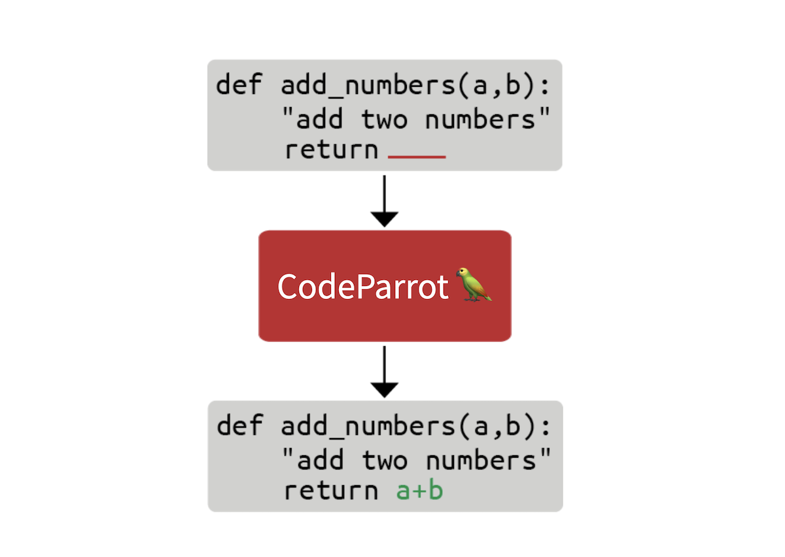

# Training CodeParrot 🦜 from Scratch


In this blog post we'll take a look at what it takes to build the technology behind [GitHub CoPilot](https://copilot.github.com/), an application that provides suggestions to programmers as they code. In this step by step guide, we'll learn how to train a large GPT-2 model called CodeParrot 🦜, entirely from scratch. CodeParrot can auto-complete your Python code - give it a spin [here](https://huggingface.co/spaces/lvwerra/codeparrot-generation). Let's get to building it from scratch!



## Creating a Large Dataset of Source Code
The first thing we need is a large training dataset. With the goal to train a Python code generation model, we accessed the GitHub dump available on Google's BigQuery and filtered for all Python files. The result is a 180 GB dataset with 20 million files (available [here](http://hf.co/datasets/transformersbook/codeparrot)). After initial training experiments, we found that the duplicates in the dataset severely impacted the model performance. Further investigating the dataset we found that:

- 0.1% of the unique files make up 15% of all files
- 1% of the unique files make up 35% of all files
- 10% of the unique files make up 66% of all files

You can learn more about our findings in [this Twitter thread](https://twitter.com/lvwerra/status/1458470994146996225). We removed the duplicates and applied the same cleaning heuristics found in the [Codex paper](https://arxiv.org/abs/2107.03374). Codex is the model behind CoPilot and is a GPT-3 model fine-tuned on GitHub code. 

The cleaned dataset is still 50GB big and available on the Hugging Face Hub: [codeparrot-clean](http://hf.co/datasets/lvwerra/codeparrot-clean). With that we can setup a new tokenizer and train a model.

## Initializing the Tokenizer and Model

First we need a tokenizer. Let's train one specifically on code so it splits code tokens well. We can take an existing tokenizer (e.g. GPT-2) and directly train it on our own dataset with the `train_new_from_iterator()` method. We then push it to the Hub. Note that we omit imports, arguments parsing and logging from the code examples to keep the code blocks compact. But you'll find the full code including preprocessing and downstream task evaluation [here](https://github.com/huggingface/transformers/tree/master/examples/research_projects/codeparrot).

```Python
# Iterator for Training
def batch_iterator(batch_size=10):
    for _ in tqdm(range(0, args.n_examples, batch_size)):
        yield [next(iter_dataset)["content"] for _ in range(batch_size)]

# Base tokenizer
tokenizer = GPT2Tokenizer.from_pretrained("gpt2")
base_vocab = list(bytes_to_unicode().values())

# Load dataset
dataset = load_dataset("lvwerra/codeparrot-clean", split="train", streaming=True)
iter_dataset = iter(dataset)

# Training and saving
new_tokenizer = tokenizer.train_new_from_iterator(batch_iterator(),
                                                  vocab_size=args.vocab_size,
                                                  initial_alphabet=base_vocab)
new_tokenizer.save_pretrained(args.tokenizer_name, push_to_hub=args.push_to_hub)
```

Learn more about tokenizers and how to build them in the [Hugging Face course](https://huggingface.co/course/chapter6/1?fw=pt). 

See that inconspicuous `streaming=True` argument? This small change has a big impact: instead of downloading the full (50GB) dataset this will stream individual samples as needed saving a lot of disk space! Checkout the [Hugging Face course](https://huggingface.co/course/chapter5/4?fw=pt
) for more information on streaming.

Now, we initialize a new model. We’ll use the same hyperparameters as GPT-2 large (1.5B parameters) and adjust the embedding layer to fit our new tokenizer also adding some stability tweaks. The `scale_attn_by_layer_idx` flag makes sure we scale the attention by the layer id and `reorder_and_upcast_attn` mainly makes sure that we compute the attention in full precision to avoid numerical issues. We push the freshly initialized model to the same repo as the tokenizer.

```Python
# Load codeparrot tokenizer trained for Python code tokenization
tokenizer = AutoTokenizer.from_pretrained(args.tokenizer_name)

# Configuration
config_kwargs = {"vocab_size": len(tokenizer),
                 "scale_attn_by_layer_idx": True,
                 "reorder_and_upcast_attn": True}

# Load model with config and push to hub
config = AutoConfig.from_pretrained('gpt2-large', **config_kwargs)
model = AutoModelForCausalLM.from_config(config)
model.save_pretrained(args.model_name, push_to_hub=args.push_to_hub)
```

Now that we have an efficient tokenizer and a freshly initialized model we can start with the actual training loop.

## Implementing the Training Loop
We train with the [🤗 Accelerate](https://github.com/huggingface/accelerate) library which allows us to scale the training from our laptop to a multi-GPU machine without changing a single line of code. We just create an accelerator and do some argument housekeeping:

```Python
accelerator = Accelerator()
acc_state = {str(k): str(v) for k, v in accelerator.state.__dict__.items()}

parser = HfArgumentParser(TrainingArguments)
args = parser.parse_args()
args = Namespace(**vars(args), **acc_state)
samples_per_step = accelerator.state.num_processes * args.train_batch_size
set_seed(args.seed)
```

We are now ready to train! Let's use the `huggingface_hub` client library to clone the repository with the new tokenizer and model. We will checkout to a new branch for this experiment. With that setup, we can run many experiments in parallel and in the end we just merge the best one into the main branch.

```Python
# Clone model repository
if accelerator.is_main_process:
    hf_repo = Repository(args.save_dir, clone_from=args.model_ckpt)

# Checkout new branch on repo
if accelerator.is_main_process:
    hf_repo.git_checkout(run_name, create_branch_ok=True)
```

We can directly load the tokenizer and model from the local repository. Since we are dealing with big models we might want to turn on [gradient checkpointing](https://medium.com/tensorflow/fitting-larger-networks-into-memory-583e3c758ff9) to decrease the GPU memory footprint during training.

```Python
# Load model and tokenizer
model = AutoModelForCausalLM.from_pretrained(args.save_dir)
if args.gradient_checkpointing:
    model.gradient_checkpointing_enable()
tokenizer = AutoTokenizer.from_pretrained(args.save_dir)
```

Next up is the dataset. We make training simpler with a dataset that yields examples with a fixed context size. To not waste too much data (some samples are too short or too long) we can concatenate many examples with an EOS token and then chunk them.


The more sequences we prepare together, the smaller the fraction of tokens we discard (the grey ones in the previous figure). Since we want to stream the dataset instead of preparing everything in advance we use an `IterableDataset`. The full dataset class looks as follows:

```Python
class ConstantLengthDataset(IterableDataset):
    def __init__(
        self, tokenizer, dataset, infinite=False, seq_length=1024, num_of_sequences=1024, chars_per_token=3.6
    ):
        self.tokenizer = tokenizer
        self.concat_token_id = tokenizer.bos_token_id
        self.dataset = dataset
        self.seq_length = seq_length
        self.input_characters = seq_length * chars_per_token * num_of_sequences
        self.epoch = 0
        self.infinite = infinite

    def __iter__(self):
        iterator = iter(self.dataset)
        more_examples = True
        while more_examples:
            buffer, buffer_len = [], 0
            while True:
                if buffer_len >= self.input_characters:
                    break
                try:
                    buffer.append(next(iterator)["content"])
                    buffer_len += len(buffer[-1])
                except StopIteration:
                    if self.infinite:
                        iterator = iter(self.dataset)
                        self.epoch += 1
                        logger.info(f"Dataset epoch: {self.epoch}")
                    else:
                        more_examples = False
                        break
            tokenized_inputs = self.tokenizer(buffer, truncation=False)["input_ids"]
            all_token_ids = []
            for tokenized_input in tokenized_inputs:
                all_token_ids.extend(tokenized_input + [self.concat_token_id])
            for i in range(0, len(all_token_ids), self.seq_length):
                input_ids = all_token_ids[i : i + self.seq_length]
                if len(input_ids) == self.seq_length:
                    yield torch.tensor(input_ids)
```

Texts in the buffer are tokenized in parallel and then concatenated. Chunked samples are then yielded until the buffer is empty and the process starts again. If we set `infinite=True` the dataset iterator restarts at its end.

```Python
def create_dataloaders(args):
    ds_kwargs = {"streaming": True}
    train_data = load_dataset(args.dataset_name_train, split="train", streaming=True)
    train_data = train_data.shuffle(buffer_size=args.shuffle_buffer, seed=args.seed)
    valid_data = load_dataset(args.dataset_name_valid, split="train", streaming=True)
    
    train_dataset = ConstantLengthDataset(tokenizer, train_data, infinite=True, seq_length=args.seq_length)
    valid_dataset = ConstantLengthDataset(tokenizer, valid_data, infinite=False, seq_length=args.seq_length)
    
    train_dataloader = DataLoader(train_dataset, batch_size=args.train_batch_size)
    eval_dataloader = DataLoader(valid_dataset, batch_size=args.valid_batch_size)
    return train_dataloader, eval_dataloader

train_dataloader, eval_dataloader = create_dataloaders(args)
```

Before we start training we need to set up the optimizer and learning rate schedule. We don’t want to apply weight decay to biases and LayerNorm weights so we use a helper function to exclude those.

```Python
def get_grouped_params(model, args, no_decay=["bias", "LayerNorm.weight"]):
    params_with_wd, params_without_wd = [], []
    for n, p in model.named_parameters():
        if any(nd in n for nd in no_decay): params_without_wd.append(p)
        else: params_with_wd.append(p)
    return [{"params": params_with_wd, "weight_decay": args.weight_decay},
            {"params": params_without_wd, "weight_decay": 0.0},]

optimizer = AdamW(get_grouped_params(model, args), lr=args.learning_rate)
lr_scheduler = get_scheduler(name=args.lr_scheduler_type, optimizer=optimizer,
                             num_warmup_steps=args.num_warmup_steps,
                             num_training_steps=args.max_train_steps,)
```

A big question that remains is how all the data and models will be distributed across several GPUs. This sounds like a complex task but actually only requires a single line of code with 🤗 Accelerate.

```Python
model, optimizer, train_dataloader, eval_dataloader = accelerator.prepare(
    model, optimizer, train_dataloader, eval_dataloader)
```
Under the hood it'll use DistributedDataParallel, which means a batch is sent to each GPU worker which has its own copy of the model. There the gradients are computed and then aggregated to update the model on each worker.


We also want to evaluate the model from time to time on the validation set so let’s write a function to do just that. This is done automatically in a distributed fashion and we just need to gather all the losses from the workers. We also want to report the [perplexity](https://huggingface.co/course/chapter7/3#perplexity-for-language-models).

```Python
def evaluate(args):
    model.eval()
    losses = []
    for step, batch in enumerate(eval_dataloader):
        with torch.no_grad():
            outputs = model(batch, labels=batch)
        loss = outputs.loss.repeat(args.valid_batch_size)
        losses.append(accelerator.gather(loss))
        if args.max_eval_steps > 0 and step >= args.max_eval_steps:
            break
    loss = torch.mean(torch.cat(losses))
    try:
        perplexity = torch.exp(loss)
    except OverflowError:
        perplexity = float("inf")
    return loss.item(), perplexity.item()
```

We are now ready to write the main training loop. It will look pretty much like a normal PyTorch training loop. Here and there you can see that we use the accelerator functions rather than native PyTorch. Also, we push the model to the branch after each evaluation.


```Python
# Train model
model.train()
completed_steps = 0
for step, batch in enumerate(train_dataloader, start=1):
    loss = model(batch, labels=batch, use_cache=False).loss
    loss = loss / args.gradient_accumulation_steps
    accelerator.backward(loss)
    if step % args.gradient_accumulation_steps == 0:
        accelerator.clip_grad_norm_(model.parameters(), 1.0)
        optimizer.step()
        lr_scheduler.step()
        optimizer.zero_grad()
        completed_steps += 1
    if step % args.save_checkpoint_steps == 0:
        eval_loss, perplexity = evaluate(args)
        accelerator.wait_for_everyone()
        unwrapped_model = accelerator.unwrap_model(model)
        unwrapped_model.save_pretrained(args.save_dir, save_function=accelerator.save)
        if accelerator.is_main_process:
            hf_repo.push_to_hub(commit_message=f"step {step}")
        model.train()
    if completed_steps >= args.max_train_steps:
        break
```

When we call `wait_for_everyone()` and `unwrap_model()` we make sure that all workers are ready and any model layers that have been added by `prepare()` earlier are removed. We also use gradient accumulation and gradient clipping that are easily implemented. Lastly, after training is complete we run a last evaluation and save the final model and push it to the hub. 


```Python
# Evaluate and save the last checkpoint
logger.info("Evaluating and saving model after training")
eval_loss, perplexity = evaluate(args)
log_metrics(step, {"loss/eval": eval_loss, "perplexity": perplexity})
accelerator.wait_for_everyone()
unwrapped_model = accelerator.unwrap_model(model)
unwrapped_model.save_pretrained(args.save_dir, save_function=accelerator.save)
if accelerator.is_main_process:
    hf_repo.push_to_hub(commit_message="final model")
```
Done! That's all the code to train a full GPT-2 model from scratch with as little as 150 lines. We did not show the imports and logs of the scripts to make the code a little bit more compact.  Now let's actually train it!

With this code we trained models for our upcoming [book on Transformers and NLP](https://learning.oreilly.com/library/view/natural-language-processing/9781098103231/): a [110M](https://hf.co/lvwerra/codeparrot-small) and [1.5B](https://hf.co/lvwerra/codeparrot) parameter GPT-2 model. We used a 16 x A100 GPU machine to train these models for 1 day and 1 week, respectively. Enough time to get a coffee and read a book or two!


## Evaluation
This is still relatively short training time for pretraining but we can already observe good downstream performance as compared to similar models. We evaluated the models on OpenAI's HumanEval benchmark that was introduced in the Codex paper. It measures the performance of code generation models on almost 200 coding challenges.


Note that we trained CodeParrot on roughly 25-30B tokens whereas GPT-neo was trained on 300B tokens and Codex on 300B (GPT-3 checkpoint) + 100B (code) tokens. So you definitely get a good bang for your buck here.

But what is this _pass@k_ metric exactly? Simply put it measures the probability of at least one program passing the unittest of a programming problem given _k_ candidate generations from the model. Naturally, the metric increases with k as more candidates can potentially solve the coding challenge. You can use the metric with `datasets`:

```Python
from datasets import load_metric

code_eval = datasets.load_metric("code_eval")
test_cases = ["assert add(2,3)==5"]
candidates = [["def add(a,b): return a*b", "def add(a, b): return a+b"]]
pass_at_k, results = code_eval.compute(references=test_cases, predictions=candidates, k=[1, 2])

print(pass_at_k)

# -> {'pass@1': 0.5, 'pass@2': 1.0}
```


You can also load OpenAI's HumanEval dataset with `datasets`:

```Python
from datasets import load_dataset

dataset = load_dataset("openai_humaneval")
```

Now let's have a look at what we get after anxiously waiting for so long!

## Results

Let's start slow and check if we can prompt the model to write a function to return the size of a file given its path:

**Prompt:**
```Python
def get_files_size(filename):
```

**Completion:**
```Python
    """
    Returns the file size of a file.

    :param filepath: The path to the file.
    :type filepath: str
    :return: The file size.
    :rtype: int
    """
    return os.path.getsize(filepath)
```

So far so good, but let's take this a step further and try something a bit more interesting. One of the less exciting aspects of building production ready code is writing unittest. Let's see if we can use CodeParrot to do this for us!

**Prompt:**
```Python
def is_even(value):
    """Returns True if value is an even number."""
    return value % 2 == 0

# setup unit tests for is_even
import unittest
```

**Completion:**
```Python
class TestIsEven(unittest.TestCase):
    """Tests for is_even function."""

    def test_is_even(self):
        """Test is_even function."""
        self.assertTrue(is_even(0))
        self.assertTrue(is_even(1))
        self.assertTrue 
```

Although the test condition itself does not look quite right the model has built all the boilerplate code for us. This alone could already be quite useful and save us a couple of minutes time!

But what we really want to do is build better transformer models. Let's use CodeParrot to help us do that:

**Prompt:**
```Python
from transformers import AutoTokenizer, AutoModelForSequenceClassification

# build a BERT classifier
```

**Completion:**
```Python
tokenizer = AutoTokenizer.from_pretrained('bert-base-uncased')
model = AutoModelForSequenceClassification.from_pretrained('bert-base-uncased')
```

Looking at a few examples is nice but by now you probably want to try it yourself. We prepared a few online demos just for that!

## Demos


You can play with the models in two demos we added to [Hugging Face Spaces](https://huggingface.co/spaces/launch). With the first you can quickly generate code with the model and with the second you can highlight your code with the model to spot bugs!

- [Code Generation](https://hf.co/spaces/lvwerra/codeparrot-generation)
- [Code Highlighting](https://hf.co/spaces/lvwerra/codeparrot-highlighting)

You can also directly use the models from the `transformers` library:
```Python
from transformers import pipeline

pipe = pipeline('text-generation', model='lvwerra/codeparrot')
pipe('def hello_world():')
```

## Summary

In this short blog post we walked through all the steps involved for training a large GPT-2 model called CodeParrot 🦜 for code generation. Using 🤗 Accelerate we built a training script with less than 200 lines of code that we can effortlessly scale across many GPUs. With that you can now train your own GPT-2 model!

This post gives a brief overview of CodeParrot 🦜, but if you are interested in diving deeper into how to pretrain this models, we recommend reading its dedicated chapter in the upcoming [book on Transformers and NLP](https://learning.oreilly.com/library/view/natural-language-processing/9781098103231/). This chapter provides many more details around building custom datasets, design considerations when training a new tokenizer, and architecture choice.
