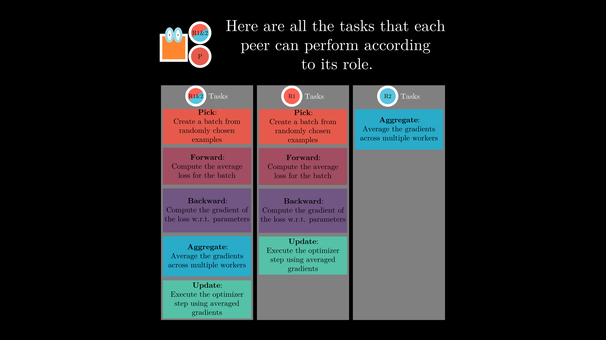
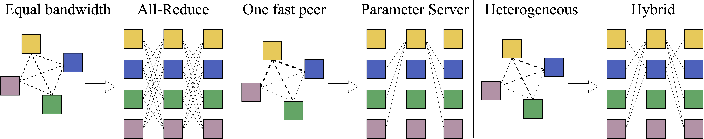
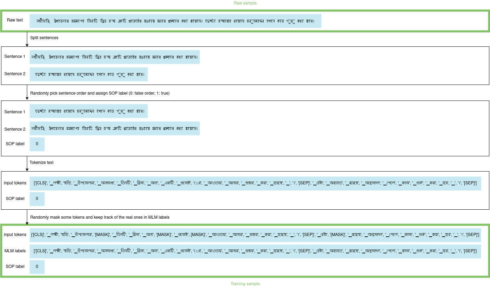

# sahajBERT: A Collaboratively Trained Language Model

<div class="blog-metadata">
    <small>Published to do.</small>
    <a target="_blank" class="btn no-underline text-sm mb-5 font-sans" href="https://github.com/huggingface/blog/blob/master/sahajBERT-a-collaboratively-pretrained-language-model.md">
        Update on GitHub
    </a>
</div>

<div class="author-card">
    <a href="/mryab">
        
        <div class="bfc">
            <code>mryab</code>
            <span class="fullname">Max Ryabinin</span>
        </div>
    </a>
    <a href="/SaulLu">
        
        <div class="bfc">
            <code>SaulLu</code>
            <span class="fullname">Lucile Saulnier</span>
        </div>
    </a>
</div>
<small>
With the additional help of Quentin Lhoest and Sylvain Lesage.
</small>

Modern language models often require a significant amount of compute for pretraining, making it impossible to obtain them without access to tens and hundreds of GPUs or TPUs. Though in theory it might be possible to combine the resources of multiple individuals, in practice, such distributed training methods have previously seen limited success because connection speeds over the Internet are way slower than in high-performance GPU supercomputers.

In this blog post, we describe DeDLOC — a new method for collaborative distributed training that can adapt itself to the network and hardware constraints of participants. We show that it can be successfully applied in real-world scenarios by pretraining sahajBERT, a model for the Bengali language, with 40 volunteers. On downstream tasks in Bengali, this model achieves nearly state-of-the-art quality with results comparable to much larger models that used hundreds of high-tier accelerators.

<p align="center">
<iframe width="864" height="486"
src="https://www.youtube-nocookie.com/embed/v8ShbLasRF8" 
frameborder="0" 
allow="accelerometer; autoplay; encrypted-media; gyroscope; picture-in-picture" 
allowfullscreen></iframe>
</p>

## Distributed Deep Learning in Open Collaborations

### Motivation

These days, many highest-quality NLP systems are based on large pretrained Transformers. In general, their quality improves with size: you can achieve unparalleled results in natural language understanding and generation by scaling up the parameter count and leveraging the abundance of unlabeled text data.

Unfortunately, we use these pretrained models not only because it's convenient. The hardware resources for training Transformers on large datasets often exceed anything affordable to a single person and even most commercial or research organizations. Take, for example, BERT: its training was estimated to cost about $7,000, and for the largest models like GPT-3, this number can be as high as $12 million! This resource limitation might seem obvious and inevitable, but is there really no alternative to using pretrained models for the broader ML community?

However, there might be a way out of this situation: to come up with a solution, we only need to take a look around. It might be the case that the computational resources we're looking for are already there; for example, many of us have powerful computers with gaming or workstation GPUs at home. You might've already guessed that we're going to join their power similarly to [Folding@home](https://foldingathome.org/), [Rosetta@home](https://boinc.bakerlab.org/) or different [BOINC](https://boinc.berkeley.edu/) projects that leverage volunteer computing, but the approach is even more general. For instance, several laboratories can join their smaller clusters together to utilize all the available resources, and some people might want to join the experiment using inexpensive cloud instances.

To a skeptical mind, it might seem that we're missing a key factor here: data transfer in distributed DL is often a bottleneck, since we need to aggregate the gradients from multiple workers. Indeed, any naïve approach to distributed training over the Internet is bound to fail, as most participants don't have gigabit connections and might disconnect from the network at any time. So how on Earth can you train anything with a household data plan? :)

As a solution to this problem, we propose a new training algorithm, called Distributed Deep Learning in Open Collaborations (or **DeDLOC**), which is described in detail in our recently released [preprint](https://arxiv.org/abs/2106.10207). Now, let’s find out what are the core ideas behind this algorithm!

### Training with volunteers

In its most frequently used version, distributed training with multiple GPUs is pretty straightforward. Recall that when doing deep learning, you usually compute gradients of your loss function averaged across many examples in a batch of training data. In case of _data-parallel_ distributed DL, you simply split the data across multiple workers, compute gradients separately, and then average them once the local batches are processed. When the average gradient is computed on all workers, we make a step of optimizer and continue training our model. You can see an illustration of different tasks that are executed below.


<div style="line-height:105%;font-size:80%">
<p align="center">
Typical machine learning tasks executed by peers in distributed training, possibly with a separation of roles
</div>
</p>

Often, to reduce the amount of synchronization and to stabilize the learning process, we can accumulate the gradients for N batches before averaging, which is equivalent to increasing the actual batch size N times. This approach, combined with the observation that most state-of-the-art language models use large batches, led us to a simple idea: let's accumulate one _very_ large batch across all volunteer devices before each optimizer step! Along with complete equivalence to regular distributed training and easy scalability, this method also has the benefit of built-in fault tolerance, which we illustrate below.

Let's consider a couple of potential failure cases that we might encounter throughout a collaborative experiment. By far, the most frequent scenario is that one or several peers disconnect from the training procedure: they might have an unstable connection or simply want to use their GPUs for something else. In this case, we only suffer a minor setback of training: the contribution of these peers gets deducted from the currently accumulated batch size, but other participants will compensate for that with their gradients. Also, if more peers join, the target batch size will simply be reached faster, and our training procedure will naturally speed up. You can see a demonstration of this in the video:

<p align="center">
<iframe width="864" height="486" src="https://www.youtube-nocookie.com/embed/zdVsg5zsGdc" title="YouTube video player" frameborder="0" allow="accelerometer; autoplay; clipboard-write; encrypted-media; gyroscope; picture-in-picture" allowfullscreen></iframe>
</p>

### Adaptive averaging

Now that we have discussed the overall training procedure, there remains one more question: how do we actually aggregate the gradients of participants? Most home computers cannot easily accept incoming connections, and the download speed might also become a constraint.

Since we rely on volunteer hardware for experiments, a central server is not really a viable option, as it will quickly face overload when scaling to tens of clients and hundreds of millions of parameters. Most data-parallel training runs today don't use this strategy anyway; instead, they rely on All-Reduce — an efficient all-to-all communication primitive. Thanks to clever algorithmic optimizations, it allows each node to compute the global average without sending the entire local gradient to every peer.

Because All-Reduce is decentralized, it seems like a good choice; however, we still need to take the diversity of hardware and network setups into account. For example, some volunteers might join from computers that have slow network but powerful GPUs, some might have better connectivity only to a subset of other peers, and some may be firewalled from incoming connections.

It turns out we can actually come up with an optimal data transfer strategy on the fly by leveraging this information about performance! On a high level, we split the entire gradient vector into parts depending on the Internet speed of each peer: those with the fastest connection aggregate the largest parts. Also, if some nodes do not accept incoming connections, they simply send their data for aggregation but do not compute the average themselves. Depending on the conditions, this adaptive algorithm can recover well-known distributed DL algorithms and improve on them with a hybrid strategy, as demonstrated below.


<div style="line-height:105%;font-size:80%">
<p align="center">
Examples of different averaging strategies with the adaptive algorithm.
</p>
</div>

<div style="line-height:105%;border:1px solid #F5F5F5;background-color:#F5F5F5">
<p align="center">
💡 The core techniques for decentralized training are available in <a href="https://github.com/learning-at-home/hivemind">Hivemind</a>.<br>
Check out the repo and learn how to use this library in your own projects!
</p>
</div><br>


## sahajBERT

As always, having a well-designed algorithmic framework doesn't mean that it will work as intended in practice, because some assumptions may not hold true in actual training runs. To verify the competitive performance of this technology and to showcase its potential, we organized a special collaborative event to pretrain a masked language model for the Bengali language. Even though it is the fifth most-spoken native language in the world, it has [very few](https://huggingface.co/models?filter=bn&pipeline_tag=fill-mask) masked language models openly available, which emphasizes the importance of tools that can empower the community, unlocking a plethora of opportunities in the field.

We conducted this experiment with real volunteers from the Neuropark community and used openly available datasets (OSCAR and Wikipedia), because we wanted to have a fully reproducible example that might serve as an inspiration for other groups. Below, we describe the detailed setup of our training run and demonstrate its results.

### Architecture

For our experiment, we chose ALBERT _(A Lite BERT)_ — a model for language representations that is pretrained with Masked Language Modeling (MLM) and Sentence Order Prediction (SOP) as objectives. We use this architecture because weight sharing makes it very parameter-efficient: for example, ALBERT-large has ~18M trainable parameters and performs comparably to BERT-base with ~108M weights on the GLUE benchmark. It means that there is less data to exchange between the peers, which is crucial in our setup, as it significantly speeds up each training iteration.

<div style="line-height:105%;border:1px solid #F5F5F5;background-color:#F5F5F5">
<p align="center">
💡 Want to know more about ALBERT?<br>
<a href="https://arxiv.org/abs/1909.11942">Paper</a><br>
<a href="https://huggingface.co/transformers/model_doc/albert.html#albert"
	>Transformers doc</a
>
</p>
</div>


### Tokenizer

The first brick of our model is called a _tokenizer_ and takes care of transforming raw text into vocabulary indices. Because we are training a model for Bengali, which is not very similar to English, we need to implement language-specific preprocessing as a part of our tokenizer. We can view it as a sequence of operations:

1. **Normalization:** includes all preprocessing operations on raw text data. This was the step at which we have made the most changes, because removing certain details can either change the meaning of the text or leave it the same, depending on language. For example, the standard ALBERT normalizer removes the accents, while for the Bengali language, we need to keep them, because they contain information about the vowels. As a result, we use the following operations: NMT normalization, NFKC normalization, removal of multiple spaces, homogenization of recurring Unicode characters in the Bengali language, and lowercasing.
2. **Pretokenization** describes rules for splitting the input (for example, by whitespace) to enforce specific token boundaries. As in the original work, we have chosen to keep the whitespace out of the tokens. Therefore, to distinguish the words from each other and not to have multiple single-space tokens, each token corresponding to the beginning of a word starts with a special character “\_” (U+2581). In addition, we isolated all punctuation and digits from other characters to condense our vocabulary.
3. **Tokenizer modeling:** It is at this level that the text is mapped into a sequence of elements of a vocabulary. There are several algorithms for this, such as Byte-Pair Encoding (BPE) or Unigram, and most of them need to build the vocabulary from a text corpus. Following the setup of ALBERT, we used the **Unigram Language Model** approach, training a vocabulary of 32k tokens on the deduplicated Bengali part of the OSCAR dataset.
4. **Post-processing:** After tokenization, we might want to add several special tokens required by the architecture, such as starting the sequence with a special token `[CLS]` or separating two segments with a special token `[SEP]`. Since our main architecture is the same as the original ALBERT, we keep the same post-processing: specifically, we add a `[CLS]` token at the beginning of each example and a `[SEP]` token both between two segments and at the end.

<div style="line-height:105%;border:1px solid #F5F5F5;background-color:#F5F5F5">
<p align="center">
💡 Read more information about each component in
<a href="https://huggingface.co/docs/tokenizers/python/latest/components.html#components">Tokenizers doc</a>
</p>
</div>

You can reuse our tokenizer by running the following code:

```python
from transformers import AutoTokenizer
tokenizer = AutoTokenizer.from_pretrained("neuropark/sahajBERT")
```

### Dataset

The last thing we need to cover is the training dataset. As you probably know, the great strength of pretrained models like BERT or ALBERT is that you don't need an annotated dataset, but just a lot of texts. To train sahajBERT, we used the [Bengali Wikipedia dump from 03/20/2021](https://huggingface.co/datasets/lhoestq/wikipedia_bn) and the Bengali subset of [OSCAR](https://huggingface.co/datasets/oscar) (600MB + 6GB of text). These two datasets can easily be downloaded from the HF Hub.

However, loading an entire dataset requires time and storage — two things that our peers do not necessarily have. To make the most of the resources provided by the participants, we have implemented **dataset streaming**, which allows them to train the model nearly as soon as they join the network. Specifically, the examples in the dataset are downloaded and transformed in parallel to the training. We can also shuffle the dataset so that our peers have little chance to process the same examples at the same time. As the dataset is not downloaded and preprocessed in advance, the transformations needed to go from plain text to a training example (shown in the figure below) are done on the fly.


<div style="line-height:105%;font-size:80%">
<p align="center">
From a raw sample to a training sample
</p>
</div>

The dataset streaming mode is available from version v1.9 of the 🤗 datasets library, so you can use it right now as follows:

```python
from datasets import load_dataset

oscar_dataset = load_dataset("oscar", name="unshuffled_deduplicated_bn", streaming=True)
```
<div style="line-height:105%;border:1px solid #F5F5F5;background-color:#F5F5F5">
<p align="center">
💡 Learn more about loading datasets in streaming mode in the 
<a href="https://huggingface.co/docs/datasets/dataset_streaming.html">documentation</a>
</p>
</div>

### Collaborative event

The sahajBERT collaborative training event took place from May 12 to May 21. The event brought together 40 participants, 30 of whom were Bengali-speaking volunteers, and 10 were volunteers from one of the authors' organizations. These 40 volunteers joined the [Neuropark](https://neuropark.co/) Discord channel to receive all information regarding the event and participate in discussions. To join the experiment, volunteers were asked to:

1. Send their username to the moderators to be allowlisted;
2. Open the provided notebook locally, on Google Colaboratory, or on Kaggle;
3. Run one code cell and fill in their Hugging Face credentials when requested;
4. Watch the training loss decrease on the shared dashboards!

For security purposes, we set up an authorization system, so that only members of the Neuropark community could train the model. Sparing you the technical details, our authorization protocol allows us to guarantee that every participant is in the allowlist and to acknowledge the individual contribution of each peer.

In the following figure, you can see the activity of each volunteer. Over the experiment, the volunteers logged in 600 different sessions. Participants regularly launched multiple runs in parallel, and many of them spread out the runs they launched over time. The runs of individual participants lasted 4 hours on average, and the maximum length was 21 hours. You can read more about the participation statistics in the paper.

<iframe width="100%" height="670" frameborder="0"
  src="https://observablehq.com/embed/5acfc9a072a7c4c7?cells=c_noaws%2Ct_noaws%2Cviewof+currentDate"></iframe>
<div style="line-height:105%;font-size:80%">
<p align="center">
Chart showing participants of the <a href="https://huggingface.co/neuropark/sahajBERT"> sahajBERT</a> experiment. Circle radius is relative to the total number of processed batches, the circle is greyed if the participant is not active. Every purple square represents an active device, darker color corresponds to higher performance
</p>
</div>

Along with the resources provided by participants, we also used 16 preemptible (cheap but frequently interrupted) single-GPU T4 cloud instances to ensure the stability of the run. The cumulative runtime for the experiment was 234 days, and in the figure below you can see parts of the loss curve that each peer contributed to!
<p align="center">
<iframe width="80%" height="950" frameborder="0"
  src="https://observablehq.com/embed/4540081dea4600b8?cells=viewof+participant%2Csessions%2ClossByParticipant"></iframe>
</p>

The final model was uploaded to the Model Hub, so you can download and play with it if you want to: [https://hf.co/neuropark/sahajBERT](https://huggingface.co/neuropark/sahajBERT)

### Evaluation

To evaluate the performance of sahajBERT, we finetuned it on two downstream tasks in Bengali:

-   Named entity recognition (NER) on the Bengali split of [WikiANN](https://aclanthology.org/P17-1178/). The goal of this task is to classify each token in the input text into one of the following categories: person, organization, location, or none of them.
-   News Category Classification (NCC) on the Soham articles dataset from [IndicGLUE](https://aclanthology.org/2020.findings-emnlp.445/). The goal of this task is to predict the category to which belong the input text.

We evaluated it during training on the NER task to check that everything was going well; as you can see on the following plot, this was indeed the case!

<iframe width="100%" height="476" frameborder="0"
  src="https://observablehq.com/embed/@huggingface/bengali-exp-eval?cells=evalPlot"></iframe>
<div style="line-height:105%;font-size:80%">
<p align="center">
Evaluation metrics of fine-tuned models on the NER task from different checkpoints of pre-trained models.
</div>
</p>

At the end of training, we compared sahajBERT with three other pretrained language models: [XLM-R Large](https://arxiv.org/abs/1911.02116), [IndicBert](https://aclanthology.org/2020.findings-emnlp.445/), and [bnRoBERTa](https://huggingface.co/neuralspace-reverie/indic-transformers-bn-roberta). In the table below, you can see that our model has results comparable to the best Bengali language models available on HF Hub, even though our model has only ~18M trained parameters, while, for instance, XLM-R (a strong multilingual baseline), has ~559M parameters and was trained on several hundred V100 GPUs.

| Model       | NER F1 (mean ± std) | NCC Accuracy (mean ± std)           |
|:-------------:|:-------------:|:-------------:|
|[sahajBERT](https://huggingface.co/neuropark/sahajBERT) |  95.45 ± 0.53|  91.97 ± 0.47|
|[XLM-R-large](https://huggingface.co/xlm-roberta-large) |  96.48 ± 0.22| 90.05 ± 0.38|
|[IndicBert](https://huggingface.co/ai4bharat/indic-bert) |  92.52 ± 0.45| 74.46 ± 1.91|
|[bnRoBERTa](https://huggingface.co/neuralspace-reverie/indic-transformers-bn-roberta)       |82.32 ± 0.67|80.94 ± 0.45|

These models are available on the Hub as well. You can test them directly by playing with the Hosted Inference API widget on their Model Cards or by loading them directly in your Python code.

#### sahajBERT-NER
Model card: [https://hf.co/neuropark/sahajBERT-NER](https://hf.co/neuropark/sahajBERT-NER)
```python
from transformers import (
    AlbertForTokenClassification,
    TokenClassificationPipeline,
    PreTrainedTokenizerFast,
)

# Initialize tokenizer
tokenizer = PreTrainedTokenizerFast.from_pretrained("neuropark/sahajBERT-NER")

# Initialize model
model = AlbertForTokenClassification.from_pretrained("neuropark/sahajBERT-NER")

# Initialize pipeline
pipeline = TokenClassificationPipeline(tokenizer=tokenizer, model=model)

raw_text = "এই ইউনিয়নে ৩ টি মৌজা ও ১০ টি গ্রাম আছে ।" # Change me
output = pipeline(raw_text)
```

#### sahajBERT-NCC
Model card: [https://hf.co/neuropark/sahajBERT-NER](https://hf.co/neuropark/sahajBERT-NCC)
```python
from transformers import (
    AlbertForSequenceClassification,
    TextClassificationPipeline,
    PreTrainedTokenizerFast,
)

# Initialize tokenizer
tokenizer = PreTrainedTokenizerFast.from_pretrained("neuropark/sahajBERT-NCC")

# Initialize model
model = AlbertForSequenceClassification.from_pretrained("neuropark/sahajBERT-NCC")

# Initialize pipeline
pipeline = TextClassificationPipeline(tokenizer=tokenizer, model=model)

raw_text = "এই ইউনিয়নে ৩ টি মৌজা ও ১০ টি গ্রাম আছে ।" # Change me
output = pipeline(raw_text)
```

## Conclusion

In this blog post, we have discussed the method that can enable collaborative pretraining of neural networks with sahajBERT as the first truly successful example of applying it to a real-world problem.

What does this all mean for the broader ML community? First, it is now possible to run large-scale distributed pretraining with your friends, and we hope to see a lot of cool new models that were previously less feasible to obtain. Also, our result might be important for multilingual NLP, since now the community for any language can train their own models without the need for significant computational resources concentrated in one place.

## Acknowledgements

The DeDLOC paper and sahajBERT training experiment were created by Michael Diskin, Alexey Bukhtiyarov, Max Ryabinin, Lucile Saulnier, Quentin Lhoest, Anton Sinitsin, Dmitry Popov, Dmitry Pyrkin, Maxim Kashirin, Alexander Borzunov, Albert Villanova del Moral, Denis Mazur, Ilia Kobelev, Yacine Jernite, Thomas Wolf, and Gennady Pekhimenko.

In addition, we would like to thank Stas Bekman, Dmitry Abulkhanov, Roman Zhytar, Alexander Ploshkin, Vsevolod Plokhotnyuk and Roman Kail for their invaluable help with building the training infrastructure. Also, we thank Abhishek Thakur for helping with downstream evaluation and Tanmoy Sarkar with Omar Sanseviero, who helped us organize the collaborative experiment and gave regular status updates to the participants over the course of the training run.

Below, you can see all participants of the collaborative experiment:

<iframe width="100%" height="350" frameborder="0"
  src="https://observablehq.com/embed/@huggingface/sahajbert-participants?cells=humanParticipants"></iframe>

## References

"Distributed Deep Learning in Open Collaborations", [ArXiv](https://arxiv.org/abs/2106.10207)

Code for [sahajBERT experiments](https://github.com/yandex-research/DeDLOC/tree/main/sahajbert) in the DeDLOC repository.
