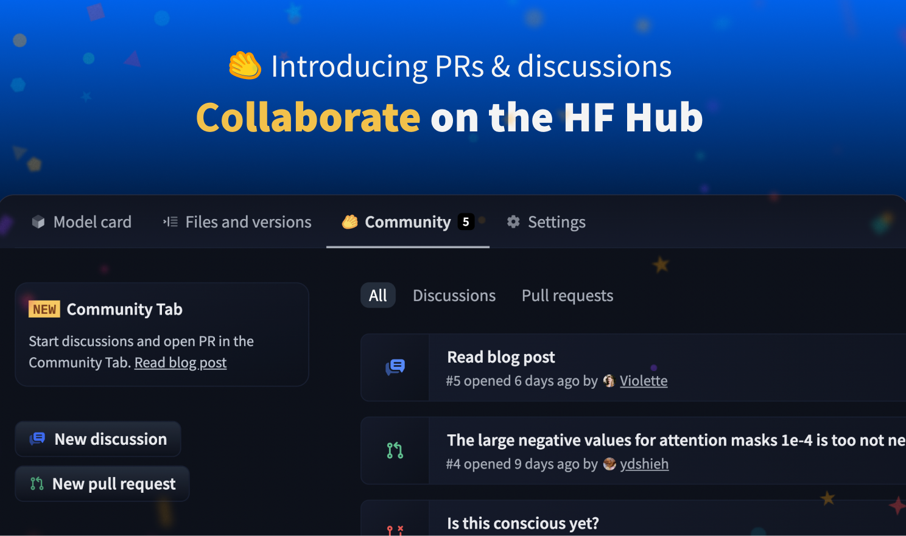
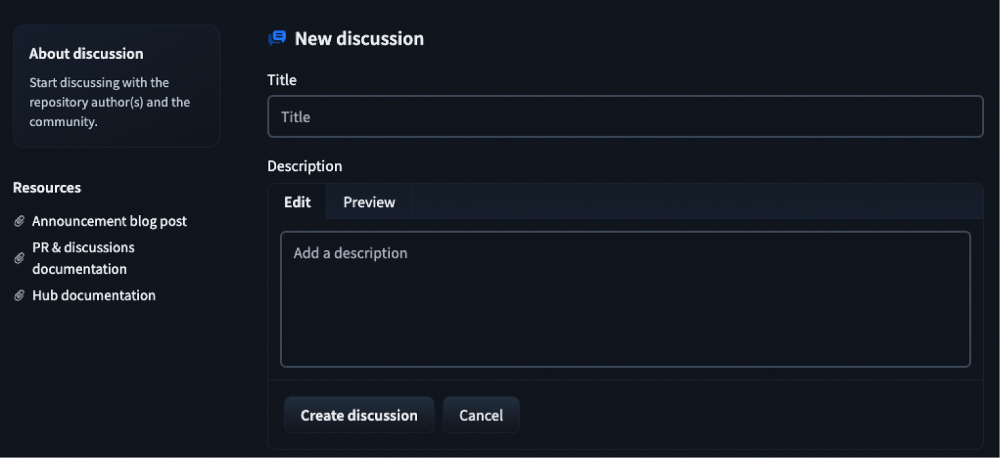
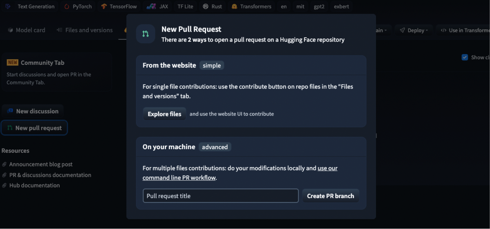

# Introducing Pull Requests and Discussions 🥳

We are thrilled to announce the release of our latest collaborative features: pull requests and discussions on the Hugging Face Hub!

Pull requests and discussions are available today under the [community tab](https://huggingface.co/gpt2/discussions) for all repository types: models, datasets, and Spaces. Any member of the community can create and participate in discussions and pull requests, facilitating collaborations not only within teams, but also with everyone else in the community!

It's the biggest update ever done to the Hub, and we can't wait to see the community members start collaborating with it 🤩.

The new "Community" tab also aligns with proposals in ethical ML throughout the years. Feedback and iterations have a central place in the development of ethical machine learning software. We really believe having it in the community's toolset will unlock new kinds of positive patterns in ML, collaborations, and progress.

Some example use cases for discussions and pull requests:

- Propose suggestions in model cards to improve disclosures of ethical biases.
- Let users flag concerning generations of a given Space demo.
- Provide a venue through which model and dataset authors can have a direct discussion with community members.
- Allow others to improve your repositories! For example, users might want to provide TensorFlow weights!

## Discussions

[Discussions](https://huggingface.co/gpt2/discussions?type=discussion) allow community members ask and answer questions as well as share their ideas and suggestions directly with the repository owners and the community. Anyone can create and participate in discussions in the community tab of a repository.

## Pull requests

[Pull requests](https://huggingface.co/gpt2/discussions?type=pull_request) allow community members open, comment, merge, or close pull requests directly from the website. The easiest way to open a pull request is to use the "Collaborate" button in the "Files and versions" tab. It will let you do single file contributions very easily.

Under the hood, our Pull requests do not use forks and branches, but instead, custom "branches" called `refs` that are stored directly on the source repo. This approach to avoids the need to create a forks for each new version of the model/dataset.

## How is this different from other git hosts

At a high level, we aim to build a simpler version of other git hosts' (like GitHub's) PRs and Issues:

- no forks are involved: contributors push to a special `ref` branch directly on the source repo
- no hard distinction between issues and PRs: they are essentially the same so we display them in the same lists
- streamlined for ML (i.e. models/datasets/Spaces repos), not arbitrary repos

## What's next

Of course, it's only the beginning. We will listen to the community feedback to add new features and improve the community tab in the future. If you have any feedback, you can [join the discussion here](https://huggingface.co/spaces/huggingface/HuggingDiscussions/discussions/1). Today is the best time to join your first discussion and open a PR! 🤗
