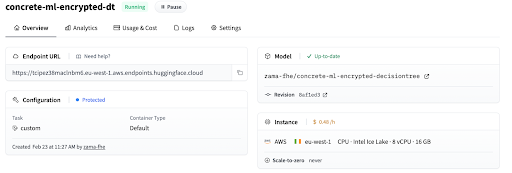

title: "Running Privacy-Preserving Inferences on Hugging Face Endpoints"
thumbnail: /blog/assets/fhe-endpoints/thumbnail.png
authors:
- user: Benoit Chevallier-Mames
  guest: true
---

# Running Privacy-Preserving Inferences on Hugging Face Endpoints

> [!NOTE] This is a guest blog post by the Zama team. Zama is an open source cryptography company building state-of-the-art FHE solutions for blockchain and AI.

Eighteen months ago, Zama started [Concrete ML](https://github.com/zama-ai/concrete-ml), a privacy-preserving ML framework with bindings to traditional ML frameworks such as scikit-learn, ONNX, PyTorch, and TensorFlow. To ensure privacy for users' data, Zama uses Fully Homomorphic Encryption (FHE), a cryptographic tool that allows us to make direct computations over encrypted data, without ever knowing the private key.

From the start, we wanted to pre-compile some FHE-friendly networks and make them available somewhere on the internet, allowing users to use them trivially. We are ready today! And not in a random place on the internet, but directly on Hugging Face.

More precisely, we use Hugging Face [Endpoints](https://huggingface.co/docs/inference-endpoints/en/index) and [custom inference handlers](https://huggingface.co/docs/inference-endpoints/en/guides/custom_handler), to be able to store our Concrete ML models and let users deploy on HF machines in one click. At the end of this blog post, you will understand how to use pre-compiled models and how to prepare your pre-compiled models. This blog can also be considered as another tutorial for custom inference handlers.

## Deploying a pre-compiled model

Let's start with deploying an FHE-friendly model (prepared by Zama or third parties - see "Preparing your own pre-compiled model" section below for learning how to prepare yours).

First, look for the model you want to deploy: We have pre-compiled a [bunch of models](https://huggingface.co/zama-fhe?#models) on Zama's HF page. Let's suppose you have chosen [concrete-ml-encrypted-decisiontree](https://huggingface.co/zama-fhe/concrete-ml-encrypted-decisiontree): As explained in the description, this pre-compiled model allows you to detect spam without looking at the message content in the clear.

Like any other model available on the Hugging Face platform, select _Deploy_ and then _Inference Endpoint (dedicated)_:

")

Next, choose the endpoint name or the region, and most importantly, the CPU (Concrete ML models do not use GPUs for now; we are [working](https://www.zama.ai/post/tfhe-rs-v0-5) on it) as well as the best machine available - in the example below we chose eight vCPU. Now click on _Create Endpoint_ and wait for the initialization to finish.


After just a few seconds, the endpoint is deployed and your privacy-preserving model is ready to operate.



Note: Don’t forget to delete the endpoint (or at least pause it) when you are no longer using it, or else it will cost more than anticipated.

## Using the endpoint

### Installing the client side

Now, obviously, the goal is not only to deploy your endpoint, but to let users play with it. For that, users need to clone the repository on their computer. This is done by selecting _Clone Repository_, in the dropdown menu:


They will be given a small command line that they can run in their terminal:

```bash
git clone https://huggingface.co/zama-fhe/concrete-ml-encrypted-decisiontree
```

Once the command inside their terminal, they can go on the `concrete-ml-encrypted-decisiontree` directory and open `play_with_endpoint.py` with their editor. Here, they will find the line with `API_URL = …`, and should replace it with the new URL of the endpoint created in the previous section. In our case, it would be:

```bash
API_URL = "https://tcipez38maclnbm6.eu-west-1.aws.endpoints.huggingface.cloud”
```

In your case, fill it in with with _your_ entrypoint’s URL. Also, define an [access token](https://huggingface.co/docs/hub/en/security-tokens) and store it in an environment variable:

```bash
export HF_TOKEN=[your token hf_XX..XX]
```

Lastly, your machine needs to have Concrete ML installed locally: Make a virtual environment, source it and install the necessary dependencies:

```bash
python3.9 -m venv .venv
pip install -U setuptools pip wheel
source .venv/bin/activate
pip install -r requirements.txt
```

### Running inferences

Now, you can run the inferences on the entry point, by running:

```bash
python play_with_endpoint.py
```

It should generate some logs similar to the following:

```bash
Sending 0-th piece of the key (remaining size is 71984.14 kbytes)
Storing the key in the database under uid=3307376977
Sending 1-th piece of the key (remaining size is 0.02 kbytes)
Size of the payload: 0.23 kilobytes
for 0-th input, prediction=0 with expected 0 in 3.242 seconds
for 1-th input, prediction=0 with expected 0 in 3.612 seconds
for 2-th input, prediction=0 with expected 0 in 4.765 seconds

(...)

for 688-th input, prediction=0 with expected 1 in 3.176 seconds
for 689-th input, prediction=1 with expected 1 in 4.027 seconds
for 690-th input, prediction=0 with expected 0 in 4.329 seconds
Accuracy on 691 samples is 0.8958031837916064
Total time: 2873.860 seconds
Duration per inference: 4.123 seconds
```

### Adapting to your application or needs

If you edit `play_with_endpoint.py`, you’ll see that we iterate over different samples of the test dataset, and run encrypted inferences directly on the endpoint.

```python
for i in range(nb_samples):

    # Quantize the input and encrypt it
    encrypted_inputs = fhemodel_client.quantize_encrypt_serialize(X_test[i].reshape(1, -1))

    # Prepare the payload
    payload = {
        "inputs": "fake",
        "encrypted_inputs": to_json(encrypted_inputs),
        "method": "inference",
        "uid": uid,
    }

    if is_first:
        print(f"Size of the payload: {sys.getsizeof(payload) / 1024:.2f} kilobytes")
        is_first = False

    # Run the inference on HF servers
    duration -= time.time()
    duration_inference = -time.time()
    encrypted_prediction = query(payload)
    duration += time.time()
    duration_inference += time.time()

    encrypted_prediction = from_json(encrypted_prediction)

    # Decrypt the result and dequantize
    prediction_proba = fhemodel_client.deserialize_decrypt_dequantize(encrypted_prediction)[0]
    prediction = np.argmax(prediction_proba)

    if verbose:
        print(
            f"for {i}-th input, {prediction=} with expected {Y_test[i]} in {duration_inference:.3f} seconds"
        )

    # Measure accuracy
    nb_good += Y_test[i] == prediction
```

Of course, this is just an example of the entrypoint's usage. Developers are encouraged to adapt this example to their own use-case or application.

### Under the hood

Please note that all of this is done thanks to the flexibility of [custom handlers](https://huggingface.co/docs/inference-endpoints/en/guides/custom_handler) and we express our gratitude to the Hugging Face developers for offering such flexibility. The mechanism is defined in `handler.py`. As explained in the Hugging Face documentation, you can define the `__call__` method of `EndpointHandler` pretty much as you want: In our case, we have defined a `method` parameter, which can be `save_key` (to save FHE evaluation keys), `append_key` (to save FHE evaluation keys piece by piece if the key is too large to be sent in one single call) and finally `inference` (to run FHE inferences). These methods are used to set the evaluation key once, and then run all the inferences, one by one, as seen in `play_with_endpoint.py`.

### Limits

One can remark however that keys are stored in the RAM of the endpoint, which is not convenient for a production environment: at each restart, the keys are lost and need to be re-sent; Plus, when you have several machines to handle huge traffic, this RAM is not shared between the machines. Finally, the fact that the available CPU machines only provide 8 vCPUs at most for endpoints makes the execution time worse than if deployed on AWS machines.

## Preparing your own pre-compiled model

Now that you know how easy it is to deploy a pre-compiled model, you may want to prepare yours. For this, you can fork [one of the repositories we have prepared](https://huggingface.co/zama-fhe?#models). All the model categories supported by Concrete ML ([linear](https://docs.zama.ai/concrete-ml/built-in-models/linear) models, [tree-based](https://docs.zama.ai/concrete-ml/built-in-models/tree) models, built-in [MLP](https://docs.zama.ai/concrete-ml/built-in-models/neural-networks), [PyTorch](https://docs.zama.ai/concrete-ml/deep-learning/torch_support) models) have at least one example, that can be used as a template for new pre-compiled models.

Then, edit `creating_models.py`, and change the ML task to be the one you want to tackle in your pre-compiled model: for example, if you started with [concrete-ml-encrypted-decisiontree](https://huggingface.co/zama-fhe/concrete-ml-encrypted-decisiontree), change the dataset and the model kind.

As explained earlier, you need to have installed Concrete ML to prepare your own pre-compiled model.

Now you can launch `python creating_models.py`. This will train a model and create the necessary development files (`client.zip`, `server.zip` and `versions.json`) in the `compiled_model` directory. As explained in the [documentation](https://docs.zama.ai/concrete-ml/deployment/client_server), these files contain your pre-compiled model. If you have any issue, you can get support on the [fhe.org discord](http://discord.fhe.org).

Last step is to modify `play_with_endpoint.py`, to also deal with the same ML task as in `creating_models.py`: set the dataset accordingly.

Now, you can save this directory with the `compiled_model` directory and files, and your modifications in `creating_models.py` and `play_with_endpoint.py` on Hugging Face models. Certainly, you will need to run some tests and make slight adjustments for it to work.

## Available pre-compiled models today

For now, we have prepared a few pre-compiled models as examples, hoping the community will extend this soon.

| Model kind  | Dataset  | Execution time on HF endpoint  |
|---|---|---|
| [Logistic Regression](https://huggingface.co/zama-fhe/concrete-ml-encrypted-logreg) | Synthetic  | 0.4 sec |
[DecisionTree](https://huggingface.co/zama-fhe/concrete-ml-encrypted-decisiontree) | Spam | 2.0 sec
[QNN](https://huggingface.co/zama-fhe/concrete-ml-encrypted-qnn) | Iris | 3.7 sec
[CNN](https://huggingface.co/zama-fhe/concrete-ml-encrypted-deeplearning) | MNIST | 24 sec


Keep in mind that CPU machines available as HF endpoints today are not as powerful as AWS' machines (generally m6i or hpc7a), so complex models' execution time is expected to be slower. Hopefully, more powerful machines will soon be available on Hugging Face endpoints to improve these timings.

## Conclusion and next steps

In this blog post, we have shown that custom endpoints are pretty easy yet powerful to use: what we do in Concrete ML is pretty different from the regular workflow of ML practitioners but still, we are able to accommodate the custom endpoints to deal with most of our needs. Kudos to Hugging Face engineers for developing such a generic solution.

We explained how:

- Developers can create their own pre-compiled models and make them available on Hugging Face models.
- Companies can deploy developers' pre-compiled models and make them available to their users via HF endpoints.
- Users can use these endpoints to run their ML tasks over encrypted data.

To go further, it would be useful to have more powerful machines available on Hugging Face endpoints, to make inferences faster. Also, we could imagine that Concrete ML becomes more integrated on Hugging Face’s interface, and have a _Private-Preserving Inference Endpoint_ button, which would simplify developers' life even more. Finally, for an integration in more server machines, it could be useful to have a way to share a state between machines, and keep this state non-volatile (FHE inference keys would be stored there).


Zama libraries [Concrete](https://github.com/zama-ai/concrete) and [Concrete-ML](https://github.com/zama-ai/concrete-ml) (Don't forget to star the repos on GitHub ⭐️💛) allow straightforward ML model building and conversion to the FHE equivalent to being able to compute and predict over encrypted data.
