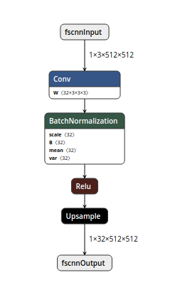
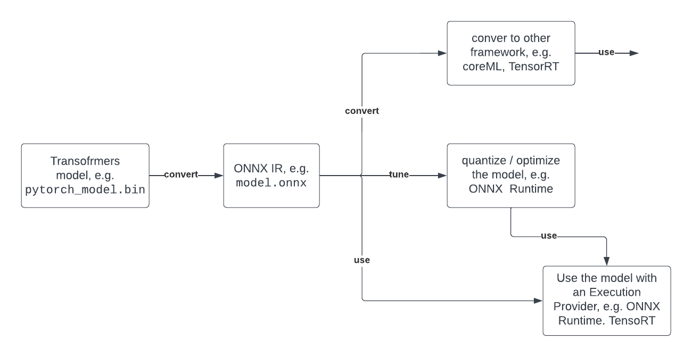

<h1>
   "Convert Transformers to ONNX with Hugging Face Optimum"
</h1>

<div class="blog-metadata">
    <small>Published June 22, 2022.</small>
    <a target="_blank" class="btn no-underline text-sm mb-5 font-sans" href="https://github.com/huggingface/blog/blob/main/convert-transformers-to-onnx.md">
        Update on GitHub
    </a>
</div>

<div class="author-card">
    <a href="/philschmid">
        
        <div class="bfc">
            <code>philschmid</code>
            <span class="fullname">Philipp Schmid</span>
        </div>
    </a>
</div>

Hundreds of Transformers experiments and models are uploaded to the [Hugging Face Hub](https://huggingface.co/) every single day. Machine learning engineers and students conducting those experiments use a variety of frameworks like PyTorch, TensorFlow/Keras, or others. These models are already used by thousands of companies and form the foundation of AI-powered products.

If you deploy Transformers models in production environments, we recommend exporting them first into a serialized format that can be loaded, optimized, and executed on specialized runtimes and hardware.

In this guide, you'll learn about:
- [1. What is ONNX?](#1-what-is-onnx)
- [2. What is Hugging Face Optimum?](#2-what-is-hugging-face-optimum)
- [3. What Transformers architectures are supported?](#3-what-transformers-architectures-are-supported)
- [4. How can I convert a Transformers model (BERT) to ONNX?](#4-how-can-i-convert-a-transformers-model-bert-to-onnx)
  - [Export with `torch.onnx` (low-level)](#export-with-torchonnx-low-level)
  - [Export with `transformers.onnx`  (mid-level)](#export-with-transformersonnx--mid-level)
  - [Export with Optimum (high-level)](#export-with-optimum-high-level)
- [5. What's next?](#5-whats-next)

Let's get started! 🚀

---

If you are interested in optimizing your models to run with maximum efficiency, check out the [🤗 Optimum library](https://github.com/huggingface/optimum).

## 1. What is ONNX?

The [ONNX (Open Neural Network eXchange)](http://onnx.ai/) is an open standard and format to represent machine learning models. ONNX defines a common set of operators and a common file format to represent deep learning models in a wide variety of frameworks, including PyTorch and TensorFlow. 

<figure class="image table text-center m-0 w-full">
    
    <figcaption>pseudo ONNX graph, visualized with NETRON</figcaption>
</figure>

When a model is exported to the ONNX format, these operators are used to construct a computational graph (often called an `intermediate representation`) which represents the flow of data through the neural network.

> **Important:** ONNX Is not a Runtime ONNX is only the representation that can be used with runtimes like ONNX Runtime. You can find a list of supported accelerators [here](https://onnx.ai/supported-tools.html#deployModel).
> 

➡️[Learn more about ONNX.](https://onnx.ai/about.html)

## 2. What is Hugging Face Optimum?

[Hugging Face Optimum](https://github.com/huggingface/optimum) is an open-source library and an extension of [Hugging Face Transformers](https://github.com/huggingface/transformers), that provides a unified API of performance optimization tools to achieve maximum efficiency to train and run models on accelerated hardware, including toolkits for optimized performance on [Graphcore IPU](https://github.com/huggingface/optimum-graphcore) and [Habana Gaudi](https://github.com/huggingface/optimum-habana). 

Optimum can be used for converting, quantization, graph optimization, accelerated training & inference with support for [transformers pipelines](https://huggingface.co/docs/transformers/main/en/main_classes/pipelines#pipelines).

Below you can see a typical developer journey of how you can leverage Optimum with ONNX.

<figure class="image table text-center m-0 w-full">
    
</figure>

[➡️ Learn more about Optimum](https://huggingface.co/blog/hardware-partners-program)

## 3. What Transformers architectures are supported?

A list of all supported Transformers architectures can be found in the [ONNX section of the Transformers documentation](https://huggingface.co/docs/transformers/serialization#onnx). Below is an excerpt of the most commonly used architectures which can be converted to ONNX and optimized with [Hugging Face Optimum](https://huggingface.co/docs/optimum/index) 

- ALBERT
- BART
- BERT
- DistilBERT
- ELECTRA
- GPT Neo
- GPT-J
- GPT-2
- RoBERT
- T5
- ViT
- XLM
- …

[➡️ All supported architectures](https://huggingface.co/docs/transformers/serialization#onnx)

## 4. How can I convert a Transformers model (BERT) to ONNX?

There are currently three ways to convert your Hugging Face Transformers models to ONNX. In this section, you will learn how to export [distilbert-base-uncased-finetuned-sst-2-english](https://huggingface.co/distilbert-base-uncased-finetuned-sst-2-english) for `text-classification` using all three methods going from the low-level `torch` API to the most user-friendly high-level API of `optimum`. Each method will do exactly the same

### Export with `torch.onnx` (low-level)

[torch.onnx](https://pytorch.org/docs/stable/onnx.html) enables you to convert model checkpoints to an ONNX graph by the `export` method. But you have to provide a lot of values like `input_names`, `dynamic_axes`, etc. 

You’ll first need to install some dependencies:

```python
pip install transformers torch
```

exporting our checkpoint with `export` 

```python
import torch
from transformers import AutoModelForSequenceClassification, AutoTokenizer

# load model and tokenizer
model_id = "distilbert-base-uncased-finetuned-sst-2-english"
model = AutoModelForSequenceClassification.from_pretrained(model_id)
tokenizer = AutoTokenizer.from_pretrained(model_id)
dummy_model_input = tokenizer("This is a sample", return_tensors="pt")

# export
torch.onnx.export(
    model, 
    tuple(dummy_model_input.values()),
    f="torch-model.onnx",  
    input_names=['input_ids', 'attention_mask'], 
    output_names=['logits'], 
    dynamic_axes={'input_ids': {0: 'batch_size', 1: 'sequence'}, 
                  'attention_mask': {0: 'batch_size', 1: 'sequence'}, 
                  'logits': {0: 'batch_size', 1: 'sequence'}}, 
    do_constant_folding=True, 
    opset_version=13, 
)
```

### Export with `transformers.onnx`  (mid-level)

[transformers.onnx](https://huggingface.co/docs/transformers/serialization#exporting-a-model-to-onnx) enables you to convert model checkpoints to an ONNX graph by leveraging configuration objects. That way you don’t have to provide the complex configuration for `dynamic_axes` etc.

You’ll first need to install some dependencies:

```python
pip install transformers[onnx] torch
```

Exporting our checkpoint with the `transformers.onnx`.

```python
from pathlib import Path
import transformers
from transformers.onnx import FeaturesManager
from transformers import AutoConfig, AutoTokenizer, AutoModelForSequenceClassification

# load model and tokenizer
model_id = "distilbert-base-uncased-finetuned-sst-2-english"
feature = "sequence-classification"
base_model = AutoModelForSequenceClassification.from_pretrained(model_id)
tokenizer = AutoTokenizer.from_pretrained(model_id)

# load config
model_kind, model_onnx_config = FeaturesManager.check_supported_model_or_raise(model, feature=feature)
onnx_config = model_onnx_config(model.config)

# export
onnx_inputs, onnx_outputs = transformers.onnx.export(
        preprocessor=tokenizer,
        model=model,
        config=onnx_config,
        opset=13,
        output=Path("trfs-model.onnx")
)
```

### Export with Optimum (high-level)

[Optimum](https://huggingface.co/docs/optimum/onnxruntime/modeling_ort#switching-from-transformers-to-optimum-inference) Inference includes methods to convert vanilla Transformers models to ONNX using the `ORTModelForXxx` classes. To convert your Transformers model to ONNX you simply have to pass `from_transformers=True` to the `from_pretrained()` method and your model will be loaded and converted to ONNX leveraging the [transformers.onnx](https://huggingface.co/docs/transformers/serialization#exporting-a-model-to-onnx) package under the hood.

You’ll first need to install some dependencies:

```python
pip install optimum[onnxruntime]
```

Exporting our checkpoint with `ORTModelForSequenceClassification`

```python
from optimum.onnxruntime import ORTModelForSequenceClassification

model = ORTModelForSequenceClassification.from_pretrained("distilbert-base-uncased-finetuned-sst-2-english",from_transformers=True)
```

The best part about the conversion with Optimum is that you can immediately use the `model` to run predictions or load it [inside a pipeline.](https://huggingface.co/docs/optimum/onnxruntime/modeling_ort#switching-from-transformers-to-optimum-inference)

## 5. What's next?

Since you successfully convert your Transformers model to ONNX the whole set of optimization and quantization tools is now open to use. Potential next steps can be:

- Use the onnx model for [Accelerated Inference with Optimum and Transformers Pipelines](https://huggingface.co/blog/optimum-inference)
- Apply [static quantization to your model](https://www.philschmid.de/static-quantization-optimum) for ~3x latency improvements
- Use ONNX runtime for [training](https://github.com/huggingface/optimum/tree/main/examples/onnxruntime/training)
- Convert your ONNX model to [TensorRT](https://docs.nvidia.com/deeplearning/tensorrt/api/python_api/) to improve GPU performance
- …

If you are interested in optimizing your models to run with maximum efficiency, check out the [🤗 Optimum library](https://github.com/huggingface/optimum).

---

Thanks for reading! If you have any questions, feel free to contact me, through [Github](https://github.com/huggingface/transformers), or on the [forum](https://discuss.huggingface.co/c/optimum/59). You can also connect with me on [Twitter](https://twitter.com/_philschmid) or [LinkedIn](https://www.linkedin.com/in/philipp-schmid-a6a2bb196/).