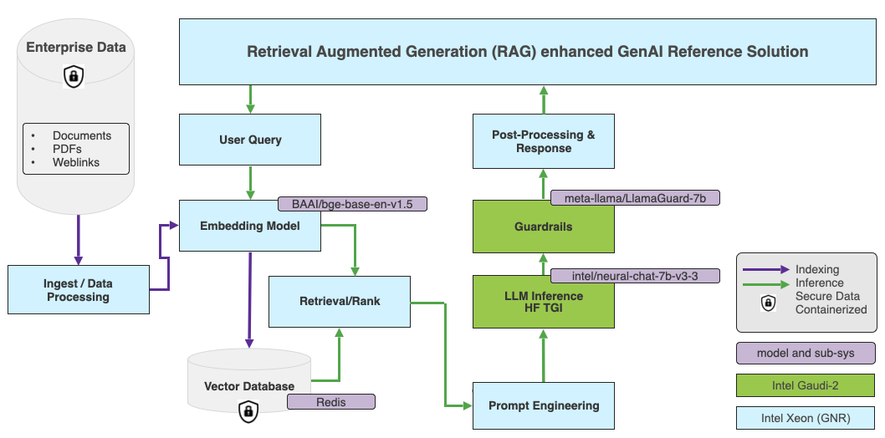

# Building Cost-Efficient Enterprise RAG applications with Intel Gaudi 2 and Intel Xeon

<p align="center">
 <br>
</p>

Retrieval-augmented generation (RAG) enhances text generation with a large language model by incorporating fresh domain knowledge stored in an external datastore. Separating your company data from the knowledge learned by language models during training is essential to balance performance, accuracy, and security privacy goals.

In this blog, you will learn how Intel can help you develop and deploy RAG applications as part of [OPEA](https://opea.dev), the Open Platform for Enterprise AI. You will also discover how Intel Gaudi 2 AI accelerators and Xeon CPUs can significantly enhance enterprise performance through a real-world RAG use case.

# Getting started 

Before diving into the details, let’s access the hardware first. [Intel Gaudi 2](https://habana.ai/products/gaudi2/) is purposely built to accelerate deep learning training and inference in the data center and cloud. It is publicly available on the [Intel Developer Cloud](https://www.intel.com/content/www/us/en/developer/tools/devcloud/overview.html) (IDC) and for on-premises implementations.  IDC is the easiest way to start with Gaudi 2. If you don’t have an account yet, please register for one, subscribe to “Premium,” and then apply for access.

On the software side, we will build our application with LangChain, an open-source framework designed to simplify the creation of AI applications with LLMs. It provides template-based solutions, allowing developers to build RAG applications with custom embeddings, vector databases, and LLMs. The LangChain documentation provides more information. Intel has been actively contributing multiple optimizations to LangChain, enabling developers to deploy GenAI applications efficiently on Intel platforms.

In LangChain, we will use the `rag-redis` template to create our RAG application, with the [BAAI/bge-base-en-v1.5](https://huggingface.co/BAAI/bge-base-en-v1.5) embedding model and Redis as the default vector database. The diagram below shows the high-level architecture.

<kbd>
  
</kbd>


The embedding model will run on an [Intel Granite Rapids](https://www.intel.com/content/www/us/en/newsroom/news/intel-unveils-future-generation-xeon.html#gs.6t3deu) CPU. The Intel Granite Rapids architecture is optimized to deliver the lowest total cost of ownership (TCO) for high-core performance-sensitive workloads and general-purpose compute workloads. GNR also supports the AMX-FP16 instruction set, resulting in a 2-3x performance increase for mixed AI workloads.

The LLM will run on an Intel Gaudi 2 accelerator. Regarding Hugging Face models, the [Optimum Habana](https://huggingface.co/docs/optimum/en/habana/index) library is the interface between the Hugging Face [Transformers](https://huggingface.co/docs/transformers/index) and [Diffusers](https://huggingface.co/docs/diffusers/index) libraries and Gaudi. It offers tools for easy model loading, training, and inference on single- and multi-card settings for various downstream tasks.

We provide a [Dockerfile](https://github.com/opea-project/GenAIExamples/tree/main/ChatQnA/langchain/docker) to streamline the setup of the LangChain development environment. Once you have launched the Docker container, you can start building the vector database, the RAG pipeline, and the LangChain application within the Docker environment. For a detailed step-by-step, follow the [ChatQnA](https://github.com/opea-project/GenAIExamples/tree/main/ChatQnA) example.


# Creating the Vector Database 

To populate the vector database, we use public financial documents from Nike. Here is the sample code. 

```
# Ingest PDF files that contain Edgar 10k filings data for Nike.
company_name = "Nike"
data_path = "data"
doc_path = [os.path.join(data_path, file) for file in os.listdir(data_path)][0]
content = pdf_loader(doc_path)
chunks = text_splitter.split_text(content)

# Create vectorstore
embedder = HuggingFaceEmbeddings(model_name=EMBED_MODEL)

_ = Redis.from_texts(
    texts=[f"Company: {company_name}. " + chunk for chunk in chunks],
    embedding=embedder,
    index_name=INDEX_NAME,
    index_schema=INDEX_SCHEMA,
    redis_url=REDIS_URL,
)
```

# Defining the RAG Pipeline

In LangChain, we use the Chain API to connect the prompt, the vector database, and the embedding model. 

The complete code is available in the [repository](https://github.com/opea-project/GenAIExamples/blob/main/ChatQnA/langchain/redis/rag_redis/chain.py).


```
# Embedding model running on Xeon CPU
embedder = HuggingFaceEmbeddings(model_name=EMBED_MODEL)

# Redis vector database
vectorstore = Redis.from_existing_index(
    embedding=embedder, index_name=INDEX_NAME, schema=INDEX_SCHEMA, redis_url=REDIS_URL
)

# Retriever
retriever = vectorstore.as_retriever(search_type="mmr")

# Prompt template
template = """…"""
prompt = ChatPromptTemplate.from_template(template)

# Hugging Face LLM running on Gaudi 2
model = HuggingFaceEndpoint(endpoint_url=TGI_LLM_ENDPOINT, …)

# RAG chain
chain = (
    RunnableParallel({"context": retriever, "question": RunnablePassthrough()}) | prompt | model | StrOutputParser()
).with_types(input_type=Question)
```

# Loading the LLM on Gaudi 2

We will run our chat model on Gaudi2 with the Hugging Face Text Generation Inference (TGI) server. This combination enables high-performance text generation for popular open-source LLMs on Gaudi2 hardware, such as MPT, Llama, and Mistral.

No setup is required. We can use a pre-built Docker image and pass the model name (e.g., Intel NeuralChat).

```
model=Intel/neural-chat-7b-v3-3
volume=$PWD/data
docker run -p 8080:80 -v $volume:/data --runtime=habana -e HABANA_VISIBLE_DEVICES=all -e OMPI_MCA_btl_vader_single_copy_mechanism=none --cap-add=sys_nice --ipc=host tgi_gaudi --model-id $model
```

The service uses a single Gaudi accelerator by default. Multiple accelerators may be required to run a larger model (e.g., 70B). In that case, please add the appropriate parameters, e.g.  `--sharded true` and `--num_shard 8`. For gated models such as [Llama](https://huggingface.co/meta-llama) or [StarCoder](https://huggingface.co/bigcode/starcoder), you will also need to specify `-e HUGGING_FACE_HUB_TOKEN=<token>` using your Hugging Face [token](https://huggingface.co/docs/hub/en/security-tokens).

Once the container runs, we check that the service works by sending a request to the TGI endpoint.

```
curl localhost:8080/generate -X POST \
-d '{"inputs":"Which NFL team won the Super Bowl in the 2010 season?", \
"parameters":{"max_new_tokens":128, "do_sample": true}}' \
-H 'Content-Type: application/json'
```

If you see a generated response, the LLM is running correctly and you can now enjoy high-performance inference on Gaudi 2!

The TGI Gaudi container utilizes the bfloat16 data type by default. For higher throughput, you may want to enable FP8 quantization. According to our test results, FP8 quantization should yield a 1.8x throughput increase gain compared to BF16.  FP8 instructions are available in the [README](https://github.com/opea-project/GenAIExamples/blob/main/ChatQnA/README.md) file.

Lastly, you can enable content moderation with the Meta [Llama Guard](https://huggingface.co/meta-llama/LlamaGuard-7b) model. The [README](https://github.com/opea-project/GenAIExamples/blob/main/ChatQnA/README.md) file provides instructions for deploying Llama Guard on TGI Gaudi.

# Running the RAG service

We use the following instructions to launch the RAG application backend service. The `server.py` script defines the service endpoints using fastAPI.

```
docker exec -it qna-rag-redis-server bash
nohup python app/server.py &
```

By default, the TGI Gaudi endpoint is expected to run on localhost at port 8080 (i.e. `http://127.0.0.1:8080`). If it is running at a different address or port, please set the `TGI_ENDPOINT ` environment variable accordingly.

# Launching the RAG GUI

We use the instructions below to install the frontend GUI components.

```
sudo apt-get install npm && \
    npm install -g n && \
    n stable && \
    hash -r && \
    npm install -g npm@latest
```

Then, we update the `DOC_BASE_URL` environment variable in the `.env` file by replacing the localhost IP address (`127.0.0.1`) with the actual IP address of the server where the GUI runs.

We run the following command to install the required dependencies:

```
npm install
```
Finally, we start the GUI server with the following command:

```
nohup npm run dev &
```

This will run the frontend service and launch the application.

<kbd>
  
</kbd>

# Benchmark Results

We did intensive experiments with different models and configurations. The two figures below show the relative end-to-end throughput and performance per dollar comparison for the Llama2-70B model with 16 concurrent users on four Intel Gaudi 2 and four Nvidia H100 platforms. 

<kbd>
  
</kbd>

<kbd>
  
</kbd>


In both cases, the same Intel Granite Rapids CPU platform is used for vector databases and embedding models. For performance per dollar comparison, we use publicly available pricing to compute an average training performance per dollar, the same as the one reported by the [MosaicML](https://www.databricks.com/blog/llm-training-and-inference-intel-gaudi2-ai-accelerators) team in January 2024.
 
As you can see, the H100-based system has 1.13x more throughput but can only deliver 0.44x performance per dollar compared to Gaudi 2. These comparisons may vary based on customer-specific discounts on different cloud providers. Detailed benchmark configurations are listed at the end of the post.

# Conclusion

The example above deployment successfully demonstrates a RAG-based chatbot on Intel platforms. Furthermore, as Intel keeps releasing ready-to-go GenAI examples, developers benefit from validated tools that simplify the creation and deployment process. These examples offer versatility and ease of customization, making them ideal for a wide range of applications on Intel platforms. 

When running enterprise AI applications, the total cost of ownership is more favorable with systems based on Intel Granite Rapids CPUs and Gaudi 2 accelerators. Further improvements can be achieved with FP8 optimization. 

The following developer resources should help you kickstart your GenAI projects confidently. 

* [OPEA GenAI examples](https://github.com/opea-project/GenAIExamples)
* [Text Generation Inference on Gaudi 2](https://github.com/huggingface/tgi-gaudi)
* [Intel AIML Ecosystem: Hugging Face](https://www.intel.com/content/www/us/en/developer/ecosystem/hugging-face.html)
* [The Intel organization page on the Hugging Face hub](https://huggingface.co/Intel)

If you have questions or feedback, we'd love to answer them on the [Hugging Face forum](https://discuss.huggingface.co/). Thanks for reading!

**Acknowledgements**:
We want to thank Chaitanya Khened, Suyue Chen, Mikolaj Zyczynski, Wenjiao Yue, Wenxin Zhang, Letong Han, Sihan Chen, Hanwen Cheng, Yuan Wu, and Yi Wang for their outstanding contributions to building enterprise-grade RAG systems on Intel Gaudi 2.


---

**Benchmark configurations**

* Gaudi2 configurations: HLS-Gaudi2 with eight Habana Gaudi2 HL-225H Mezzanine cards and two Intel® Xeon® Platinum 8380 CPU @ 2.30GHz, and 1TB of System Memory; OS: Ubuntu 22.04.03, 5.15.0 kernel

* H100 SXM Configurations: Lambda labs instance gpu_8x_h100_sxm5; 8xH100 SXM and Two Intel Xeon® Platinum 8480 CPU@2 GHz and 1.8TB of system memory; OS ubuntu 20.04.6 LTS, 5.15.0 kernel

* Intel Xeon: Pre-production Granite Rapids platform with 2Sx120C @ 1.9GHz and 8800 MCR DIMMs with 1.5TB system memory. OS: Cent OS 9, 6.2.0 kernel

* Llama2 70B is deployed to 4 cards (queries normalized to 8 cards). BF16 for Gaudi2 and FP16 for H100. 

* Embedding model is BAAI/bge-base v1.5. Tested with: TGI-gaudi 1.2.1, TGI-GPU 1.4.5 Python 3.11.7, Langchain 0.1.11, sentence-transformers 2.5.1, langchain benchmarks 0.0.10, redis 5.0.2, cuda 12.2.r12.2/compiler.32965470 0, TEI 1.2.0, 

* RAG queries max input length 1024, max output length 128. Test dataset: langsmith Q&A. Number of concurrent clients 16

* TGI parameters for Gaudi2 (70B): `batch_bucket_size=22`, `prefill_batch_bucket_size=4`, `max_batch_prefill_tokens=5102`, `max_batch_total_tokens=32256`, `max_waiting_tokens=5`, `streaming=false`

* TGI parameters for H100 (70B): `batch_bucket_size=8`, `prefill_batch_bucket_size=4`, `max_batch_prefill_tokens=4096`, `max_batch_total_tokens=131072`, `max_waiting_tokens=20`, `max_batch_size=128`, `streaming=false`

* TCO Reference: [https://www.databricks.com/blog/llm-training-and-inference-intel-gaudi2-ai-accelerators](https://www.databricks.com/blog/llm-training-and-inference-intel-gaudi2-ai-accelerators)


