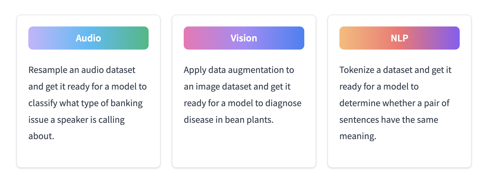

<h1>
    Introducing new audio and vision documentation in 🤗 Datasets
</h1>

<div class="blog-metadata">
    <small>Published July 11, 2022.</small>
    <a target="_blank" class="btn no-underline text-sm mb-5 font-sans" href="https://github.com/huggingface/blog/blob/main/datasets-docs-update.md">
        Update on GitHub
    </a>
</div>

<div class="author-card">
    <a href="/stevhliu"> 
        
        <div class="bfc">
            <code>stevhliu</code>
            <span class="fullname">Steven Liu</span>
        </div>
    </a>
</div>

Open and reproducible datasets are essential for advancing good machine learning. At the same time, datasets have grown tremendously in size as rocket fuel for large language models. In 2020 we launched `nlp`, a library dedicated to:

1. Providing access to standardized datasets with a single line of code.
2. Tools for rapidly and efficiently processing large-scale datasets.

Thanks to the community, we added hundreds of NLP datasets in many languages and dialects during the [Datasets Sprint](https://discuss.huggingface.co/t/open-to-the-community-one-week-team-effort-to-reach-v2-0-of-hf-datasets-library/2176)! 🤗 ❤️ But text datasets are just the beginning.

Data is represented in other richer formats like audio, image, and even a combination of audio and text or image and text. Models trained on these types of datasets enable awesome applications like creating a 3D semantic scene from a single monocular RGB image!

<div class="hidden xl:block">
<div style="display: flex; flex-direction: column; align-items: center;">
<iframe src="https://hf.space/embed/CVPR/MonoScene/+
" frameBorder="0" width="1400" height="690" title="Gradio app" class="p-0 flex-grow space-iframe" allow="accelerometer; ambient-light-sensor; autoplay; battery; camera; document-domain; encrypted-media; fullscreen; geolocation; gyroscope; layout-animations; legacy-image-formats; magnetometer; microphone; midi; oversized-images; payment; picture-in-picture; publickey-credentials-get; sync-xhr; usb; vr ; wake-lock; xr-spatial-tracking" sandbox="allow-forms allow-modals allow-popups allow-popups-to-escape-sandbox allow-same-origin allow-scripts allow-downloads"></iframe>
</div>
</div>

The 🤗 Datasets team has been building tools and features to make working with these dataset types as simple as possible for the best user experience. We’ve added some new documentation along the way to help you learn more about loading and processing audio and image datasets.

## Quickstart

The [quickstart](https://huggingface.co/docs/datasets/master/en/quickstart) is one of the first places new users visit for a TLDR about a library’s features. That’s why it was important for us to update the Quickstart to include how you can use 🤗 Datasets to work with audio and image datasets. Choose a dataset modality you want to work with and see an end-to-end example of how to load and process the dataset to get it ready for training with either PyTorch or TensorFlow.

Also new in our Quickstart is the `to_tf_dataset` function which takes care of converting a dataset into a `tf.data.Dataset` like a mama bear taking care of her cubs. This means you don’t have to write any code yourself - shuffle and load batches of data - to get your dataset to play nicely with TensorFlow. Once you’ve converted your dataset into a `tf.data.Dataset`, you can train your model with the usual TensorFlow or Keras methods.

Check out the [quickstart](https://huggingface.co/docs/datasets/master/en/quickstart) today to learn how to work with different dataset modalities, and try out the new `to_tf_dataset` function!

<figure class="image table text-center m-0 w-full">
  
  <figcaption>Choose your dataset adventure!</figcaption>
</figure>

## Dedicated guides

Each dataset modality have specific nuances on how to load and process them. For example, when you load an audio dataset, the audio signal is automatically decoded and resampled on-the-fly by the `Audio` feature. This is quite different from loading a text dataset!

To make all of the modality specific documentation more discoverable, we created dedicated sections with guides focused on showing you how to load and process each modality. If you’re looking for specific information about working with a dataset modality, take a look at these dedicated sections first. Meanwhile, functions that are non-specific and can be used broadly are documented in the General Usage section. Reorganizing the documentation in this way will allow us to better scale to other dataset types we plan to support in the future.

<figure class="image table text-center m-0 w-full">
  
  <figcaption></figcaption>
</figure>

Take a look at the [dedicated guides](insert link to guides overview) to learn more about loading and processing datasets for different modalities.

## ImageFolder

Typically, 🤗 Datasets users [write a dataset loading script](insert link to guide) to download and generate a dataset with the appropriate `train` and `test` splits. With the `ImageFolder` dataset builder, you don’t need to write any code to download and generate an image dataset. Loading an image dataset for image classification is as simple as ensuring your dataset is organized in a folder like:

```py
folder/train/dog/golden_retriever.png
folder/train/dog/german_shepherd.png
folder/train/dog/chihuahua.png

folder/train/cat/maine_coon.png
folder/train/cat/bengal.png
folder/train/cat/birman.png
```

<figure class="image table text-center m-0 w-full">
  
  <figcaption>Your dataset should look something like this once you've uploaded it to the Hub and preview it.</figcaption>
</figure>

Image labels are even generated in a `label` column for you based on the directory name. `ImageFolder` allows you to get started instantly with an image dataset, eliminating the time and effort required to write a dataset loading script.

But wait, it gets even better. If you have a file containing some metadata about your image dataset, `ImageFolder` can be used for other image tasks like image captioning and object detection. For example, object detection datasets commonly have *bounding boxes*, coordinates in an image that identify where an object is. `ImageFolder` can use this file to link the metadata about the bounding box and category for each image to the corresponding images in the folder:

```py
{"file_name": "0001.png", "objects": {"bbox": [[302.0, 109.0, 73.0, 52.0]], "categories": [0]}}
{"file_name": "0002.png", "objects": {"bbox": [[810.0, 100.0, 57.0, 28.0]], "categories": [1]}}
{"file_name": "0003.png", "objects": {"bbox": [[160.0, 31.0, 248.0, 616.0], [741.0, 68.0, 202.0, 401.0]], "categories": [2, 2]}}

dataset = load_dataset("imagefolder", data_dir="/path/to/folder", split="train")
dataset[0]["objects"]
{"bbox": [[302.0, 109.0, 73.0, 52.0]], "categories": [0]}
```

You can use `ImageFolder` to load an image dataset for nearly any type of image task if you have a metadata file with the required information. Check out the [ImageFolder](https://huggingface.co/docs/datasets/master/en/image_process) guide to learn more.

## What’s next?

Similar to how the first iteration of our `nlp` library standardized text datasets and made them super easy to download and process, we are very excited to bring this same level of user friendliness to audio and image datasets. In doing so, we hope it’ll be easier for users to train, build, and evaluate models and applications across all different modalities.

In the coming months, we’ll continue to add new features and tools to support working with audio and image datasets. Word on the Hugging Face street is that there’ll be something called `AudioFolder` coming soon! 🤫 While you wait, feel free to take a look at the audio processing guide and then get hands-on with an audio dataset like [GigaSpeech](https://huggingface.co/datasets/speechcolab/gigaspeech).

---

Join the [forum](https://discuss.huggingface.co/) for any questions and feedback related to working with audio and image datasets. If you discover any bugs, please open a [GitHub Issue](https://github.com/huggingface/datasets/issues/new/choose) so we can take care of it.

Feeling a little more adventurous? Contribute to the growing community-driven collection of audio and image datasets on the [Hub](https://huggingface.co/datasets)! [Create a dataset repository](https://huggingface.co/docs/datasets/master/en/upload_dataset) on the Hub and upload your dataset. If you need a hand, open a discussion on your repository’s **Community tab** and ping one of the 🤗 Datasets team members to help you cross the finish line!
