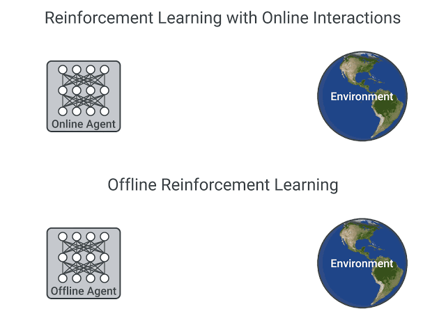
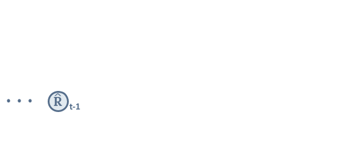
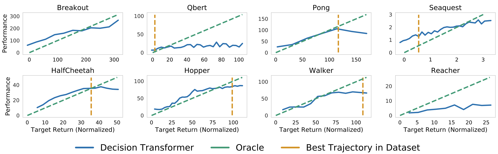

# Introducing Decision Transformers on Hugging Face 🤗

<div class="blog-metadata">
    <small>Published March 28, 2022.</small>
    <a target="_blank" class="btn no-underline text-sm mb-5 font-sans" href="https://github.com/huggingface/blog/blob/main/decision-transformers.md">
        Update on GitHub
    </a>
</div>

<div class="author-card">
    <a href="/edbeeching"> 
        
        <div class="bfc">
            <code>edbeeching</code>
            <span class="fullname">Edward Beeching</span>
        </div>
    </a>
    <a href="/ThomasSimonini"> 
        
        <div class="bfc">
            <code>ThomasSimonini</code>
            <span class="fullname">Thomas Simonini</span>
        </div>
    </a>
</div>

At Hugging Face, we are contributing to the ecosystem for Deep Reinforcement Learning researchers and enthusiasts. Recently, we have integrated Deep RL frameworks such as [Stable-Baselines3](https://github.com/DLR-RM/stable-baselines3). 

And today we are happy to announce that we integrated the [Decision Transformer](https://arxiv.org/abs/2106.01345), an Offline Reinforcement Learning method, into the 🤗 transformers library and the Hugging Face Hub. We have some exciting plans for improving accessibility in the field of Deep RL and we are looking forward to sharing them with you over the coming weeks and months.

- [What is Offline Reinforcement Learning?](#what-is-offline-reinforcement-learning?)
- [Introducing Decision Transformers](#introducing-decision-transformers)
- [Using the Decision Transformer in 🤗 Transformers](#using-the-decision-transformer-in--transformers)
- [Conclusion](#conclusion)
- [What's next?](#whats-next)
- [References](#references)

## What is Offline Reinforcement Learning?

Deep Reinforcement Learning (RL) is a framework to build decision-making agents. These agents aim to learn optimal behavior (policy) by interacting with the environment through trial and error and receiving rewards as unique feedback.

The agent’s goal is to maximize **its cumulative reward, called return.** Because RL is based on the reward hypothesis: **all goals can be described as the maximization of the expected cumulative reward.**

Deep Reinforcement Learning agents **learn with batches of experience.** The question is, how do they collect it?:



*A comparison between Reinforcement Learning in an Online and Offline setting, figure taken from [this post](https://offline-rl.github.io/)*

In online reinforcement learning, **the agent gathers data directly**: it collects a batch of experience by interacting with the environment. Then, it uses this experience immediately (or via some replay buffer) to learn from it (update its policy).

But this implies that either you train your agent directly in the real world or have a simulator. If you don’t have one, you need to build it, which can be very complex (how to reflect the complex reality of the real world in an environment?), expensive, and insecure since if the simulator has flaws, the agent will exploit them if they provide a competitive advantage. 

On the other hand, in offline reinforcement learning, the agent only uses data collected from other agents or human demonstrations. **It does not interact with the environment**.

The process is as follows:

1. Create a dataset using one or more policies and/or human interactions.
2. Run offline RL on this dataset to learn a policy

This method has one drawback: the counterfactual queries problem. What do we do if our agent decides to do something for which we don’t have the data? For instance, turning right on an intersection but we don’t have this trajectory. 

There’s already exists some solutions on this topic, but if you want to know more about offline reinforcement learning you can watch [this video](https://www.youtube.com/watch?v=k08N5a0gG0A)

## Introducing Decision Transformers

The Decision Transformer model was introduced by [“Decision Transformer: Reinforcement Learning via Sequence Modeling” by Chen L. et al](https://arxiv.org/abs/2106.01345). It abstracts Reinforcement Learning as a **conditional-sequence modeling problem**.

The main idea is that instead of training a policy using RL methods, such as fitting a value function, that will tell us what action to take to maximize the return (cumulative reward), we use a sequence modeling algorithm (Transformer) that, given a desired return, past states, and actions, will generate future actions to achieve this desired return. It’s an autoregressive model conditioned on the desired return, past states, and actions to generate future actions that achieve the desired return.

This is a complete shift in the Reinforcement Learning paradigm since we use generative trajectory modeling (modeling the joint distribution of the sequence of states, actions, and rewards) to replace conventional RL algorithms. It means that in Decision Transformers, we don’t maximize the return but rather generate a series of future actions that achieve the desired return.

The process goes this way:

1. We feed the last K timesteps into the Decision Transformer with 3 inputs:
    - Return-to-go
    - State
    - Action
2. The tokens are embedded either with a linear layer if the state is a vector or CNN encoder if it’s frames.
3. The inputs are processed by a GPT-2 model which predicts future actions via autoregressive modeling.


*Decision Transformer architecture. States, actions, and returns are fed into modalityspecific linear embeddings and a positional episodic timestep encoding is added. Tokens are fed into a GPT architecture which predicts actions autoregressively using a causal self-attention mask. Figure from [1].*

## Using the Decision Transformer in 🤗 Transformers

The Decision Transformer model is now available as part of the 🤗 transformers library. In addition, we share [nine pre-trained model checkpoints for continuous control tasks in the Gym environment](https://huggingface.co/models?other=gym-continous-control).

<figure class="image table text-center m-0 w-full">
    <video 
        alt="WalkerEd-expert"
        style="max-width: 70%; margin: auto;"
        autoplay loop autobuffer muted playsinline
    >
      <source src="assets/58_decision-transformers/walker2d-expert.mp4" type="video/mp4">
  </video>
</figure>
*An “expert” Decision Transformers model, learned using offline RL in the Gym Walker2d environment.*

### Loading the model

Using the Decision Transformer is relatively easy, but as it is an autoregressive model, some care has to be taken in order to prepare the model’s inputs at each time-step. We have prepared both a [Python script](https://github.com/huggingface/transformers/blob/main/examples/research_projects/decision_transformer/run_decision_transformer.py) and a [Colab notebook](https://colab.research.google.com/drive/1K3UuajwoPY1MzRKNkONNRS3gS5DxZ-qF?usp=sharing) that demonstrates how to use this model.

Loading a pretrained Decision Transformer is simple in the 🤗 transformers library:
`````python
from transformers import DecisionTransformerModel

model_name = "edbeeching/decision-transformer-gym-hopper-expert"
model = DecisionTransformerModel.from_pretrained(model_name)
``````
### Creating the environment

We provide pretrained checkpoints for the Gym Hopper, Walker2D and Halfcheetah. Checkpoints for Atari environments will soon be available.
`````python
import gym
env = gym.make("Hopper-v3")
state_dim = env.observation_space.shape[0] # state size
act_dim = env.action_space.shape[0] # action size
``````
### Autoregressive prediction function

The model performs an [autoregressive prediction](https://en.wikipedia.org/wiki/Autoregressive_model); that is to say that predictions made at the current time-step **t** are sequentially conditioned on the outputs from previous time-steps. This function is quite meaty, so we will aim to explain it in the comments.

`````python
# Function that gets an action from the model using autoregressive prediction 
# with a window of the previous 20 timesteps.
def get_action(model, states, actions, rewards, returns_to_go, timesteps):
    # This implementation does not condition on past rewards

    states = states.reshape(1, -1, model.config.state_dim)
    actions = actions.reshape(1, -1, model.config.act_dim)
    returns_to_go = returns_to_go.reshape(1, -1, 1)
    timesteps = timesteps.reshape(1, -1)

		# The prediction is conditioned on up to 20 previous time-steps
    states = states[:, -model.config.max_length :]
    actions = actions[:, -model.config.max_length :]
    returns_to_go = returns_to_go[:, -model.config.max_length :]
    timesteps = timesteps[:, -model.config.max_length :]
    
    # pad all tokens to sequence length, this is required if we process batches
		padding = model.config.max_length - states.shape[1]
    attention_mask = torch.cat([torch.zeros(padding), torch.ones(states.shape[1])])
    attention_mask = attention_mask.to(dtype=torch.long).reshape(1, -1)
    states = torch.cat([torch.zeros((1, padding, state_dim)), states], dim=1).float()
    actions = torch.cat([torch.zeros((1, padding, act_dim)), actions], dim=1).float()
    returns_to_go = torch.cat([torch.zeros((1, padding, 1)), returns_to_go], dim=1).float()
    timesteps = torch.cat([torch.zeros((1, padding), dtype=torch.long), timesteps], dim=1)

		# perform the prediction
    state_preds, action_preds, return_preds = model(
        states=states,
        actions=actions,
        rewards=rewards,
        returns_to_go=returns_to_go,
        timesteps=timesteps,
        attention_mask=attention_mask,
        return_dict=False,
    )

    return action_preds[0, -1]
``````
### Evaluating the model

In order to evaluate the model, we need some additional information; the mean and standard deviation of the states that were used during training. Fortunately, these are available for each of the checkpoint’s [model card](https://huggingface.co/edbeeching/decision-transformer-gym-hopper-expert) on the Hugging Face Hub! 

We also need a target return for the model. This is the power of Offline Reinforcement Learning: we can use the target return to control the performance of the policy. This could be really powerful in a multiplayer setting, where we would like to adjust the performance of an opponent bot to be at a suitable difficulty for the player. The authors show a great plot of this in their paper!


*Sampled (evaluation) returns accumulated by Decision Transformer when conditioned on
the specified target (desired) returns. Top: Atari. Bottom: D4RL medium-replay datasets. Figure from [1].*

``````python
TARGET_RETURN = 3.6 # This was normalized during training
MAX_EPISODE_LENGTH = 1000 

state_mean = np.array(
    [1.3490015,  -0.11208222, -0.5506444,  -0.13188992, -0.00378754,  2.6071432,
     0.02322114, -0.01626922, -0.06840388, -0.05183131,  0.04272673,])

state_std = np.array(
    [0.15980862, 0.0446214,  0.14307782, 0.17629202, 0.5912333,  0.5899924,
		 1.5405099,  0.8152689,  2.0173461,  2.4107876,  5.8440027,])

state_mean = torch.from_numpy(state_mean)
state_std = torch.from_numpy(state_std)

state = env.reset()
target_return = torch.tensor(TARGET_RETURN).float().reshape(1, 1)
states = torch.from_numpy(state).reshape(1, state_dim).float()
actions = torch.zeros((0, act_dim)).float()
rewards = torch.zeros(0).float()
timesteps = torch.tensor(0).reshape(1, 1).long()

# take steps in the environment
for t in range(max_ep_len):
    # add zeros for actions as input for the current time-step
    actions = torch.cat([actions, torch.zeros((1, act_dim))], dim=0)
    rewards = torch.cat([rewards, torch.zeros(1)])

		# prediction the action to take
    action = get_action(model,
                        (states - state_mean) / state_std,
                        actions,
                        rewards,
                        target_return,
                        timesteps)
    actions[-1] = action
    action = action.detach().numpy()

		# interact with the environment based on this action
    state, reward, done, _ = env.step(action)

    cur_state = torch.from_numpy(state).reshape(1, state_dim)
    states = torch.cat([states, cur_state], dim=0)
    rewards[-1] = reward

    pred_return = target_return[0, -1] - (reward / scale)
    target_return = torch.cat([target_return, pred_return.reshape(1, 1)], dim=1)
    timesteps = torch.cat([timesteps, torch.ones((1, 1)).long() * (t + 1)], dim=1)

    if done:
        break
``````
You will find a more detailed example, with the creation of videos of the agent in our [Colab notebook](https://colab.research.google.com/drive/1K3UuajwoPY1MzRKNkONNRS3gS5DxZ-qF?usp=sharing).

## Conclusion

The integration of the Decision Transformer model is just one of the tools we're building. But, we want to support more use cases and tools from the Deep Reinforcement Learning community.  It would be great to hear your feedback on the Decision Transformer model, and more generally anything we can build with you that would be useful for RL. Feel free to **[reach out to us](mailto:thomas.simonini@huggingface.co)**. 

## What’s next?

In the coming weeks and months, we plan on supporting other tools from the ecosystem:

- Integrating **[RL-baselines3-zoo](https://github.com/DLR-RM/rl-baselines3-zoo)**
- Uploading **[RL-trained-agents models](https://github.com/DLR-RM/rl-trained-agents)** into the Hub: a big collection of pre-trained Reinforcement Learning agents using stable-baselines3
- Integrating other Deep Reinforcement Learning libraries
- Implementing Convolutional Decision Transformers For Atari
- And more to come 🥳

The best way to keep in touch is to **[join our discord server](https://discord.gg/YRAq8fMnUG)** to exchange with us and with the community.

## References

[1] Chen, Lili, et al. "Decision transformer: Reinforcement learning via sequence modeling." *Advances in neural information processing systems* 34 (2021).

[2] Agarwal, Rishabh, Dale Schuurmans, and Mohammad Norouzi. "An optimistic perspective on offline reinforcement learning." *International Conference on Machine Learning*. PMLR, 2020.

### Acknowledgements
We would like to thank the paper’s first authors, Kevin Lu and Lili Chen, for their constructive conversations.
