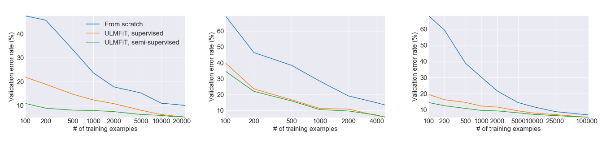
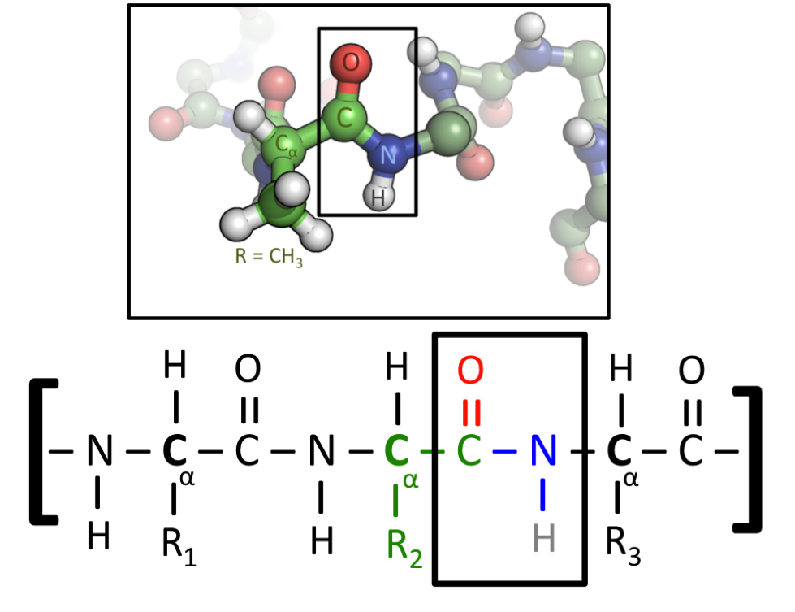
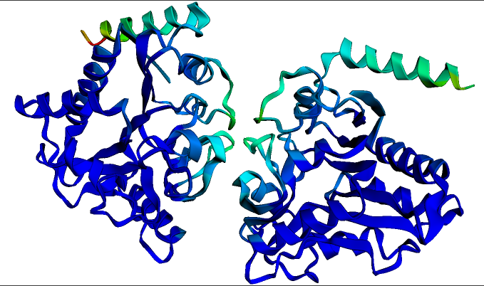

# Deep Learning With Proteins

    <small>Published December 2, 2022.</small>
    <a target="_blank" class="btn no-underline text-sm mb-5 font-sans" href="https://github.com/huggingface/blog/blob/main/deep-learning-with-proteins.md">
        Update on GitHub
    </a>

    <a href="/rocketknight1">
        
        

            <code>rocketknight1</code>
            Matthew Carrigan
        

    </a>

I have two audiences in mind while writing this. One is biologists who are trying to get into machine learning, and the other is machine learners who are trying to get into biology. If you’re not familiar with either biology or machine learning then you’re still welcome to come along, but you might find it a bit confusing at times! And if you’re already familiar with both, then you probably don’t need this post at all - you can just skip straight to our example notebooks to see these models in action:

- Fine-tuning protein language models ([PyTorch](https://colab.research.google.com/github/huggingface/notebooks/blob/main/examples/protein_language_modeling.ipynb), [TensorFlow](https://colab.research.google.com/github/huggingface/notebooks/blob/main/examples/protein_language_modeling-tf.ipynb))
- Protein folding with ESMFold ([PyTorch](https://colab.research.google.com/github/huggingface/notebooks/blob/main/examples/protein_folding.ipynb) only for now because of `openfold` dependencies)

## Introduction for biologists: What the hell is a language model?

The models used to handle proteins are heavily inspired by large language models like BERT and GPT. So to understand how these models work we’re going to go back in time to 2016 or so, before they existed. Donald Trump hasn’t been elected yet, Brexit hasn’t yet happened, and Deep Learning (DL) is the hot new technique that’s breaking new records every day. The key to DL’s success is that it uses artificial neural networks to learn complex patterns in data. DL has one critical problem, though - it needs a **lot** of data to work well, and on many tasks that data just isn’t available.

Let’s say that you want to train a DL model to take a sentence in English as input and decide if it’s grammatically correct or not. So you assemble your training data, and it looks something like this:

| Text | Label |
| --- | --- |
| The judge told the jurors to think carefully. | Correct |
| The judge told that the jurors to think carefully. | Incorrect |
| … | … |

In theory, this task was completely possible at the time - if you fed training data like this into a DL model, it could learn to predict whether new sentences were grammatically correct or not. In practice, it didn’t work so well, because in 2016 most people randomly initialized a new model for each task they wanted to train them on. This meant that **models had to learn everything they needed to know just from the examples in the training data!**

To understand just how difficult that is, pretend you’re a machine learning model and I’m giving you some training data for a task I want you to learn. Here it is:

| Text | Label |
| --- | --- |
| Is í an stiúrthóir is fearr ar domhan! | 1 |
| Is fuath liom an scannán seo. | 0 |
| Scannán den scoth ab ea é. | 1 |
| D’fhág mé an phictiúrlann tar éis fiche nóiméad! | 0 |

I chose a language here that I’m hoping you’ve never seen before, and so I’m guessing you probably don’t feel very confident that you’ve learned this task. Maybe after hundreds or thousands of examples you might start to notice some recurring words or patterns in the inputs, and you might be able to make guesses that were better than random chance, but even then a new word or unusual phrasing would definitely be able to throw you and make you guess incorrectly. Not coincidentally, that’s about how well DL models performed at the time too!

Now try the same task, but in English:

| Text | Label |
| --- | --- |
| She’s the best director in the world! | 1 |
| I hate this movie. | 0 |
| It was an absolutely excellent film. | 1 |
| I left the cinema after twenty minutes! | 0 |

Now it’s easy - the task is just predicting whether a movie review is positive (1) or negative (0). With just two positive examples and two negative examples, you could probably do this task with close to 100% accuracy, because **you already have a vast pre-existing knowledge of English vocabulary and grammar, as well as cultural context surrounding movies and emotional expression.** Without that knowledge, things are more like the first task - you would need to read a huge number of examples before you begin to spot even superficial patterns in the inputs, and even if you took the time to study hundreds of thousands of examples your guesses would still be far less accurate than they are after only four examples in the English language task.

### The critical breakthrough: Transfer learning

In machine learning, we call this concept of transferring prior knowledge to a new task “**transfer learning**”. Getting this kind of transfer learning to work for DL was a major goal for the field around 2016. Things like pre-trained word vectors (which are very interesting, but outside the scope of this blogpost!) did exist by 2016 and allowed some knowledge to be transferred to new models, but this knowledge transfer was still relatively superficial, and models still needed large amounts of training data to work well.

This stage of affairs continued until 2018, when two huge papers landed, introducing the models [ULMFiT](https://arxiv.org/abs/1801.06146) and later [BERT](https://arxiv.org/abs/1810.04805). These were the first papers that got transfer learning in natural language to work really well, and BERT in particular marked the beginning of the era of pre-trained large language models. The trick, shared by both papers, is that they took advantage of the internal structure of the artificial neural networks in deep learning - they trained a neural net for a long time on a text task where training data was very abundant, and then they just copied the whole neural network to a new task, changing only the few neurons that corresponded to the network’s output.

*This figure from [the ULMFiT paper](https://arxiv.org/abs/1801.06146) shows the enormous gains in performance from using transfer learning versus training a model from scratch on three separate tasks. In many cases, using transfer learning yields performance equivalent to having more than 100X as much training data. And don’t forget that this was published in 2018 - modern large language models can do even better!*

The reason this works is that in the process of solving any non-trivial task, neural networks learn a lot of the structure of the input data - visual networks, given raw pixels, learn to identify lines and curves and edges; text networks, given raw text, learn details of grammatical structure. This information is not task-specific, however - the key reason transfer learning works is that **a lot of what you need to know to solve a task is not specific to that task!** To classify movie reviews you didn’t need to know a lot about movie reviews, but you did need a vast knowledge of English and cultural context. By picking a task where training data is abundant, we can get a neural network to learn that sort of “domain knowledge” and then later apply it to new tasks we care about, where training data might be a lot harder to come by.

At this point, hopefully you understand what transfer learning is, and that a large language model is just a big neural network that’s been trained on lots of text data, which makes it a prime candidate for transferring to new tasks. We’ll see how these same techniques can be applied to proteins below, but first I need to write an introduction for the other half of my audience. Feel free to skip this next bit if you’re already familiar!

## Introduction for machine learning people: What the hell is a protein?

To condense an entire degree into one sentence: Proteins do a lot of stuff. Some proteins are **enzymes** - they act as catalysts for chemical reactions. When your body converts nutrients to energy, each step of the path from food to muscle movement is catalyzed by an enzyme. Some proteins are **structural -** they give stability and shape, for example in connective tissue. If you’ve ever seen a cosmetics advertisement you’ve probably seen words like **collagen** and **elastin** and **keratin -** these are proteins that form a lot of the structure of our skin and hair. 

Other proteins are critical in health and disease - everyone probably remembers endless news reports on the **spike protein** of the COVID-19 virus. The COVID spike protein binds to a protein called ACE2 that is found on the surface of human cells, which allows it to enter the cell and deliver its payload of viral RNA. Because this interaction was so critical to infection, modelling these proteins and their interactions was a huge focus during the pandemic. 

Proteins are composed of multiple **amino acids.** Amino acids are relatively simple molecules that all share the same molecular backbone, and the chemistry of this backbone allows amino acids to fuse together, so that the individual molecules can become a long chain. The critical thing to understand here is that there are only a few different amino acids - 20 standard ones, plus maybe a couple of rare and weird ones depending on the specific organism in question. What gives rise to the huge diversity of proteins is that these **amino acids can be combined in any order,** and the resulting protein chain can have vastly different shapes and functions as a result, as different parts of the chain stick and fold onto each other. Think of text as an analogy here - English only has 26 letters, and yet think of all the different kinds of things you can write with combinations of those 26 letters!

In fact, because there are so few amino acids, biologists can assign a unique letter of the alphabet to each one. This means that you can write a protein just as a text string! For example, let’s say a protein has the amino acids Methionine, Alanine and Histidine in a chain. The [corresponding letters](https://en.wikipedia.org/wiki/Amino_acid#Table_of_standard_amino_acid_abbreviations_and_properties) for those amino acids are just M, A and H, and so we could write that chain as just “MAH”. Most proteins contain hundreds or even thousands of amino acids rather than just three, though!

*This figure shows two representations of a protein. All amino acids contain a Carbon-Carbon-Nitrogen sequence. When amino acids are fused into a protein, this repeated pattern will run throughout its entire length, where it is called the protein’s “backbone”. Amino acids differ, however, in their “side chain”, which is the name given to the atoms attached to this C-C-N backbone. The lower figure uses generic side chains labelled as R1, R2 and R3, which could be any amino acid. In the upper figure, the central amino acid has a CH3 side chain - this identifies it as the amino acid* Alanine, *which is represented by the letter A.* ([Image source](https://commons.wikimedia.org/wiki/File:Peptide-Figure-Revised.png))

Even though we can write them as text strings, proteins aren’t actually a “language”, at least not any kind of language that Noam Chomsky would recognize. But they do have a few language-like features that make them a very similar domain to text from a machine learning perspective: Proteins are long strings in a fixed, small alphabet, and although any string is possible in theory, in practice only a very small subset of strings actually make “sense”. Random text is garbage, and random proteins are just a shapeless blob.

Also, information is lost if you just consider parts of a protein in isolation, in the same way that information is lost if you just read a single sentence extracted from a larger text. A region of a protein may only assume its natural shape in the presence of other parts of the protein that stabilize and correct that shape! This means that long-range interactions, of the kind that are well-captured by global self-attention, are very important to modelling proteins correctly. 

At this point, hopefully you have a vague idea of what a protein is and why biologists care about them so much - despite their small ‘alphabet’ of amino acids, they have a vast diversity of structure and function, and being able to understand and predict those structures and functions just from looking at the raw ‘string’ of amino acids would be an extremely valuable research tool.

## Bringing it together: Machine learning with proteins

So now we've seen how transfer learning with language models works, and we've seen what proteins are. And once you have that background, the next step isn't too hard - we can use the same transfer learning ideas on proteins! Instead of pre-training a model on a task involving English text, we train it on a task where the inputs are proteins, but where a lot of training data is available. Once we've done that, our model has hopefully learned a lot about the structure of proteins, in the same way that language models learn a lot about the structure of language. That makes pre-trained protein models a prime candidate for transferring to any other protein-based task!

What kind of machine learning tasks do biologists care about training protein models on? The most famous protein modelling task is **protein folding**. The task here is to, given the amino acid chain like “MLKNV…”, predict the final shape that protein will fold into. This is an enormously important task, because accurately predicting the shape and structure of a protein gives a lot of insights into what the protein does, and how it does it. 

People have been studying this problem since long before modern machine learning - some of the earliest massive distributed computing projects like Folding@Home used atomic-level simulations at incredible spatial and temporal resolution to model protein folding, and there is an entire field of *protein crystallography* that uses X-ray diffraction to observe the structure of proteins isolated from living cells.

Like a lot of other fields, though, the arrival of deep learning changed everything. AlphaFold and especially AlphaFold2 used transformer deep learning models with a number of protein-specific additions to achieve exceptional results at predicting the structure of novel proteins just from the raw amino acid sequence. If protein folding is what you’re interested in, we highly recommend checking out [our ESMFold notebook](https://colab.research.google.com/github/huggingface/notebooks/blob/main/examples/protein_folding.ipynb) - ESMFold is a new model that’s similar to AlphaFold2, but it’s more of a ‘pure’ deep learning model that does not require any external databases or search steps to run. As a result, the setup process is much less painful and the model runs much more quickly, while still retaining outstanding accuracy.

*The predicted structure for the homodimeric* P. multocida *protein **Glucosamine-6-phosphate deaminase**. This structure and visualization was generated in seconds using the ESMFold notebook linked above. Darker blue colours indicate regions of highest structure confidence.*

Protein folding isn’t the only task of interest, though! There are a wide range of classification tasks that biologists might want to do with proteins - maybe they want to predict which part of the cell that protein will operate in, or which amino acids in the protein will receive certain modifications after the protein is created. In the language of machine learning, tasks like these are called **sequence classification** when you want to classify the entire protein (for example, predicting its subcellular localization), or **token classification** when you want to classify each amino acid (for example, predicting which individual amino acids will receive post-translational modifications).

The key takeaway, though, is that even though proteins are very different to language, they can be handled by almost exactly the same machine learning approach - large-scale pre-training on a big database of protein sequences, followed by **transfer learning** to a wide range of tasks of interest where training data might be much sparser. In fact, in some respects it’s even simpler than a large language model like BERT, because no complex splitting and parsing of words is required - proteins don’t have “word” divisions, and so the easiest approach is to simply convert each amino acid to a single input token.

## Sounds cool, but I don’t know where to start!

If you’re already familiar with deep learning, then you’ll find that the code for fine-tuning protein models looks extremely similar to the code for fine-tuning language models. We have example notebooks for both [PyTorch](https://colab.research.google.com/github/huggingface/notebooks/blob/main/examples/protein_language_modeling.ipynb) and [TensorFlow](https://colab.research.google.com/github/huggingface/notebooks/blob/main/examples/protein_language_modeling-tf.ipynb) if you’re curious, and you can get huge amounts of annotated data from open-access protein databases like [UniProt](https://www.uniprot.org/), which has a REST API as well as a nice web interface. Your main difficulty will be finding interesting research directions to explore, which is somewhat beyond the scope of this document - but I’m sure there are plenty of biologists out there who’d love to collaborate with you!

If you’re a biologist, on the other hand, you probably have several ideas for what you want to try, but might be a little intimidated about diving into machine learning code. Don’t panic! We’ve designed the example notebooks ([PyTorch](https://colab.research.google.com/github/huggingface/notebooks/blob/main/examples/protein_language_modeling.ipynb), [TensorFlow](https://colab.research.google.com/github/huggingface/notebooks/blob/main/examples/protein_language_modeling-tf.ipynb)) so that the data-loading section is quite independent of the rest. This means that if you have a **sequence classification** or **token classification** task in mind, all you need to do is build a list of protein sequences and a list of corresponding labels, and then swap out our data loading code for any code that loads or generates those lists.

Although the specific examples linked use [ESM-2](https://www.biorxiv.org/content/10.1101/2022.07.20.500902v1) as the base pre-trained model, as it’s the current state of the art, people in the field are also likely to be familiar with the Rost lab whose models like [ProtBERT](https://huggingface.co/Rostlab/prot_bert) ([paper link](https://www.biorxiv.org/content/10.1101/2020.07.12.199554v3)) were some of the earliest models of their kind and have seen phenomenal interest from the bioinformatics community. Much of the code in the linked examples can be swapped over to using a base like ProtBERT simply by changing the checkpoint path from `facebook/esm2...` to something like `Rostlab/prot_bert`.

## Conclusion

The intersection of deep learning and biology is going to be an incredibly active and fruitful field in the next few years. One of the things that makes deep learning such a fast-moving field, though, is the speed with which people can reproduce results and adapt new models for their own use. In that spirit, if you train a model that you think would be useful to the community, please share it! The notebooks linked above contain code to upload models to the Hub, where they can be freely accessed and built upon by other researchers - in addition to the benefits to the field, this is a great way to get visibility and citations for your associated papers as well. You can even make a live web demo with [Spaces](https://huggingface.co/docs/hub/spaces-overview) so that other researchers can input protein sequences and get results for free without needing to write a single line of code. Good luck, and may Reviewer 2 be kind to you!
