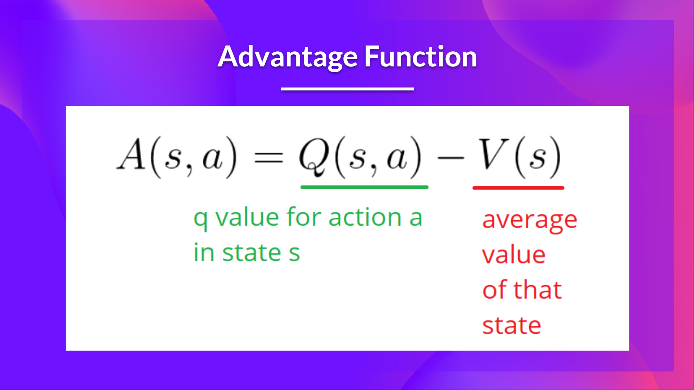
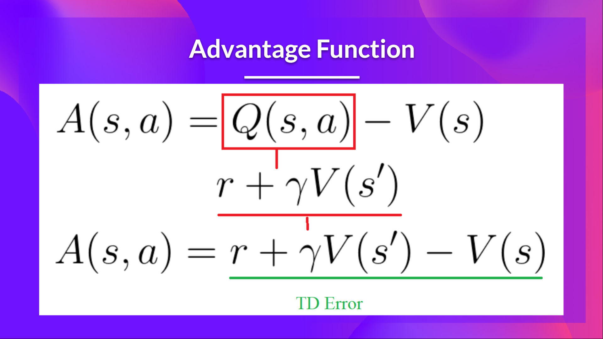

# Advantage Actor Critic (A2C)
<h2>Unit 7, of the <a href="https://github.com/huggingface/deep-rl-class">Deep Reinforcement Learning Class with Hugging Face 🤗</a></h2>

⚠️ A **new updated version of this article is available here** 👉 [https://huggingface.co/deep-rl-course/unit1/introduction](https://huggingface.co/deep-rl-course/unit6/introduction)

*This article is part of the Deep Reinforcement Learning Class. A free course from beginner to expert. Check the syllabus [here.](https://huggingface.co/deep-rl-course/unit0/introduction)*

  

---

⚠️ A **new updated version of this article is available here** 👉 [https://huggingface.co/deep-rl-course/unit1/introduction](https://huggingface.co/deep-rl-course/unit6/introduction)

*This article is part of the Deep Reinforcement Learning Class. A free course from beginner to expert. Check the syllabus [here.](https://huggingface.co/deep-rl-course/unit0/introduction)*

[In Unit 5](https://huggingface.co/blog/deep-rl-pg), we learned about our first Policy-Based algorithm called **Reinforce**. 
In Policy-Based methods, **we aim to optimize the policy directly without using a value function**. More precisely, Reinforce is part of a subclass of *Policy-Based Methods* called *Policy-Gradient methods*. This subclass optimizes the policy directly by **estimating the weights of the optimal policy using Gradient Ascent**.

We saw that Reinforce worked well. However, because we use Monte-Carlo sampling to estimate return (we use an entire episode to calculate the return), **we have significant variance in policy gradient estimation**. 

Remember that the policy gradient estimation is **the direction of the steepest increase in return**. Aka, how to update our policy weights so that actions that lead to good returns have a higher probability of being taken. The Monte Carlo variance, which we will further study in this unit, **leads to slower training since we need a lot of samples to mitigate it**.

Today we'll study **Actor-Critic methods**, a hybrid architecture combining a value-based and policy-based methods that help to stabilize the training by reducing the variance:
- *An Actor* that controls **how our agent behaves** (policy-based method)
- *A Critic* that measures **how good the action taken is** (value-based method)

We'll study one of these hybrid methods called Advantage Actor Critic (A2C), **and train our agent using Stable-Baselines3 in robotic environments**. Where we'll train two agents to walk:
- A bipedal walker 🚶
- A spider 🕷️

Sounds exciting? Let's get started!
  
- [The Problem of Variance in Reinforce](https://huggingface.co/blog/deep-rl-a2c#the-problem-of-variance-in-reinforce)
- [Advantage Actor Critic (A2C)](https://huggingface.co/blog/deep-rl-a2c#advantage-actor-critic-a2c)
  - [Reducing variance with Actor-Critic methods](https://huggingface.co/blog/deep-rl-a2c#reducing-variance-with-actor-critic-methods)
  - [The Actor-Critic Process](https://huggingface.co/blog/deep-rl-a2c#the-actor-critic-process)
  - [Advantage Actor Critic](https://huggingface.co/blog/deep-rl-a2c#advantage-actor-critic-a2c-1)
- [Advantage Actor Critic (A2C) using Robotics Simulations with PyBullet 🤖](https://huggingface.co/blog/deep-rl-a2c#advantage-actor-critic-a2c-using-robotics-simulations-with-pybullet-%F0%9F%A4%96)

## The Problem of Variance in Reinforce
In Reinforce, we want to **increase the probability of actions in a trajectory proportional to how high the return is**.

  
- If the **return is high**, we will **push up** the probabilities of the (state, action) combinations.
- Else, if the **return is low**, it will **push down** the probabilities of the (state, action) combinations.

This return \\(R(\tau)\\) is calculated using a *Monte-Carlo sampling*. Indeed, we collect a trajectory and calculate the discounted return, **and use this score to increase or decrease the probability of every action taken in that trajectory**. If the return is good, all actions will be “reinforced” by increasing their likelihood of being taken.
  
\\(R(\tau) = R_{t+1} + \gamma R_{t+2} + \gamma^2 R_{t+3} + ...\\) 

The advantage of this method is that **it’s unbiased. Since we’re not estimating the return**, we use only the true return we obtain.
  
But the problem is that **the variance is high, since trajectories can lead to different returns** due to stochasticity of the environment (random events during episode) and stochasticity of the policy. Consequently, the same starting state can lead to very different returns.
Because of this, **the return starting at the same state can vary significantly across episodes**.
  
  

The solution is to mitigate the variance by **using a large number of trajectories, hoping that the variance introduced in any one trajectory will be reduced in aggregate and provide a "true" estimation of the return.**

However, increasing the batch size significantly **reduces sample efficiency**. So we need to find additional mechanisms to reduce the variance.

---
If you want to dive deeper into the question of variance and bias tradeoff in Deep Reinforcement Learning, you can check these two articles:
- [Making Sense of the Bias / Variance Trade-off in (Deep) Reinforcement Learning](https://blog.mlreview.com/making-sense-of-the-bias-variance-trade-off-in-deep-reinforcement-learning-79cf1e83d565) 
- [Bias-variance Tradeoff in Reinforcement Learning](https://www.endtoend.ai/blog/bias-variance-tradeoff-in-reinforcement-learning/)
---
  
 
## Advantage Actor Critic (A2C)
### Reducing variance with Actor-Critic methods
The solution to reducing the variance of Reinforce algorithm and training our agent faster and better is to use a combination of policy-based and value-based methods: *the Actor-Critic method*.

To understand the Actor-Critic, imagine you play a video game. You can play with a friend that will provide you some feedback. You’re the Actor, and your friend is the Critic.
 
  

You don’t know how to play at the beginning, **so you try some actions randomly**. The Critic observes your action and **provides feedback**.

Learning from this feedback, **you’ll update your policy and be better at playing that game.**

On the other hand, your friend (Critic) will also update their way to provide feedback so it can be better next time.

This is the idea behind Actor-Critic. We learn two function approximations:

- *A policy* that **controls how our agent acts**: \\( \pi_{\theta}(s,a) \\)
  
- *A value function* to assist the policy update by measuring how good the action taken is: \\( \hat{q}_{w}(s,a) \\)
 
### The Actor-Critic Process
Now that we have seen the Actor Critic's big picture, let's dive deeper to understand how Actor and Critic improve together during the training.
  
As we saw, with Actor-Critic methods there are two function approximations (two neural networks):
- *Actor*, a **policy function** parameterized by theta: \\( \pi_{\theta}(s,a) \\)
- *Critic*, a **value function** parameterized by w: \\( \hat{q}_{w}(s,a) \\)

Let's see the training process to understand how Actor and Critic are optimized:
- At each timestep, t, we get the current state \\( S_t\\) from the environment and **pass it as input through our Actor and Critic**.
  
- Our Policy takes the state and **outputs an action**  \\( A_t \\).
  
  
  
- The Critic takes that action also as input and, using \\( S_t\\) and \\( A_t \\), **computes the value of taking that action at that state: the Q-value**.
  
  
  
- The action \\( A_t\\) performed in the environment outputs a new state \\( S_{t+1}\\) and a reward \\( R_{t+1} \\) .
  

  
- The Actor updates its policy parameters using the Q value.
  
  
  
- Thanks to its updated parameters, the Actor produces the next action to take at \\( A_{t+1} \\) given the new state \\( S_{t+1} \\). 
  
- The Critic then updates its value parameters.
  
  
  
### Advantage Actor Critic (A2C)
We can stabilize learning further by **using the Advantage function as Critic instead of the Action value function**.

The idea is that the Advantage function calculates **how better taking that action at a state is compared to the average value of the state**. It’s subtracting the mean value of the state from the state action pair:

  

In other words, this function calculates **the extra reward we get if we take this action at that state compared to the mean reward we get at that state**.

The extra reward is what's beyond the expected value of that state. 
- If A(s,a) > 0: our gradient is **pushed in that direction**.
- If A(s,a) < 0 (our action does worse than the average value of that state), **our gradient is pushed in the opposite direction**.

The problem with implementing this advantage function is that it requires two value functions —  \\( Q(s,a)\\) and  \\( V(s)\\). Fortunately, **we can use the TD error as a good estimator of the advantage function.**  

  
              
## Advantage Actor Critic (A2C) using Robotics Simulations with PyBullet 🤖
Now that you've studied the theory behind Advantage Actor Critic (A2C), **you're ready to train your A2C agent** using Stable-Baselines3 in robotic environments.

Start the tutorial here 👉 [https://colab.research.google.com/github/huggingface/deep-rl-class/blob/main/unit7/unit7.ipynb](https://colab.research.google.com/github/huggingface/deep-rl-class/blob/main/unit7/unit7.ipynb)

The leaderboard to compare your results with your classmates 🏆 👉 **[https://huggingface.co/spaces/chrisjay/Deep-Reinforcement-Learning-Leaderboard](https://huggingface.co/spaces/chrisjay/Deep-Reinforcement-Learning-Leaderboard)**

## Conclusion

Congrats on finishing this chapter! There was a lot of information. And congrats on finishing the tutorial. 🥳.

It's **normal if you still feel confused** with all these elements. **This was the same for me and for all people who studied RL.**

Take time to grasp the material before continuing. Look also at the additional reading materials we provided in this article and the syllabus to go deeper 👉 **[https://github.com/huggingface/deep-rl-class/blob/main/unit7/README.md](https://github.com/huggingface/deep-rl-class/blob/main/unit7/README.md)**

Don't hesitate to train your agent in other environments. The **best way to learn is to try things on your own!**

In the next unit, we will learn to improve Actor-Critic Methods with Proximal Policy Optimization.

And don't forget to share with your friends who want to learn 🤗!

Finally, with your feedback, we want **to improve and update the course iteratively**. If you have some, please fill this form 👉 **[https://forms.gle/3HgA7bEHwAmmLfwh9](https://forms.gle/3HgA7bEHwAmmLfwh9)**

### **Keep learning, stay awesome 🤗,**
