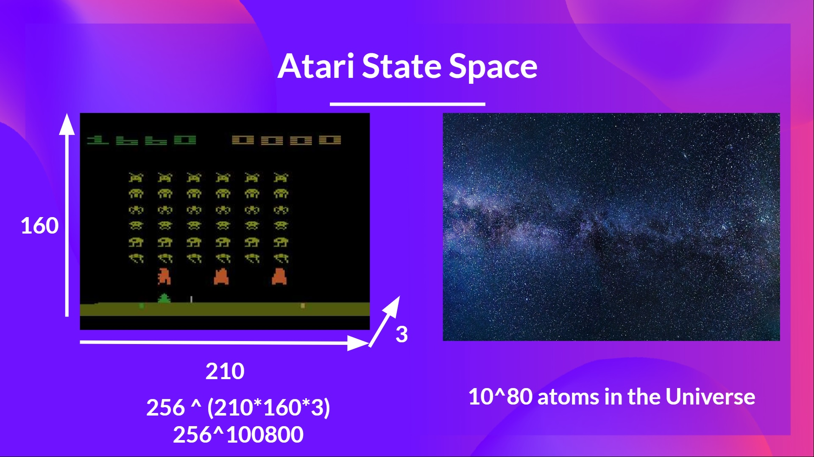

<html>
<head>

<h1>Deep Q-Learning with Space Invaders</h1>
<h2>Unit 3, of the the <a href="https://github.com/huggingface/deep-rl-class">Deep Reinforcement Learning Class with Hugging Face 🤗</a></h2>

    <a href="/ThomasSimonini">
        
        

            <code>ThomasSimonini</code>
            Thomas Simonini
        

  </a>

</head>

<body>

*This article is part of the Deep Reinforcement Learning Class. A free course from beginner to expert. Check the syllabus [here.](https://github.com/huggingface/deep-rl-class)*
---

[In the last unit](https://huggingface.co/blog/deep-rl-q-part2), we learned our first reinforcement learning algorithm: Q-Learning, **implemented it from scratch**, and trained it in two environments, FrozenLake-v1 ☃️ and Taxi-v3 🚕.

We got excellent results with this simple algorithm. But these environments were relatively simple because the **State Space was discrete and small** (14 different states for FrozenLake-v1 and 500 for Taxi-v3).

But as we'll see, producing and updating a **Q-table can become ineffective in large state space environments.**

So today, **we'll study our first Deep Reinforcement Learning agent**: Deep Q-Learning. Instead of using a Q-table, Deep Q-Learning uses a Neural Network that takes a state and approximates Q-values for each action based on that state.

And **we'll train it to play Space Invaders and other Atari environments using [RL-Zoo](https://github.com/DLR-RM/rl-baselines3-zoo)**, a training framework for RL using Stable-Baselines that provides scripts for training, evaluating agents, tuning hyperparameters, plotting results, and recording videos.
  
<figure class="image table text-center m-0 w-full">
  
</figure>
  
So let’s get started! 🚀

To be able to understand this unit, **you need to understand [Q-Learning](https://huggingface.co/blog/deep-rl-q-part2) first.**)

[Table des matières]

## From Q-Learning to Deep Q-Learning

We learned that **Q-Learning is an algorithm we use to train our Q-Function**, an **action-value function** that determines the value of being at a particular state and taking a specific action at that state.

<figure class="image table text-center m-0 w-full">  <figcaption>Given a state and action, our Q Function outputs a state-action value (also called Q-value)</figcaption> </figure>

The **Q comes from "the Quality" of that action at that state.**

Internally, our Q-function has **a Q-table, a table where each cell corresponds to a state-action value pair value.** Think of this Q-table as **the memory or cheat sheet of our Q-function.**

The problem is that Q-Learning is a *tabular method*. Aka, a problem in which the state and actions spaces **are small enough for approximate value functions to be represented as arrays and tables**. And this is **not scalable**.

Q-Learning was working well with small state space environments like:

- FrozenLake, we had 14 states.
- Taxi-v3, we had 500 states.

IMG Frozen Lake Taxi-v3

But think of what we're going to do today: we will train an agent to learn to play Space Invaders using the frames as input.

As **[Nikita Melkozerov mentioned](https://twitter.com/meln1k), Atari environments** have an observation space with a shape of (210, 160, 3), containing values ranging from 0 to 255 si that gives us 256^(210*160*3) = 256^100800 (for comparison, we have approximately 10^80 atoms in the observable universe ).

Therefore, the state space is gigantic; hence creating and updating a Q-table for that environment would not be efficient. In this case, the best idea is to approximate the Q-values instead of a Q-table using a parametrized Q-function $Q_\theta(s,a)$.

This neural network will approximate, given a state, the different Q-values for each possible action at that state. And that's exactly what Deep Q-Learning does.

Now that we understand Deep Q-Learning, let's dive deeper into the Deep Q-Network.
  
## The Deep Q-Network
This is the architecture of our Deep Q-Learning network:
  

  
As input, we take a **stack of 4 frames** passed through the network as a state and output a **vector of Q-values for each possible action at that state**. Then, like with Q-Learning, we just need to use our epsilon-greedy policy to select which action to take.
  
When the Neural Network is initialized, **the Q-value estimation is terrible**. But during training, our Deep Q-Network agent will associate a situation with appropriate action and **learn to play the game well**.
  
### Preprocessing the input and temporal limitation
We mentioned that we **preprocess the input**. It’s an essential step since we want to reduce the complexity of our state to reduce the computation time needed for training.
  
So what we do is **reduce the state space to 84x84 and grayscale it** (since color in Atari environments does not add important information).
This is an essential saving since we **reduce our three color channels (RGB) to 1**.

We can also **crop a part of the screen in some games** if it does not contain important information.
Then we stack four frames together.

Why do we stack four frames together?
  

We stack frames together because it helps us handle the problem of temporal limitation. Let’s take an example with the game of Pong. When you see this frame:

  
Can you tell me where the ball is going?
No, because one frame is not enough to have a sense of motion! But what if I add three more frames? **Here you can see that the ball is going to the right**.

That’s why, **to capture temporal information, we stack four frames together.**
  
Then, the stacked frames are processed by three convolutional layers. These layers **allow us to capture and exploit spatial relationships in images**. But also, because frames are stacked together, **you can exploit some spatial properties across those frames**.
  
Finally, we have a couple of fully connected layers that output a Q-value for each possible action at that state.

  
So, we see that Deep Q-Learning is using a neural network to approximate, given a state, the different Q-values for each possible action at that state. Let’s now study the Deep Q-Learning algorithm.
  
## Deep Q

---
Congrats on finishing this chapter! There was a lot of information. And congrats on finishing the tutorial. You’ve just trained your first Deep Q-Learning agent and shared it on the Hub 🥳.

That’s **normal if you still feel confused** with all these elements. **This was the same for me and for all people who studied RL.**

Take time to really grasp the material before continuing.

And since the best way to learn and avoid the illusion of competence is **to test yourself**. We wrote a quiz to help you find where **you need to reinforce your study**. Check your knowledge here 👉 **[https://github.com/huggingface/deep-rl-class/blob/main/unit3/quiz.md](https://github.com/huggingface/deep-rl-class/blob/main/unit2/quiz2.md)**

Don't hesitate to train your agent in other environments (Pong, Seaquest, QBert, Ms Pac Man). The **best way to learn is to try things on your own!**

We published additional readings in the syllabus if you want to go deeper 👉 **[https://github.com/huggingface/deep-rl-class/blob/main/unit3/README.md](https://github.com/huggingface/deep-rl-class/blob/main/unit2/README.md)**

In the next unit, we’re going to learn about Policy Gradients methods

And don't forget to share with your friends who want to learn 🤗 !

Finally, we want **to improve and update the course iteratively with your feedback**. If you have some, please fill this form 👉 **[https://forms.gle/3HgA7bEHwAmmLfwh9](https://forms.gle/3HgA7bEHwAmmLfwh9)**

### **Keep learning, stay awesome,**
