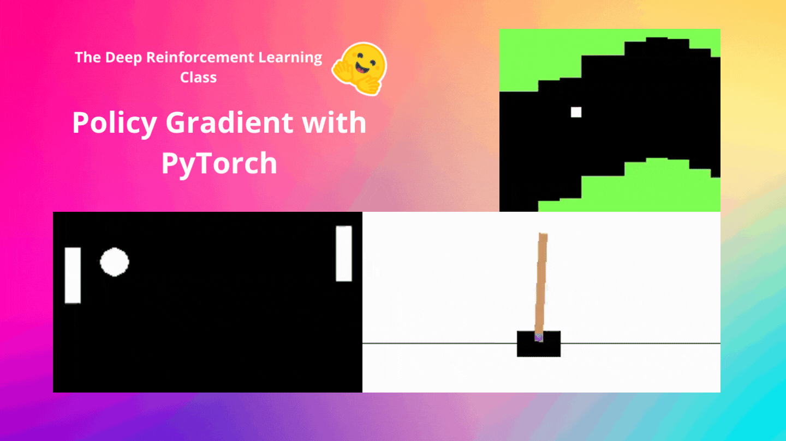
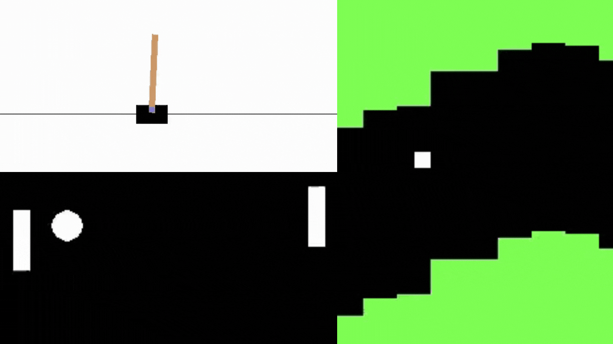
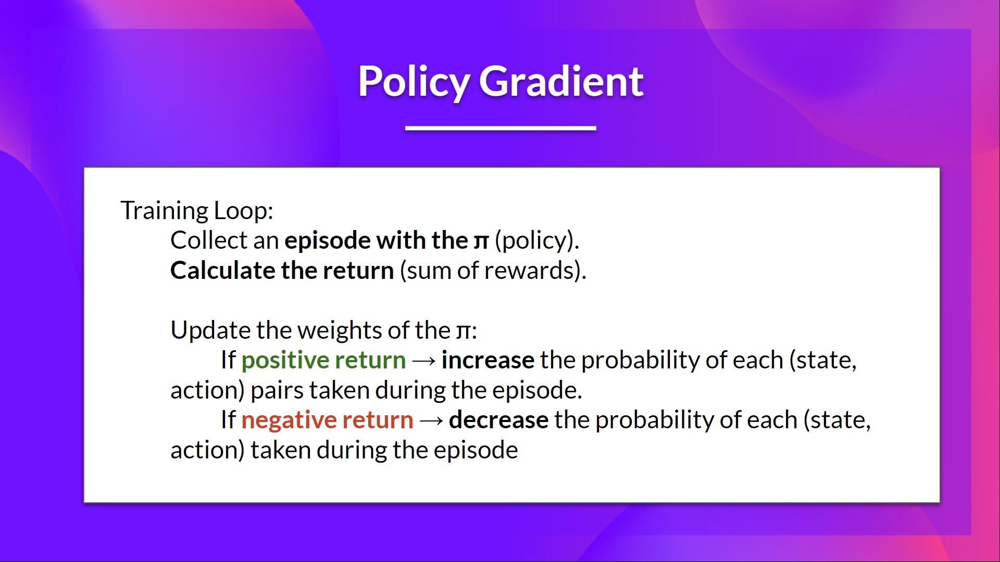
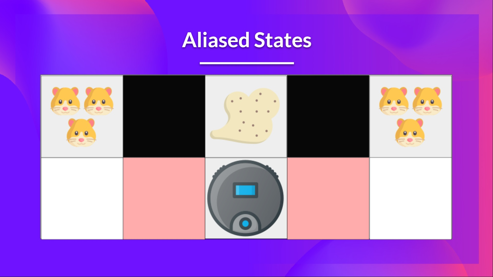
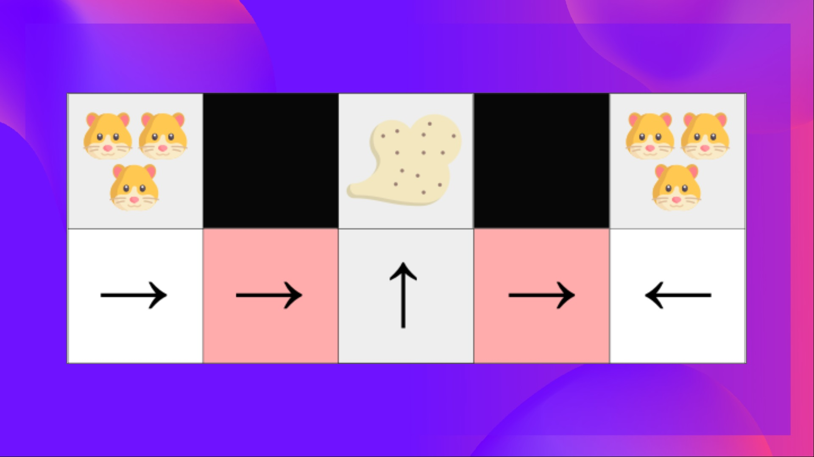
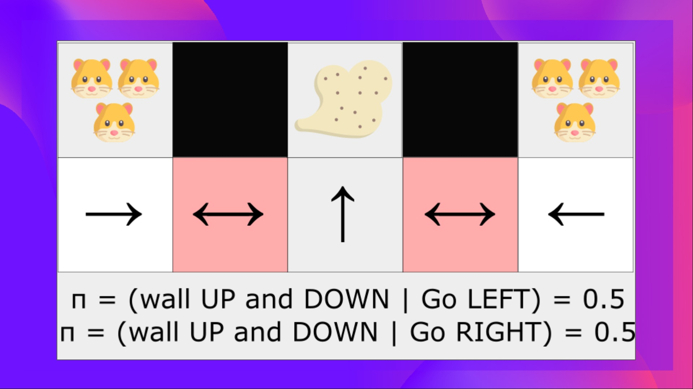

<html>
<head>

<h1>Policy Gradient with PyTorch</h1>
<h2>Unit 5, of the <a href="https://github.com/huggingface/deep-rl-class">Deep Reinforcement Learning Class with Hugging Face 🤗</a></h2>

    <a href="/ThomasSimonini">
        
        

            <code>ThomasSimonini</code>
            Thomas Simonini
        

  </a>

</head>

<body>

*This article is part of the Deep Reinforcement Learning Class. A free course from beginner to expert. Check the syllabus [here.](https://github.com/huggingface/deep-rl-class)*

  

---
[In the last unit](https://huggingface.co/blog/deep-rl-dqn), we learned about Deep Q-Learning. In this value-based Deep Reinforcement Learning algorithm, we **used a deep neural network to approximate the different Q-values for each possible action at a state.**

Indeed, since the beginning of the course, we only studied value-based methods, **where we estimate a value function as an intermediate step towards finding an optimal policy.**

Because, in value-based, **π exists only because of the action value estimates, since policy is just a function** (for instance, greedy-policy) that will select the action with the highest value given a state.

But, with policy-based methods, we want to optimize the policy directly **without having an intermediate step of learning a value function.**

So today, **we'll study our first Policy-Based method**: Reinforce. And we'll implement it from scratch using PyTorch. Before testing its robustness using CartPole-v1, PixelCopter, and Pong.

<figure class="image table text-center m-0 w-full">
  
</figure>

Let's get started,

- [What are Policy-Gradient Methods?](#what-are-policy-gradient-methods)
  - [An Overview of Policy Gradients](#an-overview-of-policy-gradients)
  - [The Advantages of Policy-Gradient Methods](#the-advantages-of-policy-gradient-methods)
  - [The Disadvantages of Policy-Gradient Methods](#the-disadvantages-of-policy-gradient-methods)
- [Reinforce (Monte Carlo Policy Gradient)](#reinforce-monte-carlo-policy-gradient)

  
## What are Policy-Gradient Methods?
Policy-Gradient is a subclass of Policy-Based Methods are a category of algorithms that **aim to optimize the policy directly without using a value function using different techniques.**

Since Policy-Gradient methods is a series of algorithms that aim to optimize the policy directly **by estimating the weights of the optimal policy using Gradient Ascent.**

### An Overview of Policy Gradients
Why do we optimize the policy directly by estimating the weights of an optimal policy using Gradient Ascent in Policy Gradients Methods?

Remember that reinforcement learning aims **to find an optimal behavior strategy (policy) to maximize its expected cumulative reward.**

We also need to remember that a policy is a function that (in our case using a stochastic policy), **given a state output, a distribution over actions.**

  <figure class="image table text-center m-0 w-full">
  
</figure>

Our goal with Policy-Gradients is to control the probability distribution of actions by tuning the policy such that **good actions (**that maximize the return) **are sampled more frequently in the future.**

Let’s take a simple example:

We collect an episode, by letting our policy interact with its environment.

We then look at the sum of rewards of the episode (expected return). If this sum is positive, we **consider that the actions taken during the episodes were good:** Therefore, we want to increase the P(a|s) (probability of taking that action at that state) for each state-action pair.

The Policy Gradient algorithm (simplified) looks like this:
<figure class="image table text-center m-0 w-full">
  
</figure>

But Deep Q-Learning is excellent! Why use policy gradient methods?

### The Advantages of Policy-Gradient Methods

There are multiple advantages over Policy-Gradient methods, let's see some of them:

1. The simplicity of the integration: **we can estimate the policy directly without storing additional data (action values).**
  
2. Policy gradient methods can **learn a stochastic policy while value functions can't**

This has two consequences:

One of these is that we don't need to implement an exploration/exploitation trade-off by hand. Since we output a probability distribution over actions, the agent explores **the state space without always taking the same trajectory.**

We also get rid of the problem of perceptual aliasing. Perceptual aliasing is when two states seem (or are) the same but need different actions.

Let's take an example: we have an intelligent vacuum cleaner whose goal is to suck the dust and avoid killing the hamsters.

  
<figure class="image table text-center m-0 w-full">
  
</figure>

Our vacuum cleaner can only perceive where the walls are.

The problem is that the two red cases are aliased states because the agent perceives an upper and lower wall for each.

<figure class="image table text-center m-0 w-full">
  
</figure>

Under a deterministic policy, the policy will either move right when in a red state or move left. Either case will cause our agent to get stuck and never suck the dust.

Under a value-based RL algorithm, we learn a quasi-deterministic policy ("greedy epsilon strategy"). Consequently, our agent can spend a lot of time before finding the dust.

On the other hand, an optimal stochastic policy will randomly move left or right in grey states. Consequently, it will not be stuck and will reach the goal state with a high probability.

<figure class="image table text-center m-0 w-full">
  
</figure>

3. Policy gradients are more effective in high-dimensional action spaces and continuous actions spaces

The third advantage is that policy gradients are **more effective in high-dimensional action spaces or when using continuous actions**.

Indeed, the problem with Deep Q-learning is that their predictions assign a score (maximum expected future reward) for each possible action, at each time step, given the current state.

But what if we have an infinite possibility of actions?

For instance, with a self-driving car, at each state, you can have a (near) infinite choice of actions (turning the wheel at 15°, 17.2°, 19,4°, honking, etc.). We'll need to output a Q-value for each possible action! And taking the max action of a continuous output is an optimization problem itself!

Instead, with a policy gradient, we output a **probability distribution over actions.**

### The Disadvantages of Policy-Gradient Methods
Naturally, Policy Gradient methods have also some disadvantages:
  
- **Policy gradients converge a lot of time on a local maximum instead of a global optimum.**
- Policy gradient goes faster, **step by step: it can take longer to train (inefficient).**
- Policy gradient can have high variance (solution baseline)

If you want to go deeper on why the advantages and disadvantages of Policy Gradients methods, [you can check this video](https://youtu.be/y3oqOjHilio).
So now that we have seen the big picture of Policy-Gradient and its advantages and disadvantages let's study one of them: Reinforce.

  
## Reinforce (Monte Carlo Policy Gradient)

  
---
Congrats on finishing this chapter! There was a lot of information. And congrats on finishing the tutorial. You’ve just code your first Deep Reinforcement Learninga agent from scratch using PyTorch and shared it on the Hub 🥳.

That’s **normal if you still feel confused** with all these elements. **This was the same for me and for all people who studied RL.**

Take time to really grasp the material before continuing.

Don't hesitate to train your agent in other environments. The **best way to learn is to try things on your own!**

We published additional readings in the syllabus if you want to go deeper 👉 **[https://github.com/huggingface/deep-rl-class/blob/main/unit5/README.md](https://github.com/huggingface/deep-rl-class/blob/main/unit5/README.md)**

In the next unit, we’re going to learn about a combination of Policy-Based and Value-based methods called Actor Critic Methods.

And don't forget to share with your friends who want to learn 🤗 !

Finally, we want **to improve and update the course iteratively with your feedback**. If you have some, please fill this form 👉 **[https://forms.gle/3HgA7bEHwAmmLfwh9](https://forms.gle/3HgA7bEHwAmmLfwh9)**

### **Keep learning, stay awesome,**
  
