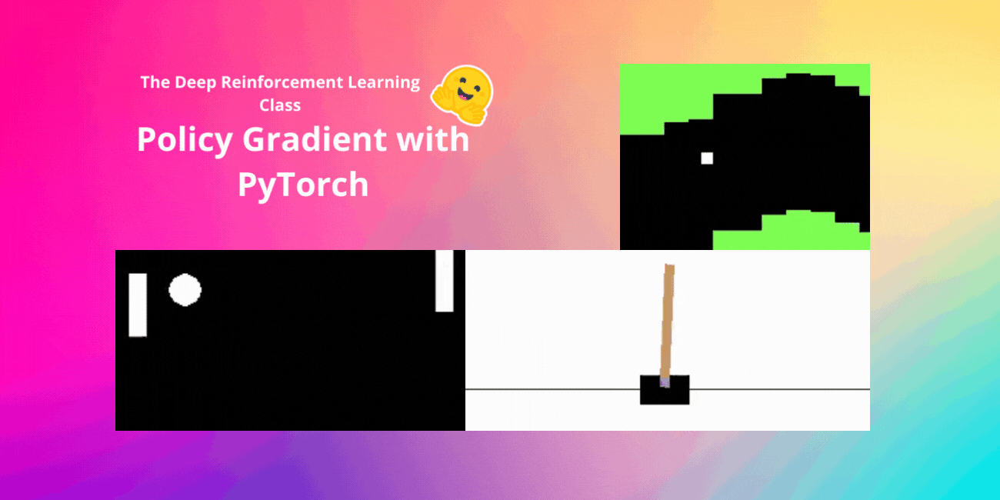

<html>
<head>

<h1>Policy Gradient with PyTorch</h1>
<h2>Unit 5, of the <a href="https://github.com/huggingface/deep-rl-class">Deep Reinforcement Learning Class with Hugging Face 🤗</a></h2>

    <a href="/ThomasSimonini">
        
        

            <code>ThomasSimonini</code>
            Thomas Simonini
        

  </a>

</head>

<body>

*This article is part of the Deep Reinforcement Learning Class. A free course from beginner to expert. Check the syllabus [here.](https://github.com/huggingface/deep-rl-class)*

  

---
[In the last unit](https://huggingface.co/blog/deep-rl-dqn), we learned about Deep Q-Learning. In this value-based Deep Reinforcement Learning algorithm, we **used a deep neural network to approximate the different Q-values for each possible action at a state.**

Indeed, since the beginning of the course, we only studied value-based methods, **where we estimate a value function as an intermediate step towards finding an optimal policy.**

Because, in value-based, **π exists only because of the action value estimates, since policy is just a function** (for instance, greedy-policy) that will select the action with the highest value given a state.

But, with policy-based methods, we want to optimize the policy directly **without having an intermediate step of learning a value function.**

So today, **we'll study our first Policy-Based method**: Reinforce. And we'll implement it from scratch using PyTorch. Before testing its robustness using CartPole-v1, PixelCopter, and Pong.

<figure class="image table text-center m-0 w-full">
  
</figure>

Let's get started,

[Add table des matières]
