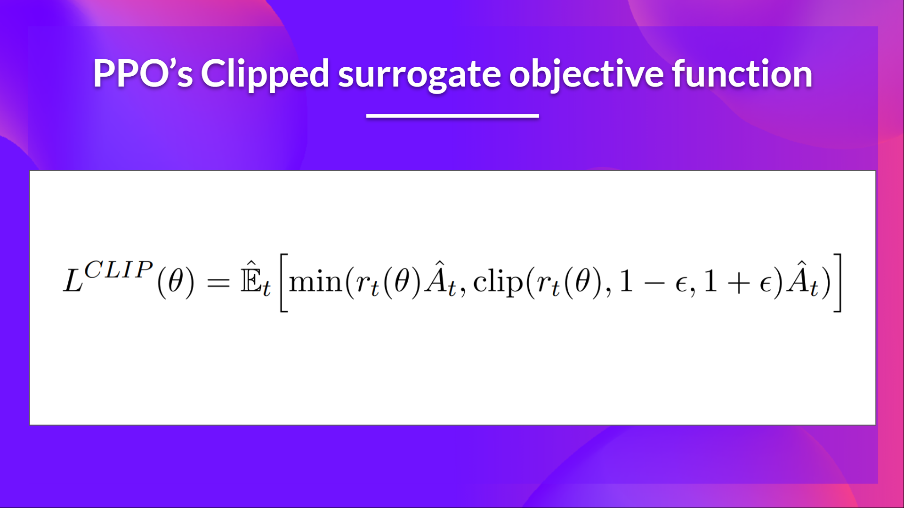
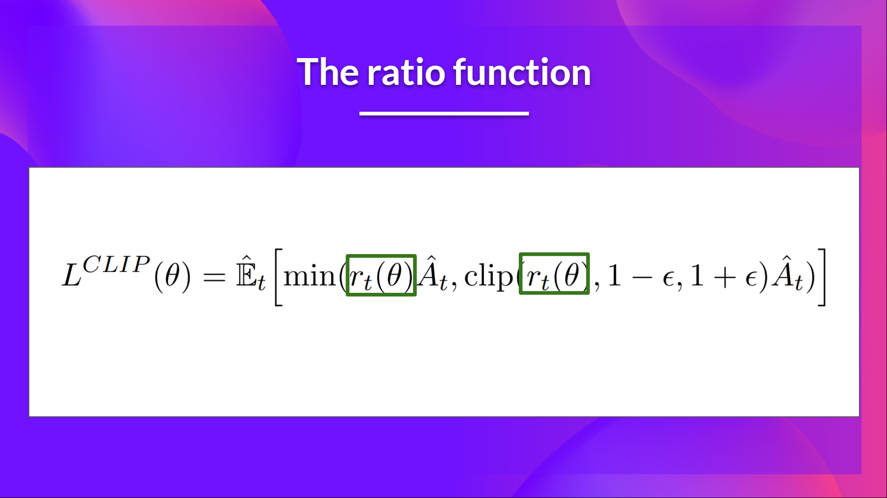
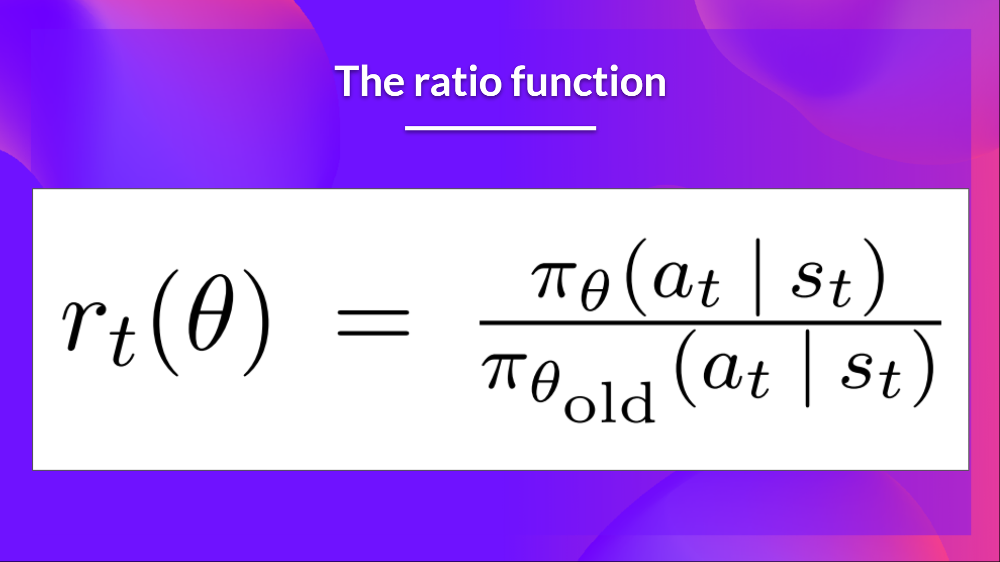

<html>
<head>

<h1>Proximal Policy Optimization (PPO)</h1>
<h2>Unit 8, of the <a href="https://github.com/huggingface/deep-rl-class">Deep Reinforcement Learning Class with Hugging Face 🤗</a></h2>

    <a href="/ThomasSimonini">
        
        

            <code>ThomasSimonini</code>
            Thomas Simonini
        

  </a>

</head>

<body>

*This article is part of the Deep Reinforcement Learning Class. A free course from beginner to expert. Check the syllabus [here.](https://github.com/huggingface/deep-rl-class)*

  

---
**[In the last Unit](https://huggingface.co/blog/deep-rl-a2c)**, we learned about Advantage Actor Critic (A2C), a hybrid architecture combining value-based and policy-based methods that help to stabilize the training by reducing the variance:

- *An Actor* that controls **how our agent behaves** (policy-based method)
- *A Critic* that measures **how good the action taken is** (value-based method)

Today we'll learn about Proximal Policy Optimization (PPO), a model that improves our agent's training stability by avoiding too large policy updates. To do that, we use a ratio that will tell us the difference between our new and old policy and clip this ratio from a specific range [1-epsilon, 1+epsilon].

Doing this will ensure **that our policy update will not be too large and that the training is more stable.**

And then, after the theory, we'll code a PPO architecture from scratch using PyTorch and bulletproof our implementation with CartPole-v1 and LunarLander-v2.

Sounds exciting? Let's get started!

[Table des matières]
  
  
## The intuition behind PPO

The idea with Proximal Policy Optimization (PPO) is that we want to improve the training stability of the policy by limiting the change you make to the policy at each training epoch: **we want to avoid having too large policy updates.**

For two reasons:

- We know empirically that smaller policy updates during training are **more likely to converge to an optimal solution.**
- A too big step in a policy update can result in falling “off the cliff” (getting a bad policy) **and having a long time or even no possibility to recover.**

<figure class="image table text-center m-0 w-full">
  
  <figcaption>Taking smaller policy updates improve the training stability</figcaption>
  <figcaption>Modified version from [RL — Proximal Policy Optimization (PPO) Explained by Jonathan Hui](https://jonathan-hui.medium.com/rl-proximal-policy-optimization-ppo-explained-77f014ec3f12)</figcaption>
</figure>

**So with PPO, we update the policy conservatively**. To do so, we need to measure how much the current policy changed compared to the former one using a ratio calculation between the current and former policy. And we clip this ratio in a range [1-epsilon, 1+epsilon], meaning that we **remove the incentive for the new policy to go too far from the old one (hence the proximal policy term).**
  
## Introducing the Clipped Surrogate Objective

### Recap: The Policy Objective Function

Let’s remember what is the objective to optimize in Reinforce:

The idea was that by taking a gradient ascent step on this function (equivalent to taking gradient descent of the negative of this function), we would **push our agent to take actions that lead to higher rewards and avoid harmful actions.**

However, the problem comes from the step size:

- Too small, **the training process was too slow**
- Too high, **there was too much variability in the training**

Here with PPO, the idea is to constrain our policy update with a new objective function called the *Clipped surrogate objective function* that **will constrain the policy change in a small range using a clip.**

This new function **is designed to avoid destructive large weights updates** :

Let’s study each part to understand how it works.

### The Ratio Function

This ratio is calculated this way:

It’s the probability of taking action $a_t$ at state $s_t$ in the current policy divided by the previous one.

As we can see, $r_t(\theta)$ denotes the probability ratio between the new and old policy:

- If $r_t(\theta) > 0$, the **action $a_t$, in state $s_t$ is more likely in the current policy than the old policy.**
- If $r_t(\theta)$ is between 0 and 1, the **action is less likely for the current policy than for the old one**.

So this probability ratio is an **easy way to estimate the divergence between old and current policy.**

