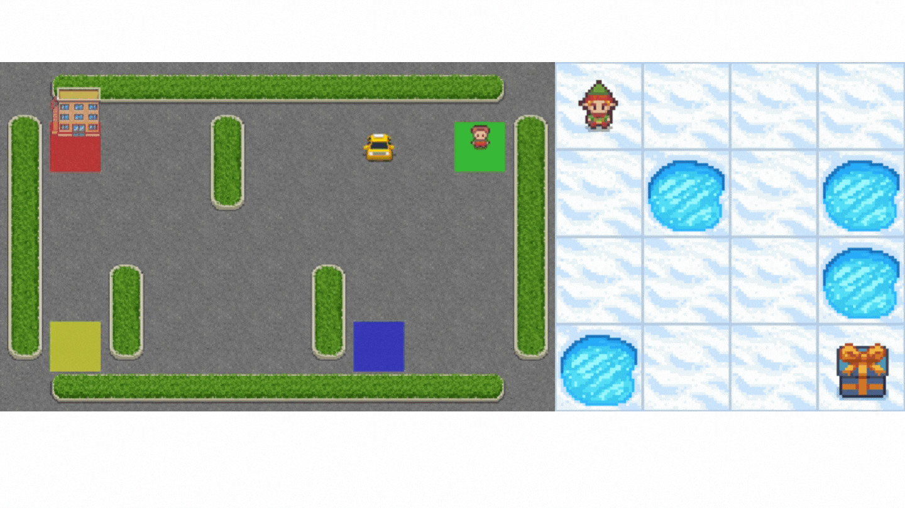
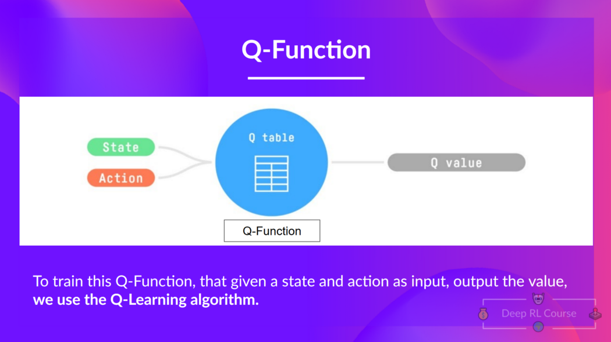
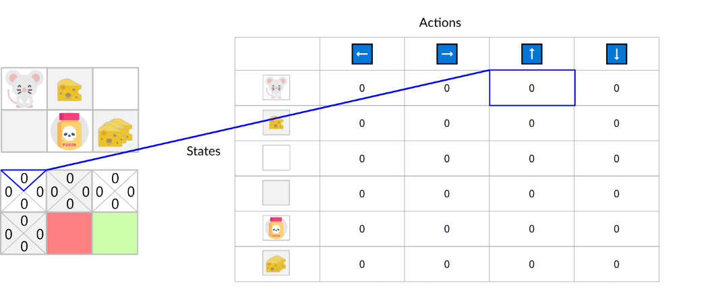
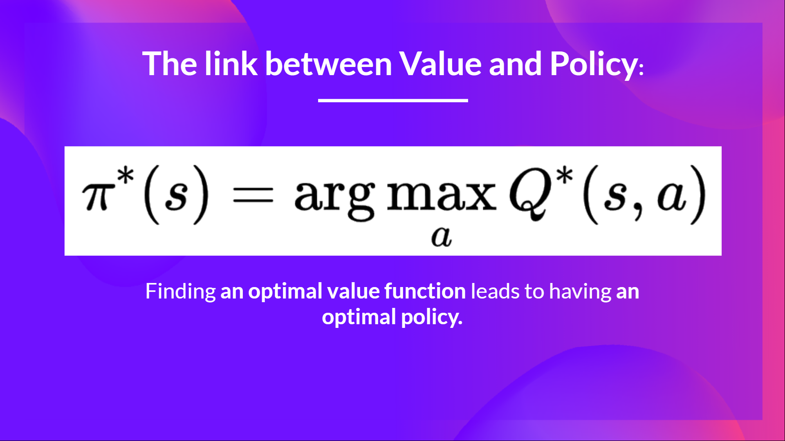
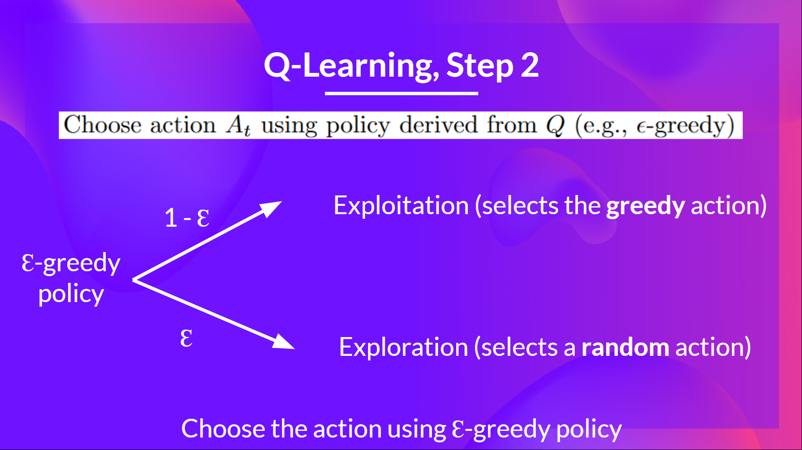
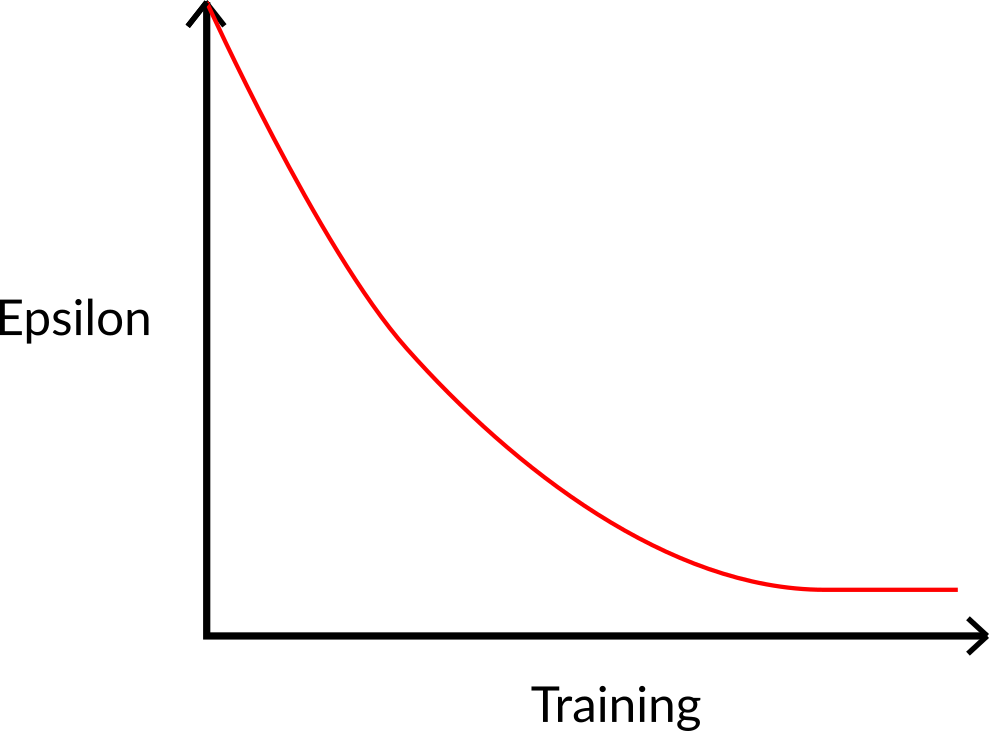
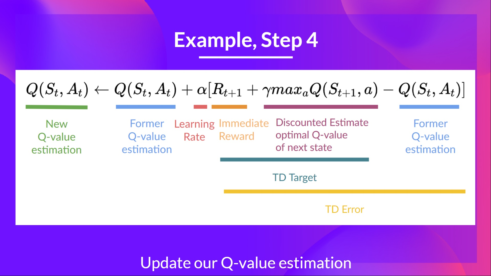

<html>
<head>

<h1>An Introduction to Q-Learning Part 2/2</h1>
<h2>Unit 2, part 2 of the <a href="https://github.com/huggingface/deep-rl-class">Deep Reinforcement Learning Class with Hugging Face 🤗</a></h2>

    <a href="/ThomasSimonini">
        
        

            <code>ThomasSimonini</code>
            Thomas Simonini
        

  </a>

</head>

<body>

*This article is part of the Deep Reinforcement Learning Class. A free course from beginner to expert. Check the syllabus [here.](https://github.com/huggingface/deep-rl-class)*
---

In the first part of this unit, **we learned about the value-based methods and the difference between Monte Carlo and Temporal Difference Learning**.

So, in the second part, we’ll **study Q-Learning**, **and implement our first RL agent from scratch**. A Q-Learning agent and will train it in two environments:

1. Frozen-Lake-v1 ❄️ (non-slippery version): where our agent will need to **go from the starting state (S) to the goal state (G)** by walking only on frozen tiles (F) and avoiding holes (H).
2. An autonomous taxi 🚕 will need **to learn to navigate** a city to **transport its passengers from point A to point B.**

<figure class="image table text-center m-0 w-full">
  
</figure>

This unit is fundamental if you want to be able to work on Deep Q-Learning (Unit 3).

So let’s get started! 🚀

- [Introducing Q-Learning](#introducing-q-learning)
  - [What is Q-Learning?](#what-is-q-learning)
  - [The Q-Learning algorithm](#the-q-learning-algorithm)
  - [Off-policy vs. On-policy](#off-policy-vs-on-policy)
- [A Q-Learning example](#a-q-learning-example)

## **Introducing Q-Learning**
### **What is Q-Learning?**

Q-Learning is an **off-policy value-based method that uses a TD approach to train its action-value function:**

- *Off-policy*: we'll talk about that at the end of this chapter.
- *Value-based method*: finds its optimal policy indirectly by training a value-function or action-value function that will tell us **the value of each state or each state-action pair.**
- *Uses a TD approach:* **updates its action-value function at each step.**

**Q-Learning is the algorithm we use to train our Q-Function**, an **action-value function** that determines the value of being at a particular state and taking a specific action at that state.

<figure class="image table text-center m-0 w-full">
  
  <figcaption>Given a state and action, our Q Function outputs a state-action value (also called Q-value)</figcaption>
</figure>

The **Q comes from "the Quality" of that action at that state.**

Internally, our Q-function has **a Q-table, a table where each cell corresponds to a state-action value pair value.** Think of this Q-table as **the memory or cheat sheet of our Q-function.**

If we take this maze example:

<figure class="image table text-center m-0 w-full">
  
</figure>

The Q-Table is initialized. That's why all values are = 0. This table **contains, for each state, the four state-action values.**

<figure class="image table text-center m-0 w-full">
  
</figure>

Here we see that the **state-action value of the initial state and going up is 0:**

<figure class="image table text-center m-0 w-full">
  
</figure>

Therefore, Q-function contains a Q-table **that has the value of each-state action pair.** And given a state and action, **our Q-Function will search inside its Q-table to output the value.**

<figure class="image table text-center m-0 w-full">
  
  <figcaption>Given a state and action pair, our Q-function will search inside its Q-table to output the state-action pair value (the Q value).</figcaption>
</figure>

If we recap, *Q-Learning* **is the RL algorithm that:**

- Trains *Q-Function* (an **action-value function**) that contains, as internal memory, a *Q-table* **that contains all the state-action pair values.**
- Given a state and action, our Q-Function **will search into its Q-table the corresponding value.**

<figure class="image table text-center m-0 w-full">
  
</figure>

- When the training is done, **we have an optimal Q-function, so an optimal Q-Table.**
- And if we **have an optimal Q-function**, we **have an optimal policy** since we **know for each state what is the best action to take.**

<figure class="image table text-center m-0 w-full">
  
</figure>

But, in the beginning, **our Q-Table is useless since it gives arbitrary values for each state-action pair** (most of the time, we initialize the Q-Table to 0 values). But, as we'll **explore the environment and update our Q-Table, it will give us better and better approximations.**

<figure class="image table text-center m-0 w-full">
  
  <figcaption>We see here that with the training, our Q-Table is better since, thanks to it, we can know the value of each state-action pair.</figcaption>
</figure>

So now that we understand what Q-Learning, Q-Function, and Q-Table are, **let's dive deeper into the Q-Learning algorithm**.

### **The Q-Learning algorithm**

This is the Q-Learning pseudocode; let's study each part and **see how it works with a simple example before implementing it.**

<figure class="image table text-center m-0 w-full">
  
</figure>

**Step 1: We initialize the Q-Table**

<figure class="image table text-center m-0 w-full">
  
</figure>

We need to initialize the Q-Table for each state-action pair. **Most of the time, we initialize with values of 0.**

**Step 2: Choose action using Epsilon Greedy Strategy**

<figure class="image table text-center m-0 w-full">
  
</figure>

Epsilon Greedy Strategy is a policy that handles the exploration/exploitation trade-off.

The idea is that we define epsilon ɛ = 1.0:

- *With probability 1 — ɛ* : we do **exploitation** (aka our agent selects the action with the highest state-action pair value).
- With probability ɛ: **we do exploration** (trying random action).

At the beginning of the training, **the probability of doing exploration will be huge since ɛ is very high, so most of the time, we'll explore.** But as the training goes on, and consequently our **Q-Table gets better and better in its estimations, we progressively reduce the epsilon value** since we will need less and less exploration and more exploitation.

<figure class="image table text-center m-0 w-full">
  
</figure>

**Step 3: Perform action At, gets Rt+1 and St+1**

<figure class="image table text-center m-0 w-full">
  
</figure>

**Step 4: Update Q(St, At)**

Remember that in TD Learning, we update our policy or value function (depending on the RL method we choose) **after one step of the interaction.**

To produce our TD target, **we used the immediate reward Rt+1 plus the discounted value of the next state best state-action pair** (we call that bootstrap).

<figure class="image table text-center m-0 w-full">
  
</figure>

Therefore, our Q(St, At) **update formula goes like this:**

  <figure class="image table text-center m-0 w-full">
  
</figure>

It means that to update our Q(St,At):

- We need St, At, Rt+1, St+1.
- To update our Q-value at this state-action pair, we form our TD target:

We use Rt+1, and to get the **best next-state-action pair value,** we select with a greedy policy **(so not our epsilon greedy policy)** the next best action (so the action with the highest state-action value).

Then when the update of this Q-value is done. We start in a new_state and select our action **using our epsilon-greedy policy again.**

**It's why we say that this is an off-policy algorithm.**

### **Off-policy vs On-policy**

The difference is subtle:

- *Off-policy*: using **a different policy for acting and updating.**

For instance, with Q-Learning, the Epsilon greedy policy (acting policy), is different from the greedy policy that is **used to select the best next-state action value to update our Q-value (updating policy).**

<figure class="image table text-center m-0 w-full">
  
  <figcaption>Acting Policy</figcaption>
</figure>

Is different from the policy we use during the training part:

<figure class="image table text-center m-0 w-full">
  
  <figcaption>Updating policy</figcaption>
</figure>

- *On-policy:* using the **same policy for acting and updating.**

For instance, with Sarsa, another value-based algorithm, **the Epsilon-Greedy Policy selects the next_state-action pair, not a greedy policy.**

<figure class="image table text-center m-0 w-full">
  
    <figcaption>Sarsa</figcaption>
</figure>

<figure class="image table text-center m-0 w-full">
  
</figure>

## **A Q-Learning example**

To better understand Q-Learning, let's take a simple example:

<figure class="image table text-center m-0 w-full">
  
</figure>

- You're a mouse in this tiny maze. You always **start at the same starting point.**
- The goal is **to eat the big pile of cheese at the bottom right-hand corner** and avoid the poison.
- The episode ends if we eat the poison, **eat the big pile of cheese or if we spent more than five steps.**
- The learning rate is 0.1
- The gamma (discount rate) is 0.99

<figure class="image table text-center m-0 w-full">
  
</figure>
The reward function goes like this:

- **+0:** Going to a state with no cheese in it.
- **+1:** Going to a state with a small cheese in it.
- **+10:** Going to the state with the big pile of cheese.
- **-10:** Going to the state with the poison and thus die.

<figure class="image table text-center m-0 w-full">
  
</figure>
To train our agent to have an optimal policy (so a policy that goes right, right, down), **we will use the Q-Learning algorithm.**

**Step 1: We initialize the Q-Table**

<figure class="image table text-center m-0 w-full">
  
</figure>

So, for now, **our Q-Table is useless**; we need **to train our Q-function using the Q-Learning algorithm.**

Let's do it for 2 training timesteps:

Training timestep 1:

**Step 2: Choose action using Epsilon Greedy Strategy**

Because epsilon is big = 1.0, I take a random action, in this case, I go right.

<figure class="image table text-center m-0 w-full">
  
</figure>

**Step 3: Perform action At, gets Rt+1 and St+1**

By going right, I've got a small cheese, so Rt+1 = 1, and I'm in a new state.

<figure class="image table text-center m-0 w-full">
  
</figure>

**Step 4: Update Q(St, At)**

We can now update Q(St, At) using our formula.

<figure class="image table text-center m-0 w-full">
  
</figure>
<figure class="image table text-center m-0 w-full">
  
</figure>

Training timestep 2:

**Step 2: Choose action using Epsilon Greedy Strategy**

**I take a random action again, since epsilon is big 0.99** (since we decay it a little bit because as the training progress, we want less and less exploration).

I took action down. **Not a good action since it leads me to the poison.**

<figure class="image table text-center m-0 w-full">
  
</figure>

**Step 3: Perform action At, gets Rt+1 and St+1**

Because I go to the poison state, **I get Rt+1 = -10, and I die.**

<figure class="image table text-center m-0 w-full">
  
</figure>

**Step 4: Update Q(St, At)**

<figure class="image table text-center m-0 w-full">
  
  </figure>
  
Because we're dead, we start a new episode. But what we see here is that **with two explorations steps, my agent became smarter.**

As we continue exploring and exploiting the environment and updating Q-values using TD target, **Q-Table will give us better and better approximations. And thus, at the end of the training, we'll get an optimal Q-Function.**

---
Now that we **studied the theory of Q-Learning**, let's **implement it from scratch**. A Q-Learning agent that we will train in two environments:

1. *Frozen-Lake-v1* ❄️ (non-slippery version): where our agent will need to **go from the starting state (S) to the goal state (G)** by walking only on frozen tiles (F) and avoiding holes (H).
2. *An autonomous taxi* 🚕 will need **to learn to navigate** a city to **transport its passengers from point A to point B.**

<figure class="image table text-center m-0 w-full">
  
</figure>

Start the tutorial here 👉 [LINK COLAB]

Congrats on finishing this chapter! There was a lot of information. And congrats on finishing the tutorials. You’ve just implemented your first RL agent from scratch and shared it on the Hub 🥳.
  
Implementing from scratch when you study a new architecture **is important to understand how it works.**

That’s **normal if you still feel confused** with all these elements. **This was the same for me and for all people who studied RL.**

Take time to really grasp the material before continuing. It’s essential to master these elements and having a solid foundations before entering the **fun part.**
Don't hesitate to modify the implementation, try ways to improve it and change environments, **the best way to learn is to try things on your own!** 

We published additional readings in the syllabus if you want to go deeper 👉 https://github.com/huggingface/deep-rl-class/blob/main/unit2/README.md

In the next unit, we’re going to learn about Deep-Q-Learning.

And don't forget to share with your friends who want to learn 🤗 !

### Keep learning, stay awesome,
</body>
</html>
  
