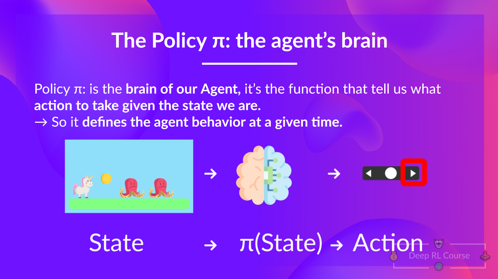
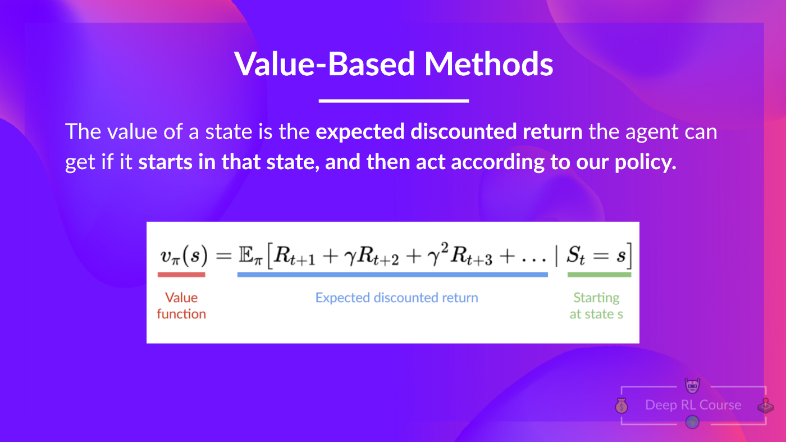
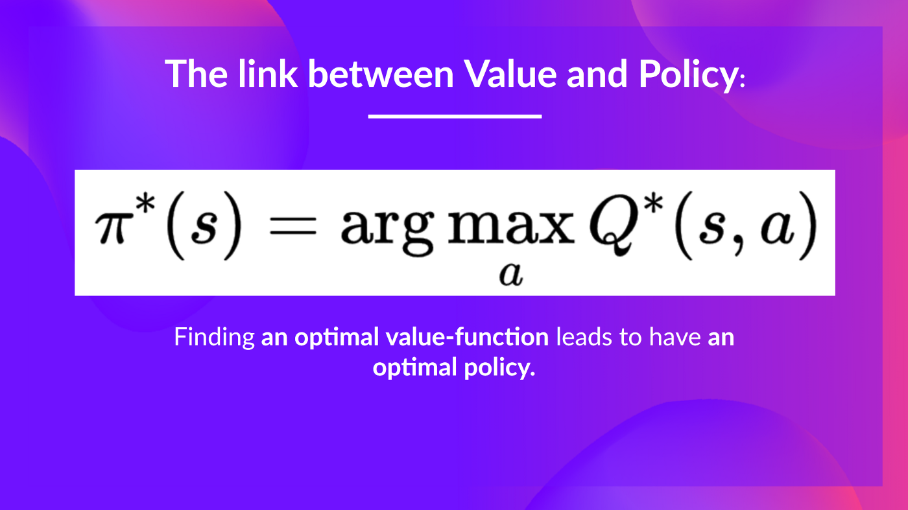
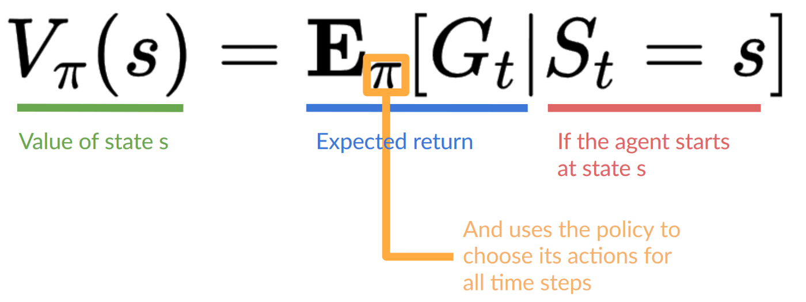
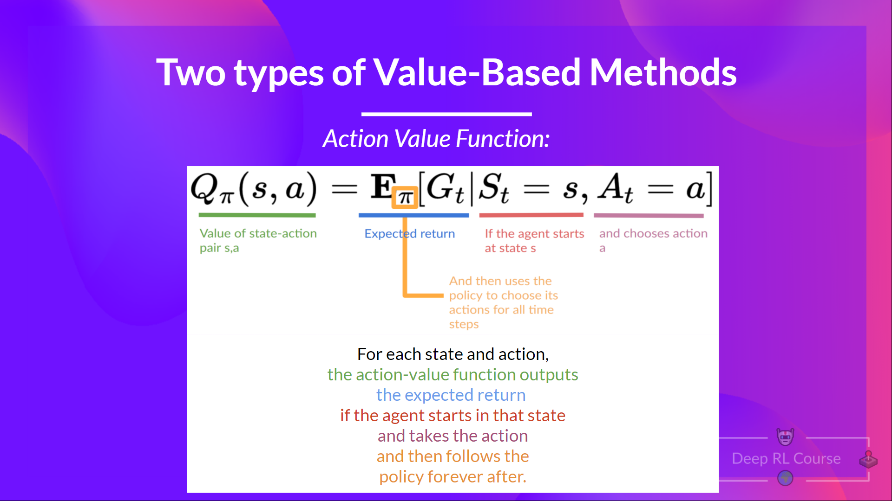
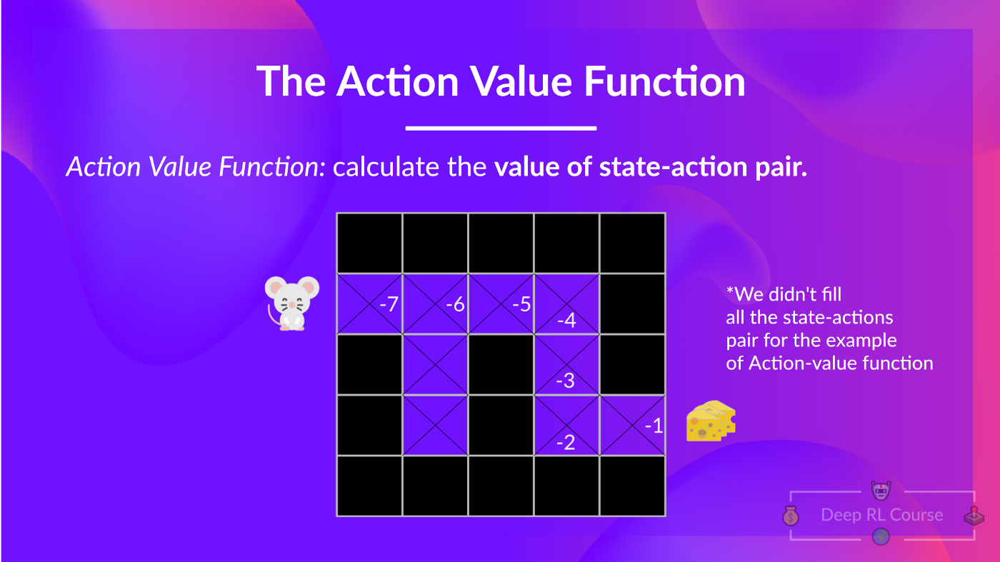
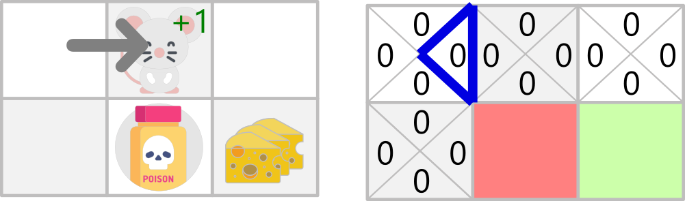
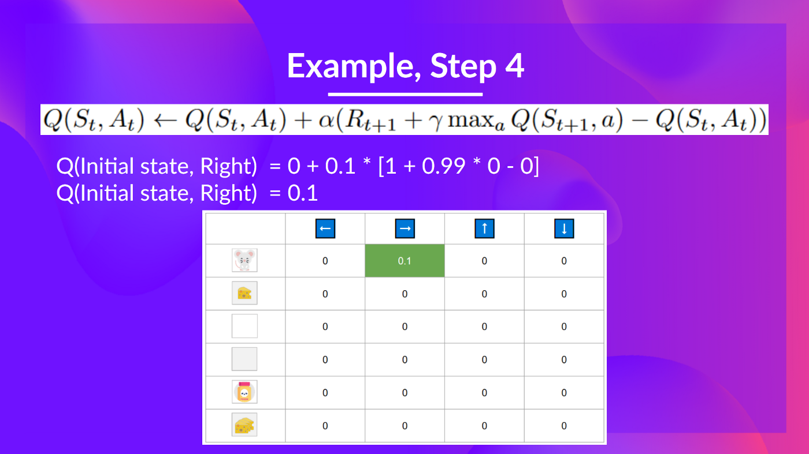
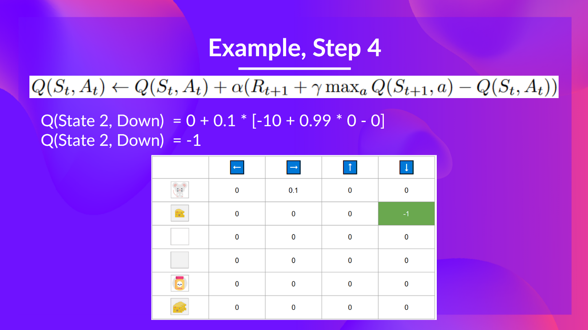

<html>
<head>

<h1>An Introduction to Q-Learning</h1>
<h2>Chapter 2 of the <a href="https://github.com/huggingface/deep-rl-class">Deep Reinforcement Learning Class with Hugging Face 🤗</a></h2>

    <a href="/ThomasSimonini">
        
        

            <code>ThomasSimonini</code>
            Thomas Simonini
        

  </a>

</head>

<body>

*This article is part of the Deep Reinforcement Learning Class. A free course from beginner to expert. Check the syllabus [here.](https://github.com/huggingface/deep-rl-class)*
---
In the [first chapter of this class](https://huggingface.co/blog/deep-rl-intro), we learned about Reinforcement Learning (RL), the RL process, and the different methods to solve an RL problem. We also trained our first lander agent to **land correctly on the Moon 🌕 and uploaded it to the Hugging Face Hub.**

So today, we're going to **dive deeper into one of the Reinforcement Learning methods: value-based methods** and study our first RL algorithm: **Q-Learning.**

We'll also **implement our first RL agent from scratch**: a Q-Learning agent and will train it in two environments:

1. Frozen-Lake-v1 (non-slippery version): where our agent will need to **go from the starting state (S) to the goal state (G)** by walking only on frozen tiles (F) and avoiding holes (H).
2. An autonomous taxi will need **to learn to navigate** a city to **transport its passengers from point A to point B.**

TODO: add video

In the first part, we'll **learn about the value-based methods and the difference between Monte Carlo and Temporal Difference Learning.**

And in the second part, **we'll study our first RL algorithm: Q-Learning, and implement our first RL Agent.**

This chapter is fundamental **if you want to be able to work on Deep Q-Learning** (chapter 3): the first Deep RL algorithm that was able to play Atari games and **beat the human level on some of them** (breakout, space invaders…).

So let's get started!

TODO: Add table des matières

## **What is RL? A short recap**

In RL, we build an agent that can **make smart decisions**. For instance, an agent that **learns to play a video game.** Or a trading agent that **learns to maximize its benefits** by making smart decisions on **what stocks to buy and when to sell.**
  
<figure class="image table text-center m-0 w-full">
  
</figure>

But, to make intelligent decisions, our agent will learn from the environment by **interacting with it through trial and error** and receiving rewards (positive or negative) **as unique feedback.**

Its goal **is to maximize its expected cumulative reward** (because of the reward hypothesis).

**The agent's brain is called the policy π.** It's where the agent makes its decision-making process: given a state, our policy will output an action or a probability distribution over actions.

<figure class="image table text-center m-0 w-full">
  
</figure>

**Our goal is to find an optimal policy π***, aka, a policy that leads to the best expected cumulative reward.

And to find this optimal policy (hence solving the RL problem), there **are two main types of RL methods**:

- *Policy-based methods*: **Train our policy directly** to learn which action to take, given a state.
- *Value-based methods*: **Train a value function** to learn **which state is more valuable** and use this value function **to take the action that leads to it.**

<figure class="image table text-center m-0 w-full">
  
</figure>

And in this chapter, **we'll dive deeper into the Value-based methods.**

## **The two types of value-based methods**

In value-based methods, **we learn a value function** that **maps a state to the expected value of being at that state.**

<figure class="image table text-center m-0 w-full">
  
</figure>

The value of a state is the **expected discounted return** the agent can get if it **starts at that state and then acts according to our policy.**

=> But what means acting according to our policy? We don't have a policy in value-based methods since we train a value function and not a policy?

Remember that the goal of an *RL agent is to have an optimal policy π.**

To find it, we learned that there are two different methods:

- *Policy-based methods:* **Directly train the policy** to select what action to take given a state (or a probability distribution over actions at that state). In this case, we **don't have a value function.**

<figure class="image table text-center m-0 w-full">
  
</figure>

The policy takes a state as input and outputs what action to take at that state (deterministic policy).

And consequently, **we don't define by hand the behavior of our policy; it's the training that will define it.**

- *Value-based methods:* **Indirectly, by training a value function** that outputs the value of a state or a state-action pair. Given this value function, our policy **will take action.**

But, because we didn't train our policy, **we need to specify its behavior.** For instance, if we want a policy that, given the value function, will take actions that always lead to the biggest value, **we'll create a Greedy Policy.**

<figure class="image table text-center m-0 w-full">
  
</figure>

Given a state, our action-value function (that we train) outputs the value of each action at that state, then our greedy policy (that we defined) selects the action with the biggest state-action pair value.

Consequently, whatever method you use to solve your problem, **you will have a policy**, but in the case of value-based methods you don't train it, your policy **is just a simple function that you specify** (for instance greedy policy) and this policy **uses the values given by the value-function to select its actions.**

So the difference is:

- In policy-based, **the optimal policy is found by training the policy directly.**
- In value-based, **finding an optimal value function leads to having an optimal policy.**

<figure class="image table text-center m-0 w-full">
  
</figure>

In fact, most of the time, in value-based methods, you'll use **an Epsilon-Greedy Policy** that handles the exploration/exploitation trade-off; we'll talk about it when we talk about Q-Learning in the second part of this chapter.

So, we have two types of value-based functions:

### **The State-Value function**

We write the state value function under a policy π like this:

<figure class="image table text-center m-0 w-full">
  
</figure>

For each state, the state-value function outputs the expected return if the agent **starts at that state,** and then follow the policy forever after (for all future timesteps if you prefer).

<figure class="image table text-center m-0 w-full">
  
</figure>

If we take the state with value -7: it's the sum of Expected return starting at that state and taking actions according to our policy (greedy policy), so right, right, right, down, down, right, right.

### **The Action-Value function**

In the Action-value function, for each state and action pair, the action-value function **outputs the expected return** if the agent starts in that state and takes action, and then follows the policy forever after.

The value of taking action an in state s under a policy π is:

<figure class="image table text-center m-0 w-full">
  
</figure>
<figure class="image table text-center m-0 w-full">
  
</figure>

We see that the difference is:

- In state-value function, we calculate **the value of a state (St).**
- In action-value function, we calculate **the value of the state-action pair (St, At) hence the value of taking that action at that state.**

<figure class="image table text-center m-0 w-full">
  
</figure>

Note: We didn't fill all the state-action pairs for the example of Action-value function

In either case, whatever value function we choose (state-value or action-value function), **the value is the expected return.**

However, the problem is that it implies that **to calculate EACH value of a state or a state-action pair, we need to sum all the rewards an agent can get if it starts at that state.**

This can be a tedious process, and that's **where the Bellman equation comes to help us.**

## **The Bellman Equation: simplify our value estimation**

The Bellman equation **simplifies our state value or state-action value calculation.**

  
<figure class="image table text-center m-0 w-full">
  
</figure>

With what we learned from now, we know that if we calculate the V(St) (value of a state), we need to calculate the return starting at that state and then follow the policy forever after. **(Our policy that we defined in the following example is a Greedy Policy, and for simplification, we don't discount the reward).**

So to calculate V(St), we need to make the sum of the expected rewards. Hence:

<figure class="image table text-center m-0 w-full">
  
</figure>

To calculate the value of State 1: the sum of rewards **if the agent started in that state** and then followed the **greedy policy (taking actions that leads to the best states values) for all the time steps.**

Then, to calculate the V(St+1), we need to calculate the return starting at that state St+1.

<figure class="image table text-center m-0 w-full">
  
</figure>

To calculate the value of State 2: the sum of rewards **if the agent started in that state,** and then followed the **policy for all the time steps.**

So you see, that's a pretty tedious process if you need to do it for each state value or state-action value.

Instead of calculating the expected return for each state or each state-action pair, **we can use the Bellman equation.**

The Bellman equation is a recursive equation that works like this: instead of starting for each state from the beginning and calculating the return, we can consider the value of any state as:

**The immediate reward (Rt+1) + the discounted value of the state that follows (gamma * V(St+1)).**

<figure class="image table text-center m-0 w-full">
  
</figure>

If we go back to our example, the value of State 1= expected cumulative return if we start at that state.

<figure class="image table text-center m-0 w-full">
  
</figure>

To calculate the value of State 1: the sum of rewards **if the agent started in that state 1** and then followed the **policy for all the time steps.**

Which is equivalent to V(St) = Immediate reward (Rt+1) + Discounted value of the next state (Gamma * V(St+1))

<figure class="image table text-center m-0 w-full">
  
</figure>

For simplification, here we don't discount, so gamma = 1.

- The value of V(St+1) = Immediate reward (Rt+2) + Discounted value of the St+2 (Gamma * V(St+2)).
- And so on.

To recap, the idea of the Bellman equation is that instead of calculating each value as the sum of the expected return, **which is a long process.** This is equivalent **to the sum of immediate reward + the discounted value of the state that follows.**

# **Monte Carlo vs Temporal Difference Learning**

The last thing we need to talk about before diving into Q-Learning is the two ways of learning whatever the RL method we use.

Remember that an RL agent **learns by interacting with its environment.** The idea is that **using the experience taken**, given the reward he gets, will **update its value or policy.**

Monte Carlo and Temporal Difference Learning are two different **strategies on how to train our value function or our policy function.** Both of them **use experience to solve the RL problem.**

But on the one hand, Monte Carlo uses **an entire episode of experience before learning.** On the other hand, Temporal Difference uses **only a step (St, At, Rt+1, St+1) to learn.**

We'll explain both of them **using a value-based method example.**

## **Monte Carlo: learning at the end of the episode**

Monte Carlo waits until the end of the episode, calculates Gt (return) and uses it as **a target for updating V(St).**

So it requires a **complete entire episode of interaction before updating our value function.**

<figure class="image table text-center m-0 w-full">
  
</figure>

If we take an example:

<figure class="image table text-center m-0 w-full">
  
</figure>

- We always start the episode **at the same starting point.**
- **We try actions using our policy** (for instance, using Epsilon Greedy Strategy, an policy that alternates between exploration (random actions) and exploitation).
- We get **the reward and the Next State.**
- We terminate the episode if the cat eats us or if we move > 10 steps.
- At the end of the episode, **we have a list of State, Actions, Rewards, and Next States**
- **The agent will sum the total rewards Gt** (to see how well it did).
- It will then **update V(st) based on the formula**

<figure class="image table text-center m-0 w-full">
  
</figure>

- Then **start a new game with this new knowledge**

By running more and more episodes, **the agent will learn to play better and better.**

For instance, if we train a state-value function using Monte Carlo:

- We just started to train our Value function, **so it returns 0 value for each state**
- Our learning rate (lr) is 0.1 and our discount rate is 1 (= no discount)
- Our mouse **explore the environment and take random actions**

<figure class="image table text-center m-0 w-full">
  
</figure>
  
- The mouse made more than 10 steps, so the episode ends .
- We have a list of state, action, rewards, next_state, **we need to calculate the return Gt**
- Gt = Rt+1 + Rt+2 + Rt+3… (for simplicity we don’t discount the rewards).
- Gt = 1 + 0 + 0 + 0+ 0 + 0 + 1 + 1+ 0 + 0
- Gt= 3
- We can now update V(S0):

<figure class="image table text-center m-0 w-full">
  
</figure>

- New V(S0) = V(S0) + lr * [Gt — V(S0)]
- New V(S0) = 0 + 0.1 * [3 –0]
- The new V(S0) = 0.3

## **Temporal Difference Learning: learning at each step**

- **Temporal difference, on the other hand, waits for only one interaction (one step) St+1**
- to form a TD target and update V(St) using Rt+1 and gamma * V(St+1).

The idea is that with **TD, we update the V(St) at each step.**

But because we didn't play during an entire episode, we don't have Gt (expected return). Instead**, we estimate Gt by adding Rt+1 and the discounted value of the next state.**

We speak about **bootstrap because TD bases its update part on an existing estimate V(St+1) and not a complete sample Gt.**

<figure class="image table text-center m-0 w-full">
  
</figure>

This method is called TD(0) or **one-step TD (update the value function after any individual step).**

If we take the same example,

<figure class="image table text-center m-0 w-full">
  
</figure>

- We just started to train our Value function, so it returns 0 value for each state.
- Our learning rate (lr) is 0.1, and our discount rate is 1 (no discount).
- Our mouse explore the environment and take a random action: **going to the left**
- It gets a reward Rt+1 = 1 since **it eats a piece of cheese**

<figure class="image table text-center m-0 w-full">
  
</figure>

We can now update V(S0):

New V(S0) = V(S0) + lr * [R1 + gamma * V(S1) — V(S0)]

New V(S0) = 0 + 0.1 * [1 + 0.99 * 0–0]

The new V(S0) = 0.1

So we just updated our value function for State 0.

Now we **continue to interact with this environment with our updated value function.**

If we summarize:

- With Monte Carlo, we update the value function from a complete episode, and so we **use the actual accurate discounted return of this episode.**
- With TD learning, we update the value function from a step, so we replace Gt that we don't have with **an estimated return called TD target.**

<figure class="image table text-center m-0 w-full">
  
</figure>

So now, before diving on Q-Learning, let's summarise what we just learned:

We have two types of value-based functions:

- State-value function: outputs the expected return if **I start at that state and then act accordingly to the policy forever after.**
- Action-Value function: outputs the expected return if **I start in that state and I take that action at that state** and then I act accordingly to the policy forever after.
- In value-based methods, **we define the policy by hand** because we don't train it, we train a value function. The idea is that if we have an optimal value function, we **will have an optimal policy.**

There are two types of methods to learn a policy or a value function:

- With *the Monte Carlo method*, we update the value function from a complete episode, and so we **use the actual accurate discounted return of this episode.**
- With *the TD Learning method,* we update the value function from a step, so we replace Gt that we don't have with **an estimated return called TD target.**

<figure class="image table text-center m-0 w-full">
  
</figure>

## **Introducing Q-Learning**

### **What is Q-Learning?**

Q-Learning is an **off-policy value-based method that uses a TD approach to train its action-value function:**

- *Off-policy: we'll talk about that at the end* of this chapter.
- *Value-based method*: it finds its optimal policy indirectly by training a value-function or action-value function that will tell us **the value of each state or each state-action pair.**
- *Uses a TD approach:* **updates its action-value function at each step.**

**Q-Learning is the algorithm we use to train our Q-Function**, an **action-value function** that determines the value of being at a particular state, and taking a specific action at that state.

<figure class="image table text-center m-0 w-full">
  
</figure>

Given a state and action, our Q Function outputs a state-action value (also called Q-value)

The **Q comes from "the Quality" of that action at that state.**

Internally, our Q-function has **a Q-table, a table where each cell corresponds to a state-action value pair value.** Think of this Q-table as **the memory or cheat sheet of our Q-function.**

If we take this maze example:

<figure class="image table text-center m-0 w-full">
  
</figure>

The Q-Table is initialized. That's why all values are = 0. This table **contains, for each state, the four state-action values.**

<figure class="image table text-center m-0 w-full">
  
</figure>

Here we see that the **state-action value of the initial state and going up is 0:**

MISSING PICTURE

Therefore, Q-function contains a Q-table **that has the value of each-state action pair.** And given a state and action, **our Q-Function will search inside its Q-table to output the value.**

<figure class="image table text-center m-0 w-full">
  
  <figcaption>Given a state and action pair, our Q-function will search inside its Q-table to output the state-action pair value (the Q value).</figcaption>
</figure>

If we recap, *Q-Learning* **is the RL algorithm that:**

- Trains *Q-Function*, an **action-value function** that contains, as internal memory, a *****Q-table* **that contains all the state-action pair values.**
- Given a state and action, our Q-Function **will search into its Q-table the corresponding value.**

<figure class="image table text-center m-0 w-full">
  
</figure>

- When the training is done, **we have an optimal Q-function, so an optimal Q-Table.**
- And if we **have an optimal Q-function**, we **have an optimal policy** since we **know for each state what is the best action to take.**

<figure class="image table text-center m-0 w-full">
  
</figure>

But, in the beginning, **our Q-Table is useless since it gives arbitrary values for each state-action pair** (most of the time, we initialize the Q-Table to 0 values). But, as we'll **explore the environment and update our Q-Table, it will give us better and better approximations.**

<figure class="image table text-center m-0 w-full">
  
</figure>

We see here that with the training, our Q-Table is better since, thanks to it, we can know the value of each state-action pair.

So now that we understand what Q-Learning, Q-Function, and Q-Table are, **let's dive deeper into the Q-Learning algorithm**.

### **The Q-Learning algorithm**

This is the Q-Learning pseudocode; let's study each part and **see how it works with a simple example before implementing it.**

<figure class="image table text-center m-0 w-full">
  
</figure>

**Step 1: We initialize the Q-Table**

<figure class="image table text-center m-0 w-full">
  
</figure>

We need to initialize the Q-Table for each state-action pair. **Most of the time, we initialize with values of 0.**

**Step 2: Choose action using Epsilon Greedy Strategy**

<figure class="image table text-center m-0 w-full">
  
</figure>

Epsilon Greedy Strategy is a policy that handles the exploration/exploitation trade-off.

The idea is that we define epsilon ɛ = 1.0:

- *With probability 1 — ɛ* : we do **exploitation** (aka our agent selects the action with the highest state-action pair value).
- With probability ɛ: **we do exploration** (trying random action).

At the beginning of the training, **the probability of doing exploration will be huge since ɛ is very high, so most of the time, we'll explore.** But as the training goes on, and consequently our **Q-Table gets better and better in its estimations, we progressively reduce the epsilon value** since we will need less and less exploration and more exploitation.

<figure class="image table text-center m-0 w-full">
  
</figure>

**Step 3: Perform action At, gets Rt+1 and St+1**

<figure class="image table text-center m-0 w-full">
  
</figure>

**Step 4: Update Q(St, At)**

Remember that in TD Learning, we update our policy or value function (depending on the RL method we choose) **after one step of the interaction.**

To produce our TD target, **we used the immediate reward Rt+1 plus the discounted value of the next state best state-action pair** (we call that bootstrap).

<figure class="image table text-center m-0 w-full">
  
</figure>

Therefore, our Q(St, At) **update formula goes like this:**

  <figure class="image table text-center m-0 w-full">
  
</figure>

It means that to update our Q(St,At):

- We need St, At, Rt+1, St+1.
- To update our Q-value at this state-action pair, we form our TD target:

We use Rt+1, and to get the **best next-state-action pair value,** we select with a greedy policy **(so not our epsilon greedy policy)** the next best action (so the action with the highest state-action value).

Then when the update of this Q-value is done. We start in a new_state and select our action **using our epsilon-greedy policy again.**

**It's why we say that this is an off-policy algorithm.**

### **Off-policy vs On-policy**

The difference is subtle:

- *Off-policy*: using **a different policy for acting and updating.**

For instance, with Q-Learning, the Epsilon greedy policy (acting policy), is different from the greedy policy that is **used to select the best next-state action value to update our Q-value (updating policy).**

<figure class="image table text-center m-0 w-full">
  
</figure>

Is different from the policy we use during the training part:

<figure class="image table text-center m-0 w-full">
  
</figure>

Updating policy

- *On-policy:* using the **same policy for acting and updating.**

For instance, with Sarsa, another value-based algorithm, **the Epsilon-Greedy Policy selects the next_state-action pair, not a greedy policy.**

<figure class="image table text-center m-0 w-full">
  
    <figcaption>Sarsa</figcaption>
</figure>

<figure class="image table text-center m-0 w-full">
  
    <figcaption>Sarsa</figcaption>
</figure>

## **An example**

To better understand Q-Learning let's take a simple example:

<figure class="image table text-center m-0 w-full">
  
</figure>

- You're a mouse in this tiny maze. You always **start at the same starting point.**
- The goal is **to eat the big pile of cheese at the bottom right-hand corner** and avoid the poison.
- The episode ends if we eat the poison, **eat the big pile of cheese or if we spent more than five steps.**
- The learning rate is 0.1
- The gamma (discount rate) is 0.99

The reward function goes like this:

- **+0:** Going to a state with no cheese in it.
- **+1:** Going to a state with a small cheese in it.
- **+10:** Going to the state with the big pile of cheese.
- **10:** Going to the state with the poison and thus die.

To train our agent to have an optimal policy (so a policy that goes right, right, down). **We will use the Q-Learning algorithm.**

**Step 1: We initialize the Q-Table**

<figure class="image table text-center m-0 w-full">
  
</figure>

So, for now, **our Q-Table is useless**; we need **to train our Q-function using the Q-Learning algorithm.**

Let's do it for 2 training timesteps:

Training timestep 1:

**Step 2: Choose action using Epsilon Greedy Strategy**

Because epsilon is big = 1.0, I take a random action, in this case, I go right.

<figure class="image table text-center m-0 w-full">
  
</figure>

**Step 3: Perform action At, gets Rt+1 and St+1**

By going right, I've got a small cheese, so Rt+1 = 1, and I'm in a new state.

<figure class="image table text-center m-0 w-full">
  
</figure>

**Step 4: Update Q(St, At)**

We can now update Q(St, At) using our formula.

<figure class="image table text-center m-0 w-full">
  
</figure>

Training timestep 2:

**Step 2: Choose action using Epsilon Greedy Strategy**

**I take a random action again, since epsilon is big 0.99** (since we decay it a little bit because as the training progress, we want less and less exploration).

I took action down. **Not a good action since it leads me to the poison.**

<figure class="image table text-center m-0 w-full">
  
</figure>

**Step 3: Perform action At, gets Rt+1 and St+1**

Because I go to the poison state, **I get Rt+1 = -10, and I die.**

<figure class="image table text-center m-0 w-full">
  
</figure>

**Step 4: Update Q(St, At)**

<figure class="image table text-center m-0 w-full">
  
  </figure>
  
Because we're dead, we start a new episode. But what we see here is that **with two explorations steps, my agent became smarter.**

As we continue exploring and exploiting the environment and updating Q-values using TD target, **Q-Table will give us better and better approximations. And thus, at the end of the training, we'll get an optimal Q-Function.**
