<h1>An Introduction to Deep Reinforcement Learning</h1>
<h2>Chapter 1 of the <a href="https://github.com/huggingface/deep-rl-class">Deep Reinforcement Learning Class with Hugging Face 🤗</a></h2>

    <a href="/thomassimonini">
        
        

            <code>thomassimonini</code>
            Thomas Simonini
        

    </a>

*This article is part of the Deep Reinforcement Learning Class. A free course from beginner to expert. Check the syllabus [here.](https://github.com/huggingface/deep-rl-class)*
---

Welcome to the most fascinating topic in Artificial Intelligence: **Deep Reinforcement Learning.**

Deep RL is a type of Machine Learning where an agent learns **how to behave** in an environment **by performing actions** and **seeing the results.**

Since 2013 and the [Deep Q-Learning paper](https://www.cs.toronto.edu/~vmnih/docs/dqn.pdf), we’ve seen a lot of breakthroughs. From OpenAI [five that beat some of the best Dota2 players of the world,](https://www.twitch.tv/videos/293517383) to the [Dexterity project](https://openai.com/blog/learning-dexterity/), we **live in an exciting moment in Deep RL research.**

<figure class="image table text-center m-0 w-full">
  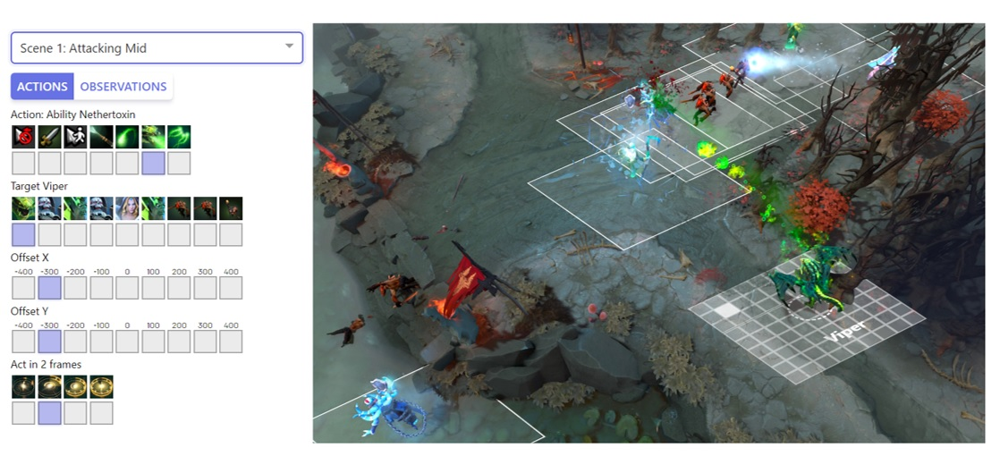
  <figcaption>OpenAI Five, an AI <a href="https://www.twitch.tv/videos/293517383">that beat some of the best Dota2 players in the world</a></figcaption>
</figure>

Moreover, since 2018, **you have now, access to so many amazing environments and libraries to build your agents.**

That’s why this is the best moment to start learning, and with this course **you’re in the right place.**

Yes, because this article is the first unit of [Deep Reinforcement Learning Class](https://github.com/huggingface/deep-rl-class), a **free class from beginner to expert** where you’ll learn the theory and practice using famous Deep RL libraries such as Stable Baselines3, RL Baselines3 Zoo and RLlib.

In this free course, you will:

- 📖 Study Deep Reinforcement Learning in **theory and practice**.
- 🧑‍💻 Learn to **use famous Deep RL libraries** such as Stable Baselines3, RL Baselines3 Zoo, and RLlib.
- 🤖 Train agents in **unique environments** such as SnowballFight, Huggy the Doggo 🐶, and classical ones such as Space Invaders and PyBullet.
- 💾 Publish your trained agents **in one line of code to the Hub**. But also download powerful agents from the community.
- 🏆 **Participate in challenges** where you will evaluate your agents against other teams.
- 🖌️🎨 Learn to **share your environments** made with Unity and Godot.

So in this first unit, **you’ll learn the foundations of deep reinforcement learning.** And then, you'll train your first lander agent to **land correctly on the Moon 🌕 and upload it to the Hugging Face Hub, a free, open platform where people can share ML models, datasets and demos.**

<figure class="image table text-center m-0 w-full">
    <video
        alt="LunarLander"
        style="max-width: 70%; margin: auto;"
        autoplay loop autobuffer muted playsinline
    >
      <source src="assets/63_deeprlclass_unit1/lunarlander.mp4" type="video/mp4">
  </video>
</figure>

It’s essential **to master these elements** before diving into implementing Deep Reinforcement Learning agents. The goal of this chapter is to give you solid foundations.

If you prefer, you can watch the 📹 video version of this chapter :

<iframe width="560" height="315" src="https://www.youtube.com/embed/q0BiUn5LiBc?start=127" title="YouTube video player" frameborder="0" allow="accelerometer; autoplay; clipboard-write; encrypted-media; gyroscope; picture-in-picture" allowfullscreen></iframe>

So let’s get started! 🚀

## **What is Reinforcement Learning?**

To understand reinforcement learning, let’s start with the big picture.

### **The big picture**

The idea behind Reinforcement Learning is that an agent (an AI) will learn from the environment by **interacting with it** (through trial and error) and **receiving rewards** (negative or positive) as feedback for performing actions.

Learning from interaction with the environment **comes from our natural experiences.**

For instance, imagine putting your little brother in front of a video game he never played, a controller in his hands, and letting him alone.

<figure class="image table text-center m-0 w-full">
  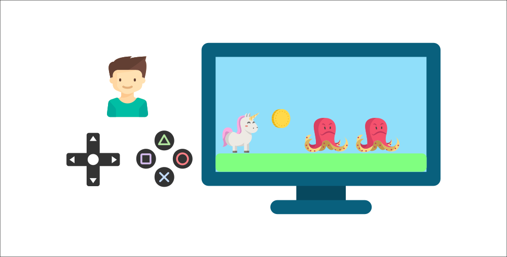
</figure>

Your brother will interact with the environment (the video game) by pressing the right button (action). He got a coin, that’s a +1 reward. It’s positive, he just understood that in this game **he must get the coins.**

<figure class="image table text-center m-0 w-full">
  
</figure>

But then, **he presses right again** and he touches an enemy, he just died -1 reward.

<figure class="image table text-center m-0 w-full">
  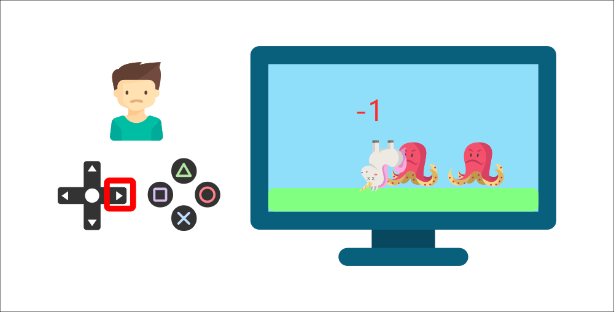
</figure>

By interacting with his environment through trial and error, your little brother understood that **he needed to get coins in this environment but avoid the enemies.**

**Without any supervision**, the child will get better and better at playing the game.

That’s how humans and animals learn, **through interaction.** Reinforcement Learning is just a **computational approach of learning from action.**

### **A formal definition**

If we take now a formal definition:

> Reinforcement learning is a framework for solving control tasks (also called decision problems) by building agents that learn from the environment by interacting with it through trial and error and receiving rewards (positive or negative) as unique feedback.
>

⇒ But how Reinforcement Learning works?

## **The Reinforcement Learning Framework**
### **The RL Process**

<figure class="image table text-center m-0 w-full">
  
  <figcaption>The RL Process: a loop of state, action, reward and next state</figcaption>
</figure>

To understand the RL process, let’s imagine an agent learning to play a platform game:

<figure class="image table text-center m-0 w-full">
  
</figure>

- Our Agent receives **state S0** from the **Environment** — we receive the first frame of our game (Environment).
- Based on that **state S0,** the Agent takes **action A0** — our Agent will move to the right.
- Environment goes to a **new** **state S1** — new frame.
- The environment gives some **reward R1** to the Agent — we’re not dead *(Positive Reward +1)*.

This RL loop outputs a sequence of **state, action, reward and next state.**

<figure class="image table text-center m-0 w-full">
  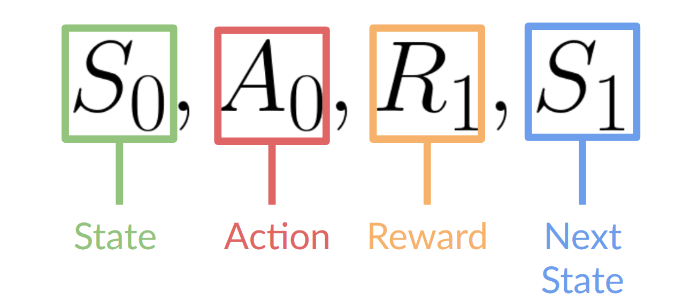
</figure>

The agent's goal is to maximize its cumulative reward, **called the expected return.**

### **The reward hypothesis: the central idea of Reinforcement Learning**

⇒ Why is the goal of the agent to maximize the expected return?

Because RL is based on the **reward hypothesis**, which is that all goals can be described as the **maximization of the expected return** (expected cumulative reward).

That’s why in Reinforcement Learning, **to have the best behavior,** we need to **maximize the expected cumulative reward.**

### **Markov Property**

In papers, you’ll see that the RL process is called the **Markov Decision Process** (MDP).

We’ll talk again about the Markov Property in the following units. But if you need to remember something today about it, Markov Property implies that our agent needs **only the current state to decide** what action to take and **not the history of all the states** **and actions** they took before.

### **Observations/States Space**

Observations/States are the **information our agent gets from the environment.** In the case of a video game, it can be a frame (a screenshot). In the case of the trading agent, it can be the value of a certain stock, etc.

There is a differentiation to make between *observation* and *state*:

- *State s*: is **a complete description of the state of the world** (there is no hidden information). In a fully observed environment.

<figure class="image table text-center m-0 w-full">
  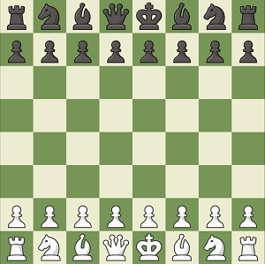
  <figcaption>In chess game, we receive a state from the environment since we have access to the whole check board information.</figcaption>
</figure>

In chess game, we receive a state from the environment since we have access to the whole check board information.

With a chess game, we are in a fully observed environment, since we have access to the whole check board information.

- *Observation o*: is a **partial description of the state.** In a partially observed environment.

<figure class="image table text-center m-0 w-full">
  
  <figcaption>In Super Mario Bros, we only see a part of the level close to the player, so we receive an observation.</figcaption>
</figure>

In Super Mario Bros, we only see a part of the level close to the player, so we receive an observation.

In Super Mario Bros, we are in a partially observed environment. We receive an observation **since we only see a part of the level.**

> In reality, we use the term state in this course but we will make the distinction in implementations.
>

To recap:
<figure class="image table text-center m-0 w-full">
  
</figure>

### Action Space

The Action space is the set of **all possible actions in an environment.**

The actions can come from a *discrete* or *continuous space*:

- *Discrete space*: the number of possible actions is **finite**.

<figure class="image table image-center text-center m-0 w-full">
  
  <figcaption>Again, in Super Mario Bros, we have only 4 directions and jump possible</figcaption>
</figure>

In Super Mario Bros, we have a finite set of actions since we have only 4 directions and jump.

- *Continuous space*: the number of possible actions is **infinite**.
<figure class="image table text-center m-0 w-full">
  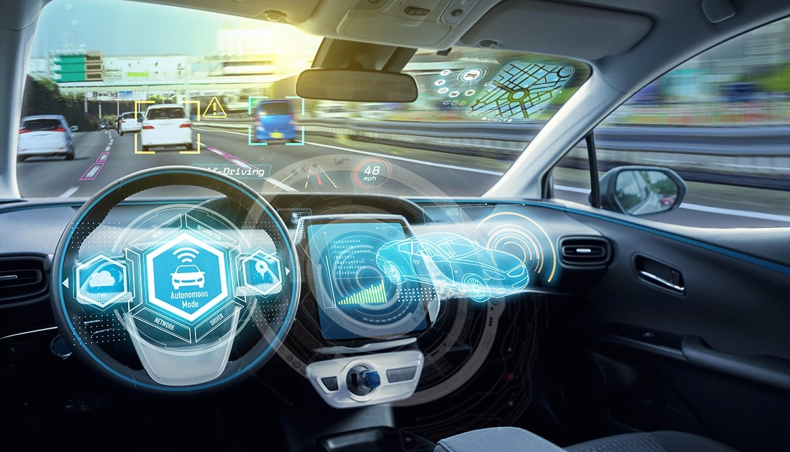
  <figcaption>A Self Driving Car agent has an infinite number of possible actions since he can turn left 20°, 21°, 22°, honk, turn right 20°, 20,1°…
</figcaption>
</figure>

To recap:
<figure class="image table text-center m-0 w-full">
  
</figcaption>
</figure>

Taking this information into consideration is crucial because it will **have importance when choosing the RL algorithm in the future.**

### **Rewards and the discounting**

The reward is fundamental in RL because it’s **the only feedback** for the agent. Thanks to it, our agent knows **if the action taken was good or not.**

The cumulative reward at each time step t can be written as:

<figure class="image table text-center m-0 w-full">
  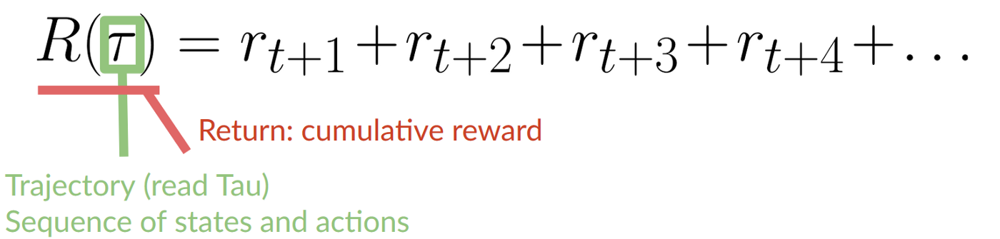
  <figcaption>The cumulative reward equals to the sum of all rewards of the sequence.
</figcaption>
</figure>

Which is equivalent to:

<figure class="image table text-center m-0 w-full">
  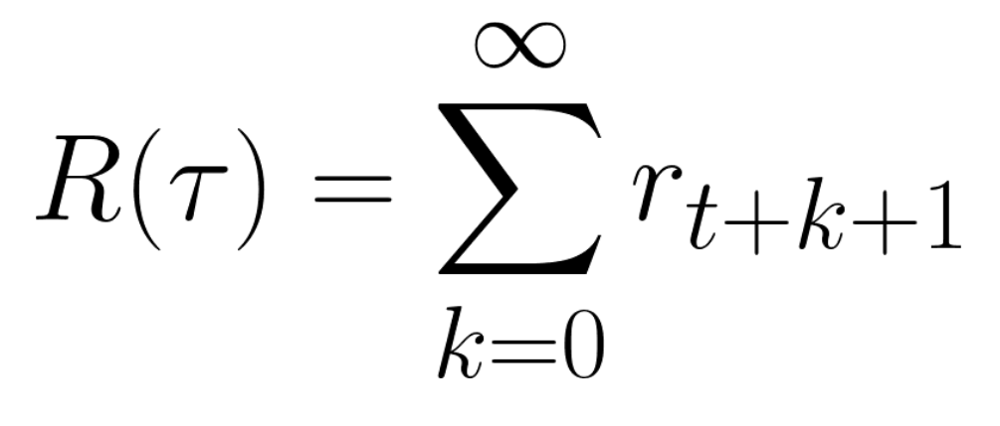
</figure>

However, in reality, **we can’t just add them like that.** The rewards that come sooner (at the beginning of the game) **are more likely to happen** since they are more predictable than the long-term future reward.

Let’s say your agent is this tiny mouse that can move one tile each time step, and your opponent is the cat (that can move too). Your goal is **to eat the maximum amount of cheese before being eaten by the cat.**

<figure class="image table text-center m-0 w-full">
  
</figure>

As we can see in the diagram, **it’s more probable to eat the cheese near us than the cheese close to the cat** (the closer we are to the cat, the more dangerous it is).

Consequently, **the reward near the cat, even if it is bigger (more cheese), will be more discounted** since we’re not really sure we’ll be able to eat it.

To discount the rewards, we proceed like this:

1. We define a discount rate called gamma. **It must be between 0 and 1.**

- The larger the gamma, the smaller the discount. This means our agent **cares more about the long-term reward.**

- On the other hand, the smaller the gamma, the bigger the discount. This means our **agent cares more about the short term reward (the nearest cheese).**

2. Then, each reward will be discounted by gamma to the exponent of the time step. As the time step increases, the cat gets closer to us, **so the future reward is less and less likely to happen.**

Our discounted cumulative expected rewards is:

<figure class="image table text-center m-0 w-full">
  
</figure>

### Type of tasks

A task is an **instance** of a Reinforcement Learning problem. We can have two types of tasks: episodic and continuous.

#### Episodic task

In this case, we have a starting point and an ending point **(a terminal state). This creates an episode**: a list of States, Actions, Rewards, and new States.

For instance, think about Super Mario Bros: an episode begin at the launch of a new Mario Level and ending **when you’re killed or you reached the end of the level.**

<figure class="image table text-center m-0 w-full">
  
  <figcaption>Beginning of a new episode.
</figcaption>
</figure>

#### Continuous tasks

These are tasks that continue forever (no terminal state). In this case, the agent must **learn how to choose the best actions and simultaneously interact with the environment.**

For instance, an agent that does automated stock trading. For this task, there is no starting point and terminal state. **The agent keeps running until we decide to stop him.**

<figure class="image table text-center m-0 w-full">
  
</figure>

<figure class="image table text-center m-0 w-full">
  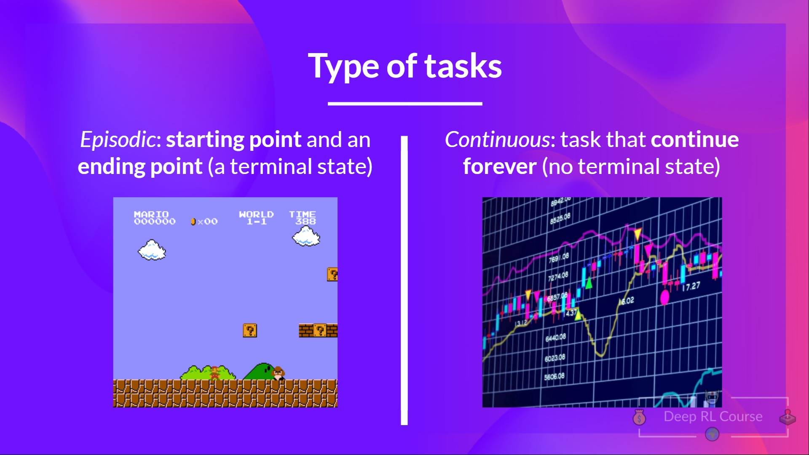
</figure>

## **Exploration/ Exploitation tradeoff**

Finally, before looking at the different methods to solve Reinforcement Learning problems, we must cover one more very important topic: *the exploration/exploitation trade-off.*

- Exploration is exploring the environment by trying random actions in order to **find more information about the environment.**

- Exploitation is **exploiting known information to maximize the reward.**

Remember, the goal of our RL agent is to maximize the expected cumulative reward. However, **we can fall into a common trap**.

Let’s take an example:

<figure class="image table text-center m-0 w-full">
  
</figure>

In this game, our mouse can have an **infinite amount of small cheese** (+1 each). But at the top of the maze, there is a gigantic sum of cheese (+1000).

However, if we only focus on exploitation, our agent will never reach the gigantic sum of cheese. Instead, it will only exploit **the nearest source of rewards,** even if this source is small (exploitation).

But if our agent does a little bit of exploration, it can **discover the big reward** (the pile of big cheese).

This is what we call the exploration/exploitation trade-off. We need to balance how much we **explore the environment** and how much we **exploit what we know about the environment.**

Therefore, we must **define a rule that helps to handle this trade-off**. We’ll see in future chapters different ways to handle it.

If it’s still confusing, **think of a real problem: the choice of a restaurant:**

<figure class="image table text-center m-0 w-full">
  
  <figcaption>Source: <a href="http://rail.eecs.berkeley.edu/deeprlcourse-fa17/f17docs/lecture_13_exploration.pdf"> Berkley AI Course</a>
</figcaption>
</figure>

- *Exploitation*: You go every day to the same one that you know is good and **take the risk to miss another better restaurant.**
- *Exploration*: Try restaurants you never went to before, with the risk of having a bad experience **but the probable opportunity of a fantastic experience.**

To recap:
<figure class="image table text-center m-0 w-full">
  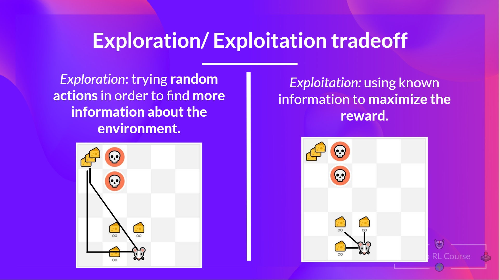
</figure>

## **The two main approaches for solving RL problems**

⇒ Now that we learned the RL framework, how do we solve the RL problem?

In other terms, how to build an RL agent that can **select the actions that maximize its expected cumulative reward?**

### **The Policy π: the agent’s brain**

The Policy **π** is the **brain of our Agent**, it’s the function that tell us what **action to take given the state we are.** So it **defines the agent’s behavior** at a given time.

<figure class="image table text-center m-0 w-full">
  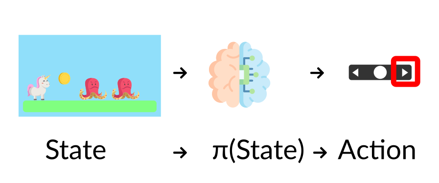
  <figcaption>Think of policy as the brain of our agent, the function that will tells us the action to take given a state
</figcaption>
</figure>

Think of policy as the brain of our agent, the function that will tells us the action to take given a state

This Policy **is the function we want to learn**, our goal is to find the optimal policy **π*, the policy that** maximizes **expected return** when the agent acts according to it. We find this **π* through training.**

There are two approaches to train our agent to find this optimal policy π*:

- **Directly,** by teaching the agent to learn which **action to take,** given the state is in: **Policy-Based Methods.**
- Indirectly, **teach the agent to learn which state is more valuable** and then take the action that **leads to the more valuable states**: Value-Based Methods.

### **Policy-Based Methods**

In Policy-Based Methods, **we learn a policy function directly.**

This function will map from each state to the best corresponding action at that state. **Or a probability distribution over the set of possible actions at that state.**

<figure class="image table text-center m-0 w-full">
  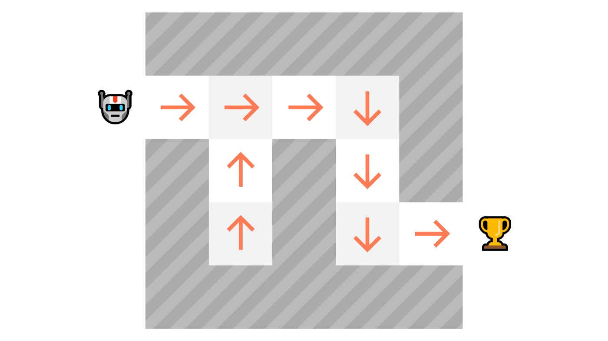
  <figcaption>As we can see here, the policy (deterministic) <b>directly indicates the action to take for each step.</b>
</figcaption>
</figure>

As we can see here, the policy (deterministic) **directly indicates the action to take for each step.**

We have two types of policy:

- *Deterministic*: a policy at a given state **will always return the same action.**

<figure class="image table text-center m-0 w-full">
  
  <figcaption>action = policy(state)
</figcaption>
</figure>

<figure class="image table text-center m-0 w-full">
  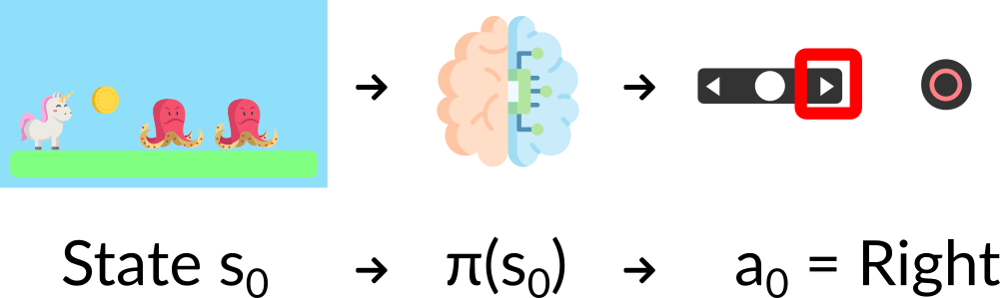
</figure>

- *Stochastic*: output **a probability distribution over actions.**

<figure class="image table text-center m-0 w-full">
  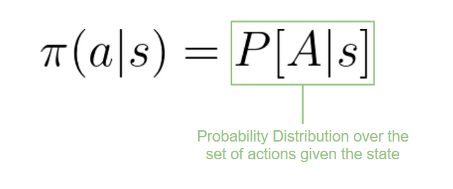
  <figcaption>policy(actions | state) = probability distribution over the set of actions given the current state
</figcaption>
</figure>

<figure class="image table text-center m-0 w-full">
  
  <figcaption>Given an initial state, our stochastic policy will output probability distributions over the possible actions at that state.
</figcaption>
</figure>

If we recap:

<figure class="image table text-center m-0 w-full">
  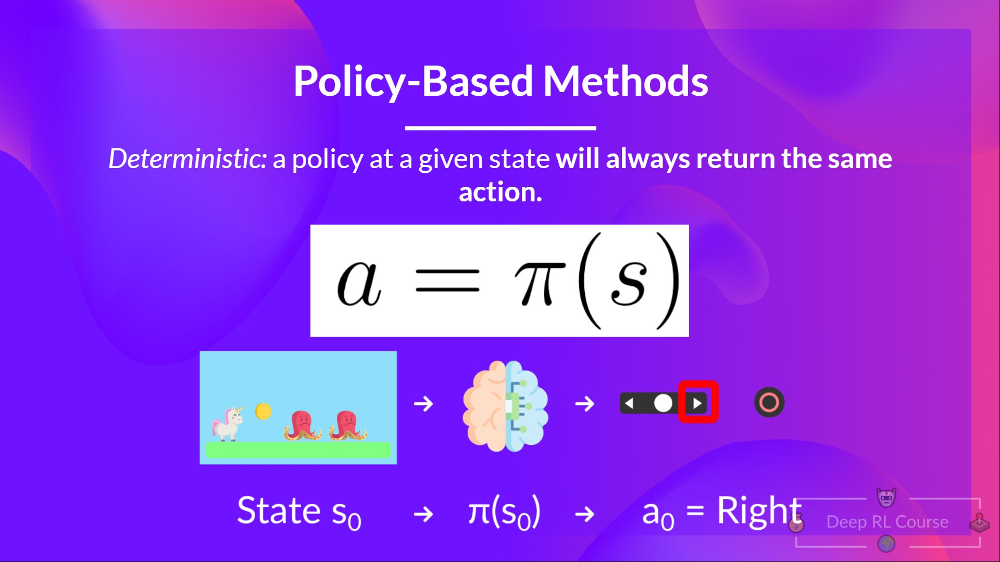
</figure>
<figure class="image table text-center m-0 w-full">
  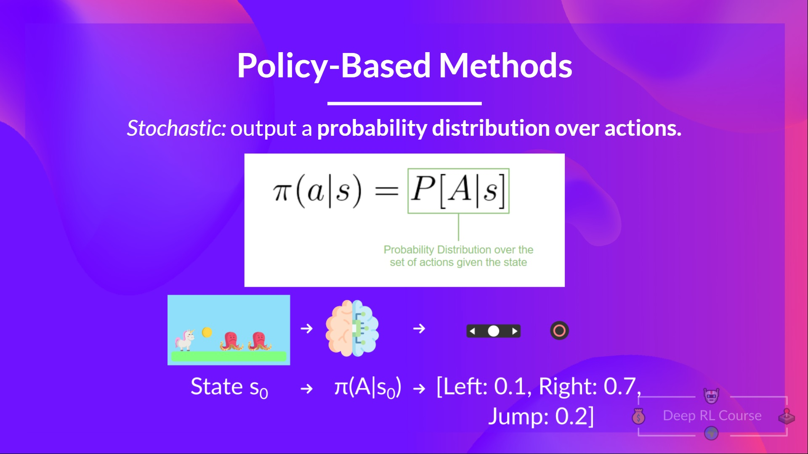
</figure>

### **Value-based methods**

In Value-based methods, instead of training a policy function, we **train a value function** that maps a state to the expected value **of being at that state.**

The value of a state is the **expected discounted return** the agent can get if it **starts in that state, and then act according to our policy.**

“Act according to our policy” just means that our policy is **“going to the state with the highest value”.**

<figure class="image table text-center m-0 w-full">
  
</figure>

Here we see that our value function **defined value for each possible state.**

<figure class="image table text-center m-0 w-full">
  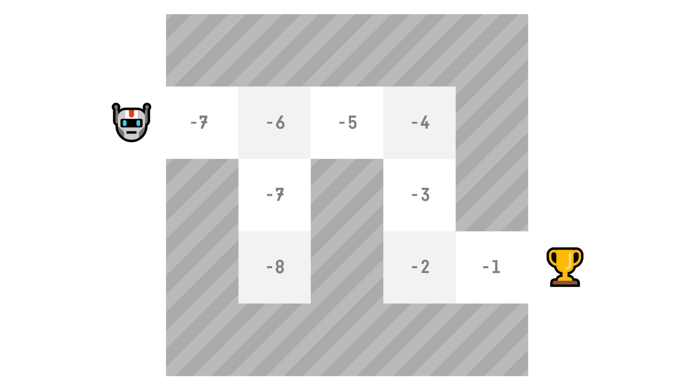
  <figcaption>Thanks to our value function, at each step our policy will select the state with the biggest value defined by the value function: -7, then -6, then -5 (and so on) to attain the goal.
</figcaption>
</figure>

Thanks to our value function, at each step our policy will select the state with the biggest value defined by the value function: -7, then -6, then -5 (and so on) to attain the goal.

If we recap:

<figure class="image table text-center m-0 w-full">
  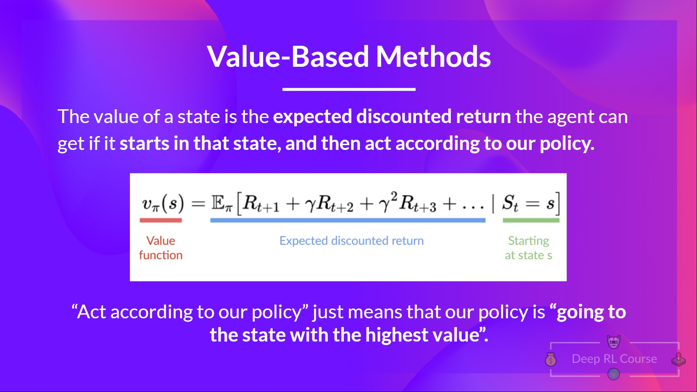
</figure>
<figure class="image table text-center m-0 w-full">
  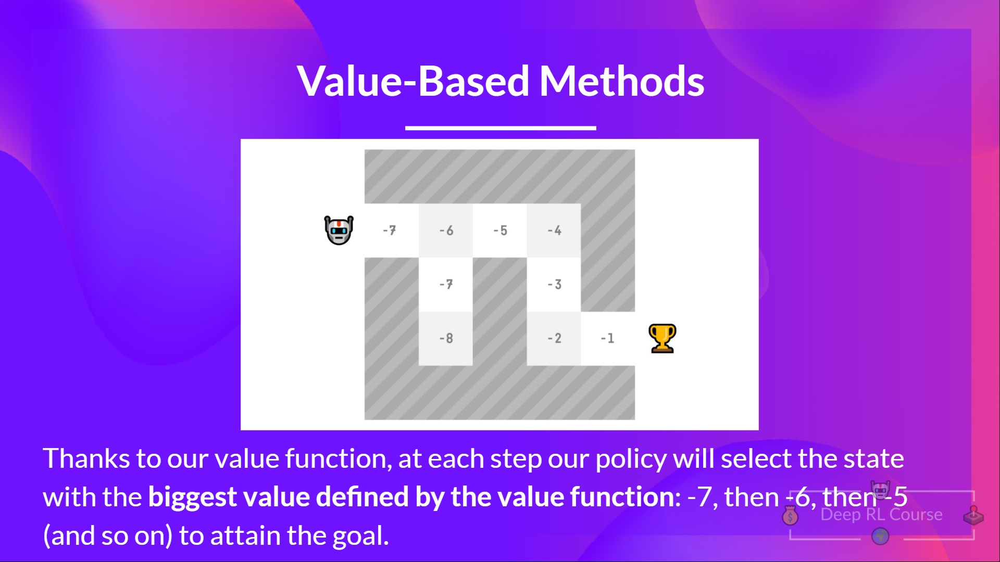
</figure>

## **The “Deep” in Reinforcement Learning**

⇒ Wait… you spoke about Reinforcement Learning, but why we spoke about Reinforcement Learning?

Deep Reinforcement Learning introduces **deep neural networks to solve Reinforcement Learning problems** — hence the name “deep.”

For instance, in the next article, we’ll work on Q-Learning (classic Reinforcement Learning) and then Deep Q-Learning both are value-based RL algorithms.

You’ll see the difference is that in the first approach, **we use a traditional algorithm** to create a Q table that helps us find what action to take for each state.

In the second approach, **we will use a Neural Network** (to approximate the q value).

<figure class="image table text-center m-0 w-full">
  
  <figcaption>Schema inspired by the Q learning notebook by Udacity
</figcaption>
</figure>

If you are not familiar with Deep Learning you definitely should watch <a href="http://introtodeeplearning.com/">the MIT Intro Course on Deep Learning (Free)</a>

That was a lot of information, if we summarize:

- Reinforcement Learning is a computational approach of learning from action. We build an agent that learns from the environment **by interacting with it through trial and error** and receiving rewards (negative or positive) as feedback.
- The goal of any RL agent is to maximize its expected cumulative reward (also called expected return) because RL is based on the **reward hypothesis**, which is that **all goals can be described as the maximization of the expected cumulative reward.**
- The RL process is a loop that outputs a sequence of **state, action, reward and next state.**
- To calculate the expected cumulative reward (expected return), we discount the rewards: the rewards that come sooner (at the beginning of the game) **are more probable to happen since they are more predictable than the long term future reward.**
- To solve an RL problem, you want to **find an optimal policy**, the policy is the “brain” of your AI that will tell us **what action to take given a state.** The optimal one is the one who **gives you the actions that max the expected return.**

- There are two ways to find your optimal policy:
  1. By training your policy directly: **policy-based methods.**
  2. By training a value function that tells us the expected return the agent will get at each state and use this function to define our policy: **value-based methods.**

- Finally, we speak about Deep RL because we introduces **deep neural networks to estimate the action to take (policy-based) or to estimate the value of a state (value-based)** hence the name “deep.”

---
Now that you've studied the bases of Reinforcement Learning, you’re ready to train your first lander agent to **land correctly on the Moon 🌕 and share it with the community through the Hub** 🔥

<figure class="image table text-center m-0 w-full">
    <video
        alt="LunarLander"
        style="max-width: 70%; margin: auto;"
        autoplay loop autobuffer muted playsinline
    >
      <source src="assets/63_deeprlclass_unit1/lunarlander.mp4" type="video/mp4">
  </video>
</figure>

Start the tutorial here [ADD LINK]

Congrats on finishing this chapter! **That was the biggest one**, and there was a lot of information. And congrats on finishing the tutorial. You’ve just trained your first Deep RL agent and shared it on the Hub 🥳.

That’s **normal if you still feel confused** with all these elements. **This was the same for me and for all people who studied RL.**

Take time to really grasp the material before continuing. It’s important to master these elements and having a solid foundations before entering the **fun part.**

We published additional readings in the syllabus if you want to go deeper [ADD LINK README UNIT 1]

Naturally, during the course, **we’re going to use and explain these terms again**, but it’s better to understand them before diving into the next chapters.

In the next chapter, we’re going to learn about Q-Learning and dive deeper **into the value-based methods.**

And don't forget to share with your friends who want to learn 🤗 !

### Keep learning, stay awesome,
