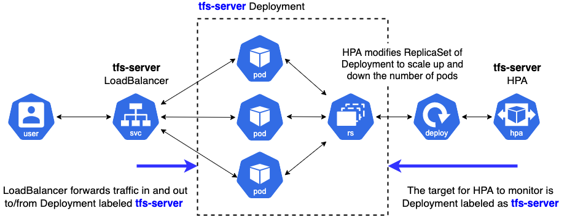

<h1>
	Deploying 🤗 ViT on Kubernetes with TF Serving
</h1>

<div class="blog-metadata">
    <small>Published August 15, 2022.</small>
    <a target="_blank" class="btn no-underline text-sm mb-5 font-sans" href="https://github.com/huggingface/blog/blob/main/deploy-tfserving-kubernetes.md">
        Update on GitHub
    </a>
</div>

<div class="author-card">
    <a href="/chansung">
        
        <div class="bfc">
            <code>chansung</code>
            <span class="fullname">Chansung Park<sup>*</sup></span>
            <span class="bg-gray-100 dark:bg-gray-700 rounded px-1 text-gray-600 text-sm font-mono">guest</span>
        </div>
    </a>
    <a href="/sayakpaul">
        
        <div class="bfc">
            <code>sayakpaul</code>
            <span class="fullname">Sayak Paul<sup>*</sup></span>
            <span class="bg-gray-100 dark:bg-gray-700 rounded px-1 text-gray-600 text-sm font-mono">guest</span>
        </div>
    </a>
    
</div>

# Introduction

In the [<u>previous post</u>](https://huggingface.co/blog/tf-serving-vision), we showed how
to deploy a [<u>Vision Transformer (ViT)</u>](https://huggingface.co/docs/transformers/main/en/model_doc/vit)
model from 🤗 Transformers locally with TensorFlow Serving. We covered
topics like embedding preprocessing and postprocessing operations within
the Vision Transformer model, handling gRPC requests, and more!

While local deployments are an excellent head start to building
something useful, you’d need to perform deployments that can serve many
users in real-life projects. In this post, you’ll learn how to scale the
local deployment from the previous post with Docker and Kubernetes.
Therefore, we assume some familiarity with Docker and Kubernetes.

This post builds on top of the [<u>previous post</u>](https://huggingface.co/blog/tf-serving-vision). So, we highly
recommend reading it if not already done. You can find all the code
discussed throughout this post in [<u>this repository</u>](https://github.com/sayakpaul/deploy-hf-tf-vision-models/tree/main/hf_vision_model_onnx_gke).

# Why go with Docker and Kubernetes?

The basic workflow of scaling up a deployment like ours includes the
following steps:

- **Containerizing the application logic**: The application logic
  involves a served model that can handle requests and return
  predictions. For containerization, Docker is the industry-standard
  go-to.

- **Deploying the Docker container**: You have various options here. The most
  widely used option is deploying the Docker container on a Kubernetes
  cluster. Kubernetes provides numerous deployment-friendly features
  (e.g. autoscaling and security). You can use a solution like
  [<u>Minikube</u>](https://minikube.sigs.k8s.io/docs/start/) to
  manage Kubernetes clusters locally or a serverless solution like
  [<u>Elastic Kubernetes Service (EKS)</u>](https://docs.aws.amazon.com/eks/latest/userguide/what-is-eks.html).

You might be wondering why use an explicit setup like this in the age
of [<u>Sagemaker,</u>](https://aws.amazon.com/sagemaker/) [<u>Vertex AI</u>](https://cloud.google.com/vertex-ai)
that provides ML deployment-specific features right off the bat. It is fair to think
about it.

The above workflow is widely adopted in the industry, and many
organizations benefit from it. It has already been battle-tested for
many years. It also lets you have more granular control of your
deployments while abstracting away the non-trivial bits.

This post uses [<u>Google Kubernetes Engine (GKE)</u>](https://cloud.google.com/kubernetes-engine)
to provision and manage a Kubernetes cluster. We assume you already have a
billing-enabled GCP project if you’re using GKE. Also, note that you’d need to
configure the [`gcloud`](https://cloud.google.com/sdk/gcloud) utility for
performing the deployment on GKE. But the concepts discussed in this post
equally apply should you decide to use Minikube.

**Note**: The code snippets shown in this post can be executed on a Unix terminal
as long as you have configured the `gcloud` utility along with Docker and `kubectl`.
More instructions are available in the [accompanying repository](https://github.com/sayakpaul/deploy-hf-tf-vision-models/tree/main/hf_vision_model_onnx_gke). 

# Containerization with Docker 

The serving model can handle raw
image inputs as bytes and is capable of preprocessing and
postprocessing.

In this section, you’ll see how to containerize that model using the
[<u>base TensorFlow Serving Image</u>](http://hub.docker.com/r/tensorflow/serving/tags/). TensorFlow Serving consumes models
in the [`SavedModel`](https://www.tensorflow.org/guide/saved_model) format. Recall how you
obtained such a `SavedModel` in the [<u>previous post</u>](https://huggingface.co/blog/tf-serving-vision). We assume that
you have the `SavedModel` compressed in `tar.gz` format. You can fetch
it from [<u>here</u>](https://huggingface.co/deploy-hf-tf-vit/vit-base16-extended/resolve/main/saved_model.tar.gz)
just in case. Then `SavedModel` should be placed in the special directory
structure of `<MODEL_NAME>/<VERSION>/<SavedModel>`. This is how TensorFlow Serving simultaneously manages multiple deployments of different versioned models.

## Preparing the Docker image

The shell script below places the `SavedModel` in `hf-vit/1` under the
parent directory models. You'll copy everything inside it when preparing
the Docker image. There is only one model in this example, but this
is a more generalizable approach.

```bash
$ MODEL_TAR=model.tar.gz
$ MODEL_NAME=hf-vit
$ MODEL_VERSION=1
$ MODEL_PATH=models/$MODEL_NAME/$MODEL_VERSION

$ mkdir -p $MODEL_PATH
$ tar -xvf $MODEL_TAR --directory $MODEL_PATH
```

Below, we show how the `models` directory is structured in our case:

```bash
$ find /models
/models
/models/hf-vit
/models/hf-vit/1
/models/hf-vit/1/keras_metadata.pb
/models/hf-vit/1/variables
/models/hf-vit/1/variables/variables.index
/models/hf-vit/1/variables/variables.data-00000-of-00001
/models/hf-vit/1/assets
/models/hf-vit/1/saved_model.pb
```

The custom TensorFlow Serving image should be built on top of the [base one](http://hub.docker.com/r/tensorflow/serving/tags/).
There are various approaches for this, but you’ll do this by running a Docker container as illustrated in the
[<u>official document</u>](https://www.tensorflow.org/tfx/serving/serving_kubernetes#commit_image_for_deployment). We start by running `tensorflow/serving` image in background mode, then the entire `models` directory is copied to the running container
as below.

```bash
$ docker run -d --name serving_base tensorflow/serving
$ docker cp models/ serving_base:/models/
```

We used the official Docker image of TensorFlow Serving as the base, but
you can use ones that you have [<u>built from source</u>](https://github.com/tensorflow/serving/blob/master/tensorflow_serving/g3doc/setup.md#building-from-source)
as well.

**Note**: TensorFlow Serving benefits from hardware optimizations that leverage instruction sets such as
[<u>AVX512</u>](https://en.wikipedia.org/wiki/AVX-512). These
instruction sets can [<u>speed up deep learning model inference</u>](https://huggingface.co/blog/bert-cpu-scaling-part-1). So,
if you know the hardware on which the model will be deployed, it’s often
beneficial to obtain an optimized build of the TensorFlow Serving image
and use it throughout.

Now that the running container has all the required files in the
appropriate directory structure, we need to create a new Docker image
that includes these changes. This can be done with the [`docker commit`](https://docs.docker.com/engine/reference/commandline/commit/) command below, and you'll have a new Docker image named `$NEW_IMAGE`.
One important thing to note is that you need to set the `MODEL_NAME`
environment variable to the model name, which is `hf-vit` in this
case. This tells TensorFlow Serving what model to deploy.

```bash
$ NEW_IMAGE=tfserving:$MODEL_NAME

$ docker commit \ 
    --change "ENV MODEL_NAME $MODEL_NAME" \ 
    serving_base $NEW_IMAGE
```

## Running the Docker image locally

Lastly, you can run the newly built Docker image locally to see if it
works fine. Below you see the output of `docker run` command. Since
the output is verbose, we trimmed it down to focus on the important
bits. Also, it is worth noting that it opens up `8500` and `8501`
ports for gRPC and HTTP/REST endpoints, respectively.

```shell
$ docker run -p 8500:8500 -p 8501:8501 -t $NEW_IMAGE &


---------OUTPUT---------
(Re-)adding model: hf-vit
Successfully reserved resources to load servable {name: hf-vit version: 1}
Approving load for servable version {name: hf-vit version: 1}
Loading servable version {name: hf-vit version: 1}
Reading SavedModel from: /models/hf-vit/1
Reading SavedModel debug info (if present) from: /models/hf-vit/1
Successfully loaded servable version {name: hf-vit version: 1}
Running gRPC ModelServer at 0.0.0.0:8500 ...
Exporting HTTP/REST API at:localhost:8501 ...
```

## Pushing the Docker image

The final step here is to push the Docker image to an image repository.
You'll use [<u>Google Container Registry (GCR)</u>](https://cloud.google.com/container-registry) for this
purpose. The following lines of code can do this for you:

```bash
$ GCP_PROJECT_ID=<GCP_PROJECT_ID>
$ GCP_IMAGE=gcr.io/$GCP_PROJECT_ID/$NEW_IMAGE

$ gcloud auth configure-docker
$ docker tag $NEW_IMAGE $GCP_IMAGE
$ docker push $GCP_IMAGE
```

Since we’re using GCR, you need the prefix of
`gcr.io/<GCP_PROJECT_ID>` in the Docker image tag ([<u>note</u>](https://cloud.google.com/container-registry/docs/pushing-and-pulling) the other formats too). With the Docker image prepared and pushed to GCR, you can now proceed to deploy it on a
Kubernetes cluster.

# Deploying on a Kubernetes cluster

Deployment on a Kubernetes cluster requires the following:

- Provisioning a Kubernetes cluster, done with [<u>Google Kubernetes Engine</u>](https://cloud.google.com/kubernetes-engine) (GKE) in
  this post. However, you’re welcome to use other platforms and tools
  like EKS or Minikube.

- Connecting to the Kubernetes cluster to perform a deployment.

- Writing YAML manifests.

- Performing deployment with the manifests with a utility
  [`kubectl`](https://kubernetes.io/docs/reference/kubectl/).

Let’s go over each of these steps. 

## Provisioning a Kubernetes cluster on GKE

You can use a shell script like so for this (available
[<u>here</u>](https://github.com/sayakpaul/deploy-hf-tf-vision-models/blob/main/hf_vision_model_tfserving_gke/provision_gke_cluster.sh)):

```bash
$ GKE_CLUSTER_NAME=tfs-cluster
$ GKE_CLUSTER_ZONE=us-central1-a
$ NUM_NODES=2
$ MACHINE_TYPE=n1-standard-8

$ gcloud container clusters create $GKE_CLUSTER_NAME \
    --zone=$GKE_CLUSTER_ZONE \
    --machine-type=$MACHINE_TYPE \
    --num-nodes=$NUM_NODES
```

GCP offers a variety of machine types to configure the deployment in a
way you want. We encourage you to refer to the
[<u>documentation</u>](https://cloud.google.com/sdk/gcloud/reference/container/clusters/create)
to know more about it.

Once the cluster is provisioned, you need to connect to it to perform
the deployment. Since GKE is used here, you also need to authenticate
yourself. You can use a shell script like so to do both of these:

```bash
$ GCP_PROJECT_ID=<GCP_PROJECT_ID>

$ export USE_GKE_GCLOUD_AUTH_PLUGIN=True

$ gcloud container clusters get-credentials $GKE_CLUSTER_NAME \
    --zone $GKE_CLUSTER_ZONE \
    --project $GCP_PROJECT_ID
```

The `gcloud container clusters get-credentials` command takes care of
both connecting to the cluster and authentication. Once this is done,
you’re ready to write the manifests.

## Writing Kubernetes manifests

Kubernetes manifests are written in [<u>YAML</u>](https://yaml.org/)
files. While it’s possible to use a single manifest file to perform the
deployment, creating separate manifest files is often beneficial for
delegating the separation of concerns. It’s common to use three manifest
files for achieving this:

- `deployment.yaml` defines the desired state of the Deployment by
  providing the name of the Docker image, additional arguments when
  running the Docker image, the ports to open for external accesses,
  and the limits of resources.

- `service.yaml` defines connections between external clients and
  inside Pods in the Kubernetes cluster.

- `hpa.yaml` defines rules to scale up and down the number of Pods
  consisting of the Deployment, such as the percentage of CPU
  utilization.

You can find the relevant manifests for this post
[<u>here</u>](https://github.com/sayakpaul/deploy-hf-tf-vision-models/tree/main/hf_vision_model_tfserving_gke/.kube/base).
Below, we present a pictorial overview of how these manifests are
consumed.



Next, we go through the important parts of each of these manifests.

**`deployment.yaml`**:

```yaml
apiVersion: apps/v1
kind: Deployment
metadata:
  labels:
    app: tfs-server
  name: tfs-server
...
spec:
  containers:
  - image: gcr.io/$GCP_PROJECT_ID/tfserving-hf-vit:latest
    name: tfs-k8s
    imagePullPolicy: Always
    args: ["--tensorflow_inter_op_parallelism=2", 
           "--tensorflow_intra_op_parallelism=8"] 
    ports:
    - containerPort: 8500
      name: grpc
    - containerPort: 8501
      name: restapi
    resources:
      limits:
        cpu: 800m
      requests:
        cpu: 800m
...

```

You can configure the names like `tfs-server`, `tfs-k8s` any way you
want. Under `containers`, you specify the Docker image URI the
deployment will use. The current resource utilization gets monitored by
setting the allowed bounds of the `resources` for the container. It
can let HPA (discussed later) decide to scale up or down the number of
containers. `requests.cpu` is the minimal amount of CPU resources to
make the container work correctly set by operators. Here 800m means 80%
of the whole CPU resource. So, HPA monitors the average CPU utilization
out of the sum of `requests.cpu` across all Pods to make scaling
decisions.

Besides Kubernetes specific configuration, you can specify TensorFlow
Serving specific options in `args`.In this case, you have two:

- `tensorflow_inter_op_parallelism`, which sets the number of threads
  to run in parallel to execute independent operations. The
  recommended value for this is 2.

- `tensorflow_intra_op_parallelism`, which sets the number of threads
  to run in parallel to execute individual operations. The recommended
  value is the number of physical cores the deployment CPU has.

You can learn more about these options (and others) and tips on tuning
them for deployment from
[<u>here</u>](https://www.tensorflow.org/tfx/serving/performance) and
[<u>here</u>](https://github.com/IntelAI/models/blob/master/docs/general/tensorflow_serving/GeneralBestPractices.md).

**`service.yaml`**:

```yaml
apiVersion: v1
kind: Service
metadata:
  labels:
    app: tfs-server
  name: tfs-server
spec:
  ports:
  - port: 8500
    protocol: TCP
    targetPort: 8500
    name: tf-serving-grpc
  - port: 8501
    protocol: TCP
    targetPort: 8501
    name: tf-serving-restapi
  selector:
    app: tfs-server
  type: LoadBalancer
```

We made the service type ‘LoadBalancer’ so the endpoints are
exposed externally to the Kubernetes cluster. It selects the
‘tfs-server’ Deployment to make connections with external clients via
the specified ports. We open two ports of ‘8500’ and ‘8501’ for gRPC and
HTTP/REST connections respectively.

**`hpa.yaml`**:

```yaml
apiVersion: autoscaling/v1
kind: HorizontalPodAutoscaler
metadata:
 name: tfs-server

spec:
 scaleTargetRef:
   apiVersion: apps/v1
   kind: Deployment
   name: tfs-server
 minReplicas: 1
 maxReplicas: 3
 targetCPUUtilizationPercentage: 80
```

HPA stands for **H**orizontal **P**od **A**utoscaler. It sets criteria
to decide when to scale the number of Pods in the target Deployment. You
can learn more about the autoscaling algorithm internally used by
Kubernetes [<u>here</u>](https://kubernetes.io/docs/tasks/run-application/horizontal-pod-autoscale).

Here you specify how Kubernetes should handle autoscaling. In
particular, you define the replica bound within which it should perform
autoscaling – `minReplicas\` and `maxReplicas` and the target CPU
utilization. `targetCPUUtilizationPercentage` is an important metric
for autoscaling. The following thread aptly summarizes what it means
(taken from [<u>here</u>](https://stackoverflow.com/a/42530520/7636462)):

> The CPU utilization is the average CPU usage of all Pods in a
deployment across the last minute divided by the requested CPU of this
deployment. If the mean of the Pods' CPU utilization is higher than the
target you defined, your replicas will be adjusted.

Recall specifying `resources` in the deployment manifest. By
specifying the `resources`, the Kubernetes control plane starts
monitoring the metrics, so the `targetCPUUtilization` works.
Otherwise, HPA doesn't know the current status of the Deployment.

You can experiment and set these to the required numbers based on your
requirements. Note, however, that autoscaling will be contingent on the
quota you have available on GCP since GKE internally uses [<u>Google Compute Engine</u>](https://cloud.google.com/compute)
to manage these resources.

## Performing the deployment

Once the manifests are ready, you can apply them to the currently
connected Kubernetes cluster with the 
[`kubectl apply`](https://kubernetes.io/docs/reference/generated/kubectl/kubectl-commands#apply)
command.

```bash
$ kubectl apply -f deployment.yaml
$ kubectl apply -f service.yaml
$ kubectl apply -f hpa.yaml
```

While using `kubectl` is fine for applying each of the manifests to
perform the deployment, it can quickly become harder if you have many
different manifests. This is where a utility like
[<u>Kustomize</u>](https://kustomize.io/) can be helpful. You simply
define another specification named `kustomization.yaml` like so:

```yaml
commonLabels:
  app: tfs-server
resources:
- deployment.yaml
- hpa.yaml
- service.yaml
apiVersion: kustomize.config.k8s.io/v1beta1
kind: Kustomization
```

Then it’s just a one-liner to perform the actual deployment:

```bash
$ kustomize build . | kubectl apply -f -
```

Complete instructions are available
[<u>here</u>](https://github.com/sayakpaul/deploy-hf-tf-vision-models/tree/main/hf_vision_model_tfserving_gke).
Once the deployment has been performed, we can retrieve the endpoint IP
like so:

```bash
$ kubectl rollout status deployment/tfs-server
$ kubectl get svc tfs-server --watch

---------OUTPUT---------
NAME        TYPE          CLUSTER-IP   EXTERNAL-IP  PORT(S)                        AGE
tfs-server  LoadBalancer  xxxxxxxxxx   xxxxxxxxxx   8500:30869/TCP,8501:31469/TCP  xxx

```

Note down the external IP when it becomes available.

And that sums up all the steps you need to deploy your model on
Kubernetes! Kubernetes elegantly provides abstractions for complex bits
like autoscaling, cluster management, etc. while letting you focus on
the crucial aspects you should care about while deploying a model. These
include resource utilization, security (we didn’t cover that here),
performance north stars like latency, etc.

# Testing the endpoint

Given that you got an external IP for the endpoint, you can use the
following listing to test it:

```py
import tensorflow as tf 
import json
import base64

image_path = tf.keras.utils.get_file(
    "image.jpg", "http://images.cocodataset.org/val2017/000000039769.jpg"
)
bytes_inputs = tf.io.read_file(image_path)
b64str = base64.urlsafe_b64encode(bytes_inputs.numpy()).decode("utf-8")
data = json.dumps(
    {"signature_name": "serving_default", "instances": [b64str]}
)

json_response = requests.post(
    "http://<ENDPOINT-IP>:8501/v1/models/hf-vit:predict", 
    headers={"content-type": "application/json"}, 
    data=data
)
print(json.loads(json_response.text))

---------OUTPUT---------
{'predictions': [{'label': 'Egyptian cat', 'confidence': 0.896659195}]}

```

If you’re interested to know how this deployment would perform if it
meets more traffic then we recommend you to check [<u>this article</u>](https://blog.tensorflow.org/2022/07/load-testing-TensorFlow-Servings-REST-interface.html).
Refer to the corresponding [<u>repository</u>](https://github.com/sayakpaul/deploy-hf-tf-vision-models/tree/main/locust)
to know more about running load tests with Locust and visualize the results.

# Notes on different TF Serving configurations

TensorFlow Serving
[<u>provides</u>](https://www.tensorflow.org/tfx/serving/serving_config)
various options to tailor the deployment based on your application use
case. Below, we briefly discuss some of them.

**`enable_batching`** enables the batch inference capability that
collects incoming requests with a certain amount of timing window,
collates them as a batch, performs a batch inference, and returns the
results of each request to the appropriate clients. TensorFlow Serving
provides a rich set of configurable options (such as `max_batch_size`,
`num_batch_threads`) to tailor your deployment needs. You can learn
more about them
[<u>here</u>](https://github.com/tensorflow/serving/blob/master/tensorflow_serving/batching/README.md). Batching is
particularly beneficial for applications where you don't need predictions from a model
instantly. In those cases, you'd typically gather together multiple samples for prediction in batches and
then send those batches for prediction. Lucky for us, TensorFlow Serving can configure all of these
automatically when we enable its batching capabilities.

**`enable_model_warmup`** warms up some of the TensorFlow components
that are lazily instantiated with dummy input data. This way, you can
ensure everything is appropriately loaded up and that there will be no
lags during the actual service time.

# Conclusion

In this post and the associated [repository](https://github.com/sayakpaul/deploy-hf-tf-vision-models), 
you learned about deploying the Vision Transformer model
from 🤗 Transformers on a Kubernetes cluster. If you’re doing this for
the first time, the steps may appear to be a little daunting, but once
you get the grasp, they’ll soon become an essential component of your
toolbox. If you were already familiar with this workflow, we hope this post was still beneficial
for you. 

We applied the same deployment workflow for an ONNX-optimized version of the same
Vision Transformer model. For more details, check out [this link](https://github.com/sayakpaul/deploy-hf-tf-vision-models/tree/main/hf_vision_model_onnx_gke). ONNX-optimized models are especially beneficial if you're using x86 CPUs for deployment.

In the next post, we’ll show you how to perform these deployments with
significantly less code with [<u>Vertex AI</u>](https://cloud.google.com/vertex-ai) – more like
`model.deploy(autoscaling_config=...)` and boom! We hope you’re just as
excited as we are.

# Acknowledgement

Thanks to the ML Developer Relations Program team at Google, which
provided us with GCP credits for conducting the experiments.
