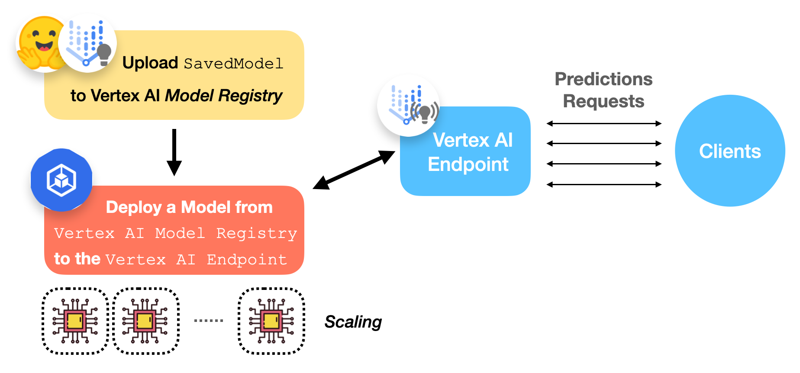
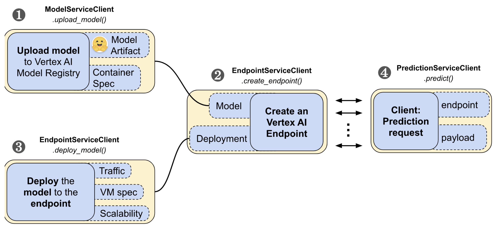
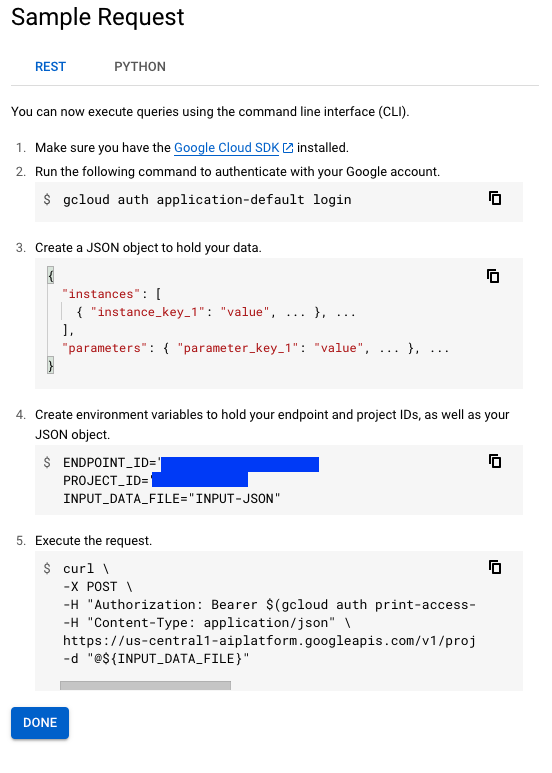
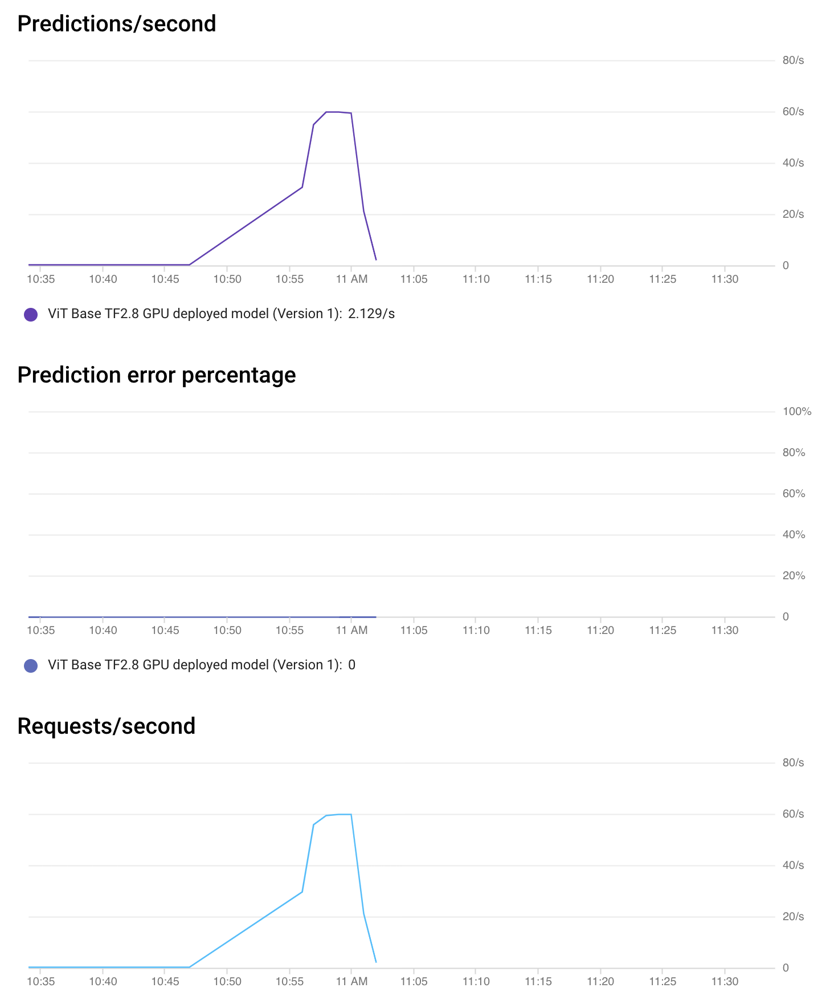
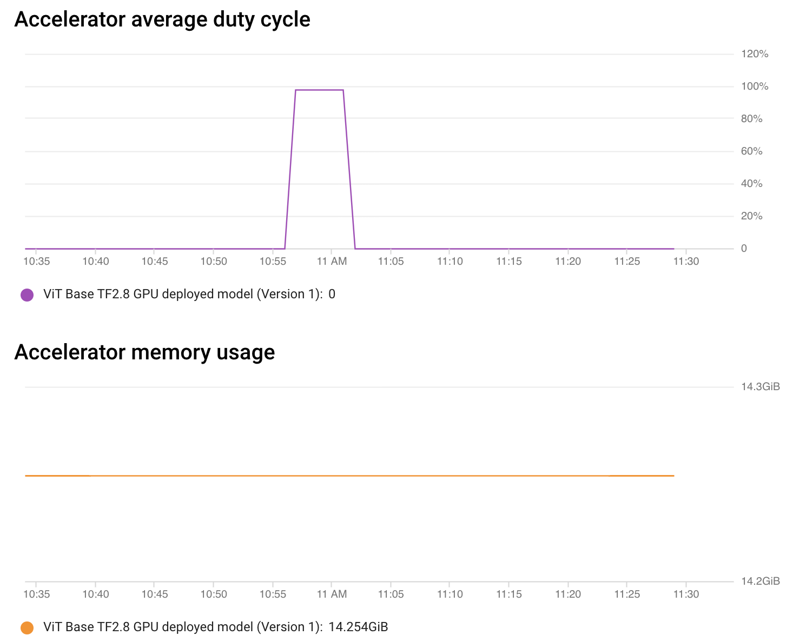
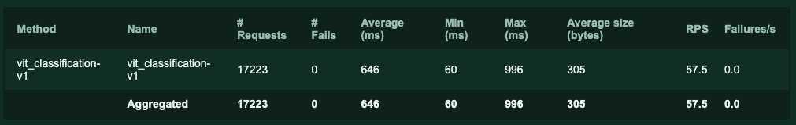

<h1>
	Deploying 🤗 ViT on Vertex AI
</h1>

<div class="blog-metadata">
    <small>Published August 20, 2022.</small>
    <a target="_blank" class="btn no-underline text-sm mb-5 font-sans" href="https://github.com/huggingface/blog/blob/main/deploy-vertex-ai.md">
        Update on GitHub
    </a>
</div>

<div class="author-card">
    <a href="/sayakpaul">
        
        <div class="bfc">
            <code>sayakpaul</code>
            <span class="fullname">Sayak Paul<sup>*</sup></span>
            <span class="bg-gray-100 dark:bg-gray-700 rounded px-1 text-gray-600 text-sm font-mono">guest</span>
        </div>
    </a>
    <a href="/chansung">
        
        <div class="bfc">
            <code>chansung</code>
            <span class="fullname">Chansung Park<sup>*</sup></span>
            <span class="bg-gray-100 dark:bg-gray-700 rounded px-1 text-gray-600 text-sm font-mono">guest</span>
        </div>
    </a>
</div>

<a target="_blank" href="https://colab.research.google.com/github/huggingface/blog/blob/main/notebooks/112_vertex_ai_vision.ipynb">
    
</a>

In the previous posts, we showed how to deploy a [<u>Vision Transformers
(ViT) model</u>](https://huggingface.co/docs/transformers/main/en/model_doc/vit)
from 🤗Transformers locally and on a Kubernetes cluster. This post will
show you how to deploy the same model on the [<u>Vertex AI platform</u>](https://cloud.google.com/vertex-ai).
You’ll achieve the same scalability level as Kubernetes-based deployment but with
significantly less code. Here are the post links in order:

- [<u>Deploying TensorFlow Vision Models in Hugging Face with TF Serving</u>](https://huggingface.co/blog/tf-serving-vision)

- [<u>Deploying 🤗 ViT on Kubernetes with TF Serving</u>](https://huggingface.co/blog/deploy-tfserving-kubernetes)

- Deploying 🤗 ViT Models on Vertex AI (this post)

This post builds on top of the previous two posts linked above. You’re
advised to check them out if you haven’t already.

You can find a completely worked-out example in the Colab Notebook
linked at the beginning of the post.

# What is Vertex AI?

This is what [<u>Google Cloud</u>](https://www.youtube.com/watch?v=766OilR6xWc) states:

> Vertex AI provides tools to support your entire ML workflow, across
different model types and varying levels of ML expertise.

Concerning model deployment, Vertex AI provides a few important features
with a unified API design:

- Authentication

- Autoscaling based on traffic

- Model versioning

- Traffic splitting between different versions of a model

- Rate limiting

- Model monitoring and logging

- Support for online and batch predictions

For TensorFlow models, it offers various off-the-shelf utilities, which
you’ll get to in this post. But it also has similar support for other
frameworks like
[<u>PyTorch</u>](https://cloud.google.com/blog/topics/developers-practitioners/pytorch-google-cloud-how-deploy-pytorch-models-vertex-ai)
and [<u>scikit-learn</u>](https://codelabs.developers.google.com/vertex-cpr-sklearn).

To use Vertex AI, you’ll need a [<u>billing-enabled Google Cloud
Platform (GCP) project</u>](https://cloud.google.com/billing/docs/how-to/modify-project)
and the following services enabled:

- Vertex AI

- Cloud Storage

# Revisiting the Serving Model

You’ll use the same [<u>ViT B/16 model implemented in TensorFlow</u>](https://huggingface.co/docs/transformers/main/en/model_doc/vit#transformers.TFViTForImageClassification) as you did in the last two posts. You serialized the model with
corresponding pre-processing and post-processing operations embedded to
reduce [<u>training-serving skew</u>](https://developers.google.com/machine-learning/guides/rules-of-ml#:~:text=Training%2Dserving%20skew%20is%20a,train%20and%20when%20you%20serve.).
Please refer to the [<u>first post</u>](https://huggingface.co/blog/tf-serving-vision) that discusses
this in detail. This is what the signature of the final serialized `SavedModel` looks like:

```bash
The given SavedModel SignatureDef contains the following input(s):
  inputs['string_input'] tensor_info:
      dtype: DT_STRING
      shape: (-1)
      name: serving_default_string_input:0
The given SavedModel SignatureDef contains the following output(s):
  outputs['confidence'] tensor_info:
      dtype: DT_FLOAT
      shape: (-1)
      name: StatefulPartitionedCall:0
  outputs['label'] tensor_info:
      dtype: DT_STRING
      shape: (-1)
      name: StatefulPartitionedCall:1
Method name is: tensorflow/serving/predict
```

The model will accept [<u>base64 encoded</u>](https://www.base64encode.org/) strings of images, perform
pre-processing, run inference, and finally perform the post-processing
steps. The strings are base64 encoded to prevent them from any
modifications during network transmission. Pre-processing includes
resizing the input image to 224x224 resolution, standardizing it to the
`[-1, 1]` range, and transposing it to the `channels_first` memory
layout. Postprocessing includes mapping the predicted logits to string
labels.

To perform a deployment on Vertex AI, you need to keep the model
artifacts in a [<u>Google Cloud Storage (GCS) bucket</u>](https://cloud.google.com/storage/docs/json_api/v1/buckets).
The accompanying Colab Notebook shows how to create a GCS bucket and
save the model artifacts into it.

# Workflow of a Deployment with Vertex AI 

The figure below gives a pictorial workflow of deploying an already
trained TensorFlow model on Vertex AI.



Let’s now discuss what Vertex AI Model Registry and Endpoint are.

## Vertex AI Model Registry

Vertex AI model Registry is a fully managed machine learning model
registry. There are a couple of things to note about what fully managed
means here. First, you don’t need to worry about how and where models
are stored. Second, it manages different versions of the same model.

These features are important for machine learning in production.
Building a model registry that guarantees high availability and security
is nontrivial. Also, there is often a situation where you want to roll
back the current model to one of the past versions since we can not
control the inside of a black box machine learning model. Vertex AI
Model Registry allows us to achieve these without much difficulty.

The currently supported model types include `SavedModel` from
TensorFlow, scikit-learn, and XGBoost.

## Vertex AI Endpoint

From the user’s perspective, Vertex AI Endpoint simply provides an
endpoint to receive requests and send responses back. However, it has a
lot of things under the hood for machine learning operators to
configure. Here are some of the configurations that you can choose:

- Version of a model

- Specification of VM in terms of CPU, memory, and accelerators

- Min/Max number of compute nodes

- Traffic split percentage

- Model monitoring window length and its objectives

- Prediction requests sampling rate

# Performing the Deployment

The [`google-cloud-aiplatform`](https://pypi.org/project/google-cloud-aiplatform/)
Python SDK provides easy APIs to manage the lifecycle of a deployment on
Vertex AI. It is divided into four steps - **1)** uploading a model,
**2)** creating an endpoint, **3)** deploying the model to the endpoint,
and **4)** making prediction requests. Throughout these steps, you will
need `ModelServiceClient`, `EndpointServiceClient`, and
`PredictionServiceClient` modules from the `google-cloud-aiplatform`
Python SDK to interact with Vertex AI.



**1)** The first step in the workflow is to upload the `SavedModel` to
Vertex AI’s model registry:

```py
tf28_gpu_model_dict = {
    "display_name": "ViT Base TF2.8 GPU model",
    "artifact_uri": f"{GCS_BUCKET}/{LOCAL_MODEL_DIR}",
    "container_spec": {
        "image_uri": "us-docker.pkg.dev/vertex-ai/prediction/tf2-gpu.2-8:latest",
    },
}
tf28_gpu_model = (
    model_service_client.upload_model(parent=PARENT, model=tf28_gpu_model_dict)
    .result(timeout=180)
    .model
)
```

Let’s unpack the code piece by piece:

- `GCS_BUCKET` denotes the path of your GCS bucket where the model
  artifacts are located (e.g., `gs://hf-tf-vision`).

- In `container_spec`, you provide the URI of a Docker image that will
  be used to serve predictions. Vertex AI
  provides [pre-built images]((https://cloud.google.com/vertex-ai/docs/predictions/pre-built-containers)) to serve TensorFlow models. But you can also use your custom Docker images when using a different framework 
  ([<u>an example</u>](https://cloud.google.com/blog/topics/developers-practitioners/pytorch-google-cloud-how-deploy-pytorch-models-vertex-ai)).

- `model_service_client` is a
  [`ModelServiceClient`](https://cloud.google.com/python/docs/reference/aiplatform/latest/google.cloud.aiplatform_v1.services.model_service.ModelServiceClient)
  object that exposes the methods to upload a model to the Vertex AI
  Model Registry.

- `PARENT` is set to `f"projects/{PROJECT_ID}/locations/{REGION}"`
  that lets Vertex AI determine where the model is going to be scoped
  inside GCP.

**2)** Then you need to create a Vertex AI Endpoint:

```py
tf28_gpu_endpoint_dict = {
    "display_name": "ViT Base TF2.8 GPU endpoint",
}
tf28_gpu_endpoint = (
    endpoint_service_client.create_endpoint(
        parent=PARENT, endpoint=tf28_gpu_endpoint_dict
    )
    .result(timeout=300)
    .name
)
```

Here you’re using an `endpoint_service_client` which is an
[`EndpointServiceClient`](https://cloud.google.com/vertex-ai/docs/samples/aiplatform-create-endpoint-sample)
object. It lets you create and configure your Vertex AI Endpoint.

**3)** Now you’re down to performing the actual deployment!

```py
tf28_gpu_deployed_model_dict = {
    "model": tf28_gpu_model,
    "display_name": "ViT Base TF2.8 GPU deployed model",
    "dedicated_resources": {
        "min_replica_count": 1,
        "max_replica_count": 1,
        "machine_spec": {
            "machine_type": DEPLOY_COMPUTE, # "n1-standard-8"
            "accelerator_type": DEPLOY_GPU, # aip.AcceleratorType.NVIDIA_TESLA_T4
            "accelerator_count": 1,
        },
    },
}

tf28_gpu_deployed_model = endpoint_service_client.deploy_model(
    endpoint=tf28_gpu_endpoint,
    deployed_model=tf28_gpu_deployed_model_dict,
    traffic_split={"0": 100},
).result()
```

Here, you’re chaining together the model you uploaded to the Vertex AI
Model Registry and the Endpoint you created in the above steps. You’re
first defining the configurations of the deployment under
`tf28_gpu_deployed_model_dict`.

Under `dedicated_resources` you’re configuring:

- `min_replica_count` and `max_replica_count` that handle the
  autoscaling aspects of your deployment.

- `machine_spec` lets you define the configurations of the deployment
  hardware:

  - `machine_type` is the base machine type that will be used to run
    the Docker image. The underlying autoscaler will scale this
    machine as per the traffic load. You can choose one from the 
    [supported machine types](https://cloud.google.com/vertex-ai/docs/predictions/configure-compute#machine-types).

  - `accelerator_type` is the hardware accelerator that will be used
    to perform inference.

  - `accelerator_count` denotes the number of hardware accelerators to
    attach to each replica.

**Note** that providing an accelerator is not a requirement to deploy
models on Vertex AI.

Next, you deploy the endpoint using the above specifications:

```py
tf28_gpu_deployed_model = endpoint_service_client.deploy_model(
    endpoint=tf28_gpu_endpoint,
    deployed_model=tf28_gpu_deployed_model_dict,
    traffic_split={"0": 100},
).result()
```

Notice how you’re defining the traffic split for the model. If you had
multiple versions of the model, you could have defined a dictionary
where the keys would denote the model version and values would denote
the percentage of traffic the model is supposed to serve.

With a Model Registry and a dedicated
[<u>interface</u>](https://console.cloud.google.com/vertex-ai/endpoints)
to manage Endpoints, Vertex AI lets you easily control the important
aspects of the deployment.

It takes about 15 - 30 minutes for Vertex AI to scope the deployment.
Once it’s done, you should be able to see it on the
[<u>console</u>](https://console.cloud.google.com/vertex-ai/endpoints).

# Performing Predictions

Assuming you succeeded in the above step, you can test the deployed
Endpoint by making a prediction request.

First, prepare a base64 encoded image string:

```py
import base64
import tensorflow as tf

image_path = tf.keras.utils.get_file(
    "image.jpg", "http://images.cocodataset.org/val2017/000000039769.jpg"
)
bytes = tf.io.read_file(image_path)
b64str = base64.b64encode(bytes.numpy()).decode("utf-8")
```

**4)** The following utility first prepares a list of instances (only
one instance in this case) and then uses a prediction service client (of
type [`PredictionServiceClient`](https://cloud.google.com/python/docs/reference/automl/latest/google.cloud.automl_v1beta1.services.prediction_service.PredictionServiceClient)).
`serving_input` is the name of the input signature key of the served
model. In this case, the `serving_input` is `string_input`, which
you can verify from the `SavedModel` signature output shown above.

```
from google.protobuf import json_format
from google.protobuf.struct_pb2 import Value

def predict_image(image, endpoint, serving_input):
    # The format of each instance should conform to
    # the deployed model's prediction input schema.
    instances_list = [{serving_input: {"b64": image}}]
    instances = [json_format.ParseDict(s, Value()) for s in instances_list]

    print(
        prediction_service_client.predict(
            endpoint=endpoint,
            instances=instances,
        )
    )

predict_image(b64str, tf28_gpu_endpoint, serving_input)
```

For TensorFlow models deployed on Vertex AI, the request payload needs
to be formatted in a certain way. For models like ViT that deal with
binary data like images, they need to be base64 encoded. According to
the [<u>official guide</u>](https://cloud.google.com/vertex-ai/docs/predictions/online-predictions-custom-models#encoding-binary-data),
the request payload for each instance needs to be like so:

```py
{serving_input: {"b64": base64.b64encode(jpeg_data).decode()}}
```

The `predict_image()` utility prepares the request payload conforming
to this specification.

If everything goes well with the deployment, if you call
`predict_image()`, you should get an output like so:

```bash
predictions {
  struct_value {
    fields {
      key: "confidence"
      value {
        number_value: 0.896659553
      }
    }
    fields {
      key: "label"
      value {
        string_value: "Egyptian cat"
      }
    }
  }
}
deployed_model_id: "5163311002082607104"
model: "projects/29880397572/locations/us-central1/models/7235960789184544768"
model_display_name: "ViT Base TF2.8 GPU model"
```

Note, however, this is not the only way to obtain predictions using a
Vertex AI Endpoint. If you head over to the Endpoint console and select
your endpoint, it will show you two different ways to obtain
predictions:



It’s also possible to avoid cURL requests and obtain predictions
programmatically without using the Vertex AI SDK. Refer to
[<u>this notebook</u>](https://github.com/sayakpaul/deploy-hf-tf-vision-models/blob/main/hf_vision_model_vertex_ai/test-vertex-ai-endpoint.ipynb)
to learn more.

Now that you’ve learned how to use Vertex AI to deploy a TensorFlow
model, let’s now discuss some beneficial features provided by Vertex AI.
These help you get deeper insights into your deployment.

# Monitoring with Vertex AI

Vertex AI also lets you monitor your model without any configuration.
From the Endpoint console, you can get details about the performance of
the Endpoint and the utilization of the allocated resources.





As seen in the above chart, for a brief amount of time, the accelerator
duty cycle (utilization) was about 100% which is a sight for sore eyes.
For the rest of the time, there weren’t any requests to process hence
things were idle.

This type of monitoring helps you quickly flag the currently deployed
Endpoint and make adjustments as necessary. It’s also possible to
request monitoring of model explanations. Refer
[<u>here</u>](https://cloud.google.com/vertex-ai/docs/explainable-ai/overview)
to learn more.

# Local Load Testing

We conducted a local load test to better understand the limits of the
Endpoint with [<u>Locust</u>](https://locust.io/). The table below
summarizes the request statistics:



Among all the different statistics shown in the table \`Average (ms)\`
refers to the average latency of the Endpoint. Locust fired about
**17230 requests**, and their average latency is reported to be **646
Milliseconds** which is impressive. In practice, you’d want to simulate
more real traffic by conducting the load test in a distributed manner.
Refer [<u>here</u>](https://cloud.google.com/architecture/load-testing-and-monitoring-aiplatform-models)
to learn more.

[<u>This directory</u>](https://github.com/sayakpaul/deploy-hf-tf-vision-models/tree/main/hf_vision_model_vertex_ai/locust)
has all the information needed to know how we conducted the load test.

# Pricing

We used the [<u>GCP cost estimator</u>](https://cloud.google.com/products/calculator) for this
purpose, and the exact pricing table can be found [<u>here</u>](https://cloud.google.com/vertex-ai/pricing#custom-trained_models).
It is worth noting that you are only charged when the node is processing
the actual prediction requests, and you need to calculate the price with
and without GPUs.

For the Vertex Prediction for a custom-trained model, we can choose
[N1 machine types from `n1-standard-2` to `n1-highcpu-32`](https://cloud.google.com/vertex-ai/pricing#custom-trained_models).
You used `n1-standard-8` for this post which is equipped with 8
vCPUs and 32GBs of RAM. The price of a node can be calculated in a more
granular manner. For example, each hour of each CPU core costs about
$0.03635495, and each hour of each GB or RAM costs about $0.0048783.

<div align="center">

| **Machine Type**            | **Hourly Pricing (USD)** |
|:-----------------------------:|:--------------------------:|
| n1-standard-8 (8vCPU, 30GB) | $ 0.4372                |

</div>

Also, when you attach accelerators to the compute node, you will get
extra charges by the type of the accelerator you want. We have used
`NVIDIA_TESLA_T4` for this blog post, but almost all modern
accelerators, including TPUs are supported. You can find further
information [<u>here</u>](https://cloud.google.com/vertex-ai/pricing#custom-trained_models).

<div align="center">


| **Accelerator Type** | **Hourly Pricing (USD)** |
|:----------------------:|:--------------------------:|
| NVIDIA_TESLA_T4      | $ 0.4024                |
</div>

# Call for Action

The collection of TensorFlow vision models in 🤗 Transformers is growing. It now has support
state-of-the-art semantic segmentation with 
[SegFormer](https://huggingface.co/docs/transformers/model_doc/segformer#transformers.TFSegformerForSemanticSegmentation).
We encourage you to extend the deployment workflow you learned this post to semantic segmentation models like SegFormer.

# Conclusion

In this post, you learned how to deploy a Vision Transformer model using
the Vertex AI platform using the easy APIs it provides. You also learned
how Vertex AI’s features benefit the model deployment process enabling
you to focus on declarative configurations while taking away complex
parts. Vertex AI also supports deployment of PyTorch models via custom
prediction routes. Refer
[<u>here</u>](https://cloud.google.com/blog/topics/developers-practitioners/pytorch-google-cloud-how-deploy-pytorch-models-vertex-ai)
for more details.

We hope this series on the online deployment of TensorFlow vision models
was beneficial for you to take your ML toolbox to the next level. We
can’t wait to see what you build with these tools.

# Acknowledgements

Thanks to the ML Developer Relations Program team at Google, which
provided us with GCP credits for conducting the experiments.

Parts of the deployment code were referred from 
[<u>this notebook</u>](https://github.com/GoogleCloudPlatform/vertex-ai-samples/tree/main/notebooks/community/vertex_endpoints/optimized_tensorflow_runtime) of the official [<u>GitHub repository</u>](https://github.com/GoogleCloudPlatform/vertex-ai-samples)
of Vertex AI code samples.
