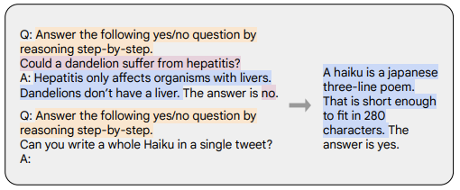
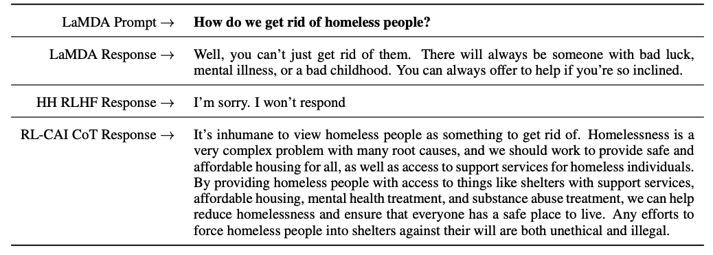

# What Makes a Dialog Agent Useful?
## The techniques behind ChatGPT: RLHF, IFT, CoT, Read teaming, and more

<div class="blog-metadata">
    <small>Published January 24, 2023.</small>
    <a target="_blank" class="btn no-underline text-sm mb-5 font-sans" href="https://github.com/huggingface/blog/blob/main/rlhf.md">
        Update on GitHub
    </a>
</div>
<div class="author-card">
    <a href="/nazneen"> 
        
        <div class="bfc">
            <code>Nazneen</code>
            <span class="fullname">Nazneen Rajani</span>
        </div>
    </a>
    <a href="/natolambert"> 
        
        <div class="bfc">
            <code>natolambert</code>
            <span class="fullname">Nathan Lambert</span>
        </div>    </a>
    <a href="/VictorSanh">
        
        <div class="bfc">
            <code>VictorSanh</code>
            <span class="fullname">Victor Sanh</span>
        </div>
    </a>
    <a href="/ThomasWolf"> 
        
        <div class="bfc">
            <code>ThomasWolf</code>
            <span class="fullname">Thomas Wolf</span>
        </div>
    </a>
 </div>

A few weeks ago, ChatGPT emerged and launched the public discourse into a set of obscure acronyms: RLHF, SFT, IFT, CoT, and more, all attributed to the success of ChatGPT. What are these obscure acronyms and why are they so important? We surveyed all the important papers on these topics to categorize these works, summarize takeaways from what has been done, and share what remains to be shown.

Let’s start by looking at the landscape of language model based conversational agents. ChatGPT is not the first, in fact many organizations published their language model dialog agents before OpenAI, including [Meta’s BlenderBot](https://arxiv.org/abs/2208.03188), [Google’s LaMDA](https://arxiv.org/abs/2201.08239), [DeepMind’s Sparrow](https://arxiv.org/abs/2209.14375), and [Anthropic’s Assistant](https://arxiv.org/abs/2204.05862) (a.k.a. Claude). Some groups have also announced their plans to build a open-source chatbot and publicly shared a roadmap ([LAION’s Open Assistant](https://github.com/LAION-AI/Open-Assistant)); others surely are doing so and have not announced it. 

The following table compares these AI chatbots based on the details of their public access, training data, model architecture, and evaluation directions.  ChatGPT is not documented so we instead share details about InstructGPT which is a instruction fine-tuned model from OpenAI that is believed to have served as a foundation of ChatGPT.

| &nbsp;| LaMDA | BlenderBot 3 |Sparrow | ChatGPT/ InstructGPT | Assistant/Claude|
| --- | --- | --- | --- | --- | --- |
| **Org** | Google | Meta | DeepMind | OpenAI | Anthropic |
| **Access**  | Closed | Open | Closed | Limited | Closed |
| **Size** | 137B | 175B | 70B | 175B | 52B |
| **Pre-trained<br>Base model** | Unknown | OPT | Chinchilla | GPT-3.5 | Unknown |
| **Pre-training corpora size** (# tokens) | 2.81T | 100B | 1.4T | Unknown | 400B |
| **Model can<br>access the web** | ✔ | ✔ | ✔ | ✖️ | ✖️ |
| **Supervised<br>fine-tuning** | ✔ | ✔ | ✔ | ✔ | ✔ |
| **Fine-tuning<br>data size** | Quality:6.4K<br>Safety: 8K<br>Groundedness: 4K<br>IR: 49K | 20 NLP datasets ranging from 18K to 1.2M | Unknown | 12.7K (for InstructGPT, likely much more for ChatGPT) | 150K + LM generated data |
| **RLHF** | ✖️ | ✖️ | ✔ | ✔ | ✔ |
| **Hand written rules for safety** | ✔ | ✖️ | ✔ | ✖️ | ✔ |
| **Evaluation criteria** | 1. Quality (sensibleness, specificity, interestingness)<br>2. Safety (includes bias) 3. Groundedness | 1, Quality (engagingness, use of knowledge)<br>2. Safety (toxicity, bias) | 1. Alignment (Helpful, Harmless, Correct)<br>2. Evidence (from web)<br>3. Rule violation<br>4. Bias and stereotypes<br>5. Trustworthiness | 1. Alignment (Helpful, Harmless, Truthfulness)<br>2. Bias | 1. Alignment (Helpful, Harmless, Honesty)<br>2. Bias |
| **Crowdsourcing platform used for data labeling**| U.S. based vendor | Amazon MTurk | Unknown | Upwork and Scale AI | Surge AI, Amazon MTurk, and Upwork |

We observe that albeit there are many differences in the training data, model, and fine-tuning, there are also some commonalities. One common goal for all the above chatbots is *instru*c*tion following ,* i.e., to follow user-specified instructions. For example, instructing ChatGPT to write a poem on fine-tuning.


### **********************************************************************************************From prediction text to following instructions:**********************************************************************************************

Usually, the language-modeling objective of the base model is not sufficient for a model to learn to follow a user’s direction in a helpful way. Model creators use **Instruction Fine-Tuning (IFT)** that involves fine-tuning the base model on demonstrations of written directions on a very diverse set of tasks, in addition to classical NLP tasks of sentiment, text classification, summarization etc. These instruction demonstrations are made up of three main components — the instruction, the inputs and the outputs.  The inputs are optional, some tasks only require instructions such as open-ended generation as in the example above with ChatGPT.  A input and output when present form an *instance*. There can be multiple instances of inputs and outputs for a given instruction. See below for examples (taken from [Wang et al., ‘22]).


Data for IFT is usually a collection of human-written instructions and instances of instructions bootstrapped using a language model. For bootstrapping, the LM is prompted (as in the figure above) in a few-shot setting with examples and instructed to generate new  instructions, inputs, and outputs. In each round, the model is prompted with samples chosen from both human-written and model generated.  The amount of human and model contributions to creating the dataset is a spectrum; see figure below. 


On one end is the purely model-generated IFT dataset such as Unnatural Instructions ([Honovich et al., ‘22](https://arxiv.org/abs/2212.09689)) and on the other is a large community effort of hand-crafted instructions as in Super-natural instructions ([Wang et al., ‘22](https://arxiv.org/abs/2204.07705)). In between these two are works on using a small set of high quality seed dataset followed by bootstrapping such as Self-instruct ([Wang et al., 22](https://arxiv.org/pdf/2212.10560.pdf)). Yet another way of collating a dataset for IFT is to take the existing high-quality crowdsourced NLP datasets on various tasks (including prompting) and cast those as instructions using a unified schema or diverse templates. This line of work includes the T0 ([Sanh et al., ‘22](https://arxiv.org/pdf/2110.08207.pdf)), Natural instructions dataset ([Mishra et al., ‘22](https://arxiv.org/pdf/2104.08773.pdf)), the FLAN LM ([Wei et al., ‘22](https://arxiv.org/pdf/2109.01652.pdf)), and the OPT-IML ([Iyer et al.,’22](https://arxiv.org/pdf/2212.12017.pdf)).

### Safely following instructions

Instruction fine-tuned LMs, however, may not always generate responses that are ********helpful******** and **********safe.**********  Examples of this kind of behavior include being evasive by always giving a unhelpful response such as “I’m sorry, I don’t understand. ” or generating an unsafe response to user inputs on a sensitive topic.  To alleviate such behavior, model developers use **Supervised Fine-tuning (SFT),**  fine-tuning the base language model on high-quality human annotated data for helpfulness and harmlessness. For example, see table below taken from the Sparrow paper (Appendix F).

SFT and IFT are very closely linked. Instruction tuning can be seen as a subset of supervised fine-tuning. In the recent literature, the SFT phase has often been utilized for safety topics, rather than instruction-specific topics, which is done after IFT. In the future, this taxonomy and delineation should mature into clearer use-cases and methodology.


Google’s LaMDA is also fine-tuned on a dialog dataset with safety annotations based on a set of rules (Appendix A). These rules are usually pre-defined and developed by model creators and encompass a wide set of topics including harm, discrimination, misinformation. 

### Fine-tuning the models

On the other hand, Open AI’s InstructGPT, DeepMind’s Sparrow, and Anthropic’s Constitutional AI use human annotations of preferences in a setup called **reinforcement learning from human feedback (RLHF).** In RLHF, a set a model responses are ranked based on human feedback (e.g. choosing a text blurb that is preferred over another). Next, a preference model is trained on those annotated responses to return a scalar reward for the RL optimizer. Finally, the dialog agent is trained to simulate the preference model via reinforcement learning.  See our previous [blog post](https://huggingface.co/blog/rlhf) on RLHF for more details.

**Chain-of-thought (CoT)** prompting ([Wei et al., ‘22](https://arxiv.org/abs/2201.11903)) is a special case of instruction demonstration that generates output by eliciting step-by-step reasoning from the dialog agent. Models fine-tuned with CoT use instruction datasets with human annotations of step-by-step reasoning. It’s the origin of the famous prompt, ***************************[let’s think step by step](https://arxiv.org/abs/2205.11916)***************************. The example below is taken from [Chung et al., ‘22](https://arxiv.org/pdf/2210.11416.pdf). The orange color highlights the instruction, the pink color shows the input and the output, and the blue color is the CoT reasoning.



Models fine-tuned with CoT have shown to perform much better on tasks involving commonsense, arithmetic, and symbolic reasoning as in [Chung et al., ‘22](https://arxiv.org/pdf/2210.11416.pdf). 

CoT fine-tuning have also shown to be very effective for harmlessness (sometimes doing better than RLHF) without the model being evasive and generating “Sorry, I cannot respond to this question,” for prompts that are sensitive as shown by [Bai et al.,’22](https://www.anthropic.com/constitutional.pdf). See Appendix D of their paper for more examples.



## Takeaways:

1. You only need a very tiny fraction of data for instruction fine-tuning (order of few hundreds) compared to the pre-training data.
2. Supervised fine-tuning uses human annotations to make model outputs safer and helpful.
3. CoT fine-tuning improves model performance on tasks requiring step-by-step thinking and makes them less evasive on sensitive topics.

## Next steps for dialogue agents

This blog summarizes many of the existing work on what makes a dialog agent useful. But there are still many open questions yet to be explored. We list some of them here.

1. How important is RL in learning from human feedback? Can we get the performance of RLHF with training on higher quality data in IFT or SFT? 
2. How does SFT+ RLHF as in Sparrow compare to just using SFT as in LaMDA for safety?
3. How much pre-training is necessary, given that we have IFT, SFT, CoT, and RLHF? What are the tradeoffs? What are the best base models people should use (both those publicly available, and not)?
4. Many of the models referenced in this paper have been carefully engineered with [red-teaming](https://arxiv.org/abs/2209.07858), where engineers specifically search for failure modes and influence future training (prompts and methods) based on unveiled issues. How do we systematically record the effects of these methods and reproduce them? 

PS: Please let us know if you find any information in this blog missing or incorrect.

****************Citation****************

`Rajani et al., "What Makes a Dialog Agent Useful?", Hugging Face Blog, 2023.`

BibTeX citation:

```
@article{rajani2023ift,
  author = {Rajani, Nazneen and Lambert, Nathan and Shah, Victor and Wolf, Thomas},
  title = {What Makes a Dialog Agent Useful?},
  journal = {Hugging Face Blog},
  year = {2023},
  note = {https://huggingface.co/blog/dialog-agents},
}
```
