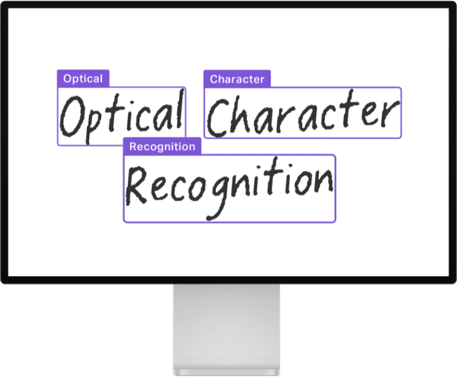

# Accelerating Document AI

    <small>Published November 21, 2022.</small>
    <a target="_blank" class="btn no-underline text-sm mb-5 font-sans" href="https://github.com/huggingface/blog/blob/main/decision-transformers-train.md">
        Update on GitHub
    </a>

    <a href="/rajistics"> 
        
        

            <code>rajistics</code>
            Rajiv Shah
        

    </a>
    <a href="/nielsr"> 
        
        

            <code>nielsr</code>
            Niels Rogge
        

    </a>
        <a href="/florentgbelidji"> 
        
        

            <code>florentgbelidji</code>
            Florent Gbelidji
        

    </a>
        <a href="/nbroad"> 
        
        

            <code>nbroad</code>
            Nicholas Broad
        

    </a>

Enterprises are full of documents containing knowledge that isn't accessible by digital workflows. These documents can vary from letters, invoices, forms, reports, to receipts. With the improvements in text, vision, and multimodal AI, it's now possible to unlock that information. This post shows you how your teams can use open-source models to build custom solutions for free!

Document AI includes many data science tasks from [image classification](https://huggingface.co/tasks/image-classification), [image to text](https://huggingface.co/tasks/image-to-text), [document question answering](https://huggingface.co/tasks/document-question-answering), [table question answering](https://huggingface.co/tasks/table-question-answering), and [visual question answering](https://huggingface.co/tasks/visual-question-answering). This post starts with a taxonomy of use cases within Document AI and the best open-source models for those use cases. Next, the post focuses on licensing, data preparation, and modeling. Throughout this post, there are links to web demos, documentation, and models. 

### Use Cases

There are at least six general use cases for building document AI solutions. These use cases differ in the kind of document inputs and outputs. A combination of approaches is often necessary when solving enterprise Document AI problems.

<html itemscope itemtype="https://schema.org/FAQPage">
  

    <a id="1-what-is-ocr"><strong itemprop="name"> What is Optical Character Recognition (OCR)?</strong></a>
    

      

Turning typed, handwritten, or printed text into machine-encoded text is known as Optical Character Recognition (OCR). It's a widely studied problem with many well-established open-source and commercial offerings. The figure shows an example of converting handwriting into text.

OCR is a backbone of Document AI use cases as it's essential to transform the text into something readable by a computer. Some widely available OCR models that operate at the document level are [EasyOCR](https://huggingface.co/spaces/tomofi/EasyOCR) or [PaddleOCR](https://huggingface.co/spaces/PaddlePaddle/PaddleOCR). There are also models like [TrOCR: Transformer-based Optical Character Recognition with Pre-trained Models](https://huggingface.co/docs/transformers/model_doc/trocr), which runs on single-text line images. This model works with a text detection model like CRAFT which first identifies the individual "pieces" of text in a document in the form of bounding boxes. The relevant metrics for OCR are Character Error Rate (CER) and word-level precision, recall, and F1. Check out [this Space](https://huggingface.co/spaces/tomofi/CRAFT-TrOCR) to see a demonstration of CRAFT and TrOCR.  

    

        

 <html itemscope itemtype="https://schema.org/FAQPage">
  

    <a id="2-what-is-doc_class"><strong itemprop="name"> What is Document Image Classification?</strong></a>
    

      
         
    
Classifying documents into the appropriate category, such as forms, invoices, or letters, is known as document image classification. Classification may use either one or both of the document's image and text. The recent addition of multimodal models that use the visual structure and the underlying text has dramatically increased classifier performance.

A basic approach is applying OCR on a document image, after which a [BERT](https://huggingface.co/docs/transformers/model_doc/bert)-like model is used for classification. However, relying on only a BERT model doesn't take any layout or visual information into account. The figure from the [RVL-CDIP](https://huggingface.co/datasets/rvl_cdip) dataset shows how visual structure differs by different document types.

That's where models like [LayoutLM](https://huggingface.co/docs/transformers/model_doc/layoutlmv3) and [Donut](https://huggingface.co/docs/transformers/model_doc/donut) come into play. By incorporating not only text but also visual information, these models can dramatically increase accuracy. For comparison, on [RVL-CDIP](https://huggingface.co/datasets/rvl_cdip), an important benchmark for document image classification, a BERT-base model achieves 89% accuracy by using the text. A [DiT](https://huggingface.co/docs/transformers/main/en/model_doc/dit) (Document Image Transformer) is a pure vision model (i.e., it does not take text as input) and can reach 92% accuracy. But models like [LayoutLMv3](https://huggingface.co/docs/transformers/main/en/model_doc/layoutlmv3) and [Donut](https://huggingface.co/docs/transformers/model_doc/donut), which use the text and visual information together using a multimodal Transformer, can achieve 95% accuracy! These multimodal models are changing how practitioners solve Document AI use cases.

    

        

<html itemscope itemtype="https://schema.org/FAQPage">
  

    <a id="2-what-is-doc-layout"><strong itemprop="name"> What is Document layout analysis?</strong></a>
    

      
         

Document layout analysis is the task of determining the physical structure of a document, i.e., identifying the individual building blocks that make up a document, like text segments, headers, and tables. This task is often solved by framing it as an image segmentation/object detection problem. The model outputs a set of segmentation masks/bounding boxes, along with class names.

Models that are currently state-of-the-art for document layout analysis are [LayoutLMv3](https://huggingface.co/docs/transformers/model_doc/layoutlmv3) and [DiT](https://huggingface.co/docs/transformers/model_doc/dit) (Document Image Transformer). Both models use the classic [Mask R-CNN](https://arxiv.org/abs/1703.06870) framework for object detection as a backbone. This [document layout analysis](https://huggingface.co/spaces/nielsr/dit-document-layout-analysis) Space illustrates how DiT can be used to identify text segments, titles, and tables in documents. An example using [DiT](https://github.com/microsoft/unilm/tree/master/dit) detecting different parts of a document is shown here.

    

        

Document layout analysis with DiT.

Document layout analysis typically uses the mAP (mean average-precision) metric, often used for evaluating object detection models. An important benchmark for layout analysis is the [PubLayNet](https://github.com/ibm-aur-nlp/PubLayNet) dataset. [LayoutLMv3](https://huggingface.co/docs/transformers/main/en/model_doc/layoutlmv3), the state-of-the-art at the time of writing, achieves an overall mAP score of 0.951 ([source](https://paperswithcode.com/sota/document-layout-analysis-on-publaynet-val)).

<html itemscope itemtype="https://schema.org/FAQPage">
  

    <a id="4-what-is-doc-parsing"><strong itemprop="name"> What is Document parsing?</strong></a>
    

      

A step beyond layout analysis is document parsing. Document parsing is identifying and extracting key information from a document, such as names, items, and totals from an invoice form. This [LayoutLMv2 Space](https://huggingface.co/spaces/nielsr/LayoutLMv2-FUNSD) shows to parse a document to recognize questions, answers, and headers.

The first version of LayoutLM (now known as LayoutLMv1) was released in 2020 and dramatically improved over existing benchmarks, and it's still one of the most popular models on the Hugging Face Hub for Document AI. [LayoutLMv2](https://huggingface.co/docs/transformers/main/en/model_doc/layoutlmv2) and [LayoutLMv3](https://huggingface.co/docs/transformers/main/en/model_doc/layoutlmv3) incorporate visual features during pre-training, which provides an improvement. The LayoutLM family produced a step change in Document AI performance. For example, on the [FUNSD](https://guillaumejaume.github.io/FUNSD/) benchmark dataset, a BERT model has an F1 score of 60%, but with LayoutLM, it is possible to get to 90%! 

LayoutLMv1 now has many successors. [Donut](https://huggingface.co/docs/transformers/model_doc/donut) builds on LayoutLM but can take the image as input, so it doesn't require a separate OCR engine. [ERNIE-Layout](https://arxiv.org/abs/2210.06155) was recently released with promosing results, see the [Space](https://huggingface.co/spaces/PaddlePaddle/ERNIE-Layout). For multilingual use cases, there are multilingual variants of LayoutLM, like [LayoutXLM](https://huggingface.co/docs/transformers/model_doc/layoutxlm) and [LiLT](https://huggingface.co/docs/transformers/main/en/model_doc/lilt). This figure from the LayoutLM paper shows LayoutLM analyzing some different documents.

Data scientists are finding document layout analysis and extraction as key use cases for enterprises. The existing commercial solutions typically cannot handle the diversity of most enterprise data, in content and structure. Consequently, data science teams can often surpass commercial tools by fine-tuning their own models.

    

        

<html itemscope itemtype="https://schema.org/FAQPage">
  

    <a id="5-what-is-table"><strong itemprop="name"> What is Table detection, extraction, and table structure recognition?</strong></a>
    

      

Documents often contain tables, and most OCR tools don't work incredibly well out-of-the-box on tabular data. Table detection is the task of identifying where tables are located, and table extraction creates a structured representation of that information. Table structure recognition is the task of identifying the individual pieces that make up a table, like rows, columns, and cells. Table functional analysis (FA) is the task of recognizing the keys and values of the table. The figure from the [Table transformer](https://github.com/microsoft/table-transformer) illustrates the difference between the various subtasks.

The approach for table detection and structure recognition is similar to document layout analysis in using object detection models that output a set of bounding boxes and corresponding classes.

The latest approaches, like [Table Transformer](https://huggingface.co/docs/transformers/main/en/model_doc/table-transformer), can enable table detection and table structure recognition with the same model. The Table Transformer is a [DETR](https://huggingface.co/docs/transformers/model_doc/detr)-like object detection model, trained on [PubTables-1M](https://arxiv.org/abs/2110.00061) (a dataset comprising one million tables). Evaluation for table detection and structure recognition typically uses the average precision (AP) metric. The Table Transformer performance is reported as having an AP of 0.966 for table detection and an AP of 0.912 for table structure recognition + functional analysis on PubTables-1M.

Table detection and extraction is an exciting approach, but the results may be different on your data. In our experience, the quality and formatting of tables vary widely and can affect how well the models perform. Additional fine-tuning on some custom data will greatly improve the performance.

    

        

<html itemscope itemtype="https://schema.org/FAQPage">
  

    <a id="6-what-is-docvqa"><strong itemprop="name"> What is Document question answering (DocVQA)?</strong></a>
    

      

          
Question answering on documents has dramatically changed how people interact with AI. Recent advancements have made it possible to ask models to answer questions about an image - this is known as document visual question answering, or DocVQA for short. After being given a question, the model analyzes the image and responds with an answer. An example from the [DocVQA dataset](https://rrc.cvc.uab.es/?ch=17) is shown in the figure below. The user asks, "Mention the ZIP code written?" and the model responds with the answer.

In the past, building a DocVQA system would often require multiple models working together. There could be separate models for analyzing the document layout, performing OCR, extracting entities, and then answering a question. The latest DocVQA models enable question-answering in an end-to-end manner, comprising only a single (multimodal) model.

DocVQA is typically evaluated using the Average Normalized Levenshtein Similarity (ANLS) metric. For more details regarding this metric, we refer to [this guide](https://rrc.cvc.uab.es/?ch=11&com=tasks). The current state-of-the-art on the DocVQA benchmark that is open-source is [LayoutLMv3](https://huggingface.co/docs/transformers/model_doc/layoutlmv3) which achieves an ANLS score of 83.37. However, this model consists of a pipeline of OCR + multimodal Transformer. [Donut](https://huggingface.co/docs/transformers/model_doc/donut) solves the task in an end-to-end manner using a single encoder-decoder Transformer, not relying on OCR. Donut doesn't provide state-of-the-art accuracy but shows the great potential of the end-to-end approach using a generative T5-like model. Impira hosts an [exciting Space](https://huggingface.co/spaces/impira/docquery) that illustrates LayoutLM and Donut for DocVQA.

Visual question answering is compelling; however, there are many considerations for successfully using it. Having accurate training data, evaluation metrics, and post-processing is vital. For teams taking on this use case, be aware that DocVQA can be challenging to work properly. In some cases, responses can be unpredictable, and the model can “hallucinate” by giving an answer that doesn't appear within the document. Visual question answering models that rely on pretrained data can also raise ethical issues of bias. Ensuring proper model setup and post-processing is integral to building a successful DocVQA solution.

    

        

<html itemscope itemtype="https://schema.org/FAQPage">
  

    <a id="7-what-is-licensing"><h3 itemprop="name"> What are Licensing Issues in Document AI?</h3></a>
    

      
          

Industry and academia make enormous contributions to advancing Document AI. There are a wide assortment of models and datasets available for data scientists to use. However, licensing can be a non-starter for building an enterprise solution. Some well-known models have restrictive licenses that forbid the model from being used for commercial purposes. Most notably, Microsoft's [LayoutLMv2](https://huggingface.co/docs/transformers/main/en/model_doc/layoutlmv2) and [LayoutLMv3](https://huggingface.co/docs/transformers/main/en/model_doc/layoutlmv3) checkpoints cannot be used commercially. When you start a project, we advise carefully evaluating the license of prospective models. Knowing which models you want to use is essential at the outset, since that may affect data collection and annotation. A table of the popular models with their licensing license information is at the end of this post. 

    

        

<html itemscope itemtype="https://schema.org/FAQPage">
  

    <a id="8-what-are-dataprep"><h3 itemprop="name"> What are Data Prep Issues in Document AI?</h3></a>
    

      
       

Data preparation for Document AI is critical and challenging. It's crucial to have properly annotated data. Here are some lessons we have learned along with the way around data preparation.

First, machine learning depends on the scale and quality of your data. If the image quality of your documents is poor, you can't expect AI to be able to read these documents magically. Similarly, if your training data is small with many classes, your performance may be poor. Document AI is like other problems in machine learning where larger data will generally provide greater performance.

Second, be flexible in your approaches. You may need to test several different methodologies to find the best solution. A great example is OCR, in which you can use an open-source product like Tesseract, a commercial solution like Cloud Vision API, or the OCR capability inside an open-source multimodal model like [Donut](https://huggingface.co/docs/transformers/model_doc/donut).

Third, start small with annotating data and pick your tools wisely. In our experience, you can get good results with several hundred documents. So start small and carefully evaluate your performance. Once you have narrowed your overall approach, you can begin to scale up the data to maximize your predictive accuracy. When annotating, remember that some tasks like layout identification and document extraction require identifying a specific region within a document. You will want to ensure your annotation tool supports bounding boxes.

    

        

<html itemscope itemtype="https://schema.org/FAQPage">
  

    <a id="9-what-is-modeling"><h3 itemprop="name"> What are Modeling Issues in Document AI?</h3></a>
    

      
   

The flexibility of building your models leads to many options for data scientists. Our strong recommendation for teams is to start with the pre-trained open-source models. These models can be fine-tuned to your specific documents, and this is generally the quickest way to a good model.

For teams considering building their own pre-trained model, be aware this can involve millions of documents and can easily take several weeks to train a model. Building a pre-trained model requires significant effort and is not recommended for most data science teams. Instead, start with fine-tuning one, but ask yourself these questions first.

Do you want the model to handle the OCR? For example, [Donut](https://huggingface.co/docs/transformers/model_doc/donut) doesn't require the document to be OCRed and directly works on full-resolution images, so there is no need for OCR before modeling. However, depending on your problem setup, it may be simpler to get OCR separately.

Should you use higher-resolution images? When using images with [LayoutLMv2](https://huggingface.co/docs/transformers/main/en/model_doc/layoutlmv2), it downscales them to 224 by 224, whereas [Donut](https://huggingface.co/docs/transformers/model_doc/donut) uses the full high-resolution image. However, using the full high-resolution image dramatically increases the memory required for training and inference.

How are you evaluating the model? Watch out for misaligned bounding boxes. You should ensure bounding boxes provided by the OCR engine of your choice align with the model processor. Verifying this can save you from unexpectedly poor results. Second, let your project requirements guide your evaluation metrics. For example, in some tasks like token classification or question answering, a 100% match may not be the best metric. A metric like partial match could allow for many more potential tokens to be considered, such as “Acme” and “inside Acme” as a match. Finally, consider ethical issues during your evaluation as these models may be working with biased data or provide unstable outcomes that could biased against certain groups of people.

    

        

### Next Steps

Are you seeing the possibilities of Document AI? Every day we work with enterprises to unlock valuable data using state-of-the-art vision and language models. We included links to various demos throughout this post, so use them as a starting point. The last section of the post contains resources for starting to code up your own models, such as visual question answering. Once you are ready to start building your solutions, the [Hugging Face public hub](https://huggingface.co/models) is a great starting point. It hosts a vast array of Document AI models.

If you want to accelerate your Document AI efforts, Hugging Face can help. Through our [Enterprise Acceleration Program](https://huggingface.co/support) we partner with enterprises to provide guidance on AI use cases. For Document AI, this could involve helping build a pre-train model, improving accuracy on a fine-tuning task, or providing overall guidance on tackling your first Document AI use case.

We can also provide bundles of compute credits to use our training (AutoTrain) or inference (Spaces or Inference Endpoints) products at scale.

### Resources

Tutorial notebooks for many Document AI models are in [Niels' Github](https://github.com/NielsRogge/Transformers-Tutorials) repository: [https://github.com/NielsRogge/Transformers-Tutorials](https://github.com/NielsRogge/Transformers-Tutorials).

<html itemscope itemtype="https://schema.org/FAQPage">
  

    <a id="10-what-are-models"><h3 itemprop="name"> What are Popular Open-Source Models for Document AI?</h3></a>
    

      
   

A table of the currently available Transformers models achieving state-of-the-art performance on Document AI tasks. This was last updated in November 2022.

| model | paper | license | checkpoints |
| --- | --- | --- | --- |
| [Donut](https://huggingface.co/docs/transformers/main/en/model_doc/donut#overview) | [arxiv](https://arxiv.org/abs/2111.15664) | [MIT](https://github.com/clovaai/donut#license) | [huggingface](https://huggingface.co/models?other=donut) |
| [LayoutLM](https://huggingface.co/docs/transformers/model_doc/layoutlm) | [arxiv](https://arxiv.org/abs/1912.13318) | [MIT](https://github.com/microsoft/unilm/blob/master/LICENSE) | [huggingface](https://huggingface.co/models?other=layoutlm) |
| [LayoutXLM](https://huggingface.co/docs/transformers/model_doc/layoutxlm) | [arxiv](https://arxiv.org/abs/2104.08836) | [CC BY-NC-SA 4.0](https://github.com/microsoft/unilm/tree/master/layoutxlm) | [huggingface](https://huggingface.co/microsoft/layoutxlm-base) |
| [LayoutLMv2](https://huggingface.co/docs/transformers/main/en/model_doc/layoutlmv2) | [arxiv](https://arxiv.org/abs/2012.14740) | [CC BY-NC-SA 4.0](https://github.com/microsoft/unilm/tree/master/layoutlmv2) | [huggingface](https://huggingface.co/models?other=layoutlmv2) |
| [LayoutLMv3](https://huggingface.co/docs/transformers/main/en/model_doc/layoutlmv3) | [arxiv](https://arxiv.org/abs/2204.08387) | [CC BY-NC-SA 4.0](https://github.com/microsoft/unilm/tree/master/layoutlmv3) | [huggingface](https://huggingface.co/models?other=layoutlmv3) |
| [DiT](https://huggingface.co/docs/transformers/model_doc/dit) | [arxiv](https://arxiv.org/abs/2203.02378) | [CC BY-NC-SA 4.0](https://github.com/microsoft/unilm/tree/master/dit) | [huggingface](https://huggingface.co/models?other=dit) |
| [TrOCR](https://huggingface.co/docs/transformers/main/en/model_doc/trocr) | [arxiv](https://arxiv.org/abs/2109.10282) | [MIT](https://github.com/microsoft/unilm/blob/master/LICENSE) | [huggingface](https://huggingface.co/models?search=trocr) |
| [Table Transformer](https://huggingface.co/docs/transformers/main/en/model_doc/table-transformer) | [arxiv](https://arxiv.org/abs/2110.00061) | [MIT](https://github.com/microsoft/table-transformer/blob/main/LICENSE) | [huggingface](https://huggingface.co/models?other=table-transformer) |
| [LiLT](https://huggingface.co/docs/transformers/main/en/model_doc/lilt) | [arxiv](https://arxiv.org/abs/2202.13669) | [MIT](https://github.com/jpWang/LiLT/blob/main/LICENSE) | [huggingface](https://huggingface.co/models?other=lilt) |

    

        

<html itemscope itemtype="https://schema.org/FAQPage">
  

    <a id="11-what-are-metrics"><h3 itemprop="name"> What are Metrics and Datasets for Document AI?</h3></a>
    

      
             

A table of the common metrics and datasets for command Document AI tasks. This was last updated in November 2022.

| task | typical metrics | benchmark datasets |
| --- | --- | --- |
| Optical Character Recognition | Character Error Rate (CER) |  |
| Document Image Classification | Accuracy, F1 | [RVL-CDIP](https://huggingface.co/datasets/rvl_cdip) |
| Document layout analysis | mAP (mean average precision) | [PubLayNet](https://github.com/ibm-aur-nlp/PubLayNet), [XFUND](https://github.com/doc-analysis/XFUND)(Forms) |
| Document parsing | Accuracy, F1 | [FUNSD](https://guillaumejaume.github.io/FUNSD/), [SROIE](https://huggingface.co/datasets/darentang/sroie/), [CORD](https://github.com/clovaai/cord) |
| Table Detection and Extraction | mAP (mean average precision) | [PubTables-1M](https://arxiv.org/abs/2110.00061) |
| Document visual question answering | Average Normalized Levenshtein Similarity (ANLS) | [DocVQA](https://rrc.cvc.uab.es/?ch=17) |

    

        

 </html>