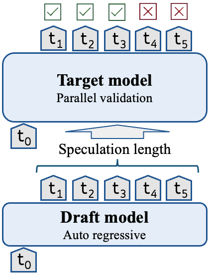
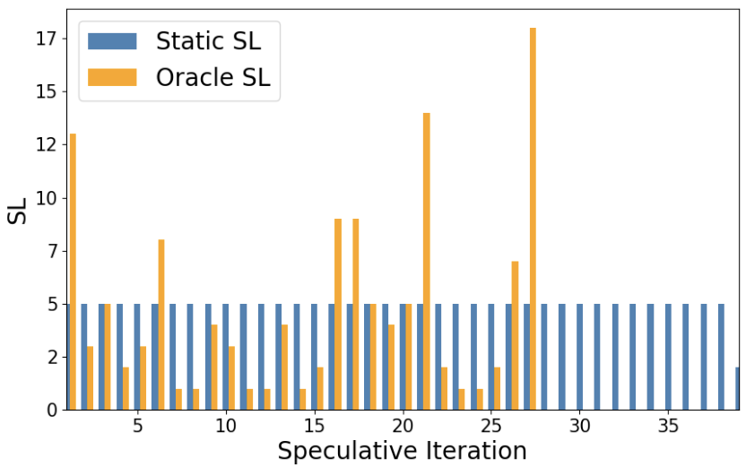
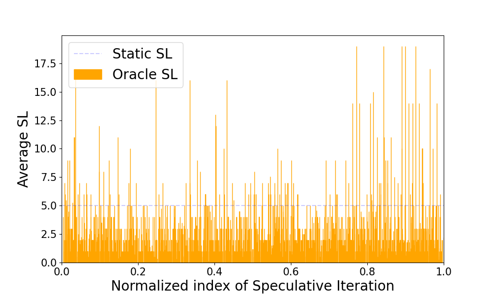

Speculative decoding is a technique often employed to decrease the inference latency of large language models while preserving their accuracy. It expedites the generation by dividing it into
two stages (see figure below). In the first stage, a fast but less accurate *draft* (AKA assistant) model autoregressively generates a sequence of tokens. In the second stage, a large but more accurate *target* model conducts parallelized verification over the generated draft tokens. This process allows the model to produce multiple tokens in a single target forward pass. Its success largely hinges on the speculation lookahead (SL)—the count of tokens produced by the draft model in each iteration.

<p align="center">
  
</p>
<p align="center" style="clear: both;">
  <em>Oracle and static speculation lookahead (SL) values on one MBPP example (left) and average oracle speculation lookahead for the entire Alpaca dataset (right).</em>
</p>

[Hugging Face Transformers](https://github.com/huggingface/transformers) offer two distinct methods to determine the schedule for adjusting the number of assistant tokens during inference. The straightforward method uses a static value of the speculation lookahead and involves generating a constant number of candidate tokens at each speculative iteration (`num_assistant_tokens_schedule="constant"`). Alternatively, a heuristic-based approach adjusts the number of candidate tokens for the next iteration based on the acceptance rate of the current iteration. If all speculative tokens are correct, the number of candidate tokens increases; otherwise, it decreases (`num_assistant_tokens_schedule="heuristic"`). 

We anticipate that an enhanced optimization strategy for managing the number of generated draft tokens could squeeze out further latency reductions. For testing this thesis we utilize an oracle that determines the optimal speculation lookahead value for each speculative iteration. The oracle employs the draft model to autoregressively generate tokens until a discrepancy arises between the predicted tokens of the draft and target models. 

The left figure below illustrates the oracle and static speculation lookahead values across the speculative iterations of a code generation example from the [MBPP](https://huggingface.co/datasets/google-research-datasets/mbpp) dataset. A high variance in oracle speculation lookahead values (orange bars) is observed. 
The static speculation lookahead (blue bars), where the number of generated draft tokens is fixed to 5, performs 38 target forward passes and 192 draft forward passes, whereas the oracle speculation lookahead, performs only 27 target forward passes and 129 draft forward passes - a significant reduction. The right figure shows the oracle and static speculation lookahead across the entire [Alpaca](https://huggingface.co/datasets/tatsu-lab/alpaca) dataset.


<p align="center">
  
  
</p>
<p align="center" style="clear: both;">
  <em>Oracle and static speculation lookahead (SL) values on one MBPP example (left) and average oracle speculation lookahead for the entire Alpaca dataset (right).</em>
</p>


Both figures demonstrate significant variability in oracle speculation lookahead values, suggesting that a static speculation lookahead may be suboptimal.


In order to get closer to the Oracle and gain extra speedup, Intel labs together with our friends in Hugging face developed a straightforward method to dynamically adjust the speculation lookahead value at each iteration. After generating each draft token, we determine whether the draft model should continue generating the next token or switch to the target model for verification. This decision is based on the assistant model's confidence in its prediction estimated by the softmax of the logits. If the assistant model's confidence in the current token prediction falls below a predefined threshold referred to as the `assistant_confidence_threshold`, it halts the token generation process for that iteration, even if the maximum number of speculative tokens `num_assistant_tokens` has not been reached. Once halted, the draft tokens generated during the current iteration are sent to the target model for verification.

# Benchmarking

We benchmarked the dynamic approach against the heuristic approach across a range of tasks and model pairings. The dynamic approach showed better performance in 7 out of 8 tests. 
Notably, using the dynamic approach, with Llama3.2 1B as assistant for Llama3.1 8B, delivers speedups of up to 1.52x. Whereas, the heuristic approach shows no significant speedups. Another observation is that `codegen-6B-mono` yields slowdown using the heuristic approach whereas the dynamic approach shows speedup


| Target model | Assistant model | Task | Speedup - heuristic | Speedup - dynamic | 
|----------------------|---------------------|---------------------------|---------------------------|---------------------------|
| `openai/whisper-large-v2` | `openai/whisper-tiny` |	automatic speech recognition |**1.61x** |	1.51x |
| `facebook/opt-6.7b` | `facebook/opt-125m` |	summarization | 1.82x |	**2.71x** |
| `facebook/opt-6.7b` | `facebook/opt-125m` |	open-ended generation |	1.23x |	**1.59x** |
| `Salesforce/codegen-6B-mono` | `Salesforce/codegen-350M-mono` |	code generation (python) | 0.89x |	**1.09x** |
| `google/flan-t5-xl` | `google/flan-t5-small` | summarization |	1.18x |	**1.31x** |
| `meta-llama/Llama-3.1-8B` | `meta-llama/Llama-3.2-1B` |	summarization |	1.00x |	**1.52x** |
| `meta-llama/Llama-3.1-8B` | `meta-llama/Llama-3.2-1B` |	open-ended generation |	1.00x |	**1.18x** |
| `meta-llama/Llama-3.1-8B` | `meta-llama/Llama-3.2-1B` |	code generation (python) |	1.09x |	**1.15x** |

*The results in the table reflect greedy decoding (temperature = 0). Similar trends were observed when using sampling (temperature > 0).

*All tests were conducted on an RTX 4090.

# Code

Dynamic speculation has been integrated into release [4.45.0](https://github.com/huggingface/transformers/releases/tag/v4.45.0) of Hugging Face Transformers library and now serves as the default operation mode for assisted decoding. To use assisted generation with dynamic speculation, no code changes are required—just execute the code as you normally would:

```python
from transformers import AutoModelForCausalLM, AutoTokenizer
import torch

prompt = "Alice and Bob"
checkpoint = "EleutherAI/pythia-1.4b-deduped"
assistant_checkpoint = "EleutherAI/pythia-160m-deduped"
device = "cuda" if torch.cuda.is_available() else "cpu"

tokenizer = AutoTokenizer.from_pretrained(checkpoint)
inputs = tokenizer(prompt, return_tensors="pt").to(device)

model = AutoModelForCausalLM.from_pretrained(checkpoint).to(device)
assistant_model = AutoModelForCausalLM.from_pretrained(assistant_checkpoint).to(device)

outputs = model.generate(**inputs, assistant_model=assistant_model)
```

The default dynamic speculation lookahead parameters reflect optimal values but can be adjusted to improve performance for specific model pairs or datasets by using the following code:

```python
assistant_model.generation_config.num_assistant_tokens_schedule='constant' 
# 'constant' means that num_assistant_tokens stays unchanged during generation

assistant_model.generation_config.assistant_confidence_threshold=0.4 # confidence threshold

assistant_model.generation_config.num_assistant_tokens=20
# the number of _speculative tokens_ that will be generated by the assistant model before being checked by the target model at each iteration is at most 20
```

To revert to the **heuristic** or **constant** (as in [Leviathan et al.](https://arxiv.org/pdf/2211.17192)) approaches, simply set `num_assistant_tokens_schedule` to 'heuristic' or 'constant', respectively, set `assistant_confidence_threshold=0` and `num_assistant_tokens=5` as follows:
```python
assistant_model.generation_config.num_assistant_tokens_schedule='heuristic' # set 'heuristic' or 'constant' 
assistant_model.generation_config.assistant_confidence_threshold=0
assistant_model.generation_config.num_assistant_tokens=5
```

# What’s next?

In this post we introduced a faster default strategy for assisted generation.

In our upcoming post, we'll introduce a game changing method for assisted generation: combine any assistant model with any target model! This will open the door for accelerating countless models on HF Hub that do not have small enough assistant variants, e.g `Phi-3`, `gemma-2`, `CodeLlama` and many many more. Stay tuned!

# References
- [Dynamic Speculation Lookahead Accelerates Speculative Decoding of Large Language Models](https://arxiv.org/abs/2405.04304)
- [Assisted Generation: a new direction toward low-latency text generation](https://huggingface.co/blog/assisted-generation)
- [Fast Inference from Transformers via Speculative Decoding](https://arxiv.org/pdf/2211.17192)

