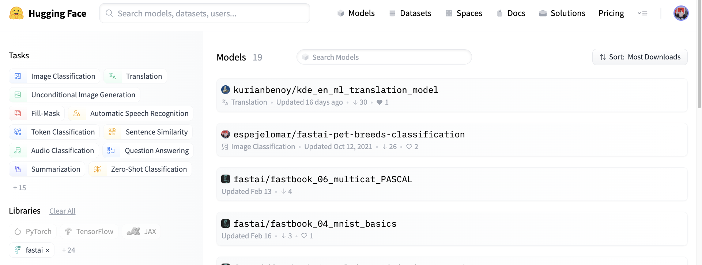
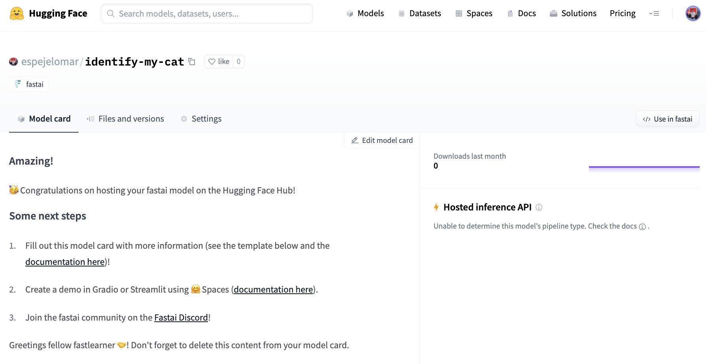

<h1><>
    Welcome fastai to the Hugging Face Hub
</h1>

<div class="blog-metadata">
    <small>Published May 6, 2022.</small>
    <a target="_blank" class="btn no-underline text-sm mb-5 font-sans" href="https://github.com/huggingface/blog/blob/main/fastai.md">
        Update on GitHub
    </a>
</div>

<div class="author-card">
    <a href="/espejelomar"> 
        
        <div class="bfc">
            <code>espejelomar</code>
            <span class="fullname">Omar Espejel</span>
        </div>
    </a>
</div>

## Making neural nets uncool again... and sharing them

Few have done as much as the [fastai](https://www.fast.ai/) ecosystem to make Deep Learning accessible. Our mission at Hugging Face is to democratize good Machine Learning. Let's make exclusivity in access to Machine Learning, including [pre-trained models](https://huggingface.co/models), a thing of the past and let's push this amazing field even further.

fastai is an [open-source Deep Learning library](https://github.com/fastai/fastai) that leverages PyTorch and Python to provide high-level components. It quickly delivers state-of-the-art output on text, vision, and tabular data. However, fastai is more than just a library; it is maintained by [fast.ai](https://www.fast.ai/), the company, and has grown into an entire ecosystem of notable contributors. As some examples, check out fast.ai's [book](https://github.com/fastai/fastbook) and [courses](https://course.fast.ai/). Join the fast.ai [Discord](https://discord.com/invite/YKrxeNn) and [forums](https://forums.fast.ai/). It is a guarantee that you will learn by engaging with their community.

Because of all this, and more (the writer of this post started his journey thanks to the fast.ai course), we are proud to announce that fastai practitioners can now share and upload models to Hugging Face Hub with a single line of Python.

 👉 In this post, we will quickly introduce the integration between fastai and Hub. Check out [this Google Colab notebook](https://colab.research.google.com/gist/omarespejel/9ba054ce74c7a4d4408085b611124bdf) for a hands-on introduction.

*We want to thank the fast.ai community, notably Jeremy Howard, for their feedback 🤗. This blog is heavily inspired by the [Hugging Face Hub section](https://docs.fast.ai/huggingface.html) in the fastai docs.


## Why share to the Hub?

The Hub is a central platform where anyone can share and explore models, datasets, and ML demos. It aims to build the most extensive collection of Open Source models, datasets, and demos.

Sharing on the Hub could amplify the impact of a fastai model by making it available for others to download and explore. Also, fastai models take great advantage of transfer learning; load someone else's model as the basis for your task.

Anyone can access all the fastai models in the Hub by filtering the [huggingface.co/models](https://huggingface.co/models?library=fastai&sort=downloads) webpage by the fastai library, as in the image below.

To know more about the Hub, refer to [this introduction](https://github.com/huggingface/education-toolkit/blob/main/01_huggingface-hub-tour.md).




## Installation

Install `huggingface_hub`. Additionally, the integration functions require the following packages:

- toml,
- fastai>=2.4,
- fastcore>=1.3.27

You can install these packages manually or specify ["fastai"] when installing `huggingface_hub`, and your environment will be ready:

```bash
pip install huggingface_hub["fastai"]
```

Note: As of May 5, 2022, there has not been a release that includes the fastai+hub features so that you can install from main:

```bash
pip install git+https://github.com/huggingface/huggingface_hub#egg=huggingface-hub["fastai"]
```
To share models in the Hub, you will need to have a user. Create it on the [Hugging Face website](https://huggingface.co/).

## Sharing a `Learner` to the Hub

*A [`Learner` is a fastai object](https://docs.fast.ai/learner.html#Learner) that bundles a model, data loaders, and a loss function. We will use the words `Learner` and Model interchangeably throughout this post.

There are three options to login to the Hugging Face Hub; your token will be available in your Account Settings:
1. Type `huggingface-cli login` in your terminal and enter your token.

2. If in a python notebook, you can use `notebook_login`.

```py
from huggingface_hub import notebook_login
notebook_login()
```

3. Use the `token` argument of the `push_to_hub_fastai` function.

Input `push_to_hub_fastai` (refer to the [Hub Client documentation](https://huggingface.co/docs/huggingface_hub/main/en/package_reference/mixins#huggingface_hub.push_to_hub_fastai)) with the `Learner` you want to upload and the repository id for the Hub in the format of "namespace/repo_name". The namespace can be an individual account or an organization you have write access to (for example, 'fastai/stanza-de'). For more details, refer to the [Hub Client documentation](https://huggingface.co/docs/huggingface_hub/main/en/package_reference/mixins#huggingface_hub.push_to_hub_fastai).

```py
from huggingface_hub import push_to_hub_fastai
push_to_hub_fastai(learner=learn, repo_id="espejelomar/cool_learner")
```

The `Learner` is now in the Hub in the repo named `espejelomar/cool_learner`.

When uploading a fastai `Learner` (or any other model) to the Hub, it is helpful to edit its model card (image below) so that others better understand your work (refer to the [Hugging Face documentation](https://huggingface.co/docs/hub/model-repos#what-are-model-cards-and-why-are-they-useful)).



## Loading a `Learner` from Hub

To load a model in the Hub with the id `ITESM/fastai_model`:

```py
from huggingface_hub import from_pretrained_fastai
learner = from_pretrained_fastai("ITESM/fastai_model")
```

The [Hub Client documentation](https://huggingface.co/docs/huggingface_hub/main/en/package_reference/mixins#huggingface_hub.from_pretrained_fastai) includes addtional details on `from_pretrained_fastai`.


## What is next?

Take the [fast.ai course](https://course.fast.ai/) (a new version is coming soon), follow [Jeremy Howard](https://twitter.com/jeremyphoward?ref_src=twsrc%5Egoogle%7Ctwcamp%5Eserp%7Ctwgr%5Eauthor) and [fast.ai](https://twitter.com/FastDotAI) on Twitter for updates, and start sharing your fastai models on the Hub 🤗. Or load one of the [models that are already in the Hub](https://huggingface.co/models?library=fastai&sort=downloads).

📧 Feel free to contact us via the [Hugging Face Discord](https://discord.gg/YRAq8fMnUG) and share if you have an idea for a project. We would love to hear your feedback 💖.


### Would you like to integrate your library to the Hub?

This integration is made possible by the [`huggingface_hub`](https://github.com/huggingface/huggingface_hub) library. If you want to add your library to the Hub, we have a [guide](https://huggingface.co/docs/hub/adding-a-library) for you! Or simply tag someone from the Hugging Face team.
