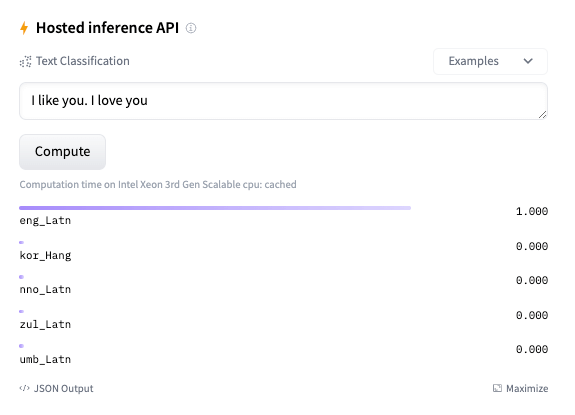
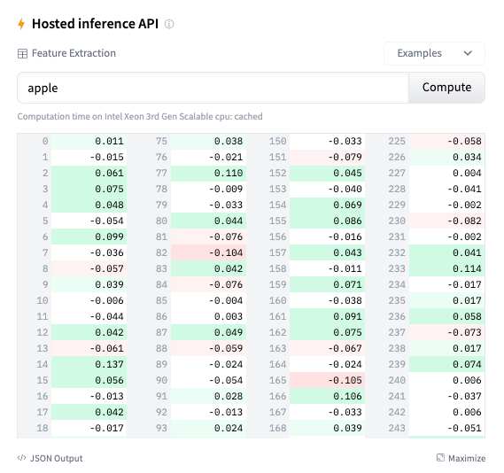

# Welcome fastText to the Hugging Face Hub


[fastText](https://fasttext.cc/) is a library for efficient learning of text representation and classification. [Open-sourced](https://fasttext.cc/blog/2016/08/18/blog-post.html) by Meta AI in 2016, fastText integrates key ideas that have been influential in natural language processing and machine learning over the past few decades: representing sentences using bag of words and bag of n-grams, using subword information, and utilizing a hidden representation to share information across classes. 

To speed up computation, fastText uses hierarchical softmax, capitalizing on the imbalanced distribution of classes. All these techniques offer users scalable solutions for text representation and classification.

Hugging Face is now hosting official mirrors of word vectors of all 157 languages and the latest model for language identification. This means that using Hugging Face, you can easily download and use the models with a few commands. 

### Finding models

Word vectors for 157 languages and the language identification model can be found in the [Meta AI](https://huggingface.co/facebook) org. For example, you can find the model page for English word vectors [here](https://huggingface.co/facebook/fasttext-en-vectors) and the language identification model [here](https://huggingface.co/facebook/fasttext-language-identification).


### Widgets
This integration includes support for text classification and feature extraction widgets. Try out the language identification widget [here](https://huggingface.co/facebook/fasttext-language-identification) and feature extraction widget [here](https://huggingface.co/facebook/fasttext-en-vectors)!




### How to use

Here is how to load and use a pre-trained vectors:

```python
>>> import fasttext
>>> from huggingface_hub import hf_hub_download

>>> model_path = hf_hub_download(repo_id="facebook/fasttext-en-vectors", filename="model.bin")
>>> model = fasttext.load_model(model_path)
>>> model.words

['the', 'of', 'and', 'to', 'in', 'a', 'that', 'is', ...]

>>> len(model.words)

145940

>>> model['bread']

array([ 4.89417791e-01,  1.60882145e-01, -2.25947708e-01, -2.94273376e-01,
       -1.04577184e-01,  1.17962055e-01,  1.34821936e-01, -2.41778508e-01, ...])
```

Here is how to use this model to query nearest neighbors of an English word vector:

```python
>>> import fasttext
>>> from huggingface_hub import hf_hub_download

>>> model_path = hf_hub_download(repo_id="facebook/fasttext-en-nearest-neighbors", filename="model.bin")
>>> model = fasttext.load_model(model_path)
>>> model.get_nearest_neighbors("bread", k=5)

[(0.5641006231307983, 'butter'), 
 (0.48875734210014343, 'loaf'), 
 (0.4491206705570221, 'eat'), 
 (0.42444291710853577, 'food'), 
 (0.4229326844215393, 'cheese')]
```

Here is how to use this model to detect the language of a given text:

```python
>>> import fasttext
>>> from huggingface_hub import hf_hub_download

>>> model_path = hf_hub_download(repo_id="facebook/fasttext-language-identification", filename="model.bin")
>>> model = fasttext.load_model(model_path)
>>> model.predict("Hello, world!")

(('__label__eng_Latn',), array([0.81148803]))

>>> model.predict("Hello, world!", k=5)

(('__label__eng_Latn', '__label__vie_Latn', '__label__nld_Latn', '__label__pol_Latn', '__label__deu_Latn'), 
 array([0.61224753, 0.21323682, 0.09696738, 0.01359863, 0.01319415]))
```

## Would you like to integrate your library to the Hub?

This integration is possible thanks to our collaboration with [Meta AI](https://ai.facebook.com/) and the [`huggingface_hub`](https://github.com/huggingface/huggingface_hub) library, which enables all our widgets and the API for all our supported libraries. If you would like to integrate your library to the Hub, we have a [guide](https://huggingface.co/docs/hub/models-adding-libraries) for you!
