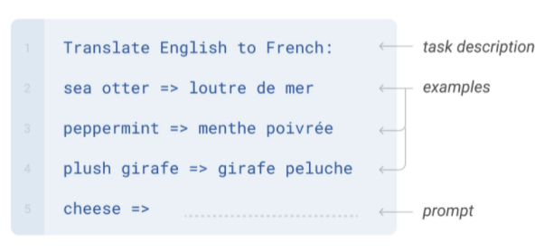
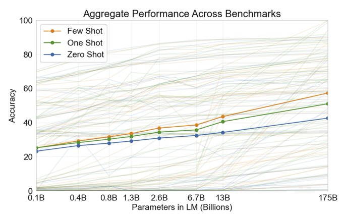
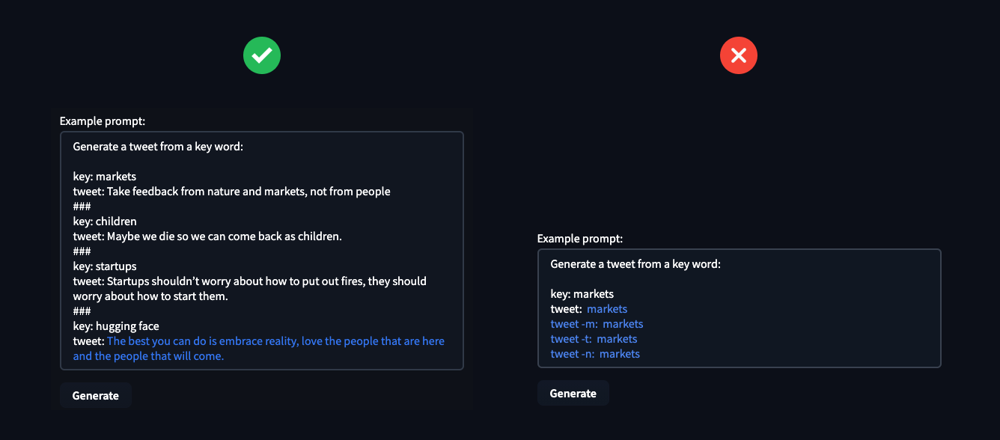
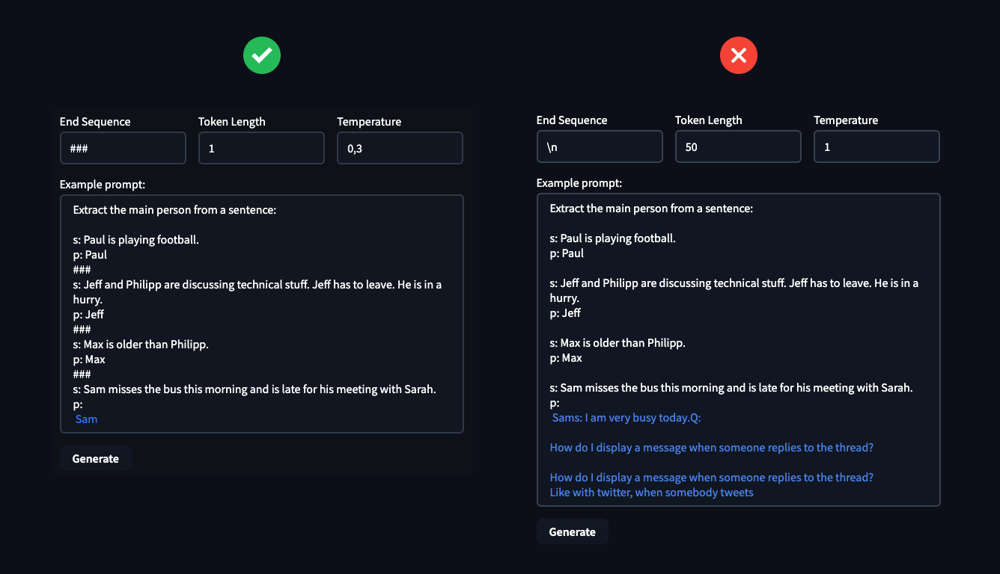

<h1>
    Few-shot learning in practice: GPT-Neo and the 🤗 Accelerated Inference API
</h1>

<div class="blog-metadata">
    <small>Published May 30, 2021.</small>
    <a target="_blank" class="btn no-underline text-sm mb-5 font-sans" href="https://github.com/huggingface/blog/blob/master/sagemaker-distributed-training-seq2seq.md">
        Update on GitHub
    </a>
</div>

<div class="author-card">
    <a href="/philschmid">
        
        <div class="bfc">
            <code>philschmid</code>
            <span class="fullname">Philipp Schmid</span>
        </div>
    </a>
</div>

<script defer src="https://gpt-neo-accelerated-inference-api.s3-eu-west-1.amazonaws.com/fewShotInference.js"></script>
<few-shot-inference-widget ></few-shot-inference-widget>


## What is Few-Shot Learning?

Few-Shot Learning refers to the practice of feeding a machine learning model with a very small amount of training data to guide its predictions, like a few examples at inference time, as opposed to standard fine-tuning techniques which require a relatively large amount of training data for the pre-trained model to adapt to the desired task with accuracy.

This technique has been mostly used in computer vision, but with some of the latest Language Models, like [EleutherAI GPT-Neo](https://www.eleuther.ai/projects/gpt-neo/) and [OpenAI GPT-3](https://openai.com/blog/gpt-3-apps/), we can now use it in Natural Language Processing (NLP). 

In NLP, Few-Shot Learning can be used with Large Language Models, which have learned to perform a wide number of tasks implicitly during their pre-training on large text datasets. This enables the model to generalize, that is to understand related but previously unseen tasks, with just a few examples.

Few-Shot NLP examples consist of three main components: 

- **Task Description**: A short description of what the model should do, e.g. "Translate English to French"
- **Examples**: A few examples showing the model what it is expected to predict, e.g. "sea otter => loutre de mer"
- **Prompt**: The beginning of a new example, which the model should complete by generating the missing text, e.g. "cheese => "

  
<small>Image from <a href="https://arxiv.org/abs/2005.14165" target="_blank">Language Models are Few-Shot Learners</a></small>

If you're wondering how many training examples is a prompt worth, well, so did we, and Hugging Face researchers [Teven Le Scao](https://twitter.com/Fluke_Ellington) and [Sasha Rush](https://twitter.com/srush_nlp) ran the numbers in their ["How Many Data Points is a Promp Work?"](https://arxiv.org/abs/2103.08493) paper.

Creating these few-shot examples can be tricky, since you need to articulate the “task” you want the model to perform through them. A common issue is that models, especially smaller ones, are very sensitive to the way the examples are written.

OpenAI showed in the [GPT-3 Paper](https://arxiv.org/abs/2005.14165) that the few-shot prompting ability improves with the number of language model parameters.

  
<small>Image from <a href="https://arxiv.org/abs/2005.14165" target="_blank">Language Models are Few-Shot Learners</a></small>

An approach to optimize Few-Shot Learning in production is to learn a common representation for a task and then train task-specific classifiers on top of this representation.

---

## What is GPT-Neo?

GPT⁠-⁠Neo is a family of transformer-based language models from [EleutherAI](https://www.eleuther.ai/projects/gpt-neo/) based on the GPT architecture. [EleutherAI](https://www.eleuther.ai)'s primary goal is to train a model that is equivalent in size to GPT⁠-⁠3 and make it available to the public under an open license.

All of the currently available GPT-Neo checkpoints are trained with the Pile dataset, a large text corpus that is extensively documented in ([Gao et al., 2021](https://arxiv.org/abs/2101.00027)). As such, it is expected to function better on the text that matches the distribution of its training text; we recommend keeping this in mind when designing systems that rely on its output and in considering how the system might impact different groups of users. For further discussion on these questions, we refer you to e.g. ([Bender et al., 2021](https://dl.acm.org/doi/10.1145/3442188.3445922))

---

## 🤗 Accelerated Inference API

The Accelerated Inference API is our hosted service to run inference on any of the 10,000+ models publicly available on the 🤗 Model Hub, or your own private models, via simple API calls. The API includes acceleration on CPU and GPU with [up to 100x speedup](https://huggingface.co/blog/accelerated-inference) compared to out of the box deployment of Transformers.

To integrate Few-Shot Learning predictions with `GPT-Neo` in your own apps, you can use the 🤗 Accelerated Inference API with the code snippet below. You can find your API Token [here](https://huggingface.co/settings/token), if you don't have an account you can get started [here](https://huggingface.co/pricing).

```python
import json
import requests

API_TOKEN = ""

def query(payload='',parameters=None,options={'use_cache': False}):
    API_URL = "https://api-inference.huggingface.co/models/EleutherAI/gpt-neo-2.7B"
		headers = {"Authorization": f"Bearer {API_TOKEN}"}
    body = {"inputs":payload,'parameters':parameters,'options':options}
    response = requests.request("POST", API_URL, headers=headers, data= json.dumps(body))
    try:
      response.raise_for_status()
    except requests.exceptions.HTTPError:
        return "Error:"+" ".join(response.json()['error'])
    else:
      return response.json()[0]['generated_text']

parameters = {
    'max_new_tokens':25,  # number of generated tokens
    'temperature': 0.5,   # controlling the randomness of generations
    'end_sequence': "###" # stopping sequence for generation
}

prompt="...."             # few-shot prompt

data = query(prompt,parameters,options)
```

---
## Practical Insights

Here are some practical insights, which help you get started using `GPT-Neo` and the 🤗 Accelerated Inference API.

Since `GPT-Neo` (2.7B) is about 60x smaller than `GPT-3` (175B), it does not generalize so well to zero-shot problems and needs 3-4 examples to achieve good results. When you provide more examples `GPT-Neo` understands the task and takes the `end_sequence` into account, which allows us to control the generated text pretty well. 



The hyperparameters `End Sequence`, `Token Length` & `Temperature` can be used to control the `text-generation` of the model and you can use this to your advantage to solve the task you need. 



In the example, you can see how important it is to define your hyperparameters. These can make the difference between solving your task or failing miserably.


---

If you want to feel the speed on our infrastructure, start a [free trial](https://huggingface.co/pricing) and we’ll get in touch. If you want to benefit from our experience optimizing inference on your own infrastructure participate in our [🤗 Expert Acceleration Program](https://huggingface.co/support).
