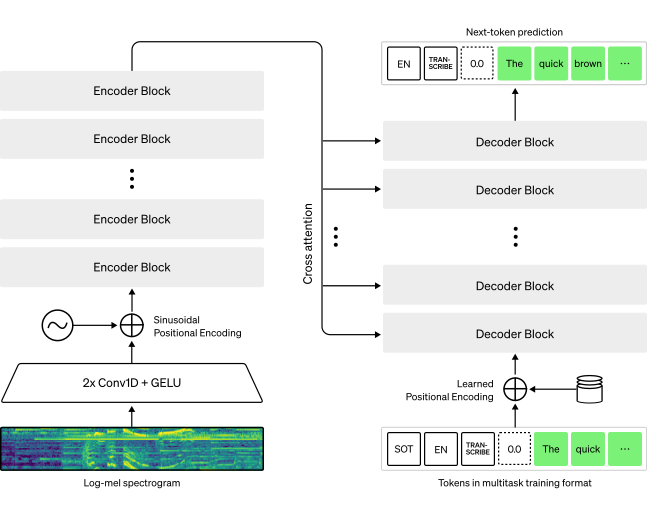
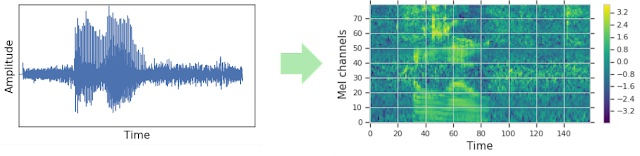

# Fine-Tune Whisper For English ASR with 🤗 Transformers

<div class="blog-metadata">
    <small>Published 25 October, 2022.</small>
    <a target="_blank" class="btn no-underline text-sm mb-5 font-sans" href="https://github.com/huggingface/blog/blob/main/fine-tune-whisper-english.md">
        Update on GitHub
    </a>
</div>

<div class="author-card">
    <a href="/sanchit-gandhi"> 
        
        <div class="bfc">
            <code>sanchit-gandhi</code>
            <span class="fullname">Sanchit Gandhi</span>
        </div>
    </a>
</div>

<a target="_blank" href="https://colab.research.google.com/github/sanchitgandhi/notebooks/blob/master/fine_tune_whisper_for_english_asr.ipynb">
    
</a>

TODO:
- [ ] Colab link

In this blog, we present a step-by-step guide on how to fine-tune Whisper 
for any English ASR dataset using Hugging Face 🤗 Transformers.

Whisper is a pre-trained model for automatic speech recognition (ASR) 
published in [September 2022](https://openai.com/blog/whisper/) by the authors Alec Radford et al. 
Unlike many of its predecessors which are pre-trained on un-labelled audio data, 
Whisper is pre-trained on a vast quantity of **labelled** audio-transcription data, 
680,000 hours to be precise\\({}^1\\). This is an order of magnitude larger than the 
unlabelled audio data used to train Wav2Vec 2.0 (60,000 hours).

When scaled to 680,000 hours of labelled pre-training data, Whisper models 
demonstrate a strong ability to generalise to many datasets and domains.
The pre-trained checkpoints achieve competitive results to state-of-the-art ASR systems, 
with near 3% word error rate (WER) on the test-clean subset of LibriSpeech ASR 
(c.f. Table 8 of the [paper](https://cdn.openai.com/papers/whisper.pdf)). 
Through fine-tuning, the pre-trained checkpoints can be adapted for specific 
datasets to further improve upon these results.

The Whisper model is a Transformer based encoder-decoder architecture, 
also referred to as a sequence-to-sequence model. It maps a sequence 
of raw audio inputs into a sequence of text outputs. The raw audio inputs 
are first converted to a log-mel spectrogram by action of the feature extractor. 
The spectrogram is then input to the Transformer encoder to generate a sequence 
of encoder hidden-states. The decoder auto-regressively predicts text tokens 
conditional on the previous tokens and the encoder hidden-states. 
Figure 1 summarises the architecture of the Whisper model.

<figure>

<figcaption align = "center"><b>Figure 1:</b> Whisper model. The architecture 
follows the standard Transformer-based encoder-decoder architecture. A 
log-Mel spectrogram is input to the encoder. The last encoder 
hidden-states are input to the decoder via cross-attention mechanisms. The 
decoder autoregressively predicts text tokens, jointly conditional on the 
encoder hidden-states and previously predicted tokens.\\({}^2\\)</figcaption>
</figure>

Whisper is both pre-trained and fine-tuned using the cross-entropy objective function, 
a common objective function for training encoder-decoder systems on classification tasks: 
the system is trained to correctly classify the target text token from a pre-defined 
vocabulary of text tokens.

<!--- In this notebook, we will fine-tune Whisper end-to-end (no need for an LM...). --->
The Whisper checkpoints come in five configurations of varying model size.
The smallest four are trained either on English-only or multilingual data.
The largest checkpoint is multilingual only. All the pre-trained checkpoints are available
on the 🤗 Hub. The checkpoints are summarised in the following table with links to the 
models on the 🤗 Hub:

|  Size  | Parameters |                  English-only model                  |                Multilingual model                 |  
|:------:|:----------:|:----------------------------------------------------:|:-------------------------------------------------:|
|  tiny  |    39 M    |  [✓](https://huggingface.co/openai/whisper-tiny.en)  | [✓](https://huggingface.co/openai/whisper-tiny.)  |
|  base  |    74 M    |  [✓](https://huggingface.co/openai/whisper-base.en)  |  [✓](https://huggingface.co/openai/whisper-base)  |
| small  |   244 M    | [✓](https://huggingface.co/openai/whisper-small.en)  | [✓](https://huggingface.co/openai/whisper-small)  |
| medium |   769 M    | [✓](https://huggingface.co/openai/whisper-medium.en) | [✓](https://huggingface.co/openai/whisper-medium) |
| large  |   1550 M   |                          x                           | [✓](https://huggingface.co/openai/whisper-large)  |                          |

For demonstration purposes, we'll fine-tune of the `"small"` checkpoints with 244M params (~= 1GB).
Since we're interested in English ASR, we'll pick the English-only version of this checkpoint 
[small.en](https://huggingface.co/openai/whisper-small.en).

As for our data, we'll train and evaluate our system on [_LibriSpeech ASR_](https://huggingface.co/datasets/librispeech_asr), 
a popular English speech recognition dataset with narrated audiobook data taken
from the [LibriVox](https://librivox.org/) project. LibriSpeech is one 
of the most actively used speech recognition datasets, with  

------------------------------------------------------------------------

\\({}^1\\) The name Whisper follows from the acronym “WSPSR”, which stands for “Web-scale Supervised Pre-training for Speech Recognition”.

\\({}^2\\) Figure source: [Whisper blog](https://openai.com/blog/whisper/)

Prepare Environment
------------------------------------------
We'll utilise several popular Python packages to fine-tune the Whisper model.
We'll use `datasets` to download and prepare our training data and 
`transformers` to load and train our Whisper model. We'll also require
the `soundfile` package to pre-process audio files, `evaluate` and `jiwer` to
assess the performance of our model, and `wandb` for logging. Finally, we'll
use `gradio` to build a flashy demo of our fine-tuned model.

```bash
!pip install datasets>=2.6.1
!pip install transformers>=4.23.1
!pip install librosa
!pip install evaluate>=0.30
!pip install jiwer
!pip install wandb
!pip install gradio
```

We strongly advise you to upload model checkpoints directly the [Hugging Face Hub](https://huggingface.co/) while training.
The Hub provides:
- Integrated version control: you can be sure that no model checkpoint is lost during training.
- Tensorboard logs: track important metrics over the course of training.
- Model cards: an easy way to share your model with the community!

With Transformers, automatic upload of checkpoints to the Hub is easy and can be 
enabled with just one line of code!

Linking the notebook to the Hub is straightforward - it simply requires entering your 
authentication token from the Hugging Face website when prompted 
(sign-up [here](https://huggingface.co/join) if you haven't done so already!)

```python
from huggingface_hub import notebook_login

notebook_login()
```

**Print Output:**
```bash
Login successful
Your token has been saved to /root/.huggingface/token
Authenticated through git-credential store but this isn't the helper defined on your machine.
You will have to re-authenticate when pushing to the Hugging Face Hub. Run the following command in your terminal to set it as the default

git config --global credential.helper store
```

Finally, install Git-LFS to be able to push large model weights to the Hub:

```python
!apt install git-lfs
```

Load Dataset
------------------------------------------

Using 🤗 Datasets, downloading and preparing data is extremely simple. 
We can download and prepare the LibriSpeech dataset in just one line of code. 
For this notebook, we'll download the `"clean'` config of the dataset, with 
approximately 100h of training data and 5h each of validation and test data:

```python
from datasets import load_dataset

librispeech_asr = load_dataset("librispeech_asr", "clean")

print(librispeech_asr)
```

**Print Output:**
```
INSERT
```

Listen to the audio data? Options:
1. Convert our 1-dimensional array into a human-friendly format (mp3 or wav).
2. Look to the Hugging Face Hub!

Option 2 seems much easier to me! Let's head over to the LibriSpeech ASR dataset card on the Hugging Face Hub: https://huggingface.co/datasets/librispeech_asr

The dataset viewer shows us the first 100 samples of any dataset. What's more, it's loaded up 
the audio samples ready for us to listen to in real-time. If we hit the play button on the 
first sample, we can listen to the audio and see the corresponding text. Have a scroll through 
the samples for the train and test sets to get a better feel for the audio and text data that we're 
dealing with.

LibriSpeech is but one English ASR dataset that we can download from the Hub - there are plenty more available to us! 
To view the range of datasets available for English ASR, follow the link: [English ASR on the 🤗 Hub](https://huggingface.co/datasets?language=language:en&task_categories=task_categories:automatic-speech-recognition&sort=downloads).

Prepare Feature Extractor, Tokenizer and Data
------------------------------------------

The ASR pipeline can be de-composed into three states: a feature extractor 
which pre-processes the raw audio-inputs, the model which performs the 
sequence-to-sequence mapping, and a tokenizer which post-processes the 
model outputs to text format. This pipeline is summarised in Figure X?

In 🤗 Transformers, the Whisper model has an associated feature extractor and tokenizer, 
called [WhisperFeatureExtractor](https://huggingface.co/docs/transformers/main/model_doc/whisper#transformers.WhisperFeatureExtractor)
and [WhisperTokenizer](https://huggingface.co/docs/transformers/main/model_doc/whisper#transformers.WhisperTokenizer),
respectively.

We'll go through details of the feature extractor and tokenizer one-by-one!

### Create WhisperFeatureExtractor

Speech is represented by a 1-dimensional signal that varies with time. 
The value of the signal at any given time-step is the _amplitude_ of the 
signal at that point. From the amplitude information alone, we can 
reconstruct the frequency spectrum of the audio and recover all acoustic features.

Since speech is continuous, it contains an infinite number of amplitude values.
This poses problems for computer devices which expect finite arrays. Thus, we 
discretise our speech signal by _sampling_ values from our signal at fixed time steps.
The interval with which we sample our audio is known as the _sampling rate_, 
and is usually measured in samples/sec or _Hertz (Hz)_. Sampling with a higher 
sampling rate results in a better approximation of the continuous speech signal, 
but also necessitates storing more values per second. 

It's crucial that we match the sampling rate of our audio inputs to the sampling
rate expected by our model, as audio signals with different sampling rates have very
different distributions. Audio samples should only ever be processed with the 
correct sampling rate. Failing to do so can lead to unexpected results!
For instance, taking an audio sample with a sampling rate of 16kHz and listening 
to it with a sampling rate of 8kHz will make the audio sound as though it's in half-speed. 
In the same way, passing an audio with the wrong sampling rate to an ASR model can 
falter a system that was expecting one sampling rate and receives another. We don't want
to inadvertently train an ASR system on slow-motion speech...

The Whisper feature extractor performs two operations. It first pads a batch of audio samples
such that all samples have an input length of 30s. Samples shorter than 30s will be padded to 30s
by appending zeros to the end of the sequence (zeros in an audio signal correspond to zero 
amplitude, or no signal / or silence). Samples longer than 30s will be truncated to 30s.
Since all elements in the batch are padded to a maximum length in the input space, we 
don't require an attention mask when forwarding the audio inputs to the Whisper model. 
Whisper is unique in this regard - with most audio models, you can expect to provide 
an attention mask that details where sequences have been padded, and thus where they
should be ignored in the self-attention mechanism. Whisper is trained to operate without
an attention mask and infer directly from the speech signals where to ignore the inputs.

The second operation that the Whisper feature extractors performs is converting the 
padded audio arrays to log-Mel spectrograms. These spectrograms are 
a visual representation of the frequencies of a signal, rather like a Fourier transform. 
An example spectrogram is shown in Figure 2. Along the y-axis are the Mel channels, 
which correspond to particular frequency bins. Along the x-axis is time. The colour of 
each pixel corresponds to the log-intensity of that frequency bin at a given time. The 
log-Mel spectrogram is the form of input expected by the Whisper model.

<!--- The Mel channels (frequency bins) are standard in speech processing, and chosen to approximate
the human auditory range. All we need to know for the purpose of Whisper is that 
the spectrogram is a visual representation of the frequencies in the signal. For more detail
on the Mel channels, refer to [Mel-frequency cepstrum](https://en.wikipedia.org/wiki/Mel-frequency_cepstrum). --->

<figure>

<figcaption align = "center"><b>Figure 2:</b> Conversion of sampled audio array to log-Mel spectrogram.
Left: sampled 1-dimensional audio signal. Right: corresponding log-Mel spectrogram.\\({}^1\\)</figcaption>
</figure>

Luckily for us, the 🤗 Transformers Whisper feature extractor performs both the
padding and spectrogram conversion in just one line of code! Let's go ahead 
and instantiate a Whisper feature extractor. The feature extractor requires the
following parameters to be defined:
 - `feature_size` (int): the number of log-Mel channels. Default = `80`.
 - `sampling_rate` (int): the sampling rate on which the model is trained on. Default = `16000`.
 - `hop_length` (int):  the length of the overlapping windows for the short-time Fourier transform (STFT) used to obtain the Mel Frequency coefficients. Default = `160`.
 - `chunk_length` (int): The maximum number of chunks of `sampling_rate` samples used to pad shorter input sequences and trim longer ones. Default = 30.
 - `n_fft` (int): size of the Fourier transform. Default = `400`.
 - `padding_value` (float): padding value used to pad audio sequences shorter than max length. Should be set to zero to correspond to silence. Default = `0`.
 - `return_attention_mask` (bool): whether the model should make use of an
     `attention_mask` for batched inference. In general, the Whisper model should
     **not** make use of the `attention_mask` to mask padded tokens. Default = `False`

We'll load the feature extractor with the default values, and thus omit them when we instantiate the object:

```python
from transformers import WhisperFeatureExtractor

feature_extractor = WhisperFeatureExtractor()
```

### Create WhisperTokenizer

Now let's look at how to load a Whisper tokenizer. The Whisper model outputs 
a vector of dimensionality equal to the number of vocabulary items. 
This vector contains a single 1 in the position of the predicted text token, 
and zeros elsewhere(typically referred to as a _one-hot encoding_). 
The tokenizer maps from the one-hot encoding vector to the actual text string 
(e.g. [0, 1, 0, 0, ..., 0]^T -> "cat"). 

Traditionally, when using encoder-only models for CTC decoding, we are 
required to train a CTC tokenizer for each dataset that we use, as we 
have to match the CTC vocabulary to that of our specific dataset.
One of the advantages of using an encoder-decoder architecture is that 
we can leverage the text tokenizer from the decoder model directly. 
In the case of Whisper, the decoder's tokenizer is that of GPT-2, 
with some minor modifications to handle speech transcription. 
This tokenizer has an expansive byte-pair vocabulary that is applicable 
to almost all English ASR applications. Thus, we can load the tokenizer 
and use it for fine-tuning without any further modifications:

```python
from transformers import WhisperTokenizer

tokenizer = WhisperTokenizer.from_pretrained("openai/whisper-small.en")
```

### Combine To Create A WhisperProcessor

To simplify using the feature extractor and tokenizer, we can _wrap_ 
both into a single `WhisperProcessor` class. This processor object 
inherits from the `WhisperFeatureExtractor` and `WhisperProcessor`, 
and can be used on the audio inputs and model predictions as required. 
In doing so, we only need to keep track of two objects during training: 
the `processor` and the `model`.

```python
from transformers import WhisperProcessor

processor = WhisperProcessor(feature_extractor=feature_extractor, tokenizer=tokenizer)
```

### Prepare Data
We've spoken heavily about the importance of the sampling rate and 
the fact that we need to match the sampling rate of our audio to that 
of the Whisper model (16kHz). We can perform a simple equality check 
to see whether our sampling rates match. If the sampling rate of the 
audio is different to that of the model, we can _resample_ the audio 
from its original sampling rate to the model's sampling rate. Here, 
we set the sampling rate of the `"audio"` column to the model's sampling 
rate. This does not change the audio in-place, but rather signals to 
`datasets` to re-sample the audio the first time it is loaded.

```python
import datasets

dataset_sampling_rate = next(iter(librispeech_asr.values())).features["audio"].sampling_rate
model_sampling_rate = feature_extractor.sampling_rate

if dataset_sampling_rate != model_sampling_rate:
    librispeech_asr = librispeech_asr.cast_column(
        "audio", datasets.features.Audio(sampling_rate=model_sampling_rate)
    )
```

Now we can write a function to prepare our data ready for the model.
First, we load and (possibly) resample the audio data by calling `batch["audio"]`. 
As explained above, 🤗 Datasets performs any necessary resampling operations on the fly. 
Next, we use the feature extractor to generate the log-Mel spectrogram `input_features` 
from our 1-dimensional audio array. Finally, we encode the transcriptions to label ids 
through use of the tokenizer:

```python
def prepare_dataset(batch):
    audio = batch["audio"]

    # generate log-Mel input features from input audio array 
    batch["input_features"] = feature_extractor(audio["array"], sampling_rate=audio["sampling_rate"]).input_features[0]

    # generate label ids from target text
    batch["labels"] = tokenizer(batch["text"]).input_ids
    return batch
```

We can apply the data preparation function to all of our training examples using dataset's `.map` method:

```python
librispeech_asr = librispeech_asr.map(prepare_dataset, remove_columns=librispeech_asr.column_names["train"], num_proc=4)
```

Alright! With that we have our data fully prepared for training! 
Let's continue and take a look at how we can use this data to 
fine-tune Whisper.

**Note**: Currently `datasets` makes use of both [`torchaudio`](https://pytorch.org/audio/stable/index.html) and [`librosa`](https://librosa.org/doc/latest/index.html) for audio loading and resampling. 
If you wish to implement your own customised data loading/sampling, you can use the `"path"` column to yield the audio file path and disregard the `"audio"` column.

------------------------------------------------------------------------

\\({}^1\\) Figure source: [SpecAugment blog](https://ai.googleblog.com/2019/04/specaugment-new-data-augmentation.html)

Training & Evaluation
---------------------
Now that we've prepared our data, we're ready to dive into the training pipeline. 
The [🤗 Trainer](https://huggingface.co/transformers/master/main_classes/trainer.html?highlight=trainer)
is going to do much of the heavy lifting for us. All we need to do is:

- Define a data collator: the data collator takes our pre-processed data and prepares PyTorch tensors ready for the model.

- Evaluation metrics: during evaluation, the model should be evaluated using the [word error rate (WER)](https://huggingface.co/metrics/wer) metric. We should define a `compute_metrics` function accordingly.

- Load a pre-trained checkpoint: we need to load a pre-trained checkpoint and configure it correctly for training.

- Define the training configuration: this will be used by the 🤗 Trainer...

Once we've fine-tuned the model, we will evaluate it on the test data to verify that we have correctly trained it 
and improved its ASR abilities compared to the pre-trained checkpoint alone.

### Define a Data Collator

The data collator for a sequence-to-sequence speech model is unique in the sense that it 
treats the `input_features` and `labels` independently: the  `input_features` must be 
handled by the feature extractor, and the `labels` by the tokenizer.

The `input_features` are already padded to 30s and converted to a log-Mel spectrogram 
of fixed dimension, so all we do is convert them to batched PyTorch tensors using 
the feature extractor's `.pad` method with `return_tensors=pt`.

The `labels` on the other hand are un-padded. We first pad them to the maximum length in
the batch using the tokenizer's `.pad` method. The padding tokens are then replaced by 
`-100` so that these tokens are **not** taken into account when computing the loss. 

+ EOS token

We can leverage the `WhisperProcessor` we defined earlier to perform both the 
feature extractor and the tokenizer operations:

```python
import torch

from dataclasses import dataclass
from typing import Any, Dict, List, Union

@dataclass
class DataCollatorSpeechSeq2SeqWithPadding:
    """
    Data collator that will dynamically pad the inputs and labels received.
    Args:
        processor ([`WhisperProcessor`])
            The processor used for processing the data.
    """

    processor: Any

    def __call__(self, features: List[Dict[str, Union[List[int], torch.Tensor]]]) -> Dict[str, torch.Tensor]:
        # split inputs and labels since they have to be of different lengths and need different padding methods
        # first treat the audio inputs by simply returning torch tensors
        input_features = [{"input_features": feature["input_features"]} for feature in features]
        batch = self.processor.feature_extractor.pad(input_features, return_tensors="pt")

        # append the EOS token to the end of all label sequences
        eos_token_id = self.processor.tokenizer.eos_token_id
        label_features = [{"input_ids": feature["labels"].append(eos_token_id)} for feature in features]
        # pad the labels to max length
        labels_batch = self.processor.tokenizer.pad(label_features, return_tensors="pt")

        # replace padding with -100 to ignore loss correctly
        labels = labels_batch["input_ids"].masked_fill(labels_batch.attention_mask.ne(1), -100)

        batch["labels"] = labels

        return batch
```

Let's initialize the data collator we've just defined:

```python
data_collator = DataCollatorSpeechSeq2SeqWithPadding(processor=processor)
```

### Evaluation Metrics
Next, we define the evaluation metric we'll use on our evaluation
set. We'll use the WER metric, the 'de-facto' metric for assessing 
ASR systems. For more information, refer to the WER [docs](https://huggingface.co/metrics/wer).

```python
import evaluate
metric = evaluate.load("wer")
```

We then simply have to define a function that takes our model 
predictions and returns the WER metric. This function, called
`compute_metrics`, first replaces `-100` with the `pad_token_id`
in the `label_ids` (undoing the step we applied in the 
data collator to ignore padded tokens correctly in the loss).
It then decodes the predicted and label ids to strings. Finally,
it computes the WER between the predictions and reference labels:

```python
def compute_metrics(pred):
    pred_ids = pred.predictions
    label_ids = pred.label_ids

    # replace -100 with the pad_token_id
    label_ids[label_ids == -100] = tokenizer.pad_token_id

    # we do not want to group tokens when computing the metrics
    pred_str = tokenizer.batch_decode(pred_ids, skip_special_tokens=True)
    label_str = tokenizer.batch_decode(label_ids, skip_special_tokens=True)

    wer = metric.compute(predictions=pred_str, references=label_str)

    return {"wer": wer}
```

### Load a Pre-Trained Checkpoint

Now let's load the pre-trained Whisper `"small.en"` checkpoint:

```python
from transformers import WhisperForConditionalGeneration

model = WhisperForConditionalGeneration.from_pretrained("openai/whisper-small.en")
```
**Print Output:**
```bash
    
```

The purpose of the encoder block is to extract context dependent 
acoustic features from the input speech spectrogram. The decoder
block takes these features and generates the corresponding 
transcriptions. Since Whisper is pre-trained on 680,000h of data, 
the audio encoder has seen a vast amount of audio data and is likely 
to be sufficiently trained during pre-training. Thus, it should 
not require further fine-tuning, meaning we can set the attribute 
`requires_grad` to `False` for all the parameters in the encoder.
This makes training faster and saves a significant amount of memory:
```python
model.freeze_encoder()
```

During pre-training, the target text data is normalised to a standard 
format. This format is both cased and punctuated, and thus differs from
the format of the text in LibriSpeech which is un-cased and un-punctuated:
```
Pre-training: "The cat sat on the mat."
Fine-tuning:  "THE CAT SAT ON THE MAT"
```

Therefore, we need to train the text decoder to learn this new style of 
text formatting through fine-tuning.

### Define the Training Configuration
In a final step, we define all the parameters related to training. A subset of parameters are 
explained below:
- `output_dir`: local directory in which to save the model weights. This will also be the repository name on the [🤗 Hub](https://huggingface.co/).
- `generation_max_length`: maximum number of tokens to autoregressively generate during evaluation.
- `save_steps`: during training, intermediate checkpoints will be saved and uploaded asynchronously to the hub every `save_steps` training steps.
- `eval_steps`: during training, evaluation of intermediate checkpoints will be performed every `eval_steps` training steps.

For more detail on the other training arguments, refer to the Seq2SeqTrainingArguments [docs](https://huggingface.co/docs/transformers/main_classes/trainer#transformers.Seq2SeqTrainingArguments).

```python
from transformers import Seq2SeqTrainingArguments

training_args = Seq2SeqTrainingArguments(
  output_dir="./whisper-small.en-librispeech-100h",  # change to a repo name of your choice
  per_device_train_batch_size=64,
  learning_rate=1e-4,
  warmup_steps=500,
  num_train_epochs=3,
  gradient_checkpointing=True,
  fp16=True,
  group_by_length=True,
  evaluation_strategy="steps",
  per_device_eval_batch_size=32,
  predict_with_generate=True,
  generation_max_length=225,
  save_steps=500,
  eval_steps=500,
  logging_steps=25,
  report_to=["wandb"],
  push_to_hub=True,
)
```

**Note**: if one does not want to upload the model checkpoints to the 🤗 Hub, 
set `push_to_hub=False`.

We can forward the training arguments to the 🤗 Trainer along with our model,
dataset, data collator and `compute_metrics` function:

```python
from transformers import Seq2SeqTrainer

trainer = Seq2SeqTrainer(
    args=training_args,
    model=model,
    train_dataset=librispeech_asr["train"],
    eval_dataset=librispeech_asr["test"],
    data_collator=data_collator,
    compute_metrics=compute_metrics,
    tokenizer=processor.feature_extractor,
)
```

And with that, we're ready to start training!

### Training
<!--- 
Note: much of the following is adapted from "Fine-Tune Wav2Vec2..." 
--->
Training will take approximately X-Y minutes depending on the GPU 
allocated to this Google Colab. Whilst the fine-tuned model yields
satisfactory results on the LibriSpeech test dataset, it is by no 
means optimal. The purpose of this notebook is to demonstrate how 
the pre-trained Whisper checkpoints can be fine-tuned on any English 
ASR dataset.

If using this Google Colab directly to fine-tune a Whisper model,
you should make sure that training isn't interrupted due to inactivity. 
A simple workaround to prevent this is to paste the following code into the
console of this tab (_right mouse click_ -> _inspect_ -> _Console tab_ ->
_insert code_).

```javascript
function ConnectButton(){
    console.log("Connect pushed"); 
    document.querySelector("#top-toolbar > colab-connect-button").shadowRoot.querySelector("#connect").click() 
}
setInterval(ConnectButton, 60000);
```

To launch training, simply execute:
```python
trainer.train()
```

Depending on your GPU or the one allocated to Google Colab, it is possible 
that you will encounter a CUDA `"out-of-memory"` error when you start training. In this case,
you can reduce the `per_device_train_batch_size` incrementally by factors of 2 
and employ [`gradient_accumulation_steps`](https://huggingface.co/docs/transformers/main_classes/trainer#transformers.Seq2SeqTrainingArguments.gradient_accumulation_steps)
to compensate.

**Print Output:**

| Step | Training Loss | Validation Loss | WER | Runtime | Samples per Second |
|------|---------------|-----------------|-----|---------|--------------------|


The final WER is X%, not bad for 100h of data! Our demo model would have probably 
made it on the official [leaderboard](https://paperswithcode.com/sota/speech-recognition-on-librispeech-test-clean).

The training results can now be uploaded to the Hub. To do so, execute the `push_to_hub` command:

```python
trainer.push_to_hub()
```

You can now share this model with anyone using the link on the 🤗 Hub. They can also 
load it with the identifier `"your-username/the-name-you-picked"`, for instance:

```python
from transformers import WhisperForConditionalGeneration, WhisperProcessor

model = WhisperForConditionalGeneration.from_pretrained("sanchit-gandhi/whisper-small.en-librispeech-100h")
processor = WhisperProcessor.from_pretrained("sanchit-gandhi/whisper-small.en-librispeech-100h")
```

### Building a Demo
Now that we've fine-tuned our model we can build a demo to show 
off its ASR capabilities! We'll make use of 🤗 Transformers 
`pipeline` which will take care of the full ASR pipeline, 
right from pre-processing the audio inputs to decoding the 
model predictions. Gradio is arguably the simplest way of building 
a machine learning demo; with Gradio, we can build a demo in 
just a matter of minutes!

Running the example below will generate a Gradio demo where we 
can record speech through the microphone of our computer and input it to 
our fine-tuned Whisper model to transcribe the corresponding text:

```python
from transformers import pipeline
import gradio as gr

p = pipeline(model=repo_name)

def transcribe(audio):
    text = p(audio)["text"]
    return text

iface = gr.Interface(
    fn=transcribe, 
    inputs=gr.Audio(source="microphone", type="filepath"), 
    outputs="text",
    title="Whisper Small (English)",
    description="Realtime demo for English speech recognition using a fine-tuned Whisper small model.",
)

iface.launch()
```

Closing Remarks
---------------------
In this blog, we covered a step-by-step guide on how to fine-tune Whisper for English ASR 
using 🤗 Datasets, Transformers and the Hub. If you're interested in fine-tuning other 
Transformers models, both for English and multilingual ASR, be sure to check out the 
examples scripts at 